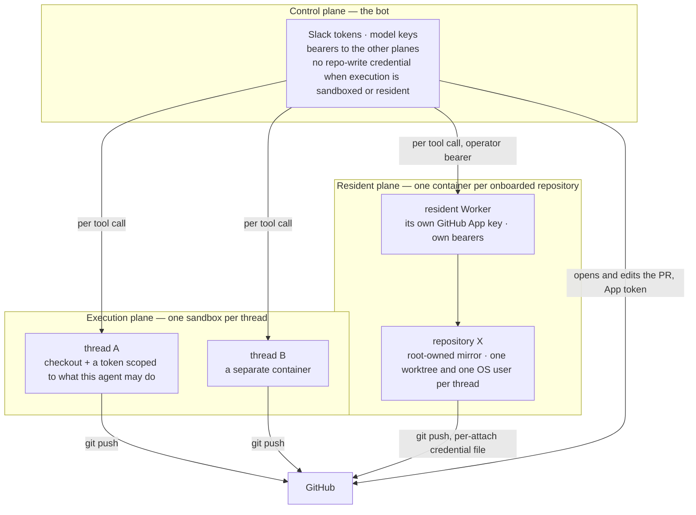

# Security model

OpenSwitchboard runs commands a model wrote. That is the product — an agent that can run the tests, install the dependencies and push the branch — and it is also the whole threat: a prompt-injected instruction in a diff, a hostile request from someone who can reach the bot, or an ordinary bad turn can run anything the tool's environment can reach. The design does not try to make the model's judgment safe. It decides, for every piece of the system, what a compromise of that piece would yield, and arranges the pieces so the answer is always "less than everything".

## Three planes

Execution is split into three planes, each holding a different set of secrets and each a separate blast radius.

**The control plane** is the bot: the one process that is always on, that holds the Slack tokens and the model keys, and that decides what runs. It is deliberately the least valuable thing to steal. With execution sandboxed or resident it holds no credential that can push code; its bearers reach the other Workers only on the routes it needs. Compromising the bot yields a chatty assistant and a view of the conversations it can see.

**The execution plane** is one throwaway container per thread. A cold thread's tools run there: the checkout, the commands, and a GitHub token scoped to that agent's role — a read-only agent's sandbox gets a token minted with read-only permissions, so a review that is talked into pushing physically cannot. Compromising one sandbox yields that thread's checkout and the one repository its token reaches, for the token's one-hour life. The bot host, other threads' sandboxes and the hosting account are unreachable from inside it, and the container expires when the thread goes idle.

**The resident plane** is the always-warm checkouts of repositories an administrator has chosen to onboard, run by a Worker that holds its own GitHub App private key — a copy the bot never sees. Inside a resident, repository code runs under an unprivileged per-thread user with no token in its environment; a credential file readable only by that user exists for the duration of one attach, and only the git operations that need it read it. Compromising the resident Worker yields the repositories it is attached to and nothing about Slack or the model; compromising one thread's worktree yields that worktree.

Two planes never share a credential. The bot's App key and the resident's App key authenticate as the same GitHub App and are two secrets, rotated separately. The bearers between planes are per pair — the bot to the state Worker, the bot to the resident Worker, the bot to the sandbox Worker — and each Worker checks its own before it does anything. The decision record: [Residents hold their own GitHub credential](../decisions/0009-residents-second-credential-domain.md).

**`local` execution collapses the planes on purpose.** The default for a laptop runs tools on the bot host itself, and the boundary becomes whatever user the process runs as. That is fine while everyone who can reach the bot is trusted; it stops being fine the moment untrusted people can reach the coding agent. This is the one capability that is about safety rather than features ([Execution and trust](execution-and-trust.md)).

## What each surface checks

Every way into the system authenticates in-band and fails closed.

- **Slack** authenticates the bot, not the user: the app-level and bot tokens are the credential, and the workspace's own membership decides who can reach a channel the bot is in. Who may then do what is the policy table below.
- **HTTP and MCP ingress** take a bearer token mapped to one identity. No token configured means the endpoint is disabled, not open; a token can act only as its assigned subject; comparisons are constant-time and check every configured token so neither a match's presence nor its position is a timing signal; authorization is decided from headers before a body is read.
- **The dashboards** sit behind one identity gate with three strategies: a Cloudflare Access JWT re-verified in the bot's own code (so a misconfigured or bypassed edge still cannot serve a page), a bearer for a proxy or a script, or nothing at all — which serves loopback callers of a localhost deployment and refuses every remote request. A strategy whose inputs are missing is a startup error, and `none` on a public hostname refuses to start rather than refuse one request at a time.
- **A live run page** is opened by an unguessable per-run token in the link the status card carries, valid for the page, its event stream and its stop control, and expiring with the run. A wrong token, an unknown run and an expired run share one `404`, so existence is never revealed; the token is never logged or persisted. Finished runs are read by identity through the policy table. Record: [A live run page is opened by an unguessable per-run token](../decisions/0013-capability-tokens-for-live-run-pages.md).
- **The dashboard's pages execute no inline script.** Run pages render text from a model, from tool output and from other people's messages, and any of it can be hostile. A Content Security Policy allows script from the page's own origin only; the page's data crosses as a JSON island the serializer escapes so it cannot close itself, and nothing renders HTML from data. An escaping bug becomes text on the page, not code in the operator's browser. Record: [The dashboard runs under a CSP that executes no inline script](../decisions/0014-dashboard-csp-script-src-self.md).

## One policy table, asked once

Authorization is one function over one table of rows: may this actor take this action on this resource? Every surface resolves who is calling into a typed actor once — a Slack user, an ingress token's subject, an Access session, a service token, a schedule — and every command and every agent run then asks the same question against the same rows. Adapters resolve identity; they never decide authority.

The table is closed by default. No matching row is a deny. The condition vocabulary is fixed and validated when the process loads, so a rule that names an unknown condition fails at startup rather than at request time. A denied read of a run is `not_found`, so a caller learns nothing about what exists. Deny reasons are short tokens carrying no resource id, written to the audit line and never to a reply. Record: [Authorization is one policy table](../decisions/0007-authorization-policy-table.md); the vocabulary: [Reference: authorization](../reference/authorization.md).

The grants that configure it follow the same rule. An actor's entry has three axes — actions, channels, repositories — and an axis that is absent is the empty set. A Slack user holds the open chat commands and every unrestricted agent without an entry; a machine credential holds exactly its entry and nothing without one. Three things are never a baseline, so nobody holds them until an entry says so: changing a channel's configuration, managing repositories (onboarding binds a real GitHub identity and provisions billable compute), and every operation on runs. `restrict` closes an agent or a repository to everyone not granted it, and the check runs against the resolved agent and repository at run time, so no directive, personal default or channel default can route around it.

## The defaults, and what they refuse

| Default | What happens if you do nothing |
|---|---|
| Credentials come from the environment only | A key in `config.yaml` is not read; a missing one the config names fails startup by name. |
| Ingress has no tokens | `POST /ingress` and `/mcp` answer "disabled" to everyone. |
| Dashboard auth is `none` | Only loopback callers of a localhost deployment are served; a public deployment serves nobody until Access or a bearer is configured. |
| A grants axis is absent | Empty. A machine identity with no entry holds nothing, not even the right to dispatch. |
| Channel config, repository management and run operations | Never a baseline; only an explicit entry or an admin's `all` confers them. |
| The review agent's sandbox | A read-only GitHub token, whatever the model attempts. |
| Trace context from an outside caller | Stripped and re-minted, so a trace id is never something a caller chooses. |
| A Worker's bearer does not match | Every request to that Worker is `401`; nothing degrades to open. |
| An unknown run, a wrong live token, an expired run | One `404` body. |

Two things the model is deliberately allowed to see are still handled as data, not instruction. Run records wrap free text — the request, tool output, the answer — as untrusted content when they are read back, and an MCP server's tool descriptions and results are treated the same way ([Connect an MCP server](../how-to/connect-an-mcp-server.md)).

## What this does not defend against

The review agent is read-only by construction of its token and its toolset, not by a wall around `bash`: with `local` execution it can write files by other means, because there is no plane between it and the host. A sandbox contains a thread's damage to that thread's repository, but the model can still do anything to that repository its token allows — the containment is the boundary, not the judgment. And the bot's Slack and model credentials are the bot's; whoever holds the control plane holds the conversation. Where each of these is a deliberate gap and who owns it: [Known limits](known-limits.md).

## See also

- [Execution and trust](execution-and-trust.md) — the three planes in more depth, and why `repo:write` is never a baseline.
- [Worker topology](worker-topology.md) — which Worker each plane runs on and what carries the bearers between them.
- [How-to: restrict who can do what](../how-to/restrict-who-can-do-what.md) — the `grants` and `restrict` blocks, built up from open to locked down.
- [Design decisions](design-decisions.md) — the records this page draws on.
