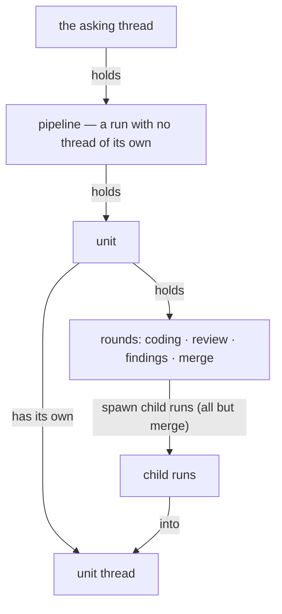

# What holds what: threads, runs, pipelines

The product's twelve nouns nest: each holds the next, and every surface names them by these words alone. The words themselves — one meaning each, and the internal words no surface prints — are the [Vocabulary](../reference/vocabulary.md); this page is the containment.

A [thread](../reference/vocabulary.md#thread) is where you talk, and it holds [runs](../reference/vocabulary.md#run) — one live model run at a time. Each run is one piece of work by one [agent](../reference/vocabulary.md#agent), gets a [card](../reference/vocabulary.md#card) the thread keeps updating, spends a [budget](../reference/vocabulary.md#budget) of minutes, and ends in an [outcome](../reference/vocabulary.md#outcome). A [follow-up](../reference/vocabulary.md#follow-up) is a reply in the thread, during or after a run. The person behind it all is the [requester](../reference/vocabulary.md#requester).

A [pipeline](../reference/vocabulary.md#pipeline) is ship's job on a plan: asked in one thread, reporting there at the end. It is itself a run, but its own hosted life occupies no thread — what it holds is [units](../reference/vocabulary.md#unit), and each unit gets a thread of its own, with its own branch and its own [pull request](../reference/vocabulary.md#pull-request). A unit advances in [rounds](../reference/vocabulary.md#round) — coding, review, findings, merge. The first three each spawn a child run into the unit's thread; the review round produces a [verdict](../reference/vocabulary.md#verdict), and the merge round spawns nothing — it waits on the guards.

So one request for a two-unit plan reads, in the nouns: the requester asks in a thread; the pipeline starts and holds two units; each unit opens its own thread, where rounds spawn child runs until the verdict and the checks make the unit merge-ready; each run's card tracks its budget; and the pipeline's report lands back in the asking thread with every unit's outcome.

Budgets nest the same way the nouns do: a unit's budget is carved from the pipeline's, a run's from the unit's, and a renewal spends from the layer above — the surface says "budget renewed", and the internal arithmetic stays behind the seam.
