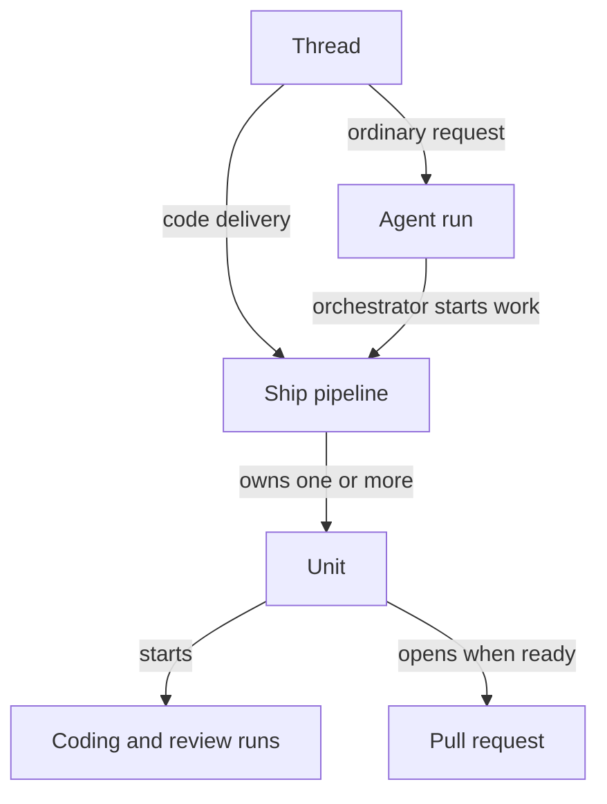

# Data model: threads, runs and units

**Every request that starts work has a run.** A run records who asked, which agent worked, the thread it belongs to and how it ended. A unit is a durable code deliverable, not a wrapper around every request.

```mermaid
flowchart TB
    T["Thread"] -->|"ordinary request"| R["Agent run"]
    T -->|"code delivery"| P["Ship pipeline"]
    R -->|"orchestrator starts work"| P
    P -->|"owns one or more"| U["Unit"]
    U -->|"starts"| C["Coding and review runs"]
    U -->|"opens when ready"| PR["Pull request"]
```

A question can be one `general` or `research` run with no unit. A code request handled by `ship` creates a pipeline with at least one unit. That unit uses `coding` and `review` runs. The `orchestrator` agent is also an ordinary run: it can answer directly or, for an eligible private request, start work through a checked tool. The pipeline itself has a run record, but it has no model turns of its own.

| Word | Plain meaning |
| --- | --- |
| **Thread** | The conversation and its follow-ups. It can hold many runs over time. |
| **Run** | One request handled by one agent, with a recorded outcome. |
| **Agent** | A definition of instructions, tools and limits used by a run. |
| **Pipeline** | `ship`'s work on a task or plan. It owns one or more units. |
| **Unit** | One code deliverable with its own branch, rounds and pull request when opened. |

A run may exchange several prompts and tool results with the model. Those steps stay inside the same run. A single-task unit uses the asking thread; a plan unit gets its own thread. A reply during a live run is a **follow-up** to that run; a later reply can start another run in the same thread. The [vocabulary](../reference/vocabulary.md) defines the remaining user-facing terms, including card, budget and verdict.

A run's live progress can be saved in a ledger; its finished record keeps the result. The conversation text is kept separately so a later run can continue with the right context. [How a request flows](how-a-request-flows.md) shows where text is checked before it reaches a model or a reply.

[Decision 0073](../decisions/0073-the-ship-pipeline-dissolves-into-the-orchestrator-the-unit-machine-is-the-deterministic-atom-and-judgement-composes-units.md) calls for the orchestrator to sequence units itself and retire Ship's plan workflow. The diagram shows the current implementation; that change has not replaced it.
