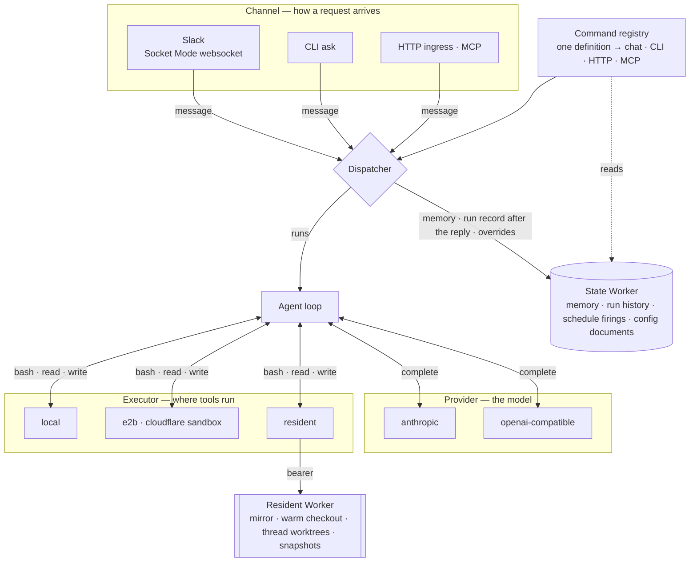
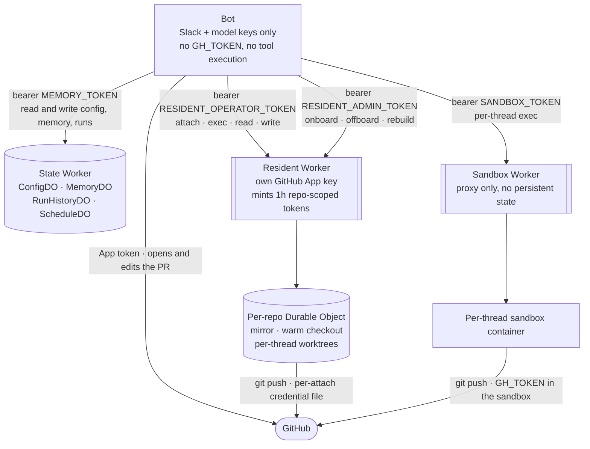
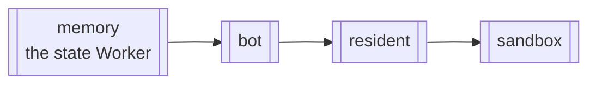

# Worker topology

OpenSwitchboard is not one service. It is one long-lived process — the bot, in a container behind a Worker of its own — plus three more Cloudflare Workers, each earning its place by solving a problem the bot structurally cannot. (A fifth, assets-only Worker serves this documentation and takes no part in a run.)

The bot is one Node process with no inbound server to speak of. The Slack adapter opens an **outbound websocket** (Socket Mode), so there is no public URL, webhook endpoint or signature verification to host; the one port it listens on serves the health probe, the dashboard and the ingress routes, and a deployment that wants none of those exposed exposes nothing ([decision 0003](../decisions/0003-outbound-only-slack-socket-mode.md)). State lives in three places — the channel's own thread history, the state Worker's Durable Objects, and disk — and only the first two are meant to survive a restart.

| Piece | What it is | Why it exists |
|---|---|---|
| **The bot** | One always-on container, holding the Slack and model provider keys | The only thing that must run continuously; everything it depends on is designed so that its restart or redeploy loses nothing |
| **State Worker** (`switchboard-memory`) | Durable Objects: config overrides, cross-session memory, run history and the run ledger, schedule firings | Outlives the bot's process. The bot's disk is ephemeral on Cloudflare Containers, so anything that must survive a restart lives here |
| **Resident Worker** (`switchboard-resident`) | Per-repository Durable Objects running Cloudflare Sandbox containers: a bare mirror, a warm checkout, per-thread worktrees | Keeps chosen repositories always warm, so a coding request does not pay clone-and-install every time, and holds its own GitHub credential, isolated from the bot |
| **Sandbox Worker** (`switchboard-sandbox`) | A thin proxy in front of per-thread Cloudflare Sandbox containers | Where a tool call executes when it must not touch the bot host at all: no persistent identity, one container per thread |

Why a long-lived process plus Durable Objects, rather than a serverless runtime, is [decision 0016](../decisions/0016-long-lived-process-not-serverless.md). The same parts drawn as one system: [Architecture](architecture.md).

## The whole picture

Three facts about the state Worker's side of that picture. Every finished run is built into a record at finish and written *after* the reply, retried and drain-tracked, so a slow history write never delays an answer ([Runs: live, then remembered](runs-live-and-history.md)). The run history's Durable Object owns the retention policy — `retentionDays`, `maxRuns`, `maxBytes`, applied identically by the bot and the Worker through one shared module — and sweeps on an alarm. And the chat-set config overrides (`config set`, `config instructions`) persist there too when `runtimeOverrides.worker` names it; without a Worker they go to a file under `data/`, which an ephemeral-disk host loses on restart.

## How they talk to each other

Four things worth sitting with:

**The bot never holds a repository-write credential when execution is sandboxed or resident.** It holds Slack tokens and model provider keys, nothing that can push code. When a coding agent needs to touch a repository, that capability lives in whichever Worker is doing the checkout, scoped to exactly that repository for exactly one attach. The blast-radius reasoning is [Execution and trust](execution-and-trust.md).

**The resident Worker's GitHub credential is a second, separate domain, not a copy of the bot's.** It holds its own GitHub App private key in its own Worker secrets and mints its own short-lived, repository-scoped installation tokens. Rotating the bot's App key does nothing for the resident's; they are two credentials that happen to authenticate as the same App, deliberately unshared ([decision 0009](../decisions/0009-residents-second-credential-domain.md)).

**The state Worker is what makes the bot's restarts free.** Conversation context rebuilds from Slack's own thread history; that is not the state Worker's job. Its job is everything that would otherwise need the bot's local disk: chat-set config overrides, memory, finished-run records, the run ledger, schedule firings. A bot redeploy loses none of it, and with the ledger on it does not even lose the runs in flight ([Runs: live, then remembered](runs-live-and-history.md)).

**Every hop carries the same trace id.** The bot's calls to these Workers set a W3C `traceparent` header (and to nothing else: GitHub, Slack and the model providers never see one); each Worker adopts it only after the bearer checked out and logs its own root under the same trace id. The public shim strips whatever trace context an outside caller sent and mints its own, so a trace id is never something a caller can choose. One id, four logs ([tracing spec](../reference/specs/tracing.md)).

## Why the deploy order follows from this

<!-- generated:deploy-order · npm run docs:gen — drawn from docs/.vitepress/theme/seams.mjs and src/deploy/plan.ts, do not edit by hand -->

<!-- /generated:deploy-order -->

The state Worker goes first because its Durable Object migrations must exist before the bot writes to them; deploying the bot against a state Worker that has not migrated is a live 500, not a graceful degrade. Resident and sandbox follow the bot because they consume bearer tokens the bot's config names; there is no correctness reason they cannot go first, but a Worker deploy swaps the isolate under any resident or sandbox work in flight, so doing it right after the bot keeps what gets interrupted small.

The order is also why a release does not redeploy everything. Each Worker is a separate artifact with separate inputs — the state Worker's bundle, the bot's image, the resident's bundle plus image — so a release that only touched the resident's engine rolls only the resident, and the bot's container is left alone. CI derives that per Worker from the diff between the commit each one serves and the release commit, keeping the order for whatever it selects ([Ship a release](../how-to/ship-a-release.md); [decision 0015](../decisions/0015-deploy-order-deployed-is-not-live.md)).

## What this buys you operationally

- **The bot can be redeployed at will** without losing config, memory, history or, with the ledger, runs in flight; a reconnect catch-up covers the seconds Slack was not listening.
- **A resident Worker redeploy is different from a bot redeploy**: it swaps the Durable Object isolate under active threads, which is why resident deploys are preflighted separately and refuse while work is in flight ([Operate production](../how-to/operate-production.md)).
- **No single host, if compromised, can do everything.** The bot can talk to Slack and the model but not push code. The resident Worker can push code to the one repository it is attached to but has no Slack or model access.

## Why not serverless, and why not host the bot in a sandbox

Two questions come up often enough to answer here. *Could the bot run on the Workers runtime itself?* Not as it stands: the Slack adapter is a Socket Mode daemon, and a run holds a model conversation, a sandbox attach and a Slack card open for minutes. The seams map one-to-one onto the durable-agent frameworks that productize the serverless shape, so the door stays open; the full argument, including the strongest form of the alternative and why it was deferred, is [decision 0016](../decisions/0016-long-lived-process-not-serverless.md). *Could the bot itself run inside a Cloudflare Sandbox?* Technically yes — a Sandbox is a container underneath — but that only re-implements the container deployment with an extra orchestration layer. Sandboxes earn their keep as the execution plane, where the agents' tools run; the bot process still needs a long-lived home.

## See also

- [Execution and trust](execution-and-trust.md) — the credential isolation in more depth.
- [Onboard a repo](../how-to/onboard-a-repo.md) — what happens inside the resident Worker when you do.
- [Capacity and sizing](capacity-and-sizing.md) — why the containers are the size they are.
