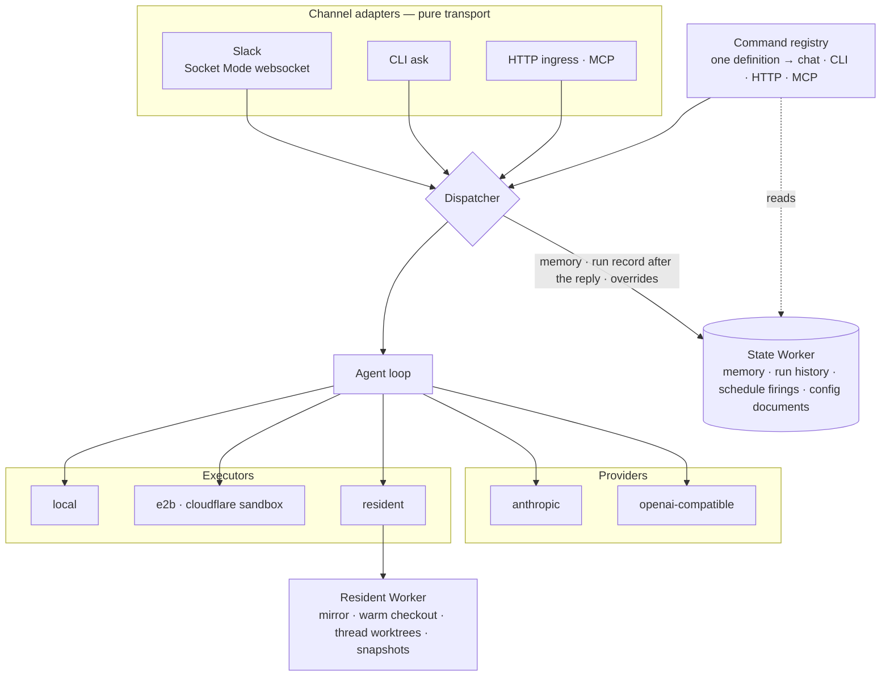
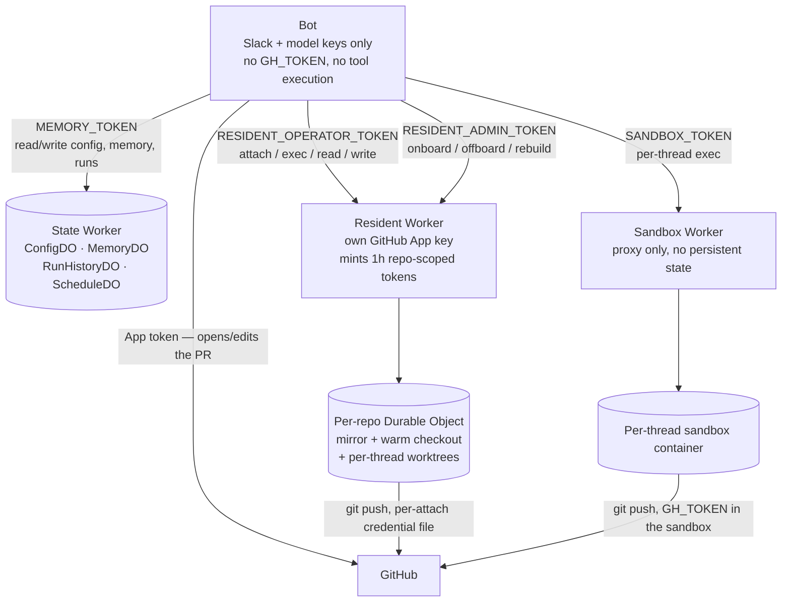
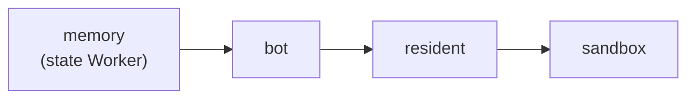

# Worker topology: one bot, three Workers, and why they're separate

Switchboard isn't one service. It's one long-lived process (the bot, wherever you host it) plus three Cloudflare Workers, each earning its place by solving a problem the bot itself structurally can't.

The bot is one Node process with no inbound server to speak of. The Slack adapter opens an **outbound websocket** (Socket Mode), so there is no public URL, webhook endpoint or signature verification to host; the one port it listens on serves the health probe, the dashboard and the ingress routes, and a deployment that wants none of those exposed exposes nothing. Every awaited step the process takes runs inside a span, so a run's timeline is a side effect of the code's shape, and every call to one of its own Workers carries the trace id along so their logs join up ([tracing](../reference/specs/tracing.md)). State lives in three places: the channel's own thread history, the state Worker's Durable Objects, and disk — and only the first two are meant to survive a restart.

| Piece | What it is | Why it exists |
|---|---|---|
| **The bot** | One always-on container, holds Slack + model provider keys | The only thing that must run continuously — everything it depends on is designed so that *it* restarting or redeploying loses nothing |
| **State Worker** (`switchboard-memory`) | Durable Objects: config overrides, cross-session memory, run history (the friction ledger reads it), schedule firings | Outlives the bot's own process. If the bot's disk is ephemeral (it is, on Cloudflare Containers), anything that must survive a restart has to live somewhere else |
| **Resident Worker** (`switchboard-resident`) | Per-repo Durable Objects running Cloudflare Sandbox containers: a bare mirror, a warm checkout, per-thread worktrees | Keeps *specific, chosen* repos always-warm so a coding request doesn't pay clone-and-install every time — and holds its own GitHub credential, isolated from the bot |
| **Sandbox Worker** (`switchboard-sandbox`) | A thin proxy in front of per-thread Cloudflare Sandbox containers | Where a tool call actually executes when you want it off the bot host entirely — no persistent identity, just exec-per-thread |

A fifth Worker, the assets-only docs site, is deliberately not in this list: it has no runtime role, cannot disturb a run, and deploys in seconds on every docs change ([docs site](../reference/specs/docs-site.md)).

## The whole picture

Three more facts about the state Worker's side of that picture. Every finished run is built into a record at finish and written *after* the reply, retried and drain-tracked, so a slow history write never delays an answer ([Runs: live, then remembered](runs-live-and-history.md)). The run history's Durable Object owns the retention policy — `retentionDays`, `maxRuns`, `maxBytes`, applied identically by the bot and the Worker through one shared module — and sweeps on an alarm. And the chat-set config overrides (`config set`, `config instructions`) persist there too when `runtimeOverrides.worker` names it; without a Worker they go to a file under `data/`, which an ephemeral-disk host loses on restart.

## How they actually talk to each other

Three things worth sitting with:

**The bot never holds a repo-write credential when execution is sandboxed or resident.** It holds Slack tokens and model provider keys — nothing that can push code. When a coding agent needs to touch a repo, that capability lives in whichever Worker is actually doing the checkout, scoped to exactly that repo, for exactly the duration of one attach. See [explanation: execution and trust](execution-and-trust.md) for the blast-radius reasoning behind this.

**The resident Worker's GitHub credential is a second, separate domain — not a copy of the bot's.** It holds its own GitHub App private key in its own wrangler secrets and mints its own short-lived, repo-scoped installation tokens. Rotating the bot's App key does nothing for the resident's; they're two credentials that happen to authenticate as the same App, deliberately not shared.

**The state Worker is the only thing that makes the bot's own restarts free.** Conversation context rebuilds from Slack's own thread history — that's not the state Worker's job. What *is* its job: everything that would otherwise need to survive on the bot's local disk (chat-set config overrides, memory, finished-run records, the friction ledger) lives in a Durable Object instead. A bot redeploy loses only whatever was in flight at that exact moment; a run that had already finished, or config someone set last week, is unaffected.

**Every hop carries the same trace id.** The bot's outbound calls to these Workers set a W3C `traceparent` header (and to nothing else — GitHub, Slack and the model providers never see one); each Worker adopts it only after the bearer checked out and logs its own root under the same trace id, with the resident's attach and op roots carrying every command they ran as children. The public shim strips whatever trace context an outside caller sent and mints its own, so a trace id is never something a caller can choose. One id, four logs: `wrangler tail` on any of them during a run finds the others ([docs/reference/specs/tracing.md](../reference/specs/tracing.md) items 21–22).

## Why the deploy order follows directly from this

The state Worker goes first because its Durable Object migrations have to exist before the bot writes to them — deploying the bot against a state Worker that hasn't migrated yet is a live 500, not a graceful degrade. Resident and sandbox come after the bot because they're consumers of bearer tokens the bot's config names; there's no correctness reason they *can't* go first, it's just that a Worker deploy briefly swaps out the isolate underneath any resident/sandbox work in flight, so doing it right after the bot (rather than mid-run) minimizes what gets interrupted.

The order is also why a release does not redeploy everything. Each Worker is a separate artifact with separate inputs — the state Worker's bundle, the bot's image, the resident's bundle plus image — so a release that only touched the resident's engine rolls only the resident, and the bot's container (with its 15-minute drain and its Slack blackout) is left alone. CI derives that per Worker from the diff between the commit each one is serving and the release commit, keeping the order for whatever it does select. See [how-to: deploy and rotate a secret](../how-to/deploy-and-rotate-a-secret.md) for what you actually do.

## What this buys you operationally

- **The bot can be redeployed at will** without losing config, memory, or history — only in-flight runs are at risk, and even those get a reconnect catch-up window.
- **A resident repo survives a resident Worker redeploy differently than a bot redeploy** — a resident deploy swaps the DO isolate under active threads, which is why resident deploys are preflighted separately and refuse while work is in flight (the resident preflight in [Operate production](../how-to/operate-production.md)).
- **No single host, if compromised, can do everything.** The bot can talk to Slack and the model, but not push code. The resident Worker can push code to the one repo it's attached to, but has no Slack or model access. Compromising one doesn't hand you the others.

## Why not serverless, and why not host the bot in a sandbox

Two questions come up often enough to answer here. *Could the bot run on the Workers runtime itself?* Not as it stands: the Slack adapter is a Socket Mode daemon and a run holds a model conversation, a sandbox attach and a Slack card open for minutes. The seams map one-to-one onto the durable-agent frameworks that productize the serverless shape, so the door stays open; the full argument, including the strongest form of the alternative and why it was deferred, is decision record [0016](../decisions/0016-long-lived-process-not-serverless.md). *Could the bot itself run inside a Cloudflare Sandbox?* Technically yes — a Sandbox is a container underneath — but that only re-implements the container deployment with an extra orchestration layer. Sandboxes earn their keep as the execution plane, where the agents' tools run; the bot process still needs a long-lived home.

## See also

- [Explanation: execution and trust](execution-and-trust.md) — the credential-isolation reasoning in more depth.
- [How-to: deploy and rotate a secret](../how-to/deploy-and-rotate-a-secret.md).
- [How-to: onboard a repo](../how-to/onboard-a-repo.md) — what actually happens inside the resident Worker when you do this.
