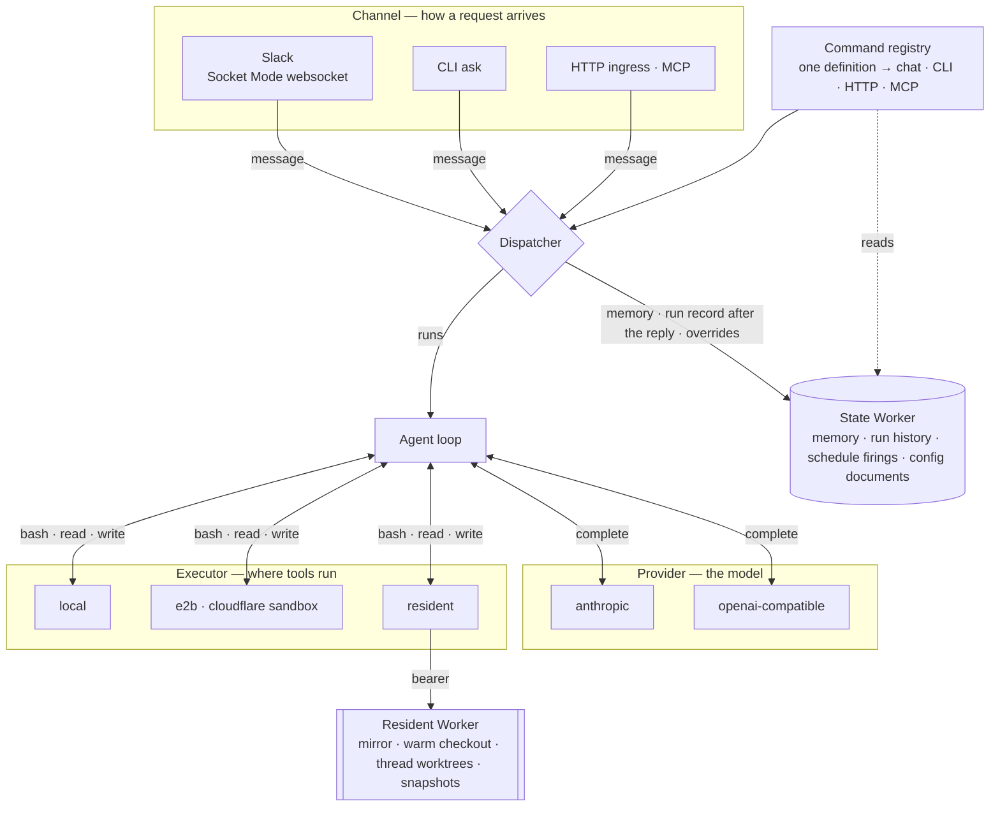
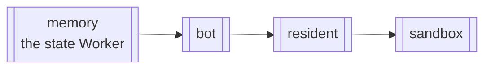

# Worker topology

One long-lived bot process plus three Cloudflare Workers, each solving a problem the bot structurally cannot; a fifth, assets-only Worker serves this documentation.

The bot opens an outbound websocket to Slack (Socket Mode), so there is no public URL or webhook to host; its one port serves the health probe, the dashboard and ingress ([decision 0003](../decisions/0003-outbound-only-slack-socket-mode.md)). State lives in thread history, the state Worker's Durable Objects, and disk; only the first two survive a restart.

| Piece | What it is | Why it exists |
|---|---|---|
| **The bot** | One always-on container with the Slack and model keys | The one thing that must run continuously |
| **State Worker** (`switchboard-memory`) | Durable Objects: config overrides, memory, run history and ledger, schedule firings | What must survive a bot restart |
| **Resident Worker** (`switchboard-resident`) | Per-repository Durable Objects: bare mirror, warm checkout, per-thread worktrees | Onboarded repositories stay warm, under their own GitHub credential |
| **Sandbox Worker** (`switchboard-sandbox`) | A proxy in front of per-thread containers | Tool calls that must not touch the bot host |

## The whole picture

A finished run is written to the state Worker after the reply ([Runs: live, then remembered](runs-live-and-history.md)); its Durable Object owns retention (`retentionDays`, `maxRuns`, `maxBytes`) and sweeps on an alarm. Chat-set overrides persist there when `runtimeOverrides.worker` names it, otherwise in a file under `data/`.

## How they talk to each other

- **The bot holds no repository-write credential** once execution is sandboxed or resident; the Worker doing the checkout holds it, per repository and per attach ([Execution and trust](execution-and-trust.md)).
- **The resident's GitHub credential is a second domain**: its own App key and its own short-lived tokens, unaffected by rotating the bot's ([decision 0009](../decisions/0009-residents-second-credential-domain.md)).
- **The state Worker makes bot restarts free.** Conversation context rebuilds from Slack; everything else durable lives here, so a redeploy keeps runs in flight.
- **A resident redeploy is different**: it swaps the isolate under active threads, so it is preflighted and refuses while work is in flight ([Operate production](../how-to/operate-production.md)).
- **Every hop carries the same trace id.** The bot sets `traceparent` on calls to these Workers only, each adopts it after the bearer checks out, and the public shim strips outside trace context ([tracing spec](../reference/specs/tracing.md)).

## Why the deploy order follows from this

<!-- generated:deploy-order · npm run docs:gen — drawn from docs/.vitepress/theme/seams.mjs and src/deploy/plan.ts, do not edit by hand -->

<!-- /generated:deploy-order -->

The state Worker goes first: its migrations must exist before the bot writes, or the bot is a live 500. Resident and sandbox follow because they consume bearers the bot's config names. Each Worker is a separate artifact, so a release rolls only those whose inputs changed, in this order ([Ship a release](../how-to/ship-a-release.md); [decision 0015](../decisions/0015-deploy-order-deployed-is-not-live.md)).

## Why not serverless

The Slack adapter is a Socket Mode daemon, and a run holds a model conversation, a sandbox attach and a card open for minutes; the Workers runtime cannot host that yet, though the seams map onto durable-agent frameworks ([decision 0016](../decisions/0016-long-lived-process-not-serverless.md)). Hosting the bot in a Sandbox would re-implement the container deployment with an extra layer.

## Read next

- [Onboard a repo](../how-to/onboard-a-repo.md) — what happens inside the resident Worker.
- [Capacity and sizing](capacity-and-sizing.md) — why the containers are the size they are.
