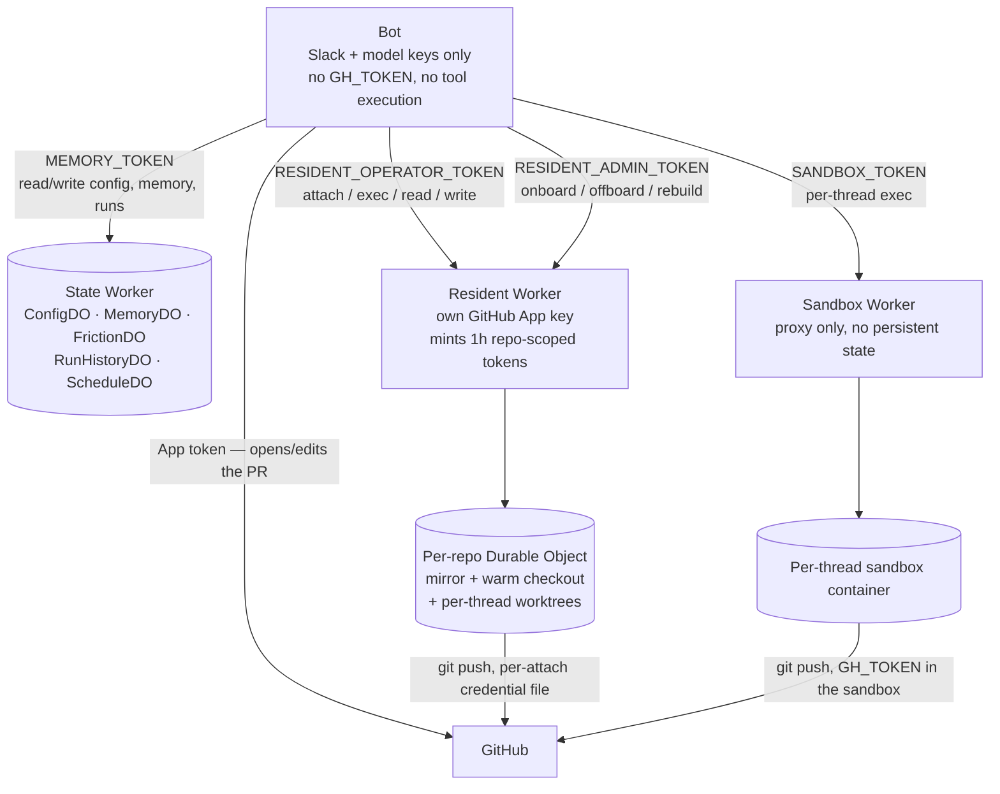
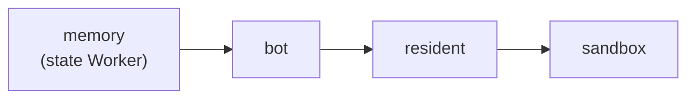

# Worker topology: one bot, three Workers, and why they're separate

Switchboard isn't one service. It's one long-lived process (the bot, wherever you host it) plus three Cloudflare Workers, each earning its place by solving a problem the bot itself structurally can't:

| Piece | What it is | Why it exists |
|---|---|---|
| **The bot** | One always-on container, holds Slack + model provider keys | The only thing that must run continuously — everything it depends on is designed so that *it* restarting or redeploying loses nothing |
| **State Worker** (`switchboard-memory`) | Durable Objects: config overrides, cross-session memory, the friction ledger, run history, schedule firings | Outlives the bot's own process. If the bot's disk is ephemeral (it is, on Cloudflare Containers), anything that must survive a restart has to live somewhere else |
| **Resident Worker** (`switchboard-resident`) | Per-repo Durable Objects running Cloudflare Sandbox containers: a bare mirror, a warm checkout, per-thread worktrees | Keeps *specific, chosen* repos always-warm so a coding request doesn't pay clone-and-install every time — and holds its own GitHub credential, isolated from the bot |
| **Sandbox Worker** (`switchboard-sandbox`) | A thin proxy in front of per-thread Cloudflare Sandbox containers | Where a tool call actually executes when you want it off the bot host entirely — no persistent identity, just exec-per-thread |

## How they actually talk to each other

Three things worth sitting with:

**The bot never holds a repo-write credential when execution is sandboxed or resident.** It holds Slack tokens and model provider keys — nothing that can push code. When a coding agent needs to touch a repo, that capability lives in whichever Worker is actually doing the checkout, scoped to exactly that repo, for exactly the duration of one attach. See [explanation: execution and trust](execution-and-trust.md) for the blast-radius reasoning behind this.

**The resident Worker's GitHub credential is a second, separate domain — not a copy of the bot's.** It holds its own GitHub App private key in its own wrangler secrets and mints its own short-lived, repo-scoped installation tokens. Rotating the bot's App key does nothing for the resident's; they're two credentials that happen to authenticate as the same App, deliberately not shared.

**The state Worker is the only thing that makes the bot's own restarts free.** Conversation context rebuilds from Slack's own thread history — that's not the state Worker's job. What *is* its job: everything that would otherwise need to survive on the bot's local disk (chat-set config overrides, memory, finished-run records, the friction ledger) lives in a Durable Object instead. A bot redeploy loses only whatever was in flight at that exact moment; a run that had already finished, or config someone set last week, is unaffected.

## Why the deploy order follows directly from this

The state Worker goes first because its Durable Object migrations have to exist before the bot writes to them — deploying the bot against a state Worker that hasn't migrated yet is a live 500, not a graceful degrade. Resident and sandbox come after the bot because they're consumers of bearer tokens the bot's config names; there's no correctness reason they *can't* go first, it's just that a Worker deploy briefly swaps out the isolate underneath any resident/sandbox work in flight, so doing it right after the bot (rather than mid-run) minimizes what gets interrupted.

The order is also why a release does not redeploy everything. Each Worker is a separate artifact with separate inputs — the state Worker's bundle, the bot's image, the resident's bundle plus image — so a release that only touched the resident's engine rolls only the resident, and the bot's container (with its 15-minute drain and its Slack blackout) is left alone. CI derives that per Worker from the diff between the commit each one is serving and the release commit, keeping the order for whatever it does select. See [how-to: deploy and rotate a secret](../how-to/deploy-and-rotate-a-secret.md) for what you actually do.

## What this buys you operationally

- **The bot can be redeployed at will** without losing config, memory, or history — only in-flight runs are at risk, and even those get a reconnect catch-up window.
- **A resident repo survives a resident Worker redeploy differently than a bot redeploy** — a resident deploy swaps the DO isolate under active threads, which is why resident deploys are preflighted separately and refuse while work is in flight (see the resident deploy guard in the root README).
- **No single host, if compromised, can do everything.** The bot can talk to Slack and the model, but not push code. The resident Worker can push code to the one repo it's attached to, but has no Slack or model access. Compromising one doesn't hand you the others.

## See also

- [Explanation: execution and trust](execution-and-trust.md) — the credential-isolation reasoning in more depth.
- [How-to: deploy and rotate a secret](../how-to/deploy-and-rotate-a-secret.md).
- [How-to: onboard a repo](../how-to/onboard-a-repo.md) — what actually happens inside the resident Worker when you do this.
