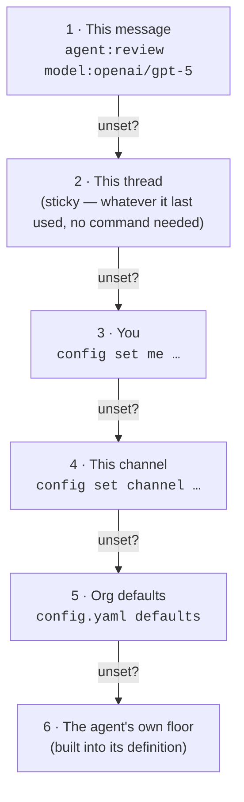

# Configure your defaults

Goal: stop repeating `agent:coding model:openai/gpt-5` on every message. Set it once at the scope where it belongs — yourself, a thread, or a whole channel.

## The six layers, highest wins

Switchboard resolves **agent** and **model** (and **effort** — see below) independently, checking each layer in order and stopping at the first one that has an opinion:



Why it's shaped this way: [config layers, explained](../explanation/config-layers.md).

## Set your own defaults

```
@switchboard config set me --model openai/gpt-5
@switchboard config set me --models.coding openai/gpt-5 --effort medium
```

`--model` sets a blanket default; `--models.<agent>` overrides it per agent. `--effort` (`low | medium | high`) controls how hard the model thinks per turn — same per-agent override with `--efforts.<agent>`.

## Set a channel's defaults

Needs the `channelConfig` permission (open to everyone unless an admin has restricted it):

```
@switchboard config set channel --agent review
@switchboard config set channel --efforts.coding medium
```

Every message in that channel now defaults to the `review` agent unless a directive or a user's own setting overrides it.

## Tell it things in plain English

Custom instructions are free text, not routing — they land in the system prompt as an advisory block, they never change which agent/model runs or what permissions apply:

```
@switchboard config instructions me "Always reply in bullet points"
@switchboard config instructions channel "This channel is about billing questions"
```

Channel instructions apply to every run in that channel; your own instructions apply only to runs you request; if both exist, yours wins. Clear either with an empty value: `config instructions me ""`.

## One-off, without changing any default

Directives in the message itself always win, and touch nothing persistent:

```
@switchboard agent:ship model:anthropic/claude-opus-5 effort:high in acme/api: fix issue #42
```

## Check and undo

```
@switchboard config show               # what's active right now, and why
@switchboard config clear me            # drop your personal overrides
@switchboard config clear channel       # drop this channel's overrides (needs channelConfig)
```

## See also

- [Reference: Slack commands](../reference/slack-commands.md) — every flag, every command.
- [Explanation: config layers](../explanation/config-layers.md) — why resolution works this way, and why effort is a first-class dimension.
