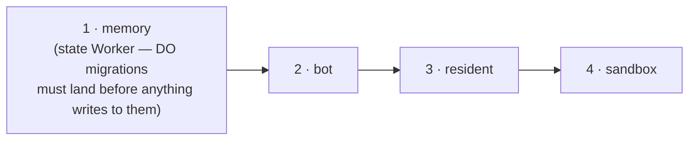

# Deploy to production, and rotate a secret

Goal: ship a change to the live bot, and separately, rotate a credential without rebuilding anything.

This is the condensed operator runbook. The exhaustive per-Worker manual steps (first-time secret provisioning, each Worker's own `npm run deploy`) live in the root [README's Deployment section](../../README.md#deployment) — reach for this page for the command you actually run day to day.

## The one command

```bash
npx tsx src/cli.ts deploy plan   # see what it would do first
npx tsx src/cli.ts deploy all
```

From a clean checkout of `origin/main`. This deploys all four Workers in the only order that's safe:



If a deploy step finds runs in flight, it **waits and retries** (every 60s, up to 30 minutes) instead of killing them — you'll see a heartbeat line each retry. `-- --force` bypasses this, and it tells you exactly what it's about to kill; don't reach for it by default. **Deployed ≠ live**: the bot step isn't done until `/healthz` reports a non-draining container running the commit that was just deployed — the old container keeps answering requests while it drains for up to 15 minutes.

## Rotate a secret

Putting a new secret value does **not** restart the running container — it keeps the environment it started with. Rotation is two steps:

```bash
# in deploy/cloudflare/ (or wherever the secret lives — check deploy/secrets.manifest.json)
npm run secrets   # or: wrangler secret put <NAME>

# from the repo root
SWITCHBOARD_DEPLOY_TOKEN=… npm run cli -- deploy restart
```

`deploy restart` drains the container gracefully and starts the next request on the new secret — no image build. It waits out in-flight runs the same way a deploy does; done once `/healthz` reports a later `startedAt` (~30s when idle).

A **shared** bearer (`MEMORY_TOKEN`, `SANDBOX_TOKEN`, `RESIDENT_*_TOKEN`) must be the same value on every Worker `deploy/secrets.manifest.json` lists for it — rotating it means putting the new value everywhere it's listed, not just on the Worker where you noticed it.

## See also

- [README: Deployment](../../README.md#deployment) — every Worker, what host options exist, the full manual runbook.
- [Explanation: Worker topology](../explanation/worker-topology.md) — what's actually behind "four Workers" and why the order matters.
