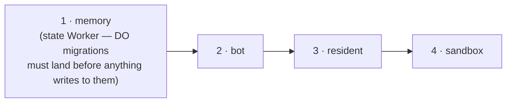

# Deploy to production, and rotate a secret

Goal: ship a change to the live bot, and separately, rotate a credential without rebuilding anything.

This is the condensed operator runbook. The exhaustive per-Worker manual steps (first-time secret provisioning, each Worker's own `npm run deploy`) live in the root [README's Deployment section](https://github.com/coreplanelabs/switchboard/blob/main/README.md#deployment) — reach for this page for what you actually do day to day.

## Ship a change: merge the release PR

You do not deploy. Every merge to `main` lands in the one open release PR (`chore(main): release <version>`, opened and kept current by release-please). Merging that PR tags the version, publishes the GitHub release, and CI deploys production — the `deploy-production` job in the `release-please` workflow run.

Before you merge, read the sticky comment on the release PR (posted by the `release-please` workflow run of every merge to `main`, so it always describes the PR's current head): it lists each of the four Workers with **deploy** or skip, the commit it was judged against (what that Worker is serving right now), and why — the changed files that are its inputs. The release PR's own checks may show "action required" — that is GitHub gating a bot-authored PR's workflows, not a failed plan. Merging deploys exactly the Workers marked **deploy**, in the only safe order:



A Worker is deployed when one of its inputs changed since the commit it serves: a file its `worker.ts` imports (transitively — a shared `src/` module deploys every Worker that imports it), anything in its own `deploy/` directory, a *production* dependency of its workspace moving in the root lockfile, and for the bot anything its Dockerfile copies or installs. A `vitest` bump, a docs page, a test, a CI file deploy nothing. A path no rule recognises deploys **everything** and says which path — that is the fail-safe, not a bug; classify the path in `src/deploy/affected.ts`.

If a deploy step finds runs in flight, it **waits and retries** (every 60 s, up to 45 min in CI) instead of killing them — a heartbeat line per retry in the job log. If the bot is still busy when that budget runs out, nothing is broken: `deploy all` exits 75 (`busy`), the job ends with a warning instead of red, and it dispatches itself again at the head of `main` (up to 8 attempts, about 6 hours). Because the retry is `--affected`, it deploys whatever is behind at that moment — a later release included — so a string of busy attempts needs no attention; only the eighth timeout, or a real failure (exit 1, never retried), asks for a person. **Deployed ≠ live**: the bot step isn't done until `/healthz` reports a non-draining container running the release commit — the old container keeps answering while it drains for up to 15 minutes. The job summary ends with what each Worker is serving after the run.

## See what a PR would deploy

Every PR has a `deploy targets` check. Its summary is the same table, judged against the PR's base instead of production: which Workers this diff touches. A docs-only PR shows four skips; a PR that adds an unlisted top-level file shows four deploys with `unsure: unclassified` — fix that before it reaches a release.

The same question from a checkout:

```bash
npx tsx src/cli.ts deploy plan --affected                  # against what production serves
npx tsx src/cli.ts deploy plan --affected --base origin/main   # against a ref
```

## Deploy by hand (rarely)

A Worker whose release deploy failed, or a deliberate full roll, goes through the same workflow — never a laptop:

```bash
gh workflow run deploy-production.yml --ref main -f targets=affected   # the default: what is stale
gh workflow run deploy-production.yml --ref main -f targets=all
gh workflow run deploy-production.yml --ref main -f targets=bot,resident
gh workflow run deploy-production.yml --ref main -f targets=bot -f force=true   # kills in-flight runs at the drain deadline — say why in the run
```

It refuses to run from any ref but `main`. `deploy all` from a checkout still works (same command, same checks: account, clean tree, `origin/main`), but it is the exception that needs a reason — and a laptop whose shell carries another account's `CLOUDFLARE_API_TOKEN` is refused with wrangler's own words until the token is unset.

## Rotate a secret

Putting a new secret value does **not** restart the running container — it keeps the environment it started with. Rotation is two steps:

```bash
# in deploy/cloudflare/ (or wherever the secret lives — check deploy/secrets.manifest.json)
npm run secrets   # or: wrangler secret put <NAME>

# from the repo root
SWITCHBOARD_DEPLOY_TOKEN=… npm run cli -- deploy restart
```

`deploy restart` drains the container gracefully and starts the next request on the new secret — no image build, no release. It waits out in-flight runs the same way a deploy does; done once `/healthz` reports a later `startedAt` (~30s when idle).

A **shared** bearer (`MEMORY_TOKEN`, `SANDBOX_TOKEN`, `RESIDENT_*_TOKEN`) must be the same value on every Worker `deploy/secrets.manifest.json` lists for it — rotating it means putting the new value everywhere it's listed, not just on the Worker where you noticed it. Rotating `RESIDENT_READ_TOKEN` or `SANDBOX_TOKEN` also means updating the repository secret CI deploys with.

## See also

- [README: Deployment](https://github.com/coreplanelabs/switchboard/blob/main/README.md#deployment) — every Worker, what host options exist, the full manual runbook.
- [Explanation: Worker topology](../explanation/worker-topology.md) — what's actually behind "four Workers" and why the order matters.
- [features/release-and-deploy.md](https://github.com/coreplanelabs/switchboard/blob/main/features/release-and-deploy.md) — the contract: how the selection is derived, what CI needs, what is proven where.
