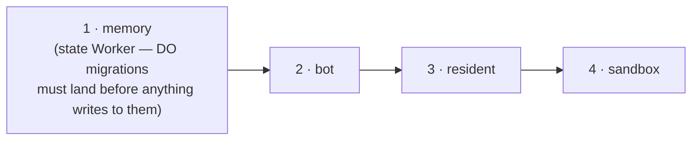

# Deploy to production, and rotate a secret

Goal: ship a change to the live bot, and separately, rotate a credential without rebuilding anything.

This is the condensed operator runbook. The exhaustive per-Worker manual steps (first-time secret provisioning, each Worker's own `npm run deploy`) live in the root [README's Deployment section](https://github.com/coreplanelabs/switchboard/blob/main/README.md#deployment) — reach for this page for what you actually do day to day.

## Ship a change: merge the release PR

You do not deploy. Every merge to `main` lands in the one open release PR (`chore(main): release <version>`, opened and kept current by release-please). Merging that PR tags the version, publishes the GitHub release, and CI deploys production — the `deploy-production` job in the `release-please` workflow run.

Before you merge, read the sticky comment on the release PR (posted by the `release-please` workflow run of every merge to `main`, so it always describes the PR's current head): it lists each of the four Workers with **deploy** or skip, the commit it was judged against (what that Worker is serving right now), and why — the changed files that are its inputs. The release PR's own checks may show "action required" — that is GitHub gating a bot-authored PR's workflows, not a failed plan. Merging deploys exactly the Workers marked **deploy**, in the only safe order:



A Worker is deployed when one of its inputs changed since the commit it serves: a file its `worker.ts` imports (transitively — a shared `src/` module deploys every Worker that imports it), anything in its own `deploy/` directory, a *production* dependency of its workspace moving in the root lockfile, and for the bot anything its Dockerfile copies or installs. A `vitest` bump, a docs page, a test, a CI file deploy nothing. A path no rule recognises deploys **everything** and says which path — that is the fail-safe, not a bug; classify the path in `src/deploy/affected.ts`.

A deploy step that finds runs in flight **does not wait for them**: on SIGTERM the bot hands every resumable run to the next container, which continues it within seconds under the same Slack card (the run ledger, `features/run-history.md` item 39). The preflight says so as a warning in the job log and proceeds. What it still waits out (every 60 s, up to 10 min) is a container rollout that has not settled yet; still refusing after that is a real failure — red, for a person — as is any other non-zero exit. **Deployed ≠ live**: the bot step isn't done until `/healthz` reports a container running the release commit — the old one keeps answering for the few seconds of its handoff, or up to 15 minutes if a ship pipeline is finishing there. The job summary ends with what each Worker is serving after the run.

## See what a PR would deploy

Every PR has a `deploy targets` check. Its summary is the same table, judged against the PR's base instead of production: which Workers this diff touches. A docs-only PR shows four skips; a PR that adds an unlisted top-level file shows four deploys with `unsure: unclassified` — fix that before it reaches a release.

The same question from a checkout:

```bash
npx tsx src/cli.ts deploy plan --affected                  # against what production serves
npx tsx src/cli.ts deploy plan --affected --base origin/main   # against a ref
```

## Deploy by hand (rarely)

A Worker whose release deploy failed, or a deliberate full roll, goes through the same workflow — never a laptop:

```bash
gh workflow run deploy-production.yml --ref main -f targets=affected   # the default: what is stale
gh workflow run deploy-production.yml --ref main -f targets=all
gh workflow run deploy-production.yml --ref main -f targets=bot,resident
gh workflow run deploy-production.yml --ref main -f targets=bot -f force=true   # kills in-flight runs at the drain deadline — say why in the run
```

It refuses to run from any ref but `main`. `deploy all` from a checkout still works (same command, same checks: account, clean tree, `origin/main`), but it is the exception that needs a reason — and a laptop whose shell carries another account's `CLOUDFLARE_API_TOKEN` is refused with wrangler's own words until the token is unset.

## Rotate a secret

Putting a new secret value does **not** restart the running container — it keeps the environment it started with. Rotation is two steps. Both commands read the deployment profile, so on a clean checkout export where it lives first (`SWITCHBOARD_DEPLOY_PROFILE=github://…/profile.json@main` plus `CONFIG_REPO_TOKEN` for a private repository), and run them with no `CLOUDFLARE_API_TOKEN` in the shell — wrangler prefers such a token over your login, and a token scoped for another purpose fails the put with `Authentication error [code: 10000]`. `deploy secrets` renders the Worker's `wrangler.jsonc` itself, so no `deploy init` is needed before it.

```bash
# in deploy/cloudflare/ (or wherever the secret lives — check deploy/secrets.manifest.json);
# the value comes from the profile's secretsSource (~/.secrets/switchboard/<NAME> by default, or op://Vault/Item)
npm run secrets -- --only <NAME>   # = `deploy secrets bot --only <NAME>`; or: wrangler secret put <NAME>

# from the repo root
SWITCHBOARD_DEPLOY_TOKEN=… npm run cli -- deploy restart
```

`deploy restart` drains the container gracefully and starts the next request on the new secret — no image build, no release. Runs in flight hand off to the next container the same way a deploy's do; done once `/healthz` reports a later `startedAt` (~30s).

This holds for `SWITCHBOARD_INGRESS_TOKENS` too, the `deployer` entry included: `deploy restart` with the **new** deployer token works right after the put, because the Worker authenticates the token from its own, already-updated environment and tells the bot only the subject it authenticated; the bot decides the grant from config, not from the token map it started with. Keep the subjects unchanged when rotating — the `grants` entries key on them, not on the token values.

A **shared** bearer (`MEMORY_TOKEN`, `SANDBOX_TOKEN`, `RESIDENT_*_TOKEN`) must be the same value on every Worker `deploy/secrets.manifest.json` lists for it — rotating it means putting the new value everywhere it's listed, not just on the Worker where you noticed it. Rotating `RESIDENT_READ_TOKEN` or `SANDBOX_TOKEN` also means updating the repository secret CI deploys with.

## See also

- [README: Deployment](https://github.com/coreplanelabs/switchboard/blob/main/README.md#deployment) — every Worker, what host options exist, the full manual runbook.
- [Explanation: Worker topology](../explanation/worker-topology.md) — what's actually behind "four Workers" and why the order matters.
- [features/release-and-deploy.md](https://github.com/coreplanelabs/switchboard/blob/main/features/release-and-deploy.md) — the contract: how the selection is derived, what CI needs, what is proven where.
