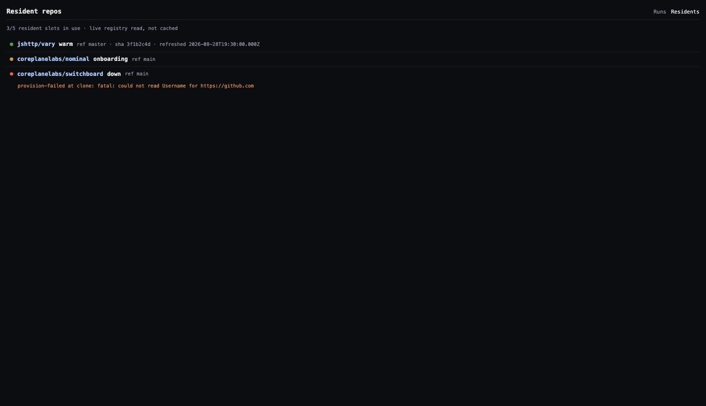

# Onboard a repo

Register a repository for agent tasks. By default, onboarding also creates a **resident**: an always-warm environment with its checkout and dependencies ready.

**You need:**

- A resident Worker ([Deploy](deploy.md)), the block below, and `RESIDENT_OPERATOR_TOKEN` + `RESIDENT_ADMIN_TOKEN` in the bot's environment; without them the `repo` commands do not exist.
- The `repo:write` grant; nobody holds it by default ([Restrict who can do what](restrict-who-can-do-what.md)).
- The repository inside the resident Worker's GitHub App installation; others are refused by name.

```yaml
execution:
  resident:
    baseUrl: https://switchboard-resident.example.com
```

## Onboard

```
@switchboard repo onboard acme/api --ref main --install "npm ci" --test "npm test" --build "npm run build"
```

Omit `--install`, `--test` or `--build` and Switchboard detects them from the lockfile and `package.json`, saying what it chose. The command returns at once; provisioning continues in the background.

## Register without a resident

```
@switchboard repo onboard acme/api --no-resident --ref main
```

This saves the repository and command table immediately. It starts no resident, creates no snapshot or refresh schedule, and uses no resident capacity. Coding and review tasks naming the repo run in per-thread sandboxes; an explicit task branch wins over the registered default ref. Dependencies are prepared during the task rather than kept warm.

`repo list` shows these registrations as `cold`. The same GitHub App membership and `repo:write` checks apply. The resident Worker's registry and credentials are still required for registration.

`repo reconfigure` edits the saved commands or ref. `repo offboard` removes only the registration. To give it a resident later, offboard the cold registration and onboard it again without `--no-resident`. `repo rebuild` and deterministic `repo test` / `repo build` require a resident. Ready-environment pilot tasks retain their existing warm-environment requirement.

## Watch it come up

```
@switchboard repo list
```

The lifecycle runs `onboarding → warm`; a second reply arrives at `warm`, or with a reason if it failed. The dashboard shows the same ([Dashboard routes](../reference/dashboard-routes.md)).



## Use it

Ask as before: any coding or review request naming the repository (`owner/name`, GitHub URL or PR link) runs in the resident. The status card shows the binding: `resident · acme/api · main@…`.

## Change or remove it

```
@switchboard repo reconfigure acme/api --test "npm run test:unit"
@switchboard repo offboard acme/api --dry-run     # itemized plan only
@switchboard repo offboard acme/api               # tear it down
@switchboard repo rebuild acme/api                # reprovision from scratch
```

Run `--dry-run` before anything destructive.

## Disk

The gauge is on every surface: `repo list` appends `· disk 4.06 GiB/14.4 GiB (28%)`, the residents index shows it per row, the detail page has a **Disk** section.

| State | Meaning | Remedy |
|---|---|---|
| `disk-pressure` on a status card | A new thread would not fit; the request ran in a cold sandbox, the resident stays `warm` | Fewer concurrent branches with divergent lockfiles, or a larger container |
| `degraded` with `disk-full: …` on the dashboard | The disk filled; requests run cold until the container restarts and restores its snapshot | Refills within the hour: the working set no longer fits. Resize, or offboard a repository |

## Next

- [Resident contract](../reference/specs/resident-repos.md): the eviction rules.
- [Capacity and sizing](../explanation/capacity-and-sizing.md): why disk sizes the container.
- [Authorization](../reference/authorization.md): `repo:write` versus `restrict.repos`.
