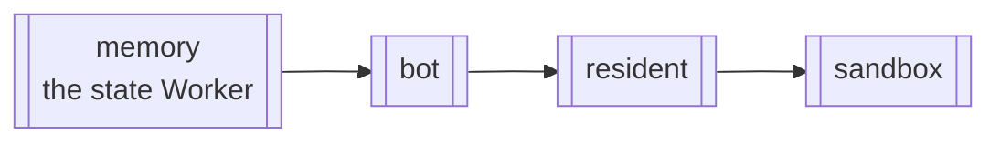

# Ship a release

Merge the release PR and confirm the new commit is live on every Worker it touched.

**You need:**

- The repository [configured](configure-the-repository.md), with CI holding the deploy credentials ([this installation's](operate-production.md#for-this-installation)).
- Production deployed once by hand ([Deploy](deploy.md)).

## Merge to `main`

You do not deploy. Every merge lands in the one open release PR (`chore(main): release <version>`).

The 1.2 line is the same loop on the `v1.2` branch: its merges land in that branch's own release PR (`chore(v1.2): release 1.2xx.x`), its releases are 1.200.0 and up (the public name is "1.2"), and merging one publishes the images at `:<version>` only and, when publishing is on, the package under npm's `next` tag. It deploys nothing: production follows `main` alone, and the line lands on `main` once, as 2.0.0, when its release moment comes ([Migration notes](../reference/migrations.md)).

## Read the plan on the release PR

The sticky comment marks each Worker **deploy** or skip, with the commit it serves and the changed inputs. An unrecognised path deploys **everything** and names itself; classify it in `src/deploy/affected.ts`.

## Merge the release PR

Merging tags the version, publishes the release, and deploys the marked Workers in this order:

<!-- generated:deploy-order · npm run docs:gen — drawn from docs/.vitepress/theme/seams.mjs and src/deploy/plan.ts, do not edit by hand -->



<!-- /generated:deploy-order -->

The run also publishes the images as `ghcr.io/<owner>/<repo>` (bot), `-resident` and `-sandbox`, at `:<version>` and `:latest`, with provenance and an SBOM ([Deploy](deploy.md#run-the-container-yourself) verifies one). A third job publishes `@coreplane/switchboard` to npm only while the variable `SWITCHBOARD_PUBLISH_NPM` is `true` and the manifest no longer says `"private": true` ([Configure the repository](configure-the-repository.md#5-repository-secrets-and-variables)).

## Confirm it is live

**Deployed is not live.** The bot step is done when `/healthz` reports a container running the release commit; the old one answers during the handoff, up to 15 minutes while a `ship` pipeline finishes.

## See what any PR would deploy

Every PR's `deploy targets` check shows the same table against the PR's base. From a checkout:

```bash
npm run cli -- deploy plan --affected                      # against what production serves
npm run cli -- deploy plan --affected --base origin/main   # against a ref
```

## Deploy by hand, rarely

A failed release deploy or a deliberate full roll goes through the workflow, never a laptop. It refuses any ref but `main`.

```bash
gh workflow run deploy-production.yml --ref main -f targets=affected   # the default: what is stale
gh workflow run deploy-production.yml --ref main -f targets=all
gh workflow run deploy-production.yml --ref main -f targets=bot,resident
gh workflow run deploy-production.yml --ref main -f targets=bot -f force=true   # bypasses the preflights — say why in the run
```

## Next

- [Operate production](operate-production.md)
- [Release and deploy](../reference/specs/release-and-deploy.md): the contract; what counts as an input.
- [Decision 0015](../decisions/0015-deploy-order-deployed-is-not-live.md): why one order, and why deployed is not live.
