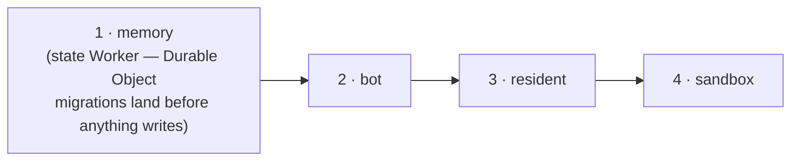

# Ship a release

Get merged changes into production: read the release PR's deploy plan, merge it, and confirm the new code is live.

## Before you start

- The repository is [configured](configure-the-repository.md) so that merges are squashes and the release workflow may open pull requests, and CI holds the deploy credentials ([Operate production](operate-production.md#for-this-installation) lists the ones this project's installation uses).
- Production has been deployed once by hand ([Deploy](deploy.md)), so every Worker serves a commit the plan can compare against.

## 1. Merge to `main` as usual

You do not deploy. Every merge to `main` lands in the one open release PR (`chore(main): release <version>`), opened and kept current by release-please.

## 2. Read the plan on the release PR

Before you merge, read the sticky comment on the release PR. It lists each Worker with **deploy** or skip, the commit that Worker is serving right now, and why: the changed files that are its inputs. The release PR's own checks may show "action required"; that is GitHub gating a bot-authored PR's workflows, not a failed plan.

A Worker is deployed when one of its inputs changed since the commit it serves: a file its `worker.ts` imports (transitively — a shared `src/` module deploys every Worker that imports it), anything in its own `deploy/` directory, a production dependency of its workspace moving in the root lockfile, and for the bot anything its Dockerfile copies or installs. A test, a docs page, a CI file or a dev-dependency bump deploys nothing. A path no rule recognises deploys **everything** and says which path; that is the fail-safe. Classify the path in `src/deploy/affected.ts` rather than weaken it.

## 3. Merge the release PR

Merging tags the version, publishes the GitHub release, and runs the deploy in the only safe order, for exactly the Workers marked **deploy**:



Runs in flight do not hold the release. On SIGTERM the bot hands every resumable run to the next container, which continues it under the same Slack card within seconds; the bot's preflight says so as a warning and proceeds. What the deploy does wait out (every 60 s, up to its budget) is a container rollout that has not settled yet; still refusing after that is a real failure, red, for a person, as is any other non-zero exit.

## 4. Confirm it is live

**Deployed is not live.** The bot step is not done until `/healthz` reports a container running the release commit; the old one keeps answering for the few seconds of the handoff, or for up to 15 minutes if a `ship` pipeline is finishing there. The job summary ends with what each Worker is serving after the run.

## See what any PR would deploy

Every PR has a `deploy targets` check whose summary is the same table, judged against the PR's base: a docs-only PR shows four skips; a PR that adds an unlisted top-level file shows four deploys with `unsure: unclassified`, which you fix before it reaches a release. From a checkout:

```bash
npm run cli -- deploy plan --affected                      # against what production serves
npm run cli -- deploy plan --affected --base origin/main   # against a ref
```

## Deploy by hand, rarely

A Worker whose release deploy failed, or a deliberate full roll, goes through the same workflow, never a laptop:

```bash
gh workflow run deploy-production.yml --ref main -f targets=affected   # the default: what is stale
gh workflow run deploy-production.yml --ref main -f targets=all
gh workflow run deploy-production.yml --ref main -f targets=bot,resident
gh workflow run deploy-production.yml --ref main -f targets=bot -f force=true   # bypasses the preflights — say why in the run
```

It refuses to run from any ref but `main`. `npm run cli -- deploy all` from a checkout is the same command with the same checks (the account, a clean tree at `origin/main`), and the exception that needs a reason; [Operate production](operate-production.md) has its rules.

## What you did

You read what a release would touch before merging it, merged, and confirmed the new commit on `/healthz`. Why one fixed order, why only the changed Workers, and why "deployed" is not "live": [the decision record](../decisions/0015-deploy-order-deployed-is-not-live.md); the contract is [Release and deploy](../reference/specs/release-and-deploy.md).
