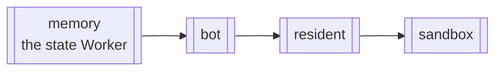

# Ship a release

Merge the release PR and confirm the new commit is live on every Worker it touched.

**You need:**

- The repository [configured](configure-the-repository.md), with CI holding the deploy credentials ([this installation's](operate-production.md#for-this-installation)).
- Production deployed once by hand ([Deploy](deploy.md)).

## Merge to `main`

You do not deploy. Every merge lands in the one open release PR (`chore(main): release <version>`).

## Read the plan on the release PR

The sticky comment marks each Worker **deploy** or skip, with the commit it serves and the changed inputs. An unrecognised path deploys **everything** and names itself; classify it in `src/deploy/affected.ts`.

## What the checks prove

| Phase | Checks | What a pass proves |
|---|---|---|
| Ordinary PR | Selected source tests, type checks, security scans, Worker/image checks and installed-package smoke | The changed code and shipped package satisfy their local contracts. No deployed runtime is claimed. |
| Release PR | The same validation, then all four staging Workers and bounded answer, workspace-read and posted Review scenarios | The exact candidate runs through real providers, repository execution and the fixture GitHub integration before production. |
| Before production upload | Candidate routing (the “Door”) with the configured model and synthetic inputs | Routing decisions satisfy representative cases. No agent or deployed Worker is exercised. |
| During and after production deploy | Native image/process/config checks, execution probe, selected build readback and an undrained Resident fleet | The selected production services actually run the expected code and configuration. Upload success alone is insufficient. |
| After production readiness | Configured live answer, workspace and posted Review smoke | Production credentials, routing and integrations work in the authorized disposable scope. Disabled smoke is reported as skipped. |

The pre-deploy routing test and post-deploy agent tests cover different boundaries. Keep them. Keep installed-package smoke on ordinary PRs: staging does not prove the npm tarball installs or starts.

Staging and production run similar agent scenarios in different environments. Keep the production checks while configuration and credentials can differ. A staging pass cannot prove production access. Consolidate these scenarios only when a replacement still covers those production boundaries and both executors.

Automatic full staging runs only for release PRs. Ordinary PRs can opt in with `deploy:staging`, manual dispatch or the CLI; their normal staging check reports **not required**, not live acceptance. See [Staging](staging.md#github).

Slack connection health and an actual test-user message round trip are separate acceptance checks. HTTP/MCP scenarios do not prove Slack delivery. The configured Slack check sends a `status show` mention as a normal testing user in an operator-selected public channel, then checks the bot’s threaded reply against the deployed process. It adds no model run. See [Slack acceptance](staging.md#slack-acceptance) for setup.

## Merge the release PR

Merging tags the version, publishes the release, and deploys the marked Workers in this order:

<!-- generated:deploy-order · npm run docs:gen — drawn from docs/.vitepress/theme/seams.mjs and src/deploy/plan.ts, do not edit by hand -->


```mermaid
flowchart LR
    W1[["memory<br/>the state Worker"]] --> W2[["bot"]] --> W3[["resident"]] --> W4[["sandbox"]]
```

<!-- /generated:deploy-order -->

The run also publishes the images as `ghcr.io/<owner>/<repo>` (bot), `-resident` and `-sandbox`, at `:<version>` and `:latest`, with provenance and an SBOM ([Deploy](deploy.md#run-the-container-yourself) verifies one). A third job publishes `@coreplane/switchboard` to npm only for a release cut from the default branch and only while the variable `SWITCHBOARD_PUBLISH_NPM` is `true` — turn it off before merging a release PR and that release ships everything but the package — on the run's own identity — npm trusts this workflow as the package's publisher, so no token is stored anywhere ([Configure the repository](configure-the-repository.md#5-repository-secrets-and-variables)).

## Confirm it is live

**Deployed is not live.** The bot step is done when `/healthz` reports a container running the release commit; the old one answers during the swap, up to 15 minutes while a `ship` pipeline finishes.

## See what any PR would deploy

Every PR's `deploy targets` check shows the same table against the PR's base. From a checkout:

```bash
npm run cli -- deploy plan --affected                      # against what production serves
npm run cli -- deploy plan --affected --base origin/main   # against a ref
```

## Deploy by hand, rarely

A failed release deploy or a deliberate full roll goes through the workflow, never a laptop. It refuses any ref but `main`.

```bash
gh workflow run deploy-production.yml --ref main -f targets=affected   # the default: what is stale
gh workflow run deploy-production.yml --ref main -f targets=all
gh workflow run deploy-production.yml --ref main -f targets=bot,resident
gh workflow run deploy-production.yml --ref main -f targets=bot -f force=true   # bypasses the preflights — say why in the run
```

## Next

- [Operate production](operate-production.md)
- [Release and deploy](../reference/specs/release-and-deploy.md): the contract; what counts as an input.
- [Decision 0015](../decisions/0015-deploy-order-deployed-is-not-live.md): why one order, and why deployed is not live.
