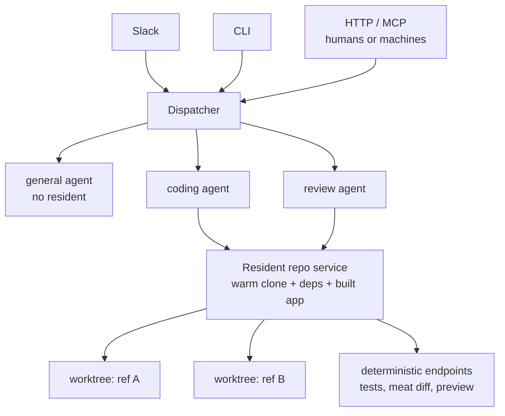
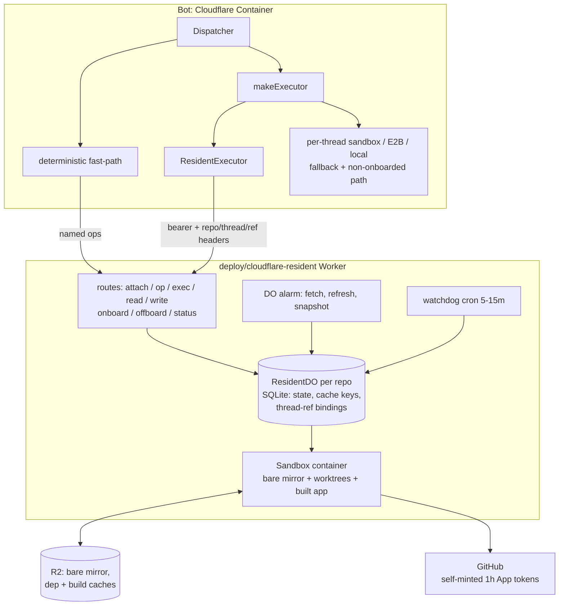
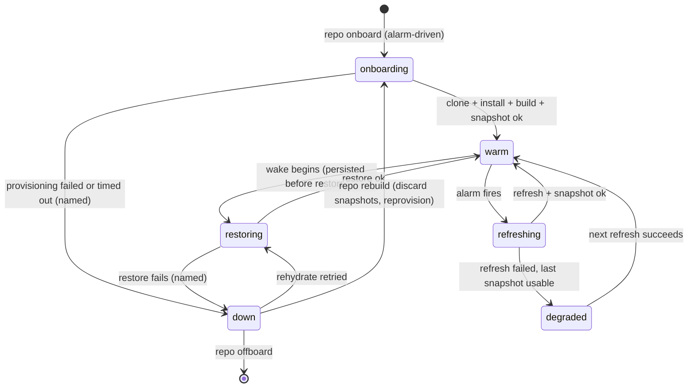

# Switchboard Golden Product - Plan

## Goal Capsule

- **Objective:** Make Switchboard the single ingress for human- and machine-triggered work, routing to purpose-tuned agents with deterministic, fast mechanics. This plan's active work is **Area 1: resident repo environments + ref inference** (R4–R8, plus the agent-model mechanics R9 and R11 its units deliver); areas 2–7 stay requirements-level here and get their own planning passes.
- **Authority:** Product Contract Rs own product behavior; Planning Contract KTDs own implementation mechanism within their cited Rs; units override neither.
- **Execution profile:** New code lands as a new Worker (`deploy/cloudflare-resident/`) plus a fourth executor backend and a dispatcher fast-path in the bot. The existing per-thread sandbox Worker is not modified.
- **Stop conditions:** Surface rather than guess when (a) the Sandbox 1.0 (`@next`) API surface differs materially from the documented one, (b) a change would modify the Product Contract's scope, (c) live verification shows attach latency cannot meet the AE1 bar on the chosen instance type, or (d) per-repo GitHub App token scoping cannot be achieved before a resident executes untrusted repo code (see Risks).
- **Open blockers:** None.
- **Product Contract preservation:** R-IDs unchanged. Two user-directed additions: the always-on org agent recorded in How This Work Fits Together as the converging shape; former OQ3/OQ5 resolved into Planning Contract KTDs (OQ2, OQ4 remain deferred).

---

## Product Contract

### Summary

Switchboard becomes the universal incoming channel — Slack first, CLI/HTTP/MCP behaving identically — routing to tuned agents that declare the resources they need. A resident repo environment (always-warm clone, installed deps, built app; threads attach via ref inference) is the flagship resource: coding and review agents use it to validate against a running instance, agents that don't need it never touch one. Simple operations run as deterministic endpoints with the LLM only orchestrating; the whole wishlist ships in bang-for-buck order.

### Problem Frame

Every coding-agent run today pays the cold-boot tax: clone the repo, install dependencies, build the app — before any useful work starts. Sandboxes are keyed strictly per thread (`data/sandboxes.json` for E2B, `X-Thread-Key` for Cloudflare Sandbox), so two threads on the same repo repeat identical setup, and the E2B setup script (`src/execution/e2b.ts`) reinstalls the `gh` CLI on every fresh sandbox. The felt result is slowness, and slowness kills adoption: the internal bar is Claude Tag — if Switchboard is slower or flakier, people route work elsewhere.

The wishlist that seeded this program (Matanya's Slack post, 2026-08-18) adds capabilities the agent simply lacks today: no web access, no secrets-manager integration, no shareable view of a running agent, no distilled diffs in PRs, no analysis of its own past performance. And the current trigger surface is Slack-only in practice, while none of the wishlist is Slack-specific — the same message should work from a CLI, an HTTP call, or an MCP tool, sent by a human or a machine.

### Key Decisions

- KD1. **Resident repos over faster per-thread sandboxes** (session-settled: user-approved — chosen over baking faster per-thread images: attach beats boot; cold boot goes to ~zero instead of "smaller"). One always-warm service per onboarded repo; threads attach. Governs R5, R6, R7, R8.
- KD2. **The repo is a first-class resource, not the architecture** (session-settled: user-directed — chosen over resident-repo-centric design: not all work is repo-bound). Agents declare the resources they need; general-purpose agents run without a resident, future agents may need other resources (web services). Governs R9, R10.
- KD3. **LLM as orchestrator, never the whole machine** (session-settled: user-directed — chosen over LLM-does-everything: reliability comes from deterministic mechanics). Simple operations run as plain endpoints/commands with no model in the loop; complex work is a hybrid; agents are tuned for specific jobs, never "running random stuff." Governs R7, R11.
- KD4. **Universal ingress, Slack as adapter #1** (session-settled: user-directed — chosen over Slack-native product: nothing in the golden product is Slack-specific). The same message over CLI, HTTP, or MCP behaves identically; the existing channel seam (`src/core/types.ts`, `src/cli.ts`) is the extension point. Governs R1, R2, R3.
- KD5. **Item 8 is an ethos, not a rewrite** (session-settled: user-approved — chosen over a Go port: speed and conciseness are product qualities, not a language). Fast, concise, low-fluff defaults are tuned continuously across every area. Governs R21.
- KD7. **Per-repo resident access follows the open-when-absent permission convention** (session-settled: user-directed — chosen over a fail-closed per-repo allowlist and over shipping no gate: zero friction for a small trusted team while the check seam still exists). A `canUseRepo(userId, slug)` gate runs in the factory before resident selection and in the deterministic fast-path; with no `permissions.repos` configured, every allowed coding-agent user may use every onboarded repo, and a per-repo allowlist tightens it when configured — the same absent-means-everyone semantics as the existing agent permission. Governs R3, R4 interaction.
- KD6. **Non-Slack callers authenticate with keys mapped to identities** (session-settled: user-directed — chosen over human-only keys and service-only identities: keeps "same person, any channel" while giving machines their own gated identities). A human's key maps to the person and inherits their permissions; a machine key is a service identity with its own allowlist, in the existing platform-namespaced ID scheme. Governs R3.

### Requirements

**Ingress and channel parity**

- R1. A message sent over any supported channel (Slack, CLI, HTTP, MCP) with the same content produces the same behavior: same routing, same agent, same config resolution, same reply semantics.
- R2. Machines are first-class senders: an automated system can submit a message and receive the result without a human in the loop.
- R3. Every caller is identified and passes the same permission gates as Slack users do today; no channel bypasses agent allowlists. Identity model per KD6: human keys map to the person, machine keys are service identities with their own allowlists.

**Resident repo environments**

- R4. Repos are explicitly onboarded to get a resident; the system never auto-warms a repo merely because a thread mentions it. Onboarding is admin-gated (KTD9) and reversible via de-onboard.
- R5. An onboarded repo has an always-warm resident holding a maintained clone, installed dependencies, and a built app — kept fresh continuously, not rebuilt on demand.
- R6. A thread attaches to a resident in near-constant time; zero agent tokens are spent on environment setup.
- R7. A resident exposes deterministic operations (run tests, build, diff distillation, preview) invocable without a model turn.
- R8. Ref inference binds each thread to the right branch context: a thread working on branch X gets an isolated checkout of X (worktree or equivalent) and can never silently act against the wrong ref. Concurrent threads on one repo do not interfere.

**Agent model**

- R9. Each agent declares the resources it needs (resident repo, web access, none); the dispatcher provides only those. The general-purpose agent runs without a resident.
- R10. Agents can invoke other agents as a capability; invocation semantics (budgets, permission inheritance) are OQ2.
- R11. Simple asks route to deterministic paths where possible; model turns are reserved for work that needs judgment.

**Run visibility**

- R12. Every run has a link showing the agent working — the commands it runs and their responses — live during the run and preserved afterward, so a human can spot inefficiency in seconds.
- R13. Something running in a resident (e.g., a dev server) can be shared with a human through a tunnel/preview URL.

**PR quality**

- R14. Every agent-authored PR includes a distilled reading diff (meat.dev) covering the conceptually important changes.
- R15. When asked to review a PR, the agent validates against the running instance in the resident, not just the diff text.

**Research capability**

- R16. Agents the user points at a URL can fetch and read it; research-capable agents can search the web. Dropped links work for both information and design references.

**Secrets**

- R17. Resident and sandbox environments can populate env vars from a 1Password service account vault; secrets never require manual per-repo wiring.

**Self-improvement**

- R18. The system records enough per-run telemetry (timings, failures, setup events) to analyze where time was lost.
- R19. A recurring analysis reviews past runs, identifies delay causes (install errors, missing test deps, stale agent docs), and proposes fixes as PRs for human review — it never self-merges.

**Performance bar**

- R20. Quality, speed, and reliability meet or beat Claude Tag for the same ask; environmental failures (setup, clone, deps) are not an accepted failure category.
- R21. Output defaults are fast, concise, and low-fluff across all agents.

<!-- ce-section: work-relationships -->
### How This Work Fits Together

This plan owns the program-level requirements; each area below is planned and delivered separately, in this bang-for-buck order. The breakdown is the current understanding, not a committed roadmap — a later plan may revise, split, or merge areas.

**Converging shape (tentative):** the program trends toward an always-on org-level agent — one always-warm orchestrator per organization with prewarmed context and a few tools, answering fast and routing every request to deterministic or model-backed paths. It is not built in any current area; it gets its own brainstorm once residents prove the residency pattern. Areas 1 and 4 are designed so it stays cheap: residency is a resource-typed primitive (KTD1) and the deterministic fast-path lives in the dispatcher (KTD8), so "org resident" is a new resource type, not a new architecture.

1. **Resident repos + ref inference** (R4–R8, also delivering the agent-model mechanics R9 and R11 per KD2/KD3) — **this plan's active area**; kills the felt pain.
   - Enables area 3's validated review and tunnel previews (R13), and reduces what area 7 will find.
   - R10 (agent-to-agent invocation) has no area owner yet; it is planned when OQ2 resolves.
2. **Run visibility link** (R12) — cheap given run events already exist on stdout; the trust win.
   - Enables area 7 (telemetry is its data source). Can proceed independently of area 1; tunnel previews (R13) join once residents exist.
3. **meat reading-diffs in PRs** (R14, R15) — small, shiny, quality-facing. Depends on area 1 for validated review (R15); the reading diff itself (R14) does not.
4. **HTTP/MCP ingress** (R1–R3) — the universal-channel bet; identity model decided (KD6).
5. **Web research tools** (R16) — standalone; can proceed independently of everything above.
6. **1Password env fill** (R17) — small; rides on area 1's resident lifecycle.
7. **Self-improvement loop** (R18, R19) — last; consumes the telemetry areas 1–2 create.
- **Continuous:** speed/conciseness tuning (R20, R21) — not a workstream, a bar every area is held to.

### Key Flows

- F1. Repo-bound ask from Slack
  - **Trigger:** User asks the coding agent for a change on branch X of an onboarded repo.
  - **Steps:** Dispatcher resolves agent → agent attaches to the repo's resident → ref inference selects/creates the worktree for X → agent works against the warm, built app → PR opens with a meat reading diff → run link shows every command throughout.
  - **Covers:** R5, R6, R8, R12, R14.
- F2. Machine-triggered ask over HTTP
  - **Trigger:** An automated system posts a message to the HTTP endpoint.
  - **Steps:** Caller is authenticated and mapped to an identity → same permission gates as Slack → same dispatch, same agent, result returned to the caller.
  - **Covers:** R1, R2, R3.
- F3. Simple deterministic ask
  - **Trigger:** "Run the tests on main" for an onboarded repo.
  - **Steps:** Recognized as a deterministic operation → resident endpoint executes without a model turn → result posted.
  - **Covers:** R7, R11.

### Acceptance Examples

- AE1. **Covers R6.** Given repo `acme/api` is onboarded, when a new thread asks the coding agent for a change, then no clone/install/build occurs in the run and warm attach meets the numeric budget: p50 ≤ 5s, p95 ≤ 15s; post-wake attach p95 ≤ 60s. (Initial budgets — confirmed or revised once at U3's live checkpoint against a recorded per-thread cold-boot baseline; stop condition (c) compares measured attach against these numbers.)
- AE2. **Covers R8.** Given thread A works on `main` and thread B on `fix/login`, when both run concurrently, then each operates in its own checkout of its own ref and neither sees the other's changes.
- AE3. **Covers R9.** Given a general-purpose ask ("what's the syntax for a lateral join?"), when it dispatches, then no resident or sandbox is touched.
- AE4. **Covers R4.** Given a thread mentions a repo that is not onboarded, when a repo-bound agent runs, then it uses the existing per-thread sandbox path (or reports the repo isn't onboarded) rather than silently creating a resident.
- AE5. **Covers R19.** Given last week's runs include one that lost 4 minutes to a missing test dependency, when the analysis runs, then it opens a PR proposing the fix (e.g., baking the dependency into the resident) and merges nothing itself.
- AE6. **Covers R6, R8.** Given a resident is mid-rebuild or down, when a thread attaches, then the run proceeds on the per-thread sandbox path and the status card names the degradation — never a silent stall.

### Success Criteria

- Head-to-head on the same ask, Switchboard is as fast or faster than Claude Tag, with output quality the team judges equal or better.
- Zero tokens spent on environment setup for onboarded repos.
- No run fails for environmental reasons in normal operation; when infrastructure does fail, the failure is visible and named, never a silent stall.
- "Shiny": the run link, status surface, and PR artifacts feel polished enough that people prefer routing work through Switchboard.

### Scope Boundaries

- **Deferred for later:** auto-onboarding/auto-warming repos on first mention; multi-workspace or external-tenant use; analytics dashboards beyond the run link and the self-improvement loop's needs; the always-on org orchestrator (own brainstorm after residents land).
- **Outside this program's identity:** a Go rewrite (KD5); Slack presentation-layer work already in flight (attachments, thread follow-ups, status polish) — referenced, not owned; building or hosting model infrastructure.

#### Deferred to Follow-Up Work

- R7's diff-distillation and preview operations land with areas 2/3 alongside R13/R14; U6 delivers the test/build/status operations only — the next area's planner must not assume the resident already exposes diff or preview ops.
- Migrating the existing per-thread sandbox Worker (`deploy/cloudflare-sandbox/`) off `@cloudflare/sandbox ^0.3.0` — separate migration once the resident service proves the `@next` surface.
- Resident-backed preview tunnels (R13) and the run-visibility link (R12) — area 2/3 work; the resident's route surface is designed so they bolt on.
- Cost/eviction automation beyond a manual de-onboard command and an onboarded-repo cap.

### Dependencies / Assumptions

- Cloudflare is the platform: the bot runs on Cloudflare Containers and sandboxes behind a proxy Worker (`deploy/cloudflare/`, `deploy/cloudflare-sandbox/`); residents live on the same platform. Always-on residency cost per onboarded repo is accepted (KD1) and bounded by an onboarded-repo cap (KTD9).
- The onboarded repo set is small and known; onboarding is an explicit act.
- The existing seams hold: channel adapters over one dispatcher (`src/core/dispatcher.ts`), executors behind one interface (`src/execution/`), agents as data (`src/agents/registry.ts`). The program extends these seams rather than replacing them.
- meat.dev (`boldsoftware/meat`) is installable in agent environments via `go install meat.dev/cmd/meat@latest` and operates on git diffs.
- Sandbox SDK 1.0 (`@cloudflare/sandbox@next`) exposes the documented lifecycle, backups, mounts, and tunnels APIs; the repo's Cloudflare execution path has never been live-tested (AGENTS.md known gap), so first deploy verifies SDK method names.

### Outstanding Questions

**Deferred to planning of later areas**

- OQ2. Agent-to-agent invocation semantics: budget sharing, permission inheritance when agent A calls agent B, recursion limits (R10).
- OQ4. Run-link surface: where it's hosted, retention, and access control for the command/response stream (R12) — today's logs are stdout-only (`src/core/dispatcher.ts`).

### Sources / Research

- Wishlist origin: Matanya's Slack post (coreplanelabs #switchboard channel, 2026-08-18) and the earlier live-status thread; inspiration named there: ampcode.com.
- Verified current state (all confirmed against source): per-thread-only sandboxes with repeated setup (`src/execution/e2b.ts`, `src/execution/factory.ts`); no web tools in any toolset (`src/tools/workspace.ts`); env-only secrets, no secrets manager (`src/config.ts`, `src/execution/githubApp.ts`); bearer-gated sandbox Worker with no public URL (`deploy/cloudflare-sandbox/worker.ts`); stdout-only run logs (`src/core/dispatcher.ts`); channel-agnostic core with CLI as proof (`src/cli.ts`); 1-minute keep-alive cron pattern (`deploy/cloudflare/wrangler.jsonc`).
- meat.dev: "abridge a code diff into a reading diff" — github.com/boldsoftware/meat.
- Cloudflare platform research (Aug 2026, developers.cloudflare.com): container/sandbox disk is ephemeral across sleep and deploys; DO SQLite storage is the durable layer; Sandbox SDK stable is 0.12.x with `@next` = Sandbox 1.0 preview and Cloudflare guidance to start new projects on `@next`; June 2026 deprecations (HTTP transport, `exposePort()` → tunnels API, default sessions); `sandbox.backups` (squashfs to R2) and `mountBucket` (FUSE) for caches, both requiring explicit re-restore on wake; DO alarms preferred over cron fan-out for per-entity refresh; named tunnels + Cloudflare Access for previews; custom Dockerfiles extending `docker.io/cloudflare/sandbox` are the sanctioned toolchain-baking path. Key refs: /containers/faq/, /sandbox/api/lifecycle, /sandbox/api/backups/, /sandbox/api/tunnels/, /sandbox/guides/2026-deprecation/, /durable-objects/api/alarms/.

---

## Planning Contract

### Key Technical Decisions

- KTD1. **Residency is a generic, resource-typed primitive** (session-settled: user-approved — chosen over a repo-hard-coded resident: keeps the always-on org-agent evolution cheap). The resident service models "a named always-warm service with a declared resource type"; `repo` is the first type. Naming, route shapes, and DO storage schema avoid baking "repo" into the primitive's contract. Cites KD2; governs the shape of U2.
- KTD2. **New resident Worker on Sandbox 1.0** (session-settled: user-directed — chosen over stable 0.12.x and over upgrading everything together: Cloudflare's own guidance is new projects on `@next`; churn risk accepted). `deploy/cloudflare-resident/` uses `@cloudflare/sandbox@next` with RPC transport and default sessions off. The existing per-thread sandbox Worker keeps its current pin (see Deferred to Follow-Up Work).
- KTD3. **Warm means rehydration, not persistent disk.** Container disk is ephemeral across sleep and deploys, so: DO SQLite storage is the source of truth (onboarded config, lifecycle state, last-fetched SHA, cache keys, thread→ref bindings); R2 holds the bare-repo mirror and lockfile-hash-keyed dependency/build caches via the backups API; every wake restores caches before serving. Disk is a cache, never truth. Governs R5's mechanism.
- KTD4. **Per-repo DO alarms own freshness; one sparse cron is the watchdog.** Each resident DO self-reschedules an alarm (git fetch → dep/build refresh → cache snapshot). A single 5–15-minute cron re-arms any DO whose alarm chain died — mirroring the existing keep-alive pattern, chosen over cron fan-out (per-Worker cron caps are documented inconsistently; alarms are per-entity by design). The alarm cadence is pinned below the container's sleep window in U2's Worker config so residents are warm at attach in steady state, not only after recent activity — the bot's 1-minute keep-alive cron is the precedent.
- KTD5. **Threads attach into per-thread worktrees off a bare mirror; recovery is degrade-and-recreate.** The resident maintains one bare mirror; every mirror mutation (fetch, prune, worktree add/remove) runs under an explicit in-DO async mutex — a DO yields at each `await`, so single-threaded execution alone does not serialize container commands; attach waits on the mutex under a named timeout that degrades to the fallback path. Each attach gets a worktree keyed by thread+ref. A dirty or stale worktree from a crashed run is wiped and recreated on next attach — the same reconnect-or-recreate philosophy as `E2BExecutor.open` (`src/execution/e2b.ts`). Isolation between concurrent threads is enforced at the OS layer: attach allocates an unprivileged per-thread user, chowns the worktree to it, and every exec runs privilege-dropped under that user, with root escalation removed from the resident image (the base sandbox image runs as root, so ownership bits alone isolate nothing; a shared container makes plain `cd ../` navigation a cross-thread breach otherwise). Worktrees are evicted after an inactivity window — no attach for the configured period marks the binding inactive and its worktree evictable, while the DO binding record is retained per KTD6 — and each resident records a disk budget at onboard. Governs R8.
- KTD6. **Ref binding: explicit or ask-once, then persisted.** The ref comes from an explicit branch/PR reference in the message; when ambiguous, the agent asks once (extending the existing scope-first rule in `CODING_SYSTEM`) and the resolved binding persists in the resident's DO storage keyed by threadKey — never a silent guess, surviving restarts per the state invariant. Governs R8.
- KTD7. **Per-branch dependency reconciliation.** The resident keeps default-branch deps and build warm. A worktree whose lockfile hash differs from the cached key runs an incremental install scoped to that worktree before first use — paid once per ref, preventing stale-dep false test results. Unattended (alarm-driven) refresh touches only the default branch; non-default refs reconcile only at attach time, on behalf of an authorized thread, and those install/build executions carry no GitHub token (see KTD12) — install scripts are untrusted code. Worktree and per-op checkout creation materializes the lockfile-hash-keyed dependency and build caches into the new tree by hardlink/copy-on-write from the warm default checkout — `git worktree add` alone yields a tree with no deps or build output — so the scoped install runs only when the hash differs. Governs R5, R20 interaction.
- KTD8. **Deterministic ops are a dispatcher fast-path over a new operations seam** (session-settled: user-approved — dispatcher-owned, chosen over executor-embedded: fast-answers become a property of Switchboard, not of repos, per the org-agent evolution). The 3-method `Executor` cannot express modelless ops or structured results, so a separate `Operations` capability (named op → structured `{ok, output}` result) is introduced with two implementations (resident-backed, local) per the ≥2-implementations invariant. The dispatcher recognizes deterministic asks before `buildMessages` and answers without a model turn, mirroring the existing inline `handleConfigCommand` path — but unlike config commands, an op executes real commands, so the fast-path resolves the implicit target agent (coding) and passes the same `canRunAgent` gate first: only the model call is skipped, never the permission machinery (AGENTS.md invariant 3). With no model turn to catch injection, op names resolve only through a fixed enum into onboard-time-configured commands, and ref arguments validate against refs the resident already knows — request text is never interpolated into a shell command; anything that doesn't cleanly match falls through to the agent path. Ops run in a disposable per-op checkout, never in a thread's attached worktree. Every command-table entry declares an execution profile — `effects: readonly | mutating` — so the dispatcher (and later the org-agent router) knows statically which ops are safe to retry, parallelize, or cache and which need the gated path; area-1 ops (test/build/status) are readonly by construction (session-settled: user-approved — adopted from "The Two Dimensions of Agent Skills": statefulness is the load-bearing axis; a run-twice contract per surface). Governs R7, R11.
- KTD9. **Onboarding is an admin-gated runtime act; the registry lives in the resident service.** `repo onboard <slug>` / `repo offboard <slug>` chat/CLI commands, gated by a `canManageRepos` check shaped like `canEditChannelConfig` (`src/config.ts`) but **fail-closed**: when no repo-management permission is configured, only admins may onboard — diverging deliberately from the channel-config gate's open-when-absent default, because onboarding provisions billable always-on compute and binds GitHub credentials. The onboarded-repo cap is enforced in a single atomic DO transaction (count check + registry write together) so concurrent onboards cannot race past it. The registry persists in the resident service's durable storage (onboarding happens at runtime; the bot's YAML is baked at deploy). The bot queries the resident service for membership; a resident restart never de-onboards.
- KTD10. **Attach-time contract: named degradation, never a stall.** Residents carry a persisted lifecycle state (onboarding → warm → refreshing → restoring → degraded → down). `restoring` is written before any wake rehydration begins — DO storage would otherwise still say `warm` while the R2 restore runs, which is the most common non-warm moment on ephemeral disk. Any state other than `warm` is treated as not-warm: the factory falls back to the existing per-thread sandbox path and the status card names the state and reason. Governs R6, AE6.
- KTD11. **Executor selection becomes context-aware; agents declare resources.** `AgentDef` gains `resources` (e.g., `repo: "required" | "none"`); `makeExecutor` takes a context object (`{threadKey, agent, repo?, ref?}`) instead of a bare threadKey. The general agent declares none and never touches a resident (R9, AE3). One call-site change in the dispatcher; every backend's options type updates.
- KTD12. **Resident mints its own short-lived, repo-scoped GitHub tokens; commands get per-command env injection.** Residents outlive the bot's 1-hour cached App tokens, and alarm-driven refresh runs with no bot in the loop — so the resident Worker holds the GitHub App credentials in its own wrangler secrets and mints 1-hour installation tokens on demand. Constraints, all load-bearing: every mint passes `repositories: [<own slug>]` so a token never grants more than the resident's one repo (today's `mintInstallationToken` in `src/execution/githubApp.ts` mints installation-wide — the port must narrow it); the private key lives only in Worker/DO scope and never enters the container or sandbox env — only minted tokens cross that boundary; tokens are delivered through a per-attach credential file owned by that thread's OS user and referenced by a git credential helper — never set process-wide, and never as an inline command-line env prefix, which every concurrent thread could read from the shared container's process list; dependency-reconciliation and install/build executions get no token at all (KTD7), while the refresh's `git fetch` itself uses a freshly minted repo-scoped token. A token-mint failure is a command-level error and never flips resident lifecycle state. Governs R17 interaction for area 1.

### High-Level Technical Design

Component topology — what talks to what:

Resident lifecycle — the persisted state machine behind KTD10:

Attach sequence (directional guidance, not implementation specification): attach(threadKey, refHint) → resolve binding from DO storage or bind now (KTD6) → ensure worktree for thread+ref exists and is clean (KTD5) → reconcile deps if lockfile differs (KTD7) → return worktree handle; subsequent exec/read/write carry the thread key and are confined to that worktree's root.

### System-Wide Impact

- **The resident Worker becomes a synchronous dependency of every repo-bound dispatch.** The bot never caches membership (KTD9), so each coding/review dispatch pays a `/status` probe — including for non-onboarded repos. A Worker-wide outage would add probe latency to every concurrent dispatch on the singleton bot container; U5 adds a short-lived in-process negative cache (circuit breaker) so an outage costs one timeout, not one per message. Not persisted — restart-survival invariant untouched.
- **`makeExecutor`'s signature change ripples through every backend** (`E2BOptions`, Cloudflare options, local) from one dispatcher call site (U1). Behavior-neutral until U5.
- **System prompts become executor-dependent.** `AgentDef.system` is a shared immutable string read by `src/runner.ts`; the resident vs fallback paths need different prompt bodies, and mutating the shared object would race across concurrent dispatches. The dispatcher composes an effective system override after executor selection and passes it into `runAgent` (U1 plumbing, U7 content).
- **Two timeout domains, deliberately separate.** `BASH_TIMEOUT_MS` (5 min, `src/execution/executor.ts`) bounds agent tool calls only; resident provisioning/refresh gets its own larger configured budget (U2/U3), and the DO alarm handler's 15-minute wall-clock platform limit is verified at U3's live checkpoint.
- **Lifecycle observability is causal, not binary.** `degraded`/`down` carry a `reason` (github-unreachable, r2-restore-failed, build-failed); the watchdog marks a resident `degraded` the moment it re-arms a dead alarm (staleness window is visible, not silent); U5's fallback status surfaces the reason — feeding area 7's delay-cause analysis (R18).
- **Platform-config coordination:** the resident Worker's deploy-time `max_instances` must stay ≥ KTD9's runtime onboarded-repo cap or onboarding fails at the platform layer with the wrong error shape; residents need a larger `instance_type` than the disposable per-thread sandboxes.
- **CLI as verification vehicle:** `src/cli.ts` mints an ephemeral `cli:${Date.now()}` thread key per invocation, which cannot demonstrate re-attach/binding persistence — it gains a stable thread-key flag in U5.

### Risks & Dependencies

- **GitHub App key in a second, code-execution-adjacent trust domain.** A resident executes untrusted repo code (build/install scripts, model-generated commands) near credentials. Mitigations are KTD12's constraints (repo-scoped mint, key never in container env, token-free untrusted execs) plus an onboarding precondition: the App installation is repository-scoped and `repo onboard` requires the repo already in its access list (U8). Verification: U3's cross-repo-403 mint test. Detection: alert on any mint attempt for a repo other than the resident's own slug. Escalation is stop condition (d).
- **Cross-thread breach inside a shared container.** Covered by KTD5's OS-level isolation; verified by U4's cross-worktree exec tests. Residual risk: container-level escape is out of scope (platform boundary).
- **Sandbox 1.0 (`@next`) churn on a never-live-tested surface.** Mitigations: pin an exact `@next` version at U2; U2 opens with a throwaway smoke deploy exercising sandbox create/exec/backups/tunnel before any route or registry code, so first SDK contact costs hours, not units; churn is confined to `deploy/cloudflare-resident/` — the bot's seam is the stable `Executor`/`Operations` interfaces. If stop condition (a) fires, the branch is: pin the surviving API subset, re-plan U3/U4 around it, and only then proceed.
- **Op-argument injection on the modelless path.** Covered by KTD8's enum + ref validation; verified by U6's metacharacter tests.
- **Onboarding as a cost/privilege primitive.** Fail-closed gate + atomic cap (KTD9); concurrent-onboard race test (U2); canary rollout onboards only this repo first with the admin allowlist explicitly set (U8).
- **Always-on cost.** Accepted per KD1, bounded by the cap and per-repo instance sizing recorded at onboard; de-onboard destroys the resident and its caches.

### Sequencing

(U1, U2 in parallel) → U3 → U4 → U5 → (U7, U8 in parallel) → U6. U1 is bot-side seam preparation with no resident dependency; U2–U4 build the resident service outside the bot's hot path; U5 wires the two; U7 lands immediately after U5 because AE1's zero-setup evidence is honest only once the resident-path prompt exists (U4/U5 collect the attach-latency half); U8 depends only on U5; U6 builds on the wired pair.

---

## Implementation Units

### U1. Agent resource declarations and context-aware executor selection

- **Goal:** Agents declare the resources they need; executor selection sees the agent and (future) repo/ref context.
- **Requirements:** R9 (AE3), KTD11.
- **Dependencies:** None.
- **Files:** `src/agents/registry.ts`, `src/execution/factory.ts`, `src/core/dispatcher.ts`, `src/runner.ts`, `src/execution/e2b.ts`, `src/execution/cloudflareSandbox.ts`, `src/execution/executor.ts` (types only), throwaway `src/resources.test.ts` (deleted after).
- **Approach:**
  1. Add `resources?: { repo?: "required" | "none" }` to `AgentDef`; coding/review declare `repo: "required"`, general declares none.
  2. Change `makeExecutor(opts, threadKey)` to `makeExecutor(opts, ctx: { threadKey; agent: AgentDef; repo?: string; ref?: string })`; update the single dispatcher call site and each backend's options type. Behavior is unchanged in this unit — resident selection lands in U5.
  3. Add a system-prompt override to `RunOptions` in `src/runner.ts` so the dispatcher can compose an effective system string after executor selection — never mutate the shared `AgentDef` (concurrent dispatches share it). U7 supplies the resident-path content; this unit only adds the plumbing.
- **Patterns to follow:** `AgentDef` as flat data; `TOOLSETS` string-key resolution in `src/runner.ts`.
- **Test scenarios:**
  - Covers AE3. Dispatching a general-agent request creates no sandbox: fake `ChannelIO` + local execution config → workspace factory path asserts no E2B/Cloudflare call.
  - Coding-agent dispatch still selects the configured backend with identical behavior to today (regression: same executor type for same config).
  - `makeExecutor` receives the resolved agent (assert via a fake factory injection or log capture in the smoke test).
- **Verification:** `npm run typecheck` green; smoke test passes via `npx tsx`, then is deleted.

### U2. Resident Worker scaffold (`deploy/cloudflare-resident/`)

- **Goal:** A deployable resident service: per-repo Durable Objects on Sandbox 1.0 with bearer-authed routes and durable registry storage.
- **Requirements:** R4, KTD1, KTD2, KTD9 (storage half).
- **Dependencies:** None (parallel with U1).
- **Files:** `deploy/cloudflare-resident/wrangler.jsonc`, `deploy/cloudflare-resident/worker.ts`, `deploy/cloudflare-resident/Dockerfile`, `deploy/cloudflare-resident/package.json`, `deploy/cloudflare-resident/secrets.txt`, README deployment section.
- **Approach:**
  0. Throwaway smoke deploy first: before any route or registry code, deploy a scratch Worker on the pinned `@next` version exercising sandbox create, exec (including as a non-root user), backups snapshot/restore, and a tunnel against a scratch repo — stop condition (a) fires here, hours in, not after U2's shape is committed.
  1. Mirror `deploy/cloudflare-sandbox/` conventions — custom domain on `coreplanelabs.dev`, `workers_dev: false`, `secrets.txt` + `npm run secrets` loop, inline typecheck script copied from `deploy/cloudflare/package.json`'s form — with three deliberate deviations: the bearer comparison is timing-safe (the sandbox Worker's plain `!==` is not); there are two bearer scopes (an admin token for onboard/offboard/reconfigure and resident enumeration, an operator token for attach/exec/read/write/op/status) so the frequently-forwarded operator credential never grants provisioning power; and caller-supplied `x-env-*` headers are ignored on every route — credentials come only from the resident's own mint (KTD12), and any env name the resident itself injects is validated before interpolation.
  2. `@cloudflare/sandbox@next`, RPC transport, default sessions off (KTD2); Dockerfile extends the pinned `docker.io/cloudflare/sandbox` image with git + Node toolchain baked in, a pool of unprivileged worker users provisioned, and root escalation removed (KTD5); pin the alarm cadence below the container sleep window (KTD4).
  3. Routes: `POST /onboard`, `POST /offboard`, `GET /status` (operator scope; body limited to lifecycle state and reason), `GET /residents` (admin scope; full enumeration with SHAs/cache keys), plus stubs for `/attach`, `/exec`, `/read`, `/write` (filled in U3/U4) and `/op` (filled in U6). Resource-typed naming per KTD1: DO id = `repo:<slug>`; route contracts carry a resource id, not a "repo" field baked into the primitive.
  4. Registry: onboarded-set + per-resident config (build/test commands, default ref, instance size, disk budget, provisioning-timeout budget — separate from and larger than the bot's `BASH_TIMEOUT_MS`) in DO storage; the command table is writable only through the admin-scoped onboard/reconfigure routes (KTD9). `/onboard` enforces the cap in one atomic DO transaction, writes the registry row, arms the provisioning alarm, and returns `onboarding` immediately — provisioning runs alarm-driven under the provisioning budget. `/offboard` is an atomic teardown: cancel the alarm, remove the resident from the watchdog's registry, delete DO storage (registry entry, cache keys, thread-ref bindings), delete the repo's R2 mirror and snapshot objects, stop the container. Keep wrangler `max_instances` ≥ the cap.
- **Patterns to follow:** `deploy/cloudflare-sandbox/worker.ts` (DO addressing; not its bearer compare), `deploy/cloudflare/worker.ts` (always-warm container shim, `startAndWaitForPorts` patience).
- **Test scenarios:**
  - Unauthorized request (missing/wrong bearer) → 401 on every route, including routes added by U3/U4/U6.
  - Operator token on an admin route (onboard/offboard/reconfigure, `/residents` enumeration) → refused.
  - Onboard → returns `onboarding` immediately; status reaches `warm` when provisioning completes; offboard → status 404s or reports removed, and afterwards no alarm fires and no R2 objects for that repo remain.
  - Onboard beyond the cap → named refusal, no resident created; N concurrent onboards near the cap → exactly cap residents exist after, never more.
  - Request carrying an `x-env-*` header → header ignored; malformed resident-injected env name → refused.
  - Test expectation for Docker image contents: none — verified live in U3's rehydration run (including that exec-as-unprivileged-user works on the `@next` surface).
- **Verification:** Worker typecheck green; `wrangler deploy` succeeds; `/status` reachable with bearer.

### U3. Rehydration and freshness engine

- **Goal:** Residents are warm by rehydration: wake restores caches; alarms keep the mirror, deps, and build fresh; state survives sleep and deploys.
- **Requirements:** R5, KTD3, KTD4, KTD10, KTD12; AE1's precondition.
- **Dependencies:** U2.
- **Files:** `deploy/cloudflare-resident/worker.ts` (DO class), `deploy/cloudflare-resident/wrangler.jsonc` (R2 binding, watchdog cron).
- **Approach:**
  1. Onboard provisioning (alarm-driven, per U2): clone bare mirror → full install + build in the sandbox → snapshot (backups API) to R2; record SHA + lockfile hash + snapshot handles in DO SQLite. Snapshots are written only by onboarding provisioning and default-branch alarm refreshes — never by an attach-time or op execution — and each is stamped with source ref, SHA, and lockfile hash (KTD3).
  2. Wake path: persist `restoring` (reason: rehydrating) before the restore begins (KTD10), then restore mirror + dep/build caches from R2; the wake path refuses a snapshot whose stamp does not match the DO-recorded values; DO storage decides what to restore (disk is cache, never truth — KTD3).
  3. Alarm handler: git fetch into the bare mirror using a freshly minted repo-scoped token (per-fetch, KTD12) → refresh deps/build when the default branch's lockfile hash changed → new snapshot → reschedule; persist transitions with a `reason` recorded on every `degraded`/`down` entry (KTD10 states); install/build executions run token-free (KTD7) under the per-repo provisioning-timeout budget (U2).
  4. Watchdog cron: for each registered resident, re-arm a dead alarm chain and mark that resident `degraded` (reason: alarm-missed) at the moment of re-arm — the staleness window is visible, never silent (KTD4) — and transition any resident stuck in `onboarding` past its provisioning budget to `down` (reason: provision-timeout), releasing its cap slot.
  5. GitHub auth: port the token-minting logic of `src/execution/githubApp.ts` into the resident Worker with its own App secrets, narrowed per KTD12 — every mint passes the resident's own repo in `repositories` (the current implementation mints installation-wide); the JWT signing is re-implemented on WebCrypto (`crypto.subtle` RSASSA-PKCS1-v1_5, base64url via `btoa` — `node:crypto` is unavailable in a Worker and neither existing wrangler config enables compat); the mint cache is keyed per repo slug; the private key stays in Worker/DO scope and never enters the container env.
- **Execution note:** This unit is the first live exercise of Sandbox 1.0 — verify SDK method names against the `@next` surface on first deploy before building further (AGENTS.md records the Cloudflare path as never live-tested), and confirm the alarm handler's work fits the platform's 15-minute alarm wall-clock limit for a real repo's refresh.
- **Test scenarios:**
  - Covers AE1 (precondition). After onboarding completes, `/status` reports `warm` with recorded SHA and cache keys.
  - Force-sleep (or redeploy) then wake → resident serves from restored caches; no full re-clone or full reinstall in the wake log.
  - Alarm with upstream commits → mirror SHA advances; without lockfile change → no dep reinstall.
  - Refresh failure (unreachable GitHub) → state `degraded` with reason `github-unreachable`, previous snapshot still serves; next successful refresh → `warm`.
  - Killed alarm chain → watchdog cron re-arms it within one cron interval and `/status` shows `degraded` (alarm-missed) until the next successful refresh.
  - Onboard exceeding the provisioning budget → `down` (provision-timeout), cap slot released.
  - Wake during an attach attempt → `/status` reports `restoring`, never a stale `warm`.
  - Attach-time scoped install produces no new snapshot; a snapshot with a mismatched stamp is refused on restore.
  - Token minted by repo A's resident used against repo B under the same installation → GitHub 403 (repo scoping proven).
  - Env captured during an alarm-driven install/build → no GitHub token or App key present.
- **Verification:** Live: onboard a real repo, observe warm → sleep → wake → warm with rehydration timings logged; DO storage inspect shows persisted state.

### U4. Attach API: worktrees, ref binding, dep reconciliation

- **Goal:** Threads attach to an isolated, clean worktree for the right ref in near-constant time.
- **Requirements:** R6, R8 (AE1, AE2), KTD5, KTD6, KTD7, KTD12.
- **Dependencies:** U3.
- **Files:** `deploy/cloudflare-resident/worker.ts`.
- **Approach:**
  1. `POST /attach {threadKey, refHint?}`: validate `threadKey` against the platform-namespaced ID pattern and `refHint` against a strict ref pattern resolvable in the mirror before either value derives a path or git argument; then resolve binding from DO storage; if absent and `refHint` present, bind; if absent and ambiguous, return `needs-ref` (the bot-side ask-once flow is U7).
  2. Ensure worktree at a per-thread+ref path off the bare mirror (under the KTD5 mirror mutex); materialize the lockfile-keyed dep/build cache into it by hardlink/copy-on-write (KTD7); wipe and recreate when dirty or stale; evict worktrees whose binding has been inactive past the window (KTD5).
  3. Lockfile hash differs from cached key → incremental install scoped to the worktree before returning ready, executed with no GitHub token in env (KTD7).
  4. `/exec`, `/read`, `/write` require the thread key; `/read`/`/write` confine paths to that thread's worktree root (extend the existing `abs()` confinement to per-worktree roots), and `/exec` runs privilege-dropped under the thread's unprivileged user per KTD5 — a path-prefix check cannot confine a shell command.
  5. GH tokens delivered via the thread-user-owned per-attach credential file (KTD12) — never `setEnvVars`, never an inline env prefix visible in the shared process list; caller-supplied `x-env-*` headers are ignored (U2).
- **Test scenarios:**
  - Covers AE2. Two threads, two refs, interleaved writes → each sees only its own changes; `git status` in each worktree is independent.
  - Thread A execs a read of thread B's worktree path → fails at the OS layer (privilege-dropped exec); same for a write into it.
  - Thread A execs a read of the bare mirror's config/credential files → fails.
  - Thread A samples the process list while thread B runs a token-bearing command → no token visible.
  - `threadKey` or `refHint` containing `../` or shell metacharacters → refused, no worktree created.
  - Request carrying `x-env-GH_TOKEN` → executes with the resident-minted token, not the caller's.
  - Attach during an in-flight alarm refresh → serialized by the mirror mutex; both complete correctly.
  - Same thread re-attaches → same worktree, binding stable across resident restarts (binding read from DO storage after a forced restart).
  - Crashed-run simulation: leave a worktree dirty, re-attach → fresh clean worktree, no stale edits.
  - Attach with a nonexistent ref → named error, no worktree created.
  - New worktree on an unchanged lockfile → deps/build present via cache materialization, no install; changed lockfile → scoped token-free install once, skipped on re-attach.
  - Path escape attempt (`../` into another worktree) via `/read`/`/write` → rejected.
  - Worktree inactive past the window → evicted; an actively-attached binding's worktree survives.
- **Verification:** Live attach on the U3 resident meets AE1's numeric budgets (warm and post-wake, measured); worktree isolation demonstrated with two concurrent CLI threads.

### U5. ResidentExecutor backend and named fallback

- **Goal:** The bot runs repo-bound agents against residents when warm, and degrades loudly to the per-thread path otherwise.
- **Requirements:** R6 (AE1, AE4, AE6), KTD10, KTD11.
- **Dependencies:** U1, U4.
- **Files:** `src/execution/resident.ts` (new), `src/execution/factory.ts`, `src/config.ts` (`canUseRepo` gate + `permissions.repos`), `src/core/dispatcher.ts` (status wording), `src/cli.ts` (stable thread-key flag), `deploy/cloudflare/worker.ts` + `deploy/cloudflare/secrets.txt` (bearer passthrough), `config/config.example.yaml`, `config/config.production.yaml`.
- **Approach:**
  1. `ResidentExecutor` as the fourth `Executor`: exec/read/write against the resident Worker with the operator bearer + thread/repo/ref headers, mirroring `CloudflareSandboxExecutor`'s client shape (but not its env-header contract — U2).
  2. Factory: when the agent declares `repo: "required"`, the target repo resolved by U7's resolver is onboarded, the caller passes `canUseRepo(userId, slug)` (KD7: open when `permissions.repos` is absent; allowlist when configured), and the resident's state is `warm` (one operator-scope `/status` probe), select `ResidentExecutor`; an unresolved repo means the per-thread path with no probe; a `canUseRepo` refusal is a named refusal, not a silent fallback; otherwise fall back to the configured per-thread backend and surface the resident's lifecycle state and `reason` through the status card ("resident restoring (rehydrating) — using fresh sandbox"), per KTD10.
  3. Wrap the probe in a short-lived in-process negative cache (circuit breaker): after a Worker-level probe failure, skip probing for a brief window so a resident-service outage costs one timeout, not one per concurrent dispatch (System-Wide Impact).
  4. Config: `execution.resident` block (base URL, token env name) typed in `src/execution/factory.ts` per the existing `ExecutionConfig` convention; plumb the operator token env var through the bot Worker shim — add it to `deploy/cloudflare/secrets.txt` and the explicit `envVars` allowlist in `deploy/cloudflare/worker.ts`, the same way `SANDBOX_TOKEN` reaches the bot today.
  5. CLI: accept a stable thread key (flag or env var) so repeated `src/cli.ts` invocations can act as one thread — required for the re-attach verification this unit and U6/U7 assign to the CLI.
- **Test scenarios:**
  - Covers AE4. Non-onboarded repo → per-thread backend selected, no resident call beyond the membership probe.
  - Covers AE6. Resident `degraded`/`down` → fallback selected and the status text names it.
  - Resident `warm` → `ResidentExecutor` selected; exec round-trips against a live resident.
  - Membership probe timeout → treated as not-warm (fallback), never a hang past the probe timeout.
  - Two dispatches inside the negative-cache window after a probe failure → second dispatch skips the probe and falls back immediately.
  - Fallback status text carries the resident's `reason`, not a generic string.
  - With `permissions.repos` unconfigured, any allowed coding-agent user reaches the resident (KD7 open-when-absent); with a repo allowlist configured, a non-listed user gets a named refusal, never a silent per-thread fallback.
- **Verification:** `npm run typecheck`; CLI end-to-end (`npx tsx src/cli.ts "agent:coding ..."`) against a live resident and against a deliberately offboarded repo.

### U6. Deterministic operations seam and dispatcher fast-path

- **Goal:** Simple asks answer fast with zero model turns.
- **Requirements:** R7, R11 (F3), KTD8.
- **Dependencies:** U5.
- **Files:** `src/core/operations.ts` (new seam), `src/core/dispatcher.ts`, `src/execution/resident.ts`, `src/execution/executor.ts` (local ops implementation, alongside `LocalExecutor`), `deploy/cloudflare-resident/worker.ts` (`/op` route handler), `config/config.example.yaml`.
- **Approach:**
  1. `Operations` interface: named op (`test`, `build`, `status`) → structured `{ok, summary, output}`; two implementations — resident-backed (`POST /op`, resolving ops only through the onboard-time command table, running in a disposable per-op checkout per KTD8) and local (for CLI/dev) — satisfying the ≥2-implementations invariant.
  1b. Implement the resident Worker's `/op` route handler: resolve the op through the onboard-time command table, run it in a disposable per-op checkout, return the structured result (the U2 stub becomes real here).
  2. Dispatcher fast-path before `buildMessages`, mirroring `handleConfigCommand`'s inline-reply shape but permission-gated per KTD8: resolve the implicit target agent (coding) and pass `canRunAgent` before executing — only the model call is skipped. A conservative recognizer (explicit forms like "run tests on <ref>" for an onboarded repo) routes to the op; the ref must match a strict pattern and a ref the resident knows; anything ambiguous or non-matching falls through to the agent (KD3: never guess).
  3. Explicit command forms — `repo test <owner/name> <ref>` / `repo build <owner/name> <ref>` — in the same config-command family as U8's `repo onboard`, so every op has a deterministic invocation the user can reach for when phrasing fails; the natural-language recognizer is an accelerator, not the only door.
  4. Command-table entries carry `effects: readonly | mutating` (KTD8); the modelless fast-path executes `readonly` ops freely and refuses `mutating` ones (none exist in area 1 — the refusal is the guard rail for future entries).
- **Test scenarios:**
  - Covers F3. "run the tests on main" for an onboarded repo → op result posted, provider never called (fake provider asserts zero calls).
  - User without coding-agent access asks for a deterministic op → same refusal as a normal coding-agent request; op never executes.
  - Ref argument with shell metacharacters (`;`, backticks, `$()`) → rejected at the dispatcher, never reaches the resident; op name outside the enum → rejected.
  - Ambiguous phrasing ("can you check the tests seem fine?") → falls through to the agent path.
  - Op failure (tests fail) → `ok: false` posted with named failure summary — a failing op is a result, not an error path.
  - Op on a ref concurrently attached by a thread → op runs in its own disposable checkout; the thread's worktree is untouched.
  - Op on a ref whose lockfile differs from the warm default → checkout reconciles via the shared lockfile-keyed cache (KTD7), not a full install and not stale deps.
  - A command-table entry marked `effects: mutating` → refused on the modelless fast-path with a named reason.
  - Explicit `repo test <owner/name> <ref>` command → op executes for an authorized user regardless of phrasing.
  - Non-onboarded repo deterministic ask → falls through to the agent path.
- **Verification:** `npm run typecheck`; smoke test with fake provider; live CLI op against a resident.

### U7. Ref inference and agent prompt updates

- **Goal:** Threads bind to the right repo and ref — explicitly, or by asking once — and agents stop re-deriving setup the resident already did.
- **Requirements:** R8, R6 (zero-setup-token half), KTD6, KTD11 (repo-resolution input).
- **Dependencies:** U5.
- **Files:** `src/core/dispatcher.ts` (ref extraction, effective-system composition), `src/agents/registry.ts` (`CODING_SYSTEM`, review prompt), `src/runner.ts` (consumes U1's override), `src/execution/resident.ts` (needs-ref handling).
- **Approach:**
  1. Resolve the target repo and ref before the model turn: extract explicit repo signals (`owner/name`, repo URL, PR URL) and ref signals (branch name, PR head ref) from the message; a PR number/URL resolves to its head ref via the GitHub REST API authenticated with `resolveGithubToken()` from `src/execution/githubApp.ts` — never by shelling out to `gh` from the dispatcher (the deployed bot has no `gh` credential, and host shell-outs violate AGENTS.md invariant 5). Pass both as `ctx.repo`/`ctx.ref` through the executor context (U1's shape); persist the repo binding with the thread's ref binding. No repo signal → treat as not-onboarded and take the per-thread path (AE4) — U5's factory input contract is total.
  2. On `needs-ref`, the agent's first reply asks one clarifying question (extends the existing scope-first rule) and the answer binds via re-attach.
  3. Author the resident-path prompt variant: the workspace is a ready worktree on the bound ref — no cloning, no dependency installation, no repo discovery. The dispatcher selects it via U1's system override after executor resolution; the current scope-first text remains the fallback-path variant. The shared `AgentDef` is never mutated.
- **Test scenarios:**
  - Message naming `fix/login` → attach carries that refHint; binding persists for the thread.
  - Message with a PR URL → head ref resolved and bound.
  - No ref signal, new thread → exactly one clarifying question; after the answer, work proceeds on the bound ref.
  - Covers AE1. Coding run on an onboarded repo emits no clone/install commands (inspect `[tool]` log of a live run).
- **Verification:** Live Slack thread on an onboarded repo demonstrating bind-once-then-work; `npm run typecheck`.

### U8. Onboarding commands, permission gate, and docs

- **Goal:** Admins onboard/offboard repos from chat or CLI; architecture docs reflect the new plane.
- **Requirements:** R4 (AE4 refusal half), KTD9.
- **Dependencies:** U5 (membership path exists).
- **Files:** `src/core/dispatcher.ts` (`handleConfigCommand` extension), `src/config.ts` (permission gate), `deploy/cloudflare-resident/worker.ts` (dry-run support on offboard/rebuild routes), `deploy/cloudflare/worker.ts` + `deploy/cloudflare/secrets.txt` (admin bearer passthrough), `config/config.example.yaml`, `README.md` (architecture diagrams + deployment), `AGENTS.md` (Map + known gaps).
- **Approach:**
  1. `repo onboard <owner/name>` / `repo offboard <owner/name>` / `repo reconfigure <owner/name>` / `repo rebuild <owner/name>` / `repo list` in the config-command family; all but `list` gated with `canManageRepos`, fail-closed per KTD9 (admins-only when unconfigured). `rebuild` discards R2 snapshots and reprovisions from scratch — the escape hatch for a bad snapshot that would otherwise self-restore forever (the lifecycle's `down → onboarding` transition); the watchdog triggers the same transition automatically after N consecutive failed rehydrations. The destructive commands (`offboard`, `rebuild`) accept `--dry-run`: the resident computes and returns the same itemized plan (what would be removed/rebuilt) without executing — the stateful-op checkpoint, since the teardown itemization already exists as the live response shape. Plumb the admin token through the bot Worker shim (`deploy/cloudflare/secrets.txt` + the `envVars` allowlist).
  2. Commands call the resident service's onboard/offboard/status routes (admin bearer); replies name the lifecycle state and, on onboard, report when the resident reaches `warm`. Onboard requires the repo to already be in the GitHub App installation's repository list — installation scoping is a real control, not a code convention (Risks).
  3. Docs discipline: update the three affected README mermaid diagrams — architecture, trust model, and deployment (the resident plane adds an executor, a second credential-holding trust domain, and a third Worker deploy target) — and AGENTS.md (Map row for `deploy/cloudflare-resident/` + `src/execution/resident.ts`; refresh the known-gaps list — Cloudflare live-testing status changes after U3).
- **Test scenarios:**
  - Non-admin `repo onboard` / `repo reconfigure` / `repo rebuild` → refusal naming the admins (mirrors existing gate wording).
  - No repo-management permission configured at all → non-admin onboard still refused (fail-closed, not open-when-absent).
  - Onboard of a repo not in the App installation's list → named refusal before any provisioning.
  - Admin onboard → resident provisions; `repo list` shows it with lifecycle state.
  - Offboard → subsequent status shows removed, no alarm fires afterwards, no R2 objects remain (teardown assertions per U2).
  - `repo offboard <owner/name> --dry-run` → itemized plan returned, resident fully intact afterwards (status unchanged, alarms still firing).
  - Offboard → subsequent repo-bound runs on that repo take the fallback path (AE4).
  - `config show`/`help` output includes the new commands.
- **Verification:** `npm run typecheck`; live chat round-trip of onboard → list → offboard; README/AGENTS.md updated in the same PR.

---

## Verification Contract

| Gate | Command / evidence | Applies to |
|---|---|---|
| Bot typecheck | `npm run typecheck` (`tsc --noEmit`) | U1, U5, U6, U7, U8 |
| Resident Worker typecheck | `npm run typecheck` in `deploy/cloudflare-resident/` (inline tsc form copied from `deploy/cloudflare/package.json`) | U2, U3, U4 |
| Smoke tests | Throwaway `src/*.test.ts` driving `dispatch()` with fake `ChannelIO`/provider via `npx tsx`, then deleted (repo convention — no test framework; don't add one) | U1, U5, U6 |
| CLI end-to-end | `npx tsx src/cli.ts "agent:coding ..."` against a live resident and a non-onboarded repo | U5, U6, U7 |
| Live platform verification | Onboard a real repo (this repo is the first candidate); record one per-thread cold-boot baseline before U5; demonstrate AE1's attach-latency budgets at U4/U5 (measured warm and post-wake) and AE1's zero-setup-commands half after U7 (`[tool]` logs); AE2 (two concurrent threads/refs); AE6 (kill the resident, watch named fallback); sleep/redeploy → rehydration observed | U3, U4, U5, U7 |

The Sandbox 1.0 surface has never run in this repo: U3's first deploy is the checkpoint that validates SDK method names before U4+ build on them.

---

## Definition of Done

- All eight units land with their verification gates green; both typechecks pass on every touched package.
- AE1, AE2, AE3, AE4, and AE6 demonstrated against a live resident (AE5 belongs to area 7).
- One recorded head-to-head against Claude Tag on the same ask for the canary onboarded repo, wall-clock and quality judgment captured — the R20 bar tested, not assumed.
- A coding-agent run on an onboarded repo spends zero tokens on environment setup, and its status card names any degradation.
- README diagrams and AGENTS.md updated (docs discipline); AGENTS.md known-gaps list reflects the now-live Cloudflare execution path.
- No abandoned experimental code: dead ends from the Sandbox 1.0 verification are removed, and throwaway smoke tests are deleted.
- The other program areas remain requirements-level in this artifact, unchanged.
