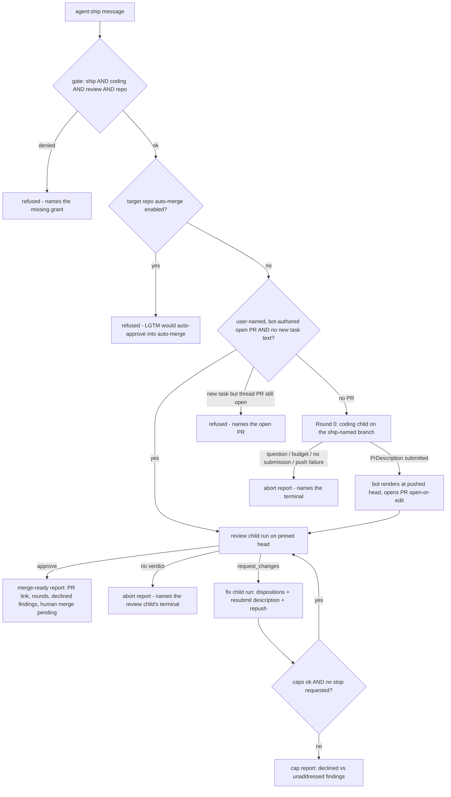

# agent:ship Pipeline - Plan

## Goal Capsule

- **Objective**: Build `agent:ship` ([#131](https://github.com/coreplanelabs/switchboard/issues/131)) — the coding → review → fix loop to LGTM as one Switchboard pipeline — on top of the `submit_pr_description` gate ([pr-description.md gap](../../features/pr-description.md), post-[#332](https://github.com/coreplanelabs/switchboard/pull/332)), delivered as three stacked PRs.
- **Authority**: this plan > the repo's feature specs (`features/*.md`) and AGENTS.md invariants > issue #131's prose. Where issue #131 conflicts with an AGENTS.md invariant, the invariant wins (see KTD1).
- **Stop conditions**: anything that would require ship to merge a PR (out of scope, R6); evidence that a labeled session-settled KTD cannot work; a permission-model change beyond KTD6.
- **Execution profile**: TDD per `features/README.md` — spec + validation criteria before code, each criterion naming its test. Repo conventions (AGENTS.md) govern style and boundaries.
- **Tail ownership**: each PR runs the pr-lifecycle review loop to LGTM; live `[agent]` receipts land on receipts issues, never in the spec.

---

## Product Contract

### Summary

Plan the full `agent:ship` effort: PR A closes the `submit_pr_description` gap so PR creation becomes deterministic bot-process code; PR B extracts the dispatcher's review machinery into per-round callable units with zero behavior change; PR C ships the `agent:ship` directive — a round-serial pipeline of budgeted child runs on one card, with structured findings and per-finding dispositions, capped by rounds and wall clock, never merging.

### Problem Frame

The coding and review agents each end at a typed artifact, but the loop between them is manual: a human relays findings, requests re-review, and watches for LGTM. Issue #131 wants that loop to be one Switchboard run. Two structural facts shape the work: PR creation is still prompt-driven (the bot process cannot open a PR today), and every piece of review post-machinery is gated on the top-level resolved agent name inside one `dispatch()` call — neither supports an orchestrated loop as-is.

### Requirements

**Pipeline behavior**

- R1. `agent:ship in <owner>/<repo>: <task>` is a directive on Slack and the CLI; HTTP `/ingress` and the MCP dispatch tool refuse it with a pointer to the run page — both adapters are single-shot request/response and cannot hold a pipeline-length connection. Thread follow-ups are sticky like other agents.
- R2. Round 0: a coding child run implements the task, pushes the pipeline branch, and submits a typed `PrDescription`; the bot process renders the body at the pushed head and opens the PR — ship then holds `{repo, prNumber, headSha}` from code, never from prose.
- R3. Each review round runs on a head sha pinned before dispatch and submits a structured verdict with a findings array; verdict state is never parsed from prose, and a verdict always covers the full diff against base — delta scoping narrows exploration, never verdict scope. A review round that submits no verdict ends the pipeline with an abort report naming the child's terminal (budget, refusal, stop) — never treated as a `request_changes` judgment the reviewer did not make.
- R4. Each fix round addresses all severities including nits, records a disposition per finding (`fixed` or `declined`, with a note), squashes to coherent commits, resubmits the `PrDescription` (the bot re-renders and edits the PR body at the new head), and repushes.
- R5. The loop repeats review → fix until an `approve` verdict; then ship reports merge-ready with the PR link, rounds used, and declined findings.
- R6. Ship never merges and never approves: no merge endpoint is reachable from ship's bot-process code paths, and the coding prompts plus the fix-round skill carry an explicit "never merge, never approve" instruction (coding children hold a write-scoped token where a merge is one command away — the review prompt already carries this; the coding side must too).
- R7. Caps: `maxRounds` (default 3) and a pipeline wall-clock budget `ship.maxMinutes` (default 120), both config-layer resolvable. The pipeline budget is authoritative: each child run is dispatched with its agent's budget clipped to the remaining pipeline time, and a round starts only when the remaining time can hold a useful child run (reservation check). Worst-case rounds exceed the default by design — the caps are ceilings, whichever hits first ends the loop, and the cap report distinguishes declined findings from unaddressed ones.
- R8. Round progress is visible on the run's one status card and as typed events on the run stream (round index, agent, outcome), so per-round cost is derivable from the stream.

**Boundaries and failure honesty**

- R9. Round-0 terminals other than "PR opened" — clarifying question, budget-forced write-up, no `PrDescription` submitted, push/auth failure — end the pipeline with a report naming what happened; ship does not retry a child round.
- R10. Permission: running ship requires `canRunAgent` for `ship`, `coding`, AND `review`, plus the repo allowlist (`canUseRepo`) for the target repo — ship must not grant coding capability to a user denied `coding`, nor drive a write pipeline into a repo the user is denied.
- R11. Restart safety and idempotency: ship never opens a duplicate PR — the bot always looks up the open PR by head branch and edits instead of creating. A ship invocation resumes at review only when ALL hold: a user turn in the thread names the PR (the thread→PR inference reads user turns only), the PR is open, authored by the bot identity, its head repo equals the base repo, and the invocation carries no new task text. A new task in a thread whose PR is still open is refused with a message naming the open PR; a non-bot-authored PR is refused as not ship's to drive. Ship's terminal reports tell the user to include the PR URL when re-issuing ship in the thread. There is no mid-loop resume of round state.
- R12. Loop craft lives in agent-scoped skills (`address-review-findings` for coding, `re-review-delta` for review), not baked into system prompts.
- R13. v1 is resident-path only: when no resident worktree can be attached, ship reports that plainly instead of falling back to cold clones per round.
- R14. `features/agent-ship.md` follows the repo spec conventions exactly (header bullets, numbered Behavior, Validation criteria table with `[unit]`/`[agent]` proofs, receipts issue); the same-PR spec rule applies to every PR in this plan.
- R15. The approving verdict's deterministic `LGTM:` line triggers the org auto-approve workflow — a ship pipeline ends with a GitHub-approved PR no human has read. Ship therefore refuses a target repo with auto-merge enabled, and the merge-ready report re-checks that the PR is still open and names the pending human merge as the remaining gate.

### Scope Boundaries

- **Deferred to Follow-Up Work**: separate child `RunRecord`s with a parent/pipeline id (requires the run-record contract shared with `deploy/cloudflare-memory/worker.ts` — see KTD2); ship over HTTP/MCP (single-shot adapters; needs a job-shaped ingress); cold-sandbox ship path; warm worktree preservation across readonly↔writable round switches (today each mode switch wipes and reclones — cost noted in Risks); same-tree-different-sha head-move detection (empty-commit re-review suppression); the nominal reporter → `/ingress` caller (issue #131 marks it out of scope).
- **Outside this work's identity**: merging PRs (R6); replacing the review agent's single-comment output with per-finding GitHub review threads.

---

## Planning Contract

### Key Technical Decisions

- KTD1. **Ship is a directive through `dispatch()`, not a CommandRegistry command.** AGENTS.md invariant 3's corollary (KTD16 in `features/command-registry.md`): registry commands never start an agent run. `agent:ship` needs an `AGENTS["ship"]` entry so `parseDirectives`/`getAgent` resolve it, and a ship branch in `dispatch()` after agent resolution. This supersedes the session's earlier lean toward a registry command — invalidated by the checked-in invariant.
- KTD2. **One dispatch, one card, one run record; N sequential `runAgent` child rounds, each on its own agent's budgets clipped to the pipeline's remaining wall clock, with pipeline caps on top.** (session-settled: user-approved — chosen over one runner run with a shared budget: per-run budgets make a 3-round loop impossible inside one `runAgent`.) Separate child `RunRecord`s are deferred: `RunRecord`/`RunListItem` is a node-free contract shared with the memory Worker, and the existing substantive-re-review path (`src/core/dispatcher.ts` ~L856–939) already runs `runAgent` twice inside one dispatch — ship generalizes that precedent. Round attribution rides typed events (R8) instead of new records. Cap arithmetic, recorded honestly: at checked-in child ceilings (coding 45 min, review 25 min) a worst-case 3-round pipeline is ~255 min — far above the 120-min default — so on worst-case rounds the wall clock, not `maxRounds`, ends the loop; typical rounds run well below their ceilings, and clipping (R7) guarantees no child can overrun the pipeline cap.
- KTD3. **The `submit_pr_description` gate (PR A) lands before ship.** (session-settled: user-approved — chosen over scraping the PR URL from the coding agent's final prose: the loop's ground truth must come from code.) PR A closes the `[gap]` in `features/pr-description.md` and `features/agent-coding.md`.
- KTD4. **Each child round attaches its own executor with that child agent's toolset.** Chosen over reusing one executor across rounds: a review child on a writable, credentialed worktree re-opens the read-only-boundary bug class the reviewed-head machinery exists to close (`features/resident-repos.md` item 50). Cost: each readonly↔writable switch wipes and reclones the worktree — bounded by the clipped child budgets (R7), flagged in Risks.
- KTD5. **Reuse by extraction (PR B).** (session-settled: user-approved — "reuse the existing repush-void + head-pinning machinery"; extraction is how.) The review pre-flight, attach-head guard, head pin + system composition, substantive-move re-review, verdict post gate, and the coding PR post-step are today branches keyed on `resolved.agentName` inside `dispatch()`. PR B extracts them into callable units with zero behavior change so PR C's rounds can invoke them; without this, ship re-implements each piece and drifts.
- KTD6. **Ship's permission gate requires `ship` ∧ `coding` ∧ `review` ∧ `canUseRepo(user, target repo)`.** Child rounds never re-enter `dispatch()`, so without the compound gate a user denied `coding` — or denied the repo — gains push+PR capability through ship. The ship branch forks after the dispatcher's existing repo gate so the repo allowlist always runs before round 0.
- KTD7. **Findings and dispositions are typed artifacts.** (session-settled: user-approved — chosen over "reply + resolve each review thread": the review agent posts one comment-state review; there are no per-finding threads.) `ReviewVerdict` gains `findings[]` (`id`, `severity: blocking|major|minor|nit`, `file`, `line?`, `title`); the coding side gains `submit_dispositions` (`findingId`, `fixed|declined`, `note`), following `parseVerdictInput`'s fail-closed validation pattern.
- KTD8. **Rounds are strictly serial: the orchestrator awaits each child before dispatching the next, all on the same `threadKey`.** (session-settled: user-approved — chosen over concurrent rounds after the concurrent-review cross-contamination incident.) The head pin before each review dispatch plus the reviewed-head gate catch any slippage. The thread's ref binding is fixed at the first attach and a later hint is ignored — which is why ship must own the branch (KTD12).
- KTD9. **Restart and idempotency contract.** No mid-loop state persists (round state lives in one in-flight `dispatch()`); instead: the bot opens PRs open-or-edit — lookup by head branch first, create only when absent — and resume-at-review requires a user-named, bot-authored, same-repo open PR with no new task text (R11). Terminal reports instruct including the PR URL on re-issue, because the thread→PR inference reads user turns only and cannot see the PR ship announced in its own reply.
- KTD10. **`ship` joins `NO_REFLECT_AGENTS`.** Its final report is per-PR findings content — the exact ephemera #292 excluded from memory reflection for `review`.
- KTD11. **Operator stop short-circuits the pipeline.** The orchestrator checks the run's `RunControl` between child rounds and jumps to the final report; a hard stop inside a child propagates through the existing runner paths.
- KTD12. **Ship owns the pipeline branch.** The resident binds one ref per `threadKey` at first attach and ignores a later differing hint (`features/resident-repos.md` item 16); a thread bound to the base branch would hand every review round the base tree, never the PR head, and the reviewed-head gate would refuse every post. Ship therefore names the pipeline branch itself and binds the thread to it at round 0's attach (`refHint` = the ship branch); the round-0 coding child is told it is already on that branch instead of creating one.

### High-Level Technical Design

Pipeline state machine (PR C):



One review round's internals (extracted units from PR B, sequence):

```mermaid
sequenceDiagram
    participant O as ship orchestrator (in dispatch)
    participant R as resident Worker
    participant RA as runAgent (review child)
    participant GH as GitHub REST (App token)
    O->>GH: pin PR head sha
    O->>R: attach (readonly toolset, same threadKey)
    O->>O: attach-head guard (attached sha = pinned head, else refuse before any model call)
    O->>RA: run with composed review system (pinned sha), budget clipped to remaining wall clock
    RA-->>O: verdict + findings via submit_verdict
    O->>O: observed-head check; substantive move -> void + one re-review
    O->>GH: post review pinned to head (comment-state, verdict line built by code)
    O->>R: release (readonly: always)
```

Directional guidance, not implementation specification — prose and the cited specs are authoritative.

### Sequencing

Three PRs, `gh stack`-managed (PR B depends on A only for CI cleanliness of shared dispatcher tests; PR C depends on both):

1. **PR A — PR description gate** (U1–U3): the coding agent's deliverable becomes a typed object; the bot opens/edits PRs.
2. **PR B — review machinery extraction** (U4): behavior-preserving refactor; no spec changes beyond code pointers.
3. **PR C — agent:ship** (U5–U10): spec first, then verdict/disposition contracts, orchestrator, visibility, skills, live validation.

---

## Implementation Units

Unit index:

| U-ID | Title | Key files | Depends on |
|---|---|---|---|
| U1 | `submit_pr_description` tool + prompt rewiring | `src/tools/workspace.ts`, `src/agents/registry.ts`, `src/core/prDescription.ts` | — |
| U2 | Bot-process PR open/edit with idempotency | `src/execution/githubPulls.ts` (new) | — |
| U3 | Dispatcher renders + opens/edits the PR | `src/core/dispatcher.ts`, `features/pr-description.md`, `features/agent-coding.md` | U1, U2 |
| U4 | Extract per-round review + PR machinery | `src/core/dispatcher.ts`, new `src/core/reviewRound.ts` | U3 |
| U5 | `features/agent-ship.md` spec + README row | `features/agent-ship.md`, `features/README.md` | U4 |
| U6 | Verdict findings[] + `submit_dispositions` | `src/core/reviewVerdict.ts`, `src/tools/workspace.ts` | U5 |
| U7 | Ship orchestrator in `dispatch()` | `src/core/dispatcher.ts`, `src/agents/registry.ts`, `src/config.ts` | U4, U5, U6 |
| U8 | Round visibility: events + card | `src/core/dispatcher.ts`, `src/core/runEvents.ts`, `src/channels/slack.ts` | U7 |
| U9 | Loop skills + manifest | `skills/address-review-findings/`, `skills/re-review-delta/`, `skills/manifest.yaml` | U5 |
| U10 | Live `[agent]` validation + receipts | receipts issues | U7, U8, U9 |

### U1. `submit_pr_description` tool + prompt rewiring

- **Goal**: the coding agent's PR deliverable becomes a validated `PrDescription` object instead of hand-written markdown.
- **Requirements**: R2, R4, R6.
- **Dependencies**: none.
- **Files**: `src/tools/workspace.ts`, `src/tools/workspace.test.ts`, `src/agents/registry.ts`, `src/agents/registry.test.ts`, `src/core/prDescription.ts`, `src/core/prDescription.test.ts` (+ regenerated golden fixtures).
- **Approach**:
  - `PrDescriptionSchema` gains a required `title` field (non-empty after trimming) — the PR title's single source; the #329 golden fixture and body regenerate.
  - New `RunnableTool` `submit_pr_description` in the `full` toolset only; validates with `parsePrDescription`; a schema violation returns a readable string error naming the failing path (the `submit_verdict` error pattern) so the model retries within its own budget; last valid call wins via a `ToolContext.onPrDescription` hook mirroring `onVerdict`.
  - Both coding prompts (`CODING_SYSTEM`, `CODING_SYSTEM_RESIDENT`): replace "write the PR body from the template / open the PR yourself" with "push the branch, then submit the description object"; drop the `curl POST /pulls` and `gh pr create` steps; add an explicit "never merge, never approve" instruction mirroring the review prompt's wording; keep the pr-tour skill load for authoring Tour steps; the diff-digest step feeds the object's content rather than pasted markdown.
- **Patterns to follow**: `submitVerdictTool` (`src/tools/workspace.ts`), `parsePrDescription` (`src/core/prDescription.ts`).
- **Test scenarios**:
  - Valid object → accepted, hook receives it, tool result confirms.
  - Missing section / missing or blank `title` / bad anchor → string error naming the zod path, run continues (no throw).
  - Two calls → the second wins.
  - Toolset wiring: present in `full`, absent from `readonly`/`web`/`none`.
  - Prompt tests: both coding prompts instruct submit-not-open and carry "never merge, never approve"; the resident prompt no longer contains the curl `/pulls` instruction.
- **Verification**: `npm test` green; registry prompt tests red-verified against the old prompts.

### U2. Bot-process PR open/edit with idempotency

- **Goal**: the bot process can open and edit PRs over GitHub REST with the App token — the write path ship and the dispatcher rely on.
- **Requirements**: R2, R11.
- **Dependencies**: none.
- **Files**: `src/execution/githubPulls.ts` (new), `src/execution/githubPulls.test.ts` (new).
- **Approach**: `openPullRequest`, `updatePullRequest`, and `findOpenPrByHead(repo, branch)`; open-or-edit semantics — always look up by head branch first, create only when absent (KTD9). Input provenance is fixed in code: `title` from the validated `PrDescription.title`, `head` from the observed branch, `base` from the caller's resolved base ref — never from free prose. Same shape as `postReviewComment`: App token via `resolveGithubToken`, never a `gh` shell-out (AGENTS.md invariant 5), throw on non-2xx with the response detail.
- **Patterns to follow**: `src/execution/githubComments.ts`; the pulls-by-head query shape in `deploy/cloudflare-resident/gc.ts` consumers.
- **Test scenarios**:
  - Create when no open PR exists for the branch.
  - Existing open PR → edit body/title, no create call.
  - Missing credential → clear throw, no fetch.
  - Non-2xx create → throw carries status + body detail.
  - Lookup uses `state=open` + `head=owner:branch`.
  - `title`/`head`/`base` come from the typed inputs — prose in the description body cannot alter them.
- **Verification**: unit suite green with fetch stubbed; no network in tests.

### U3. Dispatcher renders + opens/edits the PR

- **Goal**: after a coding run ends with a submitted `PrDescription`, the dispatcher observes the pushed head, renders the body at that sha, opens or edits the PR, and reports the URL — closing the `[gap]` in both specs.
- **Requirements**: R2, R4, R14.
- **Dependencies**: U1, U2.
- **Files**: `src/core/dispatcher.ts`, `src/core/dispatcher.test.ts`, `features/pr-description.md`, `features/agent-coding.md`.
- **Approach**:
  - Post-step for coding runs symmetric to the review post-step: observe the head sha AND the branch name (`git rev-parse HEAD` + `git rev-parse --abbrev-ref HEAD`) through the executor before release; resolve `base` from the thread's resident binding ref (`ExecutorSelection.binding.ref`), falling back to the repo's default branch on the cold path; `renderPrDescriptionMarkdown(desc, { repo, headSha })`; open-or-edit via U2 with exactly `{title, head branch, base, body}`; append the PR URL to the reply. Publish the object on the run stream as a typed artifact event (redacted like other payloads).
  - Failure honesty: a run that pushed but submitted no valid description reports the compare URL and says PR creation did not run; a render/open failure reports the error — never a fabricated URL.
  - Spec updates in the same PR: `features/pr-description.md` and `features/agent-coding.md` move the gap to Behavior; validation tables updated.
- **Execution note**: red-verify the new dispatcher tests against the pre-change dispatcher (they must fail without the post-step).
- **Test scenarios**:
  - Description submitted + head observed → render called with the observed 40-char sha; PR opened with the observed branch as head and the resolved binding ref as base; reply carries the URL.
  - Repush flow (second coding run in thread, existing PR) → edit path, body re-rendered at the new head.
  - No description submitted → no PR call; reply says so with the compare URL.
  - Open throws → reply reports failure with the branch compare URL.
  - Readonly (review) runs never trigger the PR post-step.
- **Verification**: `npm test`, `npm run typecheck`; spec tables name each test.

### U4. Extract per-round review + PR machinery

- **Goal**: the review-round and coding-PR machinery become callable units so a ship round can run them without being the dispatch's top-level agent — with zero behavior change for plain `agent:review` and `agent:coding`.
- **Requirements**: R3 (enabler), R13.
- **Dependencies**: U3 (rebases on PR A's dispatcher changes).
- **Files**: `src/core/dispatcher.ts`, `src/core/reviewRound.ts` (new), `src/core/dispatcher.test.ts`.
- **Approach**:
  - Extract into callable units: PR-head pre-flight (unknown-head refusal), the attach-head guard (attached sha vs. resolved PR head, including its current-head second lookup and the not-started refusal), head pin + review system composition, the substantive-head-move void + single re-review, the reviewed-head post gate + `postReviewComment` call, the coding PR post-step from U3 (observe head sha + branch, render, open-or-edit, honest-failure reply), and the per-agent attach/release pairing (executor built from the child agent's toolset, release mode from that agent — KTD4).
  - The extraction is a real parameterization, not a claimed-mechanical move: each unit gets a named signature — inputs (the round's `AgentDef`, provider/model/effort, messages, system composer, card/label updater, `io.reply`, `run.control`, `repoCtx`, `onEvent`, `deps.fetchPrHead`) and returns (answer, observed/review heads, verdict, carried state) — parameterized on the agent instead of `resolved.agentName` checks. Behavior preservation rests on one criterion: the existing dispatcher review and coding suites pass unmodified.
  - `dispatch()`'s existing review and coding paths call the extracted units at their current lifecycle positions (note: the review post gate currently runs after workspace release — preserve that ordering for the plain path even though ship's rounds will invoke the units inside the loop).
- **Execution note**: behavior-preserving refactor — the existing dispatcher review tests must pass unmodified; add characterization tests first for any branch not already covered.
- **Test scenarios**:
  - Existing `dispatcher.test.ts` review and coding-post-step suites pass byte-identical (no assertion edits).
  - New: extracted unit callable with an explicit `AgentDef` — readonly agent yields readonly attach + `release("always")`; writable agent yields writable attach + `release("if-clean")`.
  - Unknown PR head still refuses before any model call.
  - Attach-head mismatch still refuses before any model call when invoked with an explicit `AgentDef`.
- **Verification**: full suite green with the existing review/coding assertions unmodified.

### U5. `features/agent-ship.md` spec + README row

- **Goal**: the feature spec exists before ship code, encoding R1–R13 and R15 as numbered Behavior items and a validation table whose `[unit]` rows name the tests U6–U8 will write (TDD anchor).
- **Requirements**: R14 (and it restates none of R1–R13/R15 — it cites them into Behavior form).
- **Dependencies**: U4 (spec references the extracted units by path).
- **Files**: `features/agent-ship.md` (new), `features/README.md`.
- **Approach**: follow the spec shape exactly (framing, Code/Docs/Tests/Budgets/Receipts bullets, Behavior, Roadmap gaps, Validation criteria). Budgets bullet states: children run on their own agent budgets clipped to the pipeline's remaining wall clock; pipeline caps from config (R7). Roadmap `[gap]` rows: child `RunRecord`s with a parent id; ship over HTTP/MCP; cold-path ship; warm cross-mode worktrees; per-round memory reflection (KTD10 drops the coding rounds' reflection along with the report's ephemera). Open a receipts issue on the Golden Product project and link it.
- **Test scenarios**: Test expectation: none — spec document; its content is pinned by the `[unit]` criteria it names (each must exist by PR C's end).
- **Verification**: spec review against `features/agent-review.md`/`agent-coding.md` shape; README index row present.

### U6. Verdict findings[] + `submit_dispositions`

- **Goal**: the review verdict carries typed findings; the coding side records a typed disposition per finding (KTD7).
- **Requirements**: R3, R4, R7 (declined-vs-unaddressed distinction needs dispositions), R15.
- **Dependencies**: U5.
- **Files**: `src/core/reviewVerdict.ts`, `src/core/reviewVerdict.test.ts`, `src/tools/workspace.ts`, `src/tools/workspace.test.ts`, `src/agents/registry.ts`, `src/agents/registry.test.ts`.
- **Approach**:
  - `ReviewVerdict.findings?: Finding[]` — `{ id, severity: "blocking"|"major"|"minor"|"nit", file, line?, title }`; `parseVerdictInput` validates fail-closed per finding (a malformed finding drops with a note, a malformed array drops the field — verdict itself still stands); `buildReviewPostBody` renders findings under the verdict line.
  - Verdict/severity consistency is fail-closed in `parseVerdictInput`: an `approve` verdict carrying any `blocking` finding downgrades to `request_changes` with the reason in the summary — the posted body can never begin with `LGTM:` over a self-declared blocking defect.
  - `submit_dispositions` tool (`full` toolset): array of `{ findingId, disposition: "fixed"|"declined", note }`; validation mirrors `parseVerdictInput`; hook `onDispositions`, last call wins. Unknown `findingId` → string error naming it.
  - Review prompts: instruct enumerating findings through `submit_verdict` with ids; severity vocabulary defined once here.
- **Test scenarios**:
  - Verdict with valid findings parses; ids surface in the post body in order.
  - Malformed single finding dropped, verdict retained; malformed array → findings absent, verdict retained.
  - `approve` + a `blocking` finding → downgraded to `request_changes`, reason in summary.
  - LGTM-token contract with findings present: an `approve` verdict carrying (non-blocking) findings still yields a body starting with the exact `LGTM:` token; a `request_changes` verdict carrying findings never yields a body starting with `LGTM`.
  - `no verdict submitted` unchanged: still fail-closed non-approve (existing tests untouched).
  - Dispositions: valid set accepted; unknown findingId → error naming it; second call wins.
  - Toolset wiring: `submit_dispositions` in `full` only.
- **Verification**: red-verified against current `reviewVerdict.ts` (new assertions fail pre-change).

### U7. Ship orchestrator in `dispatch()`

- **Goal**: the `agent:ship` branch — round loop, caps, gates, terminal reports.
- **Requirements**: R1, R2, R3, R5, R6, R7, R9, R10, R11, R13, R15.
- **Dependencies**: U4, U5, U6.
- **Files**: `src/core/dispatcher.ts`, `src/core/dispatcher.test.ts`, `src/agents/registry.ts`, `src/directives.ts` (only if the agent-name source needs it), `src/config.ts`, `config/config.example.yaml`, `features/routing-and-config.md`.
- **Approach**:
  1. `AGENTS["ship"]` entry with `resources: { repo: "required" }` (repo and PR resolution are gated on it) and `toolset: "full"`; the top-level attach `dispatch()` already performs serves as round 0's writable executor, so the pipeline pays no extra attach or mode-switch wipe before its first child. Ship's own budgets are nominal (the pipeline is bounded by config caps + clipped child budgets).
  2. Permission gate at the existing post-resolution point, after the dispatcher's repo gate: `ship` ∧ `coding` ∧ `review` ∧ `canUseRepo` (KTD6); the refusal names the missing grant.
  3. Channel guard (R1): HTTP `/ingress` and MCP dispatches of `agent:ship` are refused with a pointer to the run page.
  4. Config block `ship?: { maxRounds, maxMinutes }` (defaults 3 / 120) resolved through the standard layers; each child is dispatched with its agent budget clipped to the remaining pipeline time, and a round starts only when the reservation check passes (remaining time can hold a useful child run).
  5. Round loop (KTD2, KTD8, KTD12): ship names the pipeline branch and binds the thread to it at round 0's attach; sequential `runAgent` children — coding round with the coding `AgentDef` (clipped budgets, `full` toolset), then review rounds via the U4 units (readonly attach, pinned head, attach-head guard), then fix rounds (coding `AgentDef` + `address-review-findings` skill in scope + findings payload as the synthesized user turn). `RunControl.requested` checked between rounds (KTD11).
  6. Entry checks, in order: target repo has auto-merge enabled → refuse (R15); thread has a user-named open PR → resume at review only under R11's full conditions (bot-authored, same-repo head, no new task text), refusing otherwise with the reason; resident attach unavailable → plain report (R13).
  7. Verdict routing: `approve` → merge-ready report (PR link, rounds used, declined findings from dispositions, PR re-checked still open, human merge named as the remaining gate); `request_changes` → fix round; NO verdict → abort report naming the review child's terminal (R3); cap → report distinguishing declined vs unaddressed (dispositions vs findings without dispositions).
  8. Round-0 terminals (R9): no `PrDescription` → abort report naming the terminal (question passthrough: the coding child's clarifying question becomes the reply, pipeline ends, thread stickiness lets the user answer and re-enter). Terminal reports tell the user to include the PR URL when re-issuing ship in this thread (KTD9).
  9. `NO_REFLECT_AGENTS` gains `"ship"` (KTD10). No merge call path exists (R6): ship's bot-process GitHub writes are exactly U2's open/edit + the extracted review post.
- **Execution note**: TDD off the U5 spec table — verdict routing, caps, gates, no-merge, entry-check tests first, orchestrator to green.
- **Test scenarios** (dispatcher harness: `makeDeps`, `capturingProvider`, `fakeIO`, `residentFetchStub`):
  - LGTM round 1: coding → PR → review approve → merge-ready reply carries PR URL, "1 round", and the pending-human-merge line.
  - Findings round trip: request_changes with findings → fix child receives the findings payload verbatim in its synthesized turn → re-review → approve; dispositions appear in the final report.
  - No verdict from review child → abort report naming the terminal; no fix round dispatched.
  - `maxRounds` cap: 3 rounds without approve → cap report lists open findings, splits declined vs unaddressed.
  - Wall-clock: a child is dispatched with `maxMinutes` = min(agent ceiling, remaining pipeline time) — asserted on the child's `RunOptions`.
  - Reservation check: a round is refused when its reservation exceeds the remaining budget even though the deadline has not yet passed → cap report.
  - Permission: user allowed `ship` but not `coding` → refused before any child run, message names `coding`; user allowed all three agents but denied the target repo → refused, no child run.
  - Channel guard: an `agent:ship` message arriving via the HTTP/MCP path → refusal naming the run page, no pipeline.
  - Auto-merge repo → refused before round 0 (R15).
  - Thread with user-named, bot-authored open PR and no new task text → first child is review, no PR create call.
  - Thread PR open + new task text → refusal naming the open PR; no child run.
  - Thread PR authored by a human → refusal ("not ship's to drive"); no child run.
  - Branch binding: each round's attach sha equals the pinned PR head (KTD12).
  - Resident attach fails → plain report, no cold-path clone attempt.
  - Operator soft stop between rounds → no new round, final report labeled stopped.
  - No merge path: assert the fetch stub saw no `PUT .../merge` across every scenario above.
  - Round 0 ends without a description → abort reply names it and instructs including the PR URL on re-issue; no review round.
- **Verification**: `npm test`, `npm run typecheck`; every `[unit]` row in `features/agent-ship.md` maps to a named test.

### U8. Round visibility: events + card

- **Goal**: rounds are legible live and post-hoc (R8).
- **Requirements**: R8.
- **Dependencies**: U7.
- **Files**: `src/core/dispatcher.ts`, `src/core/dispatcher.test.ts`, `src/core/runEvents.ts`, `src/channels/slack.ts`, `src/channels/slack.test.ts`, `features/run-visibility.md` (pointer row if its contract table changes).
- **Approach**: a dedicated typed `RunEvent` variant (`ship_round`) carrying typed `index`, `agent`, and `outcome` fields in `src/core/runEvents.ts` — not a free-text `run_note` that consumers would re-parse; emitted at each round boundary on the one run stream. The status card's round header lives in its own dispatcher-scoped variable composed into `currentFrame()`'s detail above the checklist — the pattern `lastActivity` already uses — so a child's `update_status` (which replaces the checklist outright) cannot erase it. Per-round cost is derivable by slicing `turn` events between round events.
- **Test scenarios**:
  - `ship_round` events appear in order with typed index/agent/outcome for a 2-round pipeline.
  - Card frames contain the round header during round 1 and round 2 (statuses captured by `fakeIO`).
  - A child `update_status` call replaces the checklist but the round header (own variable, composed into the frame) survives.
- **Verification**: unit suite; live check rides U10.

### U9. Loop skills + manifest

- **Goal**: the loop craft ships as agent-scoped skills, not prompt baking (R12).
- **Requirements**: R12, R3, R6.
- **Dependencies**: U5.
- **Files**: `skills/address-review-findings/SKILL.md` (new), `skills/re-review-delta/SKILL.md` (new), `skills/manifest.yaml`.
- **Approach**: both `local: true` manifest entries (the `pr-tour` shape — no `source`/`path`/`upstream`). `address-review-findings` (`agents: [coding]`): address every severity including nits; one disposition per finding via `submit_dispositions`; squash to coherent commits; resubmit the description so the PR body tells the truth; repush; never merge, never approve. `re-review-delta` (`agents: [review]`): narrow the *reading* to the delta since the previously reviewed head plus verification of each prior finding's disposition — exploration scope only, never verdict scope: carry every unresolved prior finding forward and submit a verdict over the whole PR head (the full diff against base).
- **Test scenarios**:
  - `npm run skills:check` green with both entries.
  - SkillStore scoping: `list("coding")` includes address-review-findings and not re-review-delta; inverse for `list("review")`.
- **Verification**: skills check in CI; scoping unit test.

### U10. Live `[agent]` validation + receipts

- **Goal**: live runs proving the loop end-to-end — the machinery AND the judgment — receipts filed.
- **Requirements**: R5, R7, R14, R15.
- **Dependencies**: U7, U8, U9.
- **Files**: receipts issue (Golden Product project), `features/agent-ship.md` validation rows.
- **Approach**: per the spec's `[agent]` rows —
  - Machinery run: `agent:ship` on a small throwaway task in a sandbox repo, reaching LGTM in ≤2 rounds; capture the thread link, PR link, round events on the run page, and the posted reviews pinned to each head.
  - Cap run: one cap-path receipt (set `maxRounds=1` via config for the test thread).
  - Judgment run: one ship run on a real repo task of ordinary size, recording the round count actually used and a human's recorded agreement or disagreement with the run's approving verdict; revisit the KTD2/R7 cap defaults against the observed round count.
  - File everything on the receipts issue (never in the spec).
- **Test scenarios**: Test expectation: none — this is the human/agent-gated live validation the unit rows cannot cover; each receipt maps to a spec `[agent]` row.
- **Verification**: receipts issue comments carry evidence links per environment; the judgment run's human verdict-agreement note is explicitly human-gated.

---

## Verification Contract

| Gate | Command | Applies to |
|---|---|---|
| Unit + integration tests | `npm test` | every PR |
| Typecheck | `npm run typecheck` | every PR |
| Skills manifest check | `npm run skills:check` | PR C |
| Spec convention | validation table rows each name a real test (`file::name`) | PR A, PR C |
| Red verification | new behavior tests fail against the pre-change tree (TDD red step or revert check) | U1, U3, U6, U7 |
| Live receipts | `[agent]` rows executed once on the resident deployment, receipts on the receipts issues | PR C |

CI additionally runs the dist-excludes-tests and worker typecheck passes on every PR; nothing in this plan touches the memory or resident Worker code paths (KTD2 keeps the run-record contract unchanged).

---

## Definition of Done

- All three PRs merged through the pr-lifecycle loop (review to LGTM, ready-state history, PR descriptions per template with Tour).
- Every requirement R1–R15 traced to a green named test or a filed `[agent]` receipt.
- `features/pr-description.md`, `features/agent-coding.md` gaps closed and `features/agent-ship.md` live, each updated in the same PR as its behavior.
- Live receipts (U10): the machinery run to LGTM, one cap-path receipt, and the real-task judgment run with its observed round count and recorded human agreement/disagreement on the approving verdict.
- No dead-end code from abandoned approaches in any PR diff; the extracted-unit refactor (U4) keeps the existing dispatcher review and coding suites passing unmodified.

---

## Risks & Dependencies

- **Per-round worktree churn**: KTD4's per-round attach means every readonly↔writable switch wipes and reclones the resident worktree — up to ~2×maxRounds attaches per pipeline. Budget clipping (R7) guarantees churn can never overrun the pipeline cap, but it eats useful child time; if live runs (U10) show attach dominating, revisit warm cross-mode worktrees (a named follow-up gap) before raising `maxRounds`.
- **PR A changes the coding agent's contract for every run, not just ship**: all coding runs stop opening PRs themselves. The honest-failure path (pushed branch + compare URL when no description was submitted) must be as legible as today's fallback; U3's tests pin it.
- **Decline loops**: a fix round may decline everything; the loop still re-reviews (per contract) and the cap report separates declined from unaddressed — but a hostile decline-everything loop spends review budget. `maxRounds` bounds it; no further circuit breaker in v1.
- **Dispatcher size**: `dispatch()` is already ~1700 lines; U4/U7 must extract rather than inline, or the ship branch becomes unreviewable. The U4 refactor is the guard.
- **Restart mid-pipeline loses round state** (accepted, KTD9): the user re-issues ship with the PR URL — every terminal report says to include it, because the thread→PR inference cannot see the PR ship announced in its own reply. The open-PR entry check plus open-or-edit prevent duplicate PRs; invariant 6 is satisfied by recreatability, not resumption.
