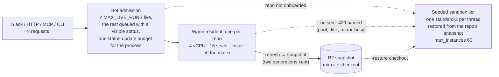
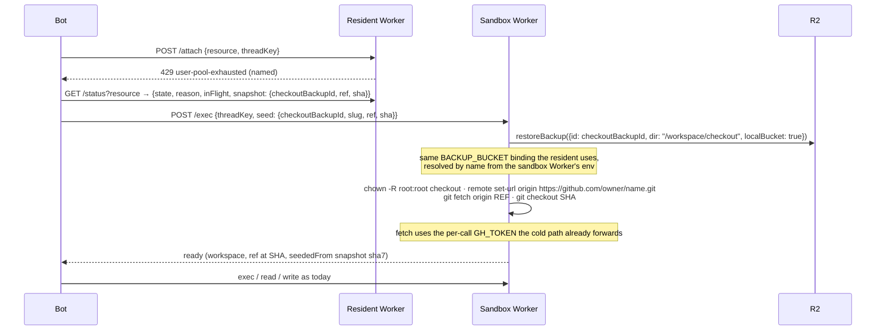

# Fifty concurrent runs - Plan

## Goal Capsule

- **Objective**: Prove, with a repeatable harness and receipts, that Switchboard sustains **50 concurrent runs across the fleet** without tipping over, and put the capacity model that makes it true into code: a bot that admits work honestly, one warm resident per repo with real headroom, and an elastic overflow tier that starts from the resident's snapshot instead of a bare clone.
- **Authority**: this plan > `features/*.md` and AGENTS.md invariants > issue prose. The seven AGENTS.md invariants hold; nothing here changes what a Slack user asks for, only how many can ask at once.
- **Definition of "a run" for this plan**: one live agent run against an onboarded repo doing the representative tool mix a review or coding run does today: attach, a few file reads, one CPU-heavy exec (the repo's test command or an equivalent 60 s of CPU), a write, detach, and the agent's terminal tool call. The target load is 50 of them started within 30 s and held for ten minutes, spread over at least three repos with no more than 16 on any one, plus a single-repo burst of 24 that must overflow legibly.
- **Why 50 and not a rate**: by Little's law, 50 concurrent runs sustained all day would be roughly 660 runs an hour at today's mean duration of 272 s, two orders of magnitude above today's 54 runs a day. Fifty is a **burst-capacity** proof (a release train, a dependency-bump batch, a demo), not a throughput target. The receipt is the burst held for ten minutes.
- **Stop conditions**: any phase whose harness receipt regresses the single-run attach or tool-call latency budgets of the golden plan (AE1: warm attach p50 ≤ 5 s, p95 ≤ 15 s); any change that requires the bot to know resident topology (the bot stays a client of a URL and a bearer); any design that renames the existing per-repo Durable Objects (a DO name is permanent).
- **Execution profile**: three phases plus one gated fourth, each one PR or one `gh stack` series through the pr-lifecycle loop. The harness lands first and is the receipt for every later phase. Live receipts go on the tracking issue.
- **Tail ownership**: instance-type and `max_instances` changes are config in this repo and ship autonomously. Two calls are Justin's: the always-on cost step in D6, and the shape of the elastic tier in D4 (this plan recommends one and names the other).

---

## Where we are today (audit at `427f7d4`, main on 2026-09-07 evening)

Every number below was read from the code, the wrangler configs, the tracker, or the production run history on 2026-09-07, and re-derived by an independent fact-check arm. Three fixes merged the same day changed the cold path ([#541](https://github.com/coreplanelabs/switchboard/pull/541)), the refresh install ([#529](https://github.com/coreplanelabs/switchboard/pull/529), [#527](https://github.com/coreplanelabs/switchboard/pull/527)), and the HTTP ingress ([#530](https://github.com/coreplanelabs/switchboard/pull/530)); the table reflects them.

| Fact | Value | Where |
|---|---|---|
| Measured peak concurrency in production | **8 simultaneous runs** (2026-09-04 00:50Z and 2026-09-07); 433 runs since 2026-08-30 with mean 272 s, p50 143 s, p90 624 s, p99 36 min; 288 reviews, 58 coding, 41 general, 26 command, 15 research, 5 ship | `POST /runs/list` on the state Worker, paged with `before`/`beforeId`, sweep-line over `startedAt`/`finishedAt`; the script ships in Phase 0 as `load:history` so the number is reproducible |
| Resident topology | exactly **one container per repo**: the Durable Object name is the resource id `repo:<owner>/<name>`; no shard, replica, pool, or balancer concept anywhere in `src/`, `deploy/`, `features/`, `docs/plans/` | `deploy/cloudflare-resident/worker.ts` `residentStub`, `wrangler.jsonc` binding comment |
| Onboarded residents | 3 live: `nominal`, `infrastructure`, `switchboard` (`RESIDENT_CAP` 6, `max_instances` 10) | `GET /residents` |
| Resident instance | 1 vCPU / 8 GiB / 16 GB, one type for all repos; always-on ≈ $55/mo (memory $52.6 + disk $2.9, 30.44-day month) per resident, vCPU billed on active use only | `deploy/cloudflare-resident/wrangler.jsonc`, developers.cloudflare.com/containers/pricing |
| Threads per resident, OS-user pool | **16** (`worker2..worker17`, baked into the image); the 17th attach is `429 user-pool-exhausted`, allocated nothing; `/op` runs share the same pool | `worker.ts` `THREAD_USERS`, `Dockerfile` useradd loop |
| Threads per resident, disk budget | **~10 hardlinked trees + 1 installing** on 16 GB for a nominal-sized repo; the pool's 16 + 2 fits neither 16 GB nor the 20 GB platform ceiling; 16 + 1 or 12 + 2 fit at 20 GB | `deploy/cloudflare-resident/instanceSizing.test.ts`, `src/execution/residentDiskBudget.ts` |
| Concurrent `/exec` per resident | **uncapped**: `withThreadBusy` is a counter for detach safety, not a lock; every thread's test run lands on the same single vCPU | `worker.ts` `execThread` |
| Mirror mutex | one FIFO chain per resident; the refresh cycle's fetch, `git clean`, install (10-min budget since #529, resumable since #527), and build run **under** it; an attach waits at most 60 s then falls back cold as `503 mirror-busy` | `worker.ts` `withMirrorLock`, `ATTACH_MUTEX_WAIT_MS`; [#170](https://github.com/coreplanelabs/switchboard/issues/170) open |
| Snapshot on wake | mirror and checkout restored concurrently, each bounded by a 5-min transfer budget (#362); **227 s** end to end for nominal on 2026-09-07, 3.6 s for infrastructure; where nominal's time goes (transfer, `chown -R` over 2.3 GB of `node_modules`, stamp verification) is unmeasured | `GET /residents` `live.lastRestore.ms`; `worker.ts` `doHydrate` |
| Snapshot lifecycle | one generation kept: the previous snapshot's objects are deleted on every refresh that produced a new one; the handle (`{ mirrorBackupId, checkoutBackupId, ref, sha, lockfileHash }`) lives in the resident DO's own storage and is published on the admin `GET /residents`, not on the operator `GET /status` | `worker.ts` `onRefreshAlarm`, `getResidentInfo`, `handleStatus` |
| Bot-side selection | by lifecycle state only (`isServiceable`); `/status` returns `{state, reason, inFlight}` and no seat count; a busy resident is discovered by a failed attach, after up to 60 s of waiting; a 30 s in-process negative cache exists for transport failures only | `src/execution/factory.ts` |
| Cold sandbox (the fallback for every refused attach and every non-onboarded repo) | one container per thread, `standard-3` (2 vCPU / 8 GiB / 16 GB), **`max_instances: 25`** since #541; a thread past the ceiling is answered `fleet-busy`, the executor re-sends after 10, 20, 30 s up to the command's budget (≤ 5 min) and then raises a capacity error the runner never counts as a dead sandbox; the agent clones and installs the repo itself; the Worker runs `@cloudflare/sandbox` 0.3.7 (pinned to its image by `check:sandbox-pair`), a line with no backup or restore API and no R2 binding | `deploy/cloudflare-sandbox/wrangler.jsonc`, `features/execution.md` item 14, `src/execution/sandboxErrors.ts` |
| The bot | one container, **`basic` = 1/4 vCPU / 1 GiB**, `max_instances: 1`, `node:24-slim` with no `NODE_OPTIONS` heap cap, every run in one Node process; admission is **per thread only** (one live run per thread); `activeRuns` is a drain counter, never a gate; `POST /ingress` has an async mode answering `202 {runId, runUrl, threadKey}` (#530) | `deploy/cloudflare/wrangler.jsonc`, root `Dockerfile`, `src/core/threadAdmission.ts`, `src/core/dispatcher.ts`, `src/channels/http.ts` |
| Bot status traffic | every live run edits its Slack card at a floor of one `chat.update` per 3 s (`STATUS_UPDATE_MIN_MS`) and a 5 s heartbeat that changes the elapsed time, coalesced per card, identical frames skipped, rate-limit retries delegated to the Slack WebClient; Slack rates `chat.update` at Tier 3 (about 50 calls a minute per app per workspace) and the coalescer's own comment cites a ~1 request per second per channel special limit | `src/core/dispatcher.ts`, `src/core/statusCoalescer.ts`, api.slack.com rate limits |
| Load or concurrency test | **none**. The only many-thread procedure is a manual recipe: attach 16 thread keys, expect the 17th refused. The golden plan's live receipt is two concurrent CLI threads | `features/resident-repos.md`, golden plan AE1 |
| Platform ceilings (Cloudflare Containers, read 2026-09-07) | custom instance: 1 to 4 whole vCPU, ≤ 12 GiB, ≤ 20 GB disk, ≥ 3 GiB per vCPU, ≤ 2 GB disk per GiB; `standard-4` is 4 vCPU / 12 GiB / 20 GB; account: 1,500 concurrent vCPU, 6 TiB memory; memory $0.0000025/GiB-s, vCPU $0.00002/s active only, disk $0.00000007/GB-s | developers.cloudflare.com/containers |

### Why it tips over today

Fifty runs at today's shape do not fail at the pool or the disk budget. Those two fail fast and legibly (`429`, `503 disk-pressure`). What produces "slow, then broken" is the combination the tracker already documents, in the order it would bite:

1. **The bot is a quarter of a core with no admission and no heap cap.** Fifty concurrent model conversations, each holding its transcript (tool outputs capped at 120,000 characters each) and re-serialising it on every model call, plus a 4 MiB registry backlog per run, is plausibly 350 to 450 MB of live heap on a 1 GiB instance. The failure mode is an out-of-memory kill of every run at once, not a slow degrade. Unmeasured, which is the point of Phase 0.
2. **Fifty cards is a Slack rate limit.** Fifty runs each editing a card every 3 to 5 s is 600 to 1,000 `chat.update` calls a minute against a method rated for about 50, and 16 cards in one channel is several times the per-channel limit on its own. Cards lag by an order of magnitude and terminal frames queue behind stale ones. This is the first thing a user would see collapse.
3. **One vCPU shared by every thread's test run.** Ten concurrent test invocations on one core is ten runs each ten times slower, plus the refresh cycle's own install competing for the same core. The 2026-09-07 degraded spiral (#529, merged) started with an install that outran its 5-min budget; the PR attributes the slowness to two thread runs sharing the vCPU (an inference, not a measurement) and the spiral itself to the orphaned install never being killed. The budget and the sweep are fixed; the contention is not.
4. **The mirror mutex holds install and build.** While a refresh rebuilds, every new attach queues behind it for up to 60 s and then goes cold. Under load, refreshes are slower (point 3), so the window is wider.
5. **The cold path is a 25-seat lifeboat that starts from zero.** Every refused attach lands in the sandbox Worker, which caps at 25 containers and clones plus installs from scratch (minutes for a nominal-sized repo). Past 25, since #541 a run no longer dies: each command waits up to 5 min for a seat and then the model is told the fleet is busy. A bounded stall per command is better than a dead-sandbox finale, but at 50 it is still 25 runs crawling. Phase 0 measures the wait distribution.

Replicas alone fix none of these. Points 1 and 2 are bot work. Points 3 and 4 are CPU and lock contention inside one container. Point 5 is the elastic tier.

---

## Steady-state design

### Vocabulary

- **Run**: one live agent conversation with tool calls, tracked by the bot's run registry.
- **Resident**: the always-warm environment for one onboarded repo: one Cloudflare Sandbox container as a Durable Object holding a bare mirror, a warm checkout with dependencies installed, and per-thread worktrees. Stays one container per repo in this plan.
- **Seat**: one concurrent thread on a resident. Bounded by the OS-user pool (16) and the disk budget.
- **Snapshot**: the resident's R2 backup pair (mirror, checkout) taken after each successful refresh, stamped with ref, sha, and lockfile hash. Its handle is the backup ids plus the stamp.
- **Cold sandbox**: the existing per-thread `standard-3` container in the sandbox Worker. Pay-per-use; today it clones from scratch.
- **Seeded sandbox**: a cold sandbox that first restores the resident's checkout snapshot, then fetches the thread's ref. Same container, same Worker, minutes of install skipped.
- **Admission**: the bot's decision to start a run now, queue it visibly, or refuse it. Today it exists only per thread.

### Capacity model

Three tiers, each with a stated capacity and a legible refusal:

| Tier | Capacity per unit | Units | Refusal when full |
|---|---|---|---|
| Bot | `MAX_LIVE_RUNS` (start at 50) | 1 process | queued, status card says `queued behind N`; refused legibly after a bounded wait |
| Warm resident | 16 seats, 4 vCPU | 1 per onboarded repo | `429` with a named reason, bot overflows to the seeded tier and says so |
| Seeded sandbox | 1 thread, 2 vCPU | `max_instances` 60 | `fleet-busy`: the executor waits for a seat up to the command budget, then the model is told (unchanged since #541) |

Arithmetic for the target. Fifty across three repos is at most 16 warm seats each plus a handful seeded. A single-repo burst of 24 is 16 warm plus 8 seeded, each seeded run on its own two cores. The seeded tier is the horizontal dimension: fifty runs is fifty containers and a hundred vCPU, against an account ceiling of 1,500.

### The seeded overflow path

The bot's note reads `sandbox · seeded from resident snapshot · owner/name · ref@sha7` so a reader can tell the three paths apart from Slack alone. The agent gets a seeded prompt variant that names the ready checkout at `/workspace/checkout` (the cold prompt says "clone the repository"; the resident prompt says `gh` is not installed, which is false in the sandbox image). A repo with no snapshot (not onboarded, or a resident that has never completed a refresh) takes today's clone-from-scratch path with today's note. A restore that finds its handle gone (the resident rotated snapshots underneath it) re-reads `/status` once and retries; a second miss falls to the clone path with a named note.

### What deliberately does not change

- **The bot has no topology knowledge.** It configures one resident URL, one sandbox URL, and their bearers, as today. The seed handle is data the resident already holds; `/status` starts publishing it and the bot forwards it.
- **One container per repo for the warm tier.** The Durable Object name stays `repo:<slug>`. Nothing is re-provisioned to adopt this plan.
- **One mirror and one mutex per resident.** The mutex's justification ("all mirror work happens through this one DO instance") stays true. Phase 2 moves install and build out from under it; it does not shard it.
- **Per-thread isolation** inside the resident (OS users, worktrees, the disk budget, force-detach) is unchanged.
- **The cold path's contract** is unchanged for repos without a snapshot; a seeded sandbox is a cold sandbox with a faster first minute.
- **Who holds which GitHub credential.** The resident mints repo-scoped tokens for its worktrees. The sandbox path receives a bot-minted, toolset-scoped token per call today, and the seeded fetch uses that same token. Note for Phase 3's docs item: the topology explanation currently says the bot holds no GitHub token when execution is sandboxed, which the code contradicts; the explanation is corrected, not the plan.

### Patterns, named

- The warm resident plus seeded sandboxes is **prebuild snapshot + on-demand instances**: the shape of GitHub Actions warm pools with autoscaled runners, Gitpod prebuilds, and Modal's snapshot-backed cold starts. The resident is the prebuild; the sandbox is the instance.
- Bot admission is a **bulkhead with load shedding** (Nygard): a counting semaphore with a bounded FIFO and a shed path. It is deliberately not the shape of `ThreadAdmission`, which is a per-key mutex with an inbox.
- The status-update budget is a **token bucket** owned by the Slack status handle, with terminal frames taking priority. No-op handles (HTTP, MCP, CLI) never draw from it.
- `MAX_LIVE_RUNS` unset is a **Null Object** off-state: today's behaviour exactly.
- The registry stays the **Registry** of onboarded repos; the snapshot handle stays where it is, in the resident DO's storage, and is published rather than moved.

---

## Decisions (D-list)

Each carries evidence and a reversibility grade: **R1** cheap to reverse, **R2** a config or data migration, **R3** a one-way door.

| # | Decision | Evidence | Reversibility |
|---|---|---|---|
| D1 | **The harness lands first and is the receipt for every later phase.** Four commands: `load:history` (the peak-concurrency query above), `load:resident` (N synthetic threads straight at the resident Worker through `ResidentExecutor`), `load:seeded` (N sandbox threads restoring a snapshot and fetching a ref), and `load:e2e` (N runs through a local bot via the async ingress mode with a **scripted model provider**, so process memory, event-loop lag, queue behaviour, and GitHub REST volume are measured without model spend). Card traffic is measured separately by `load:cards`: the Slack status handle, the coalescer, and the budget driven at N simulated cards against a **rate-limited fake Slack Web API**, because the HTTP ingress status handle is a no-op and an e2e run through it exercises zero card traffic by construction. One real-Slack run at N = 16 in a quiet window complements the receipt. Each command writes one JSON result and one markdown receipt. | Nothing measures concurrency today; the largest live receipt is two threads. | R1 |
| D2 | **Bot first.** Global admission, the status-update budget, a heap cap, and a bigger bot instance ship before any resident spend. | The resident's failure modes today are legible `429`/`503`s. The bot's is a process death that takes every run with it, and the card traffic at 50 is an order of magnitude over a Slack tier limit. Fix the tier that fails silently before the tier that fails loudly. | R1 |
| D3 | **Global admission is a bulkhead**: at most `MAX_LIVE_RUNS` live model runs (default 50, counting `general` runs because the bulkhead protects the process, not resident seats; inline command runs and config replies are never queued), the rest queued FIFO with a visible `queued behind N` status and a bounded wait, then a legible refusal. Position in `dispatch()`: after the thread claim and repo resolution; `registry.create` and the start tombstone move **above** the workspace attach so a queued run has a record, while `run_meta` stays after the attach (the attach-head guard can adopt a newer sha); every pre-attach exit after `registry.create` (the needs-ref ask-once return, the head guard's refusal, a queue refusal) closes the record with a terminal status so no provisional `interrupted` tombstone dangles; on SIGTERM every queued run is refused immediately with the deploy notice and its record finished, so the drain waits only on running runs. The bot stays a single instance. | Queued before the thread claim would make a same-thread follow-up wait in a global line instead of steering its run. Queued after the attach would hold a resident seat while waiting. Queued without a record would be invisible to the drain's abandoned-run writer. Multi-bot is out of scope: the admission map, the probe breaker, and Socket Mode are per process. | R1 (the limit and its off-state), **R3** for single-bot in this plan (revisited only if `load:e2e` shows the bot is the ceiling at 50 after D2's changes) |
| D4 | **The elastic tier is seeded sandboxes**: the cold sandbox restores the repo's checkout snapshot before its first command, fixes ownership and origin, and fetches the thread's ref. `max_instances` moves from 25 to 60. This requires moving the sandbox Worker to the resident's SDK line and image (the 0.3.x line has no restore API and cannot extract a snapshot). **Named alternative, not built**: sleepable replicas (`repo:<slug>#<n>`, seeded once from replica 0's snapshot then refreshing independently, no keep-warm alarm, woken by placement). **Gate, two numbers read in Phase 3**: seeded first-command p95 at N = 24 on the largest repo ≤ 90 s, and seeded ≤ half of the cold clone-and-install time for the same repo. If either fails after the restore breakdown is understood, the alternative is designed in a follow-up plan. | The SDK's local-bucket restore resolves `BACKUP_BUCKET` by name from the restoring Worker's env, so a restore across Durable Objects and across Workers is legal; the sandbox Worker only needs the binding and the SDK line. Seeded sandboxes give every overflow thread its own two cores, need no placement, no thread-to-container index, no pool, and no naming scheme, and they speed up every cold run on a repo with a snapshot, overflow or not. Always-on replicas were rejected by all three review arms: a static-leader snapshot scheme fails the per-DO stamp check within one refresh interval, releasing a placement index on detach breaks KTD6 branch stickiness, and paying always-on for burst capacity is the pattern for stateless web tiers, not dev environments. | R1 for the seed; the gate names the flip; **Justin's call** |
| D5 | **The snapshot pipeline changes in two small ways**: the resident keeps **two generations** of snapshot objects (rotation deletes the generation before the previous one; offboard and rebuild delete every recorded id), and the operator `GET /status` publishes the current handle. Each resident stays its own snapshot writer. | Rotation deletes the previous snapshot's objects on every refresh that produced a new one; a seeded restore reading a handle from seconds earlier would 404 exactly during a release train, the plan's own burst scenario. Publishing backup ids to operator scope reverses a deliberate "lifecycle, not config" scoping; acceptable because the ids are opaque UUIDs that are useless without the R2 binding, and the operator bearer already attaches and executes in the same repo. Sharing writers is what broke the rejected leader design. | R1 |
| D6 | **The resident instance moves to 4 vCPU / 12 GiB / 20 GB** (the platform's custom-type ceiling, identical to `standard-4`, kept in the object form the sizing test requires). Cost ≈ $83/mo provisioned per resident (memory $78.9 + disk $3.7, 30.44-day month) vs $55 today, plus vCPU on active use: up to $210/mo if all four cores stay busy, which under load they are meant to. | Points 3 and 4 of "why it tips over" are contention inside one container. 4× the CPU and a 16-tree disk are config plus two rewritten sizing assertions (see Phase 2). The `Dockerfile`'s test-runner pins are re-decided against 16 threads sharing 4 cores: the `VITEST_MAX_*`/`VITEST_MIN_*` pins most likely stay at 1; `UV_THREADPOOL_SIZE` (2) and the `NODE_OPTIONS` heap (1536 MB) are re-derived. | R2, **Justin's call** on the always-on cost step |
| D7 | **#170 (install and build off the mirror mutex) is in scope, Phase 2.** | It is the documented cause of `mirror-busy` under load and a single-container change. | R1 |
| D8 | **The bot instance moves to `standard-1`** (½ vCPU / 4 GiB) with `NODE_OPTIONS=--max-old-space-size` sized to the instance in the same PR as admission; `standard-2` if `load:e2e` says so. | A 1 GiB Node process with no heap cap and fifty transcripts is an OOM waiting for a burst; the resident image sets the cap for exactly this reason and the bot image does not. | R2 |
| D9 | **Full-load runs against production happen in a quiet window** with the deploy preflight's 0-in-flight check first, a `--max-threads` guard defaulting to 16 without an explicit override, and a binding purge afterwards (Phase 0 adds `POST /debug {op: "purge-bindings", prefix: "load:"}` behind the admin bearer, deleting only evicted bindings under the prefix). There is no staging fleet. | Eviction keeps binding records by design (KTD6); without a purge every N = 50 run leaves 50 evicted rows on the resident's detail page forever. | human-gated, per run |
| D10 | **Target SLOs for the receipt**, N = 50 across ≥ 3 repos (≤ 16 each) held for 10 minutes, plus a single-repo burst of 24: warm attach p50 ≤ 15 s and p95 ≤ 60 s under load (the golden plan's post-wake budget); seeded first-command p95 ≤ 90 s at N = 24 and ≤ half of cold (D4's gate); trivial-exec round-trip p95 ≤ 3 s; every overflow carries a named reason; zero `mirror-busy`; zero `fleet-busy` waits with 60 seats; zero runs ending in the infra-abort finale; bot RSS under 75 % of its instance memory; card update lag p95 ≤ 10 s against the fake Slack sink's published limits; GitHub REST calls per run counted and no secondary rate limit hit. | Numbers a reader can check, derived from budgets the golden plan already set. | R1 |
| D11 | **Out of scope, recorded so nobody re-derives it**: autoscaling anything; a second bot process; a staging fleet; always-on replicas; a placement strategy interface with one implementation; cross-repo snapshot sharing. | YAGNI until a Phase 0 or Phase 3 number says otherwise. | R1 |

Justin's calls, named: D4 (seeded sandboxes over replicas, with the gate) and D6 (the always-on cost step). Everything else ships on the evidence above.

### Cost of the steady state

Published rates, 30.44-day month, always-on memory plus disk; vCPU excluded from the floor because it bills on active use. A seeded run is a `standard-3` alive for the run plus restore plus its 5-min idle tail, about 12 minutes: $0.015 with idle cores, $0.044 with both cores busy throughout. Phase 0 replaces the estimate with a measurement.

| Fleet | Always-on $/mo |
|---|---|
| Today: 3 residents at 8 GiB / 16 GB | ≈ $166 |
| After D6: 3 residents at 12 GiB / 20 GB | ≈ $248 |
| Seeded overflow at today's 54 runs/day, if every run overflowed | ≈ $25 to $70 |
| Seeded overflow at 500 runs/day, if every run overflowed | ≈ $225 to $660 |

Residents are a latency purchase (a 38 s attach against minutes of clone and install), not a cost saving, until volume is several times today's. The seeded tier costs nothing while idle, which is why it is the elastic dimension. Model spend at 50 concurrent runs dwarfs all of these figures.

---

## Phases

### Phase 0 — The harness (1 PR)

**Builds** the harness as pure modules under `src/load/` (aggregation, the scripted provider, the fake Slack sink, the run loops), tested by the bot vitest project like every other `src/**/*.test.ts`, with thin `scripts/load/*.mjs` entrypoints behind npm scripts, the way `check:sandbox-pair` and `check:lockfile` are shaped. The binding purge's decision (which bindings a prefix purge may delete) is a pure module too, `src/execution/bindingPurge.ts`, imported by the resident Worker like `residentDiskBudget.ts`.

- `load:history`: the run-store sweep-line that produced the "peak 8" number, so the baseline is reproducible.
- `load:resident --resource repo:<slug> --threads N --hold 600s --profile review|coding`: opens N `ResidentExecutor`s with thread keys `load:<runId>:<i>`, staggered over 30 s, each looping the profile's tool mix for the hold period, then releasing. Records per operation latency, status, and refusal reason; samples `/status` and `/residents` every 15 s for in-flight and disk. Refuses to start unless the target reports 0 in flight (D9), stops at `--max-threads` 16 without the override, and purges its bindings on exit or interrupt.
- `load:seeded --resource repo:<slug> --threads N`: N sandbox threads restoring the repo's checkout snapshot and fetching a ref, reporting restore, fix-up, and first-command latency, the `fleet-busy` wait distribution past `max_instances`, and R2 egress for the run. Before it can run, Phase 0 proves the **current** cold path works end to end at N = 1 (the SDK/image pair was split by a dependency bump this week and re-pinned the same day). This is the number D4's gate reads.
- `load:e2e --threads N --hold 600s`: starts a **scripted provider** (an OpenAI-compatible server the existing `openaiCompat` provider points at; a state machine keyed on the count of tool results in the conversation, ending with the agent's terminal tool so the post-run steps execute) and drives N `POST /ingress` requests in async mode (`202 {runId}`, #530) with distinct threads at a local bot configured to use it, then polls run history to completion. Measures end-to-end run duration, queue wait once D3 exists, bot RSS and event-loop lag from `/healthz`, GitHub REST call counts per run, and the resident-side numbers above. The resident and sandbox Workers under test are the production ones.
- `load:cards --cards N --hold 600s`: the Slack status handle, coalescer, and budget driven by N simulated runs against a **fake Slack Web API** (`chat.postMessage`, `chat.update`, `conversations.replies` with the published Tier 3 and per-channel limits and `Retry-After`), reporting card update lag and retry counts.
- Output: `load-results/<runId>.json` and `<runId>.md` with the tables above and the D10 checks as pass/fail lines.

**Baseline receipt**: `load:resident` at N = 8, 16, 24 against nominal in a quiet window (the tip-over curve before any fix), `load:seeded` at N = 1 on the current cold path, `load:e2e` at N = 8, 24, 50 against a local bot at today's shape, `load:cards` at N = 8, 24, 50.

### Phase 1 — The bot (1 PR)

Global admission (D3) with the queued status on the run card and the `/healthz` line carrying `live/queued/max`; the Slack status handle's token bucket with terminal-frame priority (and the coalescer comment corrected to cite Slack's published limits); `standard-1` and the heap cap (D8). Run-page and `runs list` `queued` states are deferred until the queue has engaged in production once. Receipt: `load:e2e` at N = 50 shows the queue engage and drain, no OOM, no infra-abort finales; `load:cards` at N = 50 shows lag within D10.

### Phase 2 — The warm tier (2 PRs)

1. **#170**: install and build into a staging checkout outside the mirror mutex; swap under the lock. Receipt: `load:resident` at N = 16 during a forced refresh shows attach p95 unchanged and zero `mirror-busy`.
2. **Instance**: resident to `{ vcpu: 4, memory_mib: 12288, disk_mb: 20000 }`; `instanceSizing.test.ts` rewritten where its theses change (memory becomes `max(ceil(disk/2000) GiB, 3 GiB × vCPU)`, a CPU decision now; the not-over-provisioned guard re-based on the 16 + 1 working set; the "fits neither" test retitled); the `Dockerfile` runner pins re-decided (D6); the wrangler comment rewritten. Receipt: `load:resident` at N = 16 on nominal meets D10.

Expected after Phase 2: **16 concurrent seats per repo at SLO**, the bot honest at 50.

### Phase 3 — The seeded tier (1 `gh stack` series of 3 PRs)

1. **Sandbox Worker on the resident's SDK line**: `@cloudflare/sandbox` and the image move to the version the resident runs; `worker.ts` is rewritten against it (the 0.3.x session-reset workaround goes); `check:sandbox-pair` keeps guarding the pair; the Worker gains a `test` script and a vitest project (`deploy/cloudflare-sandbox/vitest.config.mjs`, an explicit file list like the resident's) so its pure modules are tested, which `src/vitestWorkspace.test.ts` then enforces. Ships in its own release ahead of 3.3. Receipt: the cold path at N = 1 and the `fleet-busy` behaviour from #541 unchanged on the new line.
2. **Snapshot lifecycle** (D5): the rotation decision (which generation's objects to delete, what offboard and rebuild delete) is a pure module, `src/execution/snapshotRetention.ts`, imported by the resident Worker; `/status` publishes the handle; the offboard and rebuild deletion counts are updated in the spec. Receipt: unit tests on the retention decision; a live refresh shows two generations in the bucket and the third gone.
3. **The seed**: the seed plan (handle shape, fix-up commands, retry-then-clone decision) is a pure module, `src/execution/seedPlan.ts`, shared by the sandbox Worker and the bot's executor; the sandbox Worker gains the `BACKUP_BUCKET` binding and a `seed` field on its first-command body, restores `{id, dir, localBucket: true}`, runs the ownership and origin fix-up, fetches and checks out; the bot's per-thread executor reads the handle from the `/status` probe it already makes and forwards it; the selection carries `seeded` and the workspace path; the agents get the seeded prompt variant; the attach note names the seed; the fresh-handle retry then clone fallback; `max_instances` 60. `features/execution.md` and `features/resident-repos.md` gain the seeded items; `docs/explanation/worker-topology.md` gains the R2 edge and drops the claim that the bot holds no GitHub token on the sandbox path; `features/execution.md` item 12's deploy-order sentence is reconciled with AGENTS.md. Receipt: `load:seeded` at N = 24 on nominal reads the D4 gate; `load:resident` at N = 24 on one repo shows 16 warm and 8 seeded with named notes; `load:e2e` at N = 50 across three repos meets D10 end to end.

### Phase 4 — Gated: sleepable replicas

Only if the D4 gate fails. Designed as its own plan with the constraints the review arms established: replica 0 keeps today's DO name; followers are seeded once from replica 0's snapshot and then own their stamps; the thread-to-replica index is as durable as the KTD6 binding (never released on detach or eviction; seats are what detach releases); replicas push seat samples to the registry so placement reads storage only under the input gate; a stale echoed replica is the existing `needs: "attach"` recovery; `RESIDENT_CAP` becomes a sum of replicas checked in `updateConfig`; the bare resource of a replicated repo is capped at 60 characters so `#<n>` fits the SDK's 63-character sandbox id.

---

## Blast radius (tracked non-test files at `427f7d4`)

| Workstream | Files | Mitigation | Rollback |
|---|---|---|---|
| Bot admission and status budget | `src/core/runAdmission.ts` (new), `src/core/dispatcher.ts` (the create/tombstone move and the pre-attach exits), `src/core/statusCoalescer.ts`, `src/channels/slack.ts` (the status handle), `src/core/drain.ts` and `src/index.ts` (the drain) | `MAX_LIVE_RUNS` unset = today's behaviour; the budget defaults to Slack's published limits | unset the setting |
| Bot instance | `deploy/cloudflare/wrangler.jsonc`, root `Dockerfile` | one PR | revert; a bot deploy |
| #170 | `deploy/cloudflare-resident/worker.ts` (`onRefreshAlarm`, `takeSnapshot`, restore verification, `READY_MARKER`) | its own live proof per the issue | revert; the engine re-provisions |
| Resident instance | `deploy/cloudflare-resident/wrangler.jsonc` (config and its comment), `instanceSizing.test.ts`, `deploy/cloudflare-resident/Dockerfile` | the sizing test pins the arithmetic | revert the config; a resident deploy re-provisions at the old size |
| Snapshot lifecycle | `src/execution/snapshotRetention.ts` (new), `deploy/cloudflare-resident/worker.ts` (rotation, teardown, `handleStatus`) | two generations is strictly more retained than one | revert; the next rotation prunes |
| Sandbox Worker SDK line | `deploy/cloudflare-sandbox/package.json`, `Dockerfile`, `worker.ts`, `vitest.config.mjs` (new), `scripts/check-sandbox-pair.mjs`, `src/vitestWorkspace.test.ts` | the pair check; the cold path receipt at N = 1 | revert the pair together |
| The seed | `src/execution/seedPlan.ts` (new), `deploy/cloudflare-sandbox/wrangler.jsonc`, `deploy/cloudflare-sandbox/worker.ts`, `src/execution/cloudflareSandbox.ts`, `src/execution/factory.ts`, `src/core/reviewRound.ts` (prompt selection), `src/agents/registry.ts` (the seeded prompt variant) | `seed` absent = today's path | revert the bot; an old sandbox Worker ignores the field |
| Spec and docs | `features/execution.md`, `features/resident-repos.md`, `features/run-visibility.md` (the queued card status; the run-page state is recorded as deferred), `docs/explanation/worker-topology.md` | same-PR rule | with the code |

Reference counts for anyone touching the resident routing later: `residentStub` has 12 call sites; `registryStub` has 13 call sites plus one in-DO `REGISTRY.get`; `repoResourceId` has 9 call expressions in `src/`. None of them change in Phases 0 to 3.

Deploy order is the documented one: state Worker, bot, resident, sandbox. Every wire change here is an added optional field, so an old Worker ignores what a new bot sends and a new Worker serves an old bot; the resident deploys in Phases 2 and 3 still need the preflight's 0-in-flight window, and the sandbox Worker's SDK move ships in its own release ahead of the seed, so the bot that depends on it never deploys first (the same shape #541 used).

---

## Risks

| Risk | Likelihood | Impact | Mitigation |
|---|---|---|---|
| The full-load harness disturbs real work | medium | medium | D9: quiet window, 0-in-flight preflight, `--max-threads` guard, binding purge on exit |
| Seeded restore is slow under 24 concurrent readers of one snapshot, or extraction dominates | medium | high | `load:seeded` measures restore, fix-up, and first command separately before Phase 3.3 is built; the D4 gate names the fallback; if extraction dominates, the SDK's presigned-mount restore (the resident's wrangler already names the R2 S3 secrets) is measured before replicas are considered |
| The sandbox SDK migration changes cold-path behaviour | medium | medium | Phase 3.1 ships alone with the N = 1 cold receipt and the #541 `fleet-busy` behaviour re-proven on the new line |
| The bot is still the ceiling after Phase 1 | low | high | `load:e2e` at 50 is Phase 1's receipt; `standard-2` and, past that, the D3 R3 revisit |
| Slack's real limits differ from the fake sink's | medium | medium | the sink implements the published tier and per-channel limits with `Retry-After`; one real-Slack run at N = 16 in a quiet window complements the receipt |
| The scripted provider diverges from real model behaviour | certain | low | it measures infrastructure, not the model; one real-model run at N = 16 complements the receipt |
| `standard-4` residents raise the always-on bill by half | certain | low | D6 is Justin's call; the dash shows seats used so an oversized resident is visible |
| The sizing test's rewritten theses drift from the config | low | low | the test reads `wrangler.jsonc` and fails on drift, as today |

---

## Validation summary

Every criterion below is bound to a proof when its phase lands; the receipts go on the tracking issue.

| Criterion | Proof |
|---|---|
| Percentile aggregation, refusal counting, and D10 evaluation are correct on hand-built samples | `[unit]` `src/load/aggregate.test.ts::*` |
| The scripted provider answers the `openaiCompat` wire shape, advances per tool result, and ends on the terminal tool | `[unit]` `src/load/scriptedProvider.test.ts::*` |
| The fake Slack sink enforces the tier and per-channel limits, answers `Retry-After`, and records per-card lag | `[unit]` `src/load/fakeSlack.test.ts::*` |
| The harness refuses to start with work in flight, stops at `--max-threads`, and purges its bindings on exit or interrupt | `[unit]` `src/load/residentLoad.test.ts::*` against the in-memory resident stub |
| The purge decision selects only bindings under the given prefix and only evicted ones | `[unit]` `src/execution/bindingPurge.test.ts::*` |
| Baseline curves: resident at N = 8, 16, 24; seeded at N = 1 on the current cold path; e2e at N = 8, 24, 50; cards at N = 8, 24, 50 | `[agent]` receipts on the tracking issue |
| Admission: run 51 is queued with a visible status and a record, admitted when a seat frees, refused legibly after the bounded wait; every pre-attach exit closes the record; SIGTERM refuses queued runs and finishes their records; `MAX_LIVE_RUNS` unset = no queue; inline command runs never queue | `[unit]` `src/core/runAdmission.test.ts::*`, `src/core/dispatcher.test.ts::global admission::*`, `src/core/drain.test.ts::refuses queued runs::*` |
| The status budget never exceeds the configured rate, terminal frames pre-empt progress frames, and no-op handles never draw from it | `[unit]` `src/core/statusCoalescer.test.ts::process budget::*`, `src/channels/slack.test.ts::status budget::*` |
| `load:e2e` at N = 50: queue engages and drains, RSS under 75 %, no infra-abort finales; `load:cards` at N = 50: lag p95 ≤ 10 s | `[agent]` receipts |
| #170: attach p95 unchanged during a forced refresh, zero `mirror-busy` at N = 16 | `[agent]` receipt; `[unit]` the staging-swap decisions in `src/execution/residentRefresh.test.ts::staging swap::*` |
| Sizing: memory is `max(disk-derived, 3 GiB × vCPU)`; 16 + 1 trees fit 20 GB with the reserve; the config is not over-provisioned against that set | `[unit]` `deploy/cloudflare-resident/instanceSizing.test.ts::*` |
| Snapshot retention keeps two generations and deletes every recorded id on offboard and rebuild | `[unit]` `src/execution/snapshotRetention.test.ts::*` |
| `/status` publishes the snapshot handle | `[agent]` `GET /status` on a warm resident carries `snapshot.checkoutBackupId` equal to the admin listing's |
| Sandbox Worker on the new SDK line: cold path at N = 1 and `fleet-busy` unchanged | `[unit]` `src/execution/sandboxErrors.test.ts::*` on the new line's messages; `[agent]` receipt |
| Seeded sandbox: the seed plan builds the `{id, dir, localBucket: true}` handle, the fix-up commands, and the retry-then-clone decision; the executor forwards the seed and reports it; no snapshot → today's path | `[unit]` `src/execution/seedPlan.test.ts::*`, `src/execution/cloudflareSandbox.test.ts::seed::*`, `src/execution/factory.test.ts::seeded selection::*` |
| Seeded sandbox live: restore, fix-up, fetch, and first command succeed on nominal; a rotated handle retries once then clones with a named note | `[agent]` `load:seeded` receipt |
| The seeded prompt variant names the ready checkout and is selected only for seeded runs | `[unit]` `src/core/reviewRound.test.ts::prompt variants::seeded` |
| Single-repo burst of 24: 16 warm, 8 seeded, every overflow note named; seeded first-command p95 read against the D4 gate | `[agent]` `load:resident` + `load:seeded` receipts |
| N = 50 across three repos meets D10 end to end | `[agent]` `load:e2e` receipt |
| Specs and the topology explanation describe admission, the seeded tier, the two-generation snapshot, and the corrected credential statement | `docs:check` and `specs:check` in `verify` |
