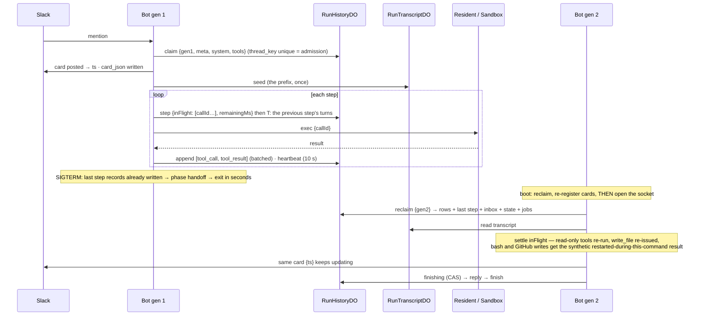

# Durable runs - Plan

## Goal Capsule

- **Objective**: A run outlives the bot container. A bot rollout or a hard kill neither loses a run nor freezes its card: the run resumes in the next container from a durable ledger, or is closed as `interrupted` with its full transcript. `/runs`, run pages, stop requests, and thread admission read that one ledger across container generations. With that in place the release pipeline's bot step stops waiting for `inFlight == 0`, so nobody waits for a bot deploy.
- **Where it sits**: this record replaces Phase 1 ("the bot") of the [fifty-concurrent-runs plan](2026-09-07-001-feat-fifty-concurrent-runs-plan.md). Its bulkhead admission and Slack status budget stay, built on the ledger this record adds. Phases 0, 2, 3 of that plan are unchanged. It also supersedes the clause of `features/run-history.md` item 26 that says the store needs nothing for the resume step: it needs the tables below.
- **Success criteria** are Justin's five on [#556](https://github.com/coreplanelabs/switchboard/issues/556), each with a receipt on that issue: (1) a run survives a forced bot deploy and finishes normally; (2) a run survives a hard kill, completing or closing as `interrupted` with its transcript; (3) `/runs`, run pages and thread admission read one durable registry across generations; (4) nobody waits during a bot deploy, measured as p95 time-to-first-ack across a rollout; (5) the deploy gate is removed in the same PR series with the specs updated.
- **Stop conditions**: any design that moves a model-provider key, the Slack token, or a GitHub credential out of the process that holds it today; any resume path that re-issues a command whose effects are unknown (a `git push` in flight at the kill must never run twice); any ledger write on the run's hot path beyond one awaited round trip per step; any edit to a transcript the model has already read (the provider rejects a conversation whose earlier turns changed).
- **Execution profile**: one `gh stack` series of five PRs, each reviewed through the pr-lifecycle loop; the harness gains a `rollover` command whose receipts prove criteria 1, 2 and 4.
- **Tail ownership**: forced deploys and kills against production for the receipts are Justin's calls on timing; everything else ships autonomously.

---

## Where we are today (survey at `7959a38`, re-checked at `676b682`, 2026-09-08)

| Fact | Value | Where |
|---|---|---|
| The live registry | in-process: one `Map<id, RunState>` holding the event backlog (5000 events / 4 MiB), the stop control (an `AbortController`), and the run token; finished runs evicted after 60 s; the module header says a restart ends the runs it was streaming by design | `src/core/runRegistry.ts` |
| What is persisted, and when | three kinds of whole-record write through one writer: a provisional `interrupted` tombstone at start (request, `run_meta`, context), the finish record after the reply, and a drain-time abandonment record on SIGTERM only — from six dispatcher call sites on three paths (agent runs, ship branches, inline command runs) plus the drain; **nothing between** | `src/core/dispatcher.ts`, `src/index.ts`, `src/core/runHistoryWriter.ts` |
| The store | `RunHistoryDO` on the state Worker, one object per configured store key: `runs` (summary row) + `run_events(run_id, seq)` + `meta`; `put` replaces the summary row and deletes-then-reinserts the whole event set; retention 30 d / 5000 runs / 2 GiB with a 6-hourly sweep; the event table already pages by `seq > afterSeq` but no route appends | `deploy/cloudflare-memory/worker.ts` |
| Durable Object SQLite limits the store already codifies | 2 MB per string/BLOB/row, 100 KB per statement, 100 bound parameters per query, 10 GB per object; event rows capped at 64 KiB upstream so none nears 2 MB; the Worker's request bodies capped at 512 KiB (2 MiB for `/runs/put`) | `worker.ts` limits comment, `MAX_BODY_BYTES`, `MAX_RUN_PUT_BODY_BYTES` |
| The persisted events are not the transcript | `tool_call.summary` capped at 200 chars, `tool_result.output` at 8,000 (the executor allows 120,000), tool inputs other than `command` never stored, and the model's `thinking` blocks never stored — Anthropic verifies them by signature and rejects a conversation whose earlier turns changed; the OpenAI-compatible provider carries no thinking parts, but its runs are equally unreconstructible from events | `src/core/runEvents.ts`, `src/runner.ts`, `src/providers/types.ts`, `src/providers/anthropic.ts` |
| The runner loop | a local `messages: ChatMessage[]` copy, **append-only** (every mutation is a push); results appended in the model's order so the array equals a serial loop's; the request also carries `system`, `tools`, `maxTokens`, `effort`, `cacheTtl`; budgets (`deadline`, `turn`, `iteration`) are loop locals; the finale is one tool-less call | `src/runner.ts` |
| The seed prefix | `buildMessages(history, text, images, documents)`: the Slack thread's turns plus attachments inlined as base64; thread-wide budgets of 24 MB images and 32 MB documents; the bot's own messages appear as `assistant` turns in a rebuilt history, so rebuilding the seed from Slack later is not deterministic | `src/core/dispatcher.ts`, `features/slack-channel.md` item 5 |
| What a resumed run would need but cannot get today | the Slack card `ts` (a closure in the adapter), the executor selection and worktree path (a closure in the dispatcher), the composed `system` text (memory retrieval, instructions, workspace path, review head pin) and the tool list (static toolset plus live MCP discovery), the run token (never persisted), ref and head sha (only inside the `run_meta` event), the follow-up inbox (a plain array carrying the channel handle), the verdict, PR description, checklist and pushed branch (dispatcher-local callbacks) | `src/core/dispatcher.ts`, `src/channels/slack.ts`, `src/core/threadAdmission.ts` |
| Executors already outlive the bot | the resident Worker persists the thread binding in its own object and `attach()` is idempotent per thread key, minting the credential server-side at attach and re-minting at the first stale writable exec; the sandbox is one container per thread key with a 5-min idle sleep and per-call `resolveEnvs`; both re-attach from `{threadKey, repo, ref, sha, agent}` | `deploy/cloudflare-resident/worker.ts`, `src/execution/resident.ts`, `src/execution/cloudflareSandbox.ts`, `src/execution/factory.ts` |
| A command in flight when the bot dies | keeps running in the resident or sandbox; its **effects** are observable afterwards (`git status`), its **output** is not (streamed to the dead process; neither Worker keeps it); the resident already answers a deploy-swapped command with "the operation may still have run; re-check its effects before re-running it" and never blind-retries `/exec` | `cloudflareSandbox.ts`, `resident.ts` |
| Thread admission | one in-process `Map<threadKey, LiveThread>` with an inbox array; a new container's map is empty, so a follow-up in the boot gap starts a second run on the same workspace, the exact failure it was built to end | `src/core/threadAdmission.ts` |
| The Slack card | `ts` in a closure; `liveCards` per process; the reconnect handler's orphan sweep closes any bot card with a live glyph that this process does not own as `❌ interrupted`, deciding ownership inside its read phase | `src/channels/slack.ts`, `src/channels/slackCatchUp.ts` |
| The drain and the gate | SIGTERM closes the socket first, holds up to 15 min for in-flight runs, reflections and history writes, writes abandonment records, exits; the platform starts the replacement only after exit; a crashed container restarts only on the next request (the keep-alive cron, every minute); the preflight refuses on `inFlight > 0` or `draining`; `decideRestart` 409s on the same; the live gate treats `draining` as never live; since #577 the release job waits up to 45 min per attempt and re-dispatches itself up to eight times (about six hours) before a person decides | `src/index.ts`, `src/core/drain.ts`, `deploy/cloudflare/preflight.mjs`, `src/deploy/restart.ts`, `src/deploy/liveGate.ts`, `deploy/cloudflare/worker.ts`, `features/release-and-deploy.md` item 13 |
| The boot | process start to Slack connected: 2.8 s on the live container on 2026-09-07 (not verifiable offline); container scheduling before that is the platform's, documented only as "on the order of seconds", bounded by a 120 s port-ready timeout | `GET /healthz`, `deploy/cloudflare/worker.ts` |
| Compare-and-swap already on the state Worker | `ConfigDO.put` with `expectedVersion`; `transitionTicket(from)` applies exactly one of two concurrent transitions; multi-statement writes run in `transactionSync` | `deploy/cloudflare-memory/worker.ts` |
| Production incident that motivates this | #250: a second deploy on a draining instance replaced it at once; card frozen, run gone from `/runs` | `features/slack-channel.md` item 8 |

### Why the gate exists and what it costs

The gate is the only thing standing between a rollout and a killed run. It costs users nothing and costs releases a wait that can now stretch to six hours of self-redispatch on a busy bot. Quiescing the bot (stop admitting, wait, roll) was considered on #556 and rejected: it makes users wait for the deploy. The only fix that removes the gate without blocking anyone is a run that survives the process.

---

## Steady-state design

### Vocabulary

- **Ledger**: the durable record of every live run: its row and lease, its event stream, its step records, its state, its inbox — in the existing `RunHistoryDO` — and its transcript, in a per-run transcript object.
- **Lease**: which bot generation owns a run and until when. Renewed by heartbeat; an expired lease is what a booting container reclaims.
- **Generation**: one bot process, minted at boot (`startedAt` plus a random suffix) and sent with every ledger write as a **fencing token**: the ledger refuses a write from a generation that no longer holds the lease, so a zombie old container can never overwrite a run the new one resumed.
- **Step**: one iteration of the runner loop: a model turn, then its tool calls. The **step record** is written before the tools run and names the tool calls in flight.
- **Transcript**: the raw `ChatMessage[]` the model has seen, thinking blocks included, stored append-only as one row per content part. Never edited.
- **Resume**: a booting container claims expired leases, rebuilds each run's executor from its row, settles the tool calls the step record says were in flight, and re-enters the runner loop from the transcript.

### The ledger

`RunHistoryDO` is extended (no second index class: a run's finish must write the finished record and delete the lease in **one** transaction, which two objects cannot do). **Live runs never enter the `runs` table**: that table's `finished_at` drives retention and listing, its status enum is closed, and its columns are NOT NULL for finished facts, so a live row there would be listed as finished and trimmed first. Live runs are rows in `live_runs` only; `finish` upserts `runs` exactly as today. Events append to the existing `run_events` as they happen. A new `RunTranscriptDO`, one object per run (`idFromName(runId)`), holds the transcript rows, so transcript bytes never queue behind an admission decision in the index object.

```sql
-- RunHistoryDO (existing object, new tables; CREATE TABLE IF NOT EXISTS in the constructor)
live_runs(
  run_id TEXT PRIMARY KEY,
  thread_key TEXT NOT NULL UNIQUE,      -- one live run per thread, enforced by the store
  owner_gen TEXT NOT NULL,              -- the fencing token
  lease_until INTEGER NOT NULL,
  started_at INTEGER NOT NULL,
  phase TEXT NOT NULL,                  -- live | handoff | finishing
  stop TEXT,                            -- null | soft | hard
  meta_json TEXT NOT NULL,              -- RunMeta + agent, model (pinned), effort, repo, ref, headSha, pr, readonly, selection, workspace
  card_json TEXT,                       -- {channel, ts} of the status card
  system_text TEXT NOT NULL,            -- the composed system prompt, verbatim
  tools_json TEXT NOT NULL,             -- the serialized ToolDef[] (names + schemas), verbatim
  state_json TEXT NOT NULL              -- verdict, prDescription, checklist, pushedBranch, reviewHead, infra counters
);
run_steps(run_id, step, seq, in_flight_json, inbox_consumed_seq, remaining_ms, turn, iteration,
          PRIMARY KEY (run_id, step));  -- written BEFORE the step's tools run
run_inbox(run_id, seq, message_json, PRIMARY KEY (run_id, seq));  -- the IncomingMessage minus attachment bytes, plus channel/ts/threadTs
run_jobs(run_id, kind, payload_json, PRIMARY KEY (run_id, kind));  -- post-run work a handoff leaves for the next generation; one reflection per run, so (run_id, kind) is the key

-- RunTranscriptDO (one object per run)
run_messages(idx INTEGER, part INTEGER, json TEXT, PRIMARY KEY (idx, part));  -- one row per ContentPart, ≤ 2 MB each
attachments(ref TEXT PRIMARY KEY, media_type TEXT, bytes BLOB);              -- base64 parts over 1 MB, referenced from run_messages
```

Routes (all `MEMORY_TOKEN` bearer, multi-statement writes in `transactionSync`):

| Route | Object | Semantics |
|---|---|---|
| `POST /runs/claim {run, gen, leaseMs, meta, system, tools}` | history | Inserts `live_runs` only. `thread_key UNIQUE` refuses a second live run on the thread with `409 {live: {runId, agent, startedAt}}` — the admission decision. |
| `POST /runs/seed {runId, gen, messages}` | transcript | Writes the seed prefix once, at start, chunked ≤ 2 MiB per request; attachments over 1 MB by reference. |
| `POST /runs/step {runId, gen, step, seq, inFlight[], inboxConsumedSeq, remainingMs, turn, iteration, messages}` | transcript, then history | The one awaited write per step, in this order: first the new transcript turns (the previous step's tool-result turn and this step's assistant turn), then the step record. So a step record present means the transcript is complete up to it and the run resumes; an assistant turn present with no step record means nothing of that step was dispatched, and its tools are simply run. The reverse order would name tools that never ran. `409 fenced` on a stale generation. |
| `POST /runs/heartbeat {runId, gen, leaseMs}` | history | Extends `lease_until` iff `owner_gen == gen`; answers `stop` and `phase`. |
| `POST /runs/append {runId, gen, events[]}` | history | Appends events with their registry `seq`; batched by the bot (500 ms or 32 events); fenced. |
| `POST /runs/state {runId, gen, state}` | history | Replaces `state_json`; written when a `submit_*` callback, a checklist update, or a pushed branch fires (rare). |
| `POST /runs/inbox {runId, message}` | history | Appends a follow-up. Any generation (a steer arrives on whichever container is up). |
| `POST /runs/stop {runId, mode}` | history | Sets `stop`. Any generation. Answers whether the owner's lease is live, so an operator's stop on an orphan closes it at once. |
| `POST /runs/finishing {runId, gen}` | history | CAS `phase: live → finishing`; taken **before** the reply is sent, so a fenced old generation never replies. |
| `POST /runs/finish {runId, gen, record}` | history | Upserts `runs` with the finished record exactly as today's `put`, and deletes `live_runs`, `run_steps`, `run_inbox`, `run_jobs` for the run, in one transaction; the transcript object is then cleared (idempotent; an orphaned transcript is harmless and swept). |
| `POST /runs/reclaim {gen, now}` | history | Atomically takes every `live_runs` row with `lease_until < now` or `phase = handoff`: sets `owner_gen = gen`, extends the lease, answers the rows with their last step record, unconsumed inbox, state, and pending jobs. Called once per boot, **before the Slack socket opens**. |
| `GET /runs/live` | history | The live rows with `owner_gen`, `lease_until`, `phase`, for `/runs`, the run page, and the orphan sweep's second guard. |

### The run, before and after



**Hard kill** is the same picture without the handoff mark: the lease expires (30 s), the platform restarts the container on the next request (the keep-alive cron, within a minute), the new generation's reclaim takes the row, the transcript is complete up to the last step record, and the events appended since the last flush (≤ 500 ms) are the only loss. Resume reads the transcript object's highest turn index against the step record: equal means resume from the record; one ahead means the assistant turn landed but the step was never dispatched, so its tools run fresh; anything else (a partial turn) closes the run `interrupted` with every event the ledger holds, which is criterion 2's other allowed outcome.

### What deliberately does not change

- **Where credentials live.** Provider keys and the Slack token stay in the bot; the resident mints its own repo-scoped tokens; the sandbox path's per-call token is minted by the bot per call as today. The ledger holds no credential and no run token (finished-run pages are already tokenless; a resumed run mints a new token and refreshes the card link).
- **The executors and their wire.** Both are keyed by thread key and already survive the bot; `callId` rides on `/exec` only so the step record can name it. No new routes on the execution Workers in this series (see D4).
- **The transcript the model has seen.** Never edited, never trimmed: the transcript object stores it whole.
- **The event vocabulary and the run page.** Events are appended, not reshaped; the run page's SSE `id` and the stored `seq` are already the same number.
- **Slack stays the durable "was this handled" record** (the Slack spec's rule, derived from AGENTS.md invariant 6, "state survives restarts"). The 👀-then-reply predicate and the catch-up are untouched; the ledger is the durable "is this run alive" record, a different question. The run registry's header, which today says a restart ends the runs it was streaming, is the one place the codebase currently contradicts invariant 6, and this record is what makes it true.
- **Single bot instance.** Socket Mode is one connection; `max_instances: 1` stays. Generations are sequential, never concurrent, except for the zombie window the fencing token exists for.
- **Retention.** Finished runs live in `RunHistoryDO` exactly as today; the live tables only ever hold live runs.

### Patterns, named

- **Lease with a fencing token** (Kleppmann): the owner generation on every write makes a resumed run safe against the old container waking up; the runner also checks the fence result before each tool call and before the reply, not only at write time.
- **Write-ahead step record**: the step's tool calls are named durably before they run, so a resume knows what may have executed.
- **Memento** (GoF): the transcript plus the step record capture the runner's state without exposing its internals.
- **Null Object** for the off-state: with no run history configured there is no ledger, and the registry behaves exactly as today.
- **Compare-and-swap phases**: `live → finishing → finished`, `live → handoff`, the same shape as `ConfigDO.transitionTicket`.

---

## Decisions (D-list)

| # | Decision | Evidence | Reversibility |
|---|---|---|---|
| D1 | **Durability by ledger and resume; the runner stays in the bot.** The alternative, running each run inside a Durable Object with the bot as a thin Slack adapter, is **deferred**. Strongest argument for it: it removes the whole lease/handoff/reclaim protocol, whose only reason to exist is a mortal process. Strongest arguments against, and decisive: it moves three secrets (provider key, GitHub App key, Slack token) into a Worker, changing every trust boundary the topology explanation codifies; the DO-runner still needs the transcript persisted under the same 2 MB row limit and fifty live transcripts share a 128 MB isolate; and a Durable Object alarm has a 15-min wall-clock ceiling, so a run would have to re-enter per step anyway, the same machinery this record builds. | Review Part A: roughly 2 to 3× the surface, including the two largest modules; developers.cloudflare.com/durable-objects/platform/limits. | **R2**; the DO-runner stays open as the later end state |
| D2 | **The transcript is stored, not reconstructed from events, and never edited.** One row per content part in a per-run object; the seed written once at start; attachments over 1 MB by reference. The model is pinned in `meta_json` (thinking blocks are model-bound). No trimming: a transcript that cannot be stored closes the run `interrupted` at reclaim. | Thinking blocks verified by signature; events omit tool inputs and cap outputs; the runner's array is append-only, so rows are the natural shape and a whole-array replace would re-upload the transcript every step. | R1 |
| D3 | **`system` and the tool definitions are stored at claim and re-sent verbatim on resume.** The composed system prompt (memory retrieval, instructions, workspace path, head pin) and the live MCP discovery are not reproducible; a resumed run re-binds tool runnables by name and appends a synthetic result for a tool that no longer exists. A resume is a **valid continuation** (same system, same tool definitions, same messages, thinking intact), not a byte-identical request across a code deploy. | `dispatcher.ts` composes `system` per run; `tools` = static toolset + MCP discovery. | R1 |
| D4 | **Settling the step in flight: never re-issue a command whose effects are unknown.** Side-effect-free tools (reads, GitHub reads, web, skills) are re-run; `write_file` is re-issued (idempotent, the resident already does so after a runtime swap); `bash` and GitHub writes (`github_issue_*`) receive the synthetic result the resident already uses ("restarted during this command; re-check its effects before re-running it"); `submit_*` results are replayed from `state_json`. **Idempotent exec results on the execution Workers (`GET /exec/result?callId`) are not built in this series**: the synthetic result meets the stop condition today, and `load -- rollover` measures how often a kill lands inside a command; the retention route is a follow-up if that number justifies a deploy-order dependency on both Workers. | The synthetic answer is the existing `runtime-replaced` behaviour the model already handles. | R1 |
| D5 | **Admission moves to the ledger.** `thread_key UNIQUE` on `live_runs` is "one live run per thread" across generations; the claim's `409` carries what the steer message needs. The in-process `ThreadAdmission` stays as the same-process fast path and mirror. The inbox is durable: each row is the `IncomingMessage` minus attachment bytes plus `channel`, `ts`, `threadTs`, enough to rebuild the channel handle, so the fresh-turn settle of unconsumed follow-ups works after a resume; the step record's `inboxConsumedSeq` says which follow-ups the run has read. | `threadAdmission.ts` is a per-process map; the dispatcher's settle path needs the channel handle. | R1 |
| D6 | **The bulkhead and the status budget** from the superseded Phase 1 stand, built on the ledger: `MAX_LIVE_RUNS` counts `live_runs`, so the limit holds across generations. | Fifty-runs plan D3, D8; the `load -- cards` receipt. | R1 |
| D7 | **Reclaim completes before the socket opens.** `index.ts` awaits `reclaim(gen)` and re-registers every reclaimed card in `liveCards` before `app.start()`; the orphan sweep additionally consults `GET /runs/live` so a card of a live run is never closed. A mention that got only 👀 before the kill has a claimed row with no step record: reclaim closes it `interrupted` before the socket opens, so the catch-up's re-dispatch claims the thread cleanly instead of being steered into a dying run. | The sweep decides ownership inside the reconnect handler's read phase; the only safe ordering point is before the connect. | R1 |
| D8 | **The drain becomes a handoff.** On SIGTERM the bot marks every live run `handoff` (step records are already durable), awaits pending history writes for up to 6 s (one retry), records pending reflections (`src/core/memory/reflection.ts`) as `run_jobs` for the next generation, and exits. `DRAIN_DEADLINE_MS` becomes the handoff budget (30 s); `COLD_START_ALLOWANCE_MS` and `MIN_CATCH_UP_WINDOW_MS` are re-derived from the boot measured under criterion 4, not asserted here. The abandonment writer becomes the fallback for a run whose handoff mark fails. | The drain today waits on active runs, pending reflections and pending history writes (`src/index.ts`); the friction record is the only fire-and-forget work lost, and it is best-effort today. | R1 |
| D9 | **The finishing phase precedes the reply.** A generation CASes `live → finishing` before `io.reply`; a `409 fenced` there means another generation owns the run, and the old one stops silently. The runner also aborts before its next tool call when a heartbeat is fenced. A run reclaimed in `finishing` has already replied: the new generation runs the post-steps from `state_json` and finishes without a second answer. Residual: none for the reply; a GitHub review post can duplicate only if gen 1 dies between the post and `finish`, and the reviewed-head guard already dedupes that. | `dispatcher.ts`: `card.done` and `io.reply` precede `writeHistory` today. | R1 |
| D10 | **The gate goes in the same series** (criterion 5), scoped to the bot: the preflight's `inFlight`/`draining` refusals become warnings, `decideRestart` stops 409ing on them, the live gate stops treating `draining` as never-live, the release job's `--wait-max` and the self-redispatch chain from #577 go, and the specs change in the same PRs. The container-application-state refusal and the fail-closed cases stay. **The resident preflight is out of scope**: a resident Worker deploy still refuses while a resident has work in flight, because it swaps the isolate under a running command; the in-flight `runtime-replaced` path already survives it. | `preflight.mjs`, `restart.ts`, `liveGate.ts`, `commands/deploy.ts`, `deploy-production.yml`. | R1 |
| D11 | **Lease 30 s, heartbeat 10 s, append flush 500 ms or 32 events, step write awaited, per-request body ≤ 2 MiB (chunked), attachment reference threshold 1 MB.** | Bounds the event loss to one flush and the reclaim wait to one lease plus the platform restart; the numbers are constants a receipt can check. | R1 |
| D12 | **Kill injection is a bot admin route**, `POST /admin/crash` (`deploy:write` bearer, `SIGKILL` on the process), so criterion 2 is reproducible from the harness; `deploy restart --force` remains the rollout injection. | Criterion 2 needs the #250 shape on demand. | R1 |
| D13 | **Receipts are harness runs**: `load -- rollover --mode restart|crash --threads N` starts N e2e runs on the scripted model, injects the event mid-run, and reports survivors, runs resumed, steps in flight at the kill and how each was settled, time-to-resume, transcript bytes per run, ledger write rate, and p95 time-to-first-ack for mentions posted during the roll (the catch-up delay note and run start times). Run at N = 50 as well as 16: the write rate into the index object is measured, not assumed. | Fifty-runs plan D1: the harness is the receipt. | R1 |

Justin's calls: none new. D1 is the one to disagree with if the Durable-Object runner is wanted now.

### The write budget, estimated

Fifty live runs, one step every 5 s, one append flush per 500 ms, one heartbeat per 10 s: about 100 appends, 10 step records and 5 heartbeats a second into the index object, each a small row; the per-object soft limit is 1,000 requests a second. Transcript bytes (up to 120 KB per tool result) go to per-run objects and never queue an admission. `load -- rollover` at N = 50 replaces this estimate with a measurement.

---

## Phases (one `gh stack` series)

1. **The ledger** (state Worker): the `live_runs`, `run_steps`, `run_inbox`, `run_jobs` tables in `RunHistoryDO`, the `RunTranscriptDO` class with a `v6 new_sqlite_classes` migration, the routes above, pure decision modules under `src/core/runLedger/` (claim and fence decisions, reclaim selection, the transcript-completeness rule, transcript chunking, the append flusher), workerd tests for both objects added to the memory Worker's explicit vitest include list, the `WorkerRunLedger` client beside `WorkerRunStore`. `features/run-history.md` gains the ledger items and its item 26 is rewritten. Off-state: no `runHistory` config → no ledger.
2. **Write-through** (bot): claim at the admission point with `system` and `tools`; the seed written once; the step record awaited before each step's tools with the previous step's turns; `RunRegistry.publish` appends via the batched flusher; `state_json` on the `submit_*`, checklist and pushed-branch callbacks; `card_json` at card creation; `finishing` before the reply; `finish` replaces the finish write on both dispatch paths; `MAX_LIVE_RUNS` reads the ledger count. The in-process registry stays the read cache. Receipt: a run's rows visible in the ledger while it runs.
3. **Resume** (bot): the boot sequence extracted from `index.ts` into `src/core/boot.ts` so its order is testable, with `reclaim` before `app.start()`; `runAgent` re-entry from a transcript, step record and budget (`remainingMs`); executor reconstruction from `meta_json`; the in-flight settlement rules (D4); card re-registration and the sweep's ledger guard; `/admin/crash`; `load -- rollover`. Receipts: criteria 1 and 2.
4. **Admission and the handoff**: `claim`'s `409` drives the steer; the durable inbox and `inboxConsumedSeq`; the runner's fence check; the SIGTERM handoff with `run_jobs`; `/runs` and the run page read `GET /runs/live` ∪ history and the tombstone-suppression merge is removed; `features/thread-admission.md`, `live-view.md` item 17, `run-history.md` item 27 updated. Receipts: criterion 3 (a follow-up posted during the boot gap is steered by the new container into the resumed run) and criterion 4 (p95 first-ack), then `drain.ts` constants re-derived from the measurement.
5. **The gate** (D10): preflight, `decideRestart`, live gate, `commands/deploy.ts`, the release workflow, `features/slack-channel.md` item 8, `features/release-and-deploy.md` item 13. Receipt: criterion 5, a release deploy over a busy bot completes without waiting, and the runs it rolled over finish.

---

## Blast radius (tracked non-test files at `676b682`)

| Workstream | Files | Mitigation | Rollback |
|---|---|---|---|
| Ledger | `deploy/cloudflare-memory/worker.ts`, `deploy/cloudflare-memory/wrangler.jsonc` (transcript class migration), `src/core/runLedger/*` (new), `src/core/runLedgerWorker.ts` (new) | additive tables; workerd tests | the bot stops calling it |
| Write-through | `src/core/runRegistry.ts`, `src/runner.ts` (step hook, `callId`), `src/core/dispatcher.ts` (claim, seed, state, card, finishing, finish on both paths), `src/core/runHistoryWriter.ts` | Null Object off-state | config off |
| Resume | `src/core/boot.ts` (new) + `src/index.ts` (reclaim before start), `src/runner.ts` (`resumeFrom`), `src/execution/factory.ts` (rebuild from meta), `src/channels/slack.ts` (`registerLiveCard`), `src/channels/slackCatchUp.ts` (ledger guard), `deploy/cloudflare/worker.ts` (`/admin/crash`), `src/load/rolloverLoad.ts` + `scripts/load.ts` | resume only claims expired or handoff rows | revert the bot |
| Admission + handoff | `src/core/threadAdmission.ts`, `src/core/dispatcher.ts`, `src/index.ts`, `src/core/drain.ts`, `src/core/runsService.ts`, `src/core/memory/reflection.ts` (job hand-off) | the in-process map stays as the mirror | revert |
| The gate | `deploy/cloudflare/preflight.mjs`, `src/deploy/restart.ts`, `src/deploy/liveGate.ts`, `src/core/commands/deploy.ts`, `.github/workflows/deploy-production.yml` | last in the series, after criteria 1–4 have receipts | re-enable the refusals |
| Specs | `features/run-history.md`, `thread-admission.md`, `live-view.md`, `slack-channel.md`, `release-and-deploy.md`, `run-loop.md`, `execution.md` | same-PR rule | with the code |

Deploy order for the series: state Worker (the new tables and class) → bot. The execution Workers are untouched in this series. Every wire change is an added optional field.

---

## Risks

| Risk | Likelihood | Impact | Mitigation |
|---|---|---|---|
| Index-object write rate at 50 runs slows admission | low | medium | small rows only in the index object; transcripts per run; measured at N = 50 by `load -- rollover` before the gate goes |
| A large seed (tens of MB of attachments) makes a hard kill expensive to resume | medium | low | seed written once at start; attachments by reference; the resume fetch is measured; a seed that cannot be stored closes the run `interrupted` (criterion 2's allowed outcome) |
| A zombie old container writes after the new one resumed | low | high | fencing token on every write; the runner checks the fence before each tool call and before the reply; `finishing` CAS before the reply |
| A resume re-runs a command with effects | low | high | D4: never; bash and GitHub writes get the synthetic result; `write_file` is idempotent; reads are safe |
| The step write adds latency to every step | certain | low | one awaited small write per step (allowed by the stop condition); measured as tool-call round trip in the harness |
| Platform restart after a crash waits for the keep-alive | certain | low | bounded by the minute cron; measured under criterion 4; a faster wake is a follow-up if the number matters |
| The orphan sweep closes a card the new container is about to resume | low | medium | D7: reclaim and re-registration before the socket opens; the sweep's second guard reads the ledger |
| A code deploy changes an agent's system prompt or toolset mid-run | certain | low | D3: the stored `system` and tool definitions are re-sent; the run continues on what it saw |
| Reflections and friction records in flight at SIGTERM are lost | certain | low | reflections become `run_jobs` for the next generation; the friction record is best-effort today and stays so |

---

## Validation summary

| Criterion | Proof |
|---|---|
| Claim: `thread_key UNIQUE` refuses a second live run and answers the live one; a stale generation is fenced on step, heartbeat, append, state, finishing, finish | `[unit]` `deploy/cloudflare-memory/runLedger.test.ts::*` (workerd), `src/core/runLedger/decisions.test.ts::*` |
| Reclaim takes exactly the expired and handoff rows, atomically, with the last step, inbox, state and jobs; a claimed row with no step record is closed `interrupted` | `[unit]` `deploy/cloudflare-memory/runLedger.test.ts::reclaim::*` |
| Transcript: one row per part, chunked requests under 2 MiB, attachments by reference over 1 MB, read back equal to the array written; never edited | `[unit]` `src/core/runLedger/transcript.test.ts::*`, `deploy/cloudflare-memory/runTranscript.test.ts::*` |
| Step record before tools: `inFlight` names every tool call of the step; the previous step's turns land with it | `[unit]` `src/runner.test.ts::step record::*` |
| Append flusher: 500 ms or 32 events, seq-monotonic, never blocks publish | `[unit]` `src/core/runLedger/flusher.test.ts::*` |
| Runner re-entry: from a transcript, step record and `remainingMs`, the next request carries the stored system, the stored tool definitions and the same messages; the budget continues; each in-flight tool is settled by D4's rule | `[unit]` `src/runner.test.ts::resume::*` |
| Executor rebuilt from `meta_json`; resident re-attach and sandbox reconnect by thread key | `[unit]` `src/execution/factory.test.ts::rebuild from meta::*` |
| `state_json` carries verdict, PR description, checklist, pushed branch; a resumed review posts the stored verdict | `[unit]` `src/core/dispatcher.test.ts::durable run state::*` |
| Card re-registered before the socket opens; the sweep skips ledger-live cards | `[unit]` `src/channels/slackCatchUp.test.ts::orphan sweep skips live runs::*`, `src/core/boot.test.ts::reclaim before start::*` (the boot sequence extracted from `index.ts` into a pure module so its order is testable) |
| Handoff exits within 30 s: every live run marked, history writes awaited up to 6 s, reflections recorded as jobs | `[unit]` `src/core/drain.test.ts::handoff::*` |
| `/runs` and the run page read ledger ∪ history; no tombstone suppression | `[unit]` `src/core/runsService.test.ts::ledger merge::*` |
| Criterion 1 live: `load -- rollover --mode restart --threads 8` → every run finishes from generation 2, cards unfrozen, run pages served | `[agent]` receipt on #556 |
| Criterion 2 live: `load -- rollover --mode crash --threads 8` → every run completes from generation 2 or is `interrupted` with its transcript within one lease plus the platform restart | `[agent]` receipt on #556 |
| Criterion 3 live: a follow-up posted during the boot gap is steered into the resumed run by the new container | `[agent]` receipt on #556 |
| Criterion 4 live: p95 time-to-first-ack for mentions posted across a rollout; the ledger write rate at N = 50 | `[agent]` `load -- rollover` receipts on #556 |
| Criterion 5 live: a release deploy over a busy bot completes without waiting and its runs finish | `[agent]` receipt on #556 and #505 |

## Glossary

- **Run**: one agent conversation with tool calls, from mention to reply.
- **RunHistoryDO / RunTranscriptDO**: Durable Objects on the state Worker; history holds the run index, events, leases and finished records; a transcript object holds one live run's messages.
- **Generation**: one bot process; the fencing token for ledger writes.
- **Step record**: the durable note, written before a step's tools run, of which tool calls are in flight.
- **Handoff**: the SIGTERM path that marks runs for the next generation instead of holding the process.
- **Catch-up**: the reconnect scan that re-dispatches Slack mentions the bot never acknowledged.
- **Orphan sweep**: the reconnect pass that closes bot cards with a live glyph that no running process owns.
