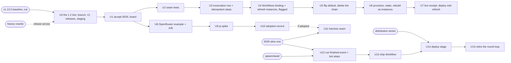
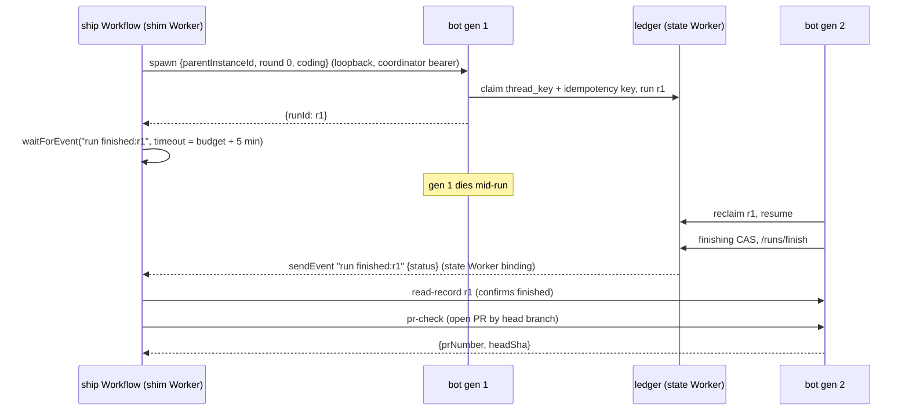

# Orchestration program - Plan

## Goal Capsule

- **Objective**: Execute record [0029](../decisions/0029-durable-objects-store-workflows-schedule.md) as one program on the **Switchboard: v1.2** board ([project 4](https://github.com/orgs/coreplanelabs/projects/4)) and the **1.2 line** (a long-lived `v1.2` branch whose releases are 1.200.0, 1.201.0 and so on, called "1.2" in public; `main` stays the 1.1x line for patches and the work already in flight there; 2.0.0 is saved for the release moment Justin picks): the resident lifecycle engine moves its cycles onto Cloudflare Workflows and loses its alarm chain and watchdog re-arm; `agent:ship` becomes a Workflow coordinator whose children are `dispatch()` runs; the agent harness track (OpenRouter as a documented example, a pi spike, an adoption record, pi per child) runs to its decision; and the follow-ups the ship-restart and durable-runs plans deferred are each absorbed into a unit here, deferred with the trigger that revives them, or named as out of scope. One plan, one board, one order.
- **Authority**: record 0029 holds every decision this plan executes; records [0002](../decisions/0002-dispatcher-is-the-only-orchestrator.md), [0007](../decisions/0007-authorization-policy-table.md), [0016](../decisions/0016-long-lived-process-not-serverless.md), [0019](../decisions/0019-durable-run-ledger-resume-after-kill.md) and [0026](../decisions/0026-capability-profiles-and-request-routing.md) bound it. Where this plan and 0029 disagree, 0029 wins and the plan is wrong.
- **Baseline**: release v1.13.0 (`902ecd50`, cut 2026-09-10; receipts on [#809](https://github.com/coreplanelabs/switchboard/issues/809)) is the frozen 1.x baseline every V2 unit re-baselines against; record 0026 is accepted against it ([#815](https://github.com/coreplanelabs/switchboard/pull/815)). The `v1.2` branch is cut from it.
- **Gates it waits on, not units it owns**: the public flip's history rewrite ([#750](https://github.com/coreplanelabs/switchboard/issues/750)), which the `v1.2` branch is cut after or rebased across; record 0026 slice one (a 1.x item that lands on `main` and reaches `v1.2` at the next sync); spawn/await ([#108](https://github.com/coreplanelabs/switchboard/issues/108) Phase 1 and 2, a V2 item); the distribution series ([#792](https://github.com/coreplanelabs/switchboard/issues/792), merged through PR C, with its live receipts still owed).
- **Stop conditions**: any design that gives a Workflow Worker a credential it does not hold today (the bot's shim Worker holds no model key, Slack token or GitHub credential; the resident Worker keeps the GitHub App identity of record 0009 and gains nothing); any design that puts a Slack token or a GitHub credential beyond the executor's repo-scoped token into a sandbox or resident container; a pi extension loaded from a path the model or the repository can write; any resume or retry that re-issues a command whose effects are unknown; any child run that reaches an executor without passing the authorize stage as the requesting user; a Workflow step that awaits a container command longer than 30 minutes; a step method whose second call with the same inputs has effects.
- **Execution profile**: every PR targets `v1.2` and squash-merges there; `v1.2` takes `main` regularly and lands on `main` once as 2.0.0 at the release moment (KTD12); each phase is its own PR series through the pr-lifecycle review loop; every unit is an issue on the v1.2 board with the plan as its parent (KTD13); the two seam tests (U2) are the first receipts and gate every resident unit; specs change in the same PR as the code they describe (`resident-repos.md`, `execution.md`, `agent-ship.md`, `agent-coding.md`, `costs.md`, `tracing.md`, `run-history.md`, `release-and-deploy.md`).
- **Tail ownership**: the `v1.2` branch's sync cadence and the 2.0.0 release moment are Justin's calls; staging and production experiments that deploy the resident Worker mid-cycle are Justin's call on timing; the pi adoption record (U10) is Justin's decision; everything else ships autonomously.

---

## Product Contract

### Summary

Record 0029 decided the shape; this plan is its execution ledger. Two Durable Object patterns run today: the run ledger, a transactional store that stays, and the resident lifecycle, a hand-built scheduler behind eight incidents of one shape, which moves to Workflows after the flip. The agent loop stays in a container, so ship's parent becomes a Workflow instance whose children are ordinary `dispatch()` runs, and pi, if the spike passes, runs a child and never the coordinator. The plan absorbs the unmerged harness exploration plan ([#764](https://github.com/coreplanelabs/switchboard/pull/764)) with its Phase 4 rewritten, retires the tracking issues [#765](https://github.com/coreplanelabs/switchboard/issues/765) and [#813](https://github.com/coreplanelabs/switchboard/issues/813) in favour of the v1.2 board, and lists every follow-up it inherits with its disposition. The work is the 1.2 line: it lives on a `v1.2` branch that releases 1.200.0, 1.201.0 and onward ("1.2" in public) so 1.1x keeps shipping patches from `main`, and it lands on `main` once, at the release moment, as 2.0.0 with its migration notes. Capacity work stays in the [fifty-concurrent-runs plan](2026-09-07-001-feat-fifty-concurrent-runs-plan.md); this plan links it where a receipt needs the load harness.

### Problem Frame

Four tracks touch orchestration and were being planned independently: a resident engine whose incidents are all failures of an alarm re-arming itself; a ship pipeline that dies with the bot process and cannot resume; a harness exploration that proposed pi sub-agents as ship's fan-out, which would bypass `dispatch()` and the policy table; and record 0026, which makes every run a profile and names ship's budget as a preset field. Record 0029 fixed the decisions and the order. What remains is an execution plan where each unit names its files, its tests, its receipt and what it waits on, so that the four tracks stop re-deriving each other's constraints.

### Requirements

**Resident lifecycle**

- R1. Each resident cycle (provision, refresh, wake, rebuild) runs as one short Cloudflare Workflow instance whose steps call `ResidentDO` methods; `ResidentDO` stays the coordinator holding the container, thread bindings, snapshot stamp and mutex.
- R2. Every step method is idempotent: a second call with the same inputs reads the row, finds the work done, and has no effect; the unit suite proves it by calling each twice and asserting one command log.
- R3. The refresh cycle is created by the existing `*/10` cron with a deterministic, platform-legal instance id per resident and 10-minute bucket (`refresh_<slug>_<bucket>`, matching `^[a-zA-Z0-9_][a-zA-Z0-9-_]*$`, at most 100 characters); a duplicate id is refused; the cron creates an instance only when the row is not `refreshing`, or its `refreshing` is older than `STALE_MIDFLIGHT_MS`, so cycles stay serialized per resident as the alarm chain serialized them; a resident with no live binding inside `IDLE_AFTER_S` gets an instance only at the idle cadence the row records.
- R4. No lifecycle timer exists after the port: the refresh, sweep and disk-measure chains and the watchdog's re-arm branch are deleted in the port's release; `alarm-missed` leaves the reason vocabulary; `ctx.storage.setAlarm` is never called by lifecycle code.
- R5. The mirror mutex is a durable row carrying the holder's incarnation id and an expiry equal to the step budget; a holder whose incarnation differs from the DO's current one is dead and the mutex is taken without waiting; orphaned processes owning the tree are killed before a step installs.
- R6. A resident Worker deploy during a refresh instance costs the cycle one or more retries inside the step's retry window and never leaves the row `degraded` or `down`; the retry policy is `retries: { limit: 6, delay: "30 seconds", backoff: "exponential" }`, where `limit` counts total attempts, so the delays sum to about 15.5 minutes and exceed the 3 to 10 minutes a rollover takes to settle. If a rollover outlasts the window the instance fails and R8 applies.
- R7. Every step budget stays under 30 minutes and the DO method enforces the same budget on its own command (`REFRESH_INSTALL_TIMEOUT_MS`, `R2_TRANSFER_TIMEOUT_MS`), so a step timeout and a command timeout agree.
- R8. An attach during a cycle reads the same row states it reads today (`onboarding | warm | refreshing | restoring | degraded | down`). A failed instance leaves the row as the cycle's failure leaves it today: a failed refresh leaves `warm` on the previous snapshot; a failed wake leaves `degraded` with the restore reason; a failed provision or rebuild, after its retries, writes `down` with the step's reason. The next cron firing, attach or admin route starts the next cycle from that state.
- R9. The costs page attributes Workflows spend to the resident Worker's group; the tracing spec's resident roots (`resident.refresh`, `resident.check`) are re-rooted on the instance.

**Ship coordinator**

- R10. The ship parent is a Workflow instance defined in the bot's shim Worker; every step is a call into the bot container over the shim's loopback with a dedicated `coordinator` bearer; the coordinator holds no model, Slack or GitHub credential and does every GitHub call through the bot.
- R11. Every ship child is a `dispatch()` run started as the requesting user through the full pipeline, depth 1, fan-out capped; the authorize stage runs at every spawn, so a requester who lost the grant during a days-long wait ends the pipeline with a named refusal in the thread.
- R12. The state Worker sends `run finished:<runId>` from `RunHistoryDO.finish`, the one handler every terminal record commits through (the finish after the reply, the reclaim's `interrupted` close, the admission's close), after the commit and only for a record carrying a `parentInstanceId`; the event type carries the run id so each `waitForEvent` matches its own child and a duplicate is buffered harmlessly; the parent confirms every event through `read-record` before advancing; a `waitForEvent` timeout at the child's budget plus a 5-minute margin falls back to `read-record`, never to a second spawn.
- R13. Every coordinator step is safe to retry, the spawn included: the spawn carries an idempotency key `<parentInstanceId>:<step>` that the child's claim stores on its row; the spawn route answers `alreadySpawned` only for a live or finished run carrying that key, and a `thread_key` 409 against a run without it answers `busy`, which the coordinator retries after that run ends. Every bot-calling step uses `retries: { limit: 12, delay: "2 minutes", backoff: "constant" }`, about 24 minutes, past a full drain-and-restart rollover of the bot.
- R14. The parent's card and run record are written by the bot on the parent's behalf from the events it receives; a child that closed `interrupted` reaches the parent as that status and the parent tells the thread and stops.
- R15. The merge and deploy stages wait on events a `poll-pr` step supplies by asking the bot every ten minutes; the deploy stage runs only when the target repository carries the distribution series' reusable deploy workflow (`deploy images` then `deploy all`), and for every other target the pipeline ends at `merged` and says so in the thread.
- R16. The in-process round loop (`runShipPipeline`) retires when the coordinator is live; ship's budget is the ship preset's declared budget from 0026, expressed as the instance's `waitForEvent` timeouts.

**Harness track**

- R17. An operator with only an OpenRouter key can run `ask` by editing config alone; the A/B numbers (native adapter vs OpenRouter, same model, five tasks) are on the tracker.
- R18. The pi spike runs five coding tasks inside a resident thread over `--mode rpc` against today's coding agent on the same tasks, and reports cost, wall time, tool calls, PR-shaped outcome, the pi events with no home in `RunEvent`, and the tool calls the policy table would have refused.
- R19. An adoption record under `docs/decisions/` decides one of: adopt pi per child behind `harness: native | pi` on a preset; adopt `pi-ai` as the provider layer only; adopt nothing. It is the gate for any harness code and Justin's decision.
- R20. If adopted: the model credential reaches pi through a per-run proxy in the bot (OpenAI-compatible; whether it also speaks the Anthropic shape is U10's call on the spike's data) with a run-scoped bearer that expires at the run's budget plus a margin, is revoked when the run's ending is registered, pins the preset's model, enforces the run's token budget and is never logged; the sandbox and resident planes hold no provider, Slack or GitHub credential beyond the executor's repo-scoped token, so the extension's GitHub, Slack and `submit_*` tools are relays to the bot over the same run-scoped channel; pi's events are bridged into run events, spans and the transcript ledger so the run record is complete without pi's session file; the policy gate is a pi extension installed read-only in the image outside every worktree with project-local extension discovery disabled; pi is pinned in the sandbox-base and resident images.
- R21. pi never orchestrates: no pi sub-agent starts a run; ship's fan-out is the coordinator's (R11).

**Version line and board**

- R24. V2 is the 1.2 line: a long-lived `v1.2` branch cut from the v1.13.0 baseline; every V2 PR targets `v1.2`; release-please on `v1.2` cuts 1.200.0 first (a `Release-As: 1.200.0` footer on the branch's first release commit) and minor releases from there (1.201.0, 1.202.0, …), called "1.2" in public; `main` stays the 1.1x line, keeps releasing patches and the work in flight, and never reaches minor 200; `v1.2` takes `main` at a regular cadence; V2 lands on `main` once, at Justin's release moment, as 2.0.0 (`feat!:` plus `Release-As: 2.0.0`) with the `## 2.0.0` migration section naming every change an installation must act on.
- R25. `v1.2` has its own CI and release: pull requests to `v1.2` run the same checks as `main`; pushes to `v1.2` run release-please for that branch; when npm publishing is on, 1.2xx releases publish under the `next` dist-tag so `@latest` stays the 1.1x line; a `v1.2-staging` installation profile deploys the 1.2xx releases so every live receipt in this plan runs against the 1.2 line, never production 1.1x.
- R26. The program is the **Switchboard: v1.2** board (project 4): one parent issue per plan and one sub-issue per unit, with Status `Todo | In Progress | Done`; the board also carries the sibling V2 items this plan does not own (0026 slice one, record 0028's image manifest) so the version line has one view.

**Program hygiene**

- R22. The v1.2 board carries the program (R26); [#765](https://github.com/coreplanelabs/switchboard/issues/765) and [#813](https://github.com/coreplanelabs/switchboard/issues/813) close pointing at the parent issue; record 0029 flips `proposed → accepted` before the first code unit.
- R23. Every inherited follow-up has a disposition in this plan: absorbed into a named unit, deferred with the trigger that revives it, or out of scope with the reason.

### Scope Boundaries

**In scope**: the three tracks above and the program hygiene; spec rows for every changed behaviour; the live receipts each unit names.

**Not in scope, owned elsewhere**:
- The public flip and its history rewrite ([#750](https://github.com/coreplanelabs/switchboard/issues/750)); the baseline release's remaining receipts ([#809](https://github.com/coreplanelabs/switchboard/issues/809)).
- Record 0026 slice one and two (machine classes, boundaries, `explore`, the router) and record 0028 (the image manifest): v1.2 board items with their own plans, landing on `main` (slice one, for the A7 comparison) or `v1.2` (their owners' call).
- Spawn/await and the board ([#108](https://github.com/coreplanelabs/switchboard/issues/108)); this plan consumes Phase 1 and 2 and adds nothing to them.
- The distribution series ([#792](https://github.com/coreplanelabs/switchboard/issues/792)).
- Capacity: seeded sandboxes (fifty-runs D4), bot sizing (D8), `load -- rollover` ([#710](https://github.com/coreplanelabs/switchboard/issues/710)); referenced where a receipt uses the harness.
- The native loop for `general`, `review`, `research`, `explore` (stays in the bot, per 0029).
- The sandbox tier's lifecycle (one container per thread with an idle sleep; nothing to schedule).

**Deferred to Follow-Up Work** (see the follow-ups ledger in the Appendix): idempotent exec results on the execution Workers (durable-runs D4); a faster container wake after a crash; the orphan sweep's two-hour window; automatic restart of an interrupted ship pipeline (moot once the coordinator survives the bot, revisit only if a coordinator instance itself is lost).

### Key Decisions (product)

- KD1. **V2 is the 1.2 line on its own branch; 2.0.0 is a release moment.** (Governs R24, R25.) Justin's direction: 1.1x must stay patchable and keep shipping while V2 is built; V2 releases as 1.200 and up so the two lines never collide in semver; the major version is saved for a big release moment later.
- KD2. **Residents first, ship last, harness in parallel with residents.** (Governs R1, R10, R17.) The resident port needs no other track; ship needs 0026 slice one and spawn/await; the harness spike needs the flip and nothing else, and its seam (U11) also needs 0026 slice one.
- KD3. **Justin decides the pi adoption.** (Governs R19.) The spike's table is the only input the record may cite.
- KD4. **The plan is a project.** (Governs R26, R22.) The board, not a tracking issue, is where the program's state lives; the plan file is its authority.

---

## Planning Contract

### Key Technical Decisions

- KTD1. **Durable Objects are the store and never the scheduler; Workflows schedules the lifecycles; the loop stays in a container** (session-settled: user-approved — chosen over running the agent loop as a Workflow: a Workflow step is retried and must be idempotent, and the loop's step is a model turn plus a `git push`; state per step is capped at 1 MiB and the transcript is many MB). Record 0029.
- KTD2. **Cycles are short cron-created instances, not one sleeping instance per resident** (session-settled: user-approved — chosen over a perpetual instance: five steps per cycle every 600 s reaches the 10,000-step instance cap in about two weeks). Record 0029.
- KTD3. **The alarm chain is deleted in the port's release, behind a per-resident row flag during the port** (`lifecycle: alarm | workflow`, default `alarm` until U5 flips it). Chosen over a big-bang swap: a flag lets one resident run on Workflows while the others keep the chain, so the seam tests and the first live receipt cost one resident, not the fleet. Reversal is a revert of the flip release.
- KTD4. **Step decision logic lives in pure modules under `src/execution/`, not in `worker.ts`.** The resident Worker's vitest project runs plain-Node tests only (`preflight.test.mjs`, `gc.test.ts`, `instanceSizing.test.ts`; `deploy/cloudflare-resident/vitest.config.mjs`) and `worker.ts` itself is covered by typecheck and receipts; the idempotency proof (R2) and the retry arithmetic (R6) are provable in the `bot` project, and source-scan tests over `worker.ts` sit beside `gc.test.ts`. `worker.ts` keeps the thin DO methods that call the pure modules.
- KTD5. **The mutex row and the incarnation id replace every in-memory coordination memo the watchdog reads**, not only `mirrorLockTail`: `hydration`, `pendingRestores`, `refreshesInFlight`, `attachesInFlight`, `threadOpsInFlight`, `depsInFlight`. The watchdog's `stale-mid-flight` branch reads them today; after the port a stale in-flight is a failed instance the dashboard shows, and the row answers "who holds what" for every one of them. Chosen over porting only the mutex because a second in-memory holder would recreate the class of failure on a different field.
- KTD6. **The ship Workflow lives in the bot's shim Worker** (`deploy/cloudflare/worker.ts`) and calls the container over the shim's existing loopback with the `cron` ingress bearer, the way `scheduled()` already does (session-settled: user-approved — chosen over a `dispatch()` parent: a parent has no model turn and a `dispatch()` parent is ship today, which dies with the process; revisable if the card and record contract needs a `dispatch()` run in front of the instance). Record 0029.
- KTD7. **`run finished` is sent by the state Worker from `RunHistoryDO.finish`, not by the bot.** The finishing CAS is at-most-once per generation but a generation can die between the CAS and a send; the reclaim close (`src/core/boot.ts`, `ledger.finish`) and the admission closes (`src/core/dispatch/admission.ts`, `sink.put`) never pass through `RunHistoryWriter.write`; and the bot runs in a container with no Workflow binding. The one place every terminal record commits is the state Worker's `/runs/finish` handler, so that Worker binds the shim's `ShipCoordinator` by `script_name`, sends `run finished:<runId>` after the commit for a record carrying `parentInstanceId`, and swallows the not-running error of a parent that already ended. The bot needs no event route.
- KTD8. **pi runs a child, never the coordinator** (session-settled: user-directed — chosen over the harness exploration's Phase 4 "pi's sub-agent extension for ship": a pi sub-agent is a run the policy table never saw and the ledger never claimed, against 0002 and 0007). `harness` is a preset property introduced by the adoption record (U11), never written into 0026.
- KTD9. **The harness exploration's substance is absorbed here, not cited from the closed PR.** Its today table, the three candidate shapes and its Phases 0 to 3 are in the Appendix; its Phase 4 is rewritten as R21. Chosen over a pointer because nothing in a live plan may depend on a closed, unmerged PR.
- KTD10. **The cron registry changes before the template.** `src/core/schedules.ts` is the source of every Worker's `triggers.crons`, and a template test holds them in lockstep; the resident's `*/10` entry keeps its schedule and gains the instance-creation duty, so no cron changes and the test stays green.
- KTD11. **Costs and tracing follow the binding in the same release.** Workflows bills two line items the costs page does not meter, steps and storage; CPU and invocations already ride the hosting Worker's rows in `src/core/costs.ts` (`WorkerUsageRow`, `attributionOf`) and must not be re-metered. The two meters and the re-rooted spans ship in the same PR as the binding (U4), not later.

- KTD12. **`v1.2` squash-merges its PRs, releases as 1.200 and up, takes `main` by merge at a regular cadence, and lands on `main` once as 2.0.0 at the release moment.** (session-settled: user-directed — Justin asked for a 1.2 branch kept on top of the 1.1x line, versioned 1.2xx so minors are free for it and "1.2" is the public name, with 2.0.0 saved for a big release moment; chosen over developing V2 on `main` behind flags, which would put V2's churn in every 1.1x patch, and over 2.0.0 prereleases, which spend the major early.) Versioning: the first release commit on `v1.2` carries `Release-As: 1.200.0`; release-please's `node` strategy then bumps the minor per `feat` (1.201.0, …) and the patch per `fix`; `main` stays below minor 200 by construction (it is at 1.13 and gains a minor per release). Recommendation inside that direction, Justin's call: sync `v1.2` with `main` by merge, not rebase, once more than one PR has merged into `v1.2`, because a rebase rewrites shared history and invalidates every open PR against the branch; a rebase is fine only while `v1.2` is linear and one stream; the `.release-please-manifest.json` conflict at every sync resolves to `v1.2`'s version. Landing: a merge of `v1.2` into `main` whose merge commit is `feat!: Switchboard 2.0.0` with `Release-As: 2.0.0`, so release-please cuts 2.0.0 with the `## 2.0.0` migration section (CONTRIBUTING's breaking-change rule) regardless of the two manifests. Releases from `v1.2`: a second release-please job with `target-branch: v1.2` and the same config; the publish job tags npm `next` for a 1.2xx version when publishing is on; the reusable deploy workflow deploys the release to `v1.2-staging`. CI: `ci.yml` runs on every pull request already; `push.branches` gains `v1.2` for the release-please, codeql and scorecard jobs.
- KTD13. **The board is project 4, one parent issue per plan, one sub-issue per unit.** (session-settled: user-directed — Justin created the project and asked that the plan be one.) The parent issue's body is the plan's phase table; each unit issue names its U-ID, files and receipt; Status moves Todo → In Progress → Done as the unit's PR opens and merges; the project's `Sub-issues progress` field is the program's progress. 0026 slice one and 0028 join the board as sibling items owned by their own plans.

### High-Level Technical Design

The program's dependency graph. Boxes are units or external gates; an edge means "waits on".

The ship coordinator on the hard case: the coding child is killed and resumed by the ledger while the parent waits.

### Assumptions

- A Workflow step can await a DO method that runs a 10-minute container command without a platform timeout below the step's own, and a mid-RPC isolate swap surfaces as the SDK's `runtime changed` error the resident already classifies. U2 tests both before any code unit; if either fails, the resident track stops at a plan record and the ship track is unaffected.
- Scheduling latency between steps is seconds, which matters only on the wake path where an attach waits inside its 5-minute transfer budget; U2 reads it from the dashboard.
- Cloudflare Workflows is available to the account's Workers with the pinned `wrangler ^4.129.0`; the binding is literal JSONC in the template (no profile value), so `deploy:gen` needs no new placeholder.
- The pi packages' Node version is compatible with the sandbox-base and resident images; U9 checks before installing.
- The `v1.2` branch can be cut before the public flip's history rewrite and rebased across it (a rewrite that changes only history, not tree contents, leaves the rebase mechanical); if the rewrite reshapes the tree, `v1.2` is cut after it and U0 waits.
- An in-flight ship instance keeps running under a shim redeploy; U13 measures it by deploying the shim during a `waitForEvent`, and the coordinator's admin routes are additive-only while any instance may be waiting.
- A Workflow's `name` in the template can be literal; if names are account-scoped and staging shares the account, the template derives it from `{{script}}` (checked in U2).

### Open questions

| Question | Owner | Resolves it | Before |
|---|---|---|---|
| Does a ship child run in the parent's Slack thread or in its own? The idempotency key (R13) works either way; the card contract (R14) and the steer path differ | the run-coordination epic | its Phase 1 design | U12 |
| What is the completed-instance retention on the account's plan? It bounds how long a deterministic id is refused and how the wake id's per-attempt component is chosen | maintainer | the Workflows dashboard after U2 | U3 |
| Does the merge wait need more than the 24-hour `waitForEvent` default? The platform allows up to 365 days; the ship preset's budget decides | ship plan | U13 | U13 |
| Sync `v1.2` from `main` by merge (recommended once several PRs have landed) or by rebase (Justin's stated preference)? | Justin | KTD12's trade-off; decided at the first sync | U2 |
| Does the credential proxy also speak the Anthropic shape? Each accepted shape is another parser on a route reachable from untrusted containers | maintainer | U10 on U9's data (which shape pi used) | U11 |

### Sequencing

Five phases, in dependency order; the harness track runs in parallel with the resident track once the `v1.2` line exists.

| Phase | Units | Waits on | Receipt that closes it |
|---|---|---|---|
| 0. The 1.2 line | U0 | the v1.13.0 baseline (cut) | `v1.2` exists with CI green, release 1.200.0 cut from it and the `v1.2-staging` installation live on it |
| A. Program hygiene | U1 | U0 | 0029 `accepted`; the board carries the parent and every unit; #765 and #813 closed |
| B. Residents on Workflows | U2 to U7 | U1 | a resident deploy mid-refresh ends in a completed instance after one retry; `alarm-missed` absent from the reason vocabulary for a week of production |
| C. Harness | U8 to U11 | U1 (U11 also 0026 slice one) | the adoption record, Justin's decision, with the spike's table |
| D. Ship coordinator | U12 to U15 | 0026 slice one; spawn/await Phase 1 and 2; the distribution series for U14 | a bot kill under a ship pipeline resumes the child and the parent proceeds; a bot deploy landing on a `spawn` step is retried through; the round loop is deleted |

---

## Implementation Units

### U0. The 1.2 line: branch, CI, releases, staging installation

- **Goal**: V2 work has a branch, green checks, real 1.2xx releases and an installation to receipt against, without touching the 1.1x line.
- **Requirements**: R24, R25
- **Dependencies**: the v1.13.0 baseline (cut). If the public flip's history rewrite has not landed, cut anyway and rebase across it (Assumptions).
- **Files**: the `v1.2` branch (cut from `main` at or after `902ecd50`); `.github/workflows/ci.yml`, `codeql.yml`, `scorecard.yml` (`push.branches: [main, v1.2]`); `.github/workflows/release-please.yml` (a second job or matrix leg with `target-branch: v1.2` and the same config; the publish job's npm dist-tag `next` for a 1.2xx version; the deploy call targeting `v1.2-staging`'s profile variable); `docs/reference/migrations.md` (the `## 2.0.0` section, opened now and filled as V2 accumulates changes an installation must act on, per CONTRIBUTING); `src/ciWorkflow.test.ts` (the branch-list assertion); `scripts/check-pr-title.mjs` or a sibling check (refuses `!` on a PR to `v1.2`; the major is the landing's); the `v1.2-staging` installation profile and config in the infrastructure repository (a second account or zone, `images: registry`, its own bearers); `docs/how-to/ship-a-release.md` (one paragraph: the 1.2 line, its versions and how it lands as 2.0.0).
- **Approach**:
  1. Cut `v1.2`; protect it like `main` (required checks `bot`, `web`, `docs`, `workers`, `image`, `package`, `title`); PRs squash-merge into it.
  2. Add `v1.2` to the push triggers; add the `v1.2` release-please leg; the first release commit on `v1.2` carries `Release-As: 1.200.0`, so the first release is 1.200.0 and later ones bump the minor.
  3. Create the `v1.2-staging` installation from the profile shape in `deploy/profile.example.json` and deploy 1.200.0 through the reusable workflow; its `/healthz` build commit is the receipt.
  4. Sync policy (KTD12): a `chore(main): sync main into v1.2` PR at the cadence Justin sets, the manifest resolving to `v1.2`'s version; the landing PR is `feat!: Switchboard 2.0.0` with `Release-As: 2.0.0` and the migration section complete.
- **Patterns to follow**: the release-please workflow as it stands (App token, the deploy-targets job), CONTRIBUTING's breaking-change rule, the distribution series' reusable deploy workflow call.
- **Test scenarios**:
  - `src/ciWorkflow.test.ts`: every workflow that triggers on push to `main` also triggers on `v1.2`; the release-please `v1.2` leg targets `v1.2` with the same config; the publish job tags a 1.2xx version `next`.
  - The title check refuses a `!` title on a PR whose base is `v1.2`, and accepts the landing title with `!` on `main` only when `docs/reference/migrations.md` has the `## 2.0.0` section.
  - Human-gated: a PR to `v1.2` runs the full CI matrix; release 1.200.0 appears from `v1.2`; `v1.2-staging`'s `/healthz` reports its commit; a 1.1x patch releases from `main` afterwards with its own minor untouched.
- **Verification**: the three human-gated checks receipted on the parent issue; a 1.x patch released from `main` after `v1.2` exists without touching it.

### U1. Accept record 0029 and put the program on the board

- **Goal**: The program has one decision record in force and one board.
- **Requirements**: R22, R26
- **Dependencies**: U0.
- **Files**: `docs/decisions/0029-durable-objects-store-workflows-schedule.md` (two illustrative figures, then the status line); the v1.2 board (project 4): a parent issue for this plan and one sub-issue per unit.
- **Approach**:
  1. Before the flip, while 0029 is still `proposed` and editable: correct its two illustrative figures that this plan makes normative (the retry policy is six attempts, not five; instance ids are `refresh_<slug>_<bucket>`, not `repo:…:refresh:…`). Then flip `status: proposed → accepted` through the mutable-key path; `decisions:check` freezes the body from then on.
  2. Open the parent issue with this plan's phase table as its body and one sub-issue per unit (U-ID, files, receipt), all on project 4 with Status `Todo`; close [#765](https://github.com/coreplanelabs/switchboard/issues/765) and [#813](https://github.com/coreplanelabs/switchboard/issues/813) with a comment pointing at the parent; add 0026 slice one and 0028 as sibling items if their owners have not.
- **Patterns to follow**: the status flip in the 0026 acceptance ([#809](https://github.com/coreplanelabs/switchboard/issues/809) does the same for 0026 in the release window).
- **Test scenarios**: Test expectation: none -- a status line and tracker housekeeping; `npm run decisions:check` and `npm run docs:check` are the proof.
- **Verification**: `decisions:check` green with 0029 accepted; the two old issues closed with the pointer; the board shows the parent with every unit as a sub-issue.

### U2. The two seam tests on a staging resident

- **Goal**: Prove, before any port code, that a Workflow step can drive a DO-side container command and survive an isolate swap with one retry.
- **Requirements**: R6, R7 (the assumptions they rest on)
- **Dependencies**: U1; the `v1.2-staging` installation (U0).
- **Files**: a staging-only admin `/debug` op `install` in `deploy/cloudflare-resident/worker.ts` that runs today's install command under `REFRESH_INSTALL_TIMEOUT_MS` inside `withMirrorLock` and returns the exit and duration (the seam test's only committed code, renamed into U3's `installDeps` method afterwards); a throwaway Workflow in a scratch Worker outside the tree that calls it through a `services` binding to the staging resident Worker; the receipt on the tracker.
- **Approach**:
  1. Onboard one resident on `v1.2-staging`. Define a one-step Workflow whose step calls the resident Worker binding to run today's install command on it (10-minute budget). Time it. Assert no platform timeout below the step's own.
  2. Run the same instance and deploy the resident Worker mid-step. Record exactly what the step sees (the SDK's `runtime changed` error, a hang, or a silent success), the retry timing, and the time to completion.
  3. Read the step-to-step scheduling latency and the completed-instance retention from the Workflows dashboard; check whether the `workflows` binding needs a token scope the deploy token lacks and whether the Workflow `name` must be account-unique.
  4. Post the numbers on the tracker. A failure of test 1 or 2 stops the resident track at a plan record that names the alternative.
- **Test scenarios**:
  - Happy path: a 10-minute step completes inside a single attempt with the command's exit recorded.
  - Failure path: a resident Worker deploy during the step yields a classified error and the retry completes the cycle within the six-attempt retry window (R6).
  - Edge: the step's timeout is set to 30 minutes and the platform accepts it.
- **Verification**: the three numbers are on the tracker and each assumption in the Planning Contract is marked confirmed or refuted.

### U3. The incarnation row, the durable mutex and idempotent step methods

- **Goal**: Every step the engine runs can be called twice without effect, and every "who holds what" fact the watchdog reads today lives in the row, not in a memo.
- **Requirements**: R2, R5
- **Dependencies**: U2 passed.
- **Files**: new `src/execution/residentIncarnation.ts` (+ `.test.ts`): the incarnation id, the mutex row shape, `takeMutex(row, now, incarnation, budgetMs)`, `releaseMutex`, the "holder is dead" predicate; new `src/execution/residentSteps.plan.ts` (+ `.test.ts`) or an extension of `src/execution/residentRefresh.ts`: the read-then-act plan for each step (`fetchMirror`, `installDeps`, `build`, `snapshot`, `restore`, `materializeDeps`) that decides from the row and the disk whether the work is done; `deploy/cloudflare-resident/worker.ts`: `withMirrorLock` (around line 1418) reads and writes the row instead of `mirrorLockTail`; each engine step becomes a public DO method (`installDeps(key)`, `snapshot(stamp)`, `restoreCheckout(handle)`, `fetchMirror(ref)`, `runBuild()`) that calls the plan first; the orphan kill from the orphaned-step fix runs before any install; `docs/reference/specs/resident-repos.md` item 22 (mirror mutex) and the Code/Tests headers.
- **Approach**:
  1. Mint the incarnation id once per isolate start (a random id in the DO constructor, memoised; `clearIncarnationMemos` already marks the boundary).
  2. The mutex row: `{holder, incarnation, expiresAt, step}` in `ctx.storage`; take it when free, or when `incarnation !== current`, or when `expiresAt < now`; write it before the command and clear it after.
  3. Each step method: read the row and the disk facts, decide done/not done through the pure plan, take the mutex, run the command through `runOk` with the step's existing budget, write the result with compare-and-swap on the stamp (`resident:snapshot`) it read at the start, release.
  4. The in-memory memos in KTD5 become derived from the row; `watchdogCheckLifecycle`'s `stale-mid-flight` reads the row.
- **Execution note**: test-first on the pure modules; the DO methods are thin and covered by typecheck plus the U7 receipt.
- **Patterns to follow**: `src/execution/residentRefresh.ts` (`planRefresh`, `classifyRefreshFailure`), `src/execution/residentDiskBudget.ts` (pure decisions, thin DO calls), `ConfigDO.put` with `expectedVersion` for the compare-and-swap shape; the resident's storage is `ctx.storage` key-value, so the row is a keyed document with a version field, not SQL.
- **Test scenarios**:
  - Each step plan called twice with the same row and disk facts returns `done` the second time and issues no command.
  - `takeMutex` with a live holder of the current incarnation waits; with a holder of another incarnation takes immediately; with an expired holder takes immediately.
  - A snapshot write whose stamp moved since the read returns `superseded` and does not throw.
  - The orphan kill runs before install when a process owns the tree (characterization against the orphaned-step fix's fixture).
  - Edge: an empty row (fresh resident) takes the mutex and records the current incarnation.
- **Verification**: `npm test` green in the `bot` project; `npm run verify -w deploy/cloudflare-resident` green; `resident-repos.md` item 22 rewritten and its proof rows bound to the new tests.

### U4. The Workflows binding and the refresh cycle as an instance, behind a flag

- **Goal**: One resident runs its refresh cycle as a cron-created Workflow instance while the fleet keeps the alarm chain.
- **Requirements**: R1, R3, R6, R7, R8, R9
- **Dependencies**: U3.
- **Files**: `deploy/cloudflare-resident/wrangler.template.jsonc` (a `workflows` binding, literal JSONC); `deploy/cloudflare-resident/worker.ts`: a `ResidentRefresh` Workflow entrypoint whose steps call the DO methods from U3; the cron handler's watchdog fan-out (`runWatchdog`, around line 6595) gains the instance-creation duty for residents whose row says `lifecycle: workflow` and is not mid-cycle, with the id `refresh_<slug>_<bucket>`; `src/execution/residentRefresh.ts`: `nextRefreshDelayS` stays the idle-cadence source the cron reads; new `src/execution/residentInstanceId.ts` (+ `.test.ts`): the id scheme (owner and name lower-cased, every character outside `[A-Za-z0-9_-]` mapped to `-`, truncated with a short hash when the whole id would exceed 100 characters), the not-mid-cycle rule and the idle-cadence decision; `src/core/schedules.ts` (no cron change; the registry entry's description gains the duty); `src/core/costs.ts`: two Workflows meters (steps, storage) in `CLOUDFLARE_PRICES` and `attributionOf`; `docs/reference/specs/resident-repos.md` items 7, 9, 45, 47, 48, 57; `docs/reference/specs/costs.md` items 1 and 2; `docs/reference/specs/tracing.md` (the `resident.refresh` root becomes the instance's root).
- **Approach**:
  1. Bind the Workflow in the template; render with `deploy:gen`; the capability pre-check in `src/deploy/plan.ts` gains no new probe unless the Workflows API needs a token scope the deploy token lacks (checked in U2).
  2. The `ResidentRefresh` entrypoint: steps `fetch`, `install` (skipped by the plan when the lockfile key is unchanged), `build`, `snapshot`, each `step.do` with the retry policy from R6 (`limit: 6`, 30 s, exponential) and a timeout equal to the DO budget; inputs are the event payload and previous steps' returns (keys, shas, byte counts), never payloads.
  3. The cron: for each registry resident with `lifecycle: workflow` whose row is not `refreshing` (or whose `refreshing` is older than `STALE_MIDFLIGHT_MS`), create the instance with the deterministic id; a duplicate-id error is the expected no-op; a live cycle is a no-op recorded on `/status`; the idle cadence gates creation.
  4. `/status` (operator) shows the current instance id and its last step; the admin `/debug` `info` op lists recent instances.
  5. Costs: meter the two Workflows line items, steps and storage, at the published prices from the Workflows usage dataset, attributed to the resident group by script name; CPU and invocations already ride the Worker rows and are not re-metered.
- **Patterns to follow**: `deploy/cloudflare/worker.ts` `scheduled()` (a Worker cron doing work on a schedule), the `state.alarm` trace root in `deploy/cloudflare-memory/worker.ts` for the instance root.
- **Test scenarios**:
  - The instance id for a resident and a timestamp is deterministic, changes only at the 10-minute boundary, matches `^[a-zA-Z0-9_][a-zA-Z0-9-_]*$` and is at most 100 characters for the longest owner/name in the registry.
  - The cron skips a resident whose row is `refreshing` and younger than `STALE_MIDFLIGHT_MS`, and creates for one whose `refreshing` is older.
  - The retry policy's cumulative delay exceeds 10 minutes (a `residentSteps` test over the constants).
  - The idle-cadence decision: a resident with no live binding inside `IDLE_AFTER_S` gets an instance only when the row's idle interval has elapsed.
  - The cron creates one instance per eligible resident and treats a duplicate-id error as success.
  - Costs: a Workflows steps row and a storage row are attributed to the resident group and appear in the breakdown; the Worker request and CPU figures are unchanged by them.
  - `src/core/schedules.ts` lockstep test still passes (no cron change).
- **Verification**: `npm run verify -w deploy/cloudflare-resident` and root `npm test` green; one staging resident flagged `workflow` completes ten refresh cycles as instances with no alarm armed for it (`ls` of `listSchedules` empty for that resident); the costs page shows the meter.

### U5. Flip the default and delete the alarm chain

- **Goal**: Every resident runs on Workflows and no lifecycle timer exists.
- **Requirements**: R4, R8
- **Dependencies**: U4 live on one resident for a week without a park.
- **Files**: `deploy/cloudflare-resident/worker.ts`: delete `onRefreshAlarm`, `armRefresh`, `rearmOutcome`, the sweep and disk-measure chains' `schedule()` call sites (the worktree sweep and disk gauge become steps of the refresh instance), the watchdog's re-arm branch in `watchdogCheckLifecycle` and the `alarm-missed` and `refresh-interrupted` reasons in `NON_EVIDENCE_REASON`; `src/execution/residentRefresh.ts`: `INTERRUPTED_REARM_S`, `INTERRUPTED_REARM_MAX_CONSECUTIVE` retire; `src/execution/residentState.ts` if a reason enum lives there; `docs/reference/specs/resident-repos.md` items 3, 5, 7, 9, 12, 36, 43, 44, 45, 57, 61 and the intro paragraph; `docs/reference/specs/execution.md` items 6, 9, 13.
- **Approach**:
  1. Default `lifecycle` to `workflow`; a row without the field reads as `workflow`.
  2. Delete the chain and the re-arm; keep the watchdog cron for what needs no timer: stuck-onboarding timeout, auto-rebuild strikes, the disk gauge read, and instance creation (U4).
  3. Assert in a plain-Node test beside `deploy/cloudflare-resident/gc.test.ts`, over the worker source, that `schedule(` appears only in the provisioning deadline path (or nowhere, if U6 lands first) and `setAlarm` nowhere.
- **Patterns to follow**: the FrictionDO retirement in `deploy/cloudflare-memory/wrangler.template.jsonc` (`deleted_classes`) for how the repo retires a mechanism in one release with its spec rows.
- **Test scenarios**:
  - A source-scan test: no `setAlarm`, no `onRefreshAlarm`, no `alarm-missed` string in the resident Worker or its pure modules.
  - A row without `lifecycle` resolves to `workflow`.
  - The watchdog pass on a `refreshing` row older than `STALE_MIDFLIGHT_MS` reports a failed instance by id instead of re-arming.
- **Verification**: `resident-repos.md` has no alarm-driven wording; production residents show no `listSchedules` entries after one refresh interval; `alarm-missed` absent from `/status` reasons for a week.

### U6. Provision, wake and rebuild as instances

- **Goal**: The remaining cycles run as instances started by the admin routes and the attach path, and the provisioning deadline is a step timeout, not an alarm.
- **Requirements**: R1, R2, R7, R8
- **Dependencies**: U5.
- **Files**: `deploy/cloudflare-resident/worker.ts`: `ResidentProvision`, `ResidentWake`, `ResidentRebuild` entrypoints; `handleOnboard`/`initResident` (around line 1822) creates the provision instance instead of arming `PROVISIONING_CALLBACK` and `PROVISION_RUN_CALLBACK`; `ensureHydrated`/`doHydrate` (around line 1994) creates or joins the wake instance by the id the row records (`wake_<slug>_<incarnation id>`, one per wake attempt); `handleRebuild` (around line 6139) creates the rebuild instance; `src/execution/residentRefresh.ts` restore polling constants become the wake instance's step budgets; `docs/reference/specs/resident-repos.md` items 3, 4, 5, 6, 34, 61.
- **Approach**:
  1. Provision: steps `clone`, `resolveRef`, `checkout`, `install`, `build`, `snapshot`, `facts`; the provisioning timeout is the instance's overall deadline via a final `step.sleep`-free guard (each step's timeout sums under the configured provisioning timeout); the fail-closed `down` write happens in the instance's catch.
  2. Wake: an attach that finds the disk cold reads the row's `wakeInstanceId`; a recorded id whose instance is running is joined, otherwise the attach creates a new instance keyed on this incarnation and writes the id; the attach then awaits the DO's `hydration` promise exactly as `ensureHydrated` does today, bounded by `RESTORE_MAX_MS`, and observes the restore's completion through the row, not the instance API; the restore judged by bytes (spec item 61) stays the DO method's job.
  3. Rebuild: `discard snapshots` then the provision steps.
- **Patterns to follow**: U4's entrypoint shape; `src/execution/residentRestoreExtract.ts` and `residentBackupTransfer.ts` for the restore steps.
- **Test scenarios**:
  - Provision on a fresh resident runs every step once and writes `warm` with a stamp; a second identical instance (duplicate id refused) does nothing.
  - Wake with a current snapshot: the `restore` plan returns `done` and the attach proceeds without a transfer.
  - Two cold wakes of the same snapshot on one day create two instances; a concurrent attach during a wake joins the running one rather than creating a second.
  - Rebuild after `down`: snapshots discarded, provision steps run, `warm` written.
  - Failure path: a provision step exhausts its six attempts and the row reads `down` with the step's reason.
- **Verification**: onboard, wake and rebuild each receipted live on one resident with the instance ids on the tracker; `resident-repos.md` items rebound.

### U7. Live receipt: a resident deploy mid-refresh

- **Goal**: The property 0029's trace promises is observed in production.
- **Requirements**: R6, R8
- **Dependencies**: U5, U6.
- **Files**: none in the tree; the receipt on the tracker and the `[agent]` rows in `docs/reference/specs/resident-repos.md`.
- **Approach**: deploy the resident Worker while a refresh instance is on its `install` step; record the step's error, the retry, the completed instance, and the attach that arrived during the gap reading `warm`. Repeat once for a wake instance.
- **Test scenarios**: Test expectation: none -- a human-gated live receipt; the pass criteria are R6 and R8 read from the dashboard and `/status`.
- **Verification**: the receipt posted; the spec's `[agent]` rows for items 7, 9, 43 point at it.

### U8. OpenRouter as a documented example, with an A/B

- **Goal**: An installation is provider-agnostic by configuration alone and the cost of the compatible adapter is measured.
- **Requirements**: R17
- **Dependencies**: U1.
- **Files**: `config/config.example.yaml` (a commented `providers:` entry for OpenRouter: `type: openai-compatible`, the `baseUrl`, `apiKeyEnv`, the `provider/model` id form); `docs/how-to/configure-your-defaults.md` (one paragraph: what the compatible adapter does not do: effort tiers, document inputs, provider caching); `src/load/` A/B command as it exists.
- **Approach**: config and docs only; one A/B run of the existing harness on five tasks, native Anthropic vs the same model through OpenRouter; cost, wall time, outcome on the tracker.
- **Test scenarios**:
  - The example config parses with the OpenRouter block uncommented (`src/config.test.ts` fixture).
  - `ProviderRegistry` constructs an `openai-compatible` provider from that block and strips the trailing slash from the `baseUrl`.
- **Verification**: `ask` runs with only an OpenRouter key set; the A/B table is on the tracker.

### U9. The pi spike inside a resident

- **Goal**: A measured table, not an opinion, on whether pi's harness should run coding children.
- **Requirements**: R18
- **Dependencies**: U8; a resident on `v1.2-staging`.
- **Files**: none committed unless the driver script is worth keeping under `src/load/` as `load:pi`; the receipt on the tracker.
- **Approach**:
  1. Install pi by hand in one resident thread (no image change); check its Node version against the resident image.
  2. Start `pi --mode rpc`; drive it from a scratch script speaking the JSONL protocol with a minimal extension exposing `submit_verdict` and a `tool_call` hook that logs every tool the model asked for.
  3. Run the five representative coding tasks the A/B harness uses; run the same five on today's `coding` agent.
  4. Measure per task: wall time, model cost (pi's usage events vs the bot's), tool calls, PR-shaped outcome reached, and the tool calls the policy table would have refused.
  5. Map pi's events to `RunEvent` kinds and spans on paper; list what has no home.
- **Test scenarios**: Test expectation: none -- an experiment; the table and the two lists are the deliverable.
- **Verification**: ten runs in a table on the tracker, plus the unmapped-events list and the refused-tool-calls list.

### U10. The adoption record

- **Goal**: Justin decides the harness question on the spike's numbers.
- **Requirements**: R19, R21
- **Dependencies**: U9.
- **Files**: `docs/decisions/00NN-<slug>.md` (next number at the time), `docs/explanation/design-decisions.md` (generated).
- **Approach**: a record deciding adopt pi per child behind `harness: native | pi`, adopt `pi-ai` as the provider layer only, or adopt nothing; context is U9's table; consequences name the invariants touched (0002, 0006, 0007, 0010, 0019, 0020, 0026, 0029) and how each holds; R21 is restated as a stop condition. Written with the tech-spec skill and its cold-reader test.
- **Test scenarios**: Test expectation: none -- a record; `decisions:check` and `docs:check` are the proof.
- **Verification**: the record merged with `status: proposed`; Justin's acceptance flips it.

### U11. If adopted: the harness seam

- **Goal**: A coding child can run on pi inside its worktree with our tools, our policy gate and our credential boundary.
- **Requirements**: R20, R21
- **Dependencies**: U10 adopted pi per child; 0026 slice one (the preset and profile exist to carry `harness`).
- **Files**: `src/agents/registry.ts` (or the preset definition 0026 introduces): `harness: "native" | "pi"`; `src/execution/factory.ts`: a `pi` branch in `makeExecutor` that starts `pi --mode rpc` in the thread's worktree; new `src/execution/piHarness.ts` (+ `.test.ts`): the RPC client, the events bridge into `RunEvent` and the transcript ledger (`LedgerRun.event`, `LedgerRun.step`), the budget and output caps re-imposed (`TOOL_OUTPUT_CAP`, `COMMAND_CAP`); new package `packages/pi-tools/` (the extension: GitHub and Slack tools, `submit_*`, a `tool_call` hook consulting the run's grant set); a per-run credential proxy route in the bot (`src/channels/` or `src/core/`): OpenAI-compatible and Anthropic-shaped, run-scoped bearer, usage recorded for the costs page; `deploy/cloudflare-sandbox/Dockerfile` and `deploy/cloudflare-resident/Dockerfile` (pi pinned; `imagePins` check extended); `docs/reference/specs/agent-coding.md` items 3 and 7, `execution.md`, `costs.md`.
- **Approach**:
  1. The preset says `harness: pi`; the factory starts pi with the run's cwd, project-local extension discovery disabled and only the image's extension path loaded (the flag confirmed in U9); the extension package is installed root-owned and read-only in the image outside every worktree; the grant set and the run-scoped bearer are passed over the RPC stream at start, never on the command line or in a file in the checkout.
  2. The proxy: the bearer is bound to the run id, expires at the run's budget plus a margin, is revoked when the run's ending is registered (`RunEnding`), is never logged; the proxy ignores the request's `model` and pins the preset's, enforces the run's token budget (a refused call is a run event), and records usage under the run for the costs page; its route is a spec row in `http-ingress.md`.
  3. The extension's GitHub, Slack and `submit_*` tools are thin relays to a bot route beside the proxy, authenticated with the same bearer and executed in the bot with the bot's credentials and the policy table; the container and the pi process hold no Slack token and no GitHub credential beyond the executor's repo-scoped one.
  4. The bridge maps pi's JSONL events to run events and spans and mirrors the transcript so the record is complete without pi's session file (stop condition); pi's session directory lives under the thread's OS user home and is deleted at detach once the mirrored transcript's last event is in the ledger, so the file is a cache, not a record.
  5. The policy hook refuses any tool the grant set does not allow; the refusal is a run event.
  6. A bot death mid-run: the next generation re-attaches to the RPC stream by the row's `workspace` and instance facts (whether the resident `/exec` path and the sandbox SDK expose a re-attachable stream for a long-lived subprocess is the first thing this unit proves); a container death resumes from the mirrored transcript with `--session`.
- **Patterns to follow**: `src/execution/resident.ts` (attach idempotency, `runtime-replaced` handling), `src/core/runLedger/writeThrough.ts` (the transcript writes), `src/providers/openaiCompat.ts` (the proxy speaks what pi expects).
- **Test scenarios**:
  - The bridge maps every pi event kind in U9's list to a `RunEvent` or drops it with a note event; no event is silently lost.
  - The proxy refuses a bearer not minted for the run, a bearer after the run's ending is registered, and a bearer past its expiry; a valid bearer forwards and records usage under the run.
  - A request naming another model is forwarded as the preset's model; a call over the run's token budget is refused and recorded as a run event.
  - A `.pi/extensions/` directory committed in the checkout is not loaded; the extension path is not writable by the thread user (an image test beside `imagePins`).
  - The container env and the pi process env contain no Slack token and no bot GitHub App credential.
  - The policy hook refuses a tool outside the grant set and emits a refusal event.
  - Output over `TOOL_OUTPUT_CAP` is capped before it reaches the record.
  - Integration: a pi run's record replays on the run page with the same shape as a native run.
- **Verification**: five coding tasks on `harness: pi` complete with PR-shaped outcomes and complete records; `costs.md` shows pi runs' spend under the bot's provider meter; `agent-coding.md` rows bound.

### U12. `run finished` from every terminal record write, and the bot steps a coordinator calls

- **Goal**: A Workflow can spawn a child, wait for its end exactly once, and ask the bot for the GitHub facts, all without holding a credential.
- **Requirements**: R10, R12, R13
- **Dependencies**: 0026 slice one; spawn/await Phase 1 and 2 ([#108](https://github.com/coreplanelabs/switchboard/issues/108)).
- **Files**: `deploy/cloudflare-memory/wrangler.template.jsonc` (a `workflows` binding to the shim's `ShipCoordinator` by `script_name`) and `deploy/cloudflare-memory/worker.ts` (`RunHistoryDO.finish` sends `run finished:<runId>` after the commit for a record carrying `parentInstanceId`, swallowing the not-running error); `src/core/runRecord.ts` (`parentInstanceId` on the record, beside `parentRunId` from the run-coordination epic); `src/core/runLedger/types.ts` and `deploy/cloudflare-memory/worker.ts` (`idempotencyKey` on the live row, stored at claim); `deploy/cloudflare/worker.ts`: two shim-handled routes, `POST /admin/coordinator/instances` (calls the binding's `create`) and the admin paths below forwarded to the container as `/admin/restart` is; `src/core/schedules.ts` and `SWITCHBOARD_INGRESS_TOKENS`: a dedicated `coordinator` entry whose actor holds a new policy action `coordinator:step`, rotated independently of `cron`; bot admin routes under `src/channels/` for the coordinator's steps: `POST /admin/coordinator/spawn {parentInstanceId, round, preset}` (resolves the requesting user and channel from the parent ship record the bot wrote at instance creation, runs `dispatch()` as that user with the child's profile and the idempotency key, returns `{runId}`, or `{runId, alreadySpawned: true}` for a run carrying the key, or `busy` for a `thread_key` 409 against a run without it), `POST /admin/coordinator/pr-check {parentInstanceId}`, `POST /admin/coordinator/read-record {parentInstanceId, runId}` (answers only for runs whose `parentInstanceId` matches); `docs/reference/specs/run-history.md` items 37, 38, 40, 42; `docs/reference/specs/authorization.md` (the `coordinator:step` action); `docs/reference/specs/http-ingress.md`.
- **Approach**:
  1. The event rides the state Worker's finish (KTD7): every terminal record, from `runLoop.ts`, `fastPath.ts`, `ship.ts`, `boot.ts`'s reclaim close and `admission.ts`'s closes, commits through `RunHistoryDO.finish`; the handler sends once per commit; the parent confirms through `read-record` before advancing.
  2. The spawn route never takes an actor from its caller: it reads the parent ship record by `parentInstanceId` for the requester, channel and thread, refuses an unknown instance or a non-ship parent, and calls `dispatch()` with that actor, the child preset and the idempotency key `<parentInstanceId>:<step>`; the claim stores the key on the row; the 409 handling follows R13.
  3. `pr-check` runs `findOpenPrByHead` for the parent's branch and returns `{prNumber, headSha, state}`; `read-record` returns a run's record only when its `parentInstanceId` matches.
  4. The routes take the dedicated `coordinator` bearer whose actor holds `coordinator:step`; the Workflow Worker holds that bearer and nothing else.
- **Patterns to follow**: `deploy/cloudflare/worker.ts` `scheduled()` and `handleAdminRestart` (a shim route to the container with the ingress bearer), `src/core/runEnding.ts` for where terminal writes converge.
- **Test scenarios**:
  - A record with `parentInstanceId` committed by the normal finish, the reclaim close and the admission close each produce exactly one `run finished:<runId>` send from the state Worker (`deploy/cloudflare-memory/runLedger.test.ts`).
  - A record without `parentInstanceId` produces no send; a send to an ended instance is swallowed and the finish still commits.
  - The spawn route on a run carrying the same idempotency key returns its id with `alreadySpawned: true` and starts nothing; on a `thread_key` 409 against a run without the key it returns `busy`.
  - A spawn body naming a different user is ignored; the parent record's user is the one authorized; an unknown `parentInstanceId` is refused.
  - The spawn route denies a requester without `agent:run:<preset>` with the authorize stage's named refusal.
  - `read-record` for a run outside the instance returns `not_found`; a bearer without `coordinator:step` is refused on every route.
  - `pr-check` on a branch with no PR returns `state: none`.
- **Verification**: `npm test` green; `npm test -w deploy/cloudflare-memory` green; the routes answer on the bot shim with the `coordinator` bearer and refuse without it; `run-history.md` and `authorization.md` rows bound.

### U13. The ship Workflow in the shim Worker

- **Goal**: A ship pipeline survives every bot death with no lease of its own, and each round is a child run.
- **Requirements**: R10, R11, R12, R13, R14, R16
- **Dependencies**: U12.
- **Files**: `deploy/cloudflare/wrangler.template.jsonc` (a `workflows` binding); `deploy/cloudflare/worker.ts`: a `ShipCoordinator` entrypoint whose bot-calling steps carry the R13 retry policy; new `src/core/ship/coordinator.ts` (+ `.test.ts`): the pure round state machine (round index, findings, dispositions, PR facts, the ending rules from `runShipPipeline`: cap, stop, abort, merge-ready) operating on step returns; `src/core/dispatch/ship.ts`: `runShipBranch` writes the parent ship record (requester, channel, thread, branch), creates the instance through the shim's `POST /admin/coordinator/instances` and returns, instead of running `runShipPipeline`; the ship card and record are written by the bot from the coordinator's events (`ship_round` events posted through a `POST /admin/coordinator/round` route); `docs/reference/specs/agent-ship.md` items 3, 4, 5, 8, 9, 10, 11, 12 and the Code and Budgets headers.
- **Approach**:
  1. The entrypoint: `spawn(coding, round 0)` → `waitForEvent("run finished:<runId>", timeout = coding budget + 5 min)` → `read-record` (confirm) → `pr-check` → loop: `spawn(review, pinned head)` → wait → confirm → `spawn(coding fix)` → wait → confirm → `pr-check`, until approve or the caps, each step's return the small facts the state machine needs; the instance params carry ids only, never the task text or thread contents.
  2. Every `waitForEvent` is confirmed or, on timeout, replaced by `read-record` (R12): `finished` advances, `live` waits again under a new step name, `interrupted` ends the pipeline with the ship-restart plan's note in the thread.
  3. The budget is the ship preset's declared budget (0026) split into per-round `waitForEvent` timeouts by the same clipping arithmetic `resolveShipCaps` uses today.
  4. The parent's card: the bot opens it at the instance's creation and updates it from `round` events; the record is assembled by the bot when the instance ends (a final `POST /admin/coordinator/finish`).
- **Patterns to follow**: `src/core/shipPipeline.ts` (`runShipPipeline`'s endings become the state machine's transitions), `deploy/cloudflare-memory/worker.ts` `transitionTicket` for a CAS-shaped state step.
- **Test scenarios**:
  - The state machine on a sequence of step returns reproduces every ending `runShipPipeline` has today (merge-ready, round cap, wall-clock cap, stop, abort, no verdict).
  - A duplicate `run finished` for the same run id advances the state once.
  - A `waitForEvent` timeout followed by a `read-record` showing `finished` advances; showing `live` waits again; showing `interrupted` ends with the note.
  - An event whose `read-record` still says `live` does not advance the round.
  - A spawn answering `alreadySpawned` proceeds to the wait without a second child; a spawn answering `busy` retries after the live run's end.
  - Integration: the pipeline's card shows each round header as `shipRoundHeader` renders it today.
- **Verification**: a ship run in staging completes with the bot killed once during the coding round and the shim redeployed once during a wait; the parent proceeds on the resumed child's event and a bot deploy landing on a `spawn` step is retried through; `agent-ship.md` rows bound.

### U14. The deploy stage against the distribution series

- **Goal**: A merge-ready ship can carry through merge and deploy without a person relaying.
- **Requirements**: R15
- **Dependencies**: U13; the distribution series ([#792](https://github.com/coreplanelabs/switchboard/issues/792)) merged (published images, `deploy images`, the reusable deploy workflow).
- **Files**: `src/core/ship/coordinator.ts` (the `poll-pr` and `deploy` transitions); a `POST /admin/coordinator/deploy-status` route reading the release workflow's run through the GitHub App (`src/execution/githubApp.ts`); `docs/reference/specs/agent-ship.md` (a new item: merge and deploy stages), `docs/reference/specs/release-and-deploy.md` (the coordinator as a caller of the reusable workflow's status, not a deployer).
- **Approach**: after merge-ready, `poll-pr` every ten minutes until merged (24 h default, the ship preset may set longer, up to the platform's 365 days); then, only when the target repository carries the reusable deploy workflow, `deploy-status` polls the release workflow the merge triggered until it is live per the live gate; for any other target the pipeline ends at `merged` and says so in the thread; the coordinator never deploys, it reads.
- **Test scenarios**:
  - `poll-pr` on a merged PR ends the wait; on an open PR schedules the next poll; on a closed-unmerged PR ends with a note.
  - `deploy-status` reads the reusable workflow's run for the merge commit and reports `live` only when the live gate did.
  - A target repository without the reusable deploy workflow ends the pipeline at `merged` with the note.
- **Verification**: one ship run receipted from task to live deploy on staging; the spec item bound.

### U15. Retire the in-process round loop and settle the inherited follow-ups

- **Goal**: One ship implementation, and every follow-up this plan inherited has a disposition.
- **Requirements**: R16, R23
- **Dependencies**: U14 receipted.
- **Files**: `src/core/shipPipeline.ts` (delete `runShipPipeline` and its endings; keep `resolveShipCaps`, `shipRoundHeader`, `shipInterruptedNote` where the coordinator still uses them), `src/core/ship/childRound.ts`, `codingChild.ts`, `reviewChild.ts` (each child becomes the preset the spawn route dispatches, so the child modules shrink to the prompt blocks); `src/core/dispatch/ship.ts`; `docs/plans/2026-09-08-003-feat-ship-restart-plan.md` (status `superseded`, `superseded_by` this plan); `docs/reference/specs/agent-ship.md`.
- **Approach**: delete the loop once U14's receipt is posted; mark the ship-restart plan superseded (its D1 "tell, do not restart" stands as the coordinator's behaviour on an interrupted child; its follow-ups "hand ship runs off on SIGTERM" and "automatic restart" are moot because the parent no longer lives in the process); the durable-runs D4 follow-up (idempotent exec results) stays deferred with its trigger (a measured kill-inside-a-command rate from `load -- rollover`).
- **Test scenarios**:
  - `runShipPipeline` and its ending helpers are gone; the ship child modules export only what the spawn route needs (a source-scan test).
  - `decisions:check` accepts the superseded status and the resolving link.
- **Verification**: `npm run verify` green; the follow-ups ledger in the Appendix has no row without a disposition.

---

## Verification Contract

| Gate | Command | Applies to | Done signal |
|---|---|---|---|
| Records and plans valid, accepted bodies unchanged | `npm run decisions:check` | U1, U10, U15 | `ok — N record(s) carry a valid status…` |
| Generated docs match sources | `npm run docs:check` | U1, U10 | `ok — 5 file(s) match…` |
| Spec proofs resolve | `npm run specs:check` | every unit that touches a spec | `ok — N spec(s), M proof reference(s) checked` |
| Public hygiene | `npm run hygiene:check` | every unit (records are in scope; plans are exempt) | `ok — 0 file(s), 0 hit(s) still listed` |
| Bot project tests | `npm test` (root; `deploy:gen` runs first) | U3, U4, U11, U12, U13, U14, U15 | all shards green |
| Resident Worker | `npm run verify -w deploy/cloudflare-resident` | U3 to U6 | green |
| Bot shim Worker | `npm run verify -w deploy/cloudflare` | U12, U13, U14 | green |
| State Worker (workerd) | `npm test -w deploy/cloudflare-memory` | U12 | green |
| Cron registry lockstep | `npm test -- src/core/schedules.test.ts` | U4 | green with no cron change |
| Whole gate | `npm run verify` | every PR | green |
| Workflow branch lists | `npm test -- src/ciWorkflow.test.ts` | U0 | green with `v1.2` in every push trigger |
| Live receipts | `[agent]` rows in the touched specs, receipts on the tracker | U2, U7, U9, U13, U14 | posted, linked from the spec row |

## Definition of Done

- The 1.2 line exists: CI green on `v1.2`, 1.2xx releases cut from it, `v1.2-staging` deployed from them, 1.1x still releasing from `main`.
- Record 0029 is `accepted`; the v1.2 board carries the parent issue and every unit; [#765](https://github.com/coreplanelabs/switchboard/issues/765) and [#813](https://github.com/coreplanelabs/switchboard/issues/813) are closed pointing at the parent.
- The resident Worker arms no alarm and has no `alarm-missed`; a resident deploy mid-refresh is receipted as one retry; every `resident-repos.md` row that described the chain is rewritten and bound.
- The harness track has an accepted or rejected adoption record with the spike's table behind it; if adopted, five pi coding runs are receipted with complete records and metered spend.
- Ship runs as a Workflow coordinator: a bot kill under a ship pipeline is receipted as a resumed child and a proceeding parent; the round loop is deleted; the ship-restart plan is superseded.
- Every follow-up in the Appendix ledger has a disposition.
- Every V2 PR merged into `v1.2` and released as 1.2xx; V2 reached `main` once, at the release moment, as 2.0.0 with its migration notes.

---

## Appendix

### A. The agent harness exploration, absorbed

This is the substance of the plan proposed in [#764](https://github.com/coreplanelabs/switchboard/pull/764) (closed unmerged), kept here so nothing depends on a closed PR. Its Phase 4 is replaced by R21.

**Product contract, verbatim**: "Right now we just call the LLM provider directly. For long-running multi-agent work we should look for opportunities to use open-source stuff like pi.dev and OpenRouter. This also makes it agnostic."

**Where we are today** (survey at the exploration's sha; still true at `44548be`):

| Fact | Where |
|---|---|
| Two provider adapters behind one seam: Anthropic (native, effort tiers, document inputs) and a generic OpenAI-compatible adapter that needs only a `baseUrl` | `src/providers/anthropic.ts`, `src/providers/openaiCompat.ts`, `src/providers/registry.ts`, `src/providers/types.ts` |
| The example config already routes through the compatible adapter to OpenAI, Groq and Ollama by URL | `config/config.example.yaml` |
| The turn loop is in-house, with the tools defined once and derived onto every surface | `src/runner.ts`, `src/core/dispatch/runLoop.ts`, `src/tools/`, record 0008 |
| Tools run inside an executor; the model credential never leaves the bot | `src/execution/`, record 0009 |
| A provider A/B harness exists | `src/load/` |

**The candidates.** OpenRouter is an OpenAI-compatible endpoint (`provider/model` ids, bearer auth) routing to many models with fallbacks; it fits the compatible adapter with zero code, and what it lacks (effort tiers, document inputs, provider caching) is the adapter's gap, measurable. pi is a coding agent and harness published as MIT packages (`pi-coding-agent` the CLI and SDK, `pi-agent-core` the runtime, `pi-ai` one API over fifteen-plus providers including OpenRouter, `pi-telemetry`). Three properties matter: it embeds (`--mode rpc` speaks JSONL over stdio; `--mode json` streams events; an SDK exposes sessions as branching JSONL trees, resumable); tools are extensions (a TypeScript module receiving an API with `registerTool` and a `tool_call` hook); it reads `AGENTS.md` and ships skills.

**Three ways it could fit**:

| Option | What changes | What it buys | What it risks |
|---|---|---|---|
| A. `pi-ai` as the provider layer | `src/providers/` becomes an adapter over pi-ai's unified API; the loop stays ours | fifteen providers, maintained elsewhere | a dependency on one library's message model in the core; the native Anthropic features must be re-verified |
| B. `pi-agent-core` as the loop | the dispatcher hands the turn loop to pi's runtime, our tools registered into it | a maintained loop, sessions, sub-agents | the loop is where budgets, status, tracing and the run stream live; a swap touches every invariant at once |
| C. pi as a subprocess in the executor | for coding presets the executor starts `pi --mode rpc` inside the resident or sandbox; our tools and the verdict become an extension; pi's events feed the run stream; the model credential reaches pi through a per-run proxy | long-running coding runs on a harness built for that; the native loop keeps `general`, `review`, `research` | two prompt vocabularies; pi in the images; the proxy is new surface; cost attribution from pi's usage events |

The exploration recommended testing C first and adopting OpenRouter as a documented example now; this plan keeps that (U8, U9, U10, U11). Its Phase 4, "pi's sub-agent extension for ship (plan, implement, self-review fan-out)", is replaced: ship's fan-out is the coordinator's (U13), and pi runs a child (R21).

**Its open questions, carried into U9 and U11**: the RPC protocol's and extension API's stability across pi versions (pin and check like every image dependency); the pi packages' Node version against the images; how pi's built-in tools interact with the resident's per-thread OS users and the mirror mutex (budgets and output caps must be re-imposed by the hook or the executor); whether the credential proxy speaks only the OpenAI-compatible shape or also the Anthropic API so the native tiers survive; cost attribution (the proxy makes it the bot's again).

### B. Follow-ups ledger

| Follow-up | Source | Disposition |
|---|---|---|
| Hand ship runs off on SIGTERM so deploys never wait on one | ship-restart plan, follow-ups | Absorbed: moot after U13, the parent is not in the process and the drain waits only on the child, which the ledger hands off already; closed by U15. |
| Automatic restart of an interrupted pipeline, gated on evidence | ship-restart plan, follow-ups | Moot after U13 for bot deaths. Deferred for the loss of a coordinator instance itself; trigger: a Workflows-side failure observed on the tracker. |
| The orphan sweep's two-hour window is shorter than a pipeline's ceiling | ship-restart plan, follow-ups | Deferred; the coordinator's card is closed by the bot from the instance's end (U13), so the sweep is a backstop only. Trigger: a coordinator card that outlives its instance. |
| Idempotent exec results on the execution Workers (`GET /exec/result?callId`) | durable-runs plan D4 | Deferred; trigger: `load -- rollover` measures how often a kill lands inside a command. Owned by the fifty-runs plan's harness. |
| A faster container wake after a crash (today bounded by the minute keep-alive cron) | durable-runs plan, risks | Deferred; trigger: p95 time-to-resume from the rollover harness above a minute. |
| `load -- rollover` at N = 16 and 50 | durable-runs D13, [#710](https://github.com/coreplanelabs/switchboard/issues/710) | Out of scope here; fifty-runs plan Phase 0; referenced by U7 as an optional receipt tool. |
| Seeded sandboxes, bot sizing (D4, D8) | fifty-runs plan | Out of scope; capacity stays in that plan. |
| The `harness` property on presets | harness exploration Phase 3 | Absorbed into U11, gated on U10 and 0026 slice one. |
| pi sub-agents for ship's fan-out | harness exploration Phase 4 | Out of scope: rejected by 0029 (KTD8); replaced by R21 and U13. |
| Cross-repo token-scope proof, E2B path never run live, real Slack membership | resident and execution spec `[gap]` rows | Out of scope; unrelated to orchestration. |

### C. Sources

- Records [0002](../decisions/0002-dispatcher-is-the-only-orchestrator.md), [0007](../decisions/0007-authorization-policy-table.md), [0016](../decisions/0016-long-lived-process-not-serverless.md), [0019](../decisions/0019-durable-run-ledger-resume-after-kill.md), [0026](../decisions/0026-capability-profiles-and-request-routing.md), [0029](../decisions/0029-durable-objects-store-workflows-schedule.md).
- Plans: [durable runs](2026-09-08-001-feat-durable-runs-plan.md), [ship restart](2026-09-08-003-feat-ship-restart-plan.md), [fifty concurrent runs](2026-09-07-001-feat-fifty-concurrent-runs-plan.md); the harness exploration as proposed in [#764](https://github.com/coreplanelabs/switchboard/pull/764).
- The v1.2 board: [project 4](https://github.com/orgs/coreplanelabs/projects/4). Trackers: [#809](https://github.com/coreplanelabs/switchboard/issues/809) OSS baseline release (v1.13.0), [#750](https://github.com/coreplanelabs/switchboard/issues/750) Phase 11, [#108](https://github.com/coreplanelabs/switchboard/issues/108) run coordination, [#792](https://github.com/coreplanelabs/switchboard/issues/792) distribution, [#765](https://github.com/coreplanelabs/switchboard/issues/765) and [#813](https://github.com/coreplanelabs/switchboard/issues/813) (to be closed by U1), [#710](https://github.com/coreplanelabs/switchboard/issues/710) rollover harness; the resident incidents [#171](https://github.com/coreplanelabs/switchboard/issues/171) [#177](https://github.com/coreplanelabs/switchboard/issues/177) [#188](https://github.com/coreplanelabs/switchboard/issues/188) [#216](https://github.com/coreplanelabs/switchboard/issues/216) [#335](https://github.com/coreplanelabs/switchboard/issues/335) [#572](https://github.com/coreplanelabs/switchboard/issues/572) [#573](https://github.com/coreplanelabs/switchboard/issues/573) [#602](https://github.com/coreplanelabs/switchboard/issues/602).
- Cloudflare Workflows: limits, rules of Workflows, events and parameters (read 2026-09-09).
- Repo survey at `44548be`: `deploy/cloudflare-resident/worker.ts` (step choke points `run`/`runOk`, `withMirrorLock`, `onRefreshAlarmTraced`, `watchdogCheckLifecycle`, `runWatchdog`), `src/execution/resident*.ts` pure modules, `src/core/schedules.ts`, `src/core/runHistoryWriter.ts`, `src/core/runEnding.ts`, `src/core/dispatch/ship.ts`, `src/core/shipPipeline.ts`, `deploy/cloudflare/worker.ts`, `src/core/costs.ts`.
