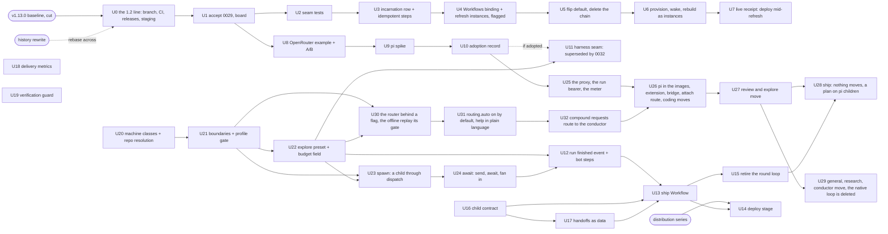
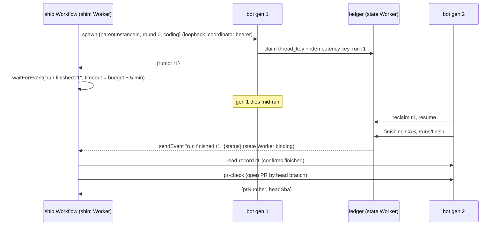

# Orchestration program - Plan

## Goal Capsule

- **Objective**: Execute record [0029](../decisions/0029-durable-objects-store-workflows-schedule.md) as one program on the **Switchboard: v1.2** board ([project 4](https://github.com/orgs/coreplanelabs/projects/4)) and the **1.2 line** (a long-lived `v1.2` branch whose releases are 1.200.0, 1.201.0 and so on, called "1.2" in public; `main` stays the 1.1x line for patches and the work already in flight there; 2.0.0 is saved for the release moment Justin picks): the resident lifecycle engine moves its cycles onto Cloudflare Workflows and loses its alarm chain and watchdog re-arm; `agent:ship` becomes a Workflow coordinator whose children are `dispatch()` runs; the agent harness track (OpenRouter as a documented example, a pi spike, an adoption record, pi per child) runs to its decision and, that decision made ([record 0032](../decisions/0032-pi-is-the-harness-the-native-loop-retires.md)), the native turn loop retires behind pi one preset at a time in a replacement series that never leaves two harnesses in steady state; the front door of record 0026 — an undirected mention routes itself to a preset, with the reason on the card — lands as three units ahead of the pi series' second step, by the owner's call of 2026-09-14 (KD5); and the follow-ups the ship-restart and durable-runs plans deferred are each absorbed into a unit here, deferred with the trigger that revives them, or named as out of scope. One plan, one board, one order.
- **Authority**: record 0029 holds every decision this plan executes; records [0002](../decisions/0002-dispatcher-is-the-only-orchestrator.md), [0007](../decisions/0007-authorization-policy-table.md), [0016](../decisions/0016-long-lived-process-not-serverless.md), [0019](../decisions/0019-durable-run-ledger-resume-after-kill.md) and [0026](../decisions/0026-capability-profiles-and-request-routing.md) bound it; [record 0032](../decisions/0032-pi-is-the-harness-the-native-loop-retires.md), the adoption record U10 produced, holds every harness decision Phase G executes; record 0026's Routing section and its slice two hold every routing decision Phase H executes. Where this plan and 0029 disagree, 0029 wins and the plan is wrong; on the harness, 0032 wins; on the router, 0026 wins.
- **Baseline**: release v1.13.0 (`902ecd50`, cut 2026-09-10; receipts on [#809](https://github.com/coreplanelabs/switchboard/issues/809)) is the frozen 1.x baseline every V2 unit re-baselines against; record 0026 is accepted against it ([#815](https://github.com/coreplanelabs/switchboard/pull/815)). The `v1.2` branch is cut from it.
- **Gates it waits on, not units it owns**: the public flip's history rewrite ([#750](https://github.com/coreplanelabs/switchboard/issues/750)), which the `v1.2` branch is cut after or rebased across; the distribution series ([#792](https://github.com/coreplanelabs/switchboard/issues/792), merged through PR C, with its live receipts still owed). Record 0026 slice one and spawn/await ([#108](https://github.com/coreplanelabs/switchboard/issues/108) Phase 1 and 2) were external gates until the owner absorbed them as U20 to U24, so the ship track's dependencies are inside the program.
- **Stop conditions**: any design that gives a Workflow Worker a credential it does not hold today (the bot's shim Worker holds no model key, Slack token or GitHub credential; the resident Worker keeps the GitHub App identity of record 0009 and gains nothing); any design that puts a Slack token or a GitHub credential beyond the executor's repo-scoped token into a sandbox or resident container; a pi extension loaded from a path the model or the repository can write; any resume or retry that re-issues a command whose effects are unknown; any child run that reaches an executor without passing the authorize stage as the requesting user; a Workflow step that awaits a container command longer than 30 minutes; a step method whose second call with the same inputs has effects.
- **Execution profile**: every PR targets `v1.2` and squash-merges there; `v1.2` takes `main` regularly and lands on `main` once as 2.0.0 at the release moment (KTD12); each phase is its own PR series through the pr-lifecycle review loop; every unit is an issue on the v1.2 board with the plan as its parent (KTD13); the two seam tests (U2) are the first receipts and gate every resident unit; specs change in the same PR as the code they describe (`resident-repos.md`, `execution.md`, `agent-ship.md`, `agent-coding.md`, `costs.md`, `tracing.md`, `run-history.md`, `release-and-deploy.md`, and for U20 to U24 `routing-and-config.md`, `authorization.md`, `thread-admission.md`, `agent-general.md`, `web-tools.md`, the new `agent-explore.md` and `agent-conductor.md`; for U25 to U29 `http-ingress.md`, `agent-coding.md`, `execution.md`, `costs.md`, `authorization.md`, `run-visibility.md` and `tracing.md` change in the step that changes their code, and `run-loop.md` retires with its code at U29; for U30 to U32 `routing-and-config.md`, `run-history.md`, `slack-channel.md`, `thread-admission.md`, `agent-conductor.md` and `load-harness.md`).
- **Tail ownership**: the `v1.2` branch's sync cadence and the 2.0.0 release moment are Justin's calls; staging and production experiments that deploy the resident Worker mid-cycle are Justin's call on timing; the pi adoption record (U10) and its acceptance are Justin's decision, and Phase G's first pull request waits on that flip; the front door's default flip (U31) waits on a week of production routes at or above R49's bar, the table posted on its board item for Justin to read; everything else ships autonomously.

---

## Product Contract

### Summary

Record 0029 decided the shape; this plan is its execution ledger. Two Durable Object patterns run today: the run ledger, a transactional store that stays, and the resident lifecycle, a hand-built scheduler behind eight incidents of one shape, which moves to Workflows after the flip. The agent loop stays in a container, so ship's parent becomes a Workflow instance whose children are ordinary `dispatch()` runs, and pi — the spike passed and record 0032 decided — is the one harness for every preset, runs per child and never as the coordinator, and replaces the native loop one preset at a time. The owner's reprioritization of 2026-09-14 puts record 0026's slice two — the front door, an undirected mention that routes itself to a preset — ahead of the pi series' second step: people need it for the product to be useful to them, so U26 to U29 wait behind U30 to U32. The plan absorbs the unmerged harness exploration plan ([#764](https://github.com/coreplanelabs/switchboard/pull/764)) with its Phase 4 rewritten, retires the tracking issues [#765](https://github.com/coreplanelabs/switchboard/issues/765) and [#813](https://github.com/coreplanelabs/switchboard/issues/813) in favour of the v1.2 board, and lists every follow-up it inherits with its disposition. The work is the 1.2 line: it lives on a `v1.2` branch that releases 1.200.0, 1.201.0 and onward ("1.2" in public) so 1.1x keeps shipping patches from `main`, and it lands on `main` once, at the release moment, as 2.0.0 with its migration notes. Capacity work stays in the [fifty-concurrent-runs plan](2026-09-07-001-feat-fifty-concurrent-runs-plan.md); this plan links it where a receipt needs the load harness.

### Problem Frame

Four tracks touch orchestration and were being planned independently: a resident engine whose incidents are all failures of an alarm re-arming itself; a ship pipeline that dies with the bot process and cannot resume; a harness exploration that proposed pi sub-agents as ship's fan-out, which would bypass `dispatch()` and the policy table; and record 0026, which makes every run a profile and names ship's budget as a preset field. Record 0029 fixed the decisions and the order. What remains is an execution plan where each unit names its files, its tests, its receipt and what it waits on, so that the four tracks stop re-deriving each other's constraints.

### Requirements

**Resident lifecycle**

- R1. Each resident cycle (provision, refresh, wake, rebuild) runs as one short Cloudflare Workflow instance whose steps call `ResidentDO` methods; `ResidentDO` stays the coordinator holding the container, thread bindings, snapshot stamp and mutex.
- R2. Every step method is idempotent: a second call with the same inputs reads the row, finds the work done, and has no effect; the unit suite proves it by calling each twice and asserting one command log.
- R3. The refresh cycle is created by the existing `*/10` cron with a deterministic, platform-legal instance id per resident and 10-minute bucket (`refresh_<slug>_<bucket>`, matching `^[a-zA-Z0-9_][a-zA-Z0-9-_]*$`, at most 100 characters); a duplicate id is refused; the cron creates an instance only when the row is not `refreshing`, or its `refreshing` is older than `STALE_MIDFLIGHT_MS`, so cycles stay serialized per resident as the alarm chain serialized them; a resident with no live binding inside `IDLE_AFTER_S` gets an instance only at the idle cadence the row records.
- R4. No lifecycle timer exists after the port: the refresh, sweep and disk-measure chains and the watchdog's re-arm branch are deleted in the port's release; `alarm-missed` leaves the reason vocabulary; `ctx.storage.setAlarm` is never called by lifecycle code.
- R5. The mirror mutex is a durable row carrying the holder's incarnation id and an expiry equal to the step budget; a holder whose incarnation differs from the DO's current one is dead and the mutex is taken without waiting; orphaned processes owning the tree are killed before a step installs.
- R6. A resident Worker deploy during a refresh instance costs the cycle one or more retries inside the step's retry window and never leaves the row `degraded` or `down`; the retry policy is `retries: { limit: 6, delay: "30 seconds", backoff: "exponential" }`, where `limit` counts total attempts, so the delays sum to about 15.5 minutes and exceed the 3 to 10 minutes a rollover takes to settle. If a rollover outlasts the window the instance fails and R8 applies.
- R7. Every step budget stays under 30 minutes and the DO method enforces the same budget on its own command (`REFRESH_INSTALL_TIMEOUT_MS`, `R2_TRANSFER_TIMEOUT_MS`), so a step timeout and a command timeout agree.
- R8. An attach during a cycle reads the same row states it reads today (`onboarding | warm | refreshing | restoring | degraded | down`). A failed instance leaves the row as the cycle's failure leaves it today: a failed refresh leaves `warm` on the previous snapshot; a failed wake leaves `degraded` with the restore reason; a failed provision or rebuild, after its retries, writes `down` with the step's reason. The next cron firing, attach or admin route starts the next cycle from that state.
- R9. The costs page attributes Workflows spend to the resident Worker's group; the tracing spec's resident roots (`resident.refresh`, `resident.check`) are re-rooted on the instance.

**Ship coordinator**

- R10. The ship parent is a Workflow instance defined in the bot's shim Worker; every step is a call into the bot container over the shim's loopback with a dedicated `coordinator` bearer; the coordinator holds no model, Slack or GitHub credential and does every GitHub call through the bot.
- R11. Every ship child is a `dispatch()` run started as the requesting user through the full pipeline, depth 1, fan-out capped; the authorize stage runs at every spawn, so a requester who lost the grant during a days-long wait ends the pipeline with a named refusal in the thread.
- R12. The state Worker sends `run finished:<runId>` from `RunHistoryDO.finish`, the one handler every terminal record commits through (the finish after the reply, the reclaim's `interrupted` close, the admission's close), after the commit and only for a record carrying a `parentInstanceId`; the event type carries the run id so each `waitForEvent` matches its own child and a duplicate is buffered harmlessly; the parent confirms every event through `read-record` before advancing; a `waitForEvent` timeout at the child's budget plus a 5-minute margin falls back to `read-record`, never to a second spawn.
- R13. Every coordinator step is safe to retry, the spawn included: the spawn carries an idempotency key `<parentInstanceId>:<step>` that the child's claim stores on its row; the spawn route answers `alreadySpawned` only for a live or finished run carrying that key, and a `thread_key` 409 against a run without it answers `busy`, which the coordinator retries after that run ends. Every bot-calling step uses `retries: { limit: 12, delay: "2 minutes", backoff: "constant" }`, about 24 minutes, past a full drain-and-restart rollover of the bot.
- R14. The parent's card and run record are written by the bot on the parent's behalf from the events it receives; a child that closed `interrupted` reaches the parent as that status and the parent tells the thread and stops.
- R15. The merge and deploy stages wait on events a `poll-pr` step supplies by asking the bot every ten minutes; the deploy stage runs only when the target repository carries the distribution series' reusable deploy workflow (`deploy images` then `deploy all`), and for every other target the pipeline ends at `merged` and says so in the thread.
- R16. The in-process round loop (`runShipPipeline`) retires when the coordinator is live; ship's budget is the ship preset's declared budget from 0026, expressed as the instance's `waitForEvent` timeouts.

**Harness track**

- R17. An operator with only an OpenRouter key can run `ask` by editing config alone; the A/B numbers (native adapter vs OpenRouter, same model, five tasks) are on the tracker.
- R18. The pi spike runs five coding tasks inside a resident thread over `--mode rpc` against today's coding agent on the same tasks, and reports cost, wall time, tool calls, PR-shaped outcome, the pi events with no home in `RunEvent`, and the tool calls the policy table would have refused.
- R19. An adoption record under `docs/decisions/` decides one of: adopt pi per child behind `harness: native | pi` on a preset; adopt `pi-ai` as the provider layer only; adopt nothing. It is the gate for any harness code and Justin's decision.
- R20. If adopted: the model credential reaches pi through a per-run proxy in the bot (Anthropic-shaped `/v1/messages` and OpenAI-shaped `/v1/chat/completions`, as record 0032 decided) with a run-scoped bearer that expires at the run's budget plus a margin, is revoked when the run's ending is registered, pins the preset's model, enforces the run's token budget and is never logged; the sandbox and resident planes hold no provider, Slack or GitHub credential beyond the executor's repo-scoped token, so the extension's GitHub, Slack and `submit_*` tools are relays to the bot over the same run-scoped channel; pi's events are bridged into run events, spans and the transcript ledger so the run record is complete without pi's session file; the policy gate is a pi extension installed read-only in the image outside every worktree with project-local extension discovery disabled; pi is pinned in the sandbox-base and resident images.
- R21. pi never orchestrates: no pi sub-agent starts a run; ship's fan-out is the coordinator's (R11).

**Version line and board**

- R24. V2 is the 1.2 line: a long-lived `v1.2` branch cut from the v1.13.0 baseline; every V2 PR targets `v1.2`; release-please on `v1.2` cuts 1.200.0 first (a `Release-As: 1.200.0` footer on the branch's first release commit) and minor releases from there (1.201.0, 1.202.0, …), called "1.2" in public; `main` stays the 1.1x line, keeps releasing patches and the work in flight, and never reaches minor 200; `v1.2` takes `main` at a regular cadence; V2 lands on `main` once, at Justin's release moment, as 2.0.0 (`feat!:` plus `Release-As: 2.0.0`) with the `## 2.0.0` migration section naming every change an installation must act on.
- R25. `v1.2` has its own CI and release: pull requests to `v1.2` run the same checks as `main`; pushes to `v1.2` run release-please for that branch; the npm package is published from the default branch only, so no 1.2xx release publishes it until the line lands; a `v1.2-staging` installation profile deploys the 1.2xx releases so every live receipt in this plan runs against the 1.2 line, never production 1.1x.
- R26. The program is the **Switchboard: v1.2** board (project 4): one parent issue per plan and one sub-issue per unit, with Status `Todo | In Progress | Done`; the board also carries the sibling V2 items this plan does not own (record 0028's image manifest; 0026 slice two was one until the owner's call of 2026-09-14 made it Phase H, U30 to U32) so the version line has one view.

**Program hygiene**

- R22. The v1.2 board carries the program (R26); [#765](https://github.com/coreplanelabs/switchboard/issues/765) and [#813](https://github.com/coreplanelabs/switchboard/issues/813) close pointing at the parent issue; record 0029 flips `proposed → accepted` before the first code unit.
- R23. Every inherited follow-up has a disposition in this plan: absorbed into a named unit, deferred with the trigger that revives it, or out of scope with the reason.

**Self-driving edges** (record 0031)

- R27. A coding child started for a plan unit is handed a typed contract (the unit's section, the spec rows it names with their proof bindings, the repository's agent rules, the guard names) rendered under fixed headings; the review child is handed the same object and a listed test scenario the diff did not add is a finding at minor or above; a task string is a plan of one unit with no rows.
- R28. A child returns a typed handoff `{ deviations, followUps, unproven }` beside its pull-request description; it is recorded on the run and posted to the unit's board issue by the parent; a person decides each disposition and amends the plan's follow-ups ledger while the plan is `proposed` (no bot path writes to `main`, and a plan's body freezes once accepted).
- R31. The merge of a unit's pull request is the policy action `plan:merge` (record 0007's table), held by the plan runner: for a pull request on a plan branch (`plan/<plan-id>/<unit-slug>`) the runner merges once the review's verdict approves and the guards are green (squash, the title as the commit, an empty body) through the bot's GitHub identity, one more of the bot's named GitHub writes; a pull request not on a plan branch waits for a person's merge as R15 and record 0029 have it; the release pull request is always a person's merge; ship on a task string keeps refusing repositories with auto-merge on.
- R29. The delivery indicators (issue-to-merge time, first-pass CI success, review rounds per pull request, share of findings resolved with no human branch edit) are computed from the run ledger and the pull requests' own facts, per unit and per week, with no new writes.
- R30. The verification guard prints two classes over a pull request's range, both allowed by a change to a spec whose Code/Tests header covers the test file: **removed** (a test file deleted, a test block whose title is gone from its file with no new title added there, a skip marker added) fails the guard and is a review finding at minor or above; **check** (a decreased `expect` count, a removed title beside a new one in the same file) never fails the guard and must be disposed of in the review body as weakened (a finding at minor) or as a refactor with one clause of why. The guard is deterministic, runs behind `specs:coverage`, and is named in the review prompt both variants share.

**Capability profiles** (record 0026 slice one)

- R32. Every preset declares a machine class (`none | blank | repo-cold | repo-resident`) and an identity (`none | read | write`) beside its toolset and budget; the executor factory branches on the class and mints the credential from the identity, never from the toolset name; repo resolution runs for `repo-cold` and `repo-resident` and never for `none` or `blank`; a `repo-cold` run verifies the repository against GitHub with the run's credential and never asks the resident registry; a `blank` run makes no GitHub call before the model's first turn; the five presets that exist today keep their names, prompts and behaviour byte for byte (`coding`, `review` and `ship` are `repo-resident`; `general` and `research` are `none`).
- R33. A boundary `{ maxMinutes?, maxIdentity?, machines? }` is a scope setting on `defaults`, `channels.<id>` and `users.<id>`, set in `config.yaml` or by `config set … --boundary.<axis>` under the existing `config:write` gate for the channel scope; boundaries intersect across layers (the smallest `maxMinutes`, the lowest identity on `none < read < write`, the intersection of `machines`) where every other scope setting overrides; an absent boundary caps nothing; a `maxMinutes` under 2, an unknown class or an unknown identity fails the load by name; a boundary never grants and is never a fourth grants axis.
- R34. The effective profile is preset ∩ directives ∩ boundaries, computed once in the resolve stage; a profile gate in the authorize stage, beside the agent and repository gates, clips a budget above a cap (named on the card and as `boundedBy` on the record) and refuses an identity or machine class above a cap before any executor exists, naming the boundary and its scope; no executor is constructed and no token minted from anything but the effective profile; with no boundary set, every preset admits and refuses per actor kind exactly as today and runs its declared profile.
- R35. `explore` is a preset: shell, file reads, web fetch and search, GitHub reads; machine class `repo-cold`; identity `read` whatever the caller holds; 120 minutes; a prompt that asks for a claim table with commands and numbers, `setsid -f` for a job over 20 minutes and no pull request. `budget:<minutes>` is a per-message directive beside `agent`, `model` and `effort` that only narrows and is never sticky; the ship preset's declared budget is the `ship.maxMinutes` knob, one number the pipeline caps and the profile gate share; the sandbox Worker's timeout hint says `setsid -f`, not `nohup`; the run record carries `profile`.

**Spawn/await** (the run-coordination epic, Phase 1 and 2)

- R36. A child run is started by `spawnChild()` in the core and by nothing else: a `dispatch()` run as the requesting user (the parent's `userId`, grants and channel) through the full pipeline (resolve, the agent gate, admission, the repository gates, the profile gate, provision), in a thread of its own that the parent's channel adapter opens; the child's effective profile takes the parent's remaining wall clock as one more boundary; a spawn from a run at depth 1 is refused (`spawn_depth`), a spawn past `spawn.maxChildren` live children (default 3) is refused (`spawn_fanout`), an adapter that cannot open a thread refuses (`spawn_unsupported`), and every refusal, the authorize stage's included, reaches the parent as a named tool result, never as a child; the child's record and live summary carry `parentRunId`.
- R37. The `conductor` preset (machine `none`, identity `none`) holds `spawn_run`, `list_runs` and `get_run_status`; the reads answer through `RunsService` under the requester's `runs:read` predicate, so a parent sees only the runs its requester may; outside a spawning run the spawn capability is a null object and the tools answer with an honest refusal; the preset is open by the open rule like every preset (a child gives the requester nothing they could not start by hand) and the example config lists it under `restrict.agents`.
- R38. `send_to_run` pushes a follow-up into a live child's inbox through thread admission's steer (the gate a thread reply passes; the durable inbox when the child lives on another generation); `await_runs` waits for the named children's terminal records and returns each child's status, activity line and final reply, ending at the earliest of every child finished, the parent's remaining budget less the wrap-up reserve, a stop, or a follow-up landing in the parent's inbox, and says which; an `interrupted` child is reported as that status, never restarted; at a resume `await_runs` runs again and `send_to_run` gets the restart result, never a second push.

**The harness: pi replaces the native loop** (record 0032)

- R39. The native loop retires in a replacement series of five steps in the record's order (the proxy; coding; review and explore; ship, where nothing moves; general, research and conductor), each one pull request that lands one pi piece and deletes its native counterpart in the same change, gated by that preset's live receipt on the tracker before the next step starts, so at no release do two loops serve the same preset and no week is without a fallback; each step's pull request carries a source-scan test that its deleted symbols and `runAgent` callers are gone; no preset carries a `harness` field, because there is one harness; after the fifth step no native path exists and reversal is a fork of the last native release, a one-way door by the owner's choice.
- R40. On the resident and the sandbox, a run's pi is one detached process per thread key (`setsid -f pi --mode rpc --no-extensions -e <the image's extension>`, stdin a FIFO, stdout a log under the thread user's home), started, fed and killed through `POST /harness/{attach,send,stop}` on both Workers and identified by pid and start time from `/proc/<pid>/stat` on every operation; `attach` is idempotent per thread key and streams the log from the offset the caller names; the bridge writes four facts (pid, start time, the log offset consumed, the last mirrored session entry id) on the run's ledger row under its generation's fence, and `send` is accepted only from the generation that attached last; every operation stamps the thread's activity and every path that ends a run or releases a worktree (the run's release, a hard stop, `/detach`, the sweep) calls `stop` first, so no thread user returns to the pool with a live pi; a bot death costs a run one failed model call and one extra `prompt` and never a tool's effects; a container roll writes the mirrored entries back as a session file and pi restarts with `--session <path>`, losing only the in-flight turn, whose last `bash` settles as "restarted, re-check effects" by the ledger's existing rule. The process's environment carries the run bearer, the proxy URL and the exec path's defaults, never a model key, a Slack token or a GitHub App credential; the worktree's repo-scoped token is the only credential a `bash` command can reach, as today.
- R41. Every tool call a pi run makes is decided in the bot from the policy table, as the agent actor on behalf of the requester (effective grants the intersection), through the extension's `tool_call` hook posting `/harness/authorize` with the run bearer, the tool name and its input before execution; the table gains its first tool-level rows (the push target as `authorize(agent, "repo:use", repo)`, as the authorization spec's gap row words it; the shell and write tools as rows on the run resource); a refusal is a `run_note tool_refused` whose reason the model reads; a hook that cannot reach the bot within 90 s blocks the tool; the hook carries no copy of the rules and caches nothing, so a grant lost mid-run is refused on the next call.
- R42. Every documented pi event has a home on the run stream or a decided disposition, held by a unit test: two new `run_note` kinds, `compacted` (`tokensBefore`, `tokensAfter`, the summary entry's id, the retry count folded in from `summarization_retry_*`) and `harness_error` (an `extension_error`; a dialog request answered `cancelled`); `tool_execution_update` folded into the result recorded at the end, capped at `TOOL_OUTPUT_CAP`; `bash_execution_update` and `auto_retry_*` made impossible by the bridge; an event kind a pi bump adds is recorded as `harness_error` naming the kind. Compaction is allowed: the transcript mirrors every session entry verbatim, compaction entries included, so it is a superset of the model's context and the model's view at any turn is derivable from it. A pi run's record replays on the run page in the shape of a native run and is complete without pi's session file; every proxied model call is one `model.turn` span carrying the runner's token attrs, so the run page, the friction analyzer and the costs page keep one vocabulary, and pi's own `usage.cost` is never what a page shows.
- R43. `general`, `research` and `conductor` (machine `none`) run pi as a child process of the bot container with `--no-builtin-tools`, the extension supplying `web_fetch`, `web_search`, the GitHub reads and issue writes, the conductor's five run tools and any MCP-bridged tool as relays to bot routes over loopback with the run bearer, executed in the bot with the bot's credentials and the policy table; the conductor's spawn relay calls `dispatch()` exactly as its in-process tool does today, so the dispatcher stays the only place a run starts; no attach route, the proxy on loopback so the meter stays one, the bridge the same code; a bot death takes pi with it, today's behaviour, and the ledger's resume applies unchanged. In the same step `src/runner.ts`, `src/providers/` and `src/tools/workspace.ts` are deleted, `@earendil-works/pi-ai` is the library behind reflection's one model call (OpenRouter comes with it), `run-loop.md` retires with its code, and the bot image grows by pi's 434 MB under the `imagePins` check.
- R44. The tool definitions exist once (record 0008): the extension registers `submit_pr_description`, `submit_handoff`, `submit_dispositions`, `submit_verdict`, `update_status`, `diff_digest` and the relay tools with plain JSON Schema rendered from the definitions by a `gen` step, and a `check` step fails `verify` when the rendering drifts; at the fifth step the native rendering is deleted and the definitions have one reader. pi is pinned at `@earendil-works/pi-coding-agent` 0.85.1 in the sandbox, resident and bot images under the `imagePins` check; the driver's dry run against the scripted provider runs on every bump, and two consecutive breaking bumps freeze the pin.

**The front door: a request routes itself** (record 0026 slice two)

- R45. The router runs only when the preset would otherwise be `defaults.agent` — a directive, the thread's sticky preset, a user `agent` or a channel `agent` each skip it — as a stage between `resolveRun` and the agent gate, so the agent gate, the profile gate and every repository gate judge the routed preset exactly as they judge a typed directive; it is off unless `routing.auto` is true (a boolean, validated at load: any other value or an unknown `routing` key fails the load by name), runs on the model `routing.model` names, else `defaults.models.general` (the fast model the record names), and is handed the request text, the thread's last directives and the preset table rendered from the registry — never hand-copied, and holding only the presets the requester may run — and answers a typed `{ preset, reason }`; a name outside the table, a parse failure, a provider error or a call past its deadline falls back to `defaults.agent` with `routed: fallback (…)`. The router never emits a profile, never widens a boundary (a routed preset's budget is clipped and its identity and class refused by the same gate as a typed one's) and never bypasses a gate; a directive always wins.
- R46. Every routed run says so where it is watched: the card's label carries `<preset> · routed: <reason>`, the record's `profile` carries `chosenBy` (`directive | sticky | user | channel | defaults | router`) and, for a route, `routedReason`, and the run stream carries a `run_note` of kind `routed`; the sticky scan reads a routed preset from the bot's own card label — a turn the adapter marked as the bot's own, which no user can author — so a routed thread stays on its preset until someone types `agent:`, and a thread reply carrying `agent:<preset>` overrides a route the way it overrides any sticky preset.
- R47. A route to a write preset (identity `write` in the registry: `coding` and `ship` today) never dispatches on the router's word alone: the run is admitted and its card posted — `<preset> · routed: <reason> · reply go to start` — and no repository is resolved, no memory read, no executor provisioned and no token minted until the thread answers `go`; a reply carrying `agent:<preset>` re-resolves the pending run as that preset through the same gates; any other reply is folded into the request as a follow-up (the inbox's own rule) and the wait continues; a stop (`runs stop`, the run page's Stop) or `ROUTE_CONFIRM_MS` of silence ends it `refused (route_unconfirmed)` with the card closed by name and the thread's slot released. `general`, `research`, `review`, `explore` and `conductor` route without a pause.
- R48. The router may answer that a request has several independent parts — `{ preset: "conductor", parts: [{ preset, prompt }, …] }`, accepted only when `conductor` and every part's preset are in the offered table and the parts are within `spawn.maxChildren` — and the run becomes a `conductor` run whose request names one child per part with the preset the router chose for it; each child is a `dispatch()` run through `spawnChild()` as the requester under every gate, its text beginning `agent:<preset>` so a child never routes; a compound with any write part pauses once, at the parent, under R47's rule; a deployment that restricts `conductor` never receives a compound answer, because the router is offered only the presets the requester may run.
- R49. The router is gated by an offline replay, `npm run load -- route`: it reads finished agent runs from the run history, takes the preset the run ran as for its truth, asks the router with the record's request text under the production prompt and scores preset accuracy per preset with a confusion table, the sample size per preset, the read-only-to-write count and the count of undirected mentions per day (record 0026's cost question). The bar: at least 90 percent on `review`, `coding` and `research`, and no `coding` or `ship` answer for a truth whose identity is `none` or `read`. The table is the receipt on the unit's board item; the same command over a week of production runs with `chosenBy: router` — a run on the same thread started within the correction window, chosen by a directive naming a different preset, counted as a misroute — gates the default flip (U31); a checked-in set of twenty compound requests gates the compound shape (U32).

### Scope Boundaries

**In scope**: the three tracks above and the program hygiene; record 0026 slice one and spawn/await Phase 1 and 2 as the ship track's prerequisites (U20 to U24); record 0032's replacement series (U25 to U29); record 0026 slice two, the front door (U30 to U32); spec rows for every changed behaviour; the live receipts each unit names.

**Not in scope, owned elsewhere**:
- The public flip and its history rewrite ([#750](https://github.com/coreplanelabs/switchboard/issues/750)); the baseline release's remaining receipts ([#809](https://github.com/coreplanelabs/switchboard/issues/809)).
- Record 0028 (the image manifest): a v1.2 board item with its own plan.
- The run-coordination epic's Phase 3 ([#108](https://github.com/coreplanelabs/switchboard/issues/108): the thread map on `/runs`) and scheduling; U23 puts `parentRunId` on the record and the live summary so the board can read it and adds nothing to the board.
- The distribution series ([#792](https://github.com/coreplanelabs/switchboard/issues/792)).
- Capacity: seeded sandboxes (fifty-runs D4), bot sizing (D8), `load -- rollover` ([#710](https://github.com/coreplanelabs/switchboard/issues/710)); referenced where a receipt uses the harness.
- The fallback record 0032 names if the detached design fails its proof (pi in the bot container with remote operations through the executor for coding, at the cost of the record's criterion (5)): a superseding record, never a unit of this plan (Appendix B).
- The sandbox tier's lifecycle (one container per thread with an idle sleep; nothing to schedule).

**Deferred to Follow-Up Work** (see the follow-ups ledger in the Appendix): idempotent exec results on the execution Workers (durable-runs D4); a faster container wake after a crash; the orphan sweep's two-hour window; automatic restart of an interrupted ship pipeline (moot once the coordinator survives the bot, revisit only if a coordinator instance itself is lost).

### Key Decisions (product)

- KD1. **V2 is the 1.2 line on its own branch; 2.0.0 is a release moment.** (Governs R24, R25.) Justin's direction: 1.1x must stay patchable and keep shipping while V2 is built; V2 releases as 1.200 and up so the two lines never collide in semver; the major version is saved for a big release moment later.
- KD2. **Residents first, ship last, harness in parallel with residents.** (Governs R1, R10, R17.) The resident port needs no other track; ship needs 0026 slice one and spawn/await; the harness spike needs the flip and nothing else, and its seam (U11) also needs 0026 slice one; record 0032's series (Phase G) runs after the adoption in the record's order, each step gated by the previous step's live receipt.
- KD3. **Justin decides the pi adoption.** (Governs R19.) The spike's table is the only input the record may cite.
- KD4. **The plan is a project.** (Governs R26, R22.) The board, not a tracking issue, is where the program's state lives; the plan file is its authority.
- KD5. **The front door before the pi series.** (Governs R45 to R49; reorders Phase G.) The owner's call, 2026-09-14: "people really need that feature for it to be useful to them so it might make sense over pi as a priority." Record 0026's slice two — the router — is the next work after the proxy (U25) lands; U26 to U29 wait behind U30 to U32. Chosen over finishing the pi series first because the series is invisible to a person who mentions the bot and the front door is what that person meets; the series loses nothing but calendar, since U25 touches no routing code and U30 touches no harness code.

---

## Planning Contract

### Key Technical Decisions

- KTD1. **Durable Objects are the store and never the scheduler; Workflows schedules the lifecycles; the loop stays in a container** (session-settled: user-approved — chosen over running the agent loop as a Workflow: a Workflow step is retried and must be idempotent, and the loop's step is a model turn plus a `git push`; state per step is capped at 1 MiB and the transcript is many MB). Record 0029.
- KTD2. **Cycles are short cron-created instances, not one sleeping instance per resident** (session-settled: user-approved — chosen over a perpetual instance: five steps per cycle every 600 s reaches the 10,000-step instance cap in about two weeks). Record 0029.
- KTD3. **The alarm chain is deleted in the port's release, behind a per-resident row flag during the port** (`lifecycle: alarm | workflow`, default `alarm` until U5 flips it). Chosen over a big-bang swap: a flag lets one resident run on Workflows while the others keep the chain, so the seam tests and the first live receipt cost one resident, not the fleet. Reversal is a revert of the flip release.
- KTD4. **Step decision logic lives in pure modules under `src/execution/`, not in `worker.ts`.** The resident Worker's vitest project runs plain-Node tests only (`preflight.test.mjs`, `gc.test.ts`, `instanceSizing.test.ts`; `deploy/cloudflare-resident/vitest.config.mjs`) and `worker.ts` itself is covered by typecheck and receipts; the idempotency proof (R2) and the retry arithmetic (R6) are provable in the `bot` project, and source-scan tests over `worker.ts` sit beside `gc.test.ts`. `worker.ts` keeps the thin DO methods that call the pure modules.
- KTD5. **The mutex row and the incarnation id replace every in-memory coordination memo the watchdog reads**, not only `mirrorLockTail`: `hydration`, `pendingRestores`, `refreshesInFlight`, `attachesInFlight`, `threadOpsInFlight`, `depsInFlight`. The watchdog's `stale-mid-flight` branch reads them today; after the port a stale in-flight is a failed instance the dashboard shows, and the row answers "who holds what" for every one of them. Chosen over porting only the mutex because a second in-memory holder would recreate the class of failure on a different field.
- KTD6. **The ship Workflow lives in the bot's shim Worker** (`deploy/cloudflare/worker.ts`) and calls the container over the shim's existing loopback with the `cron` ingress bearer, the way `scheduled()` already does (session-settled: user-approved — chosen over a `dispatch()` parent: a parent has no model turn and a `dispatch()` parent is ship today, which dies with the process; revisable if the card and record contract needs a `dispatch()` run in front of the instance). Record 0029.
- KTD7. **`run finished` is sent by the state Worker from `RunHistoryDO.finish`, not by the bot.** The finishing CAS is at-most-once per generation but a generation can die between the CAS and a send; the reclaim close (`src/core/boot.ts`, `ledger.finish`) and the admission closes (`src/core/dispatch/admission.ts`, `sink.put`) never pass through `RunHistoryWriter.write`; and the bot runs in a container with no Workflow binding. The one place every terminal record commits is the state Worker's `/runs/finish` handler, so that Worker binds the shim's `ShipCoordinator` by `script_name`, sends `run finished:<runId>` after the commit for a record carrying `parentInstanceId`, and swallows the not-running error of a parent that already ended. The bot needs no event route.
- KTD8. **pi runs a child, never the coordinator** (session-settled: user-directed — chosen over the harness exploration's Phase 4 "pi's sub-agent extension for ship": a pi sub-agent is a run the policy table never saw and the ledger never claimed, against 0002 and 0007). `harness` is a preset property introduced by the adoption record (U11), never written into 0026. Record 0032 supersedes the property: there is one harness and no `harness` field on a preset; the seam's substance is steps 2 and 3 of the series (U26, U27).
- KTD9. **The harness exploration's substance is absorbed here, not cited from the closed PR.** Its today table, the three candidate shapes and its Phases 0 to 3 are in the Appendix; its Phase 4 is rewritten as R21. Chosen over a pointer because nothing in a live plan may depend on a closed, unmerged PR.
- KTD10. **The cron registry changes before the template.** `src/core/schedules.ts` is the source of every Worker's `triggers.crons`, and a template test holds them in lockstep; the resident's `*/10` entry keeps its schedule and gains the instance-creation duty, so no cron changes and the test stays green.
- KTD11. **Costs and tracing follow the binding in the same release.** Workflows bills two line items the costs page does not meter, steps and storage; CPU and invocations already ride the hosting Worker's rows in `src/core/costs.ts` (`WorkerUsageRow`, `attributionOf`) and must not be re-metered. The two meters and the re-rooted spans ship in the same PR as the binding (U4), not later.

- KTD12. **`v1.2` squash-merges its PRs, releases as 1.200 and up, takes `main` by merge at a regular cadence, and lands on `main` once as 2.0.0 at the release moment.** (session-settled: user-directed — Justin asked for a 1.2 branch kept on top of the 1.1x line, versioned 1.2xx so minors are free for it and "1.2" is the public name, with 2.0.0 saved for a big release moment; chosen over developing V2 on `main` behind flags, which would put V2's churn in every 1.1x patch, and over 2.0.0 prereleases, which spend the major early.) Versioning: the first release commit on `v1.2` carries `Release-As: 1.200.0`; release-please's `node` strategy then bumps the minor per `feat` (1.201.0, …) and the patch per `fix`; `main` stays below minor 200 by construction (it is at 1.13 and gains a minor per release). Recommendation inside that direction, Justin's call: sync `v1.2` with `main` by merge, not rebase, once more than one PR has merged into `v1.2`, because a rebase rewrites shared history and invalidates every open PR against the branch; a rebase is fine only while `v1.2` is linear and one stream; the `.release-please-manifest.json` conflict at every sync resolves to `v1.2`'s version. Landing: a merge of `v1.2` into `main` whose merge commit is `feat!: Switchboard 2.0.0` with `Release-As: 2.0.0`, so release-please cuts 2.0.0 with the `## 2.0.0` migration section (CONTRIBUTING's breaking-change rule) regardless of the two manifests. Releases from `v1.2`: a second release-please job with `target-branch: v1.2` and the same config; the publish job runs only on the default branch, so a 1.2xx release never publishes the package; the reusable deploy workflow deploys the release to `v1.2-staging`. CI: `ci.yml` runs on every pull request already; `push.branches` gains `v1.2` for the release-please, codeql and scorecard jobs.
- KTD13. **The board is project 4, one parent issue per plan, one sub-issue per unit.** (session-settled: user-directed — Justin created the project and asked that the plan be one.) The parent issue's body is the plan's phase table; each unit issue names its U-ID, files and receipt; Status moves Todo → In Progress → Done as the unit's PR opens and merges; the project's `Sub-issues progress` field is the program's progress. 0026 slice one and 0028 join the board as sibling items owned by their own plans.
- KTD14. **The routing switch is a boolean beside a model choice, not a model name that doubles as the switch.** Record 0026's rollout line names `defaults.models.router`, "off when unset"; the plan realizes it as `routing.auto` (a boolean, validated at load the way `ship.coordinator` was until #1011 removed it: anything but `true` or `false` fails by name, an unknown `routing` key fails by name) and `routing.model` (optional; default `defaults.models.general`, the fast model the record names). Chosen because a model name that is also a switch reads a typo as "off" and cannot say "on, with the default model"; the record's substance — off by default in U30, one fast model, a fallback to `defaults.agent` — is unchanged, and the record's open question on which model routes is answered by U30's replay rather than by a key name. Flagged for the owner.
- KTD15. **The pause for a write preset is a thread reply, not a card control.** The Slack card carries text and a link and no interactive element (the tree has no `block_actions` handler), the live page's Stop and Kill are the one write control and they stop, never start, and a thread reply in a thread the bot participates in is heard without a mention (slack-channel item 1); so a routed `coding` run waits on the thread's inbox — the path a steer takes — for `go`, and the run page shows the wait as a `route_pending` note. Chosen over Block Kit buttons (an interactivity endpoint, a second transport for one word) and over routing write presets without a pause (a pull request nobody asked for is the one route that is not harmless when wrong).

### High-Level Technical Design

The program's dependency graph. Boxes are units or external gates; an edge means "waits on".

The ship coordinator on the hard case: the coding child is killed and resumed by the ledger while the parent waits.

### Assumptions

- A Workflow step can await a DO method that runs a 10-minute container command without a platform timeout below the step's own, and a mid-RPC isolate swap surfaces as the SDK's `runtime changed` error the resident already classifies. U2 tests both before any code unit; if either fails, the resident track stops at a plan record and the ship track is unaffected.
- Scheduling latency between steps is seconds, which matters only on the wake path where an attach waits inside its 5-minute transfer budget; U2 reads it from the dashboard.
- Cloudflare Workflows is available to the account's Workers with the pinned `wrangler ^4.129.0`; the binding is literal JSONC in the template (no profile value), so `deploy:gen` needs no new placeholder.
- The pi packages' Node version is compatible with the sandbox-base and resident images; U9 checks before installing.
- The `v1.2` branch can be cut before the public flip's history rewrite and rebased across it (a rewrite that changes only history, not tree contents, leaves the rebase mechanical); if the rewrite reshapes the tree, `v1.2` is cut after it and U0 waits.
- An in-flight ship instance keeps running under a shim redeploy; U13 measures it by deploying the shim during a `waitForEvent`, and the coordinator's admin routes are additive-only while any instance may be waiting.
- A Workflow's `name` in the template can be literal; if names are account-scoped and staging shares the account, the template derives it from `{{script}}` (checked in U2).

### Open questions

| Question | Owner | Resolves it | Before |
|---|---|---|---|
| Does a ship child run in the parent's Slack thread or in its own? The idempotency key (R13) works either way; the card contract (R14) and the steer path differ | U23 | decided there: a child runs in a thread of its own, opened by the parent's adapter, because thread admission admits one live run per thread and a resident binds one branch per thread | U12 |
| What is the completed-instance retention on the account's plan? It bounds how long a deterministic id is refused and how the wake id's per-attempt component is chosen | maintainer | the Workflows dashboard after U2 | U3 |
| Does the merge wait need more than the 24-hour `waitForEvent` default? The platform allows up to 365 days; the ship preset's budget decides | ship plan | U13 | U13 |
| Sync `v1.2` from `main` by merge (recommended once several PRs have landed) or by rebase (Justin's stated preference)? | Justin | KTD12's trade-off; decided at the first sync | U2 |
| Does the credential proxy also speak the Anthropic shape? Each accepted shape is another parser on a route reachable from untrusted containers | maintainer | decided by record 0032: both — `/v1/messages` (Anthropic-shaped, so effort, adaptive thinking and prompt caching pass through untouched) and `/v1/chat/completions` (OpenAI-shaped, for the compatible providers); U25 builds them | U25 |
| Record 0032's three open questions: how a repository's skills reach pi; whether pi's own `AGENTS.md` reading duplicates the contract the child is handed, and which wins; the map from the five effort tiers onto pi's seven thinking levels | maintainer | U26: the first live coding run on a repository with skills and its transcript answer the first two; one table in U26's pull request, checked against the proxy's pass-through of `output_config.effort`, answers the third | U26's gate |
| Record 0026's open question: which model routes, and is its prompt cached per deployment? | maintainer | U30's replay: `defaults.models.general` is the default and `routing.model` the override; the receipt prints the call's p50 and p95 and the per-day count of undirected mentions, so the cost is a number before the flag is on; the prompt's static half (the preset table and the rules) is cache-controlled and its hit rate is on the same table | U31 |

### Sequencing

Nine phases, in dependency order; the harness track runs in parallel with the resident track once the `v1.2` line exists, the ship prerequisites (F) run in parallel with both, the front door (H) runs after slice one and beside the proxy (U25), and the harness series (G) follows the adoption record one gated step at a time with its second step waiting on H (KD5).

| Phase | Units | Waits on | Receipt that closes it |
|---|---|---|---|
| 0. The 1.2 line | U0 | the v1.13.0 baseline (cut) | `v1.2` exists with CI green, release 1.200.0 cut from it and the `v1.2-staging` installation live on it |
| A. Program hygiene | U1 | U0 | 0029 `accepted`; the board carries the parent and every unit; #765 and #813 closed |
| B. Residents on Workflows | U2 to U7 | U1 | a resident deploy mid-refresh ends in a completed instance after one retry; `alarm-missed` absent from the reason vocabulary for a week of production |
| C. Harness | U8 to U10; U11 superseded by Phase G | U1 | the adoption record, [record 0032](../decisions/0032-pi-is-the-harness-the-native-loop-retires.md), with the spike's table; Justin's acceptance flips it and opens Phase G |
| D. Ship coordinator | U12 to U15 | U20 to U24; the distribution series for U14; U16 and U17 for U13 | a bot kill under a ship pipeline resumes the child and the parent proceeds; a bot deploy landing on a `spawn` step is retried through; two dependent plan units land through the runner; the round loop is deleted |
| E. Self-driving edges (record 0031) | U16 to U19 | nothing (U17 on U16); run ahead of D and of U6 and U14 | a coding child of this program ran from a rendered contract and its handoff reached its board issue without a person; the delivery table shows the trunk pass's week; a deliberate test-weakening pull request drew the guard's finding |
| F. Ship prerequisites (record 0026 slice one; spawn/await Phase 1 and 2) | U20 to U24 | nothing (the baseline is cut; units land on `main`); U21 on U20; U22 on U21; U23 on U21 and U22; U24 on U23 | `agent:explore` against a large onboarded monorepo lands in a cold sandbox with a read token and reports a claim table (the comparison run); a channel bounded to `read` refuses `agent:coding` by name; a parent spawns children as the requesting user into threads of their own, steers one and collects every write-up; a child for a requester without the grant reaches no executor |
| G. The harness: pi replaces the native loop (record 0032) | U25 to U29 | record 0032 `accepted` (U10's flip, Justin's); U26 on U25 and on Phase H (U32 receipted — the front door first, the owner's call of 2026-09-14, KD5); U27 on U26; U28 on U27 and U15; U29 on U27 | the record's five gates in order, each on the tracker before the next step starts: the spike's driver through the proxy with equal tokens and the overhead measured; the detached re-attach proof, then five coding tasks on the switchboard resident with a bot kill and a resident roll mid-run, records complete, pull requests opened; a review on a real pull request and a 30-minute explore run on a cold sandbox; a plan run end to end on pi children; `ask` on general and research in production and a conductor run with two children — after which `src/runner.ts`, `src/providers/` and `src/tools/workspace.ts` are gone |
| H. The front door: a request routes itself (record 0026 slice two) | U30 to U32 | U21 and U22 (done); U31 on U30 receipted and a week of production routes at the bar; U32 on U31; runs beside U25 and ahead of U26 (KD5) | an undirected mention routes to a preset with its reason on the card and the record and a directive still wins; the offline replay at or above R49's bar, its table on the board item; no write preset dispatched from a route without `go`; `routing.auto` on by default with the week's production table posted; a two-part message runs as a conductor with one child per part |

---

## Implementation Units

### U0. The 1.2 line: branch, CI, releases, staging installation

- **Status**: superseded by trunk. The owner moved the program onto `main`: units land as ordinary pull requests, dark by default behind the per-resident lifecycle flag, and the next `main` release is pinned to 1.200.0 through the repository's release config; no long-lived `v1.2` branch, no separate release leg, no `v1.2-staging` installation. The branch, its release pull request and its ruleset were retired once the units built on it had landed on `main`. The sync policy in KTD12 and the `Release-As: 2.0.0` landing still describe the 2.0.0 moment; the rest of this unit is not built.
- **Goal**: V2 work has a branch, green checks, real 1.2xx releases and an installation to receipt against, without touching the 1.1x line.
- **Requirements**: R24, R25
- **Dependencies**: the v1.13.0 baseline (cut). If the public flip's history rewrite has not landed, cut anyway and rebase across it (Assumptions).
- **Files**: the `v1.2` branch (cut from `main` at or after `902ecd50`); `.github/workflows/ci.yml`, `codeql.yml`, `scorecard.yml` (`push.branches: [main, v1.2]`); `.github/workflows/release-please.yml` (a second job or matrix leg with `target-branch: v1.2` and the same config; the publish job's npm dist-tag `next` for a 1.2xx version; the deploy call targeting `v1.2-staging`'s profile variable); `docs/reference/migrations.md` (the `## 2.0.0` section, opened now and filled as V2 accumulates changes an installation must act on, per CONTRIBUTING); `src/ciWorkflow.test.ts` (the branch-list assertion); `scripts/check-pr-title.mjs` or a sibling check (refuses `!` on a PR to `v1.2`; the major is the landing's); the `v1.2-staging` installation profile and config in the infrastructure repository (a second account or zone, `images: registry`, its own bearers); `docs/how-to/ship-a-release.md` (one paragraph: the 1.2 line, its versions and how it lands as 2.0.0).
- **Approach**:
  1. Cut `v1.2`; protect it like `main` (required checks `bot`, `web`, `docs`, `workers`, `image`, `package`, `title`); PRs squash-merge into it.
  2. Add `v1.2` to the push triggers; add the `v1.2` release-please leg; the first release commit on `v1.2` carries `Release-As: 1.200.0`, so the first release is 1.200.0 and later ones bump the minor.
  3. Create the `v1.2-staging` installation from the profile shape in `deploy/profile.example.json` and deploy 1.200.0 through the reusable workflow; its `/healthz` build commit is the receipt.
  4. Sync policy (KTD12): a `chore(main): sync main into v1.2` PR at the cadence Justin sets, the manifest resolving to `v1.2`'s version; the landing PR is `feat!: Switchboard 2.0.0` with `Release-As: 2.0.0` and the migration section complete.
- **Patterns to follow**: the release-please workflow as it stands (App token, the deploy-targets job), CONTRIBUTING's breaking-change rule, the distribution series' reusable deploy workflow call.
- **Test scenarios**:
  - `src/ciWorkflow.test.ts`: every workflow that triggers on push to `main` also triggers on `v1.2`; the release-please `v1.2` leg targets `v1.2` with the same config; the publish job tags a 1.2xx version `next`.
  - The title check refuses a `!` title on a PR whose base is `v1.2`, and accepts the landing title with `!` on `main` only when `docs/reference/migrations.md` has the `## 2.0.0` section.
  - Human-gated: a PR to `v1.2` runs the full CI matrix; release 1.200.0 appears from `v1.2`; `v1.2-staging`'s `/healthz` reports its commit; a 1.1x patch releases from `main` afterwards with its own minor untouched.
- **Verification**: the three human-gated checks receipted on the parent issue; a 1.x patch released from `main` after `v1.2` exists without touching it.

### U1. Accept record 0029 and put the program on the board

- **Goal**: The program has one decision record in force and one board.
- **Requirements**: R22, R26
- **Dependencies**: U0.
- **Files**: `docs/decisions/0029-durable-objects-store-workflows-schedule.md` (two illustrative figures, then the status line); the v1.2 board (project 4): a parent issue for this plan and one sub-issue per unit.
- **Approach**:
  1. Before the flip, while 0029 is still `proposed` and editable: correct its two illustrative figures that this plan makes normative (the retry policy is six attempts, not five; instance ids are `refresh_<slug>_<bucket>`, not `repo:…:refresh:…`). Then flip `status: proposed → accepted` through the mutable-key path; `decisions:check` freezes the body from then on.
  2. Open the parent issue with this plan's phase table as its body and one sub-issue per unit (U-ID, files, receipt), all on project 4 with Status `Todo`; close [#765](https://github.com/coreplanelabs/switchboard/issues/765) and [#813](https://github.com/coreplanelabs/switchboard/issues/813) with a comment pointing at the parent; add 0026 slice one and 0028 as sibling items if their owners have not.
- **Patterns to follow**: the status flip in the 0026 acceptance ([#809](https://github.com/coreplanelabs/switchboard/issues/809) does the same for 0026 in the release window).
- **Test scenarios**: Test expectation: none -- a status line and tracker housekeeping; `npm run decisions:check` and `npm run docs:check` are the proof.
- **Verification**: `decisions:check` green with 0029 accepted; the two old issues closed with the pointer; the board shows the parent with every unit as a sub-issue.

### U2. The two seam tests on a staging resident

- **Goal**: Prove, before any port code, that a Workflow step can drive a DO-side container command and survive an isolate swap with one retry.
- **Requirements**: R6, R7 (the assumptions they rest on)
- **Dependencies**: U1; the `v1.2-staging` installation (U0).
- **Files**: a staging-only admin `/debug` op `install` in `deploy/cloudflare-resident/worker.ts` that runs today's install command under `REFRESH_INSTALL_TIMEOUT_MS` inside `withMirrorLock` and returns the exit and duration (the seam test's only committed code, renamed into U3's `installDeps` method afterwards); a throwaway Workflow in a scratch Worker outside the tree that calls it through a `services` binding to the staging resident Worker; the receipt on the tracker.
- **Approach**:
  1. Onboard one resident on `v1.2-staging`. Define a one-step Workflow whose step calls the resident Worker binding to run today's install command on it (10-minute budget). Time it. Assert no platform timeout below the step's own.
  2. Run the same instance and deploy the resident Worker mid-step. Record exactly what the step sees (the SDK's `runtime changed` error, a hang, or a silent success), the retry timing, and the time to completion.
  3. Read the step-to-step scheduling latency and the completed-instance retention from the Workflows dashboard; check whether the `workflows` binding needs a token scope the deploy token lacks and whether the Workflow `name` must be account-unique.
  4. Post the numbers on the tracker. A failure of test 1 or 2 stops the resident track at a plan record that names the alternative.
- **Test scenarios**:
  - Happy path: a 10-minute step completes inside a single attempt with the command's exit recorded.
  - Failure path: a resident Worker deploy during the step yields a classified error and the retry completes the cycle within the six-attempt retry window (R6).
  - Edge: the step's timeout is set to 30 minutes and the platform accepts it.
- **Verification**: the three numbers are on the tracker and each assumption in the Planning Contract is marked confirmed or refuted.

### U3. The incarnation row, the durable mutex and idempotent step methods

- **Goal**: Every step the engine runs can be called twice without effect, and every "who holds what" fact the watchdog reads today lives in the row, not in a memo.
- **Requirements**: R2, R5
- **Dependencies**: U2 passed.
- **Files**: new `src/execution/residentIncarnation.ts` (+ `.test.ts`): the incarnation id, the mutex row shape, `takeMutex(row, now, incarnation, budgetMs)`, `releaseMutex`, the "holder is dead" predicate; new `src/execution/residentSteps.plan.ts` (+ `.test.ts`) or an extension of `src/execution/residentRefresh.ts`: the read-then-act plan for each step (`fetchMirror`, `installDeps`, `build`, `snapshot`, `restore`, `materializeDeps`) that decides from the row and the disk whether the work is done; `deploy/cloudflare-resident/worker.ts`: `withMirrorLock` (around line 1418) reads and writes the row instead of `mirrorLockTail`; each engine step becomes a public DO method (`installDeps(key)`, `snapshot(stamp)`, `restoreCheckout(handle)`, `fetchMirror(ref)`, `runBuild()`) that calls the plan first; the orphan kill from the orphaned-step fix runs before any install; `docs/reference/specs/resident-repos.md` item 22 (mirror mutex) and the Code/Tests headers.
- **Approach**:
  1. Mint the incarnation id once per isolate start (a random id in the DO constructor, memoised; `clearIncarnationMemos` already marks the boundary).
  2. The mutex row: `{holder, incarnation, expiresAt, step}` in `ctx.storage`; take it when free, or when `incarnation !== current`, or when `expiresAt < now`; write it before the command and clear it after.
  3. Each step method: read the row and the disk facts, decide done/not done through the pure plan, take the mutex, run the command through `runOk` with the step's existing budget, write the result with compare-and-swap on the stamp (`resident:snapshot`) it read at the start, release.
  4. The in-memory memos in KTD5 become derived from the row; `watchdogCheckLifecycle`'s `stale-mid-flight` reads the row.
- **Execution note**: test-first on the pure modules; the DO methods are thin and covered by typecheck plus the U7 receipt.
- **Patterns to follow**: `src/execution/residentRefresh.ts` (`planRefresh`, `classifyRefreshFailure`), `src/execution/residentDiskBudget.ts` (pure decisions, thin DO calls), `ConfigDO.put` with `expectedVersion` for the compare-and-swap shape; the resident's storage is `ctx.storage` key-value, so the row is a keyed document with a version field, not SQL.
- **Test scenarios**:
  - Each step plan called twice with the same row and disk facts returns `done` the second time and issues no command.
  - `takeMutex` with a live holder of the current incarnation waits; with a holder of another incarnation takes immediately; with an expired holder takes immediately.
  - A snapshot write whose stamp moved since the read returns `superseded` and does not throw.
  - The orphan kill runs before install when a process owns the tree (characterization against the orphaned-step fix's fixture).
  - Edge: an empty row (fresh resident) takes the mutex and records the current incarnation.
- **Verification**: `npm test` green in the `bot` project; `npm run verify -w deploy/cloudflare-resident` green; `resident-repos.md` item 22 rewritten and its proof rows bound to the new tests.

### U4. The Workflows binding and the refresh cycle as an instance, behind a flag

- **Goal**: One resident runs its refresh cycle as a cron-created Workflow instance while the fleet keeps the alarm chain.
- **Requirements**: R1, R3, R6, R7, R8, R9
- **Dependencies**: U3.
- **Files**: `deploy/cloudflare-resident/wrangler.template.jsonc` (a `workflows` binding, literal JSONC); `deploy/cloudflare-resident/worker.ts`: a `ResidentRefresh` Workflow entrypoint whose steps call the DO methods from U3; the cron handler's watchdog fan-out (`runWatchdog`, around line 6595) gains the instance-creation duty for residents whose row says `lifecycle: workflow` and is not mid-cycle, with the id `refresh_<slug>_<bucket>`; `src/execution/residentRefresh.ts`: `nextRefreshDelayS` stays the idle-cadence source the cron reads; new `src/execution/residentInstanceId.ts` (+ `.test.ts`): the id scheme (owner and name lower-cased, every character outside `[A-Za-z0-9_-]` mapped to `-`, truncated with a short hash when the whole id would exceed 100 characters), the not-mid-cycle rule and the idle-cadence decision; `src/core/schedules.ts` (no cron change; the registry entry's description gains the duty); `src/core/costs.ts`: two Workflows meters (steps, storage) in `CLOUDFLARE_PRICES` and `attributionOf`; `docs/reference/specs/resident-repos.md` items 7, 9, 45, 47, 48, 57; `docs/reference/specs/costs.md` items 1 and 2; `docs/reference/specs/tracing.md` (the `resident.refresh` root becomes the instance's root).
- **Approach**:
  1. Bind the Workflow in the template; render with `deploy:gen`; the capability pre-check in `src/deploy/plan.ts` gains no new probe unless the Workflows API needs a token scope the deploy token lacks (checked in U2).
  2. The `ResidentRefresh` entrypoint: steps `fetch`, `install` (skipped by the plan when the lockfile key is unchanged), `build`, `snapshot`, each `step.do` with the retry policy from R6 (`limit: 6`, 30 s, exponential) and a timeout equal to the DO budget; inputs are the event payload and previous steps' returns (keys, shas, byte counts), never payloads.
  3. The cron: for each registry resident with `lifecycle: workflow` whose row is not `refreshing` (or whose `refreshing` is older than `STALE_MIDFLIGHT_MS`), create the instance with the deterministic id; a duplicate-id error is the expected no-op; a live cycle is a no-op recorded on `/status`; the idle cadence gates creation.
  4. `/status` (operator) shows the current instance id and its last step; the admin `/debug` `info` op lists recent instances.
  5. Costs: meter the two Workflows line items, steps and storage, at the published prices from the Workflows usage dataset, attributed to the resident group by script name; CPU and invocations already ride the Worker rows and are not re-metered.
- **Patterns to follow**: `deploy/cloudflare/worker.ts` `scheduled()` (a Worker cron doing work on a schedule), the `state.alarm` trace root in `deploy/cloudflare-memory/worker.ts` for the instance root.
- **Test scenarios**:
  - The instance id for a resident and a timestamp is deterministic, changes only at the 10-minute boundary, matches `^[a-zA-Z0-9_][a-zA-Z0-9-_]*$` and is at most 100 characters for the longest owner/name in the registry.
  - The cron skips a resident whose row is `refreshing` and younger than `STALE_MIDFLIGHT_MS`, and creates for one whose `refreshing` is older.
  - The retry policy's cumulative delay exceeds 10 minutes (a `residentSteps` test over the constants).
  - The idle-cadence decision: a resident with no live binding inside `IDLE_AFTER_S` gets an instance only when the row's idle interval has elapsed.
  - The cron creates one instance per eligible resident and treats a duplicate-id error as success.
  - Costs: a Workflows steps row and a storage row are attributed to the resident group and appear in the breakdown; the Worker request and CPU figures are unchanged by them.
  - `src/core/schedules.ts` lockstep test still passes (no cron change).
- **Verification**: `npm run verify -w deploy/cloudflare-resident` and root `npm test` green; one staging resident flagged `workflow` completes ten refresh cycles as instances with no alarm armed for it (`ls` of `listSchedules` empty for that resident); the costs page shows the meter.

### U5. Flip the default and delete the alarm chain

- **Goal**: Every resident runs on Workflows and no lifecycle timer exists.
- **Requirements**: R4, R8
- **Dependencies**: U4 live on one resident for a week without a park.
- **Files**: `deploy/cloudflare-resident/worker.ts`: delete `onRefreshAlarm`, `armRefresh`, `rearmOutcome`, the sweep and disk-measure chains' `schedule()` call sites (the worktree sweep and disk gauge become steps of the refresh instance), the watchdog's re-arm branch in `watchdogCheckLifecycle` and the `alarm-missed` and `refresh-interrupted` reasons in `NON_EVIDENCE_REASON`; `src/execution/residentRefresh.ts`: `INTERRUPTED_REARM_S`, `INTERRUPTED_REARM_MAX_CONSECUTIVE` retire; `src/execution/residentState.ts` if a reason enum lives there; `docs/reference/specs/resident-repos.md` items 3, 5, 7, 9, 12, 36, 43, 44, 45, 57, 61 and the intro paragraph; `docs/reference/specs/execution.md` items 6, 9, 13.
- **Approach**:
  1. Default `lifecycle` to `workflow`; a row without the field reads as `workflow`.
  2. Delete the chain and the re-arm; keep the watchdog cron for what needs no timer: stuck-onboarding timeout, auto-rebuild strikes, the disk gauge read, and instance creation (U4).
  3. Assert in a plain-Node test beside `deploy/cloudflare-resident/gc.test.ts`, over the worker source, that `schedule(` appears only in the provisioning deadline path (or nowhere, if U6 lands first) and `setAlarm` nowhere.
- **Patterns to follow**: the FrictionDO retirement in `deploy/cloudflare-memory/wrangler.template.jsonc` (`deleted_classes`) for how the repo retires a mechanism in one release with its spec rows.
- **Test scenarios**:
  - A source-scan test: no `setAlarm`, no `onRefreshAlarm`, no `alarm-missed` string in the resident Worker or its pure modules.
  - A row without `lifecycle` resolves to `workflow`.
  - The watchdog pass on a `refreshing` row older than `STALE_MIDFLIGHT_MS` reports a failed instance by id instead of re-arming.
- **Verification**: `resident-repos.md` has no alarm-driven wording; production residents show no `listSchedules` entries after one refresh interval; `alarm-missed` absent from `/status` reasons for a week.

### U6. Provision, wake and rebuild as instances

- **Status**: deferred behind U16 to U19 (record 0031). Third-order reliability: it starts only if the wake or provision path produces an incident after U5 deletes the chain; until then the alarm's provisioning deadline stands.
- **Goal**: The remaining cycles run as instances started by the admin routes and the attach path, and the provisioning deadline is a step timeout, not an alarm.
- **Requirements**: R1, R2, R7, R8
- **Dependencies**: U5.
- **Files**: `deploy/cloudflare-resident/worker.ts`: `ResidentProvision`, `ResidentWake`, `ResidentRebuild` entrypoints; `handleOnboard`/`initResident` (around line 1822) creates the provision instance instead of arming `PROVISIONING_CALLBACK` and `PROVISION_RUN_CALLBACK`; `ensureHydrated`/`doHydrate` (around line 1994) creates or joins the wake instance by the id the row records (`wake_<slug>_<incarnation id>`, one per wake attempt); `handleRebuild` (around line 6139) creates the rebuild instance; `src/execution/residentRefresh.ts` restore polling constants become the wake instance's step budgets; `docs/reference/specs/resident-repos.md` items 3, 4, 5, 6, 34, 61.
- **Approach**:
  1. Provision: steps `clone`, `resolveRef`, `checkout`, `install`, `build`, `snapshot`, `facts`; the provisioning timeout is the instance's overall deadline via a final `step.sleep`-free guard (each step's timeout sums under the configured provisioning timeout); the fail-closed `down` write happens in the instance's catch.
  2. Wake: an attach that finds the disk cold reads the row's `wakeInstanceId`; a recorded id whose instance is running is joined, otherwise the attach creates a new instance keyed on this incarnation and writes the id; the attach then awaits the DO's `hydration` promise exactly as `ensureHydrated` does today, bounded by `RESTORE_MAX_MS`, and observes the restore's completion through the row, not the instance API; the restore judged by bytes (spec item 61) stays the DO method's job.
  3. Rebuild: `discard snapshots` then the provision steps.
- **Patterns to follow**: U4's entrypoint shape; `src/execution/residentRestoreExtract.ts` and `residentBackupTransfer.ts` for the restore steps.
- **Test scenarios**:
  - Provision on a fresh resident runs every step once and writes `warm` with a stamp; a second identical instance (duplicate id refused) does nothing.
  - Wake with a current snapshot: the `restore` plan returns `done` and the attach proceeds without a transfer.
  - Two cold wakes of the same snapshot on one day create two instances; a concurrent attach during a wake joins the running one rather than creating a second.
  - Rebuild after `down`: snapshots discarded, provision steps run, `warm` written.
  - Failure path: a provision step exhausts its six attempts and the row reads `down` with the step's reason.
- **Verification**: onboard, wake and rebuild each receipted live on one resident with the instance ids on the tracker; `resident-repos.md` items rebound.

### U7. Live receipt: a resident deploy mid-refresh

- **Goal**: The property 0029's trace promises is observed in production.
- **Requirements**: R6, R8
- **Dependencies**: U5, U6.
- **Files**: none in the tree; the receipt on the tracker and the `[agent]` rows in `docs/reference/specs/resident-repos.md`.
- **Approach**: deploy the resident Worker while a refresh instance is on its `install` step; record the step's error, the retry, the completed instance, and the attach that arrived during the gap reading `warm`. Repeat once for a wake instance.
- **Test scenarios**: Test expectation: none -- a human-gated live receipt; the pass criteria are R6 and R8 read from the dashboard and `/status`.
- **Verification**: the receipt posted; the spec's `[agent]` rows for items 7, 9, 43 point at it.

### U8. OpenRouter as a documented example, with an A/B

- **Goal**: An installation is provider-agnostic by configuration alone and the cost of the compatible adapter is measured.
- **Requirements**: R17
- **Dependencies**: U1.
- **Files**: `config/config.example.yaml` (a commented `providers:` entry for OpenRouter: `type: openai-compatible`, the `baseUrl`, `apiKeyEnv`, the `provider/model` id form); `docs/how-to/configure-your-defaults.md` (one paragraph: what the compatible adapter does not do: effort tiers, document inputs, provider caching); `src/load/` A/B command as it exists.
- **Approach**: config and docs only; one A/B run of the existing harness on five tasks, native Anthropic vs the same model through OpenRouter; cost, wall time, outcome on the tracker.
- **Test scenarios**:
  - The example config parses with the OpenRouter block uncommented (`src/config.test.ts` fixture).
  - `ProviderRegistry` constructs an `openai-compatible` provider from that block and strips the trailing slash from the `baseUrl`.
- **Verification**: `ask` runs with only an OpenRouter key set; the A/B table is on the tracker.

### U9. The pi spike inside a resident

- **Goal**: A measured table, not an opinion, on whether pi's harness should run coding children.
- **Requirements**: R18
- **Dependencies**: U8; a resident on `v1.2-staging`.
- **Files**: none committed unless the driver script is worth keeping under `src/load/` as `load:pi`; the receipt on the tracker.
- **Approach**:
  1. Install pi by hand in one resident thread (no image change); check its Node version against the resident image.
  2. Start `pi --mode rpc`; drive it from a scratch script speaking the JSONL protocol with a minimal extension exposing `submit_verdict` and a `tool_call` hook that logs every tool the model asked for.
  3. Run the five representative coding tasks the A/B harness uses; run the same five on today's `coding` agent.
  4. Measure per task: wall time, model cost (pi's usage events vs the bot's), tool calls, PR-shaped outcome reached, and the tool calls the policy table would have refused.
  5. Map pi's events to `RunEvent` kinds and spans on paper; list what has no home.
- **Test scenarios**: Test expectation: none -- an experiment; the table and the two lists are the deliverable.
- **Verification**: ten runs in a table on the tracker, plus the unmapped-events list and the refused-tool-calls list.

### U10. The adoption record

- **Goal**: Justin decides the harness question on the spike's numbers.
- **Requirements**: R19, R21
- **Dependencies**: U9.
- **Files**: `docs/decisions/00NN-<slug>.md` (next number at the time), `docs/explanation/design-decisions.md` (generated).
- **Approach**: a record deciding adopt pi per child behind `harness: native | pi`, adopt `pi-ai` as the provider layer only, or adopt nothing; context is U9's table; consequences name the invariants touched (0002, 0006, 0007, 0010, 0019, 0020, 0026, 0029) and how each holds; R21 is restated as a stop condition. Written with the tech-spec skill and its cold-reader test.
- **Test scenarios**: Test expectation: none -- a record; `decisions:check` and `docs:check` are the proof.
- **Verification**: the record merged with `status: proposed`; Justin's acceptance flips it.

### U11. If adopted: the harness seam

- **Status**: superseded by record 0032 (Phase G, U25 to U29): there is one harness and no `harness` field on a preset; the seam's substance is steps 2 and 3 of the series (U26, U27) and its board item is closed pointing there. Not built as written below.
- **Goal**: A coding child can run on pi inside its worktree with our tools, our policy gate and our credential boundary.
- **Requirements**: R20, R21
- **Dependencies**: U10 adopted pi per child; U20 to U22 (the preset and profile exist to carry `harness`).
- **Files**: `src/agents/registry.ts` (or the preset definition 0026 introduces): `harness: "native" | "pi"`; `src/execution/factory.ts`: a `pi` branch in `makeExecutor` that starts `pi --mode rpc` in the thread's worktree; new `src/execution/piHarness.ts` (+ `.test.ts`): the RPC client, the events bridge into `RunEvent` and the transcript ledger (`LedgerRun.event`, `LedgerRun.step`), the budget and output caps re-imposed (`TOOL_OUTPUT_CAP`, `COMMAND_CAP`); new package `packages/pi-tools/` (the extension: GitHub and Slack tools, `submit_*`, a `tool_call` hook consulting the run's grant set); a per-run credential proxy route in the bot (`src/channels/` or `src/core/`): OpenAI-compatible and Anthropic-shaped, run-scoped bearer, usage recorded for the costs page; `deploy/cloudflare-sandbox/Dockerfile` and `deploy/cloudflare-resident/Dockerfile` (pi pinned; `imagePins` check extended); `docs/reference/specs/agent-coding.md` items 3 and 7, `execution.md`, `costs.md`.
- **Approach**:
  1. The preset says `harness: pi`; the factory starts pi with the run's cwd, project-local extension discovery disabled and only the image's extension path loaded (the flag confirmed in U9); the extension package is installed root-owned and read-only in the image outside every worktree; the grant set and the run-scoped bearer are passed over the RPC stream at start, never on the command line or in a file in the checkout.
  2. The proxy: the bearer is bound to the run id, expires at the run's budget plus a margin, is revoked when the run's ending is registered (`RunEnding`), is never logged; the proxy ignores the request's `model` and pins the preset's, enforces the run's token budget (a refused call is a run event), and records usage under the run for the costs page; its route is a spec row in `http-ingress.md`.
  3. The extension's GitHub, Slack and `submit_*` tools are thin relays to a bot route beside the proxy, authenticated with the same bearer and executed in the bot with the bot's credentials and the policy table; the container and the pi process hold no Slack token and no GitHub credential beyond the executor's repo-scoped one.
  4. The bridge maps pi's JSONL events to run events and spans and mirrors the transcript so the record is complete without pi's session file (stop condition); pi's session directory lives under the thread's OS user home and is deleted at detach once the mirrored transcript's last event is in the ledger, so the file is a cache, not a record.
  5. The policy hook refuses any tool the grant set does not allow; the refusal is a run event.
  6. A bot death mid-run: the next generation re-attaches to the RPC stream by the row's `workspace` and instance facts (whether the resident `/exec` path and the sandbox SDK expose a re-attachable stream for a long-lived subprocess is the first thing this unit proves); a container death resumes from the mirrored transcript with `--session`.
- **Patterns to follow**: `src/execution/resident.ts` (attach idempotency, `runtime-replaced` handling), `src/core/runLedger/writeThrough.ts` (the transcript writes), `src/providers/openaiCompat.ts` (the proxy speaks what pi expects).
- **Test scenarios**:
  - The bridge maps every pi event kind in U9's list to a `RunEvent` or drops it with a note event; no event is silently lost.
  - The proxy refuses a bearer not minted for the run, a bearer after the run's ending is registered, and a bearer past its expiry; a valid bearer forwards and records usage under the run.
  - A request naming another model is forwarded as the preset's model; a call over the run's token budget is refused and recorded as a run event.
  - A `.pi/extensions/` directory committed in the checkout is not loaded; the extension path is not writable by the thread user (an image test beside `imagePins`).
  - The container env and the pi process env contain no Slack token and no bot GitHub App credential.
  - The policy hook refuses a tool outside the grant set and emits a refusal event.
  - Output over `TOOL_OUTPUT_CAP` is capped before it reaches the record.
  - Integration: a pi run's record replays on the run page with the same shape as a native run.
- **Verification**: five coding tasks on `harness: pi` complete with PR-shaped outcomes and complete records; `costs.md` shows pi runs' spend under the bot's provider meter; `agent-coding.md` rows bound.

### U12. `run finished` from every terminal record write, and the bot steps a coordinator calls

- **Goal**: A Workflow can spawn a child, wait for its end exactly once, and ask the bot for the GitHub facts, all without holding a credential.
- **Requirements**: R10, R12, R13
- **Dependencies**: U20, U21, U22 (the profile a child is dispatched with; the ship preset's declared budget); U23, U24 (`spawnChild()`, `parentRunId`, a child's end observed by its parent).
- **Files**: `deploy/cloudflare-memory/wrangler.template.jsonc` (a `workflows` binding to the shim's `ShipCoordinator` by `script_name`) and `deploy/cloudflare-memory/worker.ts` (`RunHistoryDO.finish` sends `run finished:<runId>` after the commit for a record carrying `parentInstanceId`, swallowing the not-running error); `src/core/runRecord.ts` (`parentInstanceId` on the record, beside `parentRunId` from the run-coordination epic); `src/core/runLedger/types.ts` and `deploy/cloudflare-memory/worker.ts` (`idempotencyKey` on the live row, stored at claim); `deploy/cloudflare/worker.ts`: two shim-handled routes, `POST /admin/coordinator/instances` (calls the binding's `create`) and the admin paths below forwarded to the container as `/admin/restart` is; `src/core/schedules.ts` and `SWITCHBOARD_INGRESS_TOKENS`: a dedicated `coordinator` entry whose actor holds a new policy action `coordinator:step`, rotated independently of `cron`; bot admin routes under `src/channels/` for the coordinator's steps: `POST /admin/coordinator/spawn {parentInstanceId, round, preset}` (resolves the requesting user and channel from the parent ship record the bot wrote at instance creation, runs `dispatch()` as that user with the child's profile and the idempotency key, returns `{runId}`, or `{runId, alreadySpawned: true}` for a run carrying the key, or `busy` for a `thread_key` 409 against a run without it), `POST /admin/coordinator/pr-check {parentInstanceId}`, `POST /admin/coordinator/read-record {parentInstanceId, runId}` (answers only for runs whose `parentInstanceId` matches); `docs/reference/specs/run-history.md` items 37, 38, 40, 42; `docs/reference/specs/authorization.md` (the `coordinator:step` action); `docs/reference/specs/http-ingress.md`.
- **Approach**:
  1. The event rides the state Worker's finish (KTD7): every terminal record, from `runLoop.ts`, `fastPath.ts`, `ship.ts`, `boot.ts`'s reclaim close and `admission.ts`'s closes, commits through `RunHistoryDO.finish`; the handler sends once per commit; the parent confirms through `read-record` before advancing.
  2. The spawn route never takes an actor from its caller: it reads the parent ship record by `parentInstanceId` for the requester, channel and thread, refuses an unknown instance or a non-ship parent, and calls `dispatch()` with that actor, the child preset and the idempotency key `<parentInstanceId>:<step>`; the claim stores the key on the row; the 409 handling follows R13.
  3. `pr-check` runs `findOpenPrByHead` for the parent's branch and returns `{prNumber, headSha, state}`; `read-record` returns a run's record only when its `parentInstanceId` matches.
  4. The routes take the dedicated `coordinator` bearer whose actor holds `coordinator:step`; the Workflow Worker holds that bearer and nothing else.
- **Patterns to follow**: `deploy/cloudflare/worker.ts` `scheduled()` and `handleAdminRestart` (a shim route to the container with the ingress bearer), `src/core/runEnding.ts` for where terminal writes converge.
- **Test scenarios**:
  - A record with `parentInstanceId` committed by the normal finish, the reclaim close and the admission close each produce exactly one `run finished:<runId>` send from the state Worker (`deploy/cloudflare-memory/runLedger.test.ts`).
  - A record without `parentInstanceId` produces no send; a send to an ended instance is swallowed and the finish still commits.
  - The spawn route on a run carrying the same idempotency key returns its id with `alreadySpawned: true` and starts nothing; on a `thread_key` 409 against a run without the key it returns `busy`.
  - A spawn body naming a different user is ignored; the parent record's user is the one authorized; an unknown `parentInstanceId` is refused.
  - The spawn route denies a requester without `agent:run:<preset>` with the authorize stage's named refusal.
  - `read-record` for a run outside the instance returns `not_found`; a bearer without `coordinator:step` is refused on every route.
  - `pr-check` on a branch with no PR returns `state: none`.
- **Verification**: `npm test` green; `npm test -w deploy/cloudflare-memory` green; the routes answer on the bot shim with the `coordinator` bearer and refuse without it; `run-history.md` and `authorization.md` rows bound.

### U13. The ship Workflow in the shim Worker

- **Status**: reshaped by record 0031. The coordinator's input is a plan record's unit graph, not one task: it walks the graph in dependency order and runs the pipeline below once per ready unit, each unit in a thread of its own (a resident binds one branch per thread) on the head branch `plan/<plan-id>/<unit-slug>` (open-or-edit; a pull request a person closed unmerged ends the unit), review rounds to approve, then the merge under R31 as decided: the runner holds `plan:merge`, so a pull request on the unit's plan branch is merged by the runner on an approving verdict with the guards green, through a `POST /admin/coordinator/merge {parentInstanceId, prNumber, headSha}` route the bot executes only for a head branch of the shape `plan/<plan-id>/<unit-slug>` for that instance's plan and only at the approved head; a pull request not on a plan branch waits for a person, and the release pull request is always a person's; then the dependents, whose coding child rebases onto the merged parent as its first instruction; step names are `<unit>/<round>/<kind>` so R13's key shape holds; a conflict ends the unit with the conflict as its handoff, blocks its dependents and leaves other ready units running; a task string is a plan of one unit. Hands each coding child the unit's contract (U16) and posts its handoff (U17). The events and the retry policy below are unchanged; the state machine gains the outer unit cursor and the merge step; the trace in record 0031 is this unit's hard case. Files add `src/core/authz/` (the `plan:merge` action, held by the `coordinator` actor of U12) and `docs/reference/specs/authorization.md`. Waits additionally on U16 and U17.
- **Goal**: A ship pipeline survives every bot death with no lease of its own, each round is a child run, the pipeline runs once per unit of a plan, and the merge is a granted action the runner holds for plan branches.
- **Requirements**: R10, R11, R12, R13, R14, R16, R31
- **Dependencies**: U12; U16, U17; U22 (the ship preset's declared budget, R16).
- **Files**: `deploy/cloudflare/wrangler.template.jsonc` (a `workflows` binding); `deploy/cloudflare/worker.ts`: a `ShipCoordinator` entrypoint whose bot-calling steps carry the R13 retry policy; new `src/core/ship/coordinator.ts` (+ `.test.ts`): the pure round state machine (round index, findings, dispositions, PR facts, the ending rules from `runShipPipeline`: cap, stop, abort, merge-ready) operating on step returns; `src/core/dispatch/ship.ts`: `runShipBranch` writes the parent ship record (requester, channel, thread, branch), creates the instance through the shim's `POST /admin/coordinator/instances` and returns, instead of running `runShipPipeline`; the ship card and record are written by the bot from the coordinator's events (`ship_round` events posted through a `POST /admin/coordinator/round` route); `docs/reference/specs/agent-ship.md` items 3, 4, 5, 8, 9, 10, 11, 12 and the Code and Budgets headers.
- **Approach**:
  1. The entrypoint: `spawn(coding, round 0)` → `waitForEvent("run finished:<runId>", timeout = coding budget + 5 min)` → `read-record` (confirm) → `pr-check` → loop: `spawn(review, pinned head)` → wait → confirm → `spawn(coding fix)` → wait → confirm → `pr-check`, until approve or the caps, each step's return the small facts the state machine needs; the instance params carry ids only, never the task text or thread contents.
  2. Every `waitForEvent` is confirmed or, on timeout, replaced by `read-record` (R12): `finished` advances, `live` waits again under a new step name, `interrupted` ends the pipeline with the ship-restart plan's note in the thread.
  3. The budget is the ship preset's declared budget (0026) split into per-round `waitForEvent` timeouts by the same clipping arithmetic `resolveShipCaps` uses today.
  4. The parent's card: the bot opens it at the instance's creation and updates it from `round` events; the record is assembled by the bot when the instance ends (a final `POST /admin/coordinator/finish`).
- **Patterns to follow**: `src/core/shipPipeline.ts` (`runShipPipeline`'s endings become the state machine's transitions), `deploy/cloudflare-memory/worker.ts` `transitionTicket` for a CAS-shaped state step.
- **Test scenarios**:
  - The state machine on a sequence of step returns reproduces every ending `runShipPipeline` has today (merge-ready, round cap, wall-clock cap, stop, abort, no verdict).
  - A duplicate `run finished` for the same run id advances the state once.
  - A `waitForEvent` timeout followed by a `read-record` showing `finished` advances; showing `live` waits again; showing `interrupted` ends with the note.
  - An event whose `read-record` still says `live` does not advance the round.
  - A spawn answering `alreadySpawned` proceeds to the wait without a second child; a spawn answering `busy` retries after the live run's end.
  - Integration: the pipeline's card shows each round header as `shipRoundHeader` renders it today.
- **Verification**: a ship run in staging completes with the bot killed once during the coding round and the shim redeployed once during a wait; the parent proceeds on the resumed child's event and a bot deploy landing on a `spawn` step is retried through; `agent-ship.md` rows bound.

### U14. The deploy stage against the distribution series

- **Status**: deferred behind U16 to U19 (record 0031). The gated production deploy already exists as the release pull request a person merges; this unit adds only the pipeline's receipt after deploy, and starts after the plan runner has landed two units.
- **Goal**: A merge-ready ship can carry through merge and deploy without a person relaying.
- **Requirements**: R15
- **Dependencies**: U13; the distribution series ([#792](https://github.com/coreplanelabs/switchboard/issues/792)) merged (published images, `deploy images`, the reusable deploy workflow).
- **Files**: `src/core/ship/coordinator.ts` (the `poll-pr` and `deploy` transitions); a `POST /admin/coordinator/deploy-status` route reading the release workflow's run through the GitHub App (`src/execution/githubApp.ts`); `docs/reference/specs/agent-ship.md` (a new item: merge and deploy stages), `docs/reference/specs/release-and-deploy.md` (the coordinator as a caller of the reusable workflow's status, not a deployer).
- **Approach**: after merge-ready, `poll-pr` every ten minutes until merged (24 h default, the ship preset may set longer, up to the platform's 365 days); then, only when the target repository carries the reusable deploy workflow, `deploy-status` polls the release workflow the merge triggered until it is live per the live gate; for any other target the pipeline ends at `merged` and says so in the thread; the coordinator never deploys, it reads.
- **Test scenarios**:
  - `poll-pr` on a merged PR ends the wait; on an open PR schedules the next poll; on a closed-unmerged PR ends with a note.
  - `deploy-status` reads the reusable workflow's run for the merge commit and reports `live` only when the live gate did.
  - A target repository without the reusable deploy workflow ends the pipeline at `merged` with the note.
- **Verification**: one ship run receipted from task to live deploy on staging; the spec item bound.

### U15. Retire the in-process round loop and settle the inherited follow-ups

- **Status**: built. The loop is deleted and every `agent:ship` request hands to the runner; two decisions the unit left open were taken at build time: the `ship.coordinator` key is removed and refused at load by name (a deployment without the runner's prerequisites is refused naming what is missing, never served some other way), and the resume at review — `agent:ship` with a ship pull request's URL — runs on the runner too, as a one-unit instance whose row carries the pull request so the machine opens at its review round (the machine already had the input; the driver and the row gained the field). The runner's `unit-end` now renders the last coding child's handoff into the board comment, since the loop's coding round was the only path that posted it. The ledger below has no row without a disposition; the ship-restart plan is `superseded` by this plan.
- **Goal**: One ship implementation, and every follow-up this plan inherited has a disposition.
- **Requirements**: R16, R23
- **Dependencies**: U13 receipted live — a plan run under `ship.coordinator: true` has carried two units through review to a merge the runner made (the same trigger U14's status names); U14 stays deferred with its own trigger and is not a dependency.
- **Files**: `src/core/shipPipeline.ts` (delete `runShipPipeline` and its endings; keep `resolveShipCaps`, `shipRoundHeader`, `shipInterruptedNote` where the coordinator still uses them), `src/core/ship/childRound.ts`, `codingChild.ts`, `reviewChild.ts` (each child becomes the preset the spawn route dispatches, so the child modules shrink to the prompt blocks); `src/core/dispatch/ship.ts`; `docs/plans/2026-09-08-003-feat-ship-restart-plan.md` (status `superseded`, `superseded_by` this plan); `docs/reference/specs/agent-ship.md`.
- **Approach**: delete the loop once U13's live receipt is posted (the runner has merged two units on staging under the flag and the in-process path has served no request since the flag went on); mark the ship-restart plan superseded (its D1 "tell, do not restart" stands as the coordinator's behaviour on an interrupted child; its follow-ups "hand ship runs off on SIGTERM" and "automatic restart" are moot because the parent no longer lives in the process); the durable-runs D4 follow-up (idempotent exec results) stays deferred with its trigger (a measured kill-inside-a-command rate from `load -- rollover`).
- **Test scenarios**:
  - `runShipPipeline` and its ending helpers are gone; the ship child modules export only what the spawn route needs (a source-scan test).
  - `decisions:check` accepts the superseded status and the resolving link.
- **Verification**: `npm run verify` green; the follow-ups ledger in the Appendix has no row without a disposition.

### U16. The child contract

- **Goal**: A coding child never starts from a free-text task alone when a plan unit exists for the work; the review child checks the diff against the same object.
- **Requirements**: R27
- **Dependencies**: none; receipted by hand on this program's next unit before the runner exists.
- **Files**: new `src/core/ship/contract.ts` (+ `.test.ts`): the typed contract `{ unit, specRows, agentRules, guards }` and its renderer to the child's first turn under fixed headings; `src/core/ship/codingChild.ts` and `reviewChild.ts` (the rendered contract enters the first user turn; the review child is handed the same object); `src/agents/registry.ts` (one paragraph in both coding prompts and both review prompts naming the contract's headings and the rule that a listed test scenario the diff did not add is a finding); `docs/reference/specs/agent-coding.md`, `agent-review.md`, `agent-ship.md`.
- **Approach**: the contract carries the unit's section verbatim (a unit is the `### U<n>.` heading to the next heading, with the bullet keys this plan uses: Goal, Requirements, Dependencies, Files, Approach, Test scenarios, Verification), the spec rows the unit names (this plan names them as `<spec>.md` items by number, the convention every unit here already follows) with their current proof bindings, the target repository's agent rules file (`AGENTS.md`, else `CLAUDE.md`, else none, read at the pinned head) and the guard names with one line each; rendered by the runner (by hand until U13), never assembled by the child, into the first user turn as a fixed block under `## Contract`; the review child receives the same block after its REVIEW TARGET block. Over-length is cut by dropping approach text before spec rows, to a budget measured on the first render (the number record 0031 lacks). The two open questions in record 0031 (rows by path for a unit naming none; whether a child may propose a unit) are answered on the first two units rendered this way.
- **Test scenarios**: a contract renders under the fixed headings in a stable order; a unit naming spec items renders exactly those rows with their proof bindings; an over-length contract drops approach text and never spec rows; a task string renders as a plan of one unit with no rows; the review prompt names a listed-but-missing test scenario as a finding.
- **Verification**: `npm test` green; `agent-coding.md` and `agent-review.md` rows bound; one unit of this program run with a rendered contract, receipted on its board issue.

### U17. Handoffs as data

- **Goal**: A child's deviation from its unit reaches the unit's board issue without a person writing it.
- **Requirements**: R28
- **Dependencies**: U16.
- **Files**: `src/core/ship/handoff.ts` (+ `.test.ts`): `{ deviations, followUps, unproven }` and its renderer to a board comment (with a ledger-row rendering a person can paste into Appendix B); the coding tools (a `submit_handoff` tool beside `submit_pr_description`, same path); `src/core/runRecord.ts` (the handoff on the child's record); `src/core/dispatch/ship.ts` (the parent posts it to the unit's issue through the bot's GitHub identity, an issue comment being a write the bot already makes); `docs/reference/specs/agent-coding.md`, `agent-ship.md`, `run-history.md`.
- **Approach**: the handoff is submitted through the same tool path as the description and recorded on the run; the parent posts it to the unit's board issue; the plan's Appendix B is amended by a person at review points while the plan is `proposed` (no bot path writes to `main`; a plan's body freezes once accepted), each row with disposition `open` until a person decides.
- **Test scenarios**: a handoff with each of the three lists renders to the comment and to ledger rows; an empty handoff renders nothing and records nothing; a handoff on a run without a unit (a plain coding run) is recorded and posts nowhere; the record round-trips the handoff.
- **Verification**: `npm test` green; the same receipted unit as U16 shows its handoff on the board issue.

### U18. Delivery metrics from the run history and the pull requests

- **Goal**: The leading indicators both published accounts name are read from data the system already keeps, per unit and per week: time from a unit's issue to its merged pull request, first-pass CI success, review rounds per pull request, and the share of review findings resolved with no human branch edit.
- **Requirements**: R29
- **Dependencies**: none.
- **Files**: `src/core/delivery.ts` (+ `.test.ts`): pure aggregation over run records and the GitHub facts the bot already fetches; a `delivery` command in the registry rendering one table; `web/src/pages/` a page in the costs page's shape; `docs/reference/specs/` a new spec.
- **Approach**: the run ledger has every child's start, end and outcome; GitHub has the pull request's opened, merged and review timestamps and the pushes; no new writes, one read path.
- **Test scenarios**: each indicator computed over a fixture week (the six pull requests of the trunk pass: two fix rounds, zero human edits, one blocking finding); a week with no merges renders zeros, not errors; a pull request with a human push counts against the no-human-edit share.
- **Verification**: `npm test` green; the page and the command show the trunk pass's week.

### U19. The verification guard

- **Goal**: No pull request deletes or narrows a test bound to a spec, or an assertion inside one, without the spec changing in the same pull request.
- **Requirements**: R30
- **Dependencies**: none; in progress as its own pull request when this amendment lands.
- **Files**: `src/docs/testGuard.ts` (+ `.test.ts`); `scripts/specs-coverage.ts` (a `--test-guard` flag over the same range); `src/agents/registry.ts` (`REVIEW_SPEC_CHECK` names the guard and the minor severity); `docs/reference/specs/agent-review.md`, `specs-coverage.md`.
- **Approach**: record 0031, Guarding verification: the removed class (deletions, gone titles, skip markers) fails the guard and is a finding at minor unless a covering spec changes in the range; the check class (a lower `expect` count, a rename or split) prints and the reviewer disposes of each line in the review body; the review agent runs and quotes the script; CI wiring for the removed class follows the CI migration in progress; loosened assertion semantics stay the review agent's.
- **Test scenarios**: each line kind in each class; the allowed-by-spec case for both; a rename lands in the check class, not the removed class; a test file that only adds assertions prints nothing.
- **Verification**: `npm test` green; the spec rows bound; the review prompt test green; one deliberate weakening pull request draws the finding, receipted on the review spec's board issue.

### U20. Machine classes, and repo resolution by class

- **Goal**: Every preset names the machine it runs on and the credential it acts as, and the executor factory and repo resolution read those two fields instead of inferring them from a resource flag and a toolset name.
- **Requirements**: R32
- **Dependencies**: none (a 1.x item that lands on `main`; the baseline is cut). The first of the three slice-one pull requests record 0026 names.
- **Files**: `src/agents/registry.ts` (`AgentDef` gains `machine: "none" | "blank" | "repo-cold" | "repo-resident"` and `identity: "none" | "read" | "write"`; `resources?: { repo }` retires; `coding` and `ship` are `repo-resident` / `write`, `review` is `repo-resident` / `read`, `general` and `research` are `none` / `none`); `src/execution/factory.ts` (`makeExecutor` branches on `ctx.agent.machine` before any probe: `none` → `NullExecutor`; `blank` → `makePerThreadExecutor` with no repository and a token only when the identity is `read` or `write`; `repo-cold` → `makePerThreadExecutor` with the checkout, the resident registry never probed; `repo-resident` → today's probe, attach and cold fallback with its notes, unchanged; `githubEnvs` mints from the identity and the read-only worktree flag reads `identity === "read"`); `src/core/dispatch/resolve.ts` (`resolveTarget`: `needsRepo` is the class being `repo-cold` or `repo-resident`; a `repo-cold` run vets the slug with `githubRepoInspector` on the run's credential (`src/execution/githubRepoInspect.ts`), never with `residentOnboardedProbe`); `src/core/dispatch/authorize.ts` (`authorizeRepo`: a `repo-cold` repository GitHub answers 404 for refuses `repo_access`, naming the repository and the installation in the GitHub tools' wording; `repo_not_onboarded` and `repo_unverified` stay the resident class's gates); `src/core/dispatch/provision.ts`, `src/core/dispatch/run.ts`, `src/core/reviewRound.ts` (the `readonly` meta, the attach flag and the release mode read the identity, not the toolset name); `docs/reference/specs/execution.md` items 5, 7, 8; `docs/reference/specs/agent-general.md` item 4; `docs/reference/specs/web-tools.md` item 5; `docs/reference/specs/resident-repos.md` item 50; `docs/how-to/add-an-agent.md` (the two fields); `docs/explanation/agents-and-toolsets.md`, `docs/explanation/execution-and-trust.md`.
- **Approach**:
  1. Add the two fields to every existing preset with the values that reproduce today's behaviour byte for byte; delete `resources`; the registry test that asserted resource declarations asserts classes and identities instead.
  2. The factory branches on the class first; the token scope and the read-only worktree come from the identity; the resident path for `repo-resident` is today's code moved under the branch.
  3. Repo resolution reads the class: `repo-cold` gets the GitHub vet with the run's credential (identity `none` verifies anonymously, so a private repository needs `read`) and never asks the registry; `blank` resolves no repository at all.
  4. The remaining reads of the toolset name (the tools a run composes, PR-run detection, the review post policy) stay on the toolset: in slice one a preset's reach is a named toolset, and record 0026's bundle vocabulary is a deferred follow-up (Appendix B).
- **Patterns to follow**: `src/execution/factory.ts` as it stands (declare, probe, attach, fall back — the branch moves in front of the probe); `NullExecutor` for `none` (record 0018's null objects); `src/execution/githubRepoInspect.ts` for a GitHub lookup on a minted token.
- **Test scenarios**:
  - `src/agents/registry.test.ts`: every preset declares a class and an identity; `coding`, `review` and `ship` are `repo-resident`; `general` and `research` are `none`; `review` is `read`, `coding` is `write`.
  - `src/execution/factory.test.ts`: the resident-selection tests for coding and review pass unchanged with `repo-resident` as their class; a `blank` preset gets a per-thread executor with no repository, makes no GitHub call before the first turn and mints no token on identity `none`; a `repo-cold` preset gets a per-thread executor and sends no request to the resident Worker even when a serviceable resident exists; `none` is the null executor.
  - `src/core/dispatch/resolve.test.ts`: repo resolution runs for the two repository classes and never for `none` or `blank`; a `repo-cold` run vets against GitHub and a `repo-resident` run against the registry.
  - `src/core/dispatch/authorize.test.ts`: a `repo-cold` repository the credential cannot see refuses `repo_access` naming the repository and the installation; the not-onboarded and unverified gates fire only for `repo-resident`.
  - Edge: `githubEnvs` mints `read` for identity `read` and nothing for `none`, whatever the toolset name says.
- **Verification**: `npm test` green; `execution.md` items 5, 7, 8 and `agent-general.md` item 4 rewritten and bound; a per-preset goldens test in `factory.test.ts` proves the five presets provision exactly as at the baseline sha.

### U21. The boundary field, its intersecting resolution and the profile gate

- **Goal**: A scope can cap what any run in it may have (minutes, identity, machine class), caps intersect across layers where every other setting overrides, and a profile the caps reject is refused in the authorize stage before any executor exists.
- **Requirements**: R33, R34
- **Dependencies**: U20 (the class and identity a boundary caps).
- **Files**: `src/config.ts` (`Scope.boundary?: { maxMinutes?, maxIdentity?, machines? }` on `defaults`, `channels.<id>` and `users.<id>`; `resolve()` returns the intersected boundary beside the triple; `layerScope` merges a runtime boundary like the other settings); new `src/config/profile.ts` (+ `.test.ts`): `MachineClass`, `Identity`, the order `none < read < write`, `intersectBoundaries(...layers)`, `effectiveProfile(preset, directives, boundary)` returning `{ machine, identity, minutes, boundedBy? }` or a refusal `{ axis, boundary, scope }`, with the clip-or-refuse rule per axis; `src/config/validate.ts` (`validateBoundaries`: a `maxMinutes` under 2, an unknown class or identity fails the load naming the path, over every static scope and `defaults`); `src/core/commands/config.ts` (`config set <channel|me> --boundary.maxMinutes <n> --boundary.maxIdentity <none|read|write> --boundary.machines <a,b>`, the channel form under the existing `config:write` gate; `config show` prints the effective boundary); `src/core/dispatch/resolve.ts` (`resolveRun` computes the effective profile once the preset is known and returns it on `ResolvedRun.profile`); `src/core/dispatch/authorize.ts` (`authorizeProfile` → `Gate<"profile_bounded">`, after `authorizeAgent` and before admission, refusing an identity or class above a cap in record 0026's wording, naming the boundary and its scope; a clipped budget is `allowed` with the clip carried to the card); `src/core/dispatch/provision.ts` (the ack card's budget line, `budget 45 min (channel boundary; preset asks 120)`; the factory is called with the effective profile's class and identity, never the preset's); `src/core/dispatch/run.ts` (`budgetMs` from `profile.minutes`, `readonly` from `profile.identity`); `src/core/runLedger/types.ts` (`LiveRunMeta.profile`, so a resumed run keeps its clipped budget); `src/core/runRecord.ts` and `src/core/dispatch/record.ts` (`RunRecord.profile: { preset, machine, identity, minutes, boundedBy? }`; `isRunRecord` accepts it); `src/core/configAwareness.ts` (the block names the effective budget and the boundary that clipped it); `config/config.example.yaml` (a commented `boundary:` under `defaults` and `channels`); `docs/reference/specs/routing-and-config.md` items 2, 4, 5, 8; `docs/reference/specs/execution.md` item 5; `docs/reference/specs/run-history.md` (a new item: the `profile` field); `docs/how-to/configure-your-defaults.md`, `docs/how-to/restrict-who-can-do-what.md`, `docs/explanation/config-layers.md` (one section each: a boundary caps and never grants; intersection beside overriding).
- **Approach**:
  1. The pure module first: intersection (the smallest minutes, the lowest identity, the intersection of machine sets; an absent axis caps nothing), then the effective profile (preset ∩ directives ∩ boundary), then the rule per axis (minutes clip with `boundedBy` naming the scope; identity and class refuse naming the axis, the boundary and its scope).
  2. Load-time validation beside `validateScopeEfforts`; the chat form validates the same way and refuses by name.
  3. `resolve()` gains the intersected boundary; `resolveRun` computes the profile; the gate runs before the thread is claimed, so a refused profile leaves no card, no run and no workspace; every downstream read of `agent.maxMinutes`, of the identity and of the class goes through the profile.
  4. The record and the ledger meta carry the profile; the card and the config block say when a boundary clipped and which.
  5. Invariant (c) of record 0026 is proven as the dispatcher proves "no registry command starts a run": the factory stubbed, asserted never called on a rejected profile and always called with the intersected one.
- **Patterns to follow**: `src/config.ts` `resolve()` and `layerScope` (the layers), `src/config/validate.ts` `validateScopeEfforts` (load-time refusal by path), `src/core/dispatch/authorize.ts` `authorizeAgent` (a gate's shape and refusal text), the `--models.<agent>` dotted option form in `src/core/commands/config.ts`.
- **Test scenarios**:
  - `src/config/profile.test.ts`: intersection across three layers takes the smallest minutes, the lowest identity and the intersection of machines; an absent boundary caps nothing; a directive narrows and never widens; the identity order holds; each axis clips or refuses as the rule says.
  - `src/config.test.ts`: the per-actor goldens: with no boundary set, every preset admits and refuses per actor kind exactly as `canRunAgent` did at the baseline and resolves its declared profile; a `maxMinutes` of 1, an unknown class and an unknown identity fail the load naming the path; a user boundary tightens a channel's and never loosens it.
  - `src/core/dispatch/authorize.test.ts`: identity `write` against a channel bounded to `read` refuses `profile_bounded` with the boundary and its scope named; a class outside `machines` refuses; a budget above the cap is allowed and carries the clip.
  - `src/core/dispatcher.test.ts` (factory stubbed): a refused profile reaches no factory, claims no thread and leaves no run; an admitted one reaches the factory with the intersected profile and the run's budget is the clipped minutes; the record carries `profile` with `boundedBy`; the card shows the clip line.
  - `src/core/commands/config.test.ts`: `--boundary.maxMinutes 45` on `channel` needs `config:write` and on `me` is self-service; an invalid value is refused by name; `config show` prints the effective boundary.
  - `src/core/runLedger/resume.test.ts`: a resumed run's remaining budget is the clipped one from the row's meta, not the preset's.
- **Verification**: `npm test` green; `npm run docs:gen` (the `config set` reference gained options) and `docs:check` green; `routing-and-config.md` items 2, 4, 5, 8 rewritten and bound; live, on the tracker: a channel bounded to `maxIdentity: read` refuses `agent:coding` by name and admits `agent:review`.

### U22. The `explore` preset, the `budget:` directive and the ship preset's declared budget

- **Goal**: A request needing a shell, web search, a read-only credential and two hours runs without a new agent being written, and a budget is a profile field a caller can narrow per message.
- **Requirements**: R35
- **Dependencies**: U21.
- **Files**: `src/agents/registry.ts` (`explore` with `EXPLORE_SYSTEM`: a claim table with commands and numbers, `setsid -f` for a job over the 20-minute command cap, never a pull request; toolset `explore`; `machine: "repo-cold"`; `identity: "read"`; `maxMinutes: 120`, turns and tokens sized for a long investigation; the `ship` def's placeholder `maxMinutes` goes); `src/tools/workspace.ts` (`TOOLSETS.explore`: `bash`, `read_file`, `update_status`, `web_fetch`, `web_search`, the skill tools, `GITHUB_READ_TOOLS`; no `write_file`, no `submit_*`, no issue writes); `src/directives.ts` (`budget` joins `agent`, `model` and `effort` in `DIRECTIVE_RE`; `parseDirectives` accepts an integer of at least 2 and refuses anything else naming the rule; `lastThreadDirectives` never returns it); `src/core/dispatch/resolve.ts` (the directive enters `effectiveProfile` as the caller's own boundary, `boundedBy: "directive"`; a value above the preset or a cap changes nothing and the card says why); `src/core/shipPipeline.ts` and `src/core/dispatch/ship.ts` (`resolveShipCaps` and the ship profile read one number, the `ship.maxMinutes` knob, as the ship preset's declared budget); `deploy/cloudflare-sandbox/worker.ts` (the timeout hint says `setsid -f`, not `nohup`); `src/core/configAwareness.ts` (names `budget:` beside the other three); new `docs/reference/specs/agent-explore.md` and its row in `docs/reference/specs/README.md`; `docs/reference/specs/routing-and-config.md` items 1, 3; `docs/reference/specs/agent-ship.md` item 8 and its Budgets header; `docs/reference/specs/execution.md` item 2 (the hint); `docs/explanation/agents-and-toolsets.md` (six presets); `docs/how-to/add-an-agent.md`; `config/config.example.yaml` (`defaults.models.explore`).
- **Approach**:
  1. The preset and its toolset; the prompt is record 0026's: a claim table, commands and numbers, `setsid -f` for anything past the command cap, never a pull request; identity `read` whatever the caller holds (an investigation that must push is a second preset, not a directive).
  2. The directive: parsed and stripped like the other three, validated at parse, never sticky (a thread that wants a lower budget on every turn sets a user boundary); it narrows the effective profile and nothing else.
  3. Ship's one number: the ship preset's declared budget is `ship.maxMinutes`; `resolveShipCaps` and the profile read the same value, and the child rounds run under the parent's effective profile clipped to the remainder as today.
  4. The sandbox hint is one string; a source-scan test beside `sandboxKeepalive.test.ts` holds it.
- **Patterns to follow**: `research` in `src/agents/registry.ts` (a preset with a web toolset and a built-in effort), `web-tools.md` item 5 (how a dedicated agent is specified), `src/directives.test.ts` (parse and stickiness).
- **Test scenarios**:
  - `src/agents/registry.test.ts`: `explore` is `repo-cold`, `read`, 120 minutes, toolset `explore`; its prompt names the claim table and `setsid -f` and forbids a pull request.
  - `src/tools/github.test.ts::toolset wiring`: `explore` holds `bash`, `read_file`, `web_fetch`, `web_search` and the GitHub reads; no `write_file`, no `submit_*`, no issue writes.
  - `src/directives.test.ts`: `budget:30` parses to 30 and is stripped from the text; `budget:1` and `budget:abc` are refused naming the rule; `lastThreadDirectives` over a thread carrying `budget:30` returns no budget.
  - `src/core/dispatcher.test.ts` (factory stubbed): `agent:explore` against an onboarded repository reaches the factory with `repo-cold` and identity `read` and the resident Worker is never called; `agent:explore budget:30` runs 30 minutes with `boundedBy: directive`; `budget:200` runs the preset's 120 and the card says the directive narrowed nothing; `agent:explore` in a channel bounded to 45 minutes runs 45 and the record says `channel`.
  - `src/core/shipPipeline.test.ts`: the pipeline cap and the ship profile's minutes are one number from `ship.maxMinutes`.
  - A source-scan test: the sandbox Worker's timeout hint names `setsid -f` and not `nohup`.
- **Verification**: `npm test` green; `agent-explore.md` bound and indexed; two live receipts on the tracker, human-gated: one cold run starts a 25-minute job with `setsid -f` and polls it to completion across tool calls (the first row of record 0026's "what would change our mind"); the comparison run ([#806](https://github.com/coreplanelabs/switchboard/issues/806)), `agent:explore` against a large onboarded monorepo, lands in a cold sandbox with a read token, runs a detached job past 20 minutes and reports a claim table.

### U23. Spawn: a child run through `dispatch()` as the requesting user

- **Goal**: A run can start another run, and the child is an ordinary `dispatch()` run under the requester's grants, in a thread of its own, at depth 1, with `parentRunId` on its record; nothing else in the tree can start one.
- **Requirements**: R36, R37
- **Dependencies**: U21 (the child's effective profile takes the parent's remaining budget as one more boundary); U22 (the budget field a parent may pass a child).
- **Files**: new `src/core/dispatch/spawn.ts` (+ `.test.ts`): `spawnChild(deps, parent, request)` builds the child's `IncomingMessage` as the requesting user (the parent's `userId`, `userName` and `channelId`; `text` is the preset directive plus the prompt; `receivedAt` from the clock), asks the parent's `ChannelIO` to open a thread, calls `dispatch()` with `DispatchOptions.parent = { runId, depth, remainingMs }` and returns `{ runId, threadKey, url }` or a named refusal (`spawn_depth`, `spawn_fanout`, `spawn_unsupported`, or the authorize stage's own reason relayed); `src/core/types.ts` (`ChannelIO.openThread?(lead)` → `{ thread: { threadKey, sourceUrl? }, io }`, a seam with two implementations); `src/channels/slack.ts` (`openThread` posts the lead top-level in the parent's channel with `chat.postMessage` and builds the thread's `SlackIO` from the posted `ts`, the shape `resumeSlackIO` builds from a row's parts); `src/cli.ts` (the `ask` harness's IO opens a child under a derived key `<parentThreadKey>/child-<n>` and prefixes its output); `src/channels/http.ts` and `src/channels/mcp.ts` (no `openThread`: a spawn there is refused `spawn_unsupported`, as `agent:ship` is refused on the single-shot surfaces); `src/core/nullChannelIo.ts` (opens a null thread, for tests); `src/core/dispatcher.ts` (`DispatchOptions.parent`; the profile intersects `remainingMs` with `boundedBy: "parent"`; `parentRunId` on `RunRegistry.create` and the ledger meta; a spawn capability in the runner's tool context, a null object outside a spawning run per record 0018); `src/core/runRegistry.ts`, `src/core/runRegistry/projections.ts` (`CreateOptions.parentRunId`, `RunSummary.parentRunId`); `src/core/runRecord.ts`, `src/core/dispatch/record.ts`, `src/core/runLedger/types.ts` (`parentRunId` on the record and on `LiveRunMeta`); `src/config.ts`, `src/config/validate.ts` (`spawn.maxChildren`, default 3, at least 1); new `src/tools/runs.ts` (+ `.test.ts`): `spawn_run { preset, prompt, repo?, budget? }`, `list_runs`, `get_run_status { id }`, the reads through `RunsService` under the requester's actor so `predicateFor` bounds what a parent sees; `src/tools/workspace.ts` (`TOOLSETS.conductor`: the three run tools, `GITHUB_READ_TOOLS`, `web_fetch`, `update_status`); `src/agents/registry.ts` (`conductor`: `machine: "none"`, `identity: "none"`, 120 minutes so it can wait on children, a prompt that says what a child is: a run the requester could start by hand, in its own thread, visible to the channel — named to collide neither with the `coordinator` bearer of U12 nor with record 0002's one orchestrator); `config/config.example.yaml` (`conductor` under the commented `restrict.agents`; `spawn.maxChildren`); `docs/reference/specs/routing-and-config.md` (a new item: the child pipeline), `docs/reference/specs/thread-admission.md` (a new item: a child is its own thread), `docs/reference/specs/run-history.md` (a new item: `parentRunId`), `docs/reference/specs/authorization.md` item 5 (a child is authorized as the requesting user), `docs/reference/specs/slack-channel.md` (`openThread`), new `docs/reference/specs/agent-conductor.md` and its index row; `docs/explanation/agents-and-toolsets.md`; `docs/how-to/restrict-who-can-do-what.md`.
- **Approach**:
  1. The seam first: `openThread` on `ChannelIO`, Slack and the null IO as its two implementations and the CLI as the third; an adapter without it refuses a spawn by name.
  2. `spawnChild()` is the one path a child is born through: it refuses depth and fan-out before anything else (depth from `DispatchOptions.parent`; fan-out from the parent's live children in the registry), then calls `dispatch()`, whose stages run for the child as for any message: resolve, the agent gate as the requesting user, admission on the child's own thread, the repository gates, the profile gate with the parent's remaining budget intersected, provision. A refusal at any gate ends the child's dispatch with its reply in the child's thread and reaches the parent as the tool result naming the gate; no spawn reaches an executor without the authorize stage (this plan's stop condition), and the ship coordinator's spawn route (U12) calls this function and nothing else.
  3. `parentRunId` rides `RunRegistry.create`, the ledger meta and the record; the live index and the label are unchanged (the epic's Phase 3 renders them).
  4. The tools: `spawn_run` calls the capability; `list_runs` and `get_run_status` are `RunsService.list` and `.get` under the requester's actor, the reads `runs list` and `runs get` make, so a parent sees only what its requester may; `get_run_status` answers a child's status, its activity line and, once finished, its final reply text.
  5. The `conductor` preset is open by the open rule like every preset and listed under `restrict.agents` in the example config, so a deployment closes it by uncommenting one line.
- **Patterns to follow**: `src/core/dispatch/ship.ts` (a parent's request carrying its actor into child work; its compound gate exists because ship's children skip `dispatch()`, and a spawned child needs none because the stages run), `src/channels/slack.ts` `resumeSlackIO` (a thread IO built from parts, not from an event), `src/core/commands/runs.ts` (the reads and their predicate), record 0018 (the null spawn capability).
- **Test scenarios**:
  - `src/core/dispatch/spawn.test.ts`: a spawn builds the child's message as the requesting user with a new thread key and calls `dispatch()` with `parent` set; a spawn from a run at depth 1 refuses `spawn_depth` and calls nothing; the fourth live child under `maxChildren: 3` refuses `spawn_fanout`; an adapter without `openThread` refuses `spawn_unsupported`.
  - `src/core/dispatcher.test.ts` (factory stubbed): a child for a requester without `agent:run:<preset>` ends at the agent gate with the allowlist refusal in the child's thread and never reaches the factory; a child whose preset needs `write` in a channel bounded to `read` ends at the profile gate; an admitted child reaches the factory with its budget clipped to the parent's remaining minutes and `boundedBy: "parent"`; the child's record and live summary carry `parentRunId`; the parent's own thread slot is untouched by the child's admission.
  - `src/tools/runs.test.ts`: `list_runs` returns only the runs the requester's predicate admits (a run in a channel the requester is not a member of is absent); `get_run_status` on an unknown or unreadable run is `not_found`; `spawn_run` outside a spawning run answers the null capability's honest refusal.
  - `src/channels/slack.test.ts`: `openThread` posts the lead top-level in the parent's channel and the returned IO replies under the posted `ts`; the thread key is `slack:<channel>:<ts>`.
  - `src/config.test.ts`: `spawn.maxChildren` defaults to 3 and refuses 0 by name.
  - Edge: a parent that dies mid-spawn leaves a child the ledger owns; the child finishes on its own and its record still carries `parentRunId`.
- **Verification**: `npm test` green; the new spec items bound; live, on the tracker: `agent:conductor` spawns two `research` children as the requester into two threads in the channel, each with its own card and run page and both records carrying the parent's id; the same request by a requester without `agent:run:research` (the preset restricted for the test) shows the refusal in the child's thread and the parent's tool result naming it.

### U24. Await: send to a child, await the children, fan in

- **Goal**: A parent can steer a live child and wait for its children's ends within its own budget, a fan-out's write-ups come back as data, and an interrupted child is reported, never restarted.
- **Requirements**: R38
- **Dependencies**: U23.
- **Files**: `src/tools/runs.ts` (+ `.test.ts`): `send_to_run { id, text }` and `await_runs { ids, timeoutMinutes? }`; new `src/core/dispatch/awaitChildren.ts` (+ `.test.ts`): the pure wait decision (which children are terminal; what ends the wait: every child finished, the parent's remaining budget less the wrap-up reserve, a stop, a follow-up in the parent's inbox) over registry `end` frames in-process and the ledger listing for children another generation drives; `src/core/dispatch/admission.ts` and `src/core/threadAdmission.ts` (the steer path `send_to_run` reuses: the sender is the requesting user, so `decideFollowUp` and the live-agent grant check run as for a thread reply; a child live on another generation takes the durable inbox, run-history item 40); `src/core/runLedger/resume.ts` (`await_runs` is a read and runs again at a resume; `send_to_run` gets the restart result); `src/runner.ts` (a waiting tool call honours the run's `AbortSignal` and the wrap-up reserve as `bash` does); `src/agents/registry.ts` (the `conductor` prompt: fan out, await, compile); `docs/reference/specs/agent-conductor.md`, `thread-admission.md` (the steer from a parent), `run-loop.md` (a waiting tool call and the reserve), `run-history.md` item 37 (the settlement of the two tools).
- **Approach**:
  1. `send_to_run`: the parent's text becomes a follow-up in the child's inbox through the path a thread reply takes, recorded on the child's stream as an `input` event with the parent run as its source; a child that is not live answers `not_live` with its status.
  2. `await_runs`: subscribe to the named children's end frames and poll the ledger listing for children another generation drives; return each child's status, activity line and final reply text; the wait ends at the earliest of the four conditions and says which; a child that closed `interrupted` is reported as that status (the ship-restart plan's D1 stands: tell, do not restart); a parent whose budget ends first writes up what returned and names the children still running, which keep running.
  3. Fan-in is the model's next turn after `await_runs`; no new primitive, the prompt says to compile the write-ups.
- **Patterns to follow**: `src/core/dispatch/admission.ts` (`admit`'s steer and `pushInbox`), `src/core/runRegistry.ts` (`subscribe` and its `end` frame), `src/core/runsService.ts` (`liveElsewhere`), `src/execution/bashTimeout.ts` (a call clipped to the run's remaining wall clock minus the reserve).
- **Test scenarios**:
  - `src/core/dispatch/awaitChildren.test.ts`: every child finished ends the wait with every status; the parent's reserve ends it early naming the children still live; a stop ends it at once; a follow-up landing in the parent's inbox ends it so the steer is heard at the next step; a duplicate `end` frame changes nothing.
  - `src/tools/runs.test.ts`: `send_to_run` on a live child pushes the text into its inbox as the requesting user and the child's next step reads it; on a finished child it answers `not_live`; a sender the live agent's allowlist excludes is refused as a thread reply would be; `await_runs` with an id outside the requester's predicate answers `not_found` for that id and waits on the rest.
  - `src/core/dispatcher.test.ts`: a parent awaiting a child that another generation finished (a ledger record, no registry frame) returns when the listing shows it; a child that closed `interrupted` comes back as `interrupted` and nothing restarts it.
  - `src/core/runLedger/resume.test.ts`: `await_runs` in flight at a kill is re-run at the resume; `send_to_run` in flight gets the restart result and pushes nothing.
  - `src/runner.test.ts`: a waiting tool call is aborted by a hard stop and clipped by the wrap-up reserve.
- **Verification**: `npm test` green; the spec items bound; live, on the tracker: `agent:conductor` spawns three `research` children, steers one with `send_to_run`, awaits all three and posts one compiled answer; a bot kill during the wait resumes the parent (durable runs) and the await completes from the ledger.

### U25. The proxy, the run bearer and the meter

- **Goal**: pi believes it holds a model key while holding a token the bot minted for this run alone, every proxied call is metered in the runner's vocabulary, and no behaviour changes for any preset: the first step of record 0032's series deletes nothing and moves nothing, so its receipt measures the proxy alone.
- **Requirements**: R20, R39, R42 (the `model.turn` span)
- **Dependencies**: record 0032 `accepted` (U10's flip, Justin's); U21 (done: the effective profile whose model, `maxTokens` and `maxTurns` the proxy pins).
- **Files**: new `src/core/harness/proxy.ts` (+ `.test.ts`): the two routes `/v1/messages` (Anthropic-shaped) and `/v1/chat/completions` (OpenAI-shaped), the bearer's validation, the model and `max_tokens` pins, the `maxTurns` refusal, the streamed forward and the `model.turn` span per call, mounted by `src/channels/http.ts` beside `/ingress` (outside the Access application; the shim Worker `deploy/cloudflare/worker.ts` forwards every path it does not answer itself, so it does not change); the run bearer, minted by the run stage (`src/core/dispatch/run.ts`), bound to the run id, revoked by `RunEnding` (`src/core/runEnding.ts`); `src/runner.ts` (read, not changed: the `model.turn` span and its `inputTokens`, `outputTokens`, `cacheReadTokens` and `cacheWriteTokens` attrs the proxy reproduces); `src/core/costs.ts` (the LLM line reads the proxy's meter beside the Anthropic Admin cost report by workspace); the spike's driver, `scripts/load.ts` with `src/load/piProcess.ts` and `src/load/piRpc.ts`, re-run through the proxy for the receipt; `docs/reference/specs/http-ingress.md` (the proxy's rows; the module's tests bound), `costs.md`, `tracing.md`.
- **Approach**:
  1. The bearer: minted per run, bound to the run id, expiring at the run's budget plus 5 minutes, revoked when `RunEnding` registers the ending; never logged, never on a command line, never in a file inside the checkout. It reaches a container only in the pi process's environment (U26), so any command the model runs can spend through the proxy, bounded by the same `maxTurns` and `max_tokens` the model is bounded by and revoked with the run.
  2. The routes: `/v1/messages`, so effort, adaptive thinking and prompt caching pass through untouched, and `/v1/chat/completions` for the compatible providers; a request carries the bearer as the provider key; reached through the shim the way `/ingress` is.
  3. Per call: validate the bearer (this run, unexpired, unrevoked); ignore the request's `model` and send the preset's; pin `max_tokens` to the profile's `maxTokens`; refuse a call past the profile's `maxTurns`, recorded as `turn_budget_exhausted` (the bridge, which counts `turn_end`, has already steered the write-up at the last turn with tools blocked, so the native loop's tool-less write-up stays); stream the provider's response back; close one `model.turn` span with the token attrs read from the streamed response. pi's own `usage.cost` is a catalog estimate; the proxy's meter is what the run page and the costs page show.
  4. The receipt: the spike's five tasks re-run through the proxy with a minted bearer; equal tokens to the direct-key arm; the proxy's span median under 2 s per call (51 calls against a 447 s gain, the record's third "what would change our mind" row).
- **Patterns to follow**: `src/core/coordinator/instancesRoute.ts` (a bot route a Worker calls over a bearer, the precedent for the policy table answering over HTTP), `src/channels/http.ts` `/ingress` (a route outside the Access application), `src/runner.ts` (the span's attrs), `src/providers/anthropic.ts` and `openaiCompat.ts` (the two wire shapes the proxy forwards, until U29 deletes them).
- **Test scenarios**:
  - The proxy refuses a bearer not minted for the run, an expired one (budget plus 5 minutes passed), a revoked one (after `RunEnding`), and a call past `maxTurns` (recorded `turn_budget_exhausted`); each refusal is one response and no provider call.
  - A valid bearer forwards with the preset's model and the profile's `max_tokens` whatever the request named; the response streams back; one `model.turn` span per call carries the runner's four token attrs.
  - The bearer appears in no log line, no span attr and no record.
  - Both shapes: an Anthropic-shaped request passes `output_config.effort`, adaptive thinking and cache control through untouched; an OpenAI-shaped request reaches the compatible provider with the same pins.
  - `src/core/costs.test.ts`: a run's proxied spend appears on the LLM line beside the Admin report.
  - The source-scan test the series carries, at its baseline: no `runAgent` caller changed and nothing native was deleted at this step.
- **Verification**: `npm test` green; `http-ingress.md`, `costs.md` and `tracing.md` rows bound; the gate, human-gated on the tracker: the five spike tasks through the proxy with a minted bearer, equal tokens, the proxy's span median under 2 s per call. No preset moves at this step.

### U26. pi in both execution images, the extension, the bridge and the attach route; the coding preset moves and its native path is deleted

- **Goal**: A coding run is a detached pi process in the thread's worktree, driven by the bot over the attach route, gated per tool call by the policy table, recorded completely on the run stream, and it survives a bot death at the cost of one failed model call and never a tool's effects; the native coding path is deleted in the same pull request.
- **Requirements**: R20, R21, R39, R40, R41, R42, R44
- **Dependencies**: U25 receipted; U32 receipted (Phase H, the front door, lands first — KD5, the owner's call of 2026-09-14); the detached re-attach proof (Approach step 1) before this unit's first pull request.
- **Files**: `deploy/cloudflare-sandbox/Dockerfile` and `deploy/cloudflare-resident/Dockerfile` (`@earendil-works/pi-coding-agent` 0.85.1 installed root-owned; both Node 24.21.0 images already clear pi's `>= 22.19.0` floor; about 434 MB each), `src/deploy/imagePins.ts` (+ `.test.ts`: the pin; the read-only extension path); new `packages/pi-tools/` (the source of the image's root-owned `/opt/switchboard/pi-tools/index.ts`, outside every worktree: the terminal tools `submit_pr_description`, `submit_handoff`, `submit_dispositions` and `update_status`, the facts-as-you-go tool for a child, the `tool_call` hook, `before_agent_start` setting the composed system prompt, the provider headers; its schema file rendered by a `gen` step from the tool definitions with a `check` under `verify`); new `src/execution/piBridge.ts` (+ `.test.ts`: the bot-side client — `prompt`, `steer`, `abort`, `get_entries`, `set_thinking_level`; the event map, seeded from `src/load/piRpc.ts`'s `PI_EVENT_HOME`; the transcript mirror; the wrap-up steer, the turn cap, the soft and hard stops and the wall clock; the four harness facts), with `src/load/piProcess.ts` and `src/load/piExtension.ts` as its seeds; the attach route: `deploy/cloudflare-resident/worker.ts` (`POST /harness/{attach,send,stop}` beside `/exec`, `/attach` and `/detach`; the wrapper that opens the FIFO and execs `setsid -f pi --mode rpc --no-extensions -e …`; `models.json` written from the profile under `PI_CODING_AGENT_DIR`; pid and start time from `/proc/<pid>/stat`; the attached generation on the DO's row; `stop` wired into the run's release, `/detach`, the sweep and the forced detach; every operation stamping `lastAttachAt`) and `deploy/cloudflare-sandbox/worker.ts` (the same three operations); `src/execution/resident.ts`, `src/execution/residentDetach.ts` and `src/execution/cloudflareSandbox.ts` (the client of the route; `stop` before `/detach`); `src/core/dispatch/runLoop.ts` (the coding branch calls the harness entry instead of `runAgent`), `src/core/descriptionTurn.ts` (a `prompt` on the run's own session instead of a clipped `runAgent`), `src/core/ship/codingChild.ts` (calls the harness entry the run stage calls, until U15 deletes the round loop); `src/core/runEvents.ts` (`run_note` kinds `compacted` and `harness_error`; `tool_refused`; results capped at `TOOL_OUTPUT_CAP`), `src/core/runLedger/types.ts` and `writeThrough.ts` (`harness: { pid, startTime, logOffset, lastEntryId }` on the row under the fence), `src/core/runLedger/resume.ts` (the container-roll write-back and `--session`); the gate: `src/core/authz/policy.ts` (the first tool-level rows: the push target as `authorize(agent, "repo:use", repo)`; the shell and write tools as rows on the run resource), a `POST /harness/authorize` route beside the proxy in `src/core/harness/`; `src/effort.ts` (the five tiers onto pi's seven thinking levels, one table); deleted in the same change: the run stage's native coding path, `TOOLSETS.full` in `src/tools/workspace.ts` and `ship`'s vestigial `toolset: full` in `src/agents/registry.ts`, the native `write_file`, `submit_pr_description`, `submit_handoff` and `submit_dispositions`, the coding executor exec path in `src/execution/executor.ts`; specs `agent-coding.md` items 3 and 7, `execution.md` item 10, `authorization.md` item 1 and its gap row "Agent actors gate tool-level actions", `run-visibility.md`, `tracing.md`, `resident-repos.md` (the exec model and the sweep), `http-ingress.md` (`/harness/authorize`), `costs.md`.
- **Approach**:
  1. The gate's proof first, before the first pull request: on a staging resident, the wrapper with a JSONL echo loop in pi's place, started through `/exec`; read its log and write its FIFO 25 minutes later; repeat across a resident Worker deploy and a bot restart; read the process's RSS and start time. If it fails within the resident's exec model, the fallback is record 0032's named one (pi in the bot container with remote operations through the executor) by a superseding record, not by this unit.
  2. The process: `attach` is idempotent per thread key; the wrapper from the image opens the FIFO `/home/<user>/.pi/rpc.in` for writing on a spare descriptor and execs `setsid -f pi --mode rpc --no-extensions -e /opt/switchboard/pi-tools/index.ts` with stdin the FIFO and stdout appended to `.pi/rpc.log`, so the FIFO never runs out of writers while pi lives; `PI_CODING_AGENT_DIR` holds a `models.json` the DO wrote from the profile (one provider, `api: anthropic-messages`, `baseUrl` the proxy, `apiKey: "$SWITCHBOARD_RUN_BEARER"`); the environment is the exec path's plus the bearer and the proxy URL, no model key, Slack token or GitHub App key; the DO records pid and start time and checks them on every operation, records which generation attached last and refuses `send` from any other; `attach` streams the log from the caller's offset (a file read every 500 ms, heartbeat-framed like `/exec`, bounded and re-opened from the offset); `send` writes one line by a seconds-long command as the thread's user, and a collect phase lost to an isolate swap is recovered by finding pi's `response` with the command's `id` in the log before resending; `stop` kills the verified pid as the thread's user, and every ending path calls it first.
  3. The bridge: sends `prompt` with the first turn the dispatcher composes today (the extension's `before_agent_start` sets the system prompt); disables auto-retry at start; sets the thinking level from the effort tier; maps every event (the `PI_EVENT_HOME` table extended: `tool_execution_start` and `tool_execution_end` become `tool_call` and `tool_result` under a `tool.<name>` span; `compaction_*` and `summarization_retry_*` become `compacted`; `extension_error` and a dialog request answered `cancelled` become `harness_error`; `tool_execution_update` folds into the capped result; an unknown kind is `harness_error` naming it); mirrors every session entry verbatim, compaction entries included; supplies the wrap-up steer three minutes before the deadline, the turn cap as a steer to write up with tools blocked, the soft stop as a steer then an abort after a grace, the hard stop and the wall clock as `abort`; writes the four harness facts under its generation's fence.
  4. The re-attach: a new generation reclaims the row, reads the facts, calls `attach` with its generation and the offset; the DO matches the pid's start time and streams from the offset; the bridge sends `get_entries` since the last mirrored id, mirrors what it missed (a tool result, an errored assistant entry) and sends `prompt` ("continue"), which runs at once on an idle session. The container-roll variant: the mirrored entries, stored as pi wrote them, are concatenated into a session file on the new container and pi restarts with `--session <path>`; the in-flight turn is lost and its last `bash` settles as "restarted, re-check effects" by the rule the ledger already has.
  5. The gate: the `tool_call` hook posts `/harness/authorize` with the bearer, the tool name and its input before execution; the bot resolves the agent actor on behalf of the requester and evaluates the table (the first tool-level rows land here); a refusal is a `run_note tool_refused` the model reads; the hook retries against the shim for up to 90 s (three lease lengths) then blocks with "authorization unavailable"; it caches nothing.
  6. The terminal tools: the extension writes `submit_pr_description` as a `custom` session entry; the bridge validates it with `parsePrDescription` and records `pr_description`; on `agent_settled` the run finishes through `RunEnding`, the post-step observes the workspace over the bot's own `/exec` as today, opens the pull request and revokes the bearer, and the release calls `stop` before `/detach`. The description turn becomes a `prompt` on the same session.
  7. The record's three open questions close inside this unit: the effort-to-thinking table is one table in the pull request, checked against the proxy's pass-through of `output_config.effort`; how a repository's skills reach pi and whether pi's `AGENTS.md` reading duplicates the injected contract are answered by the first live coding run on a repository with skills and its transcript.
  8. Delete in the same change: the run stage's native coding path, `TOOLSETS.full` and ship's `toolset: full`, the native `write_file` and the three `submit_*` tools, the coding executor exec path; the series' source-scan test holds the deletion.
- **Patterns to follow**: `src/execution/resident.ts` (attach idempotency per thread key; `runtime-replaced` handling), `src/core/runLedger/writeThrough.ts` (writes under the generation's fence), `src/load/piRpc.ts` (the event map as a table with a test), `scripts/docs-gen.ts` (the `gen` + `check` shape), the run page's SSE reader (a bounded stream re-opened from an offset), `/exec`'s heartbeat framing, `src/core/coordinator/instancesRoute.ts` (a bearer-authenticated bot route).
- **Test scenarios**:
  - `src/load/piRpc.test.ts`, the `PI_EVENT_HOME` describe block: every documented pi event has a home or a disposition, extended to `compacted`, `harness_error` and `tool_refused`; an unknown kind is recorded as `harness_error` naming it; no event is dropped without a note.
  - The route's tests (plain-Node, beside the resident's pure modules): `attach` twice for one thread key starts one process; a pid whose start time differs from the recorded one never matches; a `send` from a generation other than the attached one is refused; `stop` is called on the run's release, a hard stop, `/detach` and the sweep, so no user returns to the pool with a live pi; a `send` whose collect phase was lost finds pi's `response` by `id` before resending; every operation stamps the thread's activity.
  - `src/execution/piBridge.test.ts`: the re-attach over a recorded stream (`get_entries` since the last id, the missed entries mirrored, `prompt` continue, no command re-issued); the container-roll write-back is a concatenation of the mirrored entries; the wrap-up steer, the turn cap with tools blocked, the soft stop's grace and the hard stop's `abort` fire at the runner's timings; auto-retry is off at start.
  - Integration over a recorded stream: a pi run's record replays on the run page in the shape of a native run and is complete without the session file; results are capped at `TOOL_OUTPUT_CAP`.
  - The hook (the extension's tests): a tool the table denies is refused with `tool_refused` and its reason; the bot unreachable past 90 s blocks the tool; `src/core/authz/policy.test.ts` rows for the push target (`repo:use`) and the shell and write tools; `src/core/authz/authorize.test.ts::effectiveGrants` unchanged.
  - The image test beside `src/deploy/imagePins.test.ts`: pi pinned at 0.85.1 in both Dockerfiles; the extension path root-owned and not writable by a thread user; a `.pi/extensions/` directory in the checkout does not load; the pi environment carries no model key, Slack token or GitHub App credential.
  - The `gen` + `check` pair: the extension's schema file equals the rendering of the tool definitions; a drifted file fails `verify`.
  - `src/core/runLedger/writeThrough.test.ts`: the lease, fence and reclaim are unchanged by the harness facts.
  - `src/effort.test.ts`: the five tiers map onto seven thinking levels, one table.
  - The source-scan test: `TOOLSETS.full`, ship's `toolset: full`, the native `write_file` and three `submit_*` tools, the coding exec path and the run stage's coding `runAgent` call are gone.
- **Verification**: `npm test`, `npm run verify -w deploy/cloudflare-resident` and `npm run verify -w deploy/cloudflare-sandbox` green; `agent-coding.md`, `execution.md`, `authorization.md` (the gap row closed), `run-visibility.md`, `tracing.md` and `http-ingress.md` rows bound; the gate, human-gated on the tracker: the detached re-attach proof (Approach step 1, with RSS, start time and the hook's round trip as numbers) and five coding tasks on the switchboard resident with a bot kill and a resident roll mid-run, records complete, pull requests opened, cost and wall time at or better than the spike's pi arm (the five-task table).

### U27. Review and explore move; the `/exec` executor path for agent commands is deleted

- **Goal**: A review or explore run is a pi process like a coding run, under the read identity, the head-move re-review and the round loop's review child ride the same session, and the native read-only tools, their toolsets and the sandbox executor's tool transport are deleted in the same pull request.
- **Requirements**: R39, R40, R41, R42
- **Dependencies**: U26 receipted.
- **Files**: `src/core/dispatch/runLoop.ts` (the review and explore branches call the harness entry), `src/core/reviewRound.ts` (the head-move re-review becomes a `prompt` on the run's own session), `src/core/ship/reviewChild.ts` (calls the harness entry, until U15 deletes the round loop); `deploy/cloudflare-sandbox/worker.ts` (the attach route from U26, first exercised for a `repo-cold` explore run on a cold sandbox); `packages/pi-tools/` (`submit_verdict` and `diff_digest` from the same generated schemas); `src/core/meatProcess.ts` (stays: the review abridge runs on the bot host with the bot's key); `src/execution/residentReadonly.ts` (the read-only worktree, unchanged); deleted in the same change: the native `bash`, `read_file`, `diff_digest` and `submit_verdict`, `TOOLSETS.readonly` and `TOOLSETS.explore` in `src/tools/workspace.ts`, the sandbox executor's tool transport in `src/execution/cloudflareSandbox.ts` and the `/exec` executor path for agent commands in `src/execution/executor.ts` (the bot's own post-step commands over `/exec` — workspace observation, the reading diff, the verification guard — are the bot's and stay); specs `agent-review.md`, `agent-explore.md`, `execution.md`, `agent-ship.md` item 16.
- **Approach**:
  1. The two presets move onto the harness entry U26 built, identity `read`; the review child's first turn is the one it composes today (the contract block after REVIEW TARGET); the head-move re-review is a `prompt` on the same session instead of a second `runAgent`, so a head move mid-review starts no second process.
  2. Explore on a cold sandbox: the sandbox Worker's attach route, one process per thread, the same FIFO, log, pid and start time; the 120-minute budget as the bearer's expiry plus 5 minutes; a job past the 20-minute command cap is pi's `bash`'s concern under the same `setsid -f` hint.
  3. Delete the read-only natives and their two toolsets, the sandbox executor's tool transport and the `/exec` executor path for agent commands; the bot's post-step `/exec` commands stay; the series' source-scan test extends to this step's symbols.
  4. `meat` stays on the bot host: the abridge is the bot's, not the agent's.
- **Patterns to follow**: U26's harness entry and route client; `src/core/reviewRound.ts` as it stands (the re-review's composition).
- **Test scenarios**:
  - `src/core/dispatcher.test.ts` (factory stubbed): `agent:review` and `agent:explore` reach the harness entry with identity `read`; the resident is never asked for a write token.
  - `src/core/reviewRound.test.ts`: a head move mid-review sends one `prompt` on the same session and starts no second process; the round loop's review child calls the harness entry.
  - The sandbox route's tests mirror the resident's: `attach` once per thread key, pid and start time checked, `stop` on release and the sweep.
  - The source-scan test: `bash`, `read_file`, `diff_digest`, `submit_verdict`, `TOOLSETS.readonly`, `TOOLSETS.explore`, the sandbox tool transport and the executor's agent-command path are gone; `runAgent` has one caller left, the run stage's branch for the presets without a workspace.
- **Verification**: `npm test` and both Worker verifies green; `agent-review.md`, `agent-explore.md` and `execution.md` rows bound; the gate, human-gated on the tracker: a review on a real pull request and a 30-minute explore run on a cold sandbox, both records complete on the run page.

### U28. Ship: nothing moves — a plan runs end to end on pi children

- **Goal**: The coordinator's children are `dispatch()` runs and nothing else, and a plan runs end to end on children that are pi runs without ship changing; this unit is that receipt.
- **Requirements**: R21, R39
- **Dependencies**: U15 (the round loop deleted, so ship has one implementation whose children are `dispatch()` runs); U27, which carries U26 (the coordinator's children, coding and review, are presets already on pi).
- **Files**: none in the tree; `src/core/coordinator/contract.ts`, `src/core/dispatch/spawn.ts` and `src/core/dispatch/ship.ts` are read, not changed; the `[agent]` row in `docs/reference/specs/agent-ship.md` item 16 points at the receipt.
- **Approach**: ship's children are `dispatch()` runs (R11, R36) and `dispatch()` provisions a pi run for coding and review since U26 and U27, so the step lands nothing; pi applies per child and never as ship's orchestrator (pi's sub-agents spawn ungated child processes, the shape record 0029 forbids, and the extension in the image registers none). Run one plan of two dependent units through the runner on staging, killing the bot once during the coding child, and read the records: the child re-attaches, the parent proceeds on `run finished`, both children's records replay complete, the merge is the runner's under `plan:merge`.
- **Patterns to follow**: U13's live receipt (a plan run under `ship.coordinator: true` carrying two units through review to a merge).
- **Test scenarios**: Test expectation: none -- a human-gated live receipt; the invariant that no sub-agent extension loads is U26's image test (`--no-extensions`; `-e` loads ours alone).
- **Verification**: the receipt on the tracker: a plan of two dependent units runs end to end on pi children with the bot killed once during the coding child; `agent-ship.md` item 16's `[agent]` row points at it.

### U29. General, research and conductor move; the native loop, both provider adapters and the native tool table are deleted

- **Goal**: Every preset runs on pi; the tree keeps the tool definitions, the record vocabulary and the policy table and loses the native loop, both provider adapters and the native tool table; `@earendil-works/pi-ai` is the provider layer behind reflection's one call.
- **Requirements**: R21, R39, R42, R43, R44
- **Dependencies**: U27 receipted.
- **Files**: `src/core/dispatch/runLoop.ts` (the last `runAgent` caller: `general`, `research` and `conductor` call the bot-container harness entry); `Dockerfile` (the bot image: pi 0.85.1 root-owned, about 434 MB; `src/deploy/imagePins.ts` covers it); `packages/pi-tools/` (the relay tools: `web_fetch`, `web_search`, the GitHub reads and issue writes, the conductor's `spawn_run`, `await_runs`, `send_to_run`, `list_runs` and `get_run_status`, the skill tools, any MCP-bridged tool — each a post to a bot route over loopback with the run bearer); the bot routes the relays call (beside `/harness/authorize` in `src/core/harness/`), executing `src/tools/web.ts`, `src/tools/github.ts`, `src/tools/runs.ts` and `src/tools/skills.ts` in the bot as the requesting user under the policy table; `src/execution/piBridge.ts` (the same code; no attach route: pi is a child process of the bot); `src/core/memory/reflection.ts` (`deps.provider.complete` moves to pi-ai as a library in the bot process); `config/config.example.yaml` (the `providers:` entry re-documented on pi-ai, OpenRouter with it); `src/agents/registry.ts` (the presets' names, prompts and budgets hold; the `toolset` values left — `web`, `assistant`, `conductor`, `none` — index a table this unit deletes, and the extension exposes each preset's tools by the same names); `src/load/` (the driver's dry run against `scriptedProvider.ts`, the check that runs on every pin bump); deleted in the same change: `src/runner.ts`, `src/providers/` (`anthropic.ts`, `openaiCompat.ts`, `registry.ts`, `types.ts`), `src/tools/workspace.ts` (the native rendering of the tool definitions; the schema `gen` reads the definitions in their modules from here on); `docs/reference/specs/run-loop.md` retires with its row in the specs `README.md`; `agent-general.md`, `web-tools.md`, `agent-conductor.md`, `memory.md`, `costs.md`, `execution.md`; `docs/explanation/agents-and-toolsets.md`.
- **Approach**:
  1. pi as a child process of the bot container, `--no-builtin-tools`, `--no-extensions -e` the same extension package, `models.json` pointing at the proxy on loopback so the meter stays one; the bridge is the same code; no attach route; a bot death takes pi with it, today's behaviour, and the ledger's resume applies unchanged.
  2. The relays: each extension tool posts to a bot route over loopback with the run bearer; the bot executes it with its own credentials under the policy table, the same decision the hook asks for; the conductor's `spawn_run` relay calls `dispatch()` through `spawnChild()` exactly as its in-process tool does today, so the dispatcher stays the only place a run starts; MCP-bridged tools take the same shape, since pi has no MCP client.
  3. Reflection's one `provider.complete` moves to pi-ai as a library in the bot process; OpenRouter comes with it and the example config documents it there.
  4. Delete `src/runner.ts`, `src/providers/` and `src/tools/workspace.ts`; the schema `gen` reads the definitions in their modules and the native rendering has no reader; `run-loop.md` retires and its rows about budgets, wrap-up and the forced write-up move to the spec of the code that now enforces them; the series' source-scan test asserts no `runAgent`, no provider adapter and no native tool table.
  5. The bot image grows by pi's 434 MB under the `imagePins` check.
- **Patterns to follow**: U26's bridge and extension; `src/tools/runs.ts` as it stands (the conductor's tools under the requester's predicate); `src/core/harness/proxy.ts` (a bearer-authenticated route).
- **Test scenarios**:
  - `src/core/dispatcher.test.ts` (factory stubbed): `general`, `research` and `conductor` reach the bot-container harness entry and no attach route is called.
  - The relays: a tool executes in the bot as the requesting user under the table; a denied one is `tool_refused`; `spawn_run` through the relay reaches `spawnChild()` and every gate (U23's child scenarios pass unchanged); `await_runs` and `send_to_run` through the relay behave as U24's scenarios say.
  - `src/core/runLedger/resume.test.ts`: a bot death with pi as a child resumes by the existing rules.
  - `src/core/memory/reflection.test.ts`: the reflection call through pi-ai returns the same shape.
  - The load harness: the driver's dry run against the scripted provider settles.
  - The image test: the bot's `Dockerfile` pins pi 0.85.1.
  - The source-scan test: `src/runner.ts`, `src/providers/` and `src/tools/workspace.ts` are absent, no `runAgent` symbol remains, `run-loop.md` is gone from the specs index; `specs:check` resolves every proof reference the retired spec carried or the references are gone with it.
- **Verification**: `npm run verify` green; `agent-general.md`, `web-tools.md`, `agent-conductor.md` and `memory.md` rows bound; the gate, human-gated on the tracker: `ask` on general and research in production and a conductor run with two children, records complete; after this step no native path exists and reversal is a fork of the last native release.

### U30. The router behind a flag, with the offline replay as its gate

- **Goal**: An undirected mention picks its own preset — the fast model reads the request and the preset table, names one with a one-line reason, and the card, the stream and the record say so — off by default, cheap, allowed to be wrong, harmless when wrong: a wrong read route costs one visibly labelled turn, and a write route never dispatches on the router's word alone.
- **Requirements**: R45, R46, R47, R49
- **Dependencies**: U21 and U22 (done: the profile a routed preset resolves through; `explore` and `budget:` in the table). Independent of U25 (the router touches no harness code, the proxy no routing code); the first unit of Phase H, and U26 waits on U32 (KD5).
- **Files**: `src/config.ts` and `src/config/validate.ts` (`AppConfig.routing?: { auto?: boolean; model?: string }`, `routing` in `CONFIG_KEYS`; `validateRouting` with `ROUTING_KEYS` held equal to the type: `auto` anything but `true` or `false` fails by name — the rule `validateShip` had for `ship.coordinator` before #1011 removed it — an unknown key fails by name, `model` must parse as `provider/model`; `ConfigStore.resolve()` returns `agentSource: "request" | "user" | "channel" | "defaults"` beside the triple, so the stage knows when only `defaults.agent` would have answered — `resolveRun` splits `request` into `directive` and `sticky` for `chosenBy`, since both enter the resolver as the request's own agent); new `src/core/dispatch/route.ts` (+ `.test.ts`): `routeRequest(deps, { msg, directives, sticky, resolved, history })` — runs only when `resolved.agentSource === "defaults"`, `directives.agent` and `sticky.agent` are unset and `routing.auto` is true; renders the preset table from the registry (`AGENTS`: name, description, machine, identity, `maxMinutes`), filtered to the presets `deps.config.canRunAgent(msg.userId, name)` admits; caps the request text; calls the provider behind `routing.model ?? defaults.models.general` once, under a `dispatch.route` span with the runner's token attrs and a deadline (`ROUTE_DEADLINE_MS`); parses `{ preset, reason }` the way `parseReflection` parses (fence-strip, shape, a preset outside the table is a fallback); re-resolves through `deps.config.resolve({ request: { agent: preset } })` so the routed preset takes the layers' model and effort; returns the `ResolvedRequest` with `{ chosenBy, routedReason }`; `src/core/dispatcher.ts` (the stage between `resolveRun` and `authorizeAgent`, so the agent gate and the profile gate judge the routed preset; the pause of Approach step 4 after admission and before `resolveTarget` — today the target resolution starts its GitHub round trip and the memory read before the ack card, so a pending run opens its ack card first, from what admission already holds, and starts neither until `go`); `src/core/dispatch/provision.ts` (the label suffix `routed: <reason>` appended the way `budgetClipLabel` is; the go affordance on a paused card; `RunProfileRecord.chosenBy` and `routedReason` on the record and the ledger meta — `src/core/runRecord.ts`, `src/core/runLedger/types.ts` — so a resume keeps them); `src/core/runEvents.ts` (`RunNoteKind` gains `routed`, `route_pending`, `route_confirmed`; the card's note filter unchanged, the run page shows them); `src/core/types.ts` (`HistoryItem.own?: true`), `src/channels/slack.ts` (history marks the bot's own messages `own`: today every `bot_id` reads as `assistant` and none is told apart), `src/directives.ts` (`lastThreadDirectives` reads a routed preset from an own assistant turn's card label — `<glyph> <preset> · routed:` — and from nothing else a bot wrote); `src/core/dispatch/admission.ts` and `src/core/dispatch/settle.ts` (the pause reads the thread's inbox, the path a steer takes; a pending run's slot is released on `route_unconfirmed` like a refusal's); `src/core/configAwareness.ts` (the block names a routed preset and its reason); new `src/load/routeReplay.ts` (+ `.test.ts`) and `scripts/load.ts` (`npm run load -- route`); `config/config.example.yaml` (a commented `routing:` block); `docs/reference/specs/routing-and-config.md` (a new item: the router; item 3 gains the own-label read, item 8 the routed line), `run-history.md` item 45 (`chosenBy`, `routedReason`), `slack-channel.md` (own turns in history; the card's routed label), `thread-admission.md` (a new item: the pause reads the inbox), `load-harness.md` (a new item: the replay), `docs/how-to/turn-features-on-and-off.md` (a `routing` row: what turns it on, what it changes, off is byte for byte today, and the limitation that a channel whose `agent` is set never routes), `docs/explanation/agents-and-toolsets.md`.
- **Approach**:
  1. The seam: `resolve()` says which layer named the agent; `routeRequest` runs when that layer is `defaults` and the flag is on; a directive, the sticky preset, a user `agent` or a channel `agent` each skip it (a channel that set one never routes — record 0026's stated limitation, on the how-to row and in Appendix B). With `routing` absent the stage calls no provider and every request resolves byte for byte as today.
  2. The call: one prompt, its static half (the preset table and the rules: name one preset, one reason under 120 characters, JSON only) first and cache-controlled, its dynamic half the request text and the thread's last directives; the answer `{ preset, reason }`, the reason capped and redacted like every label. The presets offered are the ones the requester may run, so the router never names a refusal, and the agent gate still runs on the answer (a grant revoked between the table and the gate refuses as a typed directive would). A name outside the table, malformed JSON, a provider error or the deadline → `defaults.agent` with `routed: fallback (<why>)`, one cheap turn on the default preset.
  3. Where it shows: the card's label gains `· routed: <reason>`; a `run_note routed` on the stream; `profile.chosenBy` and `routedReason` on the record and the ledger meta; the config block names it; the sticky scan reads the preset from the bot's own card label so "continue" lands on it — only own turns count, so a user cannot forge a route by typing a card-shaped line, and a wrong route persists exactly as long as a wrong directive would, until someone types `agent:`.
  4. The pause for write presets — identity `write` read from the registry, never a name list: after the agent gate, the profile gate and admission, the ack card posts `<preset> · routed: <reason> · reply go to start`, a `run_note route_pending`, and the dispatch waits on the thread's inbox before `resolveTarget` — no GitHub call, no memory read, no executor: `go` → `route_confirmed`, the run proceeds as if typed; a reply carrying `agent:<preset>` → the pending run re-resolves as that preset through the same gates (a read preset proceeds at once, another write preset waits again); any other reply is folded into the request as a follow-up and the wait continues; a stop (`runs stop` answers inline during a live run by thread-admission item 1; the run page's Stop) or `ROUTE_CONFIRM_MS` (ten minutes) of silence → `refuse("route_unconfirmed")`, the card closed by name, the slot released, no repository resolved, no executor, no token. Read presets and `conductor` route without a pause.
  5. The replay: `npm run load -- route [--since <days>] [--limit <n>]` pages the state Worker's run history the way `load -- history` does (`WorkerRunStore`; `get` for each record's first `input` event), keeps finished agent runs whose input has text, takes the record's `agent` as the truth — a record written before `chosenBy` existed is taken as a person's or a scope's choice for every preset but the deployment's `defaults.agent`, whose runs are excluded from the score until `chosenBy: directive` says otherwise; a record with `chosenBy: router` is excluded from accuracy and counted for U31 — asks the stage's pure core with the record's text under the production prompt, and writes the receipt: accuracy per preset, a confusion table (truth by answer), the read-only-to-write count, the sample size per preset, the call's p50 and p95, the cache hit rate, and the count of undirected mentions per day in the window (record 0026's cost question). Offline, against the real provider with the operator's key; the scripted provider for the unit test.
  6. The bar (R49): at least 90 percent on `review`, `coding` and `research`; zero `coding` or `ship` answers for a truth whose identity is `none` or `read`; the receipt on the board item before the flag is turned on in production.
- **Patterns to follow**: `authorizeAgent` in `src/core/dispatch/authorize.ts` (a gate's refusal by name — `route_unconfirmed` is one); `validateShip` as it stood before #1011 (`ship.coordinator must be true or false`; `SHIP_KEYS` and `unknownKeys` for the unknown-key refusal); `budgetClipLabel` in `src/core/dispatch/provision.ts` (a fact appended to the card label); `parseReflection` in `src/core/memory/reflection.ts` (one model call, one typed parse, a bounded output); `lastThreadDirectives` (derived from history on every message, never stored); `admit` and `steerRun` in `src/core/dispatch/admission.ts` (the inbox the pause reads); `scripts/load.ts` with `src/load/history.ts` (a load command with a receipt and a check); `scripts/agents-gen.ts` (a table rendered from the registry with a check that it matches).
- **Test scenarios**:
  - `src/core/dispatch/route.test.ts`: the stage runs only when the agent's source is `defaults`, `routing.auto` is true and no directive or sticky agent is set; a directive, a sticky preset, a user `agent`, a channel `agent` and `auto: false` each skip it with no provider call; the rendered table holds every registered preset the requester may run and none they may not, and a preset added to the registry appears without a code change; a valid answer re-resolves with the layers' model for that preset; a name outside the table, malformed JSON, a provider throw and the deadline each fall back to `defaults.agent` with `fallback (…)`; the reason is capped and redacted; the static half of the prompt is cache-controlled.
  - `src/config.test.ts`: `routing.auto: "yes"`, `routing.auto: 1`, `routing.frobnicate` and a `routing.model` without a slash fail the load by name; `routing` absent resolves byte for byte as today; `resolve()` names the agent's source for a directive, a user scope, a channel scope and the defaults.
  - `src/core/dispatcher.test.ts` (factory stubbed, provider scripted): an undirected mention routed to `research` reaches the factory with `research`'s profile, the card's label carries `routed:`, the record's `profile.chosenBy` is `router` with the reason, the stream carries `run_note routed`; routed to `coding` posts the card with the go affordance and `route_pending`, resolves no repository, reads no memory, calls no factory and mints no token until a `go` reply, after which the run proceeds as `coding`; `agent:review` in the reply instead re-resolves as `review` and proceeds at once; a plain reply is folded into the request and the wait continues; a stop, or the confirm window elapsing, ends `refused (route_unconfirmed)` with no factory call and the thread's slot free; a routed preset the requester may not run (the grant revoked after the table was rendered) is refused at the agent gate; a routed `explore` in a channel bounded to 45 minutes is clipped like a typed one and a routed `coding` in a channel bounded to `read` is refused like a typed one — the router cannot widen; with `routing` absent the provider is never called by the stage and every existing dispatcher test passes unchanged.
  - `src/directives.test.ts`: `lastThreadDirectives` reads `research` from an own assistant turn `⚡ research · routed: …`; the same text on a user turn or a non-own assistant turn sets nothing; a later user `agent:general` wins.
  - `src/channels/slack.test.ts`: history marks the bot's own messages `own` and another bot's not.
  - `src/load/routeReplay.test.ts`: over a fixture of records the accuracy per preset, the confusion counts, the read-only-to-write count and the sample sizes are exact; a `general` run without `chosenBy` is excluded; a `chosenBy: router` run is excluded from accuracy; the check fails at 89 percent and at one read-only-to-write.
  - Edge: two undirected mentions in one thread — the second finds the first's card label and stays on its preset with no second router call.
- **Verification**: `npm test` green; `docs:check` green (the how-to row); the new spec items bound; the replay's receipt, human-gated on the board item: `npm run load -- route` over the last 30 days of production history at or above R49's bar, its table posted with the sample sizes; live, on the board item: an undirected "look at PR 42 in owner/repo" routed to `review` with the card's reason; an undirected "fix the flaky test in owner/repo" routed to `coding`, paused, released by `go`, the pull request opened; the same paused run re-routed by `agent:review`.

### U31. The default flips: `routing.auto` on, `help` in plain language, the override on the card

- **Goal**: A person who mentions the bot needs to know nothing about presets: routing is on unless a deployment turns it off, `help` says "describe what you want", and a wrong route is corrected with the one word the card names.
- **Requirements**: R45, R46, R49 (the week's table)
- **Dependencies**: U30 receipted, then a week of production routes on the switchboard deployment with `routing.auto: true` at or above the bar.
- **Files**: `src/config.ts` (`routing.auto` defaults to `true`; `routing: { auto: false }` turns it off); `config/config.example.yaml` (the block documents the default and the opt-out); `docs/reference/migrations.md` (the release's section: what changes for an undirected mention, the one-line opt-out); `docs/how-to/turn-features-on-and-off.md` (the `routing` row's default); `src/core/commands/help.ts` (`DIRECTIVES_HELP` and the agents section rewritten: "just describe what you want — Switchboard picks the agent and says why on the card; add `agent:<preset>` only to force one; reply `agent:<preset>` in the thread to change it"); `src/core/selfDescription.ts` (the About block: a message with no `agent:` is routed to a preset) and `src/core/configAwareness.ts`; `src/core/dispatch/provision.ts` (the routed label's trailer — `reply agent:<preset> to change` — when the route is a fallback or a pause, not on every card); `src/load/routeReplay.ts` (`--production`: the week's `chosenBy: router` runs scored by the correction signal); `docs/reference/specs/routing-and-config.md` (the router item: the default, the override), `docs/explanation/agents-and-toolsets.md` (you rarely need to name one).
- **Approach**:
  1. The week: `routing.auto: true` on the switchboard deployment's config after U30's receipt; after seven days `npm run load -- route --production --since 7` scores the routed runs by the correction signal — a run on the same `threadKey` started within thirty minutes of the routed run's end, chosen by a directive naming a different preset, counts as a misroute of the routed run; one naming the same preset does not — and prints the misroute rate per preset beside the offline accuracy and the fallback rate; the bar is R49's; the table is posted on this unit's board item; the flip pull request opens only then.
  2. The flip: the default is `true`; `routing: { auto: false }` is the opt-out; the migration note says what an operator sees (an undirected mention now routes, the card says so, `agent:` still wins, a write route waits for `go`) and the one line that keeps today's behaviour.
  3. The words: `help` leads with the plain sentence and the directive line becomes the way to force a preset; the About block and the config block say when a route happened and why; the routed card carries the one-word override when the route was a fallback or is paused — `agent:<preset>` in a thread reply. The sticky path already gives the override for a finished run (routing-and-config item 2: a request directive beats the sticky preset, so the reply runs on the named preset with the thread's history, the original request in it, and re-sets stickiness); a paused run's re-resolution is U30's; U31 adds no path, only the card's pointer and the words.
- **Patterns to follow**: the `1.208.0` section of `docs/reference/migrations.md` (a key's change and the smallest edit); `src/core/commands/help.ts` as it stands (the catalogue's shape); `src/load/history.ts` (paging the store).
- **Test scenarios**:
  - `src/config.test.ts`: `routing` absent → `auto` is true; `routing: { auto: false }` → off; the validation of U30 unchanged.
  - `src/core/dispatcher.test.ts`: with no `routing` block an undirected mention is routed (the flip); `auto: false` restores the `defaults.agent` path with no provider call; every test that asserted `defaults.agent` for an undirected mention either sets `auto: false` or asserts the route, by name.
  - `src/core/commands/help.test.ts`: the text leads with "describe what you want" and names `agent:<preset>` as the way to force one and the thread reply as the way to change one.
  - `src/load/routeReplay.test.ts`: the correction signal — a directive-chosen run on the same thread within the window naming another preset counts as a misroute, one naming the same preset does not, a run on another thread never does; the fallback rate is counted.
- **Verification**: `npm test` and `docs:check` green; the migration section present; the week's production table on the board item at or above the bar (human-gated, Justin's read); live: `help` in production reads the new text; an undirected mention under a config with no `routing` block routes and its card says why.

### U32. Compound requests route to the conductor

- **Goal**: A message with several independent parts becomes one conductor run that spawns one child per part, each on the preset the router chose for it, under the same pause rule for write presets — and the replay scores the split.
- **Requirements**: R47, R48, R49
- **Dependencies**: U31 (the router is on by default; the compound answer is a second shape of the same call); U23 and U24 (done: `spawnChild()`, `await_runs`, the conductor preset).
- **Files**: `src/core/dispatch/route.ts` (the answer's second shape `{ preset: "conductor", parts: [{ preset, prompt }] }`, accepted only when `conductor` and every part's preset are in the offered table and the parts are within `spawn.maxChildren`; a one-part compound is that part; anything else falls back to `defaults.agent` with `fallback (…)`; the conductor request's text composed from the original message and the parts, each part's text beginning `agent:<preset>` so a child never routes); `src/agents/registry.ts` (the conductor prompt: a request that arrives as a routed compound spawns exactly the listed parts, awaits them all, compiles one answer); `src/core/dispatch/provision.ts` (the label `conductor · routed: <n> parts — <reason>`; the pause when any part is a write preset, the parts listed on the card); `src/core/dispatch/spawn.ts` (read, not changed: a child's text carries its directive); `src/load/routeReplay.ts` (`--compound`: the conductor runs in history — few, the count printed — and the checked-in set) and new `src/load/routeCompound.fixtures.ts` (twenty hand-written compound requests, each with its expected parts and presets, and ten single requests that read as compound but are not); `docs/reference/specs/agent-conductor.md` (a new item: a routed compound), `routing-and-config.md` (the router item extended), `load-harness.md`.
- **Approach**:
  1. The signal: the prompt's rules name the compound shape and when to use it — independent parts that need different presets or would each be a run of their own, never one task with steps — the cap `spawn.maxChildren`, and that without `conductor` in the table the router names one preset for the whole; the parse accepts the shape only when every named preset is in the offered table.
  2. The run: a compound resolves as `conductor` through the same gates (a requester who may not run `conductor` never saw it in the table); its request text is composed — the original message, then the parts — so the conductor's first turn spawns them: each child's text begins `agent:<preset>` (a directive always wins, so the child never routes), each child through `spawnChild()` as the requester under every gate, depth 1, the cap; the parent awaits and compiles as agent-conductor item 7 says.
  3. The pause: any write part → one pause at the parent (`conductor · routed: 3 parts, 1 writes · reply go to start`); `go` releases the whole; a reply carrying `agent:<preset>` collapses the compound to that preset for the whole message.
  4. The replay: the compound set is checked in beside the harness and scored on every run of `load -- route --compound` on part count and per-part preset, and the singles on the no-split rate; the history's conductor runs — few, the count printed — are scored the same way where their input text lists parts.
- **Patterns to follow**: agent-conductor item 3 (the one path a child is born); U30's parse and fallback; `src/load/piTasks.ts` (a checked-in task set with expectations the harness scores).
- **Test scenarios**:
  - `src/core/dispatch/route.test.ts`: a compound answer with `conductor` offered resolves `conductor` with its parts; a compound answer when `conductor` was not offered, a part naming a preset outside the table, and more parts than the cap each fall back to `defaults.agent` with `fallback (…)`; a one-part compound is that part; the composed conductor text carries `agent:<preset>` per part and the original message.
  - `src/core/dispatcher.test.ts` (factory stubbed, spawn observed): a routed compound of two read parts reaches the factory as `conductor` with no pause, and its children carry the directives and never call the router; a compound with a `coding` part pauses at the parent and `go` releases it; the children run every gate (U23's child scenarios pass through the routed path); `agent:review` in the reply collapses the compound to one `review` run.
  - `src/load/routeReplay.test.ts`: the compound fixtures are scored on part count and per-part preset; a single that reads as compound counts as a false split; the history's conductor count is printed.
- **Verification**: `npm test` green; the new agent-conductor item bound; the replay's compound table on the board item at the bar — at least 18 of the 20 compounds split into the expected parts with every part's preset right, at most 1 of the 10 singles split — and the history's conductor count printed; live, on the board item: a two-part undirected message in production ("summarize PR 42 in owner/repo and find who last touched its flaky test") runs as a conductor with two children in their own threads and one compiled answer.

---

## Verification Contract

| Gate | Command | Applies to | Done signal |
|---|---|---|---|
| Records and plans valid, accepted bodies unchanged | `npm run decisions:check` | U1, U10, U15 | `ok — N record(s) carry a valid status…` |
| Generated docs match sources | `npm run docs:check` | U1, U10, U21 (`config set` gained options), U22, U23 (the specs index), U31 (the `help` catalogue) | `ok — 5 file(s) match…` |
| Spec proofs resolve | `npm run specs:check` | every unit that touches a spec | `ok — N spec(s), M proof reference(s) checked` |
| Public hygiene | `npm run hygiene:check` | every unit (records are in scope; plans are exempt) | `ok — 0 file(s), 0 hit(s) still listed` |
| Bot project tests | `npm test` (root; `deploy:gen` runs first) | U3, U4, U11, U12, U13, U14, U15, U20 to U24, U25 to U29, U30 to U32 | all shards green |
| Router accuracy | `npm run load -- route` (offline, the operator's key; `--production` for the week's correction signal; `--compound` for the checked-in set) | U30 (the gate), U31 (the week), U32 (the compound set) | the receipt's table at or above R49's bar, posted on the unit's board item |
| Resident Worker | `npm run verify -w deploy/cloudflare-resident` | U3 to U6, U26, U27 | green |
| Sandbox Worker | `npm run verify -w deploy/cloudflare-sandbox` | U26, U27 | green |
| Extension schemas match the tool definitions | the `gen` + `check` pair U26 adds under `verify` | U26, U27, U29 | green |
| No two loops serve one preset | the source-scan test each Phase G pull request extends (`npm test`) | U25 to U29 | the step's deleted symbols and `runAgent` callers are gone |
| Bot shim Worker | `npm run verify -w deploy/cloudflare` | U12, U13, U14 | green |
| State Worker (workerd) | `npm test -w deploy/cloudflare-memory` | U12 | green |
| Cron registry lockstep | `npm test -- src/core/schedules.test.ts` | U4 | green with no cron change |
| Whole gate | `npm run verify` | every PR | green |
| Workflow branch lists | `npm test -- src/ciWorkflow.test.ts` | U0 | green with `v1.2` in every push trigger |
| Live receipts | `[agent]` rows in the touched specs, receipts on the tracker | U2, U7, U9, U13, U14, U21, U22, U23, U24, U25 to U29, U30 to U32 | posted, linked from the spec row |

## Definition of Done

- The 1.2 line exists: CI green on `v1.2`, 1.2xx releases cut from it, `v1.2-staging` deployed from them, 1.1x still releasing from `main`.
- Record 0029 is `accepted`; the v1.2 board carries the parent issue and every unit; [#765](https://github.com/coreplanelabs/switchboard/issues/765) and [#813](https://github.com/coreplanelabs/switchboard/issues/813) are closed pointing at the parent.
- The resident Worker arms no alarm and has no `alarm-missed`; a resident deploy mid-refresh is receipted as one retry; every `resident-repos.md` row that described the chain is rewritten and bound.
- The harness track has its adoption record, [record 0032](../decisions/0032-pi-is-the-harness-the-native-loop-retires.md), accepted with the spike's table behind it, and the replacement series has landed in the record's order with each step's live receipt on the tracker: `src/runner.ts`, `src/providers/` and `src/tools/workspace.ts` are gone, `run-loop.md` has retired, no preset carries a `harness` field, and no execution container ever held a model key.
- Ship runs as a Workflow coordinator: a bot kill under a ship pipeline is receipted as a resumed child and a proceeding parent; the round loop is deleted; the ship-restart plan is superseded.
- Every follow-up in the Appendix ledger has a disposition.
- Every V2 PR merged into `v1.2` and released as 1.2xx; V2 reached `main` once, at the release moment, as 2.0.0 with its migration notes. (Superseded by trunk: units land on `main` from 1.200.0; the 2.0.0 landing keeps its migration notes.)
- Record 0031 holds: two dependent units landed by the plan runner in two threads with one bot kill during the first, both merged by the runner under `plan:merge` on their plan branches, and a task-string ship in the same week waiting for a person; a coding child of this program ran from a rendered contract and its handoff reached its board issue without a person; a deliberate test-weakening pull request drew the guard's finding.
- Record 0026 slice one is live: every preset declares its machine class and identity, boundaries intersect across the layers and the profile gate refuses above a cap, and `agent:explore` with `budget:` is receipted by the comparison run in a cold sandbox on a read token.
- Spawn/await Phase 1 and 2 are live: a parent spawns children through `dispatch()` as the requesting user, depth 1, fan-out capped, `parentRunId` on every child record; it steers one and collects every write-up; a child for a requester without the grant reaches no executor.
- Record 0026 slice two is live: an undirected mention routes to a preset with its reason on the card, the stream and the record; a directive, a sticky preset and a scope `agent` each skip the router; a routed profile is clipped and refused by the same gates as a typed one's; no write preset dispatches from a route without `go`; the offline replay met R49's bar and the week's production table met it again before `routing.auto` became the default; `help` says "describe what you want"; a two-part message runs as a conductor with one child per part.

---

## Appendix

### A. The agent harness exploration, absorbed

This is the substance of the plan proposed in [#764](https://github.com/coreplanelabs/switchboard/pull/764) (closed unmerged), kept here so nothing depends on a closed PR. Its Phase 4 is replaced by R21.

**Product contract, verbatim**: "Right now we just call the LLM provider directly. For long-running multi-agent work we should look for opportunities to use open-source stuff like pi.dev and OpenRouter. This also makes it agnostic."

**Where we are today** (survey at the exploration's sha; still true at `44548be`):

| Fact | Where |
|---|---|
| Two provider adapters behind one seam: Anthropic (native, effort tiers, document inputs) and a generic OpenAI-compatible adapter that needs only a `baseUrl` | `src/providers/anthropic.ts`, `src/providers/openaiCompat.ts`, `src/providers/registry.ts`, `src/providers/types.ts` |
| The example config already routes through the compatible adapter to OpenAI, Groq and Ollama by URL | `config/config.example.yaml` |
| The turn loop is in-house, with the tools defined once and derived onto every surface | `src/runner.ts`, `src/core/dispatch/runLoop.ts`, `src/tools/`, record 0008 |
| Tools run inside an executor; the model credential never leaves the bot | `src/execution/`, record 0009 |
| A provider A/B harness exists | `src/load/` |

**The candidates.** OpenRouter is an OpenAI-compatible endpoint (`provider/model` ids, bearer auth) routing to many models with fallbacks; it fits the compatible adapter with zero code, and what it lacks (effort tiers, document inputs, provider caching) is the adapter's gap, measurable. pi is a coding agent and harness published as MIT packages (`pi-coding-agent` the CLI and SDK, `pi-agent-core` the runtime, `pi-ai` one API over fifteen-plus providers including OpenRouter, `pi-telemetry`). Three properties matter: it embeds (`--mode rpc` speaks JSONL over stdio; `--mode json` streams events; an SDK exposes sessions as branching JSONL trees, resumable); tools are extensions (a TypeScript module receiving an API with `registerTool` and a `tool_call` hook); it reads `AGENTS.md` and ships skills.

**Three ways it could fit**:

| Option | What changes | What it buys | What it risks |
|---|---|---|---|
| A. `pi-ai` as the provider layer | `src/providers/` becomes an adapter over pi-ai's unified API; the loop stays ours | fifteen providers, maintained elsewhere | a dependency on one library's message model in the core; the native Anthropic features must be re-verified |
| B. `pi-agent-core` as the loop | the dispatcher hands the turn loop to pi's runtime, our tools registered into it | a maintained loop, sessions, sub-agents | the loop is where budgets, status, tracing and the run stream live; a swap touches every invariant at once |
| C. pi as a subprocess in the executor | for coding presets the executor starts `pi --mode rpc` inside the resident or sandbox; our tools and the verdict become an extension; pi's events feed the run stream; the model credential reaches pi through a per-run proxy | long-running coding runs on a harness built for that; the native loop keeps `general`, `review`, `research` | two prompt vocabularies; pi in the images; the proxy is new surface; cost attribution from pi's usage events |

The exploration recommended testing C first and adopting OpenRouter as a documented example now; this plan keeps that (U8, U9, U10, U11). Its Phase 4, "pi's sub-agent extension for ship (plan, implement, self-review fan-out)", is replaced: ship's fan-out is the coordinator's (U13), and pi runs a child (R21).

**Its open questions, carried into U9 and U11**: the RPC protocol's and extension API's stability across pi versions (pin and check like every image dependency); the pi packages' Node version against the images; how pi's built-in tools interact with the resident's per-thread OS users and the mirror mutex (budgets and output caps must be re-imposed by the hook or the executor); whether the credential proxy speaks only the OpenAI-compatible shape or also the Anthropic API so the native tiers survive; cost attribution (the proxy makes it the bot's again).

### B. Follow-ups ledger

| Follow-up | Source | Disposition |
|---|---|---|
| Hand ship runs off on SIGTERM so deploys never wait on one | ship-restart plan, follow-ups | Absorbed: moot after U13, the parent is not in the process and the drain waits only on the child, which the ledger hands off already; closed by U15. |
| Automatic restart of an interrupted pipeline, gated on evidence | ship-restart plan, follow-ups | Moot after U13 for bot deaths. Deferred for the loss of a coordinator instance itself; trigger: a Workflows-side failure observed on the tracker. |
| The orphan sweep's two-hour window is shorter than a pipeline's ceiling | ship-restart plan, follow-ups | Deferred; the coordinator's card is closed by the bot from the instance's end (U13), so the sweep is a backstop only. Trigger: a coordinator card that outlives its instance. |
| Idempotent exec results on the execution Workers (`GET /exec/result?callId`) | durable-runs plan D4 | Deferred; trigger: `load -- rollover` measures how often a kill lands inside a command. Owned by the fifty-runs plan's harness. |
| A faster container wake after a crash (today bounded by the minute keep-alive cron) | durable-runs plan, risks | Deferred; trigger: p95 time-to-resume from the rollover harness above a minute. |
| `load -- rollover` at N = 16 and 50 | durable-runs D13, [#710](https://github.com/coreplanelabs/switchboard/issues/710) | Out of scope here; fifty-runs plan Phase 0; referenced by U7 as an optional receipt tool. |
| Seeded sandboxes, bot sizing (D4, D8) | fifty-runs plan | Out of scope; capacity stays in that plan. |
| The `harness` property on presets | harness exploration Phase 3 | Superseded by record 0032: one harness, no field; the seam's substance is U26 and U27. |
| The fallback if the detached design fails its proof: pi in the bot container with remote operations through the executor for coding | record 0032, the detached process | Deferred; trigger: U26's re-attach proof fails on the resident within its exec model; taken up by a superseding record at the cost of the record's criterion (5), never by a unit here. |
| Children reporting facts as they go | record 0032, boundaries (the owner's same-day follow-ups) | Absorbed into U26 as one more generated extension tool. |
| The conductor's cap and hand-off to the plan runner; cost roll-up per plan and unit; unit threads on a configurable channel | record 0032, boundaries | Out of scope for Phase G: record 0032 assigns them to other units; none touches the harness. |
| pi sub-agents for ship's fan-out | harness exploration Phase 4 | Out of scope: rejected by 0029 (KTD8); replaced by R21 and U13. |
| Tool bundles replace the toolset as a preset's reach (record 0026's vocabulary: `shell`, `files`, `write-files`, `web`, `search`, `github-read`, `github-write`, `pr`, `verdict`) | record 0026, difficulty 4 | Deferred; slice one keeps `toolset` as the reach key and adds `explore` and `conductor` as named toolsets (U22, U23); the router (U30) routes over presets and needs no bundle. Trigger: a preset whose reach no named toolset expresses. |
| The thread map on `/runs` (`parentRunId` rendered as nested rows) | the run-coordination epic, Phase 3 | Out of scope; U23 puts `parentRunId` on the record and the live summary so the board can read it. Owned by the epic. |
| Splitting a scope's `agent` into a force and a default (a deployment that set one never routes in that scope) | record 0026, Routing | Deferred; U30 states the limitation on the `routing` how-to row and the router skips such a scope by design. Trigger: a deployment that set a channel `agent` and asks for routing in that channel. |
| The pi series (U26 to U29) reordered behind the front door (U30 to U32) | the owner, 2026-09-14 ("people really need that feature for it to be useful to them so it might make sense over pi as a priority") | Decided by the owner 2026-09-14: U26 waits on U32 as well as U25; U25 is unaffected and may land first; Phase G's five gates and their order are unchanged (KD5). |
| Routing in a channel whose `agent` is set, and a per-channel `routing.auto` | record 0026, Routing; U30 | Deferred; `routing.auto` is deployment-level in U30 and U31 like `spawn.maxChildren`. Trigger: a deployment that wants the front door in some channels and a fixed preset in others. |
| Cross-repo token-scope proof, E2B path never run live, real Slack membership | resident and execution spec `[gap]` rows | Out of scope; unrelated to orchestration. |

### C. Sources

- Records [0002](../decisions/0002-dispatcher-is-the-only-orchestrator.md), [0007](../decisions/0007-authorization-policy-table.md), [0016](../decisions/0016-long-lived-process-not-serverless.md), [0019](../decisions/0019-durable-run-ledger-resume-after-kill.md), [0026](../decisions/0026-capability-profiles-and-request-routing.md), [0029](../decisions/0029-durable-objects-store-workflows-schedule.md), [0032](../decisions/0032-pi-is-the-harness-the-native-loop-retires.md).
- Plans: [durable runs](2026-09-08-001-feat-durable-runs-plan.md), [ship restart](2026-09-08-003-feat-ship-restart-plan.md), [fifty concurrent runs](2026-09-07-001-feat-fifty-concurrent-runs-plan.md); the harness exploration as proposed in [#764](https://github.com/coreplanelabs/switchboard/pull/764).
- The v1.2 board: [project 4](https://github.com/orgs/coreplanelabs/projects/4). Trackers: [#809](https://github.com/coreplanelabs/switchboard/issues/809) OSS baseline release (v1.13.0), [#750](https://github.com/coreplanelabs/switchboard/issues/750) Phase 11, [#108](https://github.com/coreplanelabs/switchboard/issues/108) run coordination, [#792](https://github.com/coreplanelabs/switchboard/issues/792) distribution, [#765](https://github.com/coreplanelabs/switchboard/issues/765) and [#813](https://github.com/coreplanelabs/switchboard/issues/813) (to be closed by U1), [#710](https://github.com/coreplanelabs/switchboard/issues/710) rollover harness; the resident incidents [#171](https://github.com/coreplanelabs/switchboard/issues/171) [#177](https://github.com/coreplanelabs/switchboard/issues/177) [#188](https://github.com/coreplanelabs/switchboard/issues/188) [#216](https://github.com/coreplanelabs/switchboard/issues/216) [#335](https://github.com/coreplanelabs/switchboard/issues/335) [#572](https://github.com/coreplanelabs/switchboard/issues/572) [#573](https://github.com/coreplanelabs/switchboard/issues/573) [#602](https://github.com/coreplanelabs/switchboard/issues/602).
- Cloudflare Workflows: limits, rules of Workflows, events and parameters (read 2026-09-09).
- The owner's reprioritization of 2026-09-14 (the front door before the pi series), recorded as KD5; record 0026's Routing section, its trace and its "case most likely to be wrong" (a routed preset whose budget exceeds the channel's boundary).
- Repo survey at `44548be`: `deploy/cloudflare-resident/worker.ts` (step choke points `run`/`runOk`, `withMirrorLock`, `onRefreshAlarmTraced`, `watchdogCheckLifecycle`, `runWatchdog`), `src/execution/resident*.ts` pure modules, `src/core/schedules.ts`, `src/core/runHistoryWriter.ts`, `src/core/runEnding.ts`, `src/core/dispatch/ship.ts`, `src/core/shipPipeline.ts`, `deploy/cloudflare/worker.ts`, `src/core/costs.ts`.
