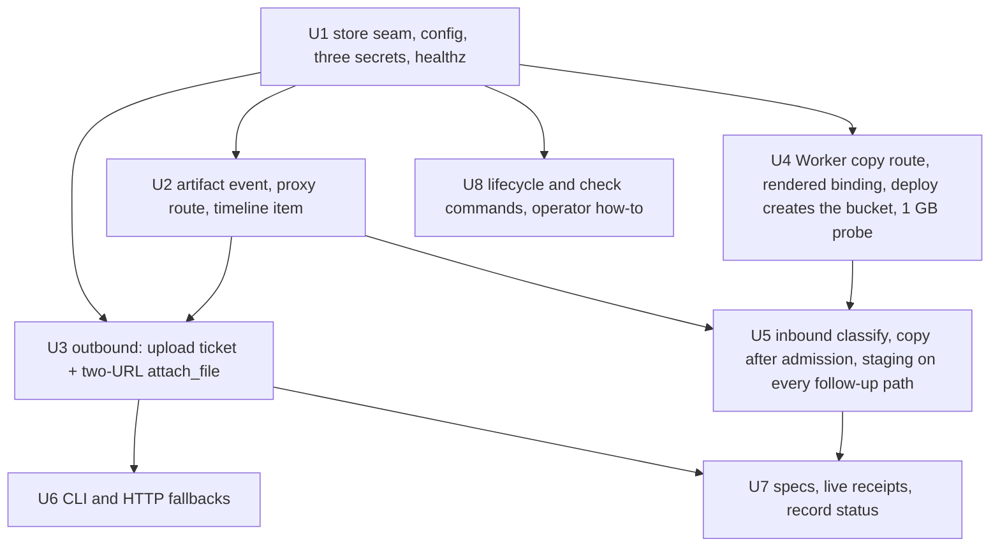

# The artifact store on R2 - Plan

## Goal Capsule

- **Objective**: Files a run produces or receives move by reference through one private R2 bucket, in both directions, as record 0033 decided. A coding run attaches a 1 GB file to its Slack thread without the bot or a Durable Object holding it; a video dropped on a thread reaches the run's workspace; every artifact is on the run page; a deployment without a bucket behaves exactly as today.
- **Why**: the inline path caps attachments at 10 MiB because every byte crosses the Workers' JSON and the bot's memory, and an inbound video is dropped with its name. The owner's ask is 1 GB, upload and return, on Cloudflare.
- **Authority**: record 0033 owns every design decision; this plan sequences it. Where the plan and the record disagree, the record wins and the plan is corrected, except where this plan's review found the record's mechanism unworkable: the privacy probe (KTD10) and the lifecycle credential (KTD11) supersede the record's wording and are noted on the record when U7 flips its status. Specs touched: [execution.md](../reference/specs/execution.md), [slack-channel.md](../reference/specs/slack-channel.md), [agent-coding.md](../reference/specs/agent-coding.md), [run-visibility.md](../reference/specs/run-visibility.md), [run-history.md](../reference/specs/run-history.md), [resident-repos.md](../reference/specs/resident-repos.md), [http-ingress.md](../reference/specs/http-ingress.md).
- **Execution profile**: outbound first (the owner's call: the first live receipt is a 1 GB attach and needs only the bucket and token); one pull request per unit landing on `main` through the ordinary review gate; every unit is inert until `artifacts:` is configured, and the Worker's R2 binding is rendered only from that configuration, so `main` stays deployable throughout.
- **Stop conditions**: a unit that would buffer whole file bytes in the bot process or a Durable Object stops and hands back a deviation (the U2 proxy's per-request stream, bounded by backpressure and never accumulated, is the record's designed exception). A unit that would place a credential in an executor command stops; a credential is the R2 secret access key, the Slack bot token, or any bearer the bot presents, while a presigned URL's query string (which carries the access key id and a signature) and Slack's one-shot upload URL are allowed with windows of 10 minutes or less, because command strings reach the sandbox SDK's exec logs. The Worker 1 GB probe (U4) failing changes the record before any inbound unit continues.
- **Tail ownership**: the R2 API token scoped Object Read & Write to `switchboard-artifacts` is the owner's to create in the Cloudflare dashboard, and its two halves go to the bot's secrets; `deploy` creates the bucket itself, idempotently, so no unit merges behind a hand step. The live receipts (U3, U4, U7) wait on the token and say so rather than skipping.

---

## Product Contract

### Summary

Add an `ArtifactStore` seam with an R2 and an in-memory implementation, an `artifact` run event that the run page renders through an authenticated proxy, an outbound path where the container PUTs to R2 and POSTs to Slack's one-shot upload URL while the bot completes on evidence, and an inbound path where the bot's Worker streams a Slack file into R2 and the container pulls it into `attachments/` before the turn that carries it.

### Requirements

**Store and configuration**

- R1. An `artifacts:` config section (`r2: { accountId, bucket }`, `retentionDays`, `inbound.maxBytesPerMessage`, `inbound.copyTimeoutMs`) turns the store on; absent, every surface behaves as at 1.212.0 and `/healthz` shows no `artifacts` key.
- R2. Three optional bot secrets declared through the three-file secret contract: `ARTIFACTS_R2_ACCESS_KEY_ID` and `ARTIFACTS_R2_SECRET_ACCESS_KEY` (the bucket-scoped S3 token) and `ARTIFACTS_COPY_TOKEN` (the self-minted bearer the bot presents to its Worker's copy route). A configured store with any of the three missing fails fast by name at startup.
- R3. `/healthz` reports `artifacts: { bucket }` when configured. Bucket privacy is an operator invariant stated in the how-to and checked by the `artifacts check` command (R14), not a runtime probe: R2's S3 endpoint refuses every unsigned request whatever the bucket's public setting, so a probe against it cannot fail.

**Outbound (a produced file)**

- R4. `attach_file` with a store: measure the file as the thread user, derive its content type from the extension, PUT it to a presigned R2 URL with that content type signed into the request, then mint a Slack upload ticket, POST the file to it, `HEAD` the key, write the `artifact` event, and complete the Slack upload with the lead. A size mismatch or a failed POST completes nothing and returns the platform's words; each transfer runs under the 20-minute command budget clipped to the run's remaining wall clock, and an exhausted budget refuses before any URL is minted.
- R5. A file over Slack's 1 GB is refused by name before any URL is minted; a channel without an upload ticket takes the store-only path (R2 copy plus the run-page link); with no store the inline path up to 10 MiB stands.

**Run record and run page**

- R6. One `artifact` event per file carries `direction`, `key`, `name`, `size`, `contentType` and never bytes or URLs.
- R7. `/runs/<id>/artifacts/<key>` serves a key only if the run's `artifact` events name it, authorizes a finished run's viewer as its reader and a live run's viewer by the live token, and streams the object with a signed GET minted for that request. The response carries the event's `contentType`, `X-Content-Type-Options: nosniff` and `Content-Security-Policy: sandbox`; only `image/png`, `image/jpeg`, `image/gif` and `image/webp` are served inline, every other type is `Content-Disposition: attachment`. A key in the events whose object is gone answers 410 naming the retention window. The page CSP stays `img-src 'self' data:`.
- R8. The run page lists a run's artifacts (name, size, direction) as one timeline item; the four raster image types render inline through the proxy, other types are download links, an expired artifact reads "expired after N days"; on a live page every proxy URL carries the page's live token.

**Inbound (a received file)**

- R9. The Slack adapter classifies each file `inline`, `staged` or `skipped` by metadata alone; a staged file travels as `{ name, size, type, url_private }` on `IncomingMessage`, `DispatchFollowUp` and the durable inbox.
- R10. The copy to R2 happens only after admission and authorization succeed and only when the target run has a workspace; a workspace-less preset copies nothing and the turn names the file and the preset to ask.
- R11. The copy is the bot's Worker's (`POST /artifacts/copy`, bearer `ARTIFACTS_COPY_TOKEN`), streaming `url_private` into the `ARTIFACTS` binding as a fixed-length stream; the route refuses any `url` whose host is not `files.slack.com` or a `*.slack.com` subdomain before attaching the Slack token; a short body leaves no object; the bot's call is bounded by `artifacts.inbound.copyTimeoutMs`.
- R12. Before the turn that carries a staged file, on every path a follow-up can take, one executor command per file pulls it into `attachments/<basename>` over a presigned GET minted at that moment, under the 20-minute budget, with the path single-quoted; on the resident `attachments/` is added to `.git/info/exclude`. The turn gains one line per file with its path and size, or the failure and its reason.
- R13. Staged bytes per message are capped at `artifacts.inbound.maxBytesPerMessage` (default 2 GiB) and ten files; `<basename>` is the Slack filename reduced to `[A-Za-z0-9._-]` (every other character becomes `_`), so it is shell-, URL- and key-safe by construction.

**Operations**

- R14. `artifacts lifecycle` (operator-side, `CLOUDFLARE_API_TOKEN` like the `deploy` commands, never the bot's token) applies and reads back the bucket's lifecycle rules: objects expire after `artifacts.retentionDays`, incomplete multipart uploads abort after one day. `artifacts check` reads the bucket's managed-domain and custom-domain settings and reports whether the bucket is private. Both are CLI-only.

### Scope Boundaries

- Not in scope: media transformation, virus scanning, per-user quotas, any change to what the model sees inline (a staged image is a file, not a picture in context), Discord or other channels beyond the fallback path.
- Deferred to follow-up work: a Worker-proxy transport without an S3 token (rejected in the record; revisit only if U4's probe fails and KTD7's fallback also fails); a per-thread staging budget beyond the per-message cap (record open question, owner's call); a runtime privacy probe if a bucket-domain read ever becomes available to a bucket-scoped token.

### Success Criteria

The five criteria of record 0033's ask, each bound to a receipt in U7.

---

## Planning Contract

### Key Technical Decisions

- KTD1. **`aws4fetch` as a direct dependency** for SigV4 presigning and signed `HEAD`. MIT, on the license allowlist, already in the lockfile as the sandbox SDK's signer, about 300 lines. Chosen over a hand-written signer: the edge cases (unsigned payload, `auto` region, signed headers) are already someone else's fixed bugs.
- KTD2. **The store seam is `ArtifactStore { presignPut(key, contentType), presignGet, head, copyFromUrl }`** with `R2ArtifactStore` and `InMemoryArtifactStore`. `copyFromUrl` on R2 calls the Worker route (U4); in memory it fetches directly, so the inbound path is testable without a Worker.
- KTD3. **The container moves outbound bytes with two `curl` commands through `Executor.exec`**, each with `timeoutMs: BASH_TIMEOUT_MAX_MS` clipped by `bashBudgetWithinRun`; `stat -c %s` through `exec` measures the file. The R2 PUT runs first and the Slack ticket is minted after it, because Slack's `upload_url` lifetime is undocumented and a ticket must not age through a long PUT. (session-settled: user-directed — chosen over the bot streaming R2 → Slack: the bot is a 1 GiB `basic` container serving every run, and Slack's upload URL is built to be handed to the party holding the file.)
- KTD4. **`ChannelIO.uploadTicket?(name, size) → { url, complete(lead) }`** is the channel seam for outbound delivery; Slack implements it with `files.getUploadURLExternal` / `files.completeUploadExternal`. Other channels leave it out and the tool takes the store-only path.
- KTD5. **Keys**: outbound `runs/<runId>/out/<seq>-<basename>` where `<seq>` is the run's artifact count so far; inbound `threads/<threadKeySafe>/in/<messageTs>/<index>-<basename>` where `<index>` is the file's position in the message. The leaf is unique per file so a run that attaches `screenshot.png` twice (a before and an after) keeps both. The record's `artifact` events are the access list the proxy checks. (session-settled: user-approved — the thread and run prefixes were chosen over run-id-only keys: the run id does not exist when an inbound file arrives.)
- KTD6. **Inbound copy after admission, in the dispatcher**, at every target a file can reach: a new run (between run creation and provisioning), a follow-up that becomes a fresh turn through `mergeFollowUps`, a mid-run steer consumed from the durable inbox between model steps, and a workspace-less preset (no copy, a named line). (session-settled: user-approved — chosen over copying in the adapter: a refused request or a `general` run must never pay for a copy.)
- KTD7. **The Worker copies inbound bytes** through an `ARTIFACTS` R2 binding on `deploy/cloudflare/worker.ts`, authenticated with `ARTIFACTS_COPY_TOKEN`, a self-minted shared bearer on the `RESIDENT_ADMIN_TOKEN` pattern. The binding is rendered into the bot's `wrangler.jsonc` only when the deployment configures `artifacts.r2.bucket`, with that name, and `deploy` creates the bucket idempotently (`wrangler r2 bucket create`) before the Worker upload, so a binding never points at a bucket that does not exist. Fallback if U4's probe fails: the bot copies in 8 MiB multipart parts, and the record is superseded on that point.
- KTD8. **Defaults decided, revisable**: retention 30 days, incomplete-multipart abort 1 day, 2 GiB and ten files per message, 10-minute URL windows, copy timeout 20 minutes. Each is one config key with the default in `config/config.example.yaml`. The retention default is under review (see Open Questions): the record's trace promises an artifact "months later".
- KTD9. **Run page**: one `artifacts` timeline item per run listing name, size and direction; the four raster image types render inline from the proxy, everything else is a link, an expired row says so; live pages seed an `artifactsUrlBase` carrying `?t=` the way `eventsUrl` does. (session-settled: user-directed — chosen over a download-only list and over deferring the page.)
- KTD10. **No runtime privacy probe.** R2's S3 endpoint refuses every unsigned request regardless of public access, which is served from `pub-<hash>.r2.dev` or a custom domain the bot cannot compute, so the record's unsigned-GET probe would report `private: true` forever. Privacy is checked where it is knowable: `artifacts check` reads the bucket's managed and custom domain settings with the operator's Cloudflare token, and the how-to names it as a step. Supersedes the record's probe wording; chosen over a third bot secret for a Cloudflare API token, which would widen the bot's credential set for a check the operator can run.
- KTD11. **Lifecycle rules through the Cloudflare REST API with the operator's token.** `PutBucketLifecycleConfiguration` needs an Admin Read & Write R2 token, which the bot's Object Read & Write token is not and must not become; the `deploy` commands already authenticate operator-side Cloudflare API calls with `CLOUDFLARE_API_TOKEN`. Supersedes the record's "through `aws4fetch`" for lifecycle.
- KTD12. **Content type is derived once, in the tool, from the file extension** (the image media-type map in `src/channels/slack/attachments.ts`, `application/octet-stream` otherwise), sent as a signed `Content-Type` header on the R2 PUT, carried on the event, and served by the proxy from the event, so the page and the proxy never disagree.

### Sequencing

### Assumptions

- Slack's one-shot `upload_url` accepts a raw `curl --data-binary` POST from a container (tested in U3 by hand before code depends on it).
- A Worker can stream a 1 GB `url_private` body into an R2 binding as a `FixedLengthStream` within its limits, and Slack's response carries a `Content-Length` (U4's probe reads the headers on failure; KTD7 names the fallback).
- The owner provisions the R2 token before U3's live receipt; the bucket is `deploy`'s to create.

---

## Implementation Units

### U1. The store seam, its two implementations, and the contract around it

- **Goal**: `ArtifactStore` exists with `R2ArtifactStore` (presigned PUT with a signed content type, presigned GET, signed `HEAD`, `copyFromUrl` delegating to the Worker route with `ARTIFACTS_COPY_TOKEN`) and `InMemoryArtifactStore`; the `artifacts:` config section, the three bot secrets and the `/healthz` fact are wired; nothing else changes.
- **Requirements**: R1, R2, R3, R13; KTD1, KTD2, KTD8, KTD10.
- **Dependencies**: none.
- **Files**: `src/artifacts/store.ts` (seam + both implementations), `src/artifacts/keys.ts` (key builders with the `<seq>`/`<index>` leaf and `safeBasename`), `src/artifacts/contentType.ts` (extension → type, reusing the image map), `src/artifacts/store.test.ts`, `src/artifacts/keys.test.ts`; `src/config.ts` and `src/config/validate.ts` (`artifacts` on `AppConfig`, `CONFIG_KEYS`, `validateArtifacts`), `config/config.example.yaml`; `deploy/secrets.manifest.json`, `deploy/cloudflare/worker.ts` (`Env`, `FORWARDED_OPTIONAL`, the three names), `src/core/secretsManifest.test.ts` if it enumerates names; `src/channels/health.ts` and its test; `src/index.ts` and `src/cli.ts` (the two `CoreDeps` composition sites beside `runHistoryWriter`), so `deps.artifacts` is the store or absent; `package.json` (`aws4fetch`).
- **Approach**:
  1. Tests first for the seam: presigned URLs name one key, carry a 600-second expiry, the `auto` region and, for PUT, the signed `Content-Type`; `head` answers size and content type; the in-memory store honours the same contract; `safeBasename` maps `../../etc/passwd` to `passwd`, `clip"; echo pwned; ".mp4` to `clip_echo_pwned_.mp4` and `$(id).mp4` to `_id_.mp4`.
  2. Config: `artifacts.r2.accountId`, `artifacts.r2.bucket`, `artifacts.retentionDays`, `artifacts.inbound.maxBytesPerMessage`, `artifacts.inbound.copyTimeoutMs`; unknown keys refused like every other section.
  3. Secrets through the three-file contract; a configured store with any of the three missing throws at startup naming it.
  4. `/healthz` gains `artifacts: { bucket }` when configured and nothing otherwise.
- **Patterns to follow**: `memory?: MemoryConfig` and `validateMemory` in `src/config.ts` / `src/config/validate.ts`; the `R2_ACCESS_KEY_ID` and `RESIDENT_ADMIN_TOKEN` manifest entries and `FORWARDED_OPTIONAL` in `deploy/cloudflare/worker.ts`; `InMemoryGithubApi` beside `RestGithubApi` for the two-implementation shape; `/healthz` facts in `src/channels/health.ts`.
- **Test scenarios**:
  - A presigned PUT and GET for `runs/r1/out/1-a.png` differ in method and signed headers, expire in 600 s, and a URL for another key does not verify.
  - `head` on a missing key answers `null`, on a present key answers `{ size, contentType }` (in-memory).
  - `validateConfig` accepts the documented `artifacts:` block, refuses `artifacts.retentionDays: "30d"` and an unknown `artifacts.foo`.
  - A configured store with `ARTIFACTS_COPY_TOKEN` absent fails startup naming that secret; no `artifacts:` and no secrets passes.
  - `/healthz` carries `artifacts: { bucket }` with config and no key without.
  - `safeBasename` cases from step 1; a name reduced to empty becomes `file`.
  - The secrets manifest test holds the manifest, `Env` and `FORWARDED_OPTIONAL` equal after the three additions.
- **Verification**: the new tests green, red first; `npm run check:consistency` (licenses, secrets manifest, docs) ok; `npm run verify` green; a bot started without `artifacts:` behaves as before.

### U2. The `artifact` run event, the proxy route, and the timeline item

- **Goal**: A run record can carry `artifact` events; the bot serves a run's artifacts through `/runs/<id>/artifacts/<key>` under the run's authorization with the hardening headers; the run page lists them, renders raster images inline, and names expired ones.
- **Requirements**: R6, R7, R8; KTD5, KTD9, KTD12.
- **Dependencies**: U1.
- **Files**: `src/core/runEvents.ts` (the `artifact` member), `src/core/runEvents.test.ts`; `src/channels/liveView.ts` (the route with a greedy key tail after `/artifacts/`, `artifacts` reserved as never a run id like `scheduled`, both authorization paths, the `artifactsUrlBase` seed beside `eventsUrl`), `src/channels/liveView.test.ts`; `web/src/lib/runPageModel.ts` (item kind `artifacts`), `web/src/components/run/ArtifactsBlock.vue`, their tests; `docs/reference/specs/run-visibility.md` (the event in the union), `docs/reference/specs/run-history.md` (the record shape).
- **Approach**:
  1. Tests first: `parseRunEventLines` accepts the new member and refuses a `url` field; a record with two `artifact` events renders one `artifacts` item with two rows; the route refuses a key not in the run's events with 404, a finished run's non-reader with the existing authorization refusal, a live run without `?t=` with the existing token refusal; a permitted request streams the object with the event's `contentType`, `X-Content-Type-Options: nosniff`, `Content-Security-Policy: sandbox`, inline for the four raster types and `Content-Disposition: attachment; filename="<basename>"` for everything else including `image/svg+xml` and `text/html`; a key in the events whose `head` is null answers 410 naming `retentionDays`.
  2. The route mints the signed GET per request and pipes the response; no URL is stored or returned to the browser; the key is taken as everything after `/artifacts/`.
  3. The web item: name, size, direction; raster rows as `` from `artifactsUrlBase + key`, other rows as links, expired rows as text; the seed carries `?t=` on a live page. Screenshots for the PR (visual change).
- **Patterns to follow**: `review_artifact` in `src/core/runEvents.ts` for the member shape; `authorize(actor, "runs:read", runResource(view))` and `authorizeLive` in `src/channels/liveView.ts`; `eventsUrl`/`stopUrl` seeding in `src/channels/liveView.ts` and `RunPage.vue`; the `skill` item kind in `web/src/lib/runPageModel.ts` and its component; `PAGE_CSP` in `src/channels/webShell.ts` stays untouched.
- **Test scenarios**:
  - An `artifact` event `{ direction: "out", key, name, size, contentType }` round-trips through the record writer and reader; a payload with a `url` field is refused by the parser.
  - Proxy: key in events + finished run + reader → 200 with the event's content type and both hardening headers; `image/png` inline; `image/svg+xml` and `text/html` with attachment disposition; key not in events → 404; live run with the right `?t=` → 200, without → the token refusal; a key from another run's events → 404; key in events with `head` null → 410 naming the retention window.
  - Router: `/runs/r1/artifacts/threads/slack-CX-1.0/in/1.0/1-clip.mp4` resolves to run `r1` and that full key; `/runs/artifacts` is not a run id.
  - Run page model: two `in` and one `out` artifact become one `artifacts` item with three rows in event order; a run without artifacts has no item.
  - Component: an `image/png` row renders an `img` whose `src` ends in `?t=<token>` on a live page and has no query on a finished one; an `application/zip` row renders a link; an expired row renders "expired after 30 days".
- **Verification**: the new tests green, red first; `npm run verify` green including `-w web`; the PR carries before/after screenshots of a run page with artifacts.

### U3. Outbound delivery: the upload ticket and the two-URL `attach_file`

- **Goal**: With a store configured, `attach_file` delivers through R2 and Slack's external-upload API without the bot holding the file; without a store, today's inline path stands.
- **Requirements**: R4, R5; KTD3, KTD4, KTD5, KTD12.
- **Dependencies**: U1, U2.
- **Files**: `src/core/types.ts` (`uploadTicket?` on `ChannelIO`), `src/channels/slack.ts` (`SlackIO.uploadTicket`), `src/channels/slack.test.ts`; `src/tools/attach.ts` (the store path beside the inline path), `src/tools/attach.test.ts`; `src/tools/workspace.ts` (`ToolContext.artifacts?` and `uploadTicket?`), `src/core/dispatch/runLoop.ts` (inject both when present), `src/core/dispatch/runLoop.test.ts`; `src/core/dispatch/spawn.ts` and `src/channels/adminCoordinator.ts` (forward `uploadTicket` by method), `src/core/dispatch/spawn.test.ts`; `src/agents/registry.ts` (the shared `SHOW_FILES` paragraph names the 1 GB ceiling when a store is on), `src/agents/registry.test.ts`.
- **Approach**:
  1. Probe first, by hand, before code: mint a ticket with the bot token in a scratch script, `curl --data-binary` a file to `upload_url` from a shell, complete it into a test thread. If Slack refuses a raw POST, switch the container command to multipart before writing the tool path. Record the result on the PR; do not commit the script.
  2. Tests first for the tool's store path, in this order: stat → content type → presign PUT → exec PUT → ticket → exec POST → `HEAD` → event → complete; each failure stops the chain and returns the platform's words; over 1 GB refuses before any mint; a run budget too small for one 20-minute command refuses before any mint; no `uploadTicket` → store-only path posts the run-page link as the lead; no store → the inline path unchanged.
  3. `SlackIO.uploadTicket(name, size)` calls `files.getUploadURLExternal({ filename, length })` and returns `{ url, complete }`; `complete(lead)` calls `files.completeUploadExternal({ files: [{ id, title }], channel_id, thread_ts, initial_comment })`.
  4. The commands, as strings the executor executes with `timeoutMs: BASH_TIMEOUT_MAX_MS` clipped by `bashBudgetWithinRun`: `stat -c %s -- '<path>'`, `curl -fsS -T '<path>' -H 'Content-Type: <type>' "<put>"`, `curl -fsS --data-binary @'<path>' "<upload_url>"`. A test greps every command string for the secret access key, the Slack token and `ARTIFACTS_COPY_TOKEN` and finds none; the presigned query string is expected.
- **Patterns to follow**: `SlackIO.attachFile` and its tests; `attachFileTool` and the capability-bag pattern in `src/tools/workspace.ts`; `watchedChild` forwarding in `src/core/dispatch/spawn.ts`; `statCommandFor` in `src/execution/binaryRead.ts`; `bashBudgetWithinRun` in `src/execution/bashTimeout.ts`.
- **Execution note**: the Slack POST probe is a live check before the unit's code; record its result in the PR.
- **Test scenarios**:
  - Happy path: a 3 MiB `sheet.png` yields exactly the three exec commands in order with the 20-minute budget, one `HEAD`, one `artifact` event with `contentType: image/png` before `complete`, and the tool result names the size.
  - Two `attach_file` calls for `screenshot.png` in one run yield keys `…/out/1-screenshot.png` and `…/out/2-screenshot.png` and two events.
  - `HEAD` answers a different size → no ticket, no `complete`, no event; the result names both sizes.
  - The Slack POST exits non-zero → no `complete`; the result carries the curl error and says the R2 copy exists.
  - `complete` answers `file_not_found` → the result carries Slack's words; the event stands.
  - A 1,073,741,825-byte file → refused by name, no presign, no ticket.
  - A run with three minutes left → refused before any mint, naming the budget.
  - No `uploadTicket` on the channel → the tool PUTs to R2 and posts a lead with the proxy link through `reply`.
  - No store in the context → the inline `readBytes` path runs exactly as today (the existing tests stay green).
  - Command strings carry no secret access key, Slack token or copy bearer.
  - `spawn.test.ts`: a child channel forwards `uploadTicket` when the opened thread has one.
- **Verification**: tests green, red first; `npm run verify` green; live receipt after the token exists: `agent:coding` attaches a 1 GB file in a switchboard thread, Slack shows it, the run page lists it, the bot's `/healthz` RSS stays flat through the run.

### U4. The Worker copy route, the rendered binding, and the 1 GB probe

- **Goal**: `POST /artifacts/copy { url, size, key }` on the bot's Worker streams a Slack `url_private` body into the `ARTIFACTS` R2 binding as a fixed-length stream and answers `{ key, size }`; the binding exists only when the deployment configures a bucket, and `deploy` creates the bucket before the Worker upload.
- **Requirements**: R11; KTD7.
- **Dependencies**: U1.
- **Files**: `deploy/cloudflare/worker.ts` (the route, the optional `ARTIFACTS` binding on `Env`, the Slack token read from env, `/healthz` answering the binding's bucket name), `deploy/cloudflare/wrangler.template.jsonc` and `src/deploy/wranglerTemplate.ts` (render `r2_buckets` from the profile's `artifacts.r2.bucket` only when set), `src/deploy/plan.ts` or the deploy command (create the bucket idempotently before the Worker upload), `deploy/cloudflare/artifactsCopy.test.ts` (new), `src/deploy/wranglerTemplate.test.ts`; `src/artifacts/store.ts` (`R2ArtifactStore.copyFromUrl` calls the route at `PUBLIC_BASE_URL` with `ARTIFACTS_COPY_TOKEN`, bounded by `copyTimeoutMs`); `src/channels/health.ts` test asserting the config bucket equals the Worker-reported one when both are present.
- **Approach**:
  1. Tests first at the Worker: a request without the bearer is refused; a `url` whose host is not `files.slack.com` or `*.slack.com` is refused with 400 before any fetch; upstream `Content-Length` ≠ `size` is refused before any `put`; an upstream `text/html` 200 (Slack's login page) is refused as unauthorized; a successful copy calls `put` once with a `FixedLengthStream` of `size` and the upstream content type; an upstream stream that ends short leaves no object and answers 502.
  2. The route reads `SLACK_BOT_TOKEN` from the Worker's own env (already there to forward), never from the request.
  3. The binding: the template gains a conditional `r2_buckets` entry rendered from the profile; `deploy` runs `wrangler r2 bucket create <name>` treating "already exists" as success, under the token capability the plan check already verifies.
  4. The probe, before U5 starts: copy a 1 GB file from a Slack `url_private` through the deployed route; record wall time, Slack's egress rate and the response headers on the PR. Failure → KTD7's fallback and a superseding note on the record; the wall time sets `copyTimeoutMs`'s default.
- **Patterns to follow**: the admin routes' bearer check in `deploy/cloudflare/worker.ts`; `RESIDENT_ADMIN_TOKEN` in `deploy/secrets.manifest.json` for a self-minted shared bearer; the resident's `BACKUP_BUCKET` binding and its "must say the same name" comment in `deploy/cloudflare-resident/wrangler.template.jsonc`; `src/deploy/plan.ts`'s note that wrangler validates a binding on deploy.
- **Execution note**: the 1 GB probe is the design's one untested premise; it is this unit's receipt, not U5's.
- **Test scenarios**:
  - Missing or wrong bearer → 401, no upstream fetch.
  - `url` on `evil.example` → 400, no upstream fetch, no token sent.
  - Upstream answers `text/html` 200 → refused, no `put`.
  - Upstream `Content-Length` ≠ `size` → 409, no `put`.
  - Happy path → one `put(key, stream)` with the declared length and Slack's content type; answer `{ key, size }`.
  - Upstream stream errors mid-body → `put` rejects, the route answers 502, and a following `head(key)` is null.
  - Template: a profile without `artifacts` renders no `r2_buckets`; one with `artifacts.r2.bucket: switchboard-artifacts` renders the binding with that name.
  - `/healthz` test: config bucket and Worker-reported bucket equal when both are present; a mismatch is reported by name.
- **Verification**: Worker tests green, red first; `npm run verify -w deploy/cloudflare` green; `deploy:check` ok in both profiles; the deployed route copies a 1 GB file, receipt on the PR with wall time and egress rate.

### U5. Inbound: classification, the copy after admission, and staging on every follow-up path

- **Goal**: A file a person drops on a Slack thread, on a new request, a follow-up that becomes a fresh turn, or a steer into a live run, is classified by metadata, copied to R2 only after admission for a run with a workspace, pulled into `attachments/` before the turn that carries it, and named to the model.
- **Requirements**: R9, R10, R12, R13; KTD5, KTD6.
- **Dependencies**: U1, U2, U4.
- **Files**: `src/channels/slack/attachments.ts` (`classifyFile` → `inline | staged | skipped`, the staged reference), `src/channels/slack/attachments.test.ts`; `src/core/types.ts` (`IncomingMessage.staged`), `src/core/dispatch/admission.ts` (`DispatchFollowUp.staged`), `src/core/threadAdmission.ts` (`mergeFollowUps` carries `staged`), `src/core/runLedger/inboxMessage.ts` (the reference survives the inbox), their tests; `src/core/dispatcher.ts` (copy after admission for a new run, between run creation and `attachWorkspace`), `src/core/dispatch/runLoop.ts` and `src/runner.ts` (copy and pull before a steer consumed from the inbox is handed to the model), `src/core/dispatch/messages.ts` (the per-file line injected after the pull), `src/core/dispatch/staging.ts` (the pull commands and the exclude line, pure and tested), `src/core/dispatch/staging.test.ts`, `src/core/dispatcher.test.ts`, `src/core/dispatch/runLoop.test.ts`; `src/agents/registry.ts` (both coding prompts: "attached files are in `./attachments/`"), `src/agents/registry.test.ts`.
- **Approach**:
  1. Characterization coverage first on `attachments.ts` (the inline caps must not move), then tests for classification: a `video/mp4` of 312 MB is `staged`; a 6 MiB PNG is `staged` (over the inline cap); a 1 MiB PNG stays `inline`; a 1.2 GB file is `skipped` with the reason; an eleventh file is `skipped`; a message over 2 GiB total skips the overflow; the secret denylist still wins over `staged`.
  2. The staged reference is `{ name, size, type, url_private }`; `mergeFollowUps` carries it into a fresh turn, and the durable inbox row carries it beside the text.
  3. Copy at the four targets per KTD6, through `deps.artifacts.copyFromUrl`; the `artifact` event is written after the copy answers.
  4. `staging.ts`: `pullCommandFor(url, basename)` → `mkdir -p attachments && curl -fsS -o 'attachments/<basename>' "<url>"`; `excludeCommand()` for the resident; `attachmentsLine(files)` for the turn. The executor runs them with `timeoutMs: BASH_TIMEOUT_MAX_MS`; on the sandbox "the thread user" is the sandbox's single user.
  5. The turn's line is injected after the pull so a failure carries its reason; a workspace-less preset gets "this agent has no workspace for `<name>`; ask `agent:coding`".
- **Patterns to follow**: `fetchImages`/`fetchDocuments` and `classifyDocument` in `src/channels/slack/attachments.ts`; `turnContent` in `src/core/dispatch/messages.ts`; `mergeFollowUps` in `src/core/threadAdmission.ts`; `prepareFreshTurn` in `src/core/dispatch/settle.ts`; the inbox consume point in `src/runner.ts`; the resident cleanliness check in `src/execution/residentCleanliness.ts`.
- **Test scenarios**:
  - Classification as in step 1.
  - New run: with a workspace, `copyFromUrl` is called after `admit` and before `attachWorkspace`, once per staged file; a refused admission calls it never; a `general` run calls it never and the turn carries the named line.
  - Fresh-turn follow-up: `mergeFollowUps` keeps the staged reference and the new run's copy site handles it.
  - Inbox steer on a live run: `copyFromUrl` then the pull command through the executor before the steer reaches the model; the turn's text ends with `Attached files are in ./attachments/: clip.mp4 (312 MB, video/mp4)`.
  - The pull command for `clip"; echo pwned; ".mp4` is `… -o 'attachments/clip_echo_pwned_.mp4' …` with no unquoted metacharacters.
  - The pull command exits non-zero → the turn line names the file and the curl error; no retry.
  - The pull command for a resident includes the `.git/info/exclude` append; for a sandbox it does not.
  - Durable inbox: a steer with a staged reference survives `DURABLE_INBOX_MAX_BYTES`.
  - Two files with the same name on one message get keys `…/1-a.png` and `…/2-a.png` and land as `attachments/1-a.png` and `attachments/2-a.png`.
- **Verification**: tests green, red first; `npm run verify` green; live receipt: a 300 MB video dropped mid-run reaches `ffmpeg` and a contact sheet comes back inline (U7 binds it).

### U6. The CLI harness and HTTP/MCP fallbacks

- **Goal**: Channels without an upload ticket behave honestly: the CLI harness and the HTTP/MCP channels take the store-only path (R2 copy plus the run-page link, with the live token when the run is live), and nothing pretends a Slack upload happened.
- **Requirements**: R5.
- **Dependencies**: U3.
- **Files**: `src/cli.ts` (`ConsoleIO` keeps `attachFile`; the store-only lead prints the proxy URL), `src/cli.test.ts`; `src/tools/attach.test.ts` (the store-only path with `ConsoleIO`-shaped channels); `docs/reference/specs/mcp-tools.md` and `http-ingress.md` rows if they describe attachments.
- **Approach**: one test per channel shape that the tool posts a lead with the run-page link and no upload ticket is required; the CLI harness's local temp-dir behavior stays for the inline path.
- **Test scenarios**:
  - A channel with `reply` but no `uploadTicket` → the tool's result names the R2 key and the lead carries `/runs/<id>/artifacts/<key>` (with `?t=` while the run is live).
  - `ConsoleIO` without a store → the inline temp-dir path as today.
- **Verification**: tests green; `npm run verify` green.

### U7. Specs, live receipts, and the record's status

- **Goal**: Every behavior above has its spec row bound to a proof, the record's success criteria have receipts, and record 0033 reads `accepted` with a note on the two superseded mechanisms.
- **Requirements**: all; the record's five criteria.
- **Dependencies**: U3, U5.
- **Files**: `docs/reference/specs/execution.md` (item 20: the artifact store, the outbound commands, the inbound pull), `docs/reference/specs/slack-channel.md` (the upload ticket and the staged classification), `docs/reference/specs/agent-coding.md` (item 10 gains the store path and the 1 GB ceiling), `docs/reference/specs/run-visibility.md` and `run-history.md` (the event), `docs/reference/specs/resident-repos.md` (`attachments/` and the exclude), `docs/reference/specs/http-ingress.md` (the Worker route); `docs/decisions/0033-artifacts-move-by-reference-through-r2.md` (status line `accepted`; a one-line note under status that KTD10 and KTD11 of this plan supersede the probe and the lifecycle credential).
- **Approach**: each earlier unit lands its own rows in the same PR (the same-PR rule); U7 adds the live rows and posts the receipts: a 1 GB attach (U3), a 300 MB video to `ffmpeg` and back (U5), `artifacts check` reporting a private bucket, the run page with artifacts and an expired row, and a deployment without `artifacts:` behaving as before.
- **Test scenarios**: `Test expectation: none -- receipts and spec rows; every row binds to a test landed by U1 to U6 or to an agent procedure written here.`
- **Verification**: `npm run specs:check` and `npm run specs:coverage -- --changed origin/main...HEAD --require` ok; `npm run decisions:check` ok with the status flip; receipts posted on the unit PRs.

### U8. The `artifacts lifecycle` and `artifacts check` commands and the operator how-to

- **Goal**: An operator applies and reads the bucket's lifecycle rules and checks its privacy from the CLI with the operator's Cloudflare token; the how-to says how to create the token, the secrets and the config.
- **Requirements**: R14; KTD8, KTD10, KTD11.
- **Dependencies**: U1.
- **Files**: `src/core/commands/artifacts.ts` (`artifacts lifecycle` and `artifacts check`, registered with `action: "deploy:write"` and `surfaces: { chat: false, mcp: false, http: false }`), its test and conformance rows; `src/deploy/artifactsBucket.ts` (the Cloudflare REST calls: `PUT`/`GET /accounts/<accountId>/r2/buckets/<bucket>/lifecycle`, `GET …/domains/managed`, `GET …/domains/custom`) and its test; `docs/how-to/store-run-artifacts.md` (token scope, secrets, config, bucket creation by `deploy`, retention, the privacy check); `docs/reference/specs/command-registry.md` row; `config/config.example.yaml` (`retentionDays`).
- **Approach**: the commands are typed and registered like every other command; the CLI is the only surface; `CLOUDFLARE_API_TOKEN` is read the way the `deploy` commands read it (never the bot's S3 token); `lifecycle` applies `Expiration` after `retentionDays` and `AbortIncompleteMultipartUpload` after one day and reads the configuration back; `check` reports `private` as managed domain disabled and no custom domains; a dry run prints the rule it would apply.
- **Patterns to follow**: `deploy.restart` in `src/core/commands/deploy.ts` for `action` and `surfaces`; `src/deploy/imagesHost.ts` for the operator-side Cloudflare token; the how-to shape of `docs/how-to/onboard-a-repo.md`.
- **Test scenarios**:
  - `artifacts lifecycle --dry-run` prints the two rules with the configured days and touches nothing.
  - `artifacts lifecycle` PUTs the configuration once and reads it back equal (Cloudflare API double).
  - `artifacts check` answers `private: true` for managed disabled and no custom domains, `private: false` naming which setting is open.
  - No `artifacts:` configured → both commands refuse by name; the chat, MCP and HTTP catalogues do not list them.
- **Verification**: tests green; the conformance suite covers the new commands; `npm run docs:check` ok; `npm run verify` green.

---

## Verification Contract

| Gate | Command | Applies to |
|---|---|---|
| Unit tests of the changed files, red first then green | `npx vitest run --changed origin/main` | every unit |
| The whole gate, exactly what CI runs | `npm run verify` | every unit before review |
| Worker typecheck and rendered config | `npm run verify -w deploy/cloudflare`; `npm run deploy:check` | U4 |
| Spec bindings and coverage | `npm run specs:check`; `npm run specs:coverage -- --changed origin/main...HEAD --test-guard` | every unit |
| Records | `npm run decisions:check` | U7 |
| Title as the changelog line | `npm run check:pr-title -- "<title>"` | every PR |
| Live receipts (human-gated: the R2 token) | agent procedures in the specs' live rows | U3, U4, U5, U7 |

---

## Open Questions

| Question | Owner | Resolved by | Needed before |
|---|---|---|---|
| Retention default: the record's trace promises an artifact "months later" while its Boundaries say 30 days; 30, 90, or per deployment? | the owner | one number in `config/config.example.yaml`; the expired-row text follows it | U2 |
| Per-thread staging budget beyond the 2 GiB per message, and which actors may trigger a copy? | the owner | one line in `artifacts.inbound`; admission already gates the sender | U5 |
| Should the S3 token rotate without a container restart, now that it guards user content rather than a cache? | the owner | the secret-rotation contract, unchanged unless the owner says otherwise | U8 |

---

## Definition of Done

- All eight units merged on `main` through the review gate, each inert without `artifacts:`; a deployment without the section is byte-for-byte today's behavior on every surface, and its Worker renders no R2 binding.
- Live: a 1 GB file attached from a coding run is in Slack and on the run page; a 300 MB video dropped mid-run is in `attachments/` and a contact sheet comes back inline; `artifacts check` reports a private bucket.
- Record 0033 reads `status: accepted` with the two superseding notes; every spec row it named is bound; the open questions above are answered in config defaults or closed by the owner.
- No dead-end code from probes or abandoned paths remains; the scratch scripts used for the Slack POST and the 1 GB probe are not committed.
