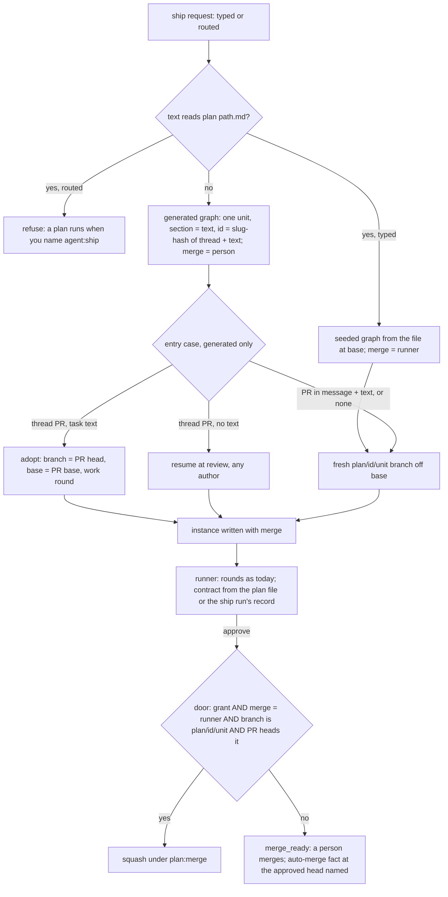

# Ship through the front door - one plan instance, merge as a field, the thread's pull request adopted - Plan

## Goal Capsule

- **Objective**: Unit 1 of record 0036. Every ship request becomes one plan instance, seeded from a file or generated from the request; `merge` is a field the hand-off writes and the driver and the runner's door read; a generated plan in a thread bound to a pull request adopts that pull request whoever authored it; the repository-level auto-merge refusal is replaced by the pull request's own fact; `ship` enters the router's table and `coding` leaves it. When the last unit merges, "fix the failing test" in a pull request's Slack thread drives that pull request to a posted LGTM through ship with no directive typed.
- **Authority**: [record 0036](../decisions/0036-one-front-door-the-router-offers-every-command-and-ship.md), its ship section and the amendment of 2026-09-15; [record 0031](../decisions/0031-the-coordinator-runs-a-plan-not-a-pull-request.md) with its matching note (the merge grant and its guards are unchanged; what selects them moves to a field); [agent-ship.md](../reference/specs/agent-ship.md), [routing-and-config.md](../reference/specs/routing-and-config.md) item 21, [load-harness.md](../reference/specs/load-harness.md) item 17. Where a unit and the record disagree, the record wins, except where Scope Boundaries names a clause of the record this plan defers.
- **Execution profile**: four units, each one pull request through the review loop, in dependency order. Tests first in every unit: the red test names the behaviour before the code moves. Every unit updates the spec rows it changes in the same pull request.
- **Stop conditions**: a unit that cannot pass `npm run verify` within its listed files hands back a deviation. Nothing here adds a Worker, a binding or a credential; U1 and U3 change modules the shim Worker's Workflow bundles (`src/core/coordinator/driver.ts`, `src/core/ship/coordinator.ts`), which deploy with the release like every Worker change and stay node-free. A unit that would let `merge: runner` reach a branch the runner did not create stops and asks.

---

## Product Contract

### Summary

Ship has two entrances into one machine and a merge decision keyed on a branch name. This plan gives it one entrance, a plan instance seeded or generated, and one merge decision, a field on the instance. On that footing ship can adopt the pull request a thread already carries and can be picked by the router for a plain imperative.

### Problem Frame

A task string and a plan file take different paths into the plan runner: different instance ids, branch schemes, contract builders and re-issue rules, and the driver decides who merges by matching the branch name against `plan/<id>/<unit>`. A routed ship must adopt the thread's pull request, whose head is a person's branch, so the branch name can no longer carry the merge decision. The preflight also refuses any repository whose `allow_auto_merge` setting is on, which is the repository-level permission, not the per-pull-request fact GitHub merges on. And `ship` is kept out of the router's table by a rationale that only holds for the plan form.

### Requirements

**Entry and merge**

- R1. Every ship request, typed or routed, becomes a plan instance: seeded when the request reads `plan <path>.md [units …]`, generated otherwise as a plan of one unit whose section is the request text.
- R2. Instance ids follow `plan-<id>[-n]` for both forms. A generated plan's id is deterministic per thread and request text, so the same text in the thread re-issues as the next attempt of the same plan and any other text is a new plan.
- R3. Unit branches follow `plan/<id>/<unit>` for both forms, except an adopted or resumed pull request's own head (R6, R7).
- R4. One contract builder serves both forms: a generated unit's contract is the plan contract over one-unit markdown rendered from the request text, no spec rows and every guard; the task-only builder is removed.
- R5. `merge` is a field on the instance. The hand-off writes `runner` for a seeded plan and `person` for a generated one; nothing in the request text sets the field. The driver reads it from the bot's plan route. The runner's door merges only when the `plan:merge` grant holds, the field says `runner`, the unit row's branch is `plan/<the instance's plan id>/<unit>`, and the pull request heads that branch. An instance with no field reads as `person`.
- R14. A generated instance is told from a seeded one by its record: `plan: { id }` with no `path`. Its one unit runs in the requesting thread, looks up no board issue, is prompted with its section itself, and is reported as the task it is; every place the bot keyed on the `task` unit name keys on that mark.

**Adoption**

- R6. A generated plan in a thread that carries an open pull request the message did not name adopts it: the unit's branch is the pull request's head, its base the pull request's base, round 0 is a work round, then the review loop as today. The branch create is a no-op on the existing branch.
- R7. A bare pull request reference resumes at review for a pull request of any author; its generated unit's section names the pull request. A pull request named in the message beside task text stays context: round 0 starts on a fresh unit branch off the resolved base. A seeded request never adopts: the thread's pull request is context and its units take their `plan/<id>/<unit>` branches.
- R8. The bot-authorship check is removed from every entry case. The fork-head check runs on the adopt and resume cases; a closed pull request as a resume target, and an adopt or resume target whose facts cannot be fetched, still refuse. The context case keeps today's fall-through: a fetch failure or a fork head on a pull request the run never touches refuses nothing.
- R9. `PullRequestFacts` carries `autoMergeEnabled` from the pull request's `auto_merge`. The hand-off's reply names it when it is on at entry; the `merge_ready` report names it as read at the approved head. Nothing refuses on it. The repository-level `allowAutoMerge` field, its extraction and its refusal are removed; the repository lookup stays for the default branch, and a failed lookup no longer refuses.

**Routing**

- R10. `ship` is routable and `coding` is `routable: false`. The imperative rule, the write-ask clause, `presetDoor` and `help` follow the registry without hand edits.
- R11. A routed ship (`agentSource: route`) runs a generated plan with `merge: person`. The seeded form under a route is refused naming `agent:ship`.
- R12. The replay's imperative fixtures label `ship` where they labelled `coding`, the bar's label follows, and a historical label that shares its identity with the table's write preset scores as that preset.

**Specs and docs**

- R13. Each unit changes the spec rows it affects in the same pull request: agent-ship items 3, 9, 10, 13, 15 and 16; routing-and-config item 21; load-harness item 17; the tutorial, get-started and how-to lines that say ship only runs when named or that a plain change routes to coding.

### Scope Boundaries

- Not here: the command tools in the router's menu, the hand-back flag and the regex path's deletion (unit 2 of record 0036, its own plan).
- Not here: a request-level or plan-file `merge` declaration. Record 0036's amendment says "unless a seeded plan or the request says `runner`" and record 0031's note says "a seeded plan as it declares"; both need a gate of their own, so in this plan the seeded form is the only writer of `runner`, and the records take a follow-up amendment when that gate is designed.
- Not here: ship enabling auto-merge on its own pull request (a later record); a planning round that turns a task into several units (a generated plan is one unit); a scope's `agent` splitting into a force and a default (record 0026's follow-up), so a channel that pins `agent: ship` can still seed a plan with no directive typed, as it can today.
- Deferred to follow-up work: retiring `parsePlanBranch` once no instance without a `merge` field remains on the state Worker; the provider-rule and tutorial GIFs that show `agent:ship` typed.

---

## Planning Contract

### Key Technical Decisions

- KTD1. **One entry, a generated plan of one unit, marked on the instance.** The hand-off always builds a plan graph. A seeded request reads the file as today; anything else becomes one unit `U1` whose title is the request's first line and whose section is the request text, and the instance carries `plan: { id }` with no `path`. That absent `path` is the discriminator that replaces the `task` unit name at every site the bot reads it: thread placement at unit start, the board-issue lookup, the review-thread lead, the card line, the plan summary, the finish reply, the child prompt's shape and the re-issue line of the unit report. (session-settled: user-directed, chosen over a second routable `build` preset and over keeping two entry paths: "you either seed it a plan or it creates one for you at the start of the process so that the steps are the same".) Governs R1, R4, R14.
- KTD2. **`merge` is written at the hand-off, carried by the plan route, read by the driver; the door checks four things.** The hand-off writes `merge` on `CoordinatorInstance`; the bot's plan route answers it beside `planId`; the driver's `PlanFacts` gains it and `runUnit` passes it to `openUnitPipeline` instead of deriving from the branch; the door replaces its `plan/` name refusal with: grant, `merge === "runner"`, the unit row's branch is `plan/<instance.plan.id>/…` (the shape check kept as defense in depth, so `runner` can never meet a branch the runner did not create), and the pull request heads that branch (the check the door already makes). A missing field reads as `person`, so every instance written before this plan waits for a person. (session-settled: user-approved, chosen over deriving from the branch name: an adopted head is a person's branch, and the future auto-merge option is a third value of the same field.) Governs R5.
- KTD3. **The generated plan id hashes the thread and the text.** `<slug>-<hash>`: the slug from the request text as today's ship branch namer builds it (24 characters), the hash the first six hex of the sha256 of the thread key, a newline and the normalised request text, checked against `PLAN_ID_PATTERN`. Byte-identical text in the same thread is the same plan; a rephrase, however it starts, is a new plan. A re-issue of the same text after the unit merged is refused as merged already, today's rule; after the unit ended `merge_ready` it is attempt 2, rerunning `U1` as a work round on the same branch, whose pre-check finds the open pull request and whose branch create is a no-op. Governs R2, R3.
- KTD4. **Adoption is a generated plan's case, decided by the two resolver flags.** For a generated request: `prFromMessage` false with task text adopts; no task text resumes; `prFromMessage` true with task text is context. A seeded request always takes the context case, so `merge: runner` only ever meets branches the runner created. The requester's gates are the compound gate and the per-repository gate the preflight already asks. (session-settled: user-directed, "people will assume the thread just works with whatever the attached context is, same for any type of task"; chosen over keeping the bot-authorship refusal.) Governs R6, R7, R8.
- KTD5. **The branch create stays idempotent.** The runner's `branch` step keeps issuing the create; `createBranchRef` treats a 422 as success, so an adopted branch needs no new skip phase. Governs R6.
- KTD6. **The routed guard reads the ship context.** `ShipContext.agentSource` already reaches the ship branch; the hand-off refuses a seeded request when it is `route`, before any instance is written. `user` and `channel` sources are not guarded: a scope that pins ship is record 0026's force-or-default follow-up, named in Scope Boundaries. Governs R11.
- KTD7. **The per-pull-request fact is read where it is reported.** `fetchPullRequestFacts` reads `auto_merge` off the GET the entry checks already make, for the hand-off's reply; the runner re-reads the facts at the approved head when it composes the `merge_ready` ending, so an author who enabled auto-merge after the card posted is named too. Governs R9.
- KTD8. **The hand-off is the one branch namer.** A generated unit's slug is `u1` (the title lives on the row's `title`, not in the slug); `ShipEntry.branch` becomes optional and is set only when the entry adopts or resumes, and the hand-off writes that branch onto the generated unit's row in those cases; the fresh case takes the graph's branch. Governs R3.
- KTD9. **The generated unit's contract comes from the ship run's record.** `contractFor` recognises a generated instance by KTD1's mark, reads the request text from the ship run the instance names (`instance.runId`, its `input` event) instead of scanning the thread for an `agent:ship` turn, renders it as one-unit plan markdown (`### U1. <title>` then the text) and hands that to `contractFromPlan`, so a routed request with no directive anywhere in the thread still hands its child the words the person typed. A resume's section is "Resume the review loop of <pull request url>"; its coding rounds are findings steps as today. Governs R4, R7.

### High-Level Technical Design

### Sequencing

U1 first: the field must exist and be carried before the entry writes it. U2 builds the one entry on it. U3 adds adoption and the auto-merge fact as entry cases of that one entry. U4 flips routing last, so the first routed ship meets an entry that already adopts and a child that already reads its text from the record.

### Risks and Dependencies

- **The bot and the shim Worker deploy as separate artifacts.** Until both carry U1, an old driver derives `runner` from a `plan/` name while a new door reads the field, so a seeded unit in flight ends `merge_refused` instead of merging, and a generated `plan/<id>/u1` unit (U2) ends `merge_refused` instead of `merge_ready`; nothing merges wrongly in the window. The release deploys both; the routed receipt is taken only after both stamps read the release.
- **An instance written before U1 has no `merge` field.** It reads as `person` (KTD2), so a seeded plan in flight across U1's deploy ends `merge_ready` and its dependents wait for a person's merge or a re-issue. No migration is written for it.
- **The production-history replay scores typed labels.** Runs people typed `agent:coding` for are labelled `coding`; after U4 the router answers `ship` for the same text. U4 maps a historical label onto the table's write preset when the two share an identity, so the bar measures routing, not the rename; `coding` stays in the registry, so the labels stay known.
- **An adopted head may be protected.** A person's branch can carry branch protection the runner-created branches never met; a refused push surfaces as a coding round that ended without a pull request although one exists. Coding runs bound to such a thread push there today; the plan adds the review loop after, not the write.
- **A person's pull request gets a work round they did not want.** The push is to their branch from a request in that branch's own thread, and the commits are theirs to revert; the description edit is the more intrusive write, and record 0036's open question owns it.
- **Depends on** record 0036 `accepted` (merged 2026-09-15) and the current `plan:merge` grant on the coordinator bearer; nothing here changes either.

---

## Implementation Units

### U1. Merge is a field on the instance, carried to the driver and checked at the door

- **Goal**: The hand-off writes `merge` on every instance; the bot's plan route answers it; the driver reads it; the runner's door checks the grant, the field, the branch shape and that the pull request heads the unit's row. No branch-name derivation remains on the merge path, and no comment or report line still describes one.
- **Requirements**: R5, R13 (agent-ship items 9, 15, 16).
- **Dependencies**: none.
- **Files**: `src/core/coordinator/contract.ts` (`CoordinatorInstance.merge?: "runner" | "person"`); `src/core/coordinator/handOff.ts` (writes it: `runner` for a seeded plan, `person` for a task); `src/channels/adminCoordinator.ts` (the plan route answers `merge`; the merge route's check); `src/core/coordinator/driver.ts` (`PlanFacts.merge`, `readPlan` reads it, `runUnit` passes it to `openUnitPipeline`); `src/core/ship/coordinator.ts` (the `UnitPipelineInput.merge` comment and the `merge_ready` report's remaining-gate line name the field, not the branch shape); `src/core/coordinator/handOff.test.ts`; `src/core/coordinator/driver.test.ts`; `src/channels/adminCoordinator.test.ts`; `src/core/ship/coordinator.test.ts`; `docs/reference/specs/agent-ship.md`.
- **Approach**:
  1. Tests first, red against today: an instance written by the hand-off carries `merge`; the plan route answers it; a plan answer without it opens the pipeline as `person`; the driver opens a `plan/` unit as `person` when the route says so; the door refuses a `plan/` branch whose instance says `person`, refuses a non-`plan/` branch whose instance says `runner`, and merges a `plan/<its id>/…` branch whose instance says `runner` and whose pull request heads the unit row.
  2. Add the field and its two writers in the hand-off's `task` and `plan` branches.
  3. Answer `merge: instance.merge ?? "person"` from the plan route beside `planId`; add it to `PlanFacts`, read it in `readPlan` with `person` when absent, and pass `plan.merge` where `parsePlanBranch(node.branch) !== undefined ? "runner" : "person"` stands today.
  4. Replace the door's `instance.plan === undefined || planBranch === undefined || planBranch.planId !== instance.plan.id` refusal with the four checks of KTD2, the grant check and the head-pinned squash unchanged; the shape check's refusal names the field and the branch.
  5. Rewrite the `UnitPipelineInput.merge` comment and the `merge_ready` report's "the runner merges only a plan branch's pull request" line to name the instance's field.
  6. Spec rows: item 9 (who merges: the field, with the shape check as defense in depth), item 15 (`merge` on `UnitPipelineInput` comes from the plan route), item 16 (the hand-off writes it).
- **Execution note**: red first for each of the four readers; the driver test is the one that proves a `plan/` branch no longer merges by name.
- **Patterns to follow**: the door's existing refusal wording and `refused(...)` shape in `src/channels/adminCoordinator.ts`; `readPlan`'s field parsing and the driver test fixtures that script step returns in `src/core/coordinator/driver.test.ts`.
- **Test scenarios**:
  - `handOff.test.ts`: a task request writes `merge: person`; a plan request writes `merge: runner`; a task request whose text contains the word `runner` still writes `person`.
  - `adminCoordinator.test.ts`: the plan route answers `merge` from the instance and `person` for an instance without the field; the door refuses `person` on a `plan/` branch naming the field; refuses `runner` on a branch outside `plan/<its id>/`; refuses a head mismatch; merges when grant, field, shape and head agree; still refuses without the grant.
  - `driver.test.ts`: a `plan/` unit with `merge: person` from the route ends `merge_ready`; the same with `runner` asks the merge step; a plan answer without the field ends `merge_ready`.
  - `coordinator.test.ts`: the `merge_ready` report's remaining-gate line names the field and no longer says "only a plan branch".
- **Verification**: the four test files green, red first; `npm run specs:check`; `npm run verify`.

### U2. One entry, seeded or generated, marked on the instance

- **Goal**: Every ship request is a plan instance. A seeded request reads the file as today; anything else becomes a one-unit plan with a deterministic id, a `plan/<id>/u1` branch, the plan contract rendered from the ship run's record, and an instance mark that keeps it in the requesting thread. The task-only id scheme, branch namer, contract builder and unit name are removed.
- **Requirements**: R1, R2, R3, R4, R14, R13 (agent-ship items 3, 10, 13, 16).
- **Dependencies**: U1.
- **Files**: `src/core/coordinator/handOff.ts` (the `task` branch of `plan()` becomes the generated-plan branch: id, one-unit graph, `plan: { id }`, `where` text); `src/core/ship/coordinator.ts` (`generatedPlanId(text, threadKey)` beside `planInstanceId`; a one-unit graph built without a file; `renderUnitReport`'s re-issue line keys on the mark); `src/core/coordinator/contract.ts` (`isCoordinatorInstance` accepts `plan` without `path`); `src/core/coordinator/briefs.ts` (`TASK_UNIT` removed; `contractFor` and `composeChild` key on the mark; the generated contract per KTD9); `src/channels/adminCoordinator.ts` (the seven `TASK_UNIT` sites: `unitThread`, `unitStart`, the issue lookup, the review lead, the card line, `planSummary`, `finish`; `readShipRequest` replaced by a read of the ship run's record); `src/core/ship/preflight.ts` (`shipBranchName` removed; `ShipEntry.branch` optional per KTD8); `src/core/ship/contract.ts` (`contractFromTask` removed); `src/core/coordinator/handOff.test.ts`; `src/core/coordinator/briefs.test.ts`; `src/core/ship/contract.test.ts`; `src/core/ship/coordinator.test.ts`; `src/channels/adminCoordinator.test.ts`; `src/core/dispatcher.test.ts` (the `agent:ship` block); `docs/reference/specs/agent-ship.md`.
- **Approach**:
  1. Tests first, red against today: a task request yields instance `plan-<slug>-<hash>` with `plan: { id }` and no `path`, one unit `U1` on `plan/<slug>-<hash>/u1` with the request text as its title and section; two requests in one thread sharing their first 24 normalised characters get different ids; a routed instance with no `agent:ship` turn anywhere in the thread yields a contract whose section is the request text read from the run's record; a generated unit starts in the requesting thread and looks up no board issue; the same text after `U1` merged is refused as merged already; after `U1` ended `merge_ready` it is attempt 2 rerunning `U1` on the same branch.
  2. Add `generatedPlanId` per KTD3 and hold it to `PLAN_ID_PATTERN` and `INSTANCE_ID_MAX`; relax `isCoordinatorInstance` so `plan.path` is optional.
  3. Rewrite the hand-off's task branch to build a one-unit graph and hand it to the code path the seeded branch uses (`identity`, `planInstanceId`, attempts, `putUnits`), writing `plan: { id }`; the fresh case takes the graph's `plan/<id>/u1` branch, the adopt and resume cases the entry's.
  4. Replace every `TASK_UNIT` read with the mark (`instance.plan.path === undefined`), keeping the behaviour the task had at each site: the requesting thread, no issue, the section as the prompt, the task wording on the card, the summary and the finish reply; delete `TASK_UNIT`, `contractFromTask`, `shipBranchName` and the `ship-<runId>` id.
  5. In `contractFor`, read the request text from the ship run's record by `instance.runId` (its `input` event) for a generated instance, render one-unit markdown and hand it to `contractFromPlan`; delete the `agent:ship` history scan.
  6. Unify the two `where` reply texts into one that names the plan id, the unit and where it runs (this thread for a generated plan, a thread of its own for a seeded one).
  7. Spec rows: item 3 (the branch scheme and the one namer), item 10 (the re-issue rule: merged is refused, merge-ready reruns), item 13 (one contract builder and its source for a generated unit), item 16 (a task is a generated plan, marked on the instance).
- **Execution note**: keep the seeded path's tests green throughout; the generated path is added beside it and then the old task path is deleted, in that order.
- **Patterns to follow**: `planInstanceId` and `openPlanCursor` in `src/core/ship/coordinator.ts`; the attempt logic in `handOff.ts`; `unitBranch`; how `contractFor` builds a plan unit's contract today.
- **Test scenarios**:
  - `coordinator.test.ts`: `generatedPlanId` is the same for identical text and thread, differs across threads, differs for two texts sharing a 24-character prefix, and fits `PLAN_ID_PATTERN` for a long or punctuated request; the unit report's re-issue line for a generated instance names the same text, not a plan path.
  - `handOff.test.ts`: a task request writes one instance with `plan: { id }`, no `path`, and one `U1` row on `plan/<id>/u1`; the same text after `U1` merged is refused as merged already; after `U1` ended `merge_ready` it is attempt 2 (`plan-<id>-2`) with `U1` selected; a plan request is unchanged.
  - `briefs.test.ts`: a generated instance's contract has the request text as its section, no spec rows and every guard, read from the run record with no `agent:ship` turn in the thread; a resume's section names the pull request; a seeded unit's contract is unchanged.
  - `adminCoordinator.test.ts`: a generated `U1` starts in the requesting thread and no unit thread is opened; no board issue is looked up; the card, summary and finish reply carry the task wording; a seeded unit still gets a thread of its own.
  - `contract.test.ts`: `contractFromTask` is gone; `isCoordinatorInstance` accepts `plan: { id }`.
  - `dispatcher.test.ts`: `agent:ship in acme/api: add a rate limit` hands off a `plan-…` instance and no `ship/` branch appears in the reply, the card or the record.
- **Verification**: the six test files green, red first; `grep -rn "shipBranchName\|contractFromTask\|TASK_UNIT\|ship-\${" src` returns nothing; `npm run specs:check`; `npm run verify`.

### U3. Adoption, and the pull request's own auto-merge fact

- **Goal**: A generated plan in a pull request's thread adopts the pull request; a bare reference resumes for any author; a seeded request and a pull request quoted beside a new task stay context; the fork check runs on adopt and resume; the bot-authorship check goes; the repository-level auto-merge refusal is replaced by the pull request's `auto_merge`, named at entry and at the approved head, never refused.
- **Requirements**: R6, R7, R8, R9, R13 (agent-ship items 9, 10).
- **Dependencies**: U2.
- **Files**: `src/core/ship/preflight.ts` (the entry cases; the `allowAutoMerge` block and the `selfIdentity` input removed); `src/core/dispatch/ship.ts` (the `fetchSelfIdentity` wiring into the preflight dropped); `src/execution/githubPulls.ts` (`PullRequestFacts.autoMergeEnabled`; `RepoShipInfo.allowAutoMerge` and its extraction removed, `defaultBranch` kept); `src/core/coordinator/handOff.ts` (the adopted unit's branch on the row; the `where` text naming auto-merge when on); `src/core/ship/coordinator.ts` (the `merge_ready` ending names the fact); `src/core/coordinator/driver.ts` (the ending's facts read at the approved head); `src/core/dispatch/run.ts` (the stale comment on the refusal); `src/core/ship/preflight.test.ts` (new); `src/execution/githubPulls.test.ts`; `src/core/dispatcher.test.ts`; `src/core/ship/coordinator.test.ts`; `src/core/coordinator/driver.test.ts`; `docs/reference/specs/agent-ship.md`.
- **Approach**:
  1. Characterization first for the entry cases as they behave today, then the red tests: a generated request with task text in a thread carrying an open pull request yields an entry whose branch is the pull request's head and base its base; a person-authored pull request behaves identically; a bare reference to a person's pull request resumes; a seeded request in the same thread keeps its `plan/` branches; an in-message pull request beside task text yields a fresh branch even when its facts cannot be fetched or its head is a fork; a fork head refuses the adopt and resume cases; a repository with `allow_auto_merge: true` proceeds; a failed repository lookup proceeds with no default branch; a pull request with `auto_merge` set proceeds and the reply names it.
  2. Reorder the preflight: channel, compound gate, repository (a failed lookup leaves `defaultBranch` undefined and refuses nothing), pull request facts, then the cases of KTD4 with the fork check inside adopt and resume; delete the bot-authorship branch, the `selfIdentity` input and the `allowAutoMerge` block. A fresh unit with no base still lands on the hand-off's existing "no base branch is known" refusal.
  3. Extend `PullRequestFacts` with `autoMergeEnabled` read from `auto_merge !== null`; drop `allowAutoMerge` from `RepoShipInfo` and its parse.
  4. Carry the fact into the hand-off's `where` text; have the driver read the facts at the approved head when it composes the `merge_ready` ending and pass `autoMergeEnabled` into the report ("auto-merge is on for this pull request: the approval merges it once checks pass").
  5. Spec rows: item 9 (the auto-merge sentence replaced by the per-pull-request fact, at entry and at the approved head), item 10 (the entry cases for a generated plan, the seeded form as context, the bot-authorship clause removed, the fork check on adopt and resume, the context case's fall-through kept).
- **Execution note**: characterization first for the three entry cases as they behave today, so the diff of behaviours is explicit in the test names.
- **Patterns to follow**: the existing `refuse(where, card, reply)` shape and the `fallThrough` comment block in `src/core/ship/preflight.ts`; `fetchPullRequestFacts` field parsing in `src/execution/githubPulls.ts`; the `pr-check` step's facts read in `src/core/coordinator/driver.ts`.
- **Test scenarios**:
  - `preflight.test.ts`: adopt on an inherited pull request with task text, branch and base from the facts, for a person's pull request too; resume on a bare reference for a person's pull request; context on `prFromMessage` with task text, including a fetch failure and a fork head; a seeded request in a pull-request thread keeps the graph's branches; fork head refused on adopt and resume; closed resume target refused; unfetchable adopt or resume target refused; repository lookup failure proceeds and adopt still carries the pull request's base; repository lookup failure with a fresh unit has no base; no repository-level auto-merge check remains.
  - `githubPulls.test.ts`: `autoMergeEnabled` true for a non-null `auto_merge`, false for null, absent when the field is missing; `RepoShipInfo` has no `allowAutoMerge`.
  - `coordinator.test.ts` and `driver.test.ts`: a `merge_ready` ending names the fact when the facts at the approved head carry it, including auto-merge off at entry and on at the ending; without it the report is unchanged.
  - `dispatcher.test.ts`: `agent:ship` with a task in a thread bound to a person's pull request hands off an instance whose unit row's branch is that pull request's head; the reply names the pull request and no new branch; `agent:ship plan …` in the same thread hands off `plan/` branches.
- **Verification**: the five test files green, red first; `grep -rn "allowAutoMerge\|selfIdentity" src/core/ship src/core/dispatch/ship.ts` returns nothing; `npm run specs:check`; `npm run verify`.

### U4. Ship enters the table; coding leaves it; the routed guard and the fixtures

- **Goal**: The router offers `ship` and not `coding`; a routed ship runs a generated plan with `merge: person` and refuses the seeded form; the imperative fixtures and the bar label say `ship` and historical `coding` labels score as the table's write preset; help, the tutorial and the how-to lines follow.
- **Requirements**: R10, R11, R12, R13 (routing-and-config item 21, load-harness item 17, agent-ship item 16, the docs lines).
- **Dependencies**: U3.
- **Files**: `src/agents/registry.ts` (`routable: false` moves from `ship` to `coding`; the two comments); `src/core/coordinator/handOff.ts` (refuse a seeded request when `agentSource` is `route`); `src/core/dispatch/ship.ts` (passes `agentSource` to the hand-off); `src/load/routeImperativeFixtures.ts` (`CODING` becomes `SHIP`); `src/load/routeReplay.ts` (the bar label off the table's write preset; the historical-label mapping and its count); `scripts/load.ts` (the report's bar rendering follows); `src/core/dispatch/route.test.ts`; `src/agents/registry.test.ts`; `src/core/commands/help.test.ts`; `src/core/dispatcher.test.ts`; `src/load/routeReplay.test.ts`; `docs/reference/specs/routing-and-config.md`; `docs/reference/specs/load-harness.md`; `docs/reference/specs/agent-ship.md`; `docs/tutorials/first-request-in-slack.md`; `docs/tutorials/get-started.md`; `docs/how-to/configure-your-defaults.md`; `docs/reference/slack-commands.md`.
- **Approach**:
  1. Tests first, red against today: `routablePresets()` names `ship` and not `coding`; the imperative rule and the write-ask clause name `ship`; `presetDoor(ship)` is `routed` and `presetDoor(coding)` is `directive`; `help` prints coding as "never picked for you"; a routed request whose text is `plan docs/x.md` is refused naming `agent:ship` with no instance written; a routed task hands off `merge: person`.
  2. Move the flag and rewrite the two registry comments (why coding is directive-only, why ship is routable now that a generated plan never merges).
  3. Add the routed guard in the hand-off's seeded branch, keyed on the `agentSource` the ship context already carries.
  4. Relabel the fixtures; derive the bar's label from the table's write preset; in the scoring step map a historical label whose preset is not in the offered table but shares its identity with the table's write preset onto that preset, and print the count of mapped labels beside the table.
  5. Spec rows and docs: item 21's "ship is never routed" paragraph becomes the routed guard; load-harness item 17 names the relabel and the mapping; agent-ship item 16 names the guard; the tutorial's "ship, which merges, only ever runs when named" and "routed it to coding" lines, get-started's three-agents row, the how-to's "coding needs write" example and the slack-commands directive rows say ship.
- **Execution note**: run `npm run load -- route` locally against the fixture sets after the relabel; the live replay against production history is the maintainer's to run and is the receipt for R12.
- **Patterns to follow**: the registry tests that assert `routable` and `presetDoor` in `src/agents/registry.test.ts`; the route tests that render the imperative rule off a scripted table in `src/core/dispatch/route.test.ts`; the fixture kinds in `src/load/routeImperativeFixtures.ts`; `labelledRequests` and the check rows in `src/load/routeReplay.ts`.
- **Test scenarios**:
  - `route.test.ts`: the table offers `ship` and not `coding`; the imperative rule names `ship`; the write-ask clause names `ship`; a scripted model naming `coding` is no route.
  - `registry.test.ts`: `presetDoor` reads `routed` for ship and `directive` for coding; the ship def has no `routable: false`; the coding def has it.
  - `help.test.ts`: `help` lists ship among the picked presets and coding among the named-only ones.
  - `dispatcher.test.ts`: a routed ship on a task hands off `merge: person` and its card reads `ship … routed:`; a routed seeded request is refused naming `agent:ship` and writes nothing; `agent:ship plan …` typed still hands off `merge: runner`.
  - `routeReplay.test.ts`: the imperative rows score against `ship`; the bar label names the table's write preset; a request labelled `coding` in history scores correct when the router answers `ship` and the report counts it as a mapped label; a request labelled `review` still scores wrong when the router answers `ship`.
- **Verification**: the five test files green, red first; `npm run specs:check`; `npm run docs:check`; `npm run verify`; `npm run load -- route` on the checked-in sets passes its bars.

---

## Verification Contract

| Proof | Command or procedure | Units |
|---|---|---|
| Unit tests red then green, per unit | `npx vitest run <the unit's test files>` | U1 to U4 |
| Spec bindings resolve, coverage holds | `npm run specs:check` | U1 to U4 |
| Generated docs match | `npm run docs:check` | U4 |
| The whole gate | `npm run verify` | U1 to U4 |
| No task-only symbols remain | `grep -rn "shipBranchName\|contractFromTask\|TASK_UNIT\|ship-\$\|allowAutoMerge" src` returns nothing | U2, U3 |
| Replay bars hold after the relabel | `npm run load -- route --since <date> --limit 300 --provider anthropic --model <fast model>`, run by the maintainer; the report prints the mapped-label count | U4 |
| Live, human-gated: the routed loop | With both the bot and the shim Worker on the release carrying U1 to U4, in a Slack thread bound to a pull request the maintainer authored (the binding from the thread's own run record or a user turn), in a repository whose `allow_auto_merge` is on and whose pull request has `auto_merge` null: "fix the failing test" with no directive. Expect the card `ship … routed:`, the unit adopting the pull request, the coding child's contract carrying those words, the review posting `LGTM:` on it, the ending `merge_ready`, and GitHub not merging it | U3, U4 |
| Live, human-gated: the seeded path still merges | `agent:ship plan <path>.md units U<n>` on a plan branch ends `merged` under `plan:merge` as before | U1, U2 |

---

## Definition of Done

- U1 to U4 merged on `main` in order, each through the review loop with its spec rows in the same pull request.
- Both live receipts posted on record 0036's tracker issue with the run links and the pull request links.
- No `ship/` branch is created by any ship run; no instance is written without `merge`; no instance with `merge: runner` has a unit row whose branch is outside `plan/<its id>/`; the door refuses a `plan/` branch whose instance says `person`.
- The removed-symbol grep returns nothing; no comment or report string still describes the branch-name rule or the repository-level auto-merge refusal.
- Abandoned attempts and characterization scaffolding that the final shape does not need are removed before the last unit merges.

---

## Open Questions

| Question | Owner | Resolves it | Blocking |
|---|---|---|---|
| Do Cloudflare Workflows instances in flight keep the driver version they started on across U1's deploy? It decides whether an in-flight seeded plan ends `merge_ready` or `merge_refused` in the window | the maintainer | the first release carrying U1: read the in-flight instance's ending on the coordinator's status route | deferred; either ending merges nothing |
| Should the next plain message in a routed thread whose unit ended `merge_ready` rerun a work round (attempt 2, KTD3) or resume at review like a bare reference? Decided as rerun, revisable | the maintainer | the first ten routed re-issues, read on the run page | deferred |
