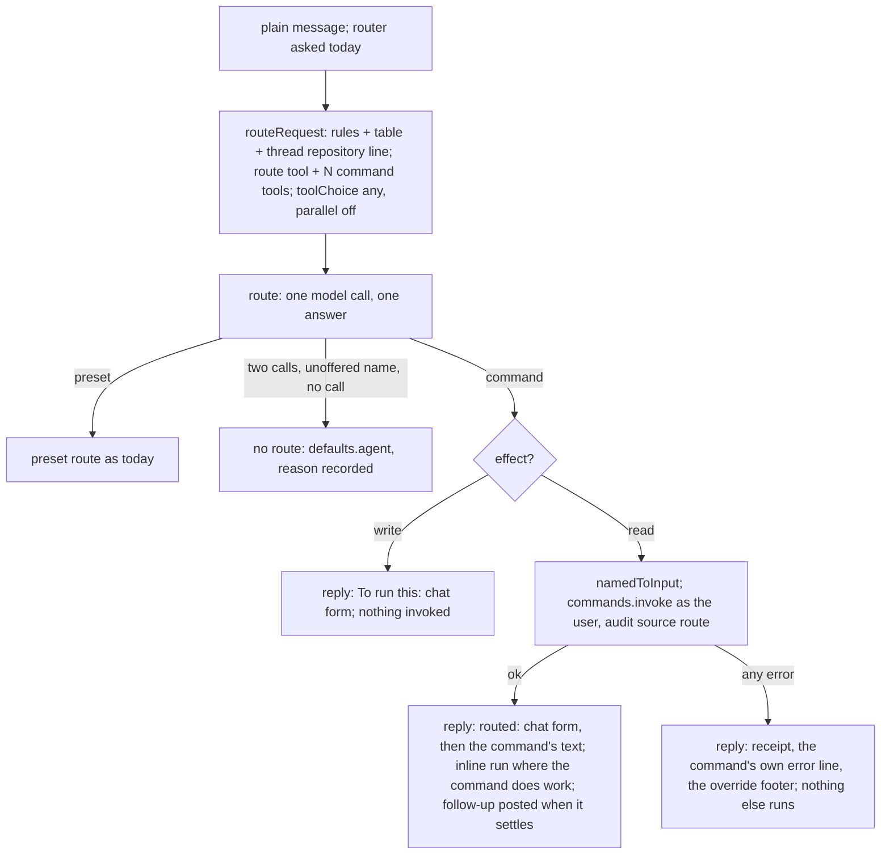

# Commands through the front door - the router offers every chat command as a tool - Plan

## Goal Capsule

- **Objective**: Unit 2 of record 0036, as record 0039 amends it. The route stage's one forced model call offers one tool per chat-exposed command beside the `route` tool, derived from each command's definition; a read command the model picks runs through the registry as the message's user with a receipt line first; a write command is handed back as the exact line to paste; a command that cannot serve replies its own line and the override footer and stops; every offered command carries routing fixtures the conformance suite requires and the replay scores; the two hand-written regexes and their fast path are deleted once the replay shows the door carries their forms. When the last unit merges, "use opus for coding in this channel" answers `To run this: config set channel --models.coding anthropic/claude-opus-5`, "how many runs today" runs `runs list` with its receipt line, and a command added to the registry is routable the day it lands or `verify` fails by name.
- **Authority**: [record 0039](../decisions/0039-the-front-door-writes-nothing-from-prose-and-never-routes-twice.md) (writes handed back by effect, a failed command asks) over [record 0036](../decisions/0036-one-front-door-the-router-offers-every-command-and-ship.md), its commands section; [record 0008](../decisions/0008-one-command-definition-every-surface.md) (one definition, every surface derived); [routing-and-config.md](../reference/specs/routing-and-config.md) items 7, 10 and 21; [command-registry.md](../reference/specs/command-registry.md) items 7, 18, 20, 24 and 25; [load-harness.md](../reference/specs/load-harness.md) item 17; [run-history.md](../reference/specs/run-history.md) item 2. Where a unit and the record disagree, the record wins.
- **Execution profile**: four units, each one pull request through the review loop, in dependency order. Tests first in every unit. Every unit updates the spec rows it changes in the same pull request. The ship plan (`2026-09-15-001`) runs beside this one; its U4 and this plan's U1 to U4 touch the route stage, the replay and the same spec files, so whichever lands second rebases, and the `attach_file` pre-check landing in the route stage separately is a third neighbour of U2.
- **Stop conditions**: a unit that cannot pass `npm run verify` within its listed files hands back a deviation. Nothing here adds a Worker, a binding or a credential. A unit that would let a routed command reach a handler except through `commands.invoke`, invoke an `effect: write` command from the route stage, chain a second model decision after a failed one, or invoke anything from the replay, stops and asks.

---

## Product Contract

### Summary

The router's menu is the preset registry alone; the 29 chat-exposed commands already have a JSON Schema derived from their definitions that the MCP adapter serves as tools, and two hand-written regexes are the only natural-language path to a command. This plan puts those derived tools in the router's menu, runs a chosen command through the same registry path a typed command takes, and fences the fixtures that keep new commands routable.

### Problem Frame

A plain message today can mean a preset and nothing else. A person who wants a channel override types the grammar by hand, and "run the tests on main" reaches a command only because someone wrote a regex for that one sentence. Record 0036 decided the menu, the receipt line and the fixture fence; record 0039 decided that every write is handed back and that a failed command asks instead of being re-routed; this plan builds them.

### Requirements

**The menu and the call**

- R1. The route stage's tool set is the `route` tool plus one tool per command the bound registry lists with `surfaces.chat !== false` and `enabledWhen(caps)` true, in registry order, each named `mcpToolName(id)`, described by the command's `describe`, with `jsonSchemaFor(cmd)` as its input schema. Nothing is listed by hand.
- R2. The model is forced to call one tool of the set (`toolChoice: { type: "any" }`), spelled per API by the provider seam, with parallel calls switched off on the wire. An answer carrying two calls, no call, or a tool outside the set is no route by name, and the request runs on `defaults.agent` with the reason recorded.
- R3. `routing: { answer: text }` offers the presets alone; the command tools ride the tool form only.
- R4. The output cap is derived from the offered tools: per tool, each property's declared `maxLength` where one exists and a named per-value cap otherwise, plus JSON overhead; the largest tool sets the cap, never below the floor.
- R16. The router's user turn carries the repository the thread names, when the thread's user turns name one, as one context line beside the earlier directives, so a command that needs a repository can be bound from a thread that already said which.

**A routed command**

- R5. A command call's input goes through `namedToInput(cmd, input, "camel")` and then the registry's `invoke` as the message's user, authorize before parse, recorded as an inline run under the same rule a typed command meets, with the registry's audit line marked `source: route`; it claims no thread and starts no agent run. The request text the router binds from is `unwrapChatLinks(text)`, the normalisation the typed grammar sees.
- R6. The reply's first line is the receipt: `routed: <chat form of the bound input>`, rendered by the grammar's own spelling from the parsed `{ args, options }`. An inline command run's record carries the same line on its `route` event.
- R17. Every field a routed command adds to a run record (the command, the bound input, the receipt) is published redacted and capped, as `reason` and the compound parts are today; the receipt's cap is named.
- R7. A bound input the registry refuses (`invalid_input` from the parse or the handler) answers the existing usage line; an `unauthorized` answers the existing restricted line; neither starts a model turn.
- R8. The door never chains a second decision. A routed command that answers anything but success (`not_found`, `unavailable`, `conflict`, `busy`, `internal`) replies its own error line under the receipt, then the override footer naming the ways forward (the typed form to correct, `agent:<preset>` to run it another way); no second model call, no agent run. The person's next message is the follow-up, routed fresh.
- R9. A command whose definition says `effect: write` is never run by the door. When the model binds one, the route stage answers `To run this: <chat form>` and invokes nothing; the person pastes the line and the typed grammar runs it, authorized and audited as typed. A command whose definition says `effect: read` runs at once. Nothing is listed by hand: the field every command already carries decides.
- R10. The door opens where the router is asked today and nowhere else: a thread with a live run, a thread whose transcript makes a preset sticky, and a channel or user scope that pins an `agent` do not route, and the typed grammar answers there as it does today.

**The contract**

- R11. `src/load/routeCommandFixtures.ts` holds `{ id, text, threadRepo?, command, input }` rows and `{ id, text, threadRepo?, allow? }` decoys. The replay scores two rows: the command named (bar 100 percent on the checked-in set; a decoy that binds any command not in its `allow` list is a miss) and the bound input equal to the fixture's after the registry's parse (bar 90 percent), every miss printed with both inputs. The replay binds and parses only; it never invokes.
- R12. The conformance suite fails `verify` by name for any command `routableCommands` would offer that has fewer than three fixtures: a happy path with every required argument, a paraphrase, and a decoy that must not bind to it.
- R13. The replay prints, per route call, the mean input tokens, cache-read tokens and cache-write tokens from the provider's usage, and the count of answers refused for carrying two calls, so the static half's cost and its caching are measured.

**The regex path**

- R14. `recognizeOperation`, `answerOperation` and the two regexes are deleted once the replay's command row holds at 100 percent on the `repo_test` and `repo_build` fixtures, including the forms that take the repository from the thread (R16). Their `not_found` and `unavailable` outcomes become the reply of R8: the command's own line (`acme/api is not onboarded, repo onboard acme/api first`) and the footer; nothing runs in a sandbox unless the person says so.

**Specs and docs**

- R15. Each unit changes the spec rows it affects in the same pull request: routing-and-config items 7, 10 and 21; command-registry items 7, 18, 20, 24 and 25; load-harness item 17; run-history item 2; the slack-commands reference's one line on the natural forms.

### Scope Boundaries

- Not here: a message that mixes a command with an ask (compound parts stay read presets only); pronoun asks that need earlier thread turns to bind an argument other than the repository (R16 is the one thread fact the router is handed); a stateful confirmation ("reply yes") for routed writes, since the hand-back's paste is the confirmation and needs no pending state; a per-command opt-in that lets a write run at once from prose, until the first month of hand-backs says which writes deserve it; the ship half of the record (its own plan).
- Not here: filtering the menu by the requester's grants. The record authorizes at invoke; an unauthorized bind answers the restricted line and spends one model call.
- Not here: generalising the `attach_file` token pre-check to command tool names, until the fixture replay says a literal tool name misroutes.
- Deferred to follow-up work: a `routing.model` change if the bars do not hold on the fast model; per-command routing descriptions distinct from `describe`, only if the replay shows a command whose `describe` misleads.

---

## Planning Contract

### Key Technical Decisions

- KTD1. **The menu is a derivation, `routableCommands(catalogue)`.** It takes the registry's `list()` slice (the `ChatCommandCatalog` shape the chat adapter already reads), filters by chat exposure and capability, and renders each command with the three functions the MCP adapter already uses (`mcpToolName`, `describe`, `jsonSchemaFor` in `src/core/commandSurface.ts`). Typed over the slice so the route stage and the replay hand it the same thing. No routing-specific description field is added; a command's `describe` and option descriptions are its routing prompt, the lever record 0026 found for presets. (session-settled: user-directed, chosen over a per-command routing layer: "as we add new commands it should automatically be the case that the puck handles it".) Governs R1.
- KTD2. **One call, `any`, one answer.** `CompletionRequest.toolChoice` gains `{ type: "any" }`; `piStreamOptions` maps it to `"any"` on the Anthropic Messages API and `"required"` on Chat Completions. pi's option types expose no parallel-calls switch on either API, but every pi call takes an `onPayload` hook that sees the wire body; the seam uses it to set `tool_choice.disable_parallel_tool_use: true` on Anthropic and `parallel_tool_calls: false` on Chat Completions, and the seam still refuses an answer with two calls by name, so the contract does not rest on the hook. Governs R2.
- KTD3. **`route()` decides; `routeRequest` acts.** `route()` stays the pure decision function the replay drives with a model and no registry: it builds the tool set, and returns a preset decision as today or a command decision `{ command, input }` (an unoffered name is no route). `routeRequest`, which already has the dispatcher's deps, gains the commands, the channel handle, the run ending and the trace, and does everything with side effects: the hand-back check, `namedToInput`, the invoke through the shared module, the follow-up post, the seal, and the one re-route. `RouteStage` gains `{ kind: "command", … }`, answered in `dispatch()` before the agent gate and before the thread is claimed. (session-settled: user-approved, chosen over a confirmation step for routed writes: "the typed grammar runs writes without confirmation today".) Governs R5, R8, R10.
- KTD4. **The fast path's machinery moves whole.** `runChatCommand`, `runInlineCommandRun`, `isInlineRunCommand`, `resolveRepoForCommand` and `postSettledOutcome` leave `src/core/dispatch/fastPath.ts` for `src/core/dispatch/commandRun.ts`; stage A and the route stage both call them. `runInlineCommandRun` takes an optional `route: RouteDecided` and publishes the `route` event after `run_meta`; stage A passes none. Governs R5, R6.
- KTD5. **The receipt is the grammar's own spelling.** `toChatText`, `toArgv` and `quoteChatToken` move from `src/core/testing/commandConformance.ts` into `src/core/commandSurface.ts` behind `chatInvocation(cmd, input)`: positionals by declared argument name, options flattened to kebab flags with dotted keys, booleans as `--flag`/`--no-flag`, quoting as the tokenizer needs; the conformance helpers import them from there. A receipt always parses back through `parseInvocation` to the same input. Governs R6, R9.
- KTD6. **The hand-back is decided by `effect`, the field every command carries.** `routeRequest` reads `cmd.effect` after the bind and before `invoke`: `write` is handed back, `read` runs. No new flag, no list; a write command added tomorrow is handed back the day it lands. The hand-back is the one routed reply produced without the registry's authorize step, which is safe because it echoes the requester's own words and runs nothing. (session-settled: user-directed, chosen over running routed writes at once with a receipt line and a hand-picked exception list: "we definitely also don't want any command to unintentionally write".) Governs R9.
- KTD7. **A failed command asks; it is never re-routed.** On any outcome but success the stage seals the inline run (the command's `ok` decides its status, as today), replies the receipt, the command's own error line (`chatErrorLine`, which already names the way forward for `not_found` and `unauthorized`) and the override footer, and the dispatch ends. The `route` event carries the one decision and the outcome. A second model call on the back of a failed first one was the fragile part of the regex path's fall-through and is not carried over. (session-settled: user-directed, chosen over one re-route over the preset table: "drop the regex fallthrough entirely, it seems relatively fragile … message the user and ask for follow up input".) Governs R8, R14.
- KTD8. **Redaction is per field at publish time, as today.** The `route` event's `command`, `input` and receipt go through `redactAndCap` like `reason` (`tidyReason`); `ROUTE_RECEIPT_CAP` sits beside `ROUTE_REASON_CAP` and `ROUTE_PART_TEXT_CAP`, sized like R4's cap; `TraceOptions` and `AuditEntry` gain `source?: "route"`, set by the route stage's call and never by stage A. Governs R5, R17.
- KTD9. **The fence lives in the conformance suite; the score in the replay; the replay never invokes.** A registry-driven test enumerates `routableCommands` over the full-capability catalogue and asserts three fixtures per command by kind. `scripts/load.ts` builds the offered set from `registerCoreCommands` over a bare `CommandRegistry` with `ALL_CAPABILITIES`, drives `route()` with it, and scores the input row as `parseInput(cmd, namedToInput(cmd, bound, "camel"))` against `parseInput(cmd, fixture.input)`, both pure; a fixture's `threadRepo` is handed to the router as R16's context line. Usage crosses no route seam: the script wraps the `Provider` it hands `providerRouteModel` in a tallying decorator whose `complete` records each result's `inputTokens`, `cacheReadTokens` and `cacheWriteTokens`, and counts the two-call refusals. The bars are guesses until the first replay; the lever is `routing.model`. Governs R11, R12, R13.
- KTD10. **The thread's repository is one context line, from the thread's own text.** `repoFromThread(history)`, the pure read the regex path uses today, supplies it: no network, no resident vet, so the router pays nothing new; the bound slug still meets the command's own schema and the per-repository gate at invoke. (session-settled: user-directed, "people will assume the thread just works with whatever the attached context is"; chosen over retiring the no-repository form of the natural ops with the regex.) Governs R16.
- KTD11. **Text mode stays presets-only.** `routing: { answer: text }` builds today's prompt with no command tools, since a text answer cannot bind arguments under a schema. Governs R3.

### High-Level Technical Design

### Sequencing

U1 first: the seam must take `any` before the menu can be offered. U2 builds the menu and the command branch on it with a first fixture per command, so its own tests have inputs. U3 completes the fixtures, adds the fence and the replay rows, and measures the cost and the caching. U4 deletes the regex path last, gated on the U3 replay's command row holding at 100 percent for the `repo_test` and `repo_build` fixtures, posted on the tracker.

### Risks and Dependencies

- **The fast model may not bind arguments at the bars.** 30 tools and about 8k static tokens is more than the router carries today; the replay on the checked-in set is the first evidence, and `routing.model` is the lever. U3 prints every miss so a wording fix targets the `describe` that misled.
- **A question about a command may be bound as a call.** "what does config set do?" could call `config_set` with nothing bound; the registry answers `invalid_input`, the decoys count any command bind as a miss, and nothing runs on a bad bind.
- **A hand-back costs one paste on every routed write.** "use opus for coding in this channel" answers the line to paste instead of applying it. The trade is deliberate: no write from prose, ever, at the price of one message; the first month of hand-backs says whether any write deserves a per-command opt-in, named in Scope Boundaries as not here.
- **A failed read stops.** A routed `runs list` in a channel the requester may not see answers the restricted line and the footer; nothing tries a preset on the requester's behalf. That is the point: the person decides the next step, not a second model call.
- **Two plain messages in one idle thread run their commands unserialized.** As two typed commands would; a routed command claims no thread by design (KTD3).
- **A bot death mid-command loses the reply.** A routed command reserves no ledger row, as a typed one does not; nothing replays and the person asks again.
- **The regex deletion adds a model turn to "run the tests on main".** About a second on the fast model where the regex answered at once; the thread-repository form is kept by KTD10, and a repository with no resident now gets the command's own "not onboarded" line with the footer instead of a silent sandbox run.
- **Routed-command accuracy is not measurable from production history.** A routed command that records no run leaves no record, and the replay skips every record with a `route` event, so the checked-in fixtures are the evidence; the record accepted the no-record shape.
- **Depends on** record 0036 `accepted`, pi's model library exposing `"any"`, `"required"` and the `onPayload` hook (verified in its types), and the pi path reporting usage on every call (verified in `fromPiMessage`).

---

## Implementation Units

### U1. The seam takes `any`

- **Goal**: The provider seam can force the model to call one tool of many with parallel calls off on the wire, the router's output cap is derived from the offered tools, and an answer with two calls is refused by name.
- **Requirements**: R2, R4, R15 (routing-and-config item 21, the call).
- **Dependencies**: none.
- **Files**: `src/core/provider.ts` (`toolChoice: { type: "tool"; name } | { type: "any" }`); `src/core/harness/piAi.ts` (`piStreamOptions` maps `any` to `"any"` and `"required"`; an `onPayload` hook sets `tool_choice.disable_parallel_tool_use: true` on `anthropic-messages` and `parallel_tool_calls: false` on `openai-completions` when the choice is `any`); `src/core/dispatch/route.ts` (`RouteModel` returns `{ tool, input }` or text; `providerRouteModel` returns the one call and refuses two; `routeMaxOutputTokens(offer, tools)` with `ROUTE_COMMAND_VALUE_CAP`); `src/core/harness/piAi.test.ts`; `src/core/dispatch/route.test.ts`; `src/core/dispatcher.test.ts` (the scripted route models adapt to the seam's new return); `docs/reference/specs/routing-and-config.md`.
- **Approach**:
  1. Tests first, red against today: `piStreamOptions` with `{ type: "any" }` yields `toolChoice: "any"` on `anthropic-messages` and `"required"` on `openai-completions`; the payload pi sends carries `disable_parallel_tool_use: true` and `parallel_tool_calls: false` respectively, and carries `cache_control` on the system block and the last tool for a router call; a scripted completion with two `tool_use` parts is refused as no route naming the count; the cap grows with a tool that has more or larger fields and holds the floor.
  2. Widen the type and the mapping; keep the forced single tool as it is; add the `onPayload` hook for the `any` case only.
  3. In the seam, return the single call's name and input (or the text, for `answer: text`); throw by name on two; keep the `max_tokens` refusal. A test helper wraps the ~28 scripted string models so the dispatcher tests keep their shape.
  4. Derive the cap per R4 with `ROUTE_COMMAND_VALUE_CAP` beside the other caps.
  5. Spec row: item 21's "the answer is a tool call" paragraph names `any`, the parallel switch on the wire and the two-call refusal.
- **Patterns to follow**: the existing `toolChoice` mapping and `cacheRetention` in `piStreamOptions`; the `max_tokens` refusal in `providerRouteModel`; `routeMaxOutputTokens`'s overhead constants.
- **Test scenarios**:
  - `piAi.test.ts`: the two API spellings of `any`; the forced single tool unchanged; the payload hook sets the parallel flag per API; the payload carries `cache_control` on the system block and the last tool.
  - `route.test.ts`: two calls refused by name; one call returned with its name and input; text mode returns the text; the cap grows with field count and declared `maxLength`, uses the value cap where none is declared, and never drops below the floor.
- **Verification**: the test files green, red first; `npm run specs:check`; `npm run verify`.

### U2. The menu, the command branch, the receipt and the hand-back

- **Goal**: The route stage offers the derived command tools with the thread's repository as context, hands every `effect: write` command back as the line to paste, runs every `effect: read` command through the registry as the message's user with the receipt line first, posts a settle follow-up, and on any failure replies the command's own line and the override footer and stops; every record field it adds is redacted and capped.
- **Requirements**: R1, R3, R5, R6, R7, R8, R9, R10, R16, R17, R15 (routing-and-config items 10 and 21, command-registry items 7, 18 and 20, run-history item 2).
- **Dependencies**: U1.
- **Files**: `src/core/dispatch/route.ts` (`routableCommands`, the tool set, the command decision in `route()`, `RouteStage` `command` kind, the command branch of `routeRequest` with the hand-back by effect, the invoke, the follow-up, the failure reply, the thread-repository line, `unwrapChatLinks` on the text, `ROUTE_RECEIPT_CAP`, the redacted `route` event); `src/core/dispatch/commandRun.ts` (new: the five functions moved from the fast path; `runInlineCommandRun` takes an optional `route`); `src/core/dispatch/fastPath.ts` (imports them); `src/core/dispatcher.ts` (hands the route stage the channel handle, the ending, the trace and the commands; answers the `command` kind before the agent gate); `src/core/commandRegistry.ts` (`TraceOptions.source` and `AuditEntry.source`); `src/core/commandSurface.ts` (`chatInvocation(cmd, input)` from the promoted `toChatText`, `toArgv` and `quoteChatToken`); `src/core/testing/commandConformance.ts` (imports them from the surface); `src/core/statusCardFrame.ts` (the footer's words reused for a command reply); `src/core/runEvents.ts` (the `route` event carries `command`, `input`, `receipt` and the outcome); `src/load/routeCommandFixtures.ts` (new: one happy path per offered command, the seed U3 completes); `src/core/dispatch/route.test.ts`; `src/core/dispatch/commandRun.test.ts`; `src/core/dispatcher.test.ts`; `src/core/commandSurface.test.ts`; `src/core/commandRegistry.test.ts`; `docs/reference/specs/routing-and-config.md`; `docs/reference/specs/command-registry.md`; `docs/reference/specs/run-history.md`.
- **Approach**:
  1. Tests first, red against today: `routableCommands` over the full catalogue lists 29 tools and over the empty capabilities 12, each with the MCP name, description and schema; `route()` with a scripted `config_set` call returns a command decision with its input and no side effect; `routeRequest` binds `{ scope: "channel", models: { coding: "anthropic/claude-opus-5" } }`, invokes as the message's user with `source: route` on the audit line, and the reply's first line is `routed: config set channel --models.coding anthropic/claude-opus-5`; a wrapped Slack link binds to a bare URL; a call to an unoffered name is no route; every `effect: write` def in the full catalogue answers `To run this: <chat form>` and invokes nothing, enumerated, and every `effect: read` def invokes; a `repo_test` call whose handler answers `not_found` leaves one sealed `failed` command record and one reply carrying the receipt, the command's "not onboarded" line and the override footer, with no second model call; a bound input carrying a token-shaped string is redacted on the `route` event and the receipt is cut at its cap; a thread naming a repository puts it in the router's user turn and a `repo_test` call binds it; a live thread, a sticky thread and a pinned scope are not routed; `chatInvocation` round-trips every conformance variant through `parseInvocation`.
  2. Move the five functions to `commandRun.ts` with no behaviour change beyond the optional `route` on `runInlineCommandRun`; the fast path imports them.
  3. Promote the three spelling helpers into `commandSurface.ts` as `chatInvocation`; the conformance helpers import them from there.
  4. Add `source` to `TraceOptions` and `AuditEntry`, copied by `invoke`. No new field on `CommandDef`: `effect` decides the hand-back.
  5. In `route()`, build the tool set (KTD1) unless `answer: text`, add the thread-repository line to the user turn when `repoFromThread(history)` names one, and return a command decision for an offered command call; unoffered is no route.
  6. In `routeRequest`, on a command decision: `effect: write` answers `To run this: <chat form>` and returns; otherwise `namedToInput` on `unwrapChatLinks(text)`'s bind, then `runChatCommand` as the message's user with `source: route`; on success the receipt line, the command's text, and the follow-up posted through `postSettledOutcome` when the result settles; on any error the receipt line, the command's own error line (`chatErrorLine`) and the override footer, and the dispatch ends (KTD7); publish the `route` event through `redactAndCap` with `ROUTE_RECEIPT_CAP`, carrying the outcome.
  7. In `dispatch()`, hand the stage the channel handle, the ending, the trace and the commands, and answer the `command` kind where the routed preset is resolved today: reply, return; no card, no thread claim.
  8. Spec rows: item 21 (the menu, the thread-repository line, the command branch, the receipt, the hand-back by effect, the failure reply, the redaction and the audit mark), item 10 (stage A stays the exact grammar; the door is the natural-language path), command-registry item 7 (the audit line's `source`), item 18 (a second path to a command, through the door, with the same `invoke`; every write handed back), run-history item 2 (the `route` event's command shape and outcome).
- **Execution note**: keep the preset path's tests green throughout; add the command decision beside it in `route()` first, then the branch in `routeRequest`.
- **Patterns to follow**: `routeTool`, `parseRouteAnswer` and `tidyReason` in `src/core/dispatch/route.ts`; `invokeChatCommand`, `chatErrorLine` and `unwrapChatLinks` in `src/core/commandChat.ts`; `ROUTED_CARD_FOOTER` in `src/core/statusCardFrame.ts`; the `attach_file` pre-check landing in the same stage; the MCP adapter's tool listing in `src/channels/mcp.ts`.
- **Test scenarios**:
  - `route.test.ts`: the tool set equals `routableCommands` for full and empty capabilities; a hidden command is absent; `answer: text` offers no command tools; `route()` returns a command decision without invoking; an unoffered name is no route; the thread-repository line appears only when the thread names one; the cap covers the offered set.
  - `commandRun.test.ts`: the moved machinery records an inline run for `repo.test` and none for `config.set`, exactly as the fast path did; a `route` passed in is published after `run_meta`, redacted and capped; a failed command leaves one sealed `failed` command record.
  - `commandSurface.test.ts`: `chatInvocation` round-trips every conformance variant and a nested `models.coding` option through `parseInvocation`.
  - `commandRegistry.test.ts`: the audit entry carries `source: route` when the call sets it and none otherwise.
  - `dispatcher.test.ts`: "use opus for coding in this channel" with a scripted `config_set` call answers `To run this: config set channel --models.coding anthropic/claude-opus-5`, writes nothing, claims no thread and starts no run; "how many runs today" with a scripted `runs_list` call runs it and replies with the receipt line first; a wrapped Slack link in an `mcp_add` call binds bare and is handed back; every `effect: write` def in the catalogue is handed back and nothing is invoked; a scripted `repo_test` `not_found` seals the command run and replies the receipt, the "not onboarded" line and the footer with one model call in total; the same message in a live thread, a sticky thread and a pinned channel is not routed; the typed `config set channel …` still answers inline with no model call.
- **Verification**: the five test files green, red first; `npm run specs:check`; `npm run verify`.

### U3. The fixtures, the fence, the replay rows and the cost

- **Goal**: Every offered command has three routing fixtures or `verify` fails by name; the replay scores the command named and the bound input on two rows with their bars, binds and parses without invoking, and prints the cost and caching counters and the two-call refusals.
- **Requirements**: R11, R12, R13, R15 (command-registry item 25, load-harness item 17).
- **Dependencies**: U2.
- **Files**: `src/load/routeCommandFixtures.ts` (three per command: happy path, paraphrase, decoy; `threadRepo` on the forms that take the repository from the thread); `src/load/routeReplay.ts` (`replayCommands`, `commandScore` with the any-command decoy rule, two check rows); `scripts/load.ts` (the bare `CommandRegistry` over `ALL_CAPABILITIES`, the tallying `Provider` decorator, the counters line, the two-call count); `src/core/commandConformance.test.ts` (the fence); `src/core/testing/commandConformance.ts` (a `fixturesFor(cmd)` reader); `src/load/routeReplay.test.ts`; `docs/reference/specs/command-registry.md`; `docs/reference/specs/load-harness.md`.
- **Approach**:
  1. Tests first, red against today: the fence fails naming a command with two fixtures; `commandScore` counts a wrong command as a miss, a decoy bound to any command outside its `allow` list as a miss, and a right command with a wrong post-parse input as an input miss; the counters line sums `inputTokens`, `cacheReadTokens` and `cacheWriteTokens` over the calls and counts two-call refusals.
  2. Write the fixtures: for each of the 29 commands a happy path with every required argument bound as a person would say it, a paraphrase, and a decoy that names the command's subject without asking for it; the `repo_test` and `repo_build` sets include a `threadRepo` form.
  3. In `scripts/load.ts`, build the offered set from `registerCoreCommands` over a `CommandRegistry` with `ALL_CAPABILITIES`; wrap the provider in the tallying decorator; drive `route()` with the set and each fixture's `threadRepo`; compare inputs with `parseInput` on both sides; never invoke.
  4. Add `replayCommands` and its two rows to `routeChecks` with bars 1.0 and 0.9; print every miss with the bound and expected inputs; print the mean of each counter and the two-call count.
  5. Add the fence to the conformance suite over `routableCommands` of the full-capability catalogue.
  6. Spec rows: command-registry item 25 (the fence), load-harness item 17 (the two rows, the counters line, the parse-only rule).
- **Execution note**: run `npm run load -- route` locally on the checked-in sets after the fixtures land; the production-history replay is the maintainer's and is the receipt for R11 and R13.
- **Patterns to follow**: `replayImperative` and `imperativeScore` in `src/load/routeReplay.ts`; the fixture shapes in `src/load/routeImperativeFixtures.ts`; the catalogue fences in `src/core/commandConformance.test.ts`; the provider construction in `scripts/load.ts`.
- **Test scenarios**:
  - `commandConformance.test.ts`: every offered command has its three fixture kinds; a command missing one fails naming it and the kind; a fixture naming an unregistered command fails.
  - `routeReplay.test.ts`: the command row passes at 100 percent and fails on one wrong command; a decoy bound to any command is a miss unless allowed; the input row compares after `parseInput`, so a coerced number equals its string; a `threadRepo` reaches the router's user turn; the counters line reads all three usage fields and the refusal count; nothing is invoked (a registry spy sees no call).
- **Verification**: both test files green, red first; `npm run load -- route` on the checked-in sets prints the two rows and the counters line with nonzero cache reads from the second call on; `npm run specs:check`; `npm run verify`.

### U4. The regex path retires

- **Goal**: The two hand-written recognizers and their fast path are gone; "run the tests on main in acme/api" and "run the tests on main" in a thread that names the repository reach `repo_test` through the door, and a repository with no resident gets the command's own "not onboarded" line with the footer.
- **Requirements**: R14, R15 (routing-and-config items 7 and 10, command-registry item 24, the slack-commands line).
- **Dependencies**: U3, and the U3 replay's command row at 100 percent on the `repo_test` and `repo_build` fixtures, posted on the tracker.
- **Files**: `src/core/operations.ts` (`recognizeOperation`, `NL_TEST_RE`, `NL_BUILD_RE` removed; the `Operations` seam stays); `src/core/dispatch/fastPath.ts` (`answerOperation` removed); `src/core/dispatcher.ts` (the call removed); `src/core/commandChat.ts` (the header comment); `src/core/operations.test.ts`; `src/core/dispatch/fastPath.test.ts`; `src/core/dispatcher.test.ts`; `docs/reference/specs/routing-and-config.md`; `docs/reference/specs/command-registry.md`; `docs/reference/slack-commands.md`.
- **Approach**:
  1. Tests first: the dispatcher tests that today assert the regex path answers the natural forms with zero model calls become: the door's scripted `repo_test` call answers them with one model call and the receipt line, the thread-repository form included, and a `not_found` answer replies the command's line and the footer with no second call; the `recognizeOperation` tests are deleted with the function.
  2. Delete the recognizer, the fast path function and the dispatcher call; the `Operations` seam and `repo.test|build` are untouched.
  3. Spec rows: item 7 (the natural forms reach the command through the door with the thread's repository as context; a repository with no resident answers the command's line and the footer), item 10 (stage B is gone; the door is the natural-language path), command-registry item 24 (the natural forms sentence), slack-commands line 138 (a plain sentence routes to the command with a receipt line).
- **Patterns to follow**: the deletion of the native tool table in the pi series pull requests: delete the code and its tests together, and the spec row in the same commit.
- **Test scenarios**:
  - `dispatcher.test.ts`: "run the tests on main in acme/api" reaches `repo_test` through the door with the receipt line; "run the tests on main" in a thread that names the repository binds that repository; a `not_found` answer replies the "not onboarded" line and the footer and starts nothing; the typed `repo test acme/api main` still answers inline with no model call.
  - `fastPath.test.ts`: stage A is the only fast path; no natural form is recognized without the model.
- **Verification**: the test files green; `grep -rn "recognizeOperation\|answerOperation\|NL_TEST_RE\|NL_BUILD_RE" src` returns nothing; `npm run specs:check`; `npm run docs:check`; `npm run verify`.

---

## Verification Contract

| Proof | Command or procedure | Units |
|---|---|---|
| Unit tests red then green, per unit | `npx vitest run <the unit's test files>` | U1 to U4 |
| Spec bindings resolve, coverage holds | `npm run specs:check` | U1 to U4 |
| Generated docs match | `npm run docs:check` | U4 |
| The whole gate, including the fixture fence | `npm run verify` | U1 to U4 |
| The regex path is gone | `grep -rn "recognizeOperation\|answerOperation\|NL_TEST_RE\|NL_BUILD_RE" src` returns nothing | U4 |
| Replay: the command rows, the counters and the caching | `npm run load -- route --since <date> --limit 300 --provider anthropic --model <fast model>`, run by the maintainer: command named 100 percent, bound input at or above 90 percent on the checked-in set, mean input, cache-read and cache-write tokens per call printed with cache reads nonzero from the second call on, and the two-call refusal count | U3 |
| Live, human-gated: a routed write is handed back | A new top-level message in a channel with no `agent` scope: "use opus for coding in this channel". Expect one reply `To run this: config set channel --models.coding anthropic/claude-opus-5`, nothing changed in `config show`, no card and no run; paste the line and the override lands | U2 |
| Live, human-gated: a routed read runs | "how many runs finished today". Expect one reply whose first line is `routed: runs list --status finished …` followed by the listing, no card and no agent run | U2 |
| Live, human-gated: the natural op form through the door | "run the tests on main in <an onboarded repo>", then "run the tests on main" as a reply in a thread that named that repository. Expect the receipt line `routed: repo test <repo> main` and the op's result both times; the same first message in a repository with no resident answers the receipt, "`<repo>` is not onboarded, `repo onboard <repo>` first" and the override footer, and nothing runs | U4 |

---

## Definition of Done

- U1 to U4 merged on `main` in order, each through the review loop with its spec rows in the same pull request; U4 only after the U3 replay row it depends on is posted.
- The three live receipts and the replay report posted on record 0036's tracker issue.
- Every command `routableCommands` offers has three fixtures; the fence is live in `verify`.
- No routed command reaches a handler except through `commands.invoke`; no `effect: write` command is ever invoked by the route stage; no routed command is followed by a second model decision; the replay invokes nothing; no regex recognizer remains.
- Abandoned attempts and scaffolding the final shape does not need are removed before the last unit merges.

---

## Open Questions

| Question | Owner | Resolves it | Blocking |
|---|---|---|---|
| Do the bars (100 percent on the command, 90 on the input) hold on the fast model with 30 tools? | the maintainer | two replay runs on the fixture set after U3 | deferred; the lever is `routing.model` |
| After a month of hand-backs, do any writes deserve a per-command opt-in to run at once from prose (`config.set` is the candidate)? Decided as none for now | the maintainer | the count of routed write hand-backs by command, read from the `route` events | deferred |
