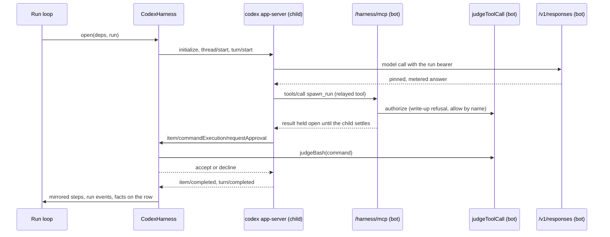
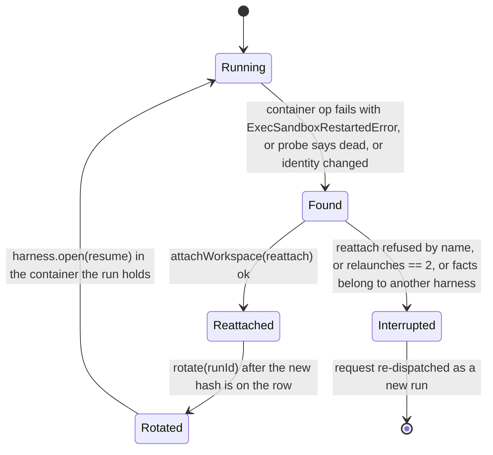

# Harness contract stage A, the seam, the conformance suite and the real Codex proof - Plan

## Goal Capsule

- **Objective:** carve the six-clause harness contract of record 0038 out of the pi harness as a typed seam, hold pi to it with one conformance table, and prove the contract against the real Codex binary with the two bot-side pieces that proof needs (a Responses route at the model proxy, an MCP relay endpoint), shipping nothing to users.
- **Scheduling:** not scheduled. The maintainer deferred stage A on 2026-09-15 after the design review: the record's purpose, pressure-testing that Switchboard is not locked to pi and that the seam is sound, was served by the research this plan records. The plan keeps the shape for later; the deferral and the facts that must stay true are recorded in record 0038's third amendment.
- **Authority:** record 0038 (its body as overridden by its appended amendments) governs product behaviour; this plan governs how it is built; the living specs `harness-pi.md`, `model-proxy.md`, `mcp-tools.md`, `load-harness.md` and the new `harness.md` bind every behaviour change in the same PR as its code.
- **Stop conditions:** a clause that only pi's in-process hook can satisfy (the clause is pi-shaped; stop and amend the record); the Codex sandbox cannot start on the test host and no preflight can prove it (the Codex rows are not run, never faked); the mid-run workspace re-attach spike fails (the relaunch ceiling shrinks to the settle-and-close floor); an invalidating finding against a settled decision.
- **Execution profile:** one unit landed as a `gh stack` series in the order of the Implementation Units, each PR green and reviewed; the seam and pi's rows first, Codex last, the relaunch ceiling after Codex.
- **Tail ownership:** the implementer runs the PR loop per the repository's rules; live receipts (the OpenRouter row, the resident-roll relaunch) are posted on the tracker's receipts issue, not in the plan.

---

## Product Contract

### Summary

Record 0038 says a harness owes the bot six things: credential, gate, relay, record, conversation, survival. pi is the one implementation and the seam is, after the native loop's deletion at `146f9287`, one hand-built call. Stage A makes the seam a type, holds pi to it with a scenario table, and runs the same table against the real `codex app-server` binary driven by a `CodexHarness`, with a scripted Responses-API model or OpenRouter behind the proxy. The proof needs a `/v1/responses` route at the model proxy and an MCP streamable-HTTP relay endpoint, so both are in scope; Codex in an image or on a preset is not.

Product Contract preservation: unchanged. The record's clauses, its stage gates and its validation rows are carried as written; where the flow analysis found the record's wording cannot hold (the harness "counts its own turns"; the record's "another container" trigger on a shared kernel), the plan records the evidence under Key Technical Decisions for a later amendment and does not rewrite the record.

### Problem Frame

After `146f9287` every preset runs on pi and nothing in the tree says what a harness owes: the run loop hands twenty-one fields to `runPiHarnessOpen`, the container seam is named `PiContainer` and is pi-shaped beneath the name, the row's facts parse as pi's or as nothing, and the proxy binds each route to one provider type. The row's facts changed four times in two days with no sentence to check the changes against. A second implementation that differs from pi on every clause is the only way to tell a clause from an accident of pi, and a fake of its protocol would prove only our reading of its documentation.

### Requirements

**The seam**

- R1. A `Harness` interface with a `HarnessFacts` row type exists in `src/core/harness/contract.ts`; `PiHarness` implements it over the code that exists; the run loop calls the harness object handed in through `deps.harness` and compares no string.
- R2. `PiContainer` is renamed `HarnessContainer`, and `start` takes the binary, its arguments, the stdout filter and the run directory layout as inputs, so a second harness can use the seam without a second container implementation.
- R3. A row's facts are read by the harness the row names; a row written before the discriminator existed is read as pi's; facts of another harness are refused, and the run closes `interrupted`.

**The conformance suite**

- R4. One scenario table, whose rows are record 0038's validation criteria plus the parity rows in this plan, runs against pi (through the existing fake container and scripted provider) and against Codex (through the real binary).
- R5. A row Codex cannot pass is a named failure the table asserts, never a skip and never a pass.
- R6. Removing one clause's behaviour from `CodexHarness` fails the suite, once per clause.

**The relay over MCP**

- R7. `/harness/mcp` serves the run's relayed tools over MCP streamable HTTP behind the run bearer: `tools/list` equals `GET /harness/tools` field for field for every toolset; `tools/call` admits, decides (including the write-up refusal), joins and runs the call exactly as `POST /harness/tool` does.
- R8. A relayed call that outlives one request is held open with keepalives; a client's `notifications/cancelled` aborts that call; a second `spawn_run` naming the same child while the first still runs is refused by name; a tool never runs twice for one model decision.

**The Responses route**

- R9. `POST /v1/responses` on the model proxy pins `model` and `max_output_tokens`, deletes a stray `max_tokens` or `max_completion_tokens`, strips `store` and `previous_response_id`, forwards to the provider table's upstream and meters usage once, on the terminal event of a stream or on the buffered body, with `response.failed` ending the span in error.
- R10. A provider type serves a set of wires; `openai-compatible` serves chat completions and Responses, `anthropic` serves messages; a harness whose wire the run's provider does not serve is refused by name before it starts.

**Codex**

- R11. `CodexHarness` drives `@openai/codex@0.154.0` as a child process from a per-run `CODEX_HOME` holding `config.toml` (the bot's proxy as the only model provider with the run bearer as its key, the relay as the only MCP server, `sandbox_mode = "read-only"`, granular approvals, `web_search = "disabled"`); the child's environment carries no provider key.
- R12. Every server-to-client request is answered: command and file-change approvals from `judgeToolCall` with `accept` or `decline`, permissions and elicitations refused, unknown methods with a JSON-RPC error.
- R13. Codex's items map onto the record's vocabulary in pi's tool words, mirrored per item into ledger steps so `planResume` and the friction analyzer read a Codex run as they read a pi run.
- R14. Before any Codex row runs, a preflight proves the sandbox started (a write inside `read-only` is denied); a host where it cannot start fails the Codex rows by name.
- R15. Codex under identity `none` is refused before it spawns, with the reason that its shell cannot be disabled.

**Survival**

- R16. A container replaced under a living bot relaunches the harness from the record in the container the run holds, with the workspace re-attached or refused by name, the bearer rotated, and at most two relaunches; the third finding closes the run `interrupted` and re-dispatches the request.

### Acceptance Examples

- AE1. **Covers R8.** Given a conductor run on Codex and a `spawn_run` held past Codex's tool timeout, when Codex's client abandons the request and the model re-issues the call, then exactly one child exists, the second call answers "already running as call <id>", and the record holds one `tool_call` and one `tool_result`.
- AE2. **Covers R5, R12.** Given a scripted model that issues `stat README` under `sandbox_mode = "read-only"` with no `.rules` prefix naming `stat`, when the command completes with no approval request, then the run fails closed with `GateBypassed` naming `stat`, and the table's row asserts that exact failure.
- AE3. **Covers R9.** Given a streamed Responses answer ending in `response.completed` with a `function_call` output item, when the proxy forwards it, then usage is read once from that event, the span's stop reason is `tool_use` and the span ends ok; given `response.failed`, the span ends in error.
- AE4. **Covers R16.** Given a pi run on the resident whose container is replaced mid tool call, when the next container command fails with `ExecSandboxRestartedError`, then nothing is killed or removed in the new container, the workspace is re-attached, the bearer is rotated with the old hash refused at the proxy and the door, pi is relaunched on the ledger's transcript, and the record shows one `resumed` note and `relaunches = 1` on the row.

### Scope Boundaries

- No Codex in any container image (`src/deploy/imagePins.test.ts` and `imagePiHarness.test.ts` refuse it); no preset runs on Codex; production configuration does not change.
- Hosted coding agents (Devin, Codex Cloud, Copilot's coding agent, Jules, Cursor's background agents) are not harnesses: they hold their own keys, run tools with no per-call ask, keep their own transcript. They belong to a future remote executor class at the spawn seam, observed through their API and through GitHub as the shared record. Nothing here reaches for them.
- External MCP servers are never configured in Codex directly; their tools reach Codex only through the bot's relay, so credentials and the per-run call cap stay in the bot.
- **Deferred to follow-up work:** an MCP analogue of `202 pending` (resumable streams) if the held stream fails its p99 in practice; a reason-carrying decline for Codex if `turn/steer` after a decline proves insufficient; Codex on a preset with a real model behind the proxy (record 0038's stage B, a new record).

### Dependencies

- Record 0038 stage gates (its "Stage gates and the review each must survive" table) gate each unit below.
- The #1219 floor (settle the call, close `interrupted`, re-dispatch), landing from the orchestration-primitives session on a branch off `146f9287`; U9 rebases on it.
- `@openai/codex@0.154.0` on npm with `optionalDependencies` per platform and no postinstall (verified 2026-09-15).

---

## Planning Contract

### Key Technical Decisions

- KTD1. **The harness is an object handed in, never a word compared.** `deps.harness` gains the `Harness` instance (`PiHarness` in production); `runLoop.ts` calls `harness.open(...)` and reads `harness.find(facts, container)`. `src/core/harness/oneHarness.test.ts`, which asserts `runPiHarnessOpen(` and forbids a string compare, is re-pointed in the same PR. (session-settled: user-directed — chosen over a `harness:` word in the registry: record 0032 retired the word with the native loop.)
- KTD2. **The second implementation is the real binary.** `CodexHarness` drives `@openai/codex@0.154.0` as a pinned devDependency, the shape E used for pi, so `node_modules/.bin/codex` is on the test PATH; `check:lockfile`'s `REQUIRED_VARIANTS` gains `"@openai/codex-": ["linux-x64", "darwin-arm64"]` so a laptop refresh cannot drop the Linux binary. (session-settled: user-directed — chosen over a fake of Codex's protocol: a fake proves our reading of the documentation, the binary proves Codex.)
- KTD3. **OpenRouter is the Responses route's first upstream, a pass-through.** The route forwards to the provider table's upstream for the run's model; OpenRouter serves the Responses dialect at `/api/v1/responses`, rejecting `store: true` and a non-null `previous_response_id` with 400, so the pin strips both. (session-settled: user-directed — chosen over waiting for a separate OpenRouter unit: none exists beyond the documented example.)
- KTD4. **Nothing enters an image.** The binary lives in devDependencies and on developer machines. (session-settled: user-directed — chosen over building Codex for real now: "don't build too much too early".)
- KTD5. **Per-run `CODEX_HOME`, never per-thread config.** Provider and MCP wiring go into `CODEX_HOME/config.toml` written per run, because openai/codex#45361 (open at 0.154.0) hangs the next turn after any per-thread `config` override on `thread/start`. The environment handed to the child carries no `OPENAI_API_KEY` or `CODEX_API_KEY`, and `requires_openai_auth = false` keeps the login out; a smoke test confirms the headless start.
- KTD6. **The bot emits the relayed tool's `tool_call` and `tool_result`.** Under MCP the request carries a JSON-RPC id and Codex's `mcpToolCall` item carries another; rather than correlate them, the relay handler emits the pair at `tools/call` and the disposition table files `mcpToolCall` as `structure`. Bypass detection for relayed calls is then trivial: every one passed the door.
- KTD7. **Codex's items are filed in pi's tool words.** `commandExecution` becomes `tool: "bash"` with `summary: "$ <cmd>"`, `command` and `exitCode`; `fileChange` becomes `edit` or `write`; `reasoning` is dropped as pi's thinking is; `contextCompaction` is a compaction row even with an empty summary. Consumers (`runFriction.ts`, `resumeLaunch.ts`'s `knownToolsFor`, the run page) keep one vocabulary.
- KTD8. **A per-item mirror, not a turn assembler.** On `item/started` for a tool-bearing item the Codex bridge reports the assistant turn so far with that `tool_use` (id = item id) in flight; on `item/completed` it queues the `tool_result`. `planResume` requires the last step's in-flight ids to equal the last assistant turn's `tool_use` ids, so a turn-end assembler would leave a death mid-turn unrecorded.
- KTD9. **The gate for Codex's own tools rides the approval requests, with one rule for every command if Codex allows it.** `sandbox_mode = "read-only"` raises `item/commandExecution/requestApproval` for every write and network call and `item/fileChange/requestApproval` for every edit; `judgeBash` and `judgePath` answer `accept` or `decline`, never `acceptForSession`. The first thing U7 verifies is whether Codex issues commands as `["bash", "-lc", <cmd>]`: if so, one `prefix_rule(pattern = ["bash", "-lc"], decision = "prompt")` makes every shell command ask, and the record's read-only cannot disappears; otherwise a checked-in `.rules` fixture names the read prefixes and the long tail fails closed by the record's rule.
- KTD10. **Every Codex question is answered.** `mcpServer/elicitation/request` never times out; permissions and skill approvals are refused even though configuration turns them off; an unknown request method gets a JSON-RPC error; `mcp_servers.switchboard.default_tools_approval_mode = "auto"` is set explicitly so no relayed call raises an approval nobody answers.
- KTD11. **A sandbox preflight guards the Codex rows.** Codex's Linux sandbox is bubblewrap over unprivileged user namespaces, which default Docker and Ubuntu 24.04 AppArmor block; whether it then fails or silently runs unsandboxed is unverified. Before the Codex rows, one scripted write turn under `read-only` must be denied, else the rows fail with "sandbox unavailable on <platform>"; `features.use_legacy_landlock = true` is the likely runner answer and is verified, never assumed.
- KTD12. **The relay holds a long call open and honours cancellation.** MCP has no re-ask by id; the response stream stays open with SSE comment keepalives (progress notifications only when the request carried a progress token), `mcp_servers.switchboard.tool_timeout_sec` is set at or above the preset's wall clock, `notifications/cancelled` aborts the call through a per-call `AbortController`, and a second `spawn_run` for the same child while the first runs is refused by name.
- KTD13. **The proxy's route shape decouples from the provider type.** `ProxyShape = ProviderConfig["type"]` becomes a `wire` a provider type serves (`openai-compatible`: chat completions and Responses; `anthropic`: messages); `upstreamFor`, `handleAdmitted`'s `wrong_shape`, `adminModelProxy`'s probe path and `model-proxy.md` item 1 follow; `Harness.wire ∩ wiresOf(provider.type) = ∅` refuses a harness before it starts (record row 8).
- KTD14. **The Responses meter reads terminal events only.** `usageFromResponses` beside the two existing readers; a third `SseMeter` branch reading `response.completed`, `response.incomplete` and `response.failed`; stop reason from `incomplete_details.reason` (`max_output_tokens` → `max_tokens`) or a `function_call` in the output (→ `tool_use`); the buffered branch picks the reader by wire, not by provider type.
- KTD15. **The turn count is the proxy's.** Codex's own compactions and retries call the model through the same bearer and are counted by `consumeTurn`; the wrap-up steer on Codex reads `grantOf(runId).turns`, and at the cap the proxy's `403 turn_budget_exhausted` is read by the bridge as the budget stop. Evidence against the record's "counts its own turns", for a later amendment.
- KTD16. **Rotation keeps the meter and is ordered for a bot death.** `RunBearerStore.rotate(runId)` mints a new secret, drops the old hashes and keeps `turns`, `expiresAt` and `span` (`mint` resets them). Order: write the new hash to the row, start the new process, drop the old hashes, so a generation that dies between steps adopts the new hash, never the orphan's. Rotation happens only with a relaunch; a re-attach adopts.
- KTD17. **The relaunch is the run loop's, with a mid-run `interrupted` path.** The harness reports its process not alive here (the liveness probe, `ExecSandboxRestartedError` from any container operation including a failed write, an identity word that changed); the loop re-attaches the workspace through `attachWorkspace` split from its gate context, or refuses by name and returns an `interrupted` outcome variant the dispatcher re-dispatches; `HarnessRegistry.replace` keeps `RelayedCalls` so relayed calls in flight are awaited up to the relay window and then settled as "still running in the bot", never marked lost.
- KTD18. **The identity word is more than the kernel's boot id.** `/proc/sys/kernel/random/boot_id` is the kernel's and survives a container replaced on a shared kernel; the word becomes boot id plus `/proc/1`'s start time from the same command, and `identity()` rethrows `ExecSandboxRestartedError` instead of answering `undefined`.
- KTD19. **`HarnessFacts` is a discriminated union keyed by the harness's name.** `PiHarnessFacts` extends it with today's six fields plus `relaunches`; a row without the discriminator is pi's; the parser keeps unknown keys so the bound survives a bot generation.
- KTD20. **`run_meta` gains an additive `harness` field.** The run page, `runs get` and the friction proposer can then tell a Codex row from a pi row; the web treats it generically, no frontend work.
- KTD21. **One unit, landed as a `gh stack` series.** Each Implementation Unit below is one PR in the stack, reviewed on its own, so the seam lands before the relay, the relay before the route, the route before Codex, and the relaunch last where it can slip without blocking the proof.

### High-Level Technical Design

The seam and the two roads a tool call takes under Codex:

The survival lifecycle the relaunch adds:

### Assumptions

- Codex 0.154.0 issues shell commands as `["bash", "-lc", <cmd>]` (unverified; KTD9's first check).
- A Depot `ubuntu-24.04` runner can start Codex's sandbox with `features.use_legacy_landlock = true` (unverified; KTD11).
- `requires_openai_auth = false` with `env_key` starts Codex headless with no `auth.json` (corroborated by third-party sources only).
- OpenRouter tolerates the extra fields Codex sends (`include`, `reasoning`, `prompt_cache_key`); a 400 here fails the first live turn.

---

## Implementation Units

### U1. The seam: `contract.ts`, `PiHarness`, the object in `deps.harness`

- **Goal:** the run loop calls a `Harness` it was handed; pi's code stands behind it unchanged in behaviour.
- **Requirements:** R1, R3; KTD1, KTD19, KTD20.
- **Dependencies:** none.
- **Files:** `src/core/harness/contract.ts` (new: `Harness`, `HarnessRun`, `HarnessDeps`, `HarnessSession`, `HarnessFacts`, `Disposition`), `src/core/harness/pi/harness.ts` (`PiHarness` implementing it; `piHarnessFactsOf` keeps unknown keys and reads the discriminator), `src/core/dispatch/run.ts` (`HarnessDeps.harness: Harness`), `src/core/dispatch/runLoop.ts` (the call site and the finish branch), `src/index.ts` (wires `PiHarness`), `src/core/dispatch/provision.ts` (`run_meta.harness`), `src/core/runEvents.ts`; tests `src/core/harness/contract.test.ts` (new), `src/core/harness/oneHarness.test.ts`, `src/core/dispatch/runLoop.test.ts`, `src/core/harness/pi/harness.test.ts`.
- **Approach:**
  1. Lift `OpenPiSession` to `HarnessSession` and `PiHarnessRun`/`PiHarnessDeps` to `HarnessRun`/`HarnessDeps`, moving the pi-only fields (`compaction`, the root layout) behind `PiHarness`.
  2. `Harness.find(facts, container)` answers `alive-here | another-container | dead`; the run loop's finish and live branches call it in place of the inline identity and pid logic.
  3. The disposition table becomes a `Harness` property; the bridge reads it.
  4. `run_meta` carries `harness: harness.name`.
- **Patterns to follow:** `src/core/dispatch/run.ts` `HarnessDeps`; `src/core/harness/pi/testing/providerPi.ts` for driving the real bridge from a scripted provider.
- **Test scenarios:**
  - `PiHarness.open` over `FakePiContainer` produces the same run events and ledger steps as `runPiHarnessOpen` did for the scripted-provider fixtures (a literal comparison of the two streams).
  - A row with `{ harness: "pi", pid, logOffset, ... }` parses as pi's facts; a row with no `harness` key parses as pi's; a row with `{ harness: "codex", ... }` handed to `PiHarness.find` answers "another harness" and the loop closes the run `interrupted`.
  - `relaunches` on the row survives a parse-and-rewrite round trip.
  - `run_meta` on a pi run carries `harness: "pi"`; the run page model ignores the field without change.
  - `oneHarness.test.ts` asserts `harness.open(` in the run loop and still forbids a string compare, `HARNESSES` and `select.ts`.
- **Verification:** `npm test` green with every existing pi test unchanged in outcome; harness-pi.md items 1, 2, 8 re-pointed to the contract's rows; `harness.md` created with the six clauses as rows.

### U2. `HarnessContainer`: the binary, the filter and the layout as inputs of `start`

- **Goal:** the container seam is harness-neutral in fact, not only in name.
- **Requirements:** R2.
- **Dependencies:** U1.
- **Files:** `src/core/harness/pi/container.ts` → `src/core/harness/container.ts` (`HarnessContainer`, `HarnessStart { paths, command, args, env, stdoutFilter? }`), `src/core/harness/pi/botHostContainer.ts`, `src/core/harness/pi/process.ts` (pi's layout becomes pi's `HarnessLayout`), `src/core/harness/pi/transport.ts`, `src/core/harness/pi/testing/fakeContainer.ts`; every importer listed in the research (run.ts, harness.ts, mirror.ts comment, tests); docs `docs/reference/specs/harness-pi.md` rows 4, 8, 12 and Code header, `docs/reference/code-map.md`, `docs/reference/specs/README.md`.
- **Approach:** `startScript` takes the command and filter from `HarnessStart` (pi passes `pi` and the `message_update` grep; Codex passes `codex app-server` and no filter, filtering deltas through `optOutNotificationMethods` at initialize); `kill` takes the process group; `identity()` rethrows `ExecSandboxRestartedError` and returns boot id plus `/proc/1` start time (KTD18).
- **Test scenarios:**
  - `startScript({ command: "pi", ... })` equals today's script byte for byte; `startScript({ command: "codex", args: ["app-server"], stdoutFilter: undefined })` carries no grep.
  - `identity()` over a recording executor whose exec rejects with `ExecSandboxRestartedError` rethrows it; over a plain failure answers `undefined` as today.
  - Two containers on the same kernel with different `/proc/1` start times answer different words.
  - `BotHostPiContainer.start` spawns the given command, not `PI_BIN`.
- **Verification:** container and bot-host tests green; `specs:check` resolves every renamed path.

### U3. The conformance suite over pi

- **Goal:** one scenario table, pi passing every row, ready to take a second harness.
- **Requirements:** R4, R5, R6.
- **Dependencies:** U1, U2.
- **Files:** `src/core/harness/conformance.test.ts` (new; `describe.each` over the harness drivers), `src/core/harness/testing/scenarios.ts` (new; the table), `src/core/harness/pi/testing/providerPi.ts`; `docs/reference/specs/harness.md` validation rows bound to the table's titles.
- **Approach:** rows are the record's validation criteria 1–11 (as overridden) plus the parity rows of this plan's Verification Contract; a row is a function of a harness driver so the same code runs pi now and Codex in U7; a lint over the table rejects a row that asserts nothing on the record.
- **Patterns to follow:** `src/core/commandConformance.test.ts` (catalogue × surfaces × policy, new entries fail loudly); `src/core/authz/policy.test.ts` (an allow and a deny per row).
- **Test scenarios:**
  - Every record row passes on pi with its existing proof re-pointed (`relay.test.ts`, `bridge.test.ts`, `mirror.test.ts`, `runLoop.test.ts` rows named in the table).
  - A row with no assertion on run events or ledger steps is rejected by the table lint.
  - The table prints a matrix (harness × row) like `scripts/command-conformance-matrix.ts`.
- **Verification:** the matrix shows pi green on every row and Codex absent.

### U4. `/harness/mcp`: the relay over MCP streamable HTTP

- **Goal:** the run's tools served over MCP behind the run bearer, proven with Switchboard's own client.
- **Requirements:** R7, R8; KTD6, KTD12.
- **Dependencies:** U1.
- **Files:** `src/channels/harnessRoutes.ts` (`HARNESS_PATHS` gains `/harness/mcp`; the door reused; the MCP handler), `src/channels/harnessMcp.ts` (new: `initialize`, `tools/list`, `tools/call`, `notifications/cancelled`, `ping`; SSE hold with comment keepalives), `src/core/harness/pi/relay.ts` (per-call `AbortController`; the duplicate-spawn refusal; the emitted `tool_call`/`tool_result` pair), `src/index.ts` (route order: not swallowed by `/mcp`), `src/core/trace/workerTrace.ts` (route word), `deploy/cloudflare/worker.ts` (the shim's path list) with `modelProxyForwarding.test.ts`; tests `src/channels/harnessMcp.test.ts` (new, driving `StreamableHttpMcpClient` from `src/mcp/client.ts` with a raised timeout), `src/channels/harnessRoutes.test.ts`, `src/core/harness/pi/relay.test.ts`; docs `harness-pi.md` item 7 and the route-word rows, `http-ingress.md` item 10, `mcp-ingress.md` (the bot's second MCP server).
- **Approach:**
  1. Door: `admitHarnessRequest`; a boot hold answers `503` with `Retry-After` (an MCP client treats it as a failed request; a live Codex never spans a bot generation in stage A); GET and DELETE answer 405; a foreign `Origin` answers 403; notifications answer 202 empty.
  2. `tools/list` = `relayedToolDefinitions(harness)`; every schema carries `type: "object"`; names stay within 64 characters.
  3. `tools/call` = `authorizeToolCall` (write-up refusal included) → `RelayedCalls.join` → `runRelayedTool`, the bot emitting the `tool_call` and `tool_result` events; the response is JSON when the call settles inside a short window, else an SSE stream held open with comment keepalives until it settles.
  4. `notifications/cancelled { requestId }` aborts that call's controller; a `spawn_run` naming a child already running in this run answers `isError` "already running as call <id>".
- **Test scenarios:**
  - For every key of `TOOLSETS` plus one bridged MCP tool, `tools/list` equals `GET /harness/tools` field for field.
  - `spawn_run` held twice the client timeout; the client aborts and re-issues with a new id: one child, the second answers by name, one `tool_call`/`tool_result` pair.
  - `await_runs` then `notifications/cancelled`: the tool's signal aborts within a tick; no response frame for that id.
  - The write-up begins while a call runs: that call completes; the next `tools/call` answers `isError` with the write-up reason and a `tool_refused` note.
  - Door: no bearer 401, revoked 403, unknown run 404, GET 405, foreign Origin 403, `notifications/initialized` 202, boot hold 503 with Retry-After.
  - Our client with `timeoutMs` above the hold reads a 90 s held call's result; keepalive bytes stay under the client's 2 MiB cap.
  - A rotated bearer's old hash is refused at `/harness/mcp` and `/v1/responses` in the same test; a held call under the old bearer still finishes.
  - Identity parity through the relay: conductor `spawn_run` naming `coding` is refused `spawn_identity`; research `web_fetch` of an internal address is refused before any fetch; readonly `submit_verdict` is served with the head-requiring schema.
- **Verification:** `harnessMcp.test.ts` green; `workerTrace.test.ts::shimRoute` and `harnessRoutes.test.ts` name four paths.

### U5. `/v1/responses` on the model proxy, and the wire roster

- **Goal:** the proxy speaks the Responses dialect with the same pin, meter and refusals, forwarding to OpenRouter or OpenAI.
- **Requirements:** R9, R10; KTD3, KTD13, KTD14.
- **Dependencies:** U1.
- **Files:** `src/channels/modelProxy.ts` (`RESPONSES_PATH`, `wiresOf(providerType)`, `pinRequest` for `max_output_tokens`, the strip of `store`/`previous_response_id`, a third `SseMeter` branch, the buffered reader by wire), `src/core/modelProxy/usage.ts` (`usageFromResponses`), `src/core/modelProxy/runBearers.ts` (the grant carries the wire), `src/channels/adminModelProxy.ts`, `src/core/provider.ts`; tests `src/channels/modelProxy.test.ts` (the "two shapes and nothing else" test becomes "three wires, by provider type"), `src/core/modelProxy/usage.test.ts`; docs `model-proxy.md` items 1, 4, 6 rewritten in the same PR.
- **Approach:** a wire is a request dialect a provider type serves; the door refuses a wire the run's provider does not serve as `wrong_shape`; pinning sets `model` and `max_output_tokens` and deletes `max_tokens`, `max_completion_tokens`, `store`, `previous_response_id`; metering reads usage once on `response.completed`, `response.incomplete` or `response.failed`, the last ending the span in error; stop reason per KTD14; refusals in the OpenAI error envelope.
- **Test scenarios:**
  - Streamed answer ending `response.completed` with a `function_call` item: usage read once, `stopReason = tool_use`, span ok; `response.incomplete { max_output_tokens }` → `max_tokens`; `response.failed` → span error, usage if present.
  - Buffered `stream: false` body: usage metered (today silently none).
  - A request carrying `store: true`, `previous_response_id` and `max_tokens` is forwarded with `max_output_tokens` pinned and the three keys absent, `model` replaced by the grant's.
  - The turn at the cap answers `403 turn_budget_exhausted` in the OpenAI envelope and publishes the run note.
  - An `anthropic` provider asked for the Responses wire is refused `wrong_shape`; an `openai-compatible` provider serves both chat completions and Responses.
- **Verification:** `modelProxy.test.ts` green; `model-proxy.md` items 1, 4, 6 bound to the new titles.

### U6. The scripted Responses model server in the load suite

- **Goal:** a deterministic, free model behind the proxy for the Codex rows and the load suite.
- **Requirements:** R11 (its test double).
- **Dependencies:** U5.
- **Files:** `src/load/scriptedResponses.ts` (new, beside `scriptedProvider.ts`), `scripts/load.ts` (a `--shape responses` value), tests `src/load/scriptedResponses.test.ts`; docs `load-harness.md`.
- **Approach:** the same `Step | Script` shape keyed on the count of `function_call_output` items in `input`; emits `response.created`, `response.output_item.added`/`done`, `response.function_call_arguments.done` and `response.completed` with usage; a buffered mode for `stream: false`; records every request for the credential row.
- **Test scenarios:**
  - A three-step script yields a text answer, then a function call, then a final answer, with usage on each `response.completed`.
  - A `refuse` step answers 401 in the OpenAI envelope.
  - The server records `Authorization` headers so a row can assert every call carried the run bearer.
- **Verification:** the load suite's `provider` subcommand runs a Responses script through the proxy end to end.

### U7. `CodexHarness`

- **Goal:** the real binary passes the conformance table's rows, with every cannot named.
- **Requirements:** R11, R12, R13, R14, R15, R5; KTD2, KTD5, KTD7, KTD8, KTD9, KTD10, KTD11, KTD15.
- **Dependencies:** U3, U4, U5, U6.
- **Files:** `src/core/harness/codex/harness.ts` (new: `CodexHarness`), `src/core/harness/codex/protocol.ts` (JSON-RPC over stdio, the request table), `src/core/harness/codex/bridge.ts` (dispositions in pi's words, the per-item mirror), `src/core/harness/codex/home.ts` (the per-run `CODEX_HOME` writer: `config.toml`, `.rules`), `src/core/harness/codex/preflight.ts`, `src/core/harness/codex/testing/`; `package.json` (`@openai/codex` devDependency), `scripts/check-lockfile.mjs` (`REQUIRED_VARIANTS`), `project.json` if a script is added; tests `src/core/harness/codex/*.test.ts`, `src/core/harness/conformance.test.ts` (the Codex driver); docs `harness.md` (Codex's row), `harness-pi.md` untouched.
- **Approach:**
  1. First verification, before any other code: does Codex issue `commandExecution` as `["bash", "-lc", <cmd>]`? If yes, `.rules` carries one `prefix_rule(["bash", "-lc"], decision = "prompt")`; if no, the checked-in read-prefix list.
  2. `home.ts` writes `config.toml`: `model_providers.switchboard` (`base_url` the proxy, `env_key = "SWITCHBOARD_RUN_BEARER"`, `wire_api = "responses"`, `requires_openai_auth = false`), `mcp_servers.switchboard` (`url`, `bearer_token_env_var`, `tool_timeout_sec` ≥ the wall clock, `default_tools_approval_mode = "auto"`), `approval_policy = { granular = { sandbox_approval = true, rules = true, mcp_elicitations = false, request_permissions = false, skill_approval = false } }`, `sandbox_mode = "read-only"`, `web_search = "disabled"`, `tools.view_image = false`, and `features.use_legacy_landlock` where the preflight needs it.
  3. `open`: refuse identity `none` and a provider that does not serve the Responses wire by name; strip provider keys from the child env; spawn through `HarnessContainer.start`; `initialize` with `optOutNotificationMethods: ["item/agentMessage/delta"]`; `thread/start { cwd, approvalPolicy, sandbox }` without `config`; the seed quoted into the first `turn/start`; steers as `turn/steer { expectedTurnId }` and, on a mismatch, `turn/start`; the wrap-up steer when `grantOf(runId).turns` nears the cap; `turn/interrupt` on the hard stop.
  4. The request table: command and file-change approvals through `judgeToolCall` (commands joined with shell quoting; each changed path through `judgePath`), `decline` followed by a `turn/steer` carrying the reason; permissions and elicitations refused; unknown methods a JSON-RPC error; `availableDecisions` checked.
  5. The bridge: dispositions per KTD7, the per-item mirror per KTD8, `GateBypassed` on any completed command with no decision, `turn/completed { status: "failed", httpStatusCode: 403 }` read as the budget stop, `contextCompaction` as a row.
  6. Facts `{ harness: "codex", pid, threadId, root, bearerHash, container, relaunches }`; `find` answers `alive-here` (reconnect), `dead` with the store present (`thread/resume threadId` in a new process, open items closed as lost), `another-container` or store gone (the own-store rule: `interrupted`, re-dispatch).
- **Execution note:** run the preflight and the `bash -lc` check on a developer machine before writing the bridge; both decide the shape of the gate.
- **Test scenarios:**
  - The scripted model issues `echo x > f` under `read-only`: an approval request arrives, `judgeBash` declines, the record shows `tool_refused`, the file does not exist.
  - `cat README` (prefix-named) asks and is accepted; `stat README` (unnamed, when no shell-prefix rule exists) completes with no request and the run fails closed with `GateBypassed` naming `stat`: the cannot row, asserting that exact failure.
  - Injected `item/permissions/requestApproval` and `mcpServer/elicitation/request` are both answered fail-closed; an unknown method gets a JSON-RPC error; nothing is left pending.
  - The preflight: a write is denied inside the sandbox, or the rows fail "sandbox unavailable on <platform>"; a control run with `danger-full-access` fails the preflight.
  - `open` under identity `none` is refused before spawn; under an `anthropic` provider is refused for the wire.
  - The parent env carries `OPENAI_API_KEY=bogus`: the child env lacks it, `CODEX_HOME` is the run root, and the scripted server saw every model call (count equals `grantOf(runId).turns`).
  - `default_tools_approval_mode = "prompt"` as a control shows a relayed call's approval that nobody answers; the row fails, proving the setting is load-bearing.
  - A run with two commands and one relayed call: `StepReport`s with in-flight ids equal to the transcript's `tool_use` ids; `planResume` over the rows yields `finish`; `analyzeRunFriction` classifies the `$ cmd` summaries as it does pi's.
  - `contextCompaction` with no summary: a compaction row, counted by `seedLength`, rendered by the run page model.
  - The process dies mid-turn with `CODEX_HOME` present: `thread/resume` and a continue prompt; store deleted: `interrupted` and re-dispatch; `thread/resume` of an id the row does not name is refused.
  - Mutation rows: each of six clause switches in `CodexHarness` off in turn fails the suite once.
  - A live OpenRouter row (developer machine, `OPENROUTER_API_KEY`): passes fully under the shell-prefix rule, or fails closed on the first unnamed read-only command naming it; the row asserts whichever the U7 check established.
- **Verification:** the conformance matrix shows Codex green on every row but the named cannots; `check:lockfile` records both platform variants; no Dockerfile changed.

### U8. `RunBearerStore.rotate` and the mid-run `interrupted` path

- **Goal:** the two shared-code pieces the relaunch needs, landed and tested before the relaunch itself.
- **Requirements:** R16 (its prerequisites); KTD16, KTD17.
- **Dependencies:** U1.
- **Files:** `src/core/modelProxy/runBearers.ts` (`rotate`), `src/core/dispatch/runLoop.ts` (an `interrupted` outcome variant; `closeLiveRun` snapshotting the registry backlog), `src/core/dispatcher.ts` (re-dispatch on the variant), `src/core/dispatch/provision.ts` (`attachWorkspace` callable without a gate context), `src/core/dispatch/reattach.ts`, `src/core/harness/pi/relay.ts` (`HarnessRegistry.replace`); tests `runBearers.test.ts`, `runLoop.test.ts`, `dispatcher.test.ts`, `relay.test.ts`; docs `model-proxy.md` item 2, `run-history.md` item 54, `harness-pi.md` item 8.
- **Approach:** `rotate` keeps `turns`, `expiresAt` and `span`, drops every old hash including an operator's issued probe bearer (said so in the spec); the loop's `finally` learns a fifth status; `HarnessRegistry.replace(runId, live)` swaps the live entry without ending `RelayedCalls`.
- **Test scenarios:**
  - `rotate` then `verify(old)` answers `unknown_bearer`; `verify(new)` answers the same grant with the same `turns`; `consumeTurn` continues the count.
  - The loop returns `interrupted` with a note; the dispatcher re-dispatches the request once; the record and the registry agree on the status.
  - `attachWorkspace` re-attaches a recorded binding mid-run without a gate context; a refused binding yields the refusal by name.
  - `replace` keeps a held relayed call running; the old entry's hooks are gone.
- **Verification:** all four test files green; no production behaviour change until U9 uses them.

### U9. The relaunch ceiling

- **Goal:** a replaced container costs a run at most one model call and never a tool's effects.
- **Requirements:** R16; KTD17, KTD18, KTD16.
- **Dependencies:** U2, U8, the #1219 floor merged.
- **Files:** `src/core/harness/pi/harness.ts` (the relaunch in place of the floor's close, behind the record's two gates), `src/core/dispatch/runLoop.ts`; tests `harness.test.ts`, `runLoop.test.ts`; docs `harness-pi.md` gap row (the #1219 row) closed, `harness.md` survival rows.
- **Approach:** on a "not alive here" finding under a living bot: no kill or remove in the new container; `attachWorkspace(reattach)` or refuse by name; write the new hash to the row, `rotate`, drop the old; rebuild the session from the ledger with settlements only for container-side calls, relayed calls in flight awaited up to the relay window and then settled as still running; `relaunches` incremented on the row; the third finding closes `interrupted`.
- **Execution note:** the mid-run re-attach spike is the record's first gate; if it fails, this unit is not landed and the floor stays the behaviour.
- **Test scenarios:**
  - A living bot, `readLog` throws the typed error, identity now B: no kill or remove in B, workspace re-attached, `rotate` with turns preserved, one `resumed` note, `relaunches = 1`.
  - The worktree refused by name: `interrupted`, one re-dispatch.
  - The identity flips twice more: `interrupted` naming the bound; no fourth start.
  - A row with `relaunches = 2` resumed by a new generation: the first finding closes the run.
  - `identity()` throwing the typed error is the third trigger, not "no identity"; the pid is never probed.
  - A relayed `await_runs` in flight at the relaunch keeps running and is settled as "still running in the bot", never lost; its late result lands once.
- **Verification:** human-gated live receipt on staging: a resident roll under a review run, the successor to #1219, posted on the tracker.

---

## Verification Contract

| Gate | Command | Applies to |
|---|---|---|
| Unit and table rows | `npm test` (four CI shards); `npx vitest run src/core/harness` for the seam and the suite | every unit |
| Consistency | `npm run check:consistency` (`check:lockfile` with the Codex variants, `specs:check` bindings, `hygiene:check`, `agents:check`, `decisions:check`) | every PR |
| Type, lint, format | `npm run typecheck && npm run lint && npm run format:check` | every PR |
| Spec coverage | `npm run specs:coverage -- --changed origin/main...HEAD --test-guard` | every PR; removed or re-pointed pi tests need their spec row changed in the same PR |
| Title | `npm run check:pr-title` with scope `harness`, `providers`, `http`, `load` or `docs` per PR | every PR |
| Conformance matrix | the table's matrix printer, pi green on every row; Codex green on every row but the named cannots | U3, U7 |
| Live receipts | the OpenRouter row on a developer machine; the resident-roll relaunch on staging | U7, U9; human-gated |
| Never | a Dockerfile change; a skipped Codex row; a Codex row passing under `danger-full-access` | U7 |

Hygiene traps for this work: tracker numbers in code comments, dates outside records, 32-hex fixtures (boot ids, thread ids), `U1` to `U9` tokens in prose under `src/` or `docs/reference/`.

---

## Definition of Done

- Global: every unit's PR merged in stack order; the conformance matrix printed in the last PR's body; `harness.md` in `docs/reference/specs/README.md` and the code map; record 0038's validation rows 1 to 11 re-pointed from `[gap]` to the table's titles by a dated amendment; no abandoned-attempt code left in the tree.
- U1: pi's behaviour unchanged by literal comparison; `oneHarness.test.ts` re-pointed.
- U2: `startScript` for pi byte-identical; the identity word changes across a replaced container in the fake.
- U3: pi green on every row; the table lint rejects an assertion-free row.
- U4: roster parity for every toolset; the duplicate-spawn and cancellation rows green; four paths in every route table.
- U5: three wires by provider type; the terminal-event meter; `model-proxy.md` items 1, 4, 6 bound.
- U6: the load suite runs a Responses script through the proxy.
- U7: Codex green on every row but the named cannots; the preflight refuses a control run; `@openai/codex` pinned with both lockfile variants; no Dockerfile touched.
- U8: `rotate` keeps the meter; the loop returns `interrupted`; the dispatcher re-dispatches once.
- U9: the six relaunch rows green; the live receipt posted or the unit withheld behind its gate.

---

## Open Questions

| Question | Owner | Resolves it | Blocking? |
|---|---|---|---|
| Does Codex issue commands as `["bash", "-lc", <cmd>]`, so one prompt rule covers every shell command? | the implementer of U7 | one scripted turn against the binary, read from the approval request's `command` | deferred: decides the `.rules` fixture, not the unit's existence |
| Can Codex's sandbox start on the Depot runner with `use_legacy_landlock`? | the implementer of U7 | the preflight on the runner | deferred: decides where the Codex rows run, never whether they are faked |
| Does `decline` reach the model with a reason, or only after the `turn/steer`? | the implementer of U7 | one declined command against the binary | deferred |
| Does Codex retry a 403 from the model? | the implementer of U7 | the cap row | deferred |
| The `thread/tokenUsage/updated` payload's field casing | the implementer of U7 | one captured event | deferred: folded, not read |

---

## Sources

- Record 0038 with its two appended amendments; records 0032 (and its amendment of 2026-09-15), 0034, 0035, 0037, 0007, 0009, 0019.
- Living specs `harness-pi.md` (items 1, 2, 4, 7, 8, 12, 14, 15; the #1219 gap row), `model-proxy.md` (1, 2, 4, 5, 6), `mcp-tools.md`, `mcp-ingress.md`, `load-harness.md` (13, 14, 15, 18), `http-ingress.md` (10), `run-history.md` (54), `session-log.md`.
- Repository at `146f9287`: `src/core/dispatch/runLoop.ts`, `run.ts`, `provision.ts`, `reattach.ts`; `src/core/harness/pi/*`; `src/channels/harnessRoutes.ts`, `modelProxy.ts`, `mcp.ts`; `src/core/modelProxy/runBearers.ts`, `usage.ts`; `src/mcp/client.ts`, `fake.ts`, `bridge.ts`; `src/load/scriptedProvider.ts`, `piRpc.ts`, `piProcess.ts`; `src/core/harness/oneHarness.test.ts`; `scripts/check-lockfile.mjs`; `scripts/public-hygiene.mjs`.
- Codex: the `app-server` protocol page, configuration reference, MCP page and sandboxing concepts on its documentation site; `codex-rs/app-server-protocol/src/protocol/v2/{thread,turn}.rs`, `codex-rs/execpolicy/README.md`, `codex-rs/linux-sandbox/README.md`; `@openai/codex@0.154.0` `package.json` and `bin/codex.js`; openai/codex#45361. Read 2026-09-15.
- OpenAI Responses API reference and streaming guide; OpenRouter Responses API overview (beta, stateless). Read 2026-09-15.
- Model Context Protocol: streamable HTTP transport (2025-03-26), progress and authorization utilities (2025-06-18); `@modelcontextprotocol/sdk` server transport. Read 2026-09-15.
