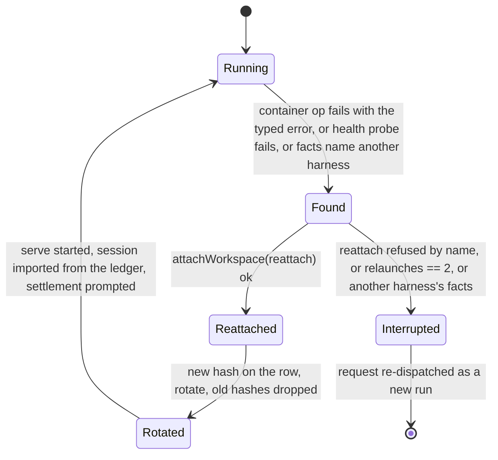

# Harness contract stage A, the seam, the conformance suite and OpenCode as the second harness - Plan

## Goal Capsule

- **Objective:** carve the six-clause harness contract of record 0038 out of the pi harness as a typed seam, hold pi to it with one conformance table, and add `OpenCodeHarness`, OpenCode's v2 line driven over its server API, as a second production harness that passes the same table: pinned in the images, selectable per preset by configuration, receipted on a live coding task.
- **Scheduling:** scheduled on 2026-09-16 by the maintainer's direction ("lets do opencode/openapi instead of codex and actually wire it up"), superseding the deferral of 2026-09-15. Ownership: the orchestration-primitives session runs the build agents against this plan, the seam and pi's rows first; the session that wrote record 0038 reviews the seam PRs.
- **Authority:** record 0038, its body as overridden by its four amendments, governs product behaviour; this plan governs how it is built; the living specs `harness-pi.md`, `model-proxy.md`, `execution.md`, `load-harness.md` and the new `harness.md` bind every behaviour change in the same PR as its code. The OpenCode facts come from the spike of 2026-09-15/16 (two source checkouts, `dev` at 1.18.31 and tag `v2.0.3`), not from prose docs.
- **Stop conditions:** a clause only pi's in-process hook can satisfy (amend the record); an unverified item of the spike that turns out false in a way that voids a clause (v2 import rejecting authored assistant turns; `permission.asked` not raised for a built-in); the maintainer choosing the v1 line, which changes the survival word and removes the steer (the plan carries both rows).
- **Execution profile:** one unit landed as a `gh stack` series in the order of the Implementation Units, each PR green and reviewed; nothing defaults a preset to OpenCode.
- **Tail ownership:** the implementer runs the PR loop per the repository's rules; live receipts are posted on the tracker's receipts issue.

---

## Product Contract

### Summary

Record 0038 says a harness owes the bot six things: credential, gate, relay, record, conversation, survival. pi is the one implementation and the seam, after the native loop's deletion, is one hand-built call. Stage A makes the seam a type, holds pi to it with a scenario table, and adds OpenCode as a second implementation that meets all six clauses from outside its process: its provider layer speaks the proxy's existing dialects, its permission rules make every tool ask over HTTP, its server imports an authored session, its inbox steers mid-turn, and its tools run unsandboxed as the process user, which is pi's shape. Codex, the probe that found the contract's honest cannots, stays documented and builds nothing.

Product Contract preservation: unchanged in meaning. The Codex-specific requirements of the first version of this plan (a Responses route, an MCP relay endpoint, a sandbox preflight) are withdrawn because OpenCode does not need them; their R-IDs are retired, not renumbered.

### Problem Frame

After `146f9287` every preset runs on pi and nothing in the tree says what a harness owes: the run loop hands twenty-one fields to `runPiHarnessOpen`, the container seam is named `PiContainer` and is pi-shaped beneath the name, the row's facts parse as pi's or as nothing, and the bearer store cannot rotate a credential without resetting the meter. A second harness that runs in production is the only proof that the seam is real, and the only way a deployment can leave pi should pi's pricing, license or maintenance change.

### Requirements

**The seam**

- R1. A `Harness` interface with a `HarnessFacts` row type exists in `src/core/harness/contract.ts`; `PiHarness` implements it over the code that exists; the run loop calls the harness object handed in through `deps.harness` and compares no string.
- R2. `PiContainer` is renamed `HarnessContainer`; `start` takes the binary, its arguments, the stdout filter and the run directory layout as inputs and returns `{ pid, port? }`; the seam gains `request(paths, { method, path, headers, body })` into the container over `/exec curl` on the exec classes and `fetch` on the bot-host class, rethrowing the container-gone error.
- R3. `HarnessFacts` is a discriminated union on `harness`; a row's facts are read by the harness the row names; a row without the discriminator is pi's; facts of another harness are refused and the run closes `interrupted`.

**The conformance suite**

- R4. One scenario table, whose rows are record 0038's validation criteria plus the parity rows below, runs through one driver interface against every harness: pi over the existing fake container and scripted provider, OpenCode over a fake `serve` and over the real binary. A harness never gets a table of its own.
- R5. A row a harness cannot pass is a named failure the table asserts, never a skip and never a pass.
- R6. Removing one clause's behaviour from `OpenCodeHarness` fails the suite, once per clause.

**OpenCode: process and credential**

- R7. Both execution images and the bot image pin `@opencode/cli@2.0.3`, proven by `opencode --version` as root and as the thread user, under one pin the image test holds equal across images.
- R8. A run's `opencode serve` starts on loopback in the run's container with a per-run password, per-run XDG roots under the run's directory, an in-memory database, every phone-home switched off, and a configuration naming the model proxy as its one provider with the run bearer as the key; the child's environment carries no provider key.
- R9. Retired.
- R10. Retired.

**OpenCode: gate, relay, record**

- R11. Every tool call, the read-only built-ins included, asks the bot before it runs: the session's rules end in `{ action: "*", resource: "*", effect: "ask" }`, the ask is answered `once` or `reject` with the rule's reason, never `always`, within the bot's 90-second wait; a tool success whose call never asked fails the run closed, and so does a tool success whose ask was answered by a reply the bot did not send (the gate on OpenCode is enforcement by detection: the approval lives in the server and the model's shell can reach the server's password, so a forged reply is possible and is detected, never prevented).
- R12. Switchboard's tools reach OpenCode through a local plugin custom tool speaking pi's `/harness/tool` protocol from inside the OpenCode process; the MCP client over loopback is the fallback road.
- R13. Every event type OpenCode emits has a disposition onto the run stream in pi's tool words; the transcript is mirrored into ledger steps per tool call, from the server's store at each step end; an in-container tailer writes the event stream and the store's feeds to one JSONL file the harness reads through the existing log transport.

**OpenCode: conversation and survival**

- R14. A fresh run seeds by importing the thread's turns as an authored session; the request is a prompt; the wrap-up and follow-ups are steers; the hard stop is an interrupt; the post-turns are one more prompt after the session is idle; the effort tier maps onto the model's variants.
- R15. A preset without a workspace runs OpenCode with its shell and file tools hidden by deny rules; the read identity hides the write tools; the gate judges the rest.
- R16. A container replaced under a living bot relaunches the harness from the record in the container the run holds, with the workspace re-attached or refused by name, the bearer rotated, at most two relaunches; for OpenCode the rebuild is an import.

**Configuration and receipt**

- R17. The `harness:` configuration word accepts `pi` and `opencode` per preset, mapping to a harness object in the wiring roster; no preset defaults to OpenCode.
- R18. Stage A closes on a live receipt: a coding run on OpenCode in a scratch repository on the resident, its record complete on the run page, one refused command visible on its record.

### Acceptance Examples

- AE1. **Covers R11.** Given a scripted model that runs `grep` then `rm -rf build` under the switchboard agent, when OpenCode raises `permission.asked` for each, then the bot answers `once` for `grep` and `reject` with the rule's reason for `rm`, the record shows a `tool_refused` note, and the model reads the reason.
- AE2. **Covers R11, R5.** Given a tool success for a call id that never appeared in `permission.asked`, when the bridge sees it, then the run fails closed naming the tool, exactly as pi's `GateBypassed`.
- AE3. **Covers R14, R16.** Given a pi-shaped ledger of three turns and one call in flight, when the harness imports it and prompts the settlement, then OpenCode's store holds the turns as settled messages, the settlement as a completed tool content, and the next model call continues from it.
- AE4. **Covers R13.** Given the event stream closes mid-turn, when the tailer reconnects, then no turn is lost because the transcript is refilled from the message route at the next step end and the run page shows one run.

### Scope Boundaries

- Codex is documented in record 0038's Appendix B as the probe and builds nothing.
- No preset defaults to OpenCode; no production configuration changes; the switch is a deployment's per preset.
- Hosted coding agents are a remote executor at the spawn seam (record 0038's third amendment), not a harness.
- The v1 line (`opencode-ai@1.18.31`) is the fallback if v2's churn bites: own store and no steer; the table carries its row as prose until it is needed.
- **Deferred to follow-up work:** the MCP relay endpoint on the bot (the fallback relay road); `run_meta.harness` as a queryable field (additive, when the run page or friction tooling needs it); a resident-side event stream if the tailer file proves too slow.

### Dependencies

*Amended 2026-09-16: no egress allowlist and no egress receipt, by the maintainer's decision (coding runs need open egress and the platform gives no per-container egress policy); credential scoping per run and harness/shell secret separation are P2 (record 0038's fifth amendment). The live receipts are the record, the refused command and the run page.*

- Record 0038's stage gates (its "Stage gates and the review each must survive" table, as overridden by the fourth amendment) gate each unit.
- The container-roll floor merged (#1294, #1321): the typed error from any container operation, no kill or remove in the replacement, `interrupted` and re-dispatch. The re-dispatch half is receipted failed on the 1.233.0 deploy: a run resumed across a bot roll and then interrupted by a container roll had its restart-from-request steered into its own dying row (#1340); every deploy rolls in that order, so #1340 lands before U8 and U9, which sit on the same restart path.
- `@opencode/cli@2.0.3` and `@opencode/protocol@2.0.3` on npm; the spike's fourteen unverified items closed on the build's first day.

---

## Planning Contract

### Key Technical Decisions

- KTD1. **The harness is an object handed in, never a word compared.** `deps.harness` carries the roster; `runLoop.ts` calls `harness.open(...)` and `harness.find(...)`; `src/core/harness/oneHarness.test.ts` is re-pointed. (session-settled: user-directed — chosen over a string in the registry: record 0032 retired the word.)
- KTD2. **OpenCode is the second harness, built for real.** (session-settled: user-directed — chosen over Codex, which stays the probe: OpenCode meets all six clauses from outside its process where Codex met four, and it speaks the proxy's dialects.)
- KTD3. **The v2 line, pinned at 2.0.3, with a client generated from `@opencode/protocol@2.0.3`.** v2 alone has an authored session over HTTP, a steer with a durable inbox, per-session permission rules and structured compaction messages; its API groups are experimental and its docs pages absent, so the client is generated, not written from prose, and the pin moves only by a change to this plan. The v1 row is documented as the fallback. Revisable by the maintainer.
- KTD4. **Nothing defaults to OpenCode.** Images carry it; configuration selects it per preset; production configuration does not change in stage A. (session-settled: user-directed — "don't build too much too early".)
- KTD5. **Per-run roots, in-memory store, phone-home off.** `XDG_DATA_HOME`, `XDG_CONFIG_HOME`, `XDG_CACHE_HOME`, `XDG_STATE_HOME` and `HOME` under the run's directory; `OPENCODE_DB=:memory:`; `OPENCODE_CONFIG` the per-run file with both project-config-disable variables set; `OPENCODE_DISABLE_MODELS_FETCH=1`, `OPENCODE_DISABLE_AUTOUPDATE=1`, `update: "disable"`, `share: "disabled"`, `snapshots: false`; a per-run `OPENCODE_PASSWORD`. The store is a cache because the ledger is the record and a rebuild is an import.
- KTD6. **The gate rides the HTTP ask.** The session's rules are the agent's policy, the identity's denies, then `{ action: "*", resource: "*", effect: "ask" }`; `permission.asked` names the tool call; `judgeToolCall` answers `once` or `reject` with the reason as the message, never `always` (it persists project rules); a `session.tool.success` or `failed` whose call never asked fails the run closed. The plugin `permission.evaluate` hook is not used for the decision: its predecessor in the v1 line went dead across versions.
- KTD7. **The relay is a plugin custom tool speaking pi's protocol.** A local plugin file written into the run's configuration directory registers the run's relayed tools from `GET /harness/tools` and runs each through `POST /harness/authorize` and `POST /harness/tool` with the call id, the `202 pending` re-ask and the 90-second wait exactly as pi's extension does, so the relay's idempotency by the caller's call id holds and the bot gains no MCP endpoint. Verified first: v2 loads a local plugin file without a package install. Fallback: `mcp.servers.switchboard` over loopback with the bearer in its headers.
- KTD8. **The transport is a file the harness tails, as pi's is.** A per-run tailer process started beside `serve` subscribes to `GET /api/event` inside the container, appends each event to one JSONL file, and at every step end appends the pending permission list and only the messages that changed since its previous refill (it keeps the last list in memory and diffs by message id), so the file grows with the work and not with the session; the harness reads that file through the existing log transport (`readLog`, `logOffset`), upserting mirrored turns by message id, so pi's forward-only transport code, its re-attach offset and its bot-death survival carry over unchanged. `request()` serves only the writes (prompt, reply, interrupt, import) and the readiness probe. One exec per tick on the resident, not four.
- KTD9. **Dispositions in pi's tool words, mirrored per tool call.** `session.tool.called/success/failed` become `tool_call`/`tool_result` with `shell → bash`, `edit`, `read`, `glob → find`, `grep`, `webfetch`, `<server>_<tool> → <tool>`; `session.text.*` and `session.reasoning.*` as messages with reasoning dropped; `session.step.*` and `session.usage.updated` as structure; `*.delta`, `session.step.streamed`, `session.tool.progress` folded; `session.compaction.ended { text }` a compaction row; `permission.*`, `session.retry.scheduled`, `session.execution.failed` notes; `session.shell.*`, `session.revert.*`, `session.moved/forked/renamed`, `session.agent/model.selected` impossible; an unknown type a `harness_error` note. The ledger step is reported at `session.tool.called` with the call in flight, its result queued at `success`/`failed`, so `planResume` reads OpenCode rows as it reads pi's.
- KTD10. **Seed and rebuild are an import.** The ledger's turns become `user` and `assistant` messages with `time.completed`, each compaction a `compaction` message with the stored summary, a settled call a completed tool content carrying the settlement note; `POST /api/session/import` into a fresh store, then `POST …/prompt`. The survival word for OpenCode is authored-session.
- KTD11. **Conversation verbs.** `prompt { delivery: "queue" }` for the request and the post-turns (after `POST …/wait`), `prompt { delivery: "steer" }` for the wrap-up and follow-ups, `interrupt` for the hard stop; the system prompt is the custom agent's `system`; the effort tier maps onto the model's declared variants.
- KTD12. **Identity by deny rules.** A custom agent `switchboard` with `default_agent` set; identity `none` denies `read`, `edit`, `shell`, `glob`, `grep`, `webfetch`, `websearch`, `subagent`, `skill`, `question`, `external_directory` and the meta-tool, keeping the relayed tools on `ask`; `read` denies `edit`; `write` denies nothing. A deny as the last matching rule hides the tool from the model.
- KTD13. **The turn count is the proxy's.** OpenCode's compactions and retries call the model through the bearer and are counted by `consumeTurn`; the wrap-up steer reads `grantOf(runId).turns`.
- KTD14. **Rotation keeps the meter and is ordered for a bot death; the relaunch is the run loop's.** `RunBearerStore.rotate` keeps `turns`, `expiresAt` and `span`; the new hash reaches the row before the old ones are dropped; a re-attach adopts, a relaunch rotates; the run loop gains a mid-run `interrupted` outcome and the workspace re-attach callable mid-run; the identity word is the typed container-gone error first and the boot id only as corroboration.
- KTD15. **Images pin the wrapper with its install script allowed.** `npm install -g --allow-scripts=@opencode/cli @opencode/cli@2.0.3`, cache cleaned, `opencode --version` proven as root and as the thread user; `src/deploy/imageOpenCodeHarness.test.ts` holds the pin equal across images as `imagePiHarness.test.ts` does for pi; a `check:lockfile` entry is not needed because the images, not the lockfile, carry the binary. Cost about 206 MB unpacked per image.
- KTD16. **The configuration word returns with two values.** `harness: { <preset>: pi | opencode }` validates against the roster's names; the roster lives in `src/index.ts` wiring, not in `agents/registry.ts`, so the source scan still forbids a word in the registry.
- KTD17. **One unit, landed as a `gh stack` series.** Each Implementation Unit is one PR, the seam first, OpenCode's process before its bridge, the relaunch last.

### High-Level Technical Design

A tool call under OpenCode, on the resident: the ask, the relay and the record.

```mermaid
sequenceDiagram
  participant L as Run loop (bot)
  participant H as OpenCodeHarness (bot)
  participant S as opencode serve (container, loopback)
  participant P as plugin tool (in serve)
  participant T as tailer (container)
  participant B as /harness/* and judgeToolCall (bot)
  L->>H: open(deps, run)
  H->>S: request: POST /api/session/import, POST /api/session/:id/prompt
  S->>B: model call through the proxy with the run bearer
  S-->>T: /api/event: permission.asked (shell rm -rf build)
  T-->>H: JSONL line via readLog at logOffset
  H->>B: judgeToolCall(bash, "rm -rf build")
  H->>S: request: POST /api/session/:id/permission/:rid/reply {reject, message}
  S->>P: tool call switchboard_update_status
  P->>B: POST /harness/authorize, POST /harness/tool (pi's protocol)
  S-->>T: session.step.ended; T appends GET /api/session/:id/message
  T-->>H: the step's messages; the mirror writes the ledger step
```

The survival lifecycle, now with an import as the rebuild:



### Assumptions

- v2's `import` accepts authored assistant messages without provider state and validates `projectID` against the location (spike item 10).
- v2 loads a local plugin file without a package install, and a failing `execute.before` blocks a call (spike item 9).
- `serve` accepts the `--port` we pass and Basic auth from the bot's client; the readiness line or `GET /api/health` bounds the start (spike item 3).
- Effort tiers map onto model `variants` (spike item 11); if not, effort is passed as a model option or dropped with a note.
- `curl` is present in all three images (confirmed on `origin/main`).

---

## Implementation Units

Units U4 to U7 of this plan's first version were Codex-specific and are retired; their numbers are not reused.

### U1. The seam: `contract.ts`, `PiHarness`, the object in `deps.harness`

- **Goal:** the run loop calls a `Harness` it was handed; pi's behaviour is unchanged.
- **Requirements:** R1, R3; KTD1.
- **Dependencies:** none.
- **Files:** `src/core/harness/contract.ts` (new: `Harness`, `HarnessRun`, `HarnessDeps`, `HarnessSession`, `HarnessFacts` as a discriminated union, `Disposition`), `src/core/harness/pi/harness.ts` (`PiHarness`; `piHarnessFactsOf` reads the discriminator and keeps unknown keys), `src/core/dispatch/run.ts`, `src/core/dispatch/runLoop.ts`, `src/index.ts`; tests `src/core/harness/contract.test.ts` (new), `src/core/harness/oneHarness.test.ts`, `src/core/dispatch/runLoop.test.ts`, `src/core/harness/pi/harness.test.ts`.
- **Approach:** lift `OpenPiSession` to `HarnessSession` and the two pi types to `HarnessRun`/`HarnessDeps` with pi-only fields behind `PiHarness`; `find(facts, container)` answers `alive-here | another-container | dead | another-harness`; the disposition table becomes a `Harness` property.
- **Test scenarios:**
  - `PiHarness.open` over `FakePiContainer` yields the same run events and ledger steps as `runPiHarnessOpen` did for the scripted-provider fixtures.
  - Facts with `harness: "pi"`, facts without the key, and facts with `harness: "opencode"` parse as pi's, pi's, and another harness's; the loop closes the run `interrupted` on the last.
  - `relaunches` survives a parse-and-rewrite round trip.
  - `oneHarness.test.ts` asserts `harness.open(` and still forbids a string compare, `HARNESSES` and `select.ts`.
- **Verification:** every existing pi test unchanged in outcome; harness-pi.md items 1, 2, 8 re-pointed; `harness.md` created with the six clauses as rows.

### U2. `HarnessContainer`: the binary, the layout, a port and an HTTP verb

- **Goal:** the container seam is harness-neutral in fact.
- **Requirements:** R2.
- **Dependencies:** U1.
- **Files:** `src/core/harness/pi/container.ts` → `src/core/harness/container.ts` (`HarnessContainer`, `HarnessStart { paths, command, args, env, stdoutFilter? }`, `start → { pid, port? }`, `request`), `src/core/harness/pi/botHostContainer.ts`, `src/core/harness/pi/process.ts` (pi's layout as pi's), `src/core/harness/pi/transport.ts`, `src/core/harness/pi/testing/fakeContainer.ts`; every importer; docs `harness-pi.md` rows 4, 8, 12 and Code header, `code-map.md`, `specs/README.md`.
- **Approach:** `startScript` takes the command and filter (pi passes `pi` and the `message_update` grep, byte-identical to today's script); `request` is `/exec curl -sS -X <method> -H … --data-binary @- <loopback>` on the exec classes and `fetch` on the bot-host class, both rethrowing the container-gone error; `kill` takes the process group; `identity()` rethrows the typed error.
- **Test scenarios:**
  - `startScript({ command: "pi", … })` equals today's script byte for byte.
  - `request` over a recording executor produces the curl script with the body on stdin and parses status and body; a container-gone exec rethrows the typed error.
  - `BotHostPiContainer.start` spawns the given command; `request` on it fetches loopback.
- **Verification:** container and bot-host tests green; `specs:check` resolves every renamed path.

### U3. The conformance suite over pi

- **Goal:** one scenario table, pi passing every row, ready for a second harness.
- **Requirements:** R4, R5, R6.
- **Dependencies:** U1, U2.
- **Files:** `src/core/harness/conformance.test.ts` (new; `describe.each` over harness drivers), `src/core/harness/testing/scenarios.ts` (new), `src/core/harness/pi/testing/providerPi.ts`; `harness.md` validation rows bound to the table's titles.
- **Approach:** rows are the record's validation criteria plus the parity rows in the Verification Contract; a row is a function of a `HarnessDriver` (start a run, feed one scripted model turn, read the run events and ledger steps, end), so the fake-`serve` driver of U11, the real-binary driver of U12 and pi's fake-container driver plug into the same table and the live receipt of U13 walks the same rows by hand; a lint over the table rejects a row that asserts nothing on the record; a matrix printer like `scripts/command-conformance-matrix.ts`.
- **Test scenarios:**
  - Every record row passes on pi with its existing proof re-pointed.
  - The credential row that replaces the record's retired row 11: the model proxy serves exactly the two dialects it serves today and answers a third path with a refusal, proven in `src/channels/modelProxy.test.ts`.
  - A row with no assertion on run events or ledger steps is rejected by the lint.
- **Verification:** the matrix shows pi green on every row.

### U10. The OpenCode process: image pin, per-run configuration, tailer, readiness

- **Goal:** `opencode serve` runs per run in the container with the proxy as its only provider and nothing else reachable.
- **Requirements:** R7, R8; KTD5, KTD8, KTD15.
- **Dependencies:** U2.
- **Files:** `Dockerfile`, `deploy/cloudflare-resident/Dockerfile`, `deploy/cloudflare-sandbox/Dockerfile` (the pinned install line and the version proofs), `src/deploy/imageOpenCodeHarness.test.ts` (new), `src/core/harness/opencode/process.ts` (new: layout under `/tmp/switchboard-oc-<runId>/` with `xdg/{data,config,cache,state}`, `opencode.json`, `plugins/`, `serve.log`, `serve.err`, `feed.jsonl`, `pid`; the environment; the configuration writer; the tailer script), `src/core/harness/opencode/client.ts` (new: generated from `@opencode/protocol@2.0.3`, thin), `package.json` (`@opencode/protocol` devDependency for generation only); tests `src/core/harness/opencode/process.test.ts`; docs `harness.md`, `execution.md` (the image rows).
- **Approach:**
  1. The image line: `npm install -g --allow-scripts=@opencode/cli @opencode/cli@2.0.3 && npm cache clean --force && opencode --version | grep -qx '2.0.3'`, plus the thread-user proof the resident image runs for pi.
  2. The configuration writer emits `providers.switchboard` (`package: "aisdk:@ai-sdk/anthropic"` or `"aisdk:@ai-sdk/openai-compatible"` by the run's provider type, `settings.baseURL` the proxy, `settings.apiKey: "{env:SWITCHBOARD_RUN_BEARER}"`, the model with zero cost), `model`, `default_agent: "switchboard"`, `agents.switchboard` (`mode: "primary"`, `system`, `permissions` per KTD6 and KTD12), `plugins: ["./plugins/switchboard.js"]`, `update`, `share`, `snapshots`, and the compaction thresholds when the deployment sets them.
  3. Launch `opencode serve --hostname 127.0.0.1 --port <free>` with the environment of KTD5 and the two bearer variables; readiness is `GET /api/health` answering `{ healthy: true, version: "2.0.3" }` within a bound; the port goes on the row.
  4. The tailer: a small script started with `setsid -f` beside `serve` that streams `GET /api/event` with Basic auth into `feed.jsonl` one event per line, reconnects with backoff, and on every `session.step.ended` appends the pending permission list and the messages changed since its previous refill (diffed by id against the list it keeps in memory) as two more records.
- **Execution note:** close spike items 2, 3, 4, 5 and 14 in a local container before writing the configuration writer; they decide the exact keys and variables.
- **Test scenarios:**
  - The configuration writer's output validates against the v2 schema for both provider dialects and both identities.
  - The environment handed to `serve` contains no `ANTHROPIC_API_KEY` or `OPENAI_API_KEY` when the parent has them.
  - Readiness fails loudly when `/api/health` never answers within the bound; the row records the port when it does.
  - The tailer's file, replayed through the pi log transport, yields the same records in the same order as the events it was fed (a fake `serve` in tests); two step ends around one unchanged message append that message once.
- **Verification:** both images build and prove the version as root and as `worker1`; a run on a staging bot-host container starts the server through the seam and answers its health.

### U11. `OpenCodeBridge`: the gate and the record

- **Goal:** every tool call decided in the bot; every event on the record in pi's words.
- **Requirements:** R11, R13, R5; KTD6, KTD9, KTD13.
- **Dependencies:** U3, U10.
- **Files:** `src/core/harness/opencode/bridge.ts` (new: the disposition table, the per-call mirror, the ask handler, bypass detection), `src/core/harness/opencode/dispositions.ts` (new), `src/core/harness/pi/toolRules.ts` (the action-to-tool-word map), tests `src/core/harness/opencode/bridge.test.ts`, `src/core/harness/conformance.test.ts` (the OpenCode driver over a fake `serve`); docs `harness.md` gate and record rows.
- **Approach:** read `feed.jsonl` through the log transport; on `permission.asked` map `action`/`resources` onto pi's tool words and call `judgeToolCall` with the run's identity and rules; reply through `request`; on `session.tool.called` report the assistant turn so far with the call in flight; on `success`/`failed` queue the result; on the appended message delta at a step end, upsert the mirrored turn by message id against the store; a success for a call that never asked fails the run closed, and a `permission.replied` the bot did not send is `GateBypassed` the same way; the wrap-up steer fires when `grantOf(runId).turns` nears the cap; a `session.execution.failed` carrying the proxy's `403` is the budget stop.
- **Test scenarios:**
  - AE1 and AE2 against a fake `serve` that emits the documented event shapes.
  - Every event type in the catalogue has a disposition; an unknown type lands as `harness_error` naming it.
  - A `session.compaction.ended` with text becomes a compaction row and a `compacted` note; without text a note alone.
  - The stream drops mid-turn: the step-end refill restores the turn and no ledger step is duplicated.
  - `planResume` over the mirrored rows yields the same plan kind as over pi's rows for the same scripted turns; `analyzeRunFriction` classifies `$ cmd` summaries alike.
- **Verification:** the conformance matrix shows OpenCode green on the gate and record rows against the fake `serve`.

### U12. The relay plugin, the conversation, the authored session

- **Goal:** OpenCode passes the relay, conversation and survival rows against the real binary.
- **Requirements:** R12, R14, R15, R16 (its OpenCode half), R6; KTD7, KTD10, KTD11, KTD12.
- **Dependencies:** U10, U11.
- **Files:** `src/core/harness/opencode/harness.ts` (new: `OpenCodeHarness` implementing `Harness`), `src/core/harness/opencode/pluginSource.ts` (new: the plugin file text, the sibling of `extensionSource.ts`), `src/core/harness/opencode/session.ts` (new: ledger → import body; settlement as a completed tool content), tests `src/core/harness/opencode/harness.test.ts`, `src/core/harness/opencode/pluginSource.test.ts`, `src/core/harness/conformance.test.ts` (the real-binary driver, run where the binary is on the PATH: a devDependency pin of `@opencode/cli@2.0.3` for tests, mirroring pi's); docs `harness.md` relay, conversation and survival rows.
- **Approach:**
  1. The plugin registers the tools from `GET /harness/tools` at load through the v2 `tool.transform` editor and runs each through `/harness/authorize` and `/harness/tool` with pi's re-ask and wait.
  2. `open`: write the layout and configuration, start `serve` and the tailer, import the seed (or the rebuild) and prompt; steers as `delivery: "steer"`; the hard stop as `interrupt`; post-turns as `wait` then `prompt`; `end` kills the process group and removes the root.
  3. Facts `{ harness: "opencode", pid, port, sessionID, logOffset, root, bearerHash?, container?, relaunches }`: `logOffset` is the byte boundary in the tailer's file after the last record whose effect the ledger holds, as pi's is; `container` and `bearerHash` carry pi's semantics and are absent where the container cannot name itself (the bot-host class) or the token has no secret; `find` is `GET /api/health` and `GET /api/session/:id` on the recorded port through `request`.
  4. Identity rules per KTD12; the effort tier onto variants.
- **Execution note:** close spike items 9, 10 and 11 first; each decides a mechanism in this unit.
- **Test scenarios:**
  - Roster parity: the tools the model was offered (`GET /api/session/:id/context`, or the plugin's registration log) equal `GET /harness/tools` for every toolset.
  - Identity parity through the plugin: conductor `spawn_run` naming `coding` refused `spawn_identity`; research `web_fetch` of an internal address refused before any fetch; readonly `submit_verdict` served with the head-requiring schema.
  - A relayed `await_runs` outliving one request re-asks by the same call id and runs once (pi's proof `relay.test.ts:533`).
  - AE3; a steer sent mid-turn is consumed at the next step (`session.inbox.delivered` then `session.step.started`).
  - Identity `none`: the model's tool list holds only relayed tools; a scripted `shell` call never appears.
  - Mutation rows: each of six clause switches off in turn fails the suite once.
- **Verification:** the matrix shows OpenCode green on every row against the real binary with the load suite's scripted Anthropic-shape model behind the proxy.

### U13. The configuration word, the roster, the live receipt

- **Goal:** a deployment can put a preset on OpenCode; stage A is receipted live.
- **Requirements:** R17, R18.
- **Dependencies:** U12.
- **Files:** `src/config.ts` (`harness?: Record<string, "pi" | "opencode">`), `src/config/validate.ts`, `src/index.ts` (the roster), `src/core/dispatch/runLoop.ts` (pick from the roster by the preset's word), `config/config.example.yaml`; tests `src/config.test.ts`, `src/core/dispatch/runLoop.test.ts`; docs `harness-pi.md` item 1, `harness.md`, `docs/reference/code-map.md`, `docs/reference/specs/README.md`, `docs/how-to/` (one page: putting a preset on OpenCode).
- **Test scenarios:**
  - `harness: { coding: opencode }` selects `OpenCodeHarness` for coding runs and `PiHarness` for the rest; `harness: { coding: codex }` is refused by name.
  - The source scan still forbids a harness word in `agents/registry.ts`.
- **Verification:** human-gated live receipt on staging: a coding run on OpenCode in a scratch repository on the resident, its record complete on the run page, one refused command visible as `tool_refused`; posted on the tracker.

### U8. `RunBearerStore.rotate` and the mid-run `interrupted` path

- **Goal:** the two shared-code pieces the relaunch needs, landed before the relaunch.
- **Requirements:** R16 (prerequisites); KTD14.
- **Dependencies:** U1; #1340 merged (the re-dispatch after an interrupted close, which the mid-run `interrupted` path here reuses).
- **Files:** `src/core/modelProxy/runBearers.ts`, `src/core/dispatch/runLoop.ts`, `src/core/dispatcher.ts`, `src/core/dispatch/provision.ts`, `src/core/dispatch/reattach.ts`, `src/core/harness/pi/relay.ts` (`HarnessRegistry.replace`); tests beside each; docs `model-proxy.md` item 2, `run-history.md` item 54, `harness-pi.md` item 8.
- **Test scenarios:**
  - `rotate` then `verify(old)` answers `unknown_bearer`; `verify(new)` answers the same grant with the same `turns`.
  - The loop returns `interrupted` with a note; the dispatcher re-dispatches once.
  - `attachWorkspace` re-attaches a recorded binding mid-run without a gate context.
  - `replace` keeps a held relayed call running.
- **Verification:** the four test files green; no behaviour change until U9.

### U9. The relaunch ceiling

- **Goal:** a replaced container costs a run at most one model call and never a tool's effects, on both harnesses.
- **Requirements:** R16; KTD10, KTD14.
- **Dependencies:** U8, U12, the floor (#1294, #1321) and its re-dispatch fix (#1340).
- **Files:** `src/core/harness/pi/harness.ts`, `src/core/harness/opencode/harness.ts`, `src/core/dispatch/runLoop.ts`; tests beside each; docs `harness-pi.md` gap row closed, `harness.md` survival rows.
- **Approach:** on the typed error under a living bot: no kill or remove in the new container; re-attach or refuse by name; new hash on the row, `rotate`, old hashes dropped; pi rebuilds its session file, OpenCode imports the ledger; relayed calls in flight awaited up to the relay window then settled as still running; `relaunches` incremented; the third finding closes `interrupted`.
- **Execution note:** the mid-run re-attach spike is the record's first gate; if it fails, this unit is withheld and the floor stays the behaviour. *Amended 2026-09-16 (the unit's PR): the gate passed in the fakes — a recorded binding re-attached mid-run with no gate context, the same round back, and pi started again in a replacement container from the ledger's rows (`src/core/dispatch/runLoop.test.ts`, the spike) — so the unit was built. What the fakes prove is that the seam composes; the resident's `reuse: true` re-attach onto a container the platform just rolled, and the platform's second roll, are proven only live: the `16, live` row of harness-pi.md is a stage A exit condition, owed before the stage closes. The review of the PR also found and closed a record-clause gap the unit widened — a rebuilt session's settlement turn reached pi's session but not the ledger — with the settlement turn primed into the mirror and a conformance row (`survival-rebuild-records-settlement`) every harness runs; unit 12's OpenCode `open` under `relaunch` must import the record into a fresh store AND write the settlement turn onto the ledger the same way.*
- **Test scenarios:**
  - A living bot, the typed error from `readLog`: no kill or remove in the new container, workspace re-attached, rotation with turns preserved, one `resumed` note, `relaunches = 1`, on pi and on OpenCode.
  - The worktree refused by name: `interrupted`, one re-dispatch.
  - The third finding: `interrupted` naming the bound; no fourth start.
- **Verification:** human-gated live receipt on staging: a resident roll under a run on each harness.

---

## Verification Contract

| Gate | Command | Applies to |
|---|---|---|
| Unit and table rows | `npm test` (four CI shards); `npx vitest run src/core/harness` for the seam and the suite | every unit |
| Consistency | `npm run check:consistency` (`specs:check` bindings, `hygiene:check`, `agents:check`, `decisions:check`, `check:lockfile`) | every PR |
| Type, lint, format | `npm run typecheck && npm run lint && npm run format:check` | every PR |
| Spec coverage | `npm run specs:coverage -- --changed origin/main...HEAD --test-guard` | every PR |
| Images | `npm run verify -w deploy/cloudflare-resident` and `-w deploy/cloudflare-sandbox`; `src/deploy/imageOpenCodeHarness.test.ts` | U10 |
| Title | `npm run check:pr-title` with scope `harness`, `providers`, `dispatcher`, `docs` or `process` per PR | every PR |
| Conformance matrix | pi green on every row; OpenCode green on every row against the fake `serve` (U11) and the real binary (U12) | U3, U11, U12 |
| Live receipts | the scratch coding run (U13); the resident roll on each harness (U9) | human-gated |
| Never | a preset defaulting to OpenCode; an `always` reply; a skipped row; a Codex build | all |

Hygiene traps: tracker numbers in code comments, dates outside records, 32-hex fixtures, `U1` to `U13` tokens in prose under `src/` or `docs/reference/`.

---

## Definition of Done

- Global: every unit's PR merged in stack order; the conformance matrix in the last PR's body; `harness.md` in the specs index and the code map; record 0038's validation rows re-pointed from `[gap]` to the table's titles by a dated amendment; the spike's fourteen items each closed with a fact or a row; no abandoned-attempt code in the tree.
- U1, U2, U3: pi's behaviour unchanged by literal comparison; the matrix green for pi; `request` proven over a recording executor and on the bot host.
- U10: both images prove the version as root and thread user; a staging run starts the server through the seam; the tailer's replay equals its feed.
- U11: OpenCode green on the gate and record rows against the fake `serve`; the bypass row fails closed.
- U12: OpenCode green on every row against the real binary; the six mutation rows fail once each.
- U13: the configuration word selects per preset; the live receipt posted.
- U8, U9: rotation keeps the meter; the relaunch rows green on both harnesses or the unit withheld behind its gate.

---

## Open Questions

| Question | Owner | Resolves it | Blocking? |
|---|---|---|---|
| v2 pinned or v1 as the line to build? | the maintainer | one answer; the plan carries both rows | blocking for U10 only; the seam and pi's rows do not depend on it |
| Does v2 load a local plugin file without a package install, and does a failing `execute.before` block? | the implementer of U12 | one local `serve` with the plugin file (spike item 9) | deferred: decides plugin versus MCP relay |
| Does `import` accept authored assistant turns and validate `projectID`? | the implementer of U12 | one import against the binary (spike item 10) | deferred: decides authored-session versus own-store for the survival row |
| Effort tiers onto model variants? | the implementer of U12 | the schema and one run (spike item 11) | deferred |
| `serve` port, auth scheme, config-disable variable, provider key path, `--version` text | the implementer of U10 | **closed 2026-09-16** by U10's probes against `@opencode/cli@2.0.3` (below) | closed |
| Does `GET /api/session/:id/context` list the offered tools? | the implementer of U12 | one call (spike item 13) | deferred: decides the roster-parity row's source |
| `serve` memory under one run; `timeout.execution` semantics | the implementer of U12 | the live receipt (spike item 12) | deferred |


**Closed 2026-09-16 by U10 (spike items 2, 3, 4, 5, 14), each against a local `opencode serve` at `@opencode/cli@2.0.3`:**

- Item 2 — `opencode --version` prints `opencode v2.0.3` (the word and a `v`, one newline), so the image grep is `grep -qx 'opencode v2.0.3'`; the bare `'2.0.3'` this plan's Approach step 1 wrote would fail the build. The wrapper's postinstall (`postinstall.mjs`) hard-links the platform binary into `bin/opencode.exe`, picking `-baseline` when the BUILD host's `/proc/cpuinfo` lacks `avx2`; whether Cloudflare's hosts need the baseline build stays open for the live receipt (U13).
- Item 3 — a `serve` without `--port` scans upward from 4096 (`packages/server/src/process.ts:150-153`); always pass it. Auth is HTTP Basic only, user `opencode` (`packages/server/src/middleware/authorization.ts:34`, `auth.ts:16-17`): a Bearer header answered 401, a wrong password 401, `GET /api/health` itself is behind the password (`process.ts:189-192`) and answers `{ healthy: true, version: "2.0.3", pid }`.
- Item 4 — both names are honoured: `OPENCODE_CONFIG_PROJECT_DISABLE ?? OPENCODE_DISABLE_PROJECT_CONFIG` (`packages/cli/src/server-process.ts:107-109`), the first winning when both are set; with either set a project `opencode.json` in the cwd is absent from `GET /api/config`, and present without them (the control run). KTD5's "set both" stands.
- Item 5 — a provider with `settings.apiKey` needs no credential-store entry (`packages/core/src/model-resolver.ts:262`; `GET /api/provider` lists nothing and the model call still carries the key). `{env:NAME}` is substituted in the config text at load (`packages/core/src/config/variable.ts:27-33`). Against a logging fake proxy: `aisdk:@ai-sdk/anthropic` posted `POST <baseURL>/messages` with `x-api-key: <bearer>` and `anthropic-version: 2023-06-01`; `aisdk:@ai-sdk/openai-compatible` posted `POST <baseURL>/chat/completions` with `Authorization: Bearer <bearer>` — so `settings.baseURL` is `<harnessUrl>/v1` for both dialects. Both packages map onto providers bundled in the binary (`packages/core/src/aisdk-native.ts:98-119`): nothing is installed at runtime.
- Item 14 — `lsp: false` and `formatter: false` are accepted (`packages/schema/src/config/lsp.ts:19`, `formatter.ts:14`: `Union([Boolean, Record])`) and echoed by `GET /api/config`.
- Found on the way, binding on U10's writer and on U11/U12: a configured local plugin must be a DIRECTORY (`packages/core/src/config/plugin/source.ts:135-151`: `./` resolves against the config document's directory; a file path is dropped with a warning), its entrypoint `index.js` (`packages/plugin/src/host.ts:17-43`) — so the reference is `./plugins/switchboard`, not `switchboard.js`. The evaluator is `findLast` over `[...agent.permissions, ...session.permissions]` and `*` matches every action (`packages/core/src/permission.ts:87-95`), so the ask-on-all rule must PRECEDE the identity's denies, not follow them as KTD6 reads. Config agents append their `permissions` after the base policy and `disabled: true` removes an agent (`packages/core/src/config/plugin/agent.ts:97-120`); without `agents.title.disabled: true` every session's first prompt makes a second model call for a title (`packages/core/src/session/context.ts:96-98`) — a proxy turn. A mistyped config value is dropped by key with a logged diagnostic and the rest kept (`packages/core/src/config.ts:118-147`): readiness checks the echoed document by key. `POST …/wait` BLOCKS until idle (a 239 s wait was held open), it does not answer 503 while busy. CodeMode's `execute` tool is disabled by a deny on action `execute` (`packages/core/src/tool.ts:232`). `serve` keeps `OPENCODE_PASSWORD` in its environment (only `--stdio` deletes it, `packages/cli/src/server-process.ts:70-74`), so a `permission.replied` the bot did not send is a bypass U11 must fail closed on.

*Amended 2026-09-16 (U10, from the probes above; Approach steps 1 and 2 and KTD6 read with these):* the image grep is `'opencode v2.0.3'`; the plugin reference is the directory `./plugins/switchboard`; the ask-on-all rule precedes the identity's denies; the layout adds the tailer's files and `cmd/`, and `HOME` is not overridden (the model's shell keeps the container user's home, as pi's does).

---

## Sources

- Record 0038 with its four appended amendments; records 0032 (and its amendment), 0034, 0035, 0037, 0007, 0009, 0019.
- Living specs `harness-pi.md` (items 1, 2, 4, 7, 8, 12, 14, 15; the container-roll gap row), `model-proxy.md` (1, 2, 4, 5, 6), `execution.md`, `load-harness.md`, `run-history.md` (54), `session-log.md`.
- Repository at `81c51c4f`: `src/core/dispatch/runLoop.ts`, `run.ts`, `provision.ts`, `reattach.ts`; `src/core/harness/pi/*`; `src/channels/harnessRoutes.ts`, `modelProxy.ts`; `src/core/modelProxy/runBearers.ts`; `src/load/scriptedProvider.ts`, `piProcess.ts`; `src/core/harness/oneHarness.test.ts`; `src/deploy/imagePins.ts`, `imagePiHarness.test.ts`; `src/config.ts`, `src/config/validate.ts`.
- The OpenCode spike of 2026-09-15/16 (sections 1 to 11): two source checkouts of `anomalyco/opencode`, `dev` at 1.18.31 and tag `v2.0.3`; `@opencode/cli`, `@opencode/protocol`, `@opencode/plugin` 2.0.3 and `opencode-ai`, `@opencode-ai/sdk`, `@opencode-ai/plugin` 1.18.31 on npm; `opencode.ai/docs` and `opencode.ai/v2/docs`; the open-issue list for the headless server.
- The Codex research of 2026-09-15, kept as the probe's record in record 0038's Appendix B.
