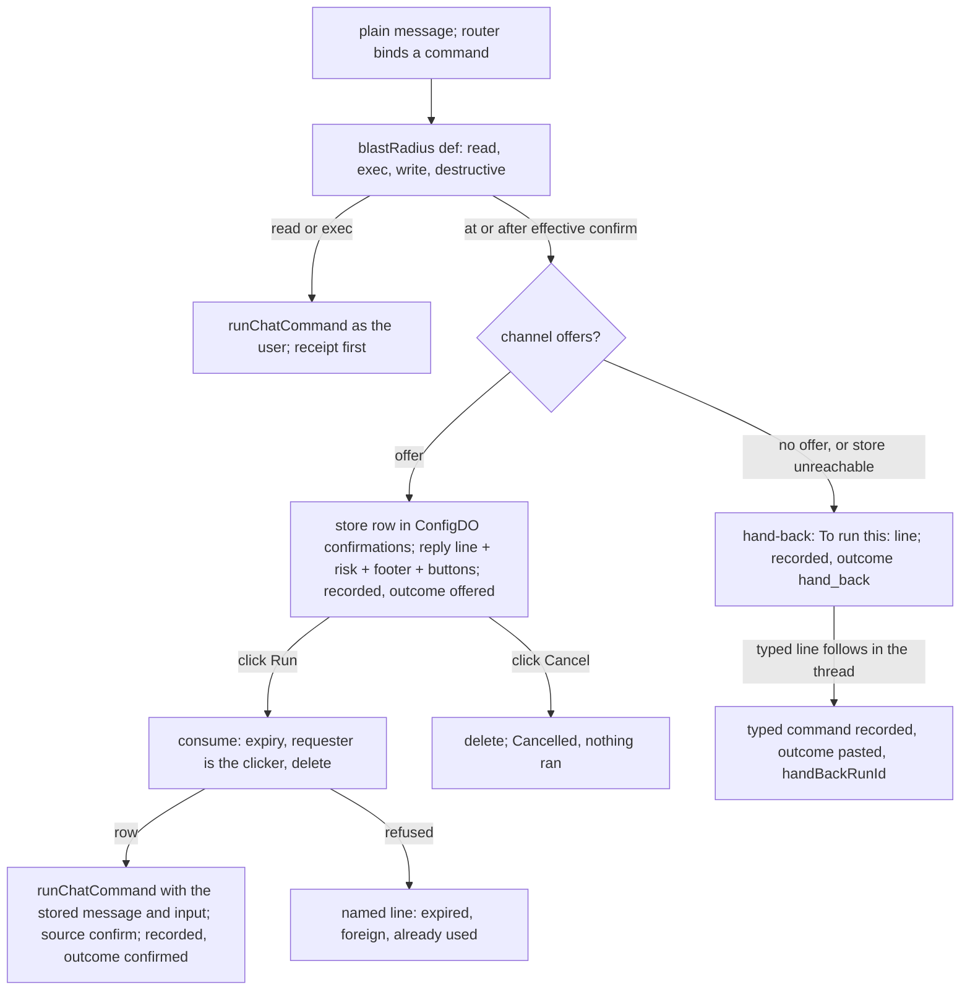

# A routed write is confirmed in proportion to its blast radius - Plan

## Goal Capsule

- **Objective**: Build [record 0044](../decisions/0044-a-routed-write-is-confirmed-in-proportion-to-its-blast-radius.md): every chat command declares its blast radius on its definition in MCP's tool-annotation vocabulary and the conformance suite fences the declaration; a `confirm` axis on the existing boundary names the first class that asks and intersects toward caution, so the org's value is a floor; the door replaces the paste-back with a one-time, requester-bound, ten-minute confirmation stored in the state Worker's config object and rendered by Slack as two buttons; a surface without buttons keeps today's pasteable line. Cheapest evidence first: the counts and the router rule land before anything is built.
- **Authority**: record 0044 (proposed; this plan is the artifact its acceptance is judged on) over [record 0039](../decisions/0039-the-front-door-writes-nothing-from-prose-and-never-routes-twice.md) as amended (the exec carve-out this plan generalises) and [record 0036](../decisions/0036-one-front-door-the-router-offers-every-command-and-ship.md) (the door); [record 0026](../decisions/0026-capability-profiles-and-request-routing.md) (the boundary and its intersection); [record 0042](../decisions/0042-a-dashboard-session-is-the-person-its-email-names-identity-not-authority.md) (the requester is the person, matched through the identity record's `self`); [record 0008](../decisions/0008-one-command-definition-every-surface.md) (one definition, every surface derived).
- **Execution profile**: six units, each one pull request through the review loop, in dependency order. Tests first in every unit. Every unit updates the spec rows it changes in the same pull request. What a person sees is identical through U1 to U4 under the default (`write`): a read or an exec-class write runs, every other write is handed back as the same line; only U5 changes the Slack reply. U1 to U4 touch `src/core/dispatch/route.ts` beside the ship plan's route-stage work, so whichever lands second rebases.
- **Stop conditions**: a unit that cannot pass `npm run verify` within its listed files hands back a deviation. Nothing here adds a Worker or a credential; the one new table lives in an object the bot already writes to. A unit that would run a routed command at or after the effective confirm class without a consumed confirmation, run a confirmation for an actor who is not the requester, run one twice, let `never` validate, change the model's configuration block, or let a channel adapter's type reach the core, stops and hands back.

---

## Product Contract

### Summary

The door binds a plain sentence to a command and runs a read or a test at once, but hands every other write back as a line to paste, because the router misreads: on the replay of 2026-09-16 it bound the wrong command 5 times and the wrong arguments 6 times in 66 asks. Record 0044 decides that the paste is the wrong confirmation and "write" the wrong granularity. This plan lands the decision in six steps: record what the door hands back and whether the paste follows; declare and fence every command's blast radius and list it on `tools/list`; add the `confirm` axis to the boundary; store and consume a confirmation through the dispatcher behind an adapter seam; render it in Slack as buttons; and measure a verifier call on the replay before deciding whether it ships.

### Problem Frame

A routed `config set` is handed back as `To run this: config set channel …`. The person either pastes it or does not, and nobody knows which: a hand-back leaves no run record (the route stage seals with nothing invoked), a typed `config set` leaves none either (only commands that do work are inline runs), and the registry's audit line is a `console.log` the bot's container does not keep. Record 0044 assumed the `route` event counts hand-backs; it does not. So the first unit makes every door decision about a state change a record, hand-back and paste included, and adds the one report the record's bet turns on. Everything after that is additive and reversible, and nothing a person sees changes until the Slack unit.

### Requirements

**Counting (the record's first plan unit)**

- R1. A hand-back is recorded as an inline command run: agent `command`, status `completed`, no invoke, the run's `route` event carrying the command, the redacted input, the receipt and `outcome: "hand_back"`. It appears in `runs list agent=command` and on the run page through the existing `route` event rendering; it claims no thread, starts no agent run, and signals no run start to the channel, so the web chat and the HTTP ingress answer the hand-back line exactly as they do today.
- R2. When the typed grammar runs a command in a thread whose newest command record is a hand-back whose receipt equals the typed line's own capped receipt, the typed command is recorded as an inline command run too, whatever its id, with `route.outcome: "pasted"` and `route.handBackRunId` naming the hand-back's record. A typed command in a fresh thread, or one that matches no hand-back, is recorded under today's rule (commands that do work are runs; the rest are not). The check is one run-store read for the thread, newest command run first, taken before the command runs.
- R3. `npm run load -- door --since <date>` prints, per day and per command, hand-backs recorded, pastes that followed, and the paste-through rate, from the run store's list and per-run events alone; it invokes nothing.
- R4. The router's prompt carries one rule for the command tools: call a command only when the request asks for what the command does; a question about a subject is not a call. The replay's decoy row measures it; the target is 0 of the checked-in decoys bound.

**Blast radius**

- R5. `CommandDef` gains `annotations?: { destructive: boolean; idempotent?: boolean; openWorld?: boolean; risk?: (input: CommandInput) => string }`. `blastRadius(def)` is a pure function: `effect: read` is `read`; an `action` ending in `:exec` is `exec`; a write with `annotations.destructive === true` is `destructive`; every other write is `write`.
- R6. The conformance suite fails `verify` by name for any chat-exposed `effect: write` command of class `write` or `destructive` whose `annotations.destructive` is undefined or whose `risk` is missing. A read or an exec-class command needs neither.
- R7. `tools/list` on the MCP listing emits `annotations` in the specification's names: `readOnlyHint` from `effect`, `destructiveHint` from `annotations.destructive` (false for a read and for exec), `idempotentHint` from `annotations.idempotent` (false when unset), `openWorldHint` from `annotations.openWorld` (false when unset). The bot's own MCP client type (`McpToolInfo.annotations`) is the shape reused.
- R8. The sixteen chat-exposed writes of class `write` or `destructive` carry the labels and risk lines of the record's classification table (`repo test` and `repo build` are exec and carry none); a `--dry-run` invocation keeps its class and its risk line reads `plan only; changes nothing`. The three labels the record marks as guesses (`repo onboard` reversible, `mcp promote` reversible, `friction propose` destructive) are confirmed or overturned by the owners of the repo, mcp and friction groups in the unit's review; an overturned label is a one-line change in the same pull request.
- R9. `routedRunsAtOnce(def)` is restated as `blastRadius(def)` being `read` or `exec`; the door's behaviour is unchanged by U2.
- R10. The generated catalogue in the command-registry spec gains a blast-radius column derived from the definition; `docs:check` holds it.

**The confirm axis**

- R11. `Boundary` gains `confirm?: "write" | "destructive"`, the first class that asks on the blast-radius ladder `exec < write < destructive` (asking most to asking least). `exec` is on the ladder for the comparison but is not a settable value: record 0044's title and success criterion 2 say a test run never asks. The intersection picks the earliest class any layer named and attributes it to that layer (on a tie, the least specific, as the other axes do). A scope that sets no value inherits the intersection above it.
- R12. The validator accepts the two classes and refuses everything else at load and on write, naming the path; `exec` is refused with the reason that a test or build never asks, and `never` with its own: the door's write misbind rate has not been measured over a period (record 0044, open question 2). A stored `never` or `exec` stops the bot at load as a bad `maxMinutes` does.
- R13. `config set channel|me --boundary.confirm <class>` sets it; `config show` prints the effective value with the deciding scope when any layer set it, prints `confirm <class>` inside a scope's own boundary line beside the other fields, never prints `(caps nothing)` for a scope that set only `confirm`, and prints nothing new when no layer set it. The door's effective value when no layer set it is `write`, attributed to the word `built-in`, which appears in the offer's footer and nowhere in config. The model's configuration block is byte-identical before and after this unit, with or without `confirm` set.
- R14. The door asks when `blastRadius(def)` is at or after the effective `confirm` on the ladder; a read never asks. Under the default, exec runs and every other write is handed back, exactly as today.

**The confirmation**

- R15. When the door asks and the channel can offer, it stores `{ id, message, command, input, receipt, risk, expiresAt }` in a `confirmations` table of the state Worker's config Durable Object, where `input` is the parsed, validated input, `message` is the incoming message the sentence arrived as, and `expiresAt` is stamped by the object ten minutes out; the channel receives the id and the offer text, never the row. A thread holds one pending confirmation; a new one replaces it in the same transaction.
- R16. The offer is the full chat form of the parsed input (not the capped receipt), one risk line from `annotations.risk(input)`, and a footer naming the deciding scope (`confirmation required by this channel's boundary`, `… by the built-in default`). When `redactSecrets` would alter the chat form, the door stores nothing and replies `this command carries a value that cannot be shown; type the line yourself`.
- R17. A confirm click asks the object to consume the row in one transaction: read, refuse if expired (the object's clock), refuse unless the stored requester (the message's `userId`) equals the actor's id or is in the actor's `self`, delete, return the row. The refusals are named lines: `this offer expired; type the line to run it`, `only the requester can confirm this`, `this offer was already used`. The consume proves the clicker is the requester or a credential the identity record binds to them; the door then runs the stored input through the typed line's own path after parsing (`runChatCommand` with the stored message), so the command is authorized as the requester again at the click, and the inline run record and the audit line are the typed grammar's, with `source: "confirm"` on the audit line and `outcome: "confirmed"` on the run's `route` event. A cancel click deletes the row under the same requester check and answers `Cancelled; nothing ran`.
- R18. A store that cannot be reached at mint time falls back to today's hand-back and says so in the reply; at click time the click answers `the confirmation could not be read; type the line to run it`. Nothing sweeps expired rows; expiry is checked on touch, and a `put` deletes the thread's older row.
- R19. `ChannelIO` gains `offer?(offer: { id: string; line: string; risk: string; footer: string; expiresAt: number }): Promise<void>`. A channel without it renders the hand-back; the core never names a channel.
- R20. A door decision about a state change is always a record: a hand-back, an offer (`outcome: "offered"`), a confirmation and a paste are inline command runs whatever the command's id; a typed no-work command outside a paste stays unrecorded, as today.

**Slack**

- R21. `SlackIO.offer` posts the line, the risk line and the footer with two buttons whose value is the id; the adapter's action intake acknowledges the click at once, resolves the clicker as the message's requester is resolved today, builds the channel handle for the offer's thread, calls `confirm` or `cancel`, and updates the offer message with the result or the refusal, buttons removed. A command with a deferred outcome posts its settle follow-up as a typed one does.
- R22. The Slack app's interactivity setting is human-gated and named in the deploy documentation; with it off, the buttons never post and the message still carries the line.

**The verifier**

- R23. `npm run load -- route --verify` runs one more call on every bind of class `write` or after, shown the sentence and the bound chat form and asked whether the line does what the person asked, and prints two numbers beside the command rows: write misbinds removed and correct binds rejected. Production wiring is a separate decision, taken only if the replay shows at least half the write misbinds removed under one rejected correct bind in twenty.

**Specs and docs**

- R24. Each unit changes the spec rows it affects in the same pull request: routing-and-config item 2 (the boundary and its validator), item 21 (the door), item 12 (the runtime-overrides document and the config object's tables and routes) and a new item for the confirmation; command-registry's catalogue and a new item for `annotations` and the fence; mcp-ingress item 2; run-history items 2 and 20; load-harness item 17 and a new item for the door report; slack-channel a new item; authorization (a confirmed command is authorized as the requester at the click); release-and-deploy for the app setting.

### Scope Boundaries

- Not here: the locked-keys list for org-only settings (record 0044 names it and defers it); any adapter beyond Slack (the browser implements `offer` when record 0043's chat grows the control; a Discord adapter implements it when one exists); a per-command opt-out for a person; Undo on a reversible write (the right shape once the default relaxes to `destructive`; the row this plan stores is the row an undo needs); the typed grammar, which runs a typed line at once as always; routing to `ship` and the presets, which confirm nothing and have their own records.
- Not here: a run-page chip or filter for hand-back, offer, paste or confirmation records. They render through the existing `route` event; a visual change is a check-in with the maintainer first.
- Not here: `never` as a valid value, and relaxing the default to `destructive`. Both wait on record 0044's open question 2 and are a later plan's one-line change.
- Not here: printing the built-in default in `config show` or the model's configuration block. The built-in default is documented and named in the offer's footer; the configuration block stays byte-identical (routing-and-config item 8's binding).
- Deferred to a follow-up decision: wiring the verifier into production (`routing.verify`), and whether a verified write bind may skip the click.

---

## Planning Contract

### Key Technical Decisions

- KTD1. **A door decision is a record; the paste is a second record, never a patch; a hand-back never touches the registry.** A run record is written once at seal and the store has no append, so nothing is added to a sealed record. Two mechanisms, kept apart because one invokes and the other must not. A hand-back or an offer is recorded by a new `recordRoutedDecision(deps, msg, io, def, input, route, text, ending, trace)` in `commandRun.ts`, which calls `runInlineCommandRun` with an `execute` that returns `{ ok: true, text }` and never reaches `commands.invoke`; it publishes the same `input`, `run_meta`, `route` and `answer` events a routed read does and seals `completed`. It passes `announce: false`, a new option on `runInlineCommandRun` that skips `io.runStarted`: the web chat and the HTTP ingress key their reply shape on that signal (a request answered without a run gets its reply text; a started run gets a run id), so a decision record is a run record no surface is told about, and both surfaces answer the hand-back line exactly as today. A paste or a confirmation does run the command, through `runChatCommand`, whose recording rule widens to: record when `isInlineRunCommand(id)` or when `opts.route.outcome` is set. A routed read carries a `route` with no `outcome`, so its recording is unchanged. The paste record carries `handBackRunId`, and the report joins the two by that id. Governs R1, R2, R20.
- KTD2. **Stage A reads the thread's newest command run before it runs a typed command, and decides then.** The record decision is taken inside `runChatCommand` and sealed in its `finally`, so nothing can be recorded afterwards; the read comes first. The runs service is already on the dispatcher's deps as `runs?: RunsService` (declared on `RunDeps`, set in `src/index.ts`), so no new construction is needed; `FastPathDeps` declares the same optional property so stage A can read it, and `CoreDeps`, which extends both, keeps one declaration (an edit in `src/core/dispatcher.ts`). The read itself narrows to the thread-assets precedent, `Pick<RunsService, "listRuns" | "getRunEvents">`. For a message with a `threadTs`, stage A lists the thread's newest finished command run (`threadKey`, `agent: "command"`, `status: "finished"`, `visibleTo: { kind: "all" }` as the internal reads do, `limit: 1`), reads its events, and when the run's `route.outcome` is `hand_back` and its receipt equals `redactAndCap(chatInvocation(def, input), ROUTE_RECEIPT_CAP)` (the same function on both sides), passes `{ route: { preset: COMMAND_RUN_AGENT, reason: "pasted after hand-back", model: <the hand-back's model>, command, input, receipt, outcome: "pasted", handBackRunId } }` to `runChatCommand`. A thread-starting message skips the read. If the read proves costly the paste measurement is dropped, not merged into the dispatcher's later thread read, which stage A never reaches. Governs R2.
- KTD3. **Blast radius is derived, never stored.** `blastRadius(def)` reads `effect`, `action` and `annotations.destructive`; the catalogue column, the MCP hints and the door's decision all call it, so one definition change moves every surface. `annotations` is the registry's field; MCP's names appear only in `toMcpTool`. Governs R5, R7, R9, R10.
- KTD4. **The fence is presence, not truth.** The conformance suite can check that a write declares `destructive` and a risk function; it cannot check that the label is right. The labels are a judgement made in the record's table and confirmed by owners in U2's review; the fence guarantees a new write is labelled the day it lands. Governs R6, R8.
- KTD5. **`confirm` is a field of the boundary with its own intersection; `intersectBoundaries` and everything downstream of it are untouched.** `Boundary.confirm` is validated and carried like the other fields, but it is not a run cap, so it does not enter `intersectBoundaries` or `EffectiveBoundary`: a separate pure `effectiveConfirm(layers: readonly ScopedBoundary[])` in `profile.ts` walks the same layers `boundaryLayers` builds, picks the earliest class on `CONFIRM_ORDER` with the layer that set it (least specific on a tie), and answers `{ value: "write", scope: "built-in" }` when no layer set one; its scope type is `BoundaryScope | "built-in"`, local to it. So `intersectBoundaries` still returns `undefined` for a scope that sets only `confirm`, the model's configuration block (which reads `fmtEffectiveBoundary` alone) is byte-identical by construction, and `BoundaryScope`, the exhaustive switches in `authorize.ts` and the record's scope table stay as they are. `config show` has two render sites that learn the field: `fmtBoundary`, which prints each scope's own boundary and must print `confirm <class>` as a fourth part and say `(caps nothing)` only when no field at all is set; and the effective line, where `ConfigDescription` gains the confirm decision and `fmtConfirm` prints it only when a layer set it. `boundaryLayers` is private today and is exposed for the door. The validator's class check is a loose string in the chat option (the `machines` precedent) so `never` reaches `boundaryProblem` and gets its reason rather than a schema message. `boundedByParent` copies the field into children harmlessly. Governs R11 to R14.
- KTD6. **The confirmation lives beside the connect tickets and is consumed the same way.** A `confirmations` table in `ConfigDO` (id, thread_key, requester, expires_at, body) with `/config/confirmations/put|consume|cancel` routes; `consume` is a `transactionSync` on the single-threaded object: read, expiry against the object's `Date.now()`, requester against the id and `self` list the bot passes, delete. `put` deletes the thread's older row in the same transaction. The bot reaches it through a `ConfirmationStore` with the three implementations the secret store has (Worker, file, in-memory), the Worker one on `WorkerMcpSecretStore`'s route-contract pattern; it is built in `src/index.ts`, where the runtime-overrides Worker is already read, and handed to the dispatcher's deps. Governs R15, R17, R18.
- KTD7. **The stored row carries the message and the parsed input, and the offer shows the uncapped chat form.** `runChatCommand` takes an `IncomingMessage` and an already-parsed `{ kind: "invoke", id, input }` without re-parsing, and the inline run record and the gates read the message's channel, thread, requester and relay fields, so the row stores the message rather than a requester string. The offer line is `chatInvocation(def, input)` uncapped; the record keeps the capped receipt as today. The refusal test is `redactSecrets(line) !== line`. Governs R15, R16.
- KTD8. **A click enters the core through the dispatcher, and the adapter hands over only the id, the actor and the channel handle.** Channels are transports and `dispatch()` is the one orchestrator, so `src/core/dispatcher.ts` gains a sibling entry `dispatchClick(deps, { kind: "confirm" | "cancel", id, actor, io })` that counts itself in the shutdown drain as `dispatch()` does (`activeRuns`), builds the run ending and the request trace exactly as `dispatch()` does (neither needs a message), and calls the pure pieces in `src/core/dispatch/confirm.ts` (`consumeAndRun`, `cancelPending`, the named lines). Slack's `app.action` handler resolves the actor, constructs the channel handle for the offer's channel and thread on the `resumeSlackIO` precedent, and calls `dispatchClick`; it builds no ending and no trace. The result path is the typed grammar's `runChatCommand` with `source: "confirm"`. Governs R17, R19, R21.
- KTD9. **The stored requester is the person; the check is the id or `self`, in the object.** The row stores `message.userId`, the person the identity record names (a relayed message's `userId` is the person, never the posting app). A plain Slack actor has no `self`, so the consume passes when the stored requester equals the actor's id or is in the actor's `self`. `self` is filled only for a credential the identity record binds to a person, and record 0042 makes such a credential the person acting, so a Slack-minted row (`slack:U…`) is consumable from the browser (`access:`) by the same person once the record links them; a credential the record binds to nobody, or to someone else, never matches. The command then runs authorized as the requester, whose sentence minted the row. Governs R17.
- KTD10. **Every unit is behaviour-identical until Slack.** U1 records and changes no reply; U2 restates the door's rule in new names; U3 adds the axis with the paste still the affordance; U4 stores and consumes but no production adapter offers; U5 flips the Slack surface. Each unit's dispatcher tests assert the hand-back text is unchanged where it should be. Governs the execution profile.
- KTD11. **The verifier is a replay flag first.** `--verify` is scored on the checked-in fixtures with two counters; nothing in production calls it until a later decision reads the counters. Governs R23.

### High-Level Technical Design

### Sequencing

U1 first: the counts are the record's own first plan unit and the router rule is the cheapest lever on annoyance. U2 next: the annotations, the fence and the listing change no behaviour and give U3 its class names. U3 adds the axis and moves the door's decision onto it, still with the paste. U4 builds the store, the dispatcher functions and the seam, tested behind a fake channel. U5 renders in Slack and is the first user-visible change; it ends with the human-gated receipts. U6 depends on U2 alone and may run beside U3 to U5.

### Risks and Dependencies

- **A label is wrong.** A `write` that should be `destructive` runs on one click. The owners' review in U2 and a month of audit lines are the evidence; a label is a one-line change.
- **The run page shows records it did not before.** `runs list agent=command` grows by hand-backs, offers, pastes and confirmations; the page renders their `route` event as it does for a routed read's. If the maintainer wants a chip or a filter, that is a check-in, not a drive-by.
- **Stage A pays one run-store read per typed command in a thread.** Typed commands in threads are rare; the read is bounded to one record and its events and uses the runs service the dispatcher already holds. If it proves costly, the paste record is dropped and hand-backs alone are counted.
- **A credential bound to the requester may confirm.** That is record 0042's rule (the credential is the person acting), not a hole; a credential bound to nobody, or to someone else, never matches, and the command runs under the requester's own grants.
- **Two bot processes during a roll.** Both reach the same Durable Object and the consume is one transaction, so at most one runs the command; the other's click reads `already used`.
- **The Slack app setting is human-gated.** Until interactivity is on, the offer's buttons never reach the bot; the message still carries the line, so nothing regresses.
- **Redaction refuses more than expected.** A URL with a token-shaped segment in an `mcp add` would refuse the mint; the person types the line, as today. The refusals are on the run records (`outcome: "hand_back"` with the refusal reason).
- **The record's validation rows name units by an older numbering.** Record 0044's "unit 1", "unit 3" and "unit 4" are this plan's U2, U4 and U5; the rows are rebound to the tests these units add when the record's status moves.
- **Two corrections to record 0044, taken as dated in-place amendment notes while it is proposed.** The requester check is the actor's id or its `self`, because a plain Slack actor has no `self` and the record's "in the actor's `self` set" would refuse the primary case; and `confirm`'s settable values are `write` and `destructive`, because the record's "what a scope may set: `exec`" contradicts its own title and success criterion 2.
- **Depends on** record 0044 staying the design (proposed; this plan is what acceptance is judged on), the state Worker's config object accepting a new table (a `CREATE TABLE IF NOT EXISTS` in its constructor, as the tickets table was added), and Bolt's Socket Mode delivering `block_actions` once interactivity is on (Bolt 5's `app.action` over the Socket Mode receiver).

---

## Implementation Units

### U1. The counts and the router rule

- **Goal**: A hand-back is a run record; a typed follow-up that matches it is a second record naming the first; `npm run load -- door` prints hand-backs per day and the paste-through rate; the router's prompt tells the model a question about a subject is not a call. No reply text changes.
- **Requirements**: R1, R2, R3, R4, R20, R24 (run-history items 2 and 20, routing-and-config item 21, load-harness new item).
- **Dependencies**: none.
- **Files**: `src/core/runEvents.ts` (the `route` event gains `outcome?` and `handBackRunId?`; the structural validator in `runEventLines.ts` ignores unknown fields and needs no change); `src/core/dispatch/commandRun.ts` (`RouteEventFields` follows; `recordRoutedDecision`, the no-invoke record; the recording rule in `runChatCommand` widens to `isInlineRunCommand(id) || opts.route?.outcome !== undefined`); `src/core/dispatch/route.ts` (the hand-back branch calls `recordRoutedDecision`; the rule sentence in `commandsRule`); `src/core/dispatch/fastPath.ts` (`FastPathDeps.runs`; before a typed command in a thread, the newest-command-run read and the paste `route`); `src/core/dispatcher.ts` (`CoreDeps` keeps the one `runs` declaration); `src/load/doorReport.ts` (new: the report over `listRuns` and `getRunEvents`); `scripts/load.ts` (the `door` sub-command and its usage line); tests `commandRun.test.ts`, `route.test.ts`, `dispatcher.test.ts`, `doorReport.test.ts`, and `src/channels/web.test.ts` and `src/channels/http.test.ts` (a hand-back still answers the line, no run id); specs run-history, routing-and-config, load-harness.
- **Approach**:
  1. Tests first, red against today: a scripted `config_set` bind in `dispatcher.test.ts` leaves one command record, status `completed`, `route.outcome === "hand_back"`, the registry's `invoke` never called (a spy on the handler), no thread claim, reply text unchanged; the same thread's typed `config set channel …` leaves a second record with `outcome: "pasted"` and the first's id, and a different typed line leaves none; a typed command in a fresh thread makes no run-store read; `doorReport` over a fixture store prints the per-day and per-command lines and a rate.
  2. Widen the event; add `announce: false` to `runInlineCommandRun` (skips `io.runStarted`); add `recordRoutedDecision` on it with an `execute` that returns the hand-back line and touches no handler; widen the recording rule in `runChatCommand` on `opts.route.outcome`.
  3. Record the hand-back: the branch builds the same `RouteEventFields` the read branch builds, with `outcome: "hand_back"`, and calls `recordRoutedDecision`; the reply is the same line.
  4. In stage A, for a message with a `threadTs`, before `runChatCommand`: `deps.runs.listRuns` for the thread's newest finished command run and `getRunEvents` for it; when its `route.outcome` is `hand_back` and its receipt equals `redactAndCap(chatInvocation(def, input), ROUTE_RECEIPT_CAP)`, pass the paste `route` (KTD2's fields) to `runChatCommand`, which records because the outcome is set.
  5. The report: page `listRuns({ agent: "command", status: "finished", visibleTo: { kind: "all" }, sinceMs })`, read each run's events, group by day and command, join pastes to hand-backs by `handBackRunId`, print counts and the rate; never invoke.
  6. The rule sentence: one clause added to `commandsRule`; the replay's decoy row is the measure and the pull request carries the replay's output on the checked-in set.
  7. Spec rows: run-history item 2 (the `route` event's `outcome` and `handBackRunId`; which command runs are recorded), item 20 (the `threadKey` filter the read uses, which the code has and the item does not yet name), routing-and-config item 21 (a hand-back and a paste are recorded; the rule sentence), load-harness (the `door` report).
- **Patterns to follow**: the read branch's `RouteEventFields` and `runChatCommand` call in `answerCommand`; the thread-assets read's `Pick<RunsService, "listRuns" | "getRunEvents">` and `visibleTo: { kind: "all" }`; `replayCommands` and the counters line in `src/load/routeReplay.ts`; `listRuns` paging in `src/core/runsService.ts`.
- **Test scenarios**:
  - `dispatcher.test.ts`: the hand-back record's fields and the never-called handler; `io.runStarted` not called for a hand-back; the paste match and the non-match, including a line over the receipt cap matching through the same cap; no read on a thread-starting message; the reply text unchanged.
  - `web.test.ts` and `http.test.ts`: a hand-back through the web chat answers the line in the reply and no run id; through the HTTP ingress it answers `200` with the reply, never `202` with a run.
  - `commandRun.test.ts`: `recordRoutedDecision` publishes `input`, `run_meta`, `route` and `answer`, seals `completed`, and calls no handler; a `config.set` call with a `route.outcome` records; the same call with a `route` and no outcome does not.
  - `route.test.ts`: the prompt carries the rule sentence once; the offered tools are unchanged.
  - `doorReport.test.ts`: two days, three commands, one paste; the rate line; an empty store prints zero lines and no division error.
- **Verification**: the test files green, red first; `npm run load -- route` on the checked-in set with the decoy row printed; `npm run specs:check`; `npm run verify`.

### U2. Blast radius declared, fenced and listed

- **Goal**: Every chat-exposed write of class `write` or `destructive` declares `destructive` and a risk line or `verify` fails by name; `blastRadius(def)` exists and the door's rule is restated on it with no behaviour change; `tools/list` carries the four hints; the catalogue shows the class.
- **Requirements**: R5, R6, R7, R8, R9, R10, R24 (command-registry new item and catalogue, mcp-ingress item 2, routing-and-config item 21).
- **Dependencies**: none (U1 is preferred first so the counts run on the old rule sentence for a few days, but nothing in U2 reads U1).
- **Files**: `src/core/commandRegistry.ts` (`annotations`, `BlastRadius`, `blastRadius`); `src/core/commands/config.ts`, `repo.ts`, `mcp.ts`, `review.ts`, `costs.ts`, `runs.ts`, `memory.ts`, `friction.ts` (the sixteen labels and risk functions, `--dry-run` aware); `src/core/commandConformance.test.ts` (the fence); `src/channels/mcp.ts` (`toMcpTool` emits `annotations`); `src/core/dispatch/route.ts` (`routedRunsAtOnce` in blast-radius names); `scripts/docs-gen.ts` (the catalogue column); `docs/reference/specs/command-registry.md`, `mcp-ingress.md`, `routing-and-config.md`.
- **Approach**:
  1. Tests first, red against today: `blastRadius` over the four shapes; the fence names a `write`-class write without `destructive` and one without `risk`; `toMcpTool` emits the hints for a read, an exec, a reversible write and a destructive write; `routedRunsAtOnce` equals the old rule on every catalogue command; `docs:check` fails until the catalogue is regenerated.
  2. Add the field and the function; label the sixteen writes per the record's table; give each a `risk(input)` that reads `--dry-run`.
  3. Emit the hints in `toMcpTool` using the `McpToolInfo.annotations` shape from `src/mcp/types.ts`.
  4. Restate `routedRunsAtOnce`; regenerate the catalogue with the new column.
  5. The pull request body lists the three guessed labels for the group owners to confirm; an overturned label changes in the same pull request before merge.
  6. Spec rows: command-registry (a new item: `annotations`, `blastRadius`, the fence; the catalogue column), mcp-ingress item 2 (`tools/list` carries the hints), routing-and-config item 21 (the rule in blast-radius names).
- **Patterns to follow**: `effect`/`action` on `defineCommand`; the catalogue fences in `src/core/commandConformance.test.ts`; `toMcpTool` and `jsonSchemaFor` in `src/channels/mcp.ts`; the catalogue generator's existing columns.
- **Test scenarios**:
  - `commandRegistry.test.ts`: `blastRadius` for `read`, `repo:exec`, `destructive: false`, `destructive: true`; a read with `annotations` set is still `read`.
  - `commandConformance.test.ts`: the fence over the full-capability catalogue; a fixture command missing each field fails naming it; exec-class writes are exempt.
  - `mcp.test.ts`: the hints on `tools/list` for four representative commands; a read's and an exec's `destructiveHint` are false.
  - `route.test.ts`: `routedRunsAtOnce` agrees with `blastRadius` on every offered command.
- **Verification**: the test files green, red first; `npm run docs:gen && npm run docs:check`; `npm run specs:check`; `npm run verify`.

### U3. The confirm axis

- **Goal**: `boundary.confirm` exists on every scope with the ladder's three values, intersects toward caution with attribution, refuses `never` by name, prints through `config show` when set, leaves the model's configuration block byte-identical, and the door asks (hands back, in this unit) when the class is at or after it.
- **Requirements**: R11, R12, R13, R14, R24 (routing-and-config items 2 and 21; item 8's binding row held).
- **Dependencies**: U2.
- **Files**: `src/config/profile.ts` (`ConfirmClass`, `CONFIRM_ORDER`, `Boundary.confirm`, `effectiveConfirm(layers)`; `intersectBoundaries` and `EffectiveBoundary` unchanged); `src/config/validate.ts` (`BOUNDARY_KEYS`, `boundaryProblem` with the class list and the `never` reason); `src/core/commands/config.ts` (`boundaryOption` gains `confirm` as a loose string validated by `boundaryProblem`); `src/config.ts` (`boundaryLayers` exposed to the door; `fmtBoundary` prints `confirm <class>` as a fourth part and `(caps nothing)` only when no field is set; `ConfigDescription` gains the confirm decision; `fmtConfirm` on the effective line, printed only when a layer set it; `fmtEffectiveBoundary` unchanged); `src/core/dispatch/route.ts` (the decision on `effectiveConfirm`); tests `profile.test.ts`, `validate.test.ts`, `config.test.ts`, `configAwareness.test.ts` (the block is byte-identical with a confirm-only boundary and with `confirm` beside other axes), `commands/config.test.ts`, `route.test.ts`, `dispatcher.test.ts`; spec routing-and-config.
- **Approach**:
  1. Tests first, red against today: `effectiveConfirm` picks `write` over `destructive` and names the layer; a tie names the least specific; unset everywhere answers `{ write, built-in }`; `intersectBoundaries` still returns `undefined` for a scope that sets only `confirm`; `never` and `exec` each fail validation with their own reason; a fifth word fails with the class list; `config set me --boundary.confirm never` is refused with the same reason; `config show` prints a scope's `boundary confirm write` without `(caps nothing)`, prints the effective value and scope when set and nothing new when unset; the configuration block is byte-identical with and without `confirm`; the door hands back a `write` under an org `write` even when the user set `destructive`, and runs `repo test` under every settable value.
  2. Add the field and `effectiveConfirm` beside `intersectBoundaries`, not inside it; widen the validator and the chat option; teach `fmtBoundary` the field and add `fmtConfirm` to the effective line of `config show`.
  3. Move the door's decision onto `CONFIRM_ORDER[blastRadius(def)] >= CONFIRM_ORDER[effectiveConfirm(layers).value]` for non-reads; the hand-back text is unchanged.
  4. Spec rows: routing-and-config item 2 (the `confirm` field, its direction, its own intersection, the validator's refusals and `never`'s reason, the door-side default), item 21 (the door's decision); item 8's binding row is re-run unchanged.
- **Patterns to follow**: `IDENTITY_ORDER` and `identityWithin`; the `maxIdentity` clause in `intersectBoundaries` as the shape `effectiveConfirm` mirrors; `boundaryProblem`'s message shapes; the `machines` option in `boundaryOption`; `boundaryLayers` in `src/config.ts`.
- **Test scenarios**:
  - `profile.test.ts`: the ladder, the tie, the unset case, `intersectBoundaries` unchanged for a confirm-only layer, `boundedByParent` copying the field.
  - `validate.test.ts`: `never` and `exec` with their reasons; an unknown class; the two classes accepted.
  - `configAwareness.test.ts`: the block with a channel `confirm` set equals the block without it.
  - `config.test.ts`: a confirm-only scope's boundary line; the effective line present when set and absent when not.
  - `dispatcher.test.ts`: the decision cases above through `dispatch()` with the hand-back text byte-identical to today's.
- **Verification**: the test files green, red first; `npm run specs:check`; `npm run verify`.

### U4. The confirmation: stored, offered through the seam, consumed

- **Goal**: When the door asks and the channel implements `offer`, a confirmation row is stored in the config object and the offer replied and recorded; `dispatchClick` consumes it once for the requester and runs the stored input through the typed path with `source: "confirm"`, or cancels it; every refusal is a named line; a store outage falls back to the hand-back. No production adapter offers yet.
- **Requirements**: R15, R16, R17, R18, R19, R20, R24 (routing-and-config new item and item 12, run-history item 2, authorization).
- **Dependencies**: U3.
- **Files**: `deploy/cloudflare-memory/worker.ts` (`confirmations` table in `ConfigDO`; `putConfirmation`, `consumeConfirmation`, `cancelConfirmation`; the `/config/confirmations/*` routes); `src/core/confirmations.ts` (new: `Confirmation`, `ConfirmationStore`, the Worker, file and in-memory implementations); `src/index.ts` (the store built beside the runtime-overrides Worker read and handed to the deps); `src/core/dispatch/confirm.ts` (new: `consumeAndRun`, `cancelPending`, the named lines); `src/core/dispatcher.ts` (`dispatchClick`, building the ending and the trace as `dispatch()` does); `src/core/dispatch/route.ts` (mint and offer when `io.offer` exists; the redaction refusal; the footer; the `offered` record through `recordRoutedDecision`); `src/core/dispatch/commandRun.ts` (`source: "confirm"`, `outcome: "confirmed"`); `src/core/commandRegistry.ts`, `src/core/commandChat.ts`, `src/core/trace/types.ts` (the `source` union at every declaration site); `src/core/types.ts` (`ChannelIO.offer?`); tests for the object, `confirmations.test.ts`, `confirm.test.ts`, `route.test.ts`, `dispatcher.test.ts`; specs routing-and-config, run-history, authorization.
- **Approach**:
  1. Tests first, red against today: the object's `consume` on a fresh row returns it and deletes it; a second consume answers `used`; a row past `expires_at` answers `expired`; an actor whose id and `self` miss the requester answers `foreign`; a `put` on the same thread deletes the older row; the dispatcher with a fake `ChannelIO` that implements `offer` mints, offers and records `offered` on a `config_set` bind (line uncapped, risk line, footer naming `built-in`), and hands back on a fake without `offer`; a token-shaped argument mints nothing and replies the refusal line; `dispatchClick` with `kind: "confirm"` runs the stored input as the requester with `source: "confirm"` and one `confirmed` record; a clicker whose `self` holds the requester succeeds from another surface id; a store that throws at mint falls back to the hand-back with the note.
  2. Add the table and routes on the tickets template; the store's three implementations and its construction in `src/index.ts`.
  3. Mint in the door: compute the line, check `redactSecrets`, store, offer, record; fall back on any store error.
  4. `dispatchClick`: build the ending and the trace, consume with the actor's id and `self`, then `runChatCommand(deps, stored.message, io, { kind: "invoke", id, input }, ending, trace, { source: "confirm", route })`, reply as the typed path does; `kind: "cancel"` deletes and replies.
  5. Spec rows: routing-and-config (a new item: the confirmation, its invariants, the refusals, the fallback; item 12 for the object's new table and routes), run-history item 2 (`outcome: "offered" | "confirmed"`), authorization (a confirmed command is authorized as the requester again at the click).
- **Patterns to follow**: `transitionTicket` and the `/config/tickets/*` routes; `WorkerMcpSecretStore`'s route contract and the Worker/file/in-memory trio in `src/mcp/secretStore.ts`; `createRunEnding` and the trace construction in `dispatch()`; `attach?`/`uploadTicket?` on `ChannelIO`; `runChatCommand`'s `CommandRunOptions`.
- **Test scenarios**:
  - Object: the four consume outcomes; `put` replacing the thread's row; expiry stamped by the object.
  - `confirm.test.ts` and `dispatcher.test.ts`: the success path records exactly a typed line's records plus the source and the outcome; the three refusals' lines; cancel then confirm and confirm then cancel cannot both succeed; offer versus hand-back by `io.offer` presence; the redaction refusal; the fallback note.
- **Verification**: the test files green, red first; `npm run specs:check`; `npm run verify`.

### U5. Slack renders the offer and takes the click

- **Goal**: In Slack, a routed write at or after the effective class replies the line, the risk line, the footer and two buttons; Run consumes and runs, Cancel deletes, and the message updates either way; a foreign, expired or second click reads its named line; the app's interactivity setting is documented as a human-gated step.
- **Requirements**: R21, R22, R24 (slack-channel new item, release-and-deploy).
- **Dependencies**: U4.
- **Files**: `src/channels/slack.ts` (`SlackIO.offer` with Block Kit; `app.action` intake for `confirm.run` and `confirm.cancel`; the channel handle for the click on the `resumeSlackIO` precedent; `chat.update` on settle); `src/channels/slack/requester.ts` (the clicker resolved as a requester from the payload's user); tests `slack.test.ts`; specs slack-channel, release-and-deploy.
- **Approach**:
  1. Tests first, red against today: `offer` posts blocks with the line as a code span, the risk and footer as context, two buttons whose value is the id; a `block_actions` payload for Run acknowledges before any Worker call, calls `dispatchClick` with the clicker's actor and the thread's channel handle and nothing else, and updates the message with the result and no buttons; Cancel updates to `Cancelled; nothing ran`; a refusal updates with its line.
  2. Implement on the existing `chat.postMessage`/`chat.update` helpers and the requester resolver.
  3. Document the app setting: Interactivity on in the app's configuration; with Socket Mode no request URL is needed.
  4. Spec rows: slack-channel (a new item: the offer and the action intake), release-and-deploy (the setting).
- **Patterns to follow**: the status card's `render`/`chat.update` path; `resolveSlackRequester`; `resumeSlackIO`; the `app_mention` and `app.message` handlers' actor resolution.
- **Test scenarios**: as above, with a scripted Bolt client; a click from a user id that is not the requester; a click after the row expired.
- **Verification**: the test files green, red first; `npm run specs:check`; `npm run verify`; the human-gated setting flipped; the live receipts of the verification contract posted on the receipts tracker.

### U6. The verifier on the replay

- **Goal**: `npm run load -- route --verify` scores a second call on every write-class bind and prints write misbinds removed and correct binds rejected, so the production decision has its numbers.
- **Requirements**: R23, R24 (load-harness item 17).
- **Dependencies**: U2 (the class names).
- **Files**: `src/load/routeReplay.ts` (`verifyBind`, the two counters); `scripts/load.ts` (`--verify`); `src/core/dispatch/route.ts` (the verifier prompt as a pure builder, unused by production); tests `routeReplay.test.ts`, `route.test.ts`; spec load-harness.
- **Approach**:
  1. Tests first: the verifier is asked only on binds of class `write` or after; a rejected wrong bind counts as removed; a rejected right bind counts as a false reject; the counters print beside the command rows.
  2. Build the prompt: the sentence, the bound chat form, one question, a yes-or-no answer through the same provider seam.
  3. Spec row: load-harness item 17 (`--verify`, the two counters, the bar named in record 0044).
- **Patterns to follow**: `replayCommands`, `commandScore` and the tallying provider in `src/load/routeReplay.ts`.
- **Test scenarios**: the class filter; the two counters over a scripted verifier; the printed line.
- **Verification**: the test files green, red first; `npm run load -- route --verify` on the checked-in set with the two counters printed, output on the pull request; `npm run specs:check`; `npm run verify`.

---

## Verification Contract

| Proof | Command or procedure | Units |
|---|---|---|
| Unit tests red then green, per unit | `npx vitest run <the unit's test files>` | U1 to U6 |
| Spec bindings resolve, coverage holds | `npm run specs:check` | U1 to U6 |
| Generated docs match (the catalogue column) | `npm run docs:gen && npm run docs:check` | U2 |
| The whole gate, including the annotation fence | `npm run verify` | U1 to U6 |
| The configuration block is unchanged | `configAwareness.test.ts` with a channel `confirm` set; routing-and-config item 8's binding row re-run | U3 |
| The door report | `npm run load -- door --since <date>` prints hand-backs per day and per command with the paste-through rate; posted on the receipts tracker after one week on the old rule and one week on the new | U1 |
| Replay: the decoy row after the rule | `npm run load -- route --since <date> --limit 300 --provider anthropic --model <fast model>`, run by the maintainer: the decoy row printed; the target is 0 bound | U1 |
| Replay: the verifier's two counters | the same with `--verify`; at least half the write misbinds removed under one rejected correct bind in twenty is the bar for the production decision | U6 |
| Live, human-gated: the offer | In a channel with no `agent` scope, after U5 is deployed and interactivity is on: "use anthropic/claude-opus-5 for coding in this channel". Expect one reply with the full `config set …` line, a risk line, `confirmation required by the built-in default`, and Run and Cancel; nothing changed in `config show`; one `offered` record | U5 |
| Live, human-gated: Run | Click Run. Expect the message to update with the command's result and no buttons; `config show` reflects the change; a `confirmed` record whose audit line reads `source: confirm` | U5 |
| Live, human-gated: a foreign click | A second person clicks Run on a fresh offer. Expect `only the requester can confirm this`; nothing changed | U5 |
| Live, human-gated: exec still runs | "run the tests on main" in an onboarded repository. Expect the `routed: repo test …` receipt and the result, no button | U3 |
| Live, human-gated: the setting off | With interactivity off, the same offer message carries the line and the buttons post nothing; the paste runs it and leaves a `pasted` record | U5 |

---

## Definition of Done

- U1 to U6 merged on `main` in order (U6 may land any time after U2), each through the review loop with its spec rows in the same pull request.
- The door report and the replay rows posted on the receipts tracker; the three guessed labels confirmed or overturned by their owners in U2's review.
- The five live receipts posted after U5's release, with the interactivity setting recorded as flipped.
- Record 0044's validation rows rebound from its "unit 1 / 3 / 4" to this plan's U2 / U4 / U5 tests, and its status moved by the maintainer.
