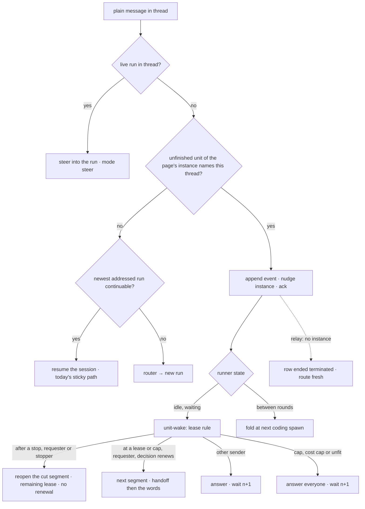

# A thread has one owner and a pipeline idles - the owner rule, the idle unit, the wake, the stop - Plan

## Goal Capsule

- **Objective**: The four units of [record 0051](../decisions/0051-a-thread-has-one-owner-for-its-life-a-message-is-one-event-in-a-chosen-mode-and-a-pipeline-idles-instead-of-ending.md): a thread has one owner for its life and the router runs only when it has none; a plain message into an owned thread is one event the owner receives, never a keyword; a pipeline unit idles at its lease, at a stop or at its cap instead of ending, and the requester's plain reply wakes it; an interrupt is the stop control followed by a message, on both harnesses; and the share of owned threads a person gave up on is measured against the baseline before the model-driven owner is considered.
- **Authority**: record 0051 (accepted, with the decisions its acceptance line names: the walk parks on an idle unit, a stop pauses, no mode is a typed word, a wake after a stop spends no renewal) over the specs it touches; record 0046 as amended by this plan's third unit on what a continuation's request carries; the specs over this plan where they disagree on today's behavior; this plan over the executing agent on sequencing and file boundaries.
- **Execution profile**: eight units in four phases, each one pull request through the review loop, in dependency order. Tests first in every unit. Every unit updates the spec rows it changes in the same pull request and binds them (`file::describe::it`). The executor is the session, or the ship runner per unit when the maintainer seeds it.
- **Stop conditions**: a unit that cannot pass `npm run verify` within its listed files hands back a deviation. Nothing here adds a Worker, a binding or a credential; the events table is a new table in the existing state Worker. The idle wait ships off (`ship.idleDays: 0`) and turns on only in the unit that flips the default after the baseline and the billing answer are recorded. A unit that would abort a call in flight inside its allowance, add a keyword, let the router run on an owned thread, or leave an appended message with no reader in the same release stops and asks.

---

## Product Contract

### Summary

Every thread has an owner: the live run while one is in flight, else the pipeline unit whose row names the thread for as long as that unit has no ending, else the newest continuable session a person addressed, else nobody. A plain message into an owned thread is a thread event on the owner: steered into a live run as today, appended to an unfinished unit's event list and folded into its next coding spawn, or delivered as the next turn of an idle unit. A unit whose segment ends with the unit unfinished, whose child was stopped, or whose grant reached its cap idles: the instance waits under an indexed step name, the plan's later units park behind it, the requester's reply opens the next segment (spending one renewal at a lease or a cap, none after a stop), and anyone else's reply is answered. `runs stop <unit key>` and the idle limit are the only exits. A stop on a live owner is the interrupt: the call in flight finishes, the rest of the turn is dropped with results that say so, the owner idles, and the next message is its next turn. No word in a message selects a mode.

### Problem Frame

A ship unit that stops at its lease leaves its thread with no owner, so the next reply runs the router as if the thread were new and the only continuation is a re-issue of the directive with the same text; twelve of the fifty-nine ship coding children the budget analysis read ended at the clip. A reply between two rounds is a fresh request because nothing owns the gap. The stop card and the renewal card both name a continuation nobody can perform: "re-issue `agent:ship`" and "reply continue", and nothing parses the second. The record's survey and its measurements are recorded on the tracker issue for the wind-down abort.

### Requirements

**The owner rule (record unit one)**

- R1. The owner of a thread is computed where the dispatcher already skips the router for a live thread, from the runs page it already reads plus at most one read of an instance's unit rows, in this order: a live run; the unit of the page's ship run's instance (or a child's `parentInstanceId`) whose row names this thread and has no ending; the newest continuable run a person addressed; none. A coordinator's child never owns a thread; a unit with an ending never does.
- R2. The live ship run's record names its instance from the moment the hand-off creates it, through a run event the record projects (`ship_handoff { instanceId, at }`), and the run view exposes `instanceId`.
- R3. A plain reply into a thread whose owner is an unfinished unit with no live run is appended to the unit's event list (one row per event with a sequence, the durable inbox's 400 KiB cap per event, dropped attachments recorded, and the delivery mode the dispatcher read off the owner's state), the instance is sent a payload-free nudge event, the sender is acked with where the message went, and the router is not called. A directive naming an agent keeps today's meaning.
- R4. In the same release as R3, every appended event has a reader: the runner folds the unconsumed events into the request of every coding spawn, in arrival order with each text attributed to its sender, and marks them consumed by that spawn; a review spawn leaves them; events still unconsumed when the unit ends run as one fresh turn in the thread, as a run's unconsumed follow-ups do.
- R5. A nudge the relay answers with "no such instance", or an instance whose status is complete, errored or terminated, ends the unit row `terminated` so the thread is unowned from then on, and the message routes fresh with a card line saying so; any other send failure keeps the event appended and acks it as queued for the pipeline's next step, and nothing routes fresh.
- R6. A unit whose machine ends in any kind but `merged`, `merge_ready`, `blocked` or `refused` ends `idle` with the old kind as its `why`, its report unchanged, and what a continuation needs on the idle row (`renewalsLeft`, `from`, the last coding child's run id, the spend so far, its handoff), when the resolved `ship.idleDays` is above zero; at zero the old endings stand byte for byte.
- R7. Record 0046 carries a dated amendment: a continuation the machine renews is briefed with the previous handoff alone; a continuation a person woke carries the person's words after the handoff.
- R8. The renewal card's exhausted-grant sentence reads correctly for a grant of one, and a fresh branch whose first push is the base head does not count that push as progress.

**The idle unit (record unit two)**

- R9. The runner blocks on `step.waitForEvent` for the unit's nudge under `<prefix>/idle/<n>`, `n` counted per wait within the segment, with the idle's remaining days as the timeout (the resolved `ship.idleDays` measured from the idle's start, not reset by a wake); a timeout ends the unit `idle_expired`; the hundredth wake that found an event in one idle ends it `idle_expired`.
- R10. On wake the runner calls the bot with the wait's identity (segment and index); the bot reads the unconsumed events once and applies the lease rule: after a stop, the requester's or the stopper's event reopens the cut segment under its remaining lease, spending no renewal (under the lease minimum it falls to the rule below); at a lease or a cap, the requester's event opens the next segment through the `continued` path, with the grant re-resolved from the scopes at that moment and the renewal decision's count, cost-cap and fit clauses all applied, progress set aside, spending one renewal, the events' texts appended to the segment's request after the handoff; another sender's event is answered naming who may spend and spends nothing; with no renewals left every event is answered with the cap, the scope setting that raises it, and the stop that ends the unit. The answer, the consumed marks and the segment row are one durable write keyed by the wait's identity, and a repeated call with the same identity returns the stored answer verbatim.
- R11. The stop card's sentence and the renewal card's stop sentence change to "reply in this thread to continue" in the release that honors it, and only when the resolved flag is above zero; a card never names a continuation the deployment cannot perform. The segment card names the senders whose texts it folded.
- R12. The walk parks on an idle unit: later units wait, the parent card names the idle unit and its thread, and the hand-off's "a runner is still running" refusal names the idle unit's thread and the stop that ends it.
- R13. `runs stop` accepts a unit key beside a run id, authorized as `runs:write` against the instance's ship run, and ends an idle unit `stopped` with the actor and the time on the row; an End action beside the idle card's waiting line and on the unit's row calls it. Typing the word "stop" in a thread is a message, never a stop.
- R14. Before the wait ships on: the count of re-issued instances over the prior thirty days is recorded as the baseline, in two numbers (attempt suffixes, and a second ship instance in the same requesting thread), whether a waiting instance is billed is answered, and the run-finished wake's latency is recorded as the reference the nudge's latency is later measured against.

**The interrupt (record unit three)**

- R15. A soft stop on a live owner lets the call in flight finish, executes none of that turn's remaining tool calls, answers each with a result saying the sender cut the turn short, runs the write-up inside its allowance, aborts nothing inside that allowance, and lands the owner idle with `why: stopped`, on pi and on OpenCode; the finale abort past the allowance is unchanged.
- R16. Every thread event records its delivery mode, read off the owner's state when it arrived and never off the text: `steer` into a live run or between rounds, `wake` into an idle owner, `interrupt` into an owner idle with `why: stopped`; the run that consumes an event copies the mode onto its `input` event with the event's id. No prefix, keyword or command selects a mode.

**The measurement (record unit four)**

- R17. Over the first hundred owned threads or thirty days, whichever comes first, the share of owned threads a person gave up on is read from the unit rows and the instance store and recorded beside the baseline: a thread counts when its unit was ended by `runs stop <unit key>` or the End action, or expired, and the same plan got a new attempt or the same requester posted a new ship request in that thread within the window; under a fifth the state machine stays.

### Scope Boundaries

- Out of scope: the model-driven thread owner (the next record, gated on R17); the router's prompt; a `queue` mode (withdrawn at acceptance: nothing but a keyword could select it today); widening the renewal's holder past the requester; resident hibernation; a thread-key index on the unit rows (the page plus one read is the record's bound).
- Unchanged and built upon: record 0046's renewal decision, segment rows and `continued` ending; thread-admission's steer at the turn boundary; the durable inbox's join; the graded confirmation buttons; the shim relay the checks intake sends events through.
- Not behind the flag, by the record's design: the owner rule, the event list and the fold (R1 to R5) run at `ship.idleDays: 0`; a reply between rounds is folded, not routed fresh. Turning the flag off returns the old endings, not the old routing.
- Deferred to follow-up work: a mode picker on the dashboard composer, which would let `queue` return without a record; a per-unit wait with the walk proceeding to independent units, if parking blocks more than it protects (the record's "what would change our mind"); the visual half of the unit page's End action beyond the header text, which waits for the maintainer's word.

---

## Planning Contract

### Key Technical Decisions

- KTD1. The owner is a pure function over the thread's runs page and one instance's unit rows, beside `stickyAgentOf` in `src/core/dispatch/thread.ts`, and the dispatcher calls it where `threadLive` is computed (session-settled: user-directed — chosen over a router that reads run state: the router costs a model call per reply and reads no run state today; over a session entry on the ship run: the ship run lasts seconds and a session on it would be a name that lies about what can be resumed).
- KTD2. Thread events live in a sibling table of the state Worker, `coordinator_unit_events (instance_id, unit, seq, json, consumed_by)`, with `append`, `list` and `mark-consumed` routes in the `run_inbox` table's shape, exposed on `CoordinatorInstanceStore` beside `putUnits` (chosen over a field on the unit row: every bot route that touches a row reads it, spreads it and puts it whole, and the state Worker's `putUnits` is an upsert that replaces the json, so an append landing between a route's read and its put would be lost; over reusing the durable inbox: it is keyed by run id).
- KTD3. The nudge is a payload-free Workflow event typed `unit-nudge-<instanceId>-<unit>` (the relay's alphabet is letters, digits, `_` and `-`, capped at 100 characters; a colon is refused), sent from the bot through `shimWorkflowSender` over the shim's events relay, the path the checks intake already uses; the dispatcher gains that sender as a dep. Every append nudges, so the send doubles as the liveness probe; a stale nudge that wakes an idle wait and finds nothing is re-waited without counting. The wait's step name is indexed per wait, `<prefix>/idle/<n>`, and the wake call and the post-wait ending are `<prefix>/idle/<n>/wake` and `<prefix>/idle/<n>/end`, because a step name reused inside one instance is answered from the durable step cache (chosen over one wait per unit and over reusing `<prefix>/end`: a second nudge or a second ending would be answered from the cache).
- KTD4. `idle` is a unit ending kind the machine emits in place of the idling kinds when `idleDays` is above zero, carrying `why` (the old kind), the old kind's report, the renewal facts and what the `continued` loop needs to open the next segment (the last coding run id, the spend, the handoff); the driver's `walk` treats `idle` like `continued`, looping into the wait rather than settling the unit (chosen over a second state on the row alone: the ending is what the runner switches on, and the report keeps its sentence).
- KTD5. The flag is `ship.idleDays`, an integer from 0 to 365 on the org, a channel or a user, resolved user over channel over org like the grant, `0` meaning today's behavior; it ships at `0` and moves to `7` in the unit that lands after the baseline and the billing answer (session-settled: user-directed — the walk parks on an idle unit; chosen over a boolean plus a separate days setting: one number is both the switch and the limit).
- KTD6. The wake is an admin route, `unit-wake`, called with the wait's identity, that reads the unconsumed events, applies the lease rule and answers `segment` (with everything the `continued` path needs), `answered`, `stopped` or `expired`; the answer is stored on the unit row keyed by the wait's identity in the same durable write as the consumed marks and the segment row, so a replayed step gets the same answer; the runner performs the answer as a durable step, so the lease rule lives with the other bot steps and the Workflow stays a thin driver (chosen over deciding in the driver: the driver reaches nothing but the bot). A wake the bot cannot answer after the step's retries re-enters the wait under the next index; a bot outage never ends an idle unit.
- KTD7. A stop pauses: the machine's `stopped` ending is one of the idling kinds, the idle card carries an End action, and the only exits are `runs stop <unit key>` and the idle limit (session-settled: user-directed — chosen over stop ends the unit: a stopped thread's next message would spawn a stranger with no memory, which is the defect the record removes; over a second keyword: the maintainer's rule is no keyword). A wake after a stop reopens the cut segment under its remaining lease and spends no renewal, because the cut segment's lease was not spent; under the lease minimum it falls to the lease rule (record 0051, the acceptance line).
- KTD8. `runs stop` takes one positional that is a run id or a unit key (`<instanceId>:<unit>`, `parseUnitKey`), `--mode` defaulting to `soft` for a run; a unit key is authorized through `getVisibleRun` against the instance's ship run and performed as a bot step, a `unit-stop` route that writes the row's ending with the actor and sends the nudge with the bot's sender, which every surface reaches over the ingress; the End button is a `block_actions` click registered as `unit.end` with its own handler that invokes the command (chosen over a new command: a unit's stop is the same verb, and the conformance suite covers the new argument shape; over performing the stop in the command: the CLI and MCP surfaces hold neither the store nor the relay's credential).
- KTD9. The interrupt is the existing soft stop, honored by both harnesses as today, plus two changes: the cut-short wording on the refused tool results and the `stopped` ending idling instead of ending (chosen over a new abort primitive or a `!interrupt` prefix: item 2 of thread-admission holds, and no word in a message selects a mode). The finale abort past the write-up's allowance stays: it is the lease's, not the stop's.
- KTD10. The grant is re-resolved from the scopes at every wake, so raising `ship.grant` after a unit idles at its cap lets the requester's next reply open a segment, the Managed Agents shape the record cites (chosen over the grant frozen on the instance record: the cap answer would name a setting that cannot revive the instance).
- KTD11. The mode is recorded on the thread event at append time from the owner's state, and copied onto the consuming run's `input` event; it is a receipt, never a switch (chosen over a mode field the sender fills: nothing but a keyword could fill it).

### High-Level Technical Design



The idle wait inside the runner, one unit:

```mermaid
sequenceDiagram
  participant D as driver (Workflow)
  participant B as bot (admin routes)
  participant T as thread
  D->>B: unit-end {ending: idle, why, renewalsLeft, from, runId, spendUsd, handoff}
  B->>T: idle card: "no progress in the last lease; grant holds 5; reply in this thread to continue" + End
  D->>D: waitForEvent U1/idle/1 (timeout: the idle's remaining days)
  T-->>B: teammate reply → event seq 1 (mode wake) · nudge
  D->>B: unit-wake {segment 2, n 1}
  B-->>D: answered ("the grant's renewals are the requester's to spend; 5 left")
  D->>D: waitForEvent U1/idle/2
  T-->>B: requester reply → event seq 2 (mode wake) · nudge
  D->>B: unit-wake {segment 2, n 2}
  B-->>D: segment {index 3, from a1b2c3d, runId, spendUsd, handoff, texts, senders}
  D->>D: runUnit(session: segment 3, previousHandoff + the words)
```

### Sequencing

Phase A (record unit one): U1 → U2 → U3, each a pull request; U3 may land beside U2 but not in the same pull request, since both touch `renewal.ts`. Phase B (record unit two): U4 first (measurements, no product code; may start at once), then U5 → U6; U6 flips the default to seven days only after U4's billing answer and baseline are on the tracker issue. Phase C (record unit three): U7, after U5. Phase D: U8, thirty days or a hundred owned threads after U6 is live. Phase E (the amendment of 2026-09-18): U9, after U5 and U6, its measurement rows landing beside U8's. Every unit rebases onto main before verify.

### Risks and Dependencies

- The dispatcher's thread read is skipped for a parent, a coordinator spawn, a resume, a restart and an empty history; the owner rule must slot in after that skip and never run for a coordinator's own spawn (thread-admission item 8), or a child's brief would be steered into itself. A surface whose history read is empty routes fresh even into an owned thread; the record scopes the rule to channels that carry a thread history.
- `readThread` reads at most eight runs; a pipeline thread that accumulates eight addressed runs after its last child loses the ship run and every child from the page, and the owner falls to the sticky session. R1 allows one more read through any child's `parentInstanceId` on the page; a thread-key index on the rows is out of scope and would remove the dependence.
- U1 is over 400 changed lines (the events table, the owner rule, the dispatcher branch, the fold, the handoff event and their tests); the split considered, the append in one release and the fold in the next, was rejected because a release between them strands every reply into a pipeline thread behind an ack. The pull request says so.
- Adding a `UnitEnding` kind ripples to every exhaustive switch (`renderUnitReport`, the report cases, `unitLines`, `unitFactsOf`, the `ship_round` vocabulary consumers); U2 lists the sites and keeps the old kinds in the vocabulary for rows already written.
- A step name that changes before a completed step breaks a resumed instance; the idle steps are appended after the segment's existing names and never rename one. Whether a completed `waitForEvent` step counts as completed for that rule is an open question below.
- The Workflow's `waitForEvent` default timeout is 24 hours; the wait must pass the idle's remaining days explicitly, capped at the platform's 365.
- Whether a waiting instance is billed is unconfirmed; U6 does not flip the default before U4 answers it, and a billed wait shrinks the default to one day.
- `runs.stop` is a destructive command with a conformance row per surface; a second positional shape adds rows, and `parseUnitKey` must refuse a run id that happens to contain a colon.
- Slack's click intake is registered for `confirm.` actions and ends in the confirmation store; `unit.end` needs its own registration and handler, never `dispatchClick`.
- Two writers of segment rows after U5 (`unit-end` for a machine renewal, `unit-wake` for a person's wake) share the once-per-index guard.

---

## Implementation Units

### U1. The owner rule, the ship run's instance id, the event list, the nudge and the fold

- **Goal**: the dispatcher computes the thread's owner where it already decides `threadLive`; a plain reply into a thread owned by an unfinished unit with no live run is appended to the unit's event list with its mode, the instance is nudged, the sender is acked, and the router is never called; the runner folds unconsumed events into every coding spawn and runs the leftovers as one fresh turn at the unit's end; a nudge that finds no instance ends the row `terminated` and routes fresh; the live ship run's record names its instance from the hand-off and the view exposes it; a directive naming an agent keeps today's meaning.
- **Requirements**: R1, R2, R3, R4, R5, R16 (the recording half), KTD1, KTD2, KTD3, KTD11 (thread-admission items 1, 4, 5 and a new item for the owner rule; routing-and-config items 3 and 21; run-history items 2 and 48; http-ingress item 9 for the nudge and the events routes).
- **Dependencies**: none.
- **Files**: `src/core/dispatch/thread.ts` (`ownerOf(runs, unitsOf)`: live run, unfinished unit, continuable session, none; `instanceOf(runs)` from `instanceId` or `parentInstanceId`), `src/core/dispatch/thread.test.ts`, `src/core/dispatcher.ts` (the branch between the thread read and `routeRequest`: an owned-by-unit thread appends with the mode read off the row, nudges, branches on the relay's answer, acks and returns before the router and the agent gate; a directive naming an agent falls through to today's path), `src/core/dispatcher.test.ts`, `src/core/dispatch/run.ts` (`CoreDeps.workflow?: WorkflowSender`), `src/index.ts` (the sender already built for the webhook handler passed into deps), `src/core/coordinator/instancesClient.ts` (`shimWorkflowSender`, reused), `src/core/dispatch/ship.ts` (`ship_handoff { instanceId, at }` published after `handOffToCoordinator` succeeds), `src/core/dispatch/ship.test.ts`, `src/core/runEvents.ts` (the `ship_handoff` event; `input.mode` and `input.consumed` for the consuming run), `src/core/runRecord.ts` (`RunRecord.instanceId` projected like `coordinator_tag`), `src/core/runsService.ts` and `src/core/runsService.test.ts` (`RunView.instanceId`), `src/core/runEventLines.ts` (the two events render one line each), `src/core/coordinator/contract.ts` (`ThreadEvent {seq, id, sender, text, attachments, mode, at, consumedBy?}`, `unitNudgeEventType({instanceId, unit})`, the validators), `src/core/coordinator/contract.test.ts` (the event type matches the relay's pattern for the longest legal ids), `src/core/coordinator/instanceStore.ts` (`appendEvent`, `listEvents(unitKey, unconsumedOnly)`, `markConsumed(unitKey, seqs, by)` on the in-memory and the Worker store), `src/core/coordinator/instanceStore.test.ts`, `deploy/cloudflare-memory/worker.ts` (the `coordinator_unit_events` table and its three routes, the `run_inbox` shape), `deploy/cloudflare-memory/runLedger.test.ts`, `src/channels/adminCoordinator.ts` (`spawn` for a coding preset lists unconsumed events, folds them through the durable inbox's join with each text attributed to its sender, marks them consumed by the spawn's step; `unit-end` with a final ending runs the leftovers as one fresh turn through the dispatcher's settle path and marks them consumed by that run; the terminated branch's row write), `src/channels/adminCoordinator.test.ts`, `src/core/dispatch/admission.ts` and `src/core/dispatch/admission.test.ts` (the fold reused for thread events), `docs/reference/specs/thread-admission.md`, `docs/reference/specs/routing-and-config.md`, `docs/reference/specs/run-history.md`, `docs/reference/specs/http-ingress.md`.
- **Approach**:
  1. Tests first, red against today: a page whose ship run names an instance with an unfinished unit for this thread yields that unit as owner and the router is not called; a page whose unit has an ending yields the sticky session or none; a coordinator's child is never the owner; a live run outranks the unit; `agent:review <url>` in an owned thread runs today's path; the appended event carries sender, text, attachments, mode `steer` (no idle mark on the row) and a sequence; the nudge is sent once per event; the ack names the unit and its thread; two events before a fix spawn appear in the child's request in arrival order, each attributed to its sender, and are marked consumed by that spawn's step; a review spawn leaves them; an event unconsumed at a `merge_ready` ending runs as one fresh turn and is marked consumed by that run; a spawn replayed after a reclaim folds nothing twice; a relay answer of "no instance" ends the row `terminated` and routes the message fresh with the card line; a 502 keeps the event and acks it as queued.
  2. `ownerOf` is pure over `RunView[]` and a `readUnits(instanceId)` the caller supplies; the dispatcher supplies `deps.coordinatorInstances.listUnits` and passes the page it already read. The read happens only when the page names an instance.
  3. The ship fork publishes `ship_handoff` after the hand-off succeeds; `runRecord.ts` projects it onto `instanceId` the way `coordinator_tag` is projected; `parentRunRecord` at finish is unchanged; the view exposes `instanceId` beside `parentInstanceId`.
  4. The events table: `append` assigns the sequence and enforces the per-event cap, recording dropped attachments; `list` filters unconsumed; `mark-consumed` sets `consumed_by` for named sequences. The store methods wrap the routes; the in-memory store mirrors them for tests.
  5. The dispatcher nudges with `deps.workflow.sendEvent(instanceId, { type: unitNudgeEventType(key) })` and branches on the answer: `absent`, or an instance status of complete, errored or terminated read through the status route, writes `ending { kind: "terminated" }` on the row and routes fresh with the card line; any other failure leaves the event appended and acks it as queued for the pipeline's next step.
  6. The fold: `spawn` for a coding preset reads unconsumed events before composing the brief, appends them after the brief's existing follow-ups as `<sender>: <text>` in arrival order, and marks them consumed by the spawn's step name in the same durable step; a review spawn reads nothing. `unit-end` with a final ending (`merged`, `merge_ready`, `blocked`, `refused`, and every old kind while the flag is off) lists the leftovers and hands them to the dispatcher's settle path as one fresh turn, marking them consumed by that run's id.
  7. Spec rows: thread-admission item 1 (a reply into a pipeline's thread reaches the unit), item 4 (leftovers at the unit's end), item 5 (the fold before a coding spawn; consumed once) and the new owner item; routing-and-config item 3 (the unit outranks the session) and item 21 (the router runs only for an unowned thread); run-history item 2 (`ship_handoff`, `input.mode`) and item 48; http-ingress item 9 (the nudge event, the events routes).
- **Execution note**: the append, the nudge and the fold land in one release so no appended event lacks a reader; the pull request is over 400 lines and says so. Land the events table and store first as its own commit, the owner rule and dispatcher branch second, the fold third, each reviewable alone.
- **Patterns to follow**: `stickyAgentOf` and `addressed` in `thread.ts`; the `threadLive` block and the `routing.kind === "command"` early return in `dispatcher.ts`; the `run_inbox` table and routes in `deploy/cloudflare-memory/worker.ts`; `durableInboxMessage` and `DURABLE_INBOX_MAX_BYTES`; `unitKeyOf`, `parseUnitKey`, `runFinishedEventType`; `sendChecksSettled` in the checks intake for the bot-side send; `coordinator_tag`'s projection for the handoff event; `foldCarriedInbox`.
- **Test scenarios**:
  - `thread.test.ts`: owner is the live run when one is live; the unfinished unit when the page's ship run names its instance and the row names this thread; the unfinished unit when only a child's `parentInstanceId` names it; the sticky session when every unit for the thread has an ending; none on an empty page; a coordinator's child is never the owner; a unit row for another thread is not the owner.
  - `dispatcher.test.ts`: a plain reply into a unit-owned thread with no live run appends one event with mode `steer`, sends one nudge, acks, calls no router and starts no run; attachments over the cap are recorded dropped; `agent:review <url>` runs today's path; a reply into a thread whose unit has ended routes fresh; the relay's "no instance" ends the row `terminated` and routes fresh with the card line; a 502 keeps the event, acks it as queued and routes nothing.
  - `ship.test.ts` and `runsService.test.ts`: `ship_handoff` is published after a successful hand-off and none after a refusal; the view exposes `instanceId`; a record written before the event has none.
  - `contract.test.ts`: the nudge type matches the relay's pattern for the longest legal instance id and unit; a colon never appears.
  - `instanceStore.test.ts` and `runLedger.test.ts`: append assigns sequences in order and caps per event; list filters unconsumed; mark-consumed is idempotent; a put of the unit row leaves the events untouched; both stores agree.
  - `adminCoordinator.test.ts`: the fold before a fix spawn with two senders; no fold before a review spawn; leftovers at a final ending run once as a fresh turn; a replayed spawn folds nothing twice.
- **Verification**: the test files green, red first; `npm run specs:check`; `npm run verify`.

### U2. The idle ending on the unit machine, the idle row, the unit page's fact, and the flag

- **Goal**: with `ship.idleDays` above zero, every ending but `merged`, `merge_ready`, `blocked` and `refused` becomes `idle` with the old kind as `why`, the report unchanged, and what a continuation needs on the row; the flag is validated and resolved like the grant and ships at zero; the unit's facts and page show `idle · <why>`; the cards do not change yet.
- **Requirements**: R6, KTD4, KTD5 (agent-ship item 8 and the `Budgets` bullet; routing-and-config item 2; run-history item 50).
- **Dependencies**: U1 (the events table beside the row; the view's `instanceId`).
- **Files**: `src/core/ship/coordinator.ts` (`UnitEnding` gains `idle {why, report, renewalsLeft, from?, runId, spendUsd, handoff?, round?, reviewRounds}`; `end()` maps an idling kind to `idle` when the input's `idleDays > 0`; `renderUnitReport` keeps the old kind's sentence), `src/core/ship/coordinator.test.ts`, `src/core/shipPipeline.ts` (`resolveIdleDays` beside `resolveGrant`), `src/core/budgets.ts` (`IDLE_DAYS_DEFAULT = 0`, `IDLE_DAYS_MAX = 365`, `IDLE_WAKES_MAX = 100`), `src/config/validate.ts` (`ship.idleDays` on the org and on a scope, refused by name outside 0 to 365), `src/config.test.ts`, `src/config/profile.ts` and `src/config/profile.test.ts` (the scope field), `src/core/coordinator/contract.ts` (`CoordinatorInstance.idleDays`, `CoordinatorUnit.idle {why, at, renewalsLeft, from?, runId, spendUsd, handoff?, wakes}`), `src/core/coordinator/driver.ts` (an `idle` ending is settled as today's `failed` for now, so the walk is unchanged until U5), `src/core/coordinator/driver.test.ts`, `src/channels/adminCoordinator.ts` (`plan` answers `idleDays`; `unit-end` writes the idle row from the ending, storing the coding run id it receives today; `unitLines` shows `idle · <why>`), `src/channels/adminCoordinator.test.ts`, `src/core/dispatch/ship.ts` (resolves `idleDays` at the fork onto the instance), `src/core/runEvents.ts` (`ShipRoundOutcome` gains `idle`), `src/core/unitRuns.ts` and `src/core/unitRuns.test.ts` (`UnitFacts.idle {why, at, renewalsLeft, wakes}`), `web/src/pages/UnitPage.vue` and `web/src/components/run/RunUnitsBlock.vue` (the header reads `idle · <why>`), every exhaustive switch the compiler names, `docs/reference/specs/agent-ship.md`, `docs/reference/specs/routing-and-config.md`, `docs/reference/specs/run-history.md`.
- **Approach**:
  1. Tests first, red against today: with `idleDays: 7` a `wall_clock_cap` ending is `idle` with `why: wall_clock_cap`, the same report, `renewalsLeft` from the grant, `from` from the recorded head, the last coding run id, the spend and the handoff; a `merge_ready` ending is unchanged; with `idleDays: 0` every ending is byte for byte today's; `ship.idleDays: 400` is refused naming the path; a user's 3 outranks a channel's 7; `unitFactsOf` carries `idle`.
  2. Map the kinds in one place, `idlingKind(kind)`, used by `end()`; the old kind rides `why` and the `ship_round` vocabulary keeps it for rows already written.
  3. The flag resolves at the fork onto the instance record, is answered by the `plan` route, and reaches the machine through `UnitPipelineInput`, as the grant does.
  4. Spec rows: agent-ship item 8 (the idle ending, the flag), the `Budgets` bullet (idle days beside the grant); routing-and-config item 2 (the scope field); run-history item 50 (the idle row beside the segment rows).
- **Execution note**: nothing waits yet, so with the flag on an idle unit still settles the walk as failed in this unit; the test that asserts it is replaced in U5. Say so in a code comment naming this plan's fifth unit. The unit page change is the header's text only; anything more waits for the maintainer.
- **Patterns to follow**: the `continued` ending and `capEnding` in `coordinator.ts`; `resolveGrant` and `grantProblem`; the `segments` row write in `unit-end`; `readGrant` clamping in the driver; `unitFactsOf`.
- **Test scenarios**:
  - `coordinator.test.ts`: each idling kind maps to `idle` with itself as `why`, its report intact and the continuation facts filled at `idleDays: 7`; the four ended kinds never map; at `idleDays: 0` nothing maps.
  - `config.test.ts`: `ship.idleDays` accepts 0 and 365, refuses 366, -1 and a string, on the org and on a channel scope; resolution is user over channel over org.
  - `adminCoordinator.test.ts`: `unit-end` with an `idle` ending writes `idle {why, at, renewalsLeft, from, runId, spendUsd, handoff, wakes: 0}` and no `ending`; `unitLines` shows `idle · wall_clock_cap`; the `plan` route answers `idleDays`.
  - `unitRuns.test.ts`: the facts carry `idle`; a row without it carries none.
  - `driver.test.ts`: an `idle` ending settles the unit `failed` in this unit (replaced in U5).
- **Verification**: the test files green, red first; `npm run specs:check`; `npm run screenshots:check` after the header change; `npm run verify`.

### U3. The 0046 amendment and the two renewal nits

- **Goal**: record 0046 carries a dated amendment naming what a continuation's request carries when a person woke it; the renewal card's exhausted-grant sentence reads correctly for a grant of one; a fresh branch's first push at the base head is not progress.
- **Requirements**: R7, R8 (agent-ship item 8; record 0046 Renewal).
- **Dependencies**: none; lands beside U2 in its own pull request.
- **Files**: `docs/decisions/0046-a-budget-is-a-lease-carved-from-its-parent-and-one-module-proves-the-leases-fit.md` (an appended `## Amended` section with the re-evaluation the documentation rules ask for), `src/core/ship/renewal.ts` (`renewalDecision`'s grant-of-one detail; `progressOf` compares the pushed head against the branch's start head, which on a fresh branch is the base head), `src/core/ship/renewal.test.ts`, `docs/reference/specs/agent-ship.md`.
- **Approach**:
  1. Tests first, red against today: a grant of one spent reads "the grant's 1 renewal is spent"; a unit whose branch started at the base head and whose only push is that head reports no progress; a push of a different head after the lease started reports progress.
  2. The amendment restates why 0046 was accepted, checks the change (the person's words after the handoff) against it, and names this plan; `decisions:check` passes on an appended section.
- **Patterns to follow**: 0046's existing `## Amended` section; `progressOf`'s `startHead` input.
- **Test scenarios**:
  - `renewal.test.ts`: grant of one, spent, singular sentence; grant of two, spent, plural; fresh branch, push equals base head, `by: none`; push of a new head after the lease start, `by: push`.
- **Verification**: the test file green, red first; `npm run decisions:check`; `npm run hygiene:check`; `npm run verify`.

### U4. The baseline, the billing answer and the reference latency

- **Goal**: before the wait ships on: the count of re-issued instances over the prior thirty days is recorded as the baseline in two numbers; whether a waiting Workflow instance is billed is answered; the run-finished wake's latency is recorded as the reference the nudge is measured against in U5.
- **Requirements**: R14.
- **Dependencies**: none.
- **Files**: none; the results are recorded on the tracker issue for the wind-down abort, and U6 writes the default they decide.
- **Approach**:
  1. From the instance store: every instance id with an attempt suffix in the window, grouped by plan id (the first number); every ship instance whose requesting thread key matches an earlier ship instance's in the window, whatever its plan id, since a paraphrased re-ask gets a new id (the second number); both with the share of plans they represent.
  2. The platform's limits and pricing pages, then a support ask if they do not say: is a waiting instance billed, and does it count against concurrency.
  3. From one deployed instance's log: the time from a child's terminal record commit (the state Worker's `sendRunFinished`) to the `read-record` step's start, the wake the nudge is compared with in U5.
- **Execution note**: read-only against production; no pull request.
- **Patterns to follow**: the audit recipe recorded on the tracker issue; `handOffToCoordinator`'s attempt suffix and `generatedPlanId`.
- **Test scenarios**: `Test expectation: none -- a measurement unit; the default it decides is written and tested in U6`.
- **Verification**: the two baseline numbers, the billing answer and the reference latency posted on the tracker issue with their sample sizes.

### U5. The indexed wait, the wake route, the lease rule and the cards that follow the flag

- **Goal**: an `idle` ending no longer settles the walk: the driver blocks on `waitForEvent` under `<prefix>/idle/<n>` for the idle's remaining days; on the nudge it calls `unit-wake` with the wait's identity, and the route reads the unconsumed events, applies the lease rule with the grant re-resolved and answers `segment`, `answered`, `stopped` or `expired`, storing the answer keyed by the wait so a replay reads it back; the driver opens the next segment through the `continued` path with the texts appended after the handoff, or reopens the cut segment under its remaining lease after a stop, waits again, or ends the unit `idle_expired`; the walk parks behind the idle unit and the parent card names it; the stop card, the renewal card and the interrupted note say "reply in this thread to continue" when the flag is on; the segment card names the senders folded.
- **Requirements**: R9, R10, R11, R12 (the parking half), KTD3, KTD4, KTD6, KTD7 (the wake half), KTD10 (agent-ship items 8 and 16; http-ingress item 9; run-history item 50; thread-admission item 5).
- **Dependencies**: U1, U2, U4.
- **Files**: `src/core/coordinator/driver.ts` (`runUnit` returns `idle`; `walk`'s loop handles `idle` beside `continued`: wait under `<prefix>/idle/<n>` with the remaining days, call `unit-wake` under `<prefix>/idle/<n>/wake`, perform the answer, write a final ending under `<prefix>/idle/<n>/end`; a wake that throws after the step's retries re-enters the wait under the next index; the `UnitSession` for a woken segment built as the `continued` loop builds it, plus a `resume` of the cut segment's remaining lease after a stop), `src/core/coordinator/driver.test.ts`, `src/core/coordinator/contract.ts` (`UnitWakeAnswer`: `segment {index, from?, runId, spendUsd, handoff?, texts, senders, leaseMs?}`, `answered {reply}`, `stopped`, `expired`; `CoordinatorUnit.wakes: Record<waitId, UnitWakeAnswer>`), `src/core/coordinator/contract.test.ts`, `src/channels/adminCoordinator.ts` (`unit-wake`: read the stored answer for the wait identity first; else list unconsumed events, re-resolve the grant from the scopes, branch on the idle's `why` and the senders, call `renewalDecision` with progress set aside for the lease and cap kinds, compute the remaining lease for a stop, write the answer, the consumed marks and the segment row in one durable write; `unit-end` on `idle_expired` and on the reopened segment; the parent card's idle line), `src/channels/adminCoordinator.test.ts`, `src/core/ship/renewal.ts` (`renewalDecision` accepts progress set aside; `renderRenewal` takes the flag and the folded senders), `src/core/ship/renewal.test.ts`, `src/core/ship/coordinator.ts` (`UnitEnding` gains `idle_expired`; `renderUnitReport`'s continuation line and `shipInterruptedNote` follow the flag; a session may carry a `resume` lease), `src/core/ship/coordinator.test.ts`, `src/core/coordinator/briefs.ts` (`continuationPreface` appends the senders' words after the handoff), `src/core/coordinator/briefs.test.ts`, `src/core/budgets.ts` (`leaseMinimum` reused for the stop's remainder), `docs/reference/specs/agent-ship.md`, `docs/reference/specs/http-ingress.md`, `docs/reference/specs/run-history.md`, `docs/reference/specs/thread-admission.md`.
- **Approach**:
  1. Tests first, red against today, over a scripted `StepRunner`: an `idle` ending waits under `U1/idle/1` with the idle's remaining days; a nudge whose wake answers `answered` waits under `U1/idle/2` with the days that remain; a wake answering `segment` opens segment three with the texts after the handoff, the previous run id and handoff in the session, renewals spent by one; a wake answering `segment` with `leaseMs` after a stop reopens the cut segment under that lease with renewals unchanged; a wake answering `expired` or a timeout ends `idle_expired` under `U1/idle/<n>/end`; the hundredth wake that found an event ends `idle_expired`; a wake that throws past the retries re-enters the wait; a replayed wake step returns the stored answer and writes nothing; later units do not start while a unit is idle.
  2. The lease rule in `unit-wake`, in order: a stored answer for the wait identity is returned verbatim; no unconsumed events, `answered` with nothing to say and the wake not counted; the idle's `why` is `stopped` and the newest unconsumed event is from the requester or the actor who stopped it, `segment` reopening the cut segment under its remaining lease when that is at least the lease minimum, spending no renewal; otherwise the newest unconsumed event is the requester's, `renewalDecision` over the re-resolved grant, the segment rows and the spend with progress set aside, `segment` on `renew: true` with every unconsumed text attributed to its sender in arrival order, or `answered` with `renderRenewal`'s sentence for `grant_exhausted`, `cost_cap` or `unfit`, plus the scope setting and `runs stop <unit key>`; only other senders, `answered` with "the grant's renewals are the requester's to spend; N left". Every consumed event is marked with the answer or the segment index in the write that stores the answer.
  3. The segment's request is the previous handoff, then the senders' words as `<sender>: <text>`, as U3's amendment says; the coding child sees the instance's requester as today. The card reads "renewal N of M, continues <sha>, with K messages from <senders>".
  4. The cards: `renderUnitReport`'s continuation line, `renderRenewal`'s stop sentence and `shipInterruptedNote` say "reply in this thread to continue" when the flag is on and today's words when it is off; the parent card gains a line naming the idle unit and its thread while any unit is idle.
  5. Spec rows: agent-ship item 8 (idle, wake, the lease rule, the stop's remainder) and item 16 (the parent card, the sentence following the flag); http-ingress item 9 (`unit-wake`); run-history item 50 (the stored answers, consumed marks, `wakes`); thread-admission item 5 (a thread event is consumed once).
- **Execution note**: the idle steps are added after the segment's existing step names; do not rename `${prefix}/end`. List the step names of one idle-wake-segment cycle in the pull request.
- **Patterns to follow**: `waitForRun` and the `while (ending.kind === "continued")` loop in `driver.ts`; `unit-end`'s segment row write and its once-per-index guard; `readGrant`; `renewalDecision` and `renderRenewal`; `continuationPreface`; `leaseMinimum`.
- **Test scenarios**:
  - `driver.test.ts`: the ten scenarios in step 1, plus an `idle` ending at `idleDays: 0` is never emitted by the machine.
  - `adminCoordinator.test.ts`: `unit-wake` on each branch of step 2; a second call with the same wait identity after a reclaim returns the identical `segment` answer and writes nothing; a call with the next identity and no unconsumed events answers `answered` with nothing to say and does not count; a grant raised on the scope after the idle lets the requester's reply open a segment; a stopper who is not the requester reopens a stopped segment; a stop whose remainder is under the lease minimum falls to the lease rule; `cost_cap` and `unfit` are answered with their sentences; the parent card names the idle unit.
  - `renewal.test.ts`: the decision with progress set aside still refuses on the cap and the fit; the sentences follow the flag; the senders line.
  - `coordinator.test.ts`: the continuation line and the interrupted note follow the flag; a session with a `resume` lease runs under it.
  - `briefs.test.ts`: a person-woken continuation's request is the handoff then the attributed words; a machine-renewed one is the handoff alone.
- **Verification**: the test files green, red first; `npm run specs:check`; `npm run verify`; live, one nudge across a bot roll read at the wait, timed from the send to the wait's return against U4's reference latency (human-gated, on the tracker issue).

### U6. `runs stop` on a unit key, the End action, the re-issue refusal, and the default flips to seven days

- **Goal**: `runs stop` accepts a unit key beside a run id and ends an idle unit `stopped` with the actor and the time so the walk proceeds, performed as a bot step every surface reaches over the ingress; the idle card carries an End button and the unit's row an End action, both calling it; the hand-off's still-running refusal names the idle unit's thread and the stop; the word "stop" in a thread is a message; the default `ship.idleDays` moves from 0 to 7 once U4's answers are recorded.
- **Requirements**: R12 (the refusal half), R13, KTD5, KTD7, KTD8 (agent-ship item 8; command-registry's `runs stop` row; slack-channel's confirm-button rows; run-history item 50; the hand-off's refusal row).
- **Dependencies**: U5, U4.
- **Files**: `src/core/commands/runs.ts` (`runsStop`'s positional accepts `<run id> | <instanceId>:<unit>`; `--mode` optional, `soft` default for a run and refused for a key; a key is authorized through `getVisibleRun` against the instance's ship run for `runs:write` and performed through the `unit-stop` route over the ingress), `src/core/commands/runs.test.ts`, `src/core/commandConformance.test.ts` (rows for the new argument shape on every surface), `src/channels/adminCoordinator.ts` (`unit-stop`: writes `ending {kind: stopped, actor, at}` on an idle row, refuses a live or ended unit naming its state, sends the nudge with the bot's sender; `unit-wake` answers `stopped` when the row was ended by the command; the idle card's End button), `src/channels/adminCoordinator.test.ts`, `src/channels/slack.ts` (`app.action(/^unit\./)` with its own handler that resolves the key, authorizes the clicker and invokes the command, never the confirmation store), `src/channels/slack.test.ts`, `src/core/unitRuns.ts` (the End action's data contract on `UnitFacts.idle`; the button itself waits for the maintainer), `src/core/coordinator/handOff.ts` (the refusal names the idle unit's thread and `runs stop <unit key>`), `src/core/coordinator/handOff.test.ts`, `src/core/coordinator/driver.ts` and `src/core/coordinator/driver.test.ts` (a wake answering `stopped` settles the unit), `src/core/budgets.ts` (`IDLE_DAYS_DEFAULT = 7`, or 1 if U4 found the wait billed), `docs/reference/specs/agent-ship.md`, `docs/reference/specs/command-registry.md` (the `runs stop` row), `docs/reference/specs/slack-channel.md` (the `unit.end` button), `docs/reference/specs/run-history.md`.
- **Approach**:
  1. Tests first, red against today: `runs stop plan-abc:U1` by a caller with `runs:write` on the instance's ship run ends the idle unit `stopped` with the actor and the walk proceeds to the next unit; `runs stop <run id>` without `--mode` is soft; `runs stop plan-abc:U1 --mode hard` is refused (a unit has one ending); a key naming a unit that is live or ended is refused naming its state; a caller without `runs:write` on the ship run is refused as today; the End click carries the unit key and calls the same command; a thread reply reading "stop" is appended like any text; a re-issue into a plan with an idle unit is refused naming the unit's thread and the stop command, and a re-issue into a plan with a live unit is refused as today.
  2. `unit-stop` writes the ending on the row and nudges; `unit-wake` finds the ending and answers `stopped`; the driver writes the final ending under `<prefix>/idle/<n>/end` and the walk proceeds.
  3. The default flips in `budgets.ts` with the production config document read first for an explicit `ship.idleDays` that would override it.
  4. Spec rows: agent-ship item 8 (the exits); the `runs stop` row (the key, the default mode, the authorization resource); the `unit.end` button beside the confirm buttons; run-history item 50 (the ending written by the command, with its actor); the hand-off's refusal wording.
- **Execution note**: the dashboard's End action ships its data contract here; the button waits for the maintainer's word on the visual change.
- **Patterns to follow**: `getVisibleRun` and the destructive annotation in `runs.ts`; the `confirm.run` click registration in `slack.ts` as the shape to mirror, not reuse; the command conformance suite's per-surface rows; the still-running refusal in `handOff.ts`.
- **Test scenarios**:
  - `runs.test.ts` and `commandConformance.test.ts`: the eight scenarios in step 1 on the chat, CLI, API and MCP surfaces.
  - `slack.test.ts`: a `unit.end` click resolves the key, authorizes, calls the command and redraws the card; an unauthorized click is refused with today's wording; a `confirm.` click is unaffected.
  - `adminCoordinator.test.ts`: `unit-stop` on an idle row, a live row and an ended row.
  - `handOff.test.ts`: the two refusals.
  - `driver.test.ts`: a wake answering `stopped` settles the unit and the next unit starts.
- **Verification**: the test files green, red first; `npm run specs:check`; `npm run verify`; live, one idle unit ended by the button and one by the command, receipts on the tracker issue (human-gated).

### U7. The interrupt is the stop control followed by a message, on both harnesses

- **Goal**: a soft stop on a live owner lets the call in flight finish, executes none of the turn's remaining tool calls, answers each with a result saying the sender cut the turn short, runs the write-up inside its allowance with no abort inside it, and lands the owner idle with `why: stopped`; the finale abort past the allowance is unchanged; a thread event into an owner idle with `why: stopped` records `interrupt`; no word selects any mode.
- **Requirements**: R15, R16, KTD9, KTD11 (harness item 11 rows; harness-pi's stop item and harness's OpenCode rows; thread-admission item 2; run-history item 2).
- **Dependencies**: U5 (the idle the stop lands in).
- **Files**: `src/core/harness/windDown.ts` (`softStopNote`, the refused tool result's wording: "the sender cut this turn short; no more tool calls"), `src/core/harness/pi/harness.ts` (the gate's refusal during a soft stop carries the wording; the finale abort untouched), `src/core/harness/opencode/bridge.ts` (the same), `src/core/harness/testing/scenarios.ts` (rows: `a soft stop lets the call in flight finish and cuts the turn short`, `no word in a follow-up is a stop`, `the finale abort past the allowance is unchanged`), `src/core/harness/pi/testing/driver.ts` and `src/core/harness/opencode/testing/driver.ts`, `src/core/harness/conformance.test.ts`, `src/core/dispatcher.ts` (records `interrupt` on the event when the row is idle with `why: stopped`, `wake` when idle otherwise), `src/core/dispatcher.test.ts`, `src/core/runEventLines.ts` and `src/core/runEventLines.test.ts` (the line names the mode), `docs/reference/specs/harness.md` (including the OpenCode rows), `docs/reference/specs/harness-pi.md`, `docs/reference/specs/thread-admission.md`, `docs/reference/specs/run-history.md`.
- **Approach**:
  1. Tests first, red against today: a conformance row where a soft stop lands with a tool call in flight and two more queued in the turn: the in-flight call's result is delivered, the two are refused with the cut-short wording, no abort is sent inside the write-up's allowance, the run ends by the soft-stop answer, and the ship machine (in `coordinator.test.ts`) maps that child's `stopped` to `idle {why: stopped}`; a row where a follow-up reading "stop" arrives mid-turn and is steered, not a stop; a row where the write-up outlives its allowance and the finale abort fires as today; the dispatcher records `steer`, `wake` and `interrupt` from the owner's state.
  2. Both harnesses already refuse tool calls during a soft stop and abort only when the write-up outlives the finale allowance; the change is the wording and the recorded mode.
  3. Spec rows: harness item 11 (the three rows on both drivers); the pi stop item and the OpenCode rows (the wording); thread-admission item 2 (the interrupt is the stop, nothing is aborted inside the allowance); run-history item 2 (`input.mode`).
- **Patterns to follow**: `softStopAnswer` and `softStopNote`; the `toolsBlocked` messages in the pi harness; the conformance row `budget-cuts-the-tool-in-flight` and the OpenCode driver's `cannot` map.
- **Test scenarios**:
  - `conformance.test.ts` (both drivers): the soft-stop row, the no-keyword row and the finale row.
  - `dispatcher.test.ts`: `steer` on a live owner and between rounds, `interrupt` on an owner idle with `why: stopped`, `wake` on an owner idle otherwise; no mode on a fresh thread's first message.
  - `runEventLines.test.ts`: the input line names the mode.
- **Verification**: the rows green on both drivers, red first; `npm run specs:check`; `npm run verify`; live, one soft stop on a ship coding child followed by a reply that reopens the segment, receipt on the tracker issue (human-gated).

### U8. The measurement

- **Goal**: over the first hundred owned threads or thirty days after U6 is live, whichever comes first, the share of owned threads a person gave up on is read and recorded beside U4's baseline; under a fifth the state machine stays and the model-driven owner record is not written.
- **Requirements**: R17.
- **Dependencies**: U6 live.
- **Files**: none; the result is recorded on the tracker issue for the wind-down abort and in record 0051's tracker.
- **Approach**: from the unit rows and the events table joined to the instance store: every unit that owned a thread and received at least one event (the denominator); among them, every unit ended by `runs stop <unit key>`, the End action or `idle_expired` whose plan got a new attempt, or whose requester posted a new ship request into the same thread, within the window (the numerator); reported with the modes of the events received.
- **Execution note**: read-only; a cloud routine may post the reminder at the window's end.
- **Test scenarios**: `Test expectation: none -- a measurement unit`.
- **Verification**: the share and its sample sizes posted on the tracker issue; the decision on the next record recorded there.

---

### U9. The warm unit: the row's window, the owner clause, the flag, the warm chain and the warm turn

*Added by the record's amendment of 2026-09-18 (a finished unit stays warm). Units one to eight are unchanged.*

- **Goal**: a unit that ends `merged` or `merge_ready` keeps owning its thread for `ship.warmMinutes` after its ending, the window restarted at every warm turn's end; a plain reply in the window is appended and nudged like an idle unit's and answered by a **warm turn**, a coding run in the unit's thread seeded from the unit's last coding child's session log with one line naming the ending and the senders' words, under a thirty-minute lease, spending no renewal, charged to the unit's spend, holding the write identity on a merge-ready unit and the read identity (a read-only worktree, as a review's) on a merged one; a push in that turn on a merge-ready unit enters the review round at the pushed head in the same instance, the re-entered pass carrying the unit's `reviewRounds` so `maxRounds` caps the unit across passes and never changing the walk's settlement; the grant's cost cap is consulted before every warm turn and every re-entered round, and at the cap the reply is answered with the cap; the turn's seed is the thread's coding log built by the spawn with its log range, since a spawned run takes none by itself; no push leaves the ending and restarts the window; the walk reads the unit's ending and runs the next ready unit while the **warm chain** waits; `finish` runs after the last open window; the window's lapse, `runs stop <unit key>` and the End action end the warmth; the flag ships at sixty minutes with this unit and at zero is today byte for byte.
- **Requirements**: the amendment's validation rows (record 0051, "Validation criteria added"); thread-admission item 1 and the owner item U1 adds; routing-and-config items 3 and 21; agent-ship items 8 and 16; run-history item 50; http-ingress item 9.
- **Dependencies**: U1 (events, owner rule, nudge), U2 (the flag pattern), U5 (the indexed wait, `unit-wake`, the row rewrite), U6 (`runs stop <unit key>` and the End action end a warm unit as they end an idle one).
- **Files**: `src/core/dispatch/thread.ts` (`ownerOf` gains the warm clause after the unfinished unit: the unit whose row names this thread, whose ending is `merged` or `merge_ready`, and whose `warmUntil` is ahead of now), `src/core/dispatch/thread.test.ts`, `src/core/dispatcher.ts` (the owned-by-unit branch treats a warm owner as it treats an unfinished one), `src/core/dispatcher.test.ts`, `src/core/coordinator/contract.ts` (`warmUntil` on the unit row; the `warm_turn` wake answer; the `warm` segment kind), `src/core/coordinator/driver.ts` (`walk` collects a warm chain per merged or merge-ready unit when the window is above zero: `waitForEvent` under `<unit>/warm/<n>`, `unit-wake` under `<unit>/warm/<n>/wake`, the turn's spawn and `run-finished` wait, the review round and loop on a push over a merge-ready unit through the `review_pending` re-attempt's start-at-review input, the row rewrite, the next indexed wait; `runPlan` awaits every chain before `finish`; the hundredth turn ends the warmth), `src/core/coordinator/driver.test.ts`, `src/channels/adminCoordinator.ts` (`unit-wake` answers `warm_turn` for a warm row with unconsumed events; `spawn` for a warm turn builds the seed request from the last coding child's session, the ending line and `<sender>: <text>`; `unit-end` writes `warmUntil` on `merged` and `merge_ready`; the row rewrite route), `src/channels/adminCoordinator.test.ts`, `src/core/ship/coordinator.ts` (the warm turn's handoff read as a fix round's; the start-at-review transition reused; the parent card's "takes follow-ups until" line and the End action), `src/core/ship/coordinator.test.ts`, `src/core/budgets.ts` (`WARM_MINUTES_DEFAULT = 60`, `WARM_MINUTES_MAX = 1440`, `WARM_TURN_MINUTES = 30`, the wake bound shared with idle), `src/config/validate.ts` and `src/config.test.ts` (`ship.warmMinutes` on the org and on a scope, refused by name outside 0 to 1440), `src/core/shipPipeline.ts` (`resolveWarmMinutes` beside `resolveIdleDays`), `docs/reference/specs/thread-admission.md`, `docs/reference/specs/routing-and-config.md`, `docs/reference/specs/agent-ship.md`, `docs/reference/specs/run-history.md`.
- **Approach**:
  1. Tests first, red against today, over the scripted `StepRunner` and the dispatcher's fakes: a page whose unit row carries `merge_ready` and a `warmUntil` ahead of now yields that unit as owner and the router is not called; a row past `warmUntil`, or with `blocked`, `refused`, `already_landed` or an idling kind, does not own; the live run and the unfinished unit outrank it; `agent:review <url>` runs today's path; the walk settles a merge-ready unit `failed` for its dependents and starts the next ready unit while the chain waits under `U1/warm/1`; a nudge resolves the wait and `unit-wake` answers `warm_turn`; the spawn's request is the seed, the ending line and two senders' words in arrival order, its lease thirty minutes, renewals unchanged; a handoff with a push on a merge-ready unit enters the review round at that head and the loop ends `merge_ready` again with `warmUntil` rewritten; a handoff without a push leaves the ending and rewrites `warmUntil`; a merged unit's push enters nothing; the timeout ends the warmth and `finish` runs after it; `runs stop <unit key>` on a warm unit ends it; the hundredth turn ends the warmth; `ship.warmMinutes: 0` writes no `warmUntil` and the driver keeps no chain; `ship.warmMinutes: 1441` is refused naming the path.
  2. `ownerOf` reads `warmUntil` off the rows the U1 read already returns; no new read.
  3. The chain is an async function over the same `StepRunner`, its promise pushed onto a list in `walk` and awaited in `runPlan` before `finish`; concurrency is the platform's own (concurrent steps through the promise combinators the Rules of Workflows document), every step name unique per unit and index.
  4. The turn's seed reuses the dispatcher's seed for a plain follow-up (`src/core/dispatch/seed.ts`), the thread and the coding agent as its key; a unit whose last coding child wrote no log takes the write-up brief as U5's segment does and the card says so.
  5. Spec rows: thread-admission item 1 (a reply into a warm unit's thread reaches the unit) and the owner item (the warm clause); routing-and-config item 3 (the warm unit outranks the session) and item 21 (the router runs only for an unowned thread); agent-ship item 8 (the window, the flag) and item 16 (the warm turn in the unit's thread); run-history item 50 (`warmUntil`, the `warm` segment row).
- **Execution note**: the flag ships at sixty in this unit because the owner clause and the chain land together, so no appended event lacks a reader; a `warmUntil` written by a bot without the chain deployed would own a thread nothing answers. The measurement rows (the gap between an ending and each warm reply; each turn's length) land on the tracker with U8's.
- **Patterns to follow**: U5's indexed wait and `unit-wake`; the `review_pending` re-attempt's start-at-review input in `coordinator.ts`; `resolveIdleDays`; the dispatcher's seed for a plain follow-up; the End action from U6.
- **Test scenarios**:
  - `thread.test.ts`: the owner order with the warm clause; the boundary at `warmUntil`; the kinds that never warm.
  - `dispatcher.test.ts`: a plain reply into a warm thread appends and nudges, no router, no run; a directive keeps today's path; a reply past the window routes fresh.
  - `driver.test.ts`: the walk proceeds beside the chain; `finish` after the last window; the wake, the turn, the re-entry on a push, the restart, the timeout, the hundredth turn, the stop.
  - `adminCoordinator.test.ts`: `unit-end` writes `warmUntil` on the two kinds and on no other; `unit-wake` answers `warm_turn`; the warm spawn's request; the row rewrite.
  - `coordinator.test.ts`: the handoff of a warm turn read as a fix round's; the card line.
  - `config.test.ts`: `ship.warmMinutes` accepts 0 and 1440, refuses 1441, -1 and a string; resolution user over channel over org.
- **Verification**: the test files green, red first; `npm run specs:check`; `npm run decisions:check`; `npm run verify`.

## Verification Contract

- Every unit: the named test files red before the change and green after; `npm run specs:check` with every changed spec row bound as `file::describe::it`; `npm run fix` then `npm run verify` green; the pull request title passes `npm run check:pr-title` with scope `dispatcher`, `ship`, `harness`, `config`, `core` or `docs`.
- U1: a plain reply into a unit-owned thread calls no router in the dispatcher test; the same reply appears in the next coding spawn's request in the admin test; the ship run's record names its instance before the instance finishes; a put of the unit row leaves the events untouched.
- U2: with `ship.idleDays: 0` every ending and every card is byte for byte today's, asserted by the existing tests running unchanged.
- U5: the step names of one idle-wake-segment cycle are listed in the pull request; a replayed wake returns the stored answer; one nudge across a bot roll is read at the wait and timed against U4's reference (human-gated, on the tracker issue).
- U6: an idle unit ended by the button and one by the command, receipts on the tracker issue (human-gated); the production config document read for an explicit `ship.idleDays` before the default flips.
- U7: the harness conformance matrix rendered in the pull request, green on both drivers; one soft stop then a reply that reopens the segment (human-gated).
- U4 and U8: the baseline's two numbers, the billing answer, the reference latency and the share posted on the tracker issue with sample sizes.

## Definition of Done

- The nine units merged through the review loop, each with its spec rows bound and green.
- A plain reply into a thread owned by an unfinished unit reaches that unit on every channel with a thread history, with no keyword, no command and no router call, in the same release as the rule that claims it; a plain reply into a stopped unit's thread reopens its segment.
- No plain message aborts a call in flight; no word in a message selects a mode; the only exits from an idle unit are `runs stop <unit key>` and the idle limit.
- The share of owned threads a person gave up on is recorded against the baseline, and the decision on the model-driven owner record is written on the tracker.
- Record 0051's status moves to `implemented` when U7 is live; record 0046 carries the dated amendment.

## Open Questions

| Question | Blocking? | Resolves it | Owner |
|---|---|---|---|
| Is a waiting Workflow instance billed? | Blocks U6's default only; U5 ships at 0 | U4's billing read or support ask | the executing agent |
| Does a completed `waitForEvent` step count as a completed step for the rule that step names before it never change, so a later release may rename what follows `<prefix>/idle/<n>`? | Blocks nothing now; shapes how U5's names may evolve | the platform's rules page or one instance carried across a release with a renamed later step | the executing agent |
| Does the End action on the unit's dashboard row ship with U6, or only its data contract? | Blocks nothing; the Slack button and the command are the exits either way | the maintainer's word on the visual change | the maintainer |
