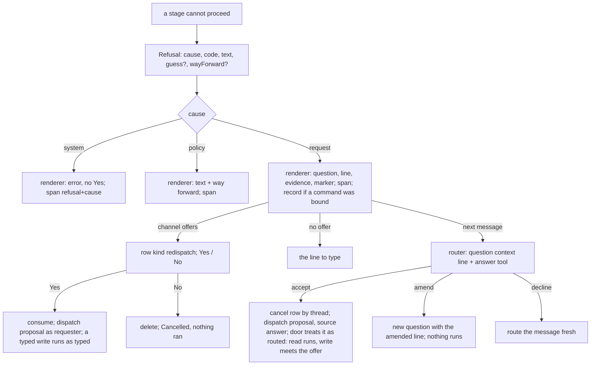

# A refusal the person caused is one question with a best guess - the seam, the guesses, the button, the words - Plan

## Goal Capsule

- **Objective**: Build [record 0054](../decisions/0054-a-refusal-the-person-caused-is-one-question-with-a-best-guess.md): every refusal the bot makes is one `Refusal` object with a cause, produced from every layer and rendered in one place, fenced by a lint rule so a new stage cannot write its own; a refusal the person's words caused becomes one question carrying the bot's best guess, answered by a Yes button or by the next typed message; a write runs only from a button that shows its exact line.
- **Authority**: record 0054 (proposed; this plan is the artifact its acceptance is judged on) over [record 0044](../decisions/0044-a-routed-write-is-confirmed-in-proportion-to-its-blast-radius.md) (the confirmation store, the button, the rule that a write is confirmed in proportion to its blast radius, all reused, none changed), [record 0039](../decisions/0039-the-front-door-writes-nothing-from-prose-and-never-routes-twice.md) as amended (nothing here writes from prose) and [record 0036](../decisions/0036-one-front-door-the-router-offers-every-command-and-ship.md) (the door). The living specs named in each unit are updated in the same pull request.
- **Execution profile**: nine units in two cuts, each one pull request through the review loop, in dependency order. Tests first in every unit. U1 to U4 are the **seam cut**: U1 and U2 change no sentence a person reads; U3 is the first visible change and fixes the trace; U4 adds the Yes button. U9 and U5 to U8 are the rest of the bundle: U9 gives every repository a README-derived card so the thread knows its repositories by what they are; U5 measures the router on the answer task before U6 gives it the task; U7 lets the router ask; U8 finishes the guess sites. The units are seedable to the plan runner one at a time (`agent:ship in <owner/repo>: plan <this path> units U<n>`), which holds the merge grant on a plan branch; a unit run by a person merges under `merge: person`.
- **Stop conditions**: a unit that cannot pass `npm run verify` within its listed files hands back a deviation. Nothing here adds a Worker, a table or a credential; the one store change is a new row kind in an existing table. A unit stops and asks if it would: run a write from anything but a button showing the exact line (a typed yes, a router answer, a guess); change a sentence a person reads during U1 or U2 other than by moving it into the renderer unchanged; introduce a word the person must type to answer; let a `system` refusal carry a Yes; or run a proposal as anyone but the person whose message it corrects.

---

## Product Contract

### Summary

The bot refuses through 19 mechanisms across 71 inventory rows as the record groups them, or 24 producer shapes across 155 sites when the appendix counts one row per site, and one typo in a repository name on 2026-09-17 produced two dead ends although two lists in the codebase named the right repository. Record 0054 decides one seam for every refusal, a cause on each, a best guess from a list the bot holds, and two ways to say yes. This plan lands the decision in nine units: the seam and its count, the fence and the migration, the repository guesses, the Yes button, the replay row that measures the router reading answers, the words path, the router's own question, the remaining guess sites, and the repository cards the maintainer added on 2026-09-18 so the thread knows its repositories by what they are. Cut after U4 and the trace is fixed with the button alone; the words and the router's question ship only behind their replay rows.

### Problem Frame

A colleague typed `agent:ship in acme/infra …` for the onboarded `acme/infrastructure`. The authorize gate held the rejected slug and refused with a paragraph; the paragraph's suggestion, `repo onboard acme/infra`, reached GitHub's token mint and came back as a 403 paragraph about installation settings. The resident registry would have named the right repository at the gate, and the App installation's repository list would have named it before the mint; neither is read where the refusals fire. Every other refusal site has the same shape: it knows why it cannot proceed, it holds or could hold the list that names the fix, and it ends the turn in its own words. Nobody can count how often this happens, because a refusal at a gate writes no run record and the `dispatch.refuse` span is a child that the log sink prints only when slow.

### Prior art, and what each changed here

The maintainer asked that this plan be checked against the puck research and against best-in-class solutions. Each row names what it changed in a unit, or that it confirmed the record's choice.

| Prior art | What it does | What it changed here |
|---|---|---|
| The puck pattern (a colleague, 2026-09-17): take the request, build the full command, execute if confident, ask if not | Confidence-gated execution with a clarifying question as the other branch | This plan is that other branch. Confidence is the deterministic guess (U3, U8), the router's `clarify` answer and the verifier as a question (U7); execution stays record 0044's. |
| Amp's Puck as researched on 2026-08-28 (issue 108): a thin meta-agent whose toolset is other threads, which "deliberately delegates code execution rather than pretending to be a terminal" | Coordination across threads, not clarification | Different problem; the run coordination epic stays deferred. The shared posture confirms records 0039 and 0044: the door never runs a write from prose, and a question never runs anything. |
| git `help.autocorrect`, Clang's typo correction, the Rust compiler's suggestions: a unique best candidate within an edit budget that scales with the length of what was typed; no suggestion when two tie | Deterministic "did you mean" over a known list | U3's helper: the edit budget is a third of the typed name's length, at least one and at most two edits, or a unique prefix; two candidates within budget list both and propose none. The record's open question 1 (prefix or two edits) is answered this way. |
| Python's `difflib.get_close_matches`: at most three suggestions above a similarity cutoff | The list when there is no single guess | U3: a question without a guess lists at most three candidates. |
| Rasa's two-stage fallback: below the confidence threshold, ask "did you mean X?" with affirm and deny buttons; on deny ask for a rephrase; after that fall back for good | A bounded clarification loop | U6: at most two questions per thread without an accept; the third render is record 0039's hand-back line with no question. Without this bound an `amend` loop never ends. |
| MCP elicitation (`elicitation/create`): a server asks the client a structured question mid-call and gets `accept`, `decline` or `cancel` with content | The wire shape of a question and its answer | U6's `answer` tool uses `accept` and `decline` in MCP's sense; `amend` is `accept` with changed content. Rendering a `request` refusal as an elicitation on the MCP ingress is named as a later item (U10), not built here. |
| RFC 9457 Problem Details (`type`, `title`, `detail`, `instance`) and gRPC's status classes (`INVALID_ARGUMENT`, `PERMISSION_DENIED`, `UNAVAILABLE`) | One machine-readable error object with a class | The `Refusal` fields map onto it (`code` as `type`, `text` as `detail`, `wayForward` as an extension) and the three causes onto the three status classes. The HTTP and MCP surfaces keep their shapes in this plan (U10, later). |
| GitHub Copilot CLI and Amazon Q CLI: a suggested command runs only after "Execute?" is answered; Alexa's dialog model confirms high-risk intents before fulfilment | A suggestion never runs itself | Confirms record 0044 and success criterion 3: a write runs only from a button showing its exact line. |
| Dialogflow contexts with a lifespan; Alexa's per-session dialog state | A pending question expires | Confirms the record: the row lives ten minutes, the words path takes only the newest bot turn. |
| Architecture tests (ArchUnit, dependency-cruiser) and this repository's `no-raw-env` lint rule | A structural rule that fails the build by file and line | U2's fence is written the same way as `no-raw-env`, as a rule over syntax in named directories, never over sentences. |
| Alexa's entity resolution: a slot type carries each canonical value with its synonyms, so "the infra repo" resolves to one id before the skill runs | Resolving a thing by what it is called, not only by its exact name | U9's repository card: the README's title, first paragraph and headings are the synonyms, built when the resident is provisioned or refreshed and carried into the router's turn, never fetched per request (the maintainer's addition of 2026-09-18). |

### Requirements

**The seam and the count (record 0054's first unit)**

- R1. `Refusal = { cause: "request" | "policy" | "system"; code: string; text: string; guess?: Guess; wayForward?: string }` and `Guess = { proposal: IncomingMessage; line: string; evidence: string }` live in `src/core/refusal.ts`, with `RefusalError` carrying one. Every code has exactly one cause in one table; a code the table does not know is a type error.
- R2. One renderer in the dispatcher's reply module turns a `Refusal` into what the person reads: `request` renders the question, the line and the evidence, and the offer where the channel has one; `policy` renders the text and the way forward; `system` renders the text as an error and never a Yes. The renderer adds nothing the producer did not put in `text` or `wayForward`, so a producer that masks a denial on purpose (`review.ts` answers "run not found" to an authorization denial so the run's existence is not revealed) sets `cause: policy` with a request-shaped text and no way forward, and the mask holds. The renderer is the only caller of `ChannelIO.offer`; the door's call moves into it.
- R3. The 18 `refuse(code)` sites (16 codes: 17 in the dispatch stages and `setup_failed` in the dispatcher), the two click sites with their four `confirmation_*` codes, the nameless catch-all span (which gains the code `uncaught`) and the two `elsewhere_*` reasons that never reach a span today all produce a `Refusal`, and the sentences a person reads are byte-identical to today's for every one of them, asserted by a table test over the inventory's sentences.
- R4. Every refusal is counted: the `dispatch.refuse` span and the request's root span carry `refusal: <code>` and `cause: <cause>` as attributes in the trace's closed key table; a refusal that fired after a command was bound is also a run record through `recordRoutedDecision` with `route.outcome: "refused"` and the code; `npm run load -- door` prints refusals per day, per cause and per code from the records it can read, and names the telemetry query for the rest.
- R5. The catch-all is the last line: an uncaught throw in `dispatch()` renders as `system`/`uncaught` with its redacted message, counted like any other refusal.

**The fence and the migration**

- R6. A lint rule, `refusals/no-raw-refusal`, fails `verify` by file and line on `io.reply(` and on any `throw` whose argument is not a `Refusal`, a `RefusalError` or a `CommandError` value in the producing modules (the dispatch stages except the renderer and the dispatcher, the coordinator's hand-off and the ship preflight, the command handlers, the directive and resolve parsers), on the `no-raw-env` pattern, with a test that runs the rule on a fixture containing each forbidden form, including a `throw helper()` whose helper builds the error, and on the real tree. A rule over `throw new Error(` alone misses the five `throw residentFailure(r)` sites in the repo command.
- R7. The four bare `io.reply` refusals, the silent refusals (the coordinator's two sites and the door's `unrouted` fall-through gain a span with a cause), the preflight's nine results, the hand-off's fifteen sentences, the six thrown `Error`s in the directive and resolve parsers, the seven `CommandError` codes over 96 `throw new` sites and five helper-built ones, and the MCP service's 27 `McpServiceError` throws all produce a `Refusal` or a `RefusalError`, each code with a cause; where one code hides several causes it splits, and every consumer of the old code (spans, audit lines, tests, docs; Table C of the appendix) is named in the unit and updated. Sentences stay byte-identical through this unit; in particular the references step's one line stays one line, because [record 0037](../decisions/0037-a-linked-thread-is-quoted-not-joined.md) makes it reveal nothing about the channel, and only its span splits into eight codes (request 2, policy 3, system 3).
- R8. The resident Worker's JSON errors stay on the wire and become `Refusal`s where the bot receives them, with the cause read from the Worker's `error` prefix, which names it today (`needs-ref` and `unknown-ref` are request, `not-serviceable` and its siblings are system). A tool result the model paraphrases, the conductor's spawn gates among them, is out of scope: those refuse the model, not the person, and the seam stops at `SpawnOutcome` (record 0054, Boundaries).

**The guesses**

- R9. One helper, `nearMatch(typed, candidates)`, answers `{ guess }`, `{ candidates }` (two or three) or `{}`: a candidate is within budget when it shares a prefix with the typed name or is within an edit budget of a third of the typed name's length, at least one and at most two; a unique candidate within budget is the guess; a typed name that is itself a candidate is never a typo. Tested on the inventory's real names.
- R10. The authorize gate, when `owner/name` is not a resident, makes one registry call for the resident list, bounded by the probe's timeout and skipped inside a probe-outage window or on a cold profile; `repo onboard` reads the installation's repository list before it mints; the ship preflight and `repo test|build|reconfigure` use the same helper over the same lists. A guess is a `Guess` whose `proposal` is the person's message with the slug replaced and whose `evidence` names the match and the resident's state.
- R11. A repository that exists but the App cannot see is a `policy` refusal with the admin's way forward, never `system`: the Worker's onboard 403 (`not-in-installation`) travels to the bot as a cause, and `residentFailure` stops mapping every non-404 status to `unavailable`. That mapping is the trace's second dead end. A registry or installation list that cannot be read leaves the question without a guess and lets `repo onboard` proceed to the mint as today. The not-onboarded sentence has four homes (the authorize gate, the two repo command sites, the cold-fallback note, and the Worker's 404) and the guess reaches all four.

**The button**

- R12. The confirmation row is a discriminated union: today's row is `kind: "run"`; a `kind: "redispatch"` row carries the proposal, the line and the evidence. A stored row without a `kind` parses as `run`. The store gains `cancelByThread(threadKey, actorIds)`.
- R13. The renderer offers a `request` refusal's guess as Yes and No on the existing button actions; Yes consumes the row (expiry, requester as record 0044 decided) and hands the stored proposal to `dispatch()` as the requester, with the click's one drain slot handed over and no second ending built; No deletes the row and renders "Cancelled; nothing ran" and what the door needs. Yes is a button showing the exact line, so a proposal that is a typed write runs as typed, exactly as record 0044's Run does.
- R14. The intake takes the buttons down after Yes or No as it does after Run, and the completed message keeps the question's lines above the answer.

**The words**

- R15. The replay gains an answer row: fixtures with a pending question (its line and evidence) and a next message that is a plain yes, a yes-but, a no-but or a fresh ask, with the expected reading `accept`, `amend`, `decline` or none; the row prints the four rates. The bar for U6: at most one fresh ask in twenty read as `accept`, and at least eighteen in twenty of the others read as expected.
- R16. The renderer's question carries a marker: the first line is `Did you mean:` and the second is the proposal as one code span; `questionFromThread(history)` recognises exactly that pair in the newest bot turn and nothing else; a completion keeps the lines; a newer bot turn ends the question.
- R17. The router's user turn gains one context line naming the question and the proposal when the thread's newest bot turn carries the marker, and one tool, `answer { decision: accept | amend | decline; line? }`. `accept` cancels the thread's row and hands the proposal to `dispatch()` with `source: "answer"`; `amend` renders a new question whose proposal is the amended line parsed through the door, and dispatches nothing; `decline` routes the message as if no question stood.
- R18. The door treats a `source: "answer"` request as routed whatever its shape: a read or an exec-class command runs with its receipt, and a write meets record 0044's offer. A typed yes never runs a write.
- R19. At most two questions stand in one thread without an `accept`; the third render of a question in that thread is record 0039's hand-back line with no question and no button.

**The router's own question**

- R20. The route tool gains a fourth answer, `clarify { question, partial }`; a placeholder-shaped string in a required argument at bind time (`namedToInput`) becomes a `clarify` rather than a bind; the verifier, given the command's description in its prompt, disagrees into a `clarify` with the bound line as the proposal. A `clarify` is a `Refusal` with `cause: request` and a `Guess` whose evidence says "the router's reading".
- R21. The replay gains a clarify row: the checked-in fixtures whose right answer is a question get one, and no fixture whose right answer is a bind gets a question. The row is the bar for U7 shipping in production.

**The remaining sites**

- R22. Presets at the `agent:` directive and the agent gate, MCP server names in scope, command and option names in the grammar, efforts, providers, cost groups, memory ids, plan paths, ops and refs each get a guess through the one helper over the list the site holds.

**The repository cards (the maintainer's addition of 2026-09-18)**

- R24. A **repository card** is `{ slug, sentence, keywords, sha }`: the sentence is the README's title and first paragraph capped at 160 characters, the keywords are up to ten of the README's headings, the sha is the default-branch commit the card was read at. The resident Worker builds it from the mirror's README at the two moments that already write `RepoFacts`, onboarding provisioning and the default-branch refresh, stores it beside the facts, and returns it on the `/residents` index. No card is built on a request path, and no new timer or cycle is added.
- R25. A repository the installation can see but no resident holds has a card whose sentence is GitHub's `description` from `listRepos()` and no keywords; the near-match and the installation-list read of U3 use it as evidence.
- R26. The router's user turn carries, after the thread's repository line, the cards of the repositories the thread has touched and then the residents' cards, capped at forty cards of two hundred characters, oldest residents dropped first. When the ask names no repository and its subject matches one card, the router may bind that repository; the bind is a bind like any other under records 0039 and 0044: a read runs with its receipt naming the repository, a write meets the offer, and a doubt is U7's `clarify` with the candidate cards as the question's list.
- R27. Every question with repository candidates, U3's near-match, U6's `amend` and U7's `clarify`, carries each candidate's sentence in its evidence, so a person reads what a repository is and not only its name.
- R28. The replay gains a repository row: fixtures that name a subject and no repository, with the expected slug or none; the bar is nine in ten bound right and no fixture whose subject matches no card bound at all.

**Specs and records**

- R23. Every unit updates the spec items it changes in its own pull request; record 0054's validation rows are rebound to the tests these units add when its status moves.

---

## Planning Contract

### Key Technical Decisions

- KTD1. **The count is a span attribute always and a run record when a command was bound.** A refusal at a gate has no run to write, and the log sink prints roots only, so the request's root span carries `refusal` and `cause` in the closed attribute table (`src/core/trace`), where the telemetry query the forensics recipe already uses can count them over the retention window. A refusal after a command was bound reuses record 0044's `recordRoutedDecision` with `route.outcome: "refused"`, so the door report counts those from the run store with no new sink. Two counts, one number each, both posted after a week. Governs R4.
- KTD2. **The renderer takes over the door's `offer` call, and the offer becomes a rendering of a `Refusal` with a guess.** Today `route.ts` calls `offer` for a routed write; the renderer in `reply.ts` becomes the only caller, and a routed write that needs confirmation is expressed as a `Refusal { cause: "request", code: "confirm_write", guess }` whose Yes is record 0044's Run. One object, one renderer, two buttons already built. Governs R2, R13.
- KTD3. **A code has one cause in one table, and the sentence moves unchanged.** `causeOf(code)` in `src/core/refusal.ts` is exhaustive over a string-literal union of codes; the migration moves each site's sentence into the renderer's table keyed by code, byte-identical, so U1 and U2 are asserted by a test over the inventory's sentences. A code that hid several causes (the eight reasons behind "I can't read that thread", the nine preflight results behind `ship_preflight`) becomes several codes with the old code kept as their span prefix, so a query on the old code still finds them; the sentence does not split with the code. The record's "four request, four system" for the references step is corrected by the appendix to request 2, policy 3, system 3, and the record takes a dated amendment note for it when its status moves. Governs R1, R3, R7.
- KTD4. **The fence is syntax in named directories.** The gates build their prose through helpers, so a rule over text sees nothing; `refusals/no-raw-refusal` forbids the two syntactic forms that reach a person, `io.reply(` and a `throw` of anything but a `Refusal`, `RefusalError` or `CommandError` value, in the producing modules, with the renderer and the dispatcher allowlisted, exactly as `no-raw-env` names `src/secrets.ts`. The rule reads the thrown expression's type through the TypeScript services ESLint already loads, so `throw residentFailure(r)` passes once the helper returns a `CommandError` and a bare `throw new Error(` fails. Governs R6.
- KTD5. **Guesses are deterministic first, and the budget scales with length.** `nearMatch` is one pure function with one budget rule (a third of the typed length, clamped to one and two edits, or a unique prefix) and a uniqueness requirement, the shape git, Clang and the Rust compiler settled on; a model produces a guess only through U7's `clarify`, and it is rendered and fenced as a deterministic one. Governs R9, R20.
- KTD6. **The gate pays one registry call it does not pay today, bounded like the probe.** `resolveAddressed` returns before the resident list is read for `owner/name`; the guess needs the list, so the gate calls the registry once with the probe's timeout and skips the call inside a probe-outage window or on a cold profile, where the question renders without a guess. Governs R10, R11.
- KTD7. **Yes is record 0044's Run; the words are not a button.** One rule for what runs: a write runs only from a button showing its exact line. The `redispatch` row's Yes shows the line, so a typed write proposal runs as typed. A typed `accept` is a model's reading, so the proposal enters `dispatch()` with `source: "answer"` and the door treats it as routed: `routedRunsAtOnce` decides, and a write renders the offer. This is why `accept` and Yes give `dispatch()` the same message and only Yes carries a confirmation. Governs R13, R17, R18.
- KTD8. **The thread is the memory for the words; the row is for the click.** The bot's own reply comes back in the thread history as an assistant turn (`threadTurns`), so the renderer stamps the question with a marker its reader recognises, on the `STATUS_PREFIXES` precedent, and the router's user turn gains the question the way it gains the thread's repository today. A typed answer needs no row and works after the button expired; `accept` cancels the row by thread so a click cannot follow a typed yes. Governs R16, R17.
- KTD9. **The clarification loop is bounded.** Rasa's two-stage fallback asks at most twice; the third render in a thread without an `accept` is the hand-back line. Without the bound an `amend` that the router misreads produces a question forever. Governs R19.
- KTD10. **Every unit is behaviour-identical until U3.** U1 moves sentences and adds attributes; U2 adds the fence and moves the rest; U3 is the first question a person sees; U4 the first button on a question; U6 the first typed answer. Each unit's dispatcher tests assert the sentences unchanged where they should be. Governs the execution profile.
- KTD11. **A card is built where the facts are written, never per request.** `RepoFacts` is written only by onboarding provisioning and the default-branch refresh, so the card is computed there from the mirror's README and stored beside the facts; the request path reads it with the registry index call the fleet already makes and U3's one gate call. The sentence is deterministic (title and first paragraph), not a model digest, so the Worker gains no model dependency and the card is reproducible from the sha. A card is context for the router and evidence for a question; it never binds a repository by itself, the router does, under the same rules as any bind. Governs R24 to R27.

### High-Level Technical Design

### Sequencing

U1 first: the seam and the count are the record's own first unit, and nothing a person reads changes. U2 next: the fence lands while the migration is fresh, and the remaining producers move onto the seam behind it. U3 is the trace's fix and the first visible question. U4 gives the question its button. The seam cut ends there, and the maintainer decides on the count whether to continue. U9, the repository cards, comes next when the bundle continues, because it sharpens every later question's evidence and the router's repository binds; it depends on U3 alone. U5 measures before U6 trusts: the answer row runs on the replay with the router pieces built but not wired. U6 wires the words behind U5's bar. U7 and U8 are independent of each other and of U6; both depend on U3, and U7's candidates are cards once U9 has landed.

### Risks and Dependencies

- **A sentence changes during the behaviour-identical units.** The table test over the inventory's sentences is the fence; a diff in it is a review finding, not a drive-by.
- **The registry call slows the gate.** One call, the probe's timeout, skipped in an outage window; the question without a guess is the fallback and is still one question.
- **The router misreads a fresh ask as `accept`.** The door treats the proposal as routed, so a write shows an offer and a read runs with a receipt naming what ran; U5's bar is the gate, and no measurement exists before it.
- **Two people in a thread.** The answer is the writer's; the proposal dispatches as the person whose message it corrects, by the requester rule; the row's requester check holds for the click.
- **Old rows in the confirmation table.** A row without `kind` parses as `run`; the union's parser is tested on a stored row from before U4.
- **The run page shows `refused` records.** Only refusals after a command was bound are recorded; the page renders their `route` event as it does a hand-back's. A chip or a filter is a check-in.
- **The words path is the part most likely to be wrong**, as both cold readers of the record said. It ships behind U5 and can be withdrawn by removing one router tool.
- **The count may say the problem is rare.** Then the seam cut stands as delivered and U5 to U8 wait; the record names this outcome.
- **The record's counts are corrected by the appendix.** 18 `refuse` sites and 16 codes rather than 17 and 16; 27 `McpServiceError` throws among about 48 failure paths rather than 46; six thrown errors in the parsers rather than three; the references split 2/3/3 rather than 4/4; five helper-built `CommandError`s outside the 96; the Worker's 25 `error:` sites, the click path, the nameless span and the in-run tool results not in the record's 71. None changes the design; the record takes one dated amendment note when its status moves.
- **The spawn gates and the in-run tool refusals are outside the seam.** They refuse the model, which paraphrases them; the record's boundary excludes an agent's own questions inside a run. They keep their shapes.
- **Depends on** record 0054 staying the design (proposed; this plan is what acceptance is judged on), record 0044's store and buttons as shipped in 1.245.0, the trace's closed attribute table accepting two keys, and the review loop.

---

## Implementation Units

### U1. The seam and the count

- **Goal**: every gate refusal is a `Refusal` rendered in one place with the same sentence as today; every refusal carries `refusal` and `cause` on its spans; a refusal after a command was bound is a run record; `npm run load -- door` prints refusals per day, per cause and per code. No reply text changes.
- **Requirements**: R1, R2, R3, R4, R5, R23 (routing-and-config items 4 and 21, run-history item 2, tracing item 3, load-harness item 19, the door report).
- **Dependencies**: none.
- **Files**: `src/core/refusal.ts` (new: `Refusal`, `Guess`, `RefusalError`, `causeOf`, the code union); `src/core/dispatch/reply.ts` (`renderRefusal(refusal, io)`: the only caller of `offer`; the sentence table keyed by code; `errorReply` becomes the `system`/`uncaught` rendering); `src/core/dispatch/route.ts` (the offer call moves out); `src/core/dispatcher.ts` (the two `refuse` helpers take a `Refusal`, set `cause` on the span and the ending, and call the renderer; the catch-all); `src/core/dispatch/authorize.ts`, `provision.ts`, `references.ts` (the 17 sites return `Refusal`s; the references constant's eight reasons become eight codes); `src/core/trace/attrs.ts` (the two keys and their domains); `src/core/dispatch/commandRun.ts` (`route.outcome: "refused"` and the code on the event); `src/load/doorReport.ts` and `scripts/load.ts` (the refusal lines); tests `refusal.test.ts` (new), `reply.test.ts`, `dispatcher.test.ts`, `authorize.test.ts`, `provision.test.ts`, `references.test.ts`, `doorReport.test.ts`; the inventory appendix below names every site by file and line.
- **Approach**:
  1. Tests first, red against today: a table test in `reply.test.ts` over the 17 gate sentences and the eight reference reasons, each `Refusal` rendering byte-identical to the sentence the inventory quotes; `dispatcher.test.ts` asserts every refused dispatch sets `cause` on the ending and the span, that a `system` refusal never calls `offer`, and that an uncaught throw renders `⚠️ …` as today with `cause: system, code: uncaught`; `doorReport.test.ts` prints per-day, per-cause, per-code lines from a fixture store.
  2. Write `src/core/refusal.ts`; move the sentences into the renderer's table; make the two `refuse` helpers take a `Refusal` and stamp the attributes; move the door's `offer` call into the renderer with the same text and buttons; give the nameless catch-all span the code `uncaught` and the two `elsewhere_*` reasons a span each.
  3. Migrate the 18 `refuse(code)` sites and the two click sites; delete each site's own sentence.
  4. Record: in `answerCommand` and the confirm path, a refusal after a bind calls `recordRoutedDecision` with `outcome: "refused"` and the code.
  5. The report: group refused records by day, cause and code; print the telemetry query for the root spans as one line of the report's footer.
  6. Spec rows: routing-and-config item 4 (a gate refusal is a `Refusal` with a cause) and item 21 (the offer is rendered from a `Refusal`); run-history item 2 (`route.outcome: refused`); tracing item 3 (the two keys); load-harness item 19 (the door report's refusal lines).
- **Execution note**: nothing a person reads changes; the diff is a move. A reviewer diffs the sentence table against the inventory's quotes.
- **Patterns to follow**: `errorReply` and `STATUS_PREFIXES` in `reply.ts`; the `refuse` helper and `ended.refusal` in `dispatcher.ts`; `recordRoutedDecision` in `commandRun.ts`; the closed attribute table in `src/core/trace`.
- **Test scenarios**:
  - `reply.test.ts`: 17 gate sentences and 8 reference reasons byte-identical; `system` renders no Yes; `policy` renders the way forward; `request` without a guess renders the text and what the door needs.
  - `dispatcher.test.ts`: a refused dispatch's span attributes; the catch-all's code; the offer path still renders the same Block Kit as before through the renderer.
  - `doorReport.test.ts`: two days, three codes, two causes; an empty store prints zero lines.
- **Verification**: the test files green, red first; `npm run specs:check`; `npm run verify`.

### U2. The fence and the remaining producers

- **Goal**: `refusals/no-raw-refusal` fails `verify` on a raw reply or throw in a producing module; every remaining mechanism produces a `Refusal` or a `RefusalError` with a cause; sentences stay byte-identical.
- **Requirements**: R6, R7, R8, R23 (agent-ship items 14 and 16, command-registry items 3 and 4, mcp-ingress, routing-and-config item 21).
- **Dependencies**: U1.
- **Files**: `eslint.config.mjs` and `src/refusalFence.mjs` (new, beside `src/secretEnv.mjs`, which holds the `no-raw-env` rule) with its test; `src/core/dispatch/*.ts` (the bare `io.reply` sites and the silent coordinator refusal); `src/core/ship/preflight.ts` and `src/core/coordinator/handOff.ts` (nine results and fifteen sentences become `Refusal`s the renderer prints); `src/directives.ts` and `src/core/dispatch/resolve.ts` (thrown `Error`s become `RefusalError`s); `src/core/commands/*.ts` and `src/core/commandChat.ts` (`CommandError` codes gain a cause in the table; `chatErrorLine` renders through the renderer); `src/mcp/service.ts` (`McpServiceError` carries a cause); the resident client where the Worker's JSON errors are received; tests beside each; the inventory appendix names every site.
- **Approach**:
  1. Tests first: the rule's test runs it on a fixture file with `io.reply(` and `throw new Error(` and expects two failures by line, and on the real tree and expects none once the migration is done (red until it is); the sentence table test grows to every migrated sentence.
  2. Write the rule; allowlist the renderer and the dispatcher; wire it in `eslint.config.mjs` for the producing directories.
  3. Migrate in the record's order: bare replies and the silent refusal; the preflight's nine and the hand-off's fifteen; the thrown errors; the `CommandError` causes and `chatErrorLine`; the MCP service; the resident JSON at receipt. Name every consumer of a split code and update it.
  4. Spec rows: agent-ship items 14 and 16 (the preflight and the hand-off produce `Refusal`s); command-registry item 4 (a `CommandError` has a cause); mcp-ingress (the error shape's cause); routing-and-config item 21 (the fence).
- **Execution note**: this is the largest diff of the plan and changes no sentence; split the pull request by mechanism if review asks, in the order above.
- **Patterns to follow**: the `no-raw-env` rule and its exemption lists; `chatErrorLine`; `McpServiceError`.
- **Test scenarios**: the rule on the fixture and on the tree; every migrated sentence byte-identical; a `CommandError` with each code renders its cause on the span; a preflight result renders the same card text as today.
- **Verification**: the test files green, red first; `npm run lint`; `npm run specs:check`; `npm run verify`.

### U3. The repository guesses

- **Goal**: `agent:ship in acme/infra …` against residents holding `acme/infrastructure` answers one question with the corrected line and the evidence; `repo onboard acme/infra` reads the installation list first and asks the same question; a repository the App cannot see is a `system` refusal with the admin's way forward.
- **Requirements**: R9, R10, R11, R23 (routing-and-config items 4 and 6, resident-repos, agent-ship item 16).
- **Dependencies**: U1.
- **Files**: `src/core/nearMatch.ts` (new) and its test; `src/core/dispatch/authorize.ts` (the registry call and the guess at the `repo_not_onboarded` site); `src/core/repoContext.ts` (`resolveAddressed` exposes the list read); `src/core/commands/repo.ts` (the installation list before the mint, via `RestGithubApi.listRepos()`; `residentFailure` reads the Worker's cause instead of mapping every non-404 status to `unavailable`; the two not-onboarded sites get the guess); `deploy/cloudflare-resident/worker.ts` (the onboard 403 and the attach errors carry `cause` beside `error`); `src/execution/factory.ts` (the cold-fallback note names the near match); `src/core/ship/preflight.ts` and the `repo test|build|reconfigure` handlers; `src/core/dispatch/reply.ts` (the question with a guess renders the line to type when the channel has no offer); tests beside each, and the Worker's test.
- **Approach**:
  1. Tests first: `nearMatch.test.ts` over the inventory's real resident and server names (one guess; two candidates listed; an exact name never a typo; a budget of one edit on a three-letter name and two on a nine-letter one); `authorize.test.ts` with a fake registry returning the list, the outage window skipping the call, the cold profile skipping it; `repo.test.ts` with a fake `listRepos` returning the list, a name in the list that the mint still refuses rendering `policy` with the admin's way forward, and a Worker body without `cause` still rendering as today; the Worker's test asserts `cause` on the onboard 403 and on each attach error.
  2. Write the helper; add the bounded registry call at the gate; read the installation list before the mint; route the preflight and the three repo commands through the helper.
  3. Spec rows: routing-and-config item 6 (repo-management commands guess), resident-repos (the gate's list read), agent-ship item 16 (the preflight's guess).
- **Execution note**: the first visible change. Without U4 the question renders the corrected line to type; that is the record's channel-without-offer shape and is correct on its own.
- **Patterns to follow**: the probe's timeout and outage window in the registry client; `resolveAddressed`; `listRepos` as the `github_repos` tool calls it.
- **Test scenarios**: the trace end to end in `dispatcher.test.ts` with a fake registry: one question, the line, the evidence; no guess when two residents tie; the installation-list read before the mint and the `system` cause after a real 422.
- **Verification**: the test files green, red first; `npm run specs:check`; `npm run verify`.

### U4. The Yes button

- **Goal**: a question with a guess carries Yes and No in a channel that offers; Yes hands the stored proposal to `dispatch()` as the requester; No cancels; old rows still parse; the store can cancel by thread.
- **Requirements**: R12, R13, R14, R23 (slack-channel item 14, routing-and-config item 21, run-history item 2).
- **Dependencies**: U3.
- **Files**: `src/core/confirmations.ts` (the union, `kind`, `cancelByThread`, the parsers); `deploy/cloudflare-memory/worker.ts` (the cancel-by-thread route on the config object; rows without `kind` read as `run`); `src/core/dispatch/confirm.ts` (`consumeAndRun` branches on `kind`: `redispatch` calls `dispatch()` with the stored message and hands over the drain slot); `src/core/dispatcher.ts` (`dispatchClick` passes its slot); `src/core/dispatch/reply.ts` (the question's offer); `src/channels/slack.ts` (Yes and No labels on the existing actions; the taken-offer note); tests `confirmations.test.ts`, `confirm.test.ts`, `dispatcher.test.ts`, `slack.test.ts`, the Worker's `config.test.ts`.
- **Approach**:
  1. Tests first: a stored pre-U4 row parses as `run`; a `redispatch` row round-trips; `cancelByThread` deletes the thread's row under the requester check; Yes on a `redispatch` row calls `dispatch()` once with the proposal as the requester and increments `activeRuns` once; a foreign Yes is refused and the requester's buttons stay; No deletes and renders the cancelled line.
  2. Widen the row and the store; add the Worker route; branch the consume; render Yes and No.
  3. Spec rows: slack-channel item 14 (Yes and No on a question), routing-and-config item 21, run-history item 2 (a redispatched request's record names the question's code).
- **Execution note**: the seam cut ends here. The record's live rows for the button are human-gated and posted after the release.
- **Patterns to follow**: record 0044's `consumeAndRun`, `cancelPending`, `takenOfferBlocks`; the tickets table's `CREATE TABLE IF NOT EXISTS` precedent for a schema-free row change.
- **Test scenarios**: the union's parser on both shapes; the drain count; the requester rule; the taken-offer note reads "Yes clicked by …".
- **Verification**: the test files green, red first; `npm run specs:check`; `npm run verify`; live, human-gated: the trace's message, Yes, ship starts on the right repository.

### U5. The replay's answer row

- **Goal**: `npm run load -- route` prints four rates for the router reading a next message against a pending question; the router pieces (the context line and the `answer` tool) exist behind the replay and are not wired into `dispatch()`.
- **Requirements**: R15, R23 (load-harness item 17).
- **Dependencies**: U1 (the marker's shape is fixed by the renderer's table).
- **Files**: `src/load/routeAnswerFixtures.ts` (new: at least ten of each of plain yes, yes-but, no-but and fresh ask, over the inventory's real command lines), `src/load/routeReplay.ts` (the row and its counters), `src/core/dispatch/route.ts` (the context line and the `answer` tool, exported for the replay, not offered by `dispatch()`), `scripts/load.ts` (the usage line); tests `routeReplay.test.ts`, `route.test.ts`.
- **Approach**: tests first on the counters with a scripted model; write the fixtures; add the tool and the line as pure builders; score. The pull request carries the row's output on the checked-in fixtures under the fast model.
- **Execution note**: the maintainer runs the row with a key; the bar is R15's. No production path changes.
- **Patterns to follow**: `RouteCommandFixture` and the decoy row; record 0044's verifier as a replay flag.
- **Test scenarios**: each fixture kind scored; a scripted `accept` on a fresh ask counts against the bar; the report line's shape.
- **Verification**: the test files green; `npm run load -- route` output posted on the receipts tracker.

### U6. Words as an answer

- **Goal**: after a question, "yes" runs a read or shows the offer for a write, "yes but on staging" shows a new question with staging in the line, "no, I meant X" routes fresh; a thread without the marker has no answer; two unanswered questions end the asking.
- **Requirements**: R16, R17, R18, R19, R23 (routing-and-config item 21, slack-channel thread turns, thread-admission).
- **Dependencies**: U4, U5 at its bar.
- **Files**: `src/core/dispatch/reply.ts` (the marker); `src/core/dispatch/thread.ts` (`questionFromThread(history)`); `src/channels/slack/threadTurns.ts` (the marker survives the turn builder; it must not start with a status prefix); `src/core/dispatch/route.ts` (the context line and the `answer` tool offered when a question stands); `src/core/dispatcher.ts` (`source: "answer"` on the redispatch; the door treats it as routed; the two-question bound); `src/core/dispatch/commandRun.ts` (`source` widens to `"answer"`); tests `thread.test.ts`, `route.test.ts`, `dispatcher.test.ts`, `threadTurns.test.ts`.
- **Approach**:
  1. Tests first: `questionFromThread` finds the newest marked bot turn and nothing older or unmarked; `accept` cancels by thread and dispatches with `source: "answer"`; a write proposal under `source: "answer"` renders the offer and runs nothing; a read proposal runs with its receipt; `amend` renders a new question and dispatches nothing; `decline` routes fresh; the third question in a thread without an accept renders the hand-back line.
  2. Stamp the marker; read it; offer the tool; wire the three decisions; add the bound.
  3. Spec rows: routing-and-config item 21 (the answer tool and the one rule for what runs), slack-channel (the marker in the thread turns), thread-admission (a typed answer is not a rival).
- **Execution note**: ships only when U5's row holds at the bar; the record's live row ("yes but on staging") is human-gated after the release.
- **Patterns to follow**: the thread's repository context line; `STATUS_PREFIXES`; `pastedRoute`.
- **Test scenarios**: as in the approach, plus two people in a thread and a completion above the marker.
- **Verification**: the test files green, red first; U5's row re-run with the production prompt; `npm run specs:check`; `npm run verify`.

### U7. The router's own question

- **Goal**: the router answers `clarify` for a command with a piece it cannot bind; a placeholder in a required argument never binds; the verifier disagrees into a question; the clarify row holds on the checked-in fixtures.
- **Requirements**: R20, R21, R23 (routing-and-config item 21, load-harness item 17).
- **Dependencies**: U3 (the rendering of a guess); independent of U6.
- **Files**: `src/core/dispatch/route.ts` (the `clarify` answer on the route tool; the placeholder check after `namedToInput`; the verifier prompt gains the command's description and a `clarify` outcome), `src/load/routeReplay.ts` (the clarify row and fixtures whose right answer is a question), tests `route.test.ts`, `routeReplay.test.ts`.
- **Approach**: tests first on the placeholder check and the `clarify` rendering; add the answer; run the row; wire in production only when the row holds.
- **Patterns to follow**: the `VERIFY_TOOL_NAME` flag and its counters; `namedToInput`.
- **Test scenarios**: a placeholder string in a required argument becomes a question; a complete bind never does; the verifier's disagreement renders a question with the bound line.
- **Verification**: the test files green; the clarify row posted on the receipts tracker; `npm run verify`.

### U8. The remaining guess sites

- **Goal**: every request-caused row of the inventory that holds a list gets a guess through `nearMatch`.
- **Requirements**: R22, R23 (the spec item of each site).
- **Dependencies**: U3.
- **Files**: the sites the inventory appendix marks with a list in hand: the `agent:` directive and the agent gate (presets), the MCP scope (server names), the grammar (command and option names), and the option-valued sites (efforts, providers, cost groups, memory ids, plan paths, ops, refs); tests beside each.
- **Approach**: one pull request per group in the appendix's order, each a table test over the group's real names and one dispatcher test per site.
- **Verification**: the test files green; `npm run specs:check`; `npm run verify`.

### U9. Repository cards

- **Goal**: every resident has a README-derived card built at provisioning and at the default-branch refresh; the router's turn carries the cards; a question about a repository names each candidate by what it is; the replay's repository row measures binds from the subject alone.
- **Requirements**: R24, R25, R26, R27, R28, R23 (resident-repos, routing-and-config item 21, load-harness item 17).
- **Dependencies**: U3 (the near-match evidence and the gate's registry call).
- **Files**: `deploy/cloudflare-resident/worker.ts` (`RepoFacts` gains `card`; the card is read from the mirror's README where the facts are written at provisioning and refresh; the `/residents` index returns it) and its test; `src/core/residentFleet.ts` and `src/core/repoContext.ts` (`ResidentSlugs` becomes a cards read, slugs derived from it); `src/execution/githubApi.ts` (`listRepos()` already returns `description`; the card shape for an installation repository); `src/core/dispatch/route.ts` (the cards lines after the thread's repository line, capped; the repository bound from the subject rides the existing `repo` argument of the command tools and the ship hand-off); `src/core/dispatch/authorize.ts` and `src/core/commands/repo.ts` (evidence carries the sentence); `src/load/routeRepoFixtures.ts` (new) and `src/load/routeReplay.ts` (the repository row); tests beside each.
- **Approach**:
  1. Tests first: the Worker's test builds a card from a fixture README (title, first paragraph capped, ten headings) at provisioning and rebuilds it on refresh when the sha moves, and leaves it when the sha does not; `route.test.ts` asserts the cards lines, the cap, and a scripted bind from a subject with no repository named; `authorize.test.ts` asserts the evidence sentence; `routeReplay.test.ts` scores the repository row with a scripted model.
  2. Build the card in the Worker at the two facts-writing sites; return it on the index; read it on the bot; render the lines; carry the sentence in the evidence; add the fixtures and the row.
  3. Spec rows: resident-repos (the card and when it is written), routing-and-config item 21 (the cards lines and the bind from a subject), load-harness item 17 (the repository row).
- **Execution note**: the card is deterministic text from the README, never a model digest, so the Worker gains no model dependency; a README-less repository has a card with the slug alone. The bind from a subject is measured by the replay row before anyone relies on it, as U5 measures the answers.
- **Patterns to follow**: `RepoFacts` and the snapshot stamp (written only at provisioning and refresh); the thread's repository line in `route.ts`; `RouteCommandFixture` and the decoy row.
- **Test scenarios**: a README with no headings; a README over the cap; two residents whose sentences share a keyword (the router asks, per U7, or binds none); an installation repository with a description and no resident; the cards line absent when the fleet has no residents.
- **Verification**: the test files green, red first; `npm run load -- route` with the repository row posted on the receipts tracker; `npm run specs:check`; `npm run verify`; live, human-gated: in a thread with no repository, an ask naming only a subject one card matches routes to that repository with a receipt naming it, or asks with the card as evidence.

### U10. Later, not in this plan's definition of done

Problem Details on the HTTP ingress and an elicitation on the MCP ingress for a `request` refusal when the client declares the capability. Named so the seam's renderer is written with a JSON rendering in mind; built under its own decision. A model-written card sentence, if the deterministic one proves too thin on the replay's repository row, is also later and its own decision.

---

## Verification Contract

| Proof | Command or procedure | Units |
|---|---|---|
| Unit tests red then green, per unit | `npx vitest run <the unit's test files>` | U1 to U8 |
| The sentence table: every migrated refusal byte-identical | `npx vitest run src/core/dispatch/reply.test.ts` | U1, U2 |
| The fence fails on a raw reply or throw and passes on the tree | the rule's test; `npm run lint` | U2 |
| Spec bindings resolve, coverage holds | `npm run specs:check` | U1 to U8 |
| The whole gate | `npm run verify` | U1 to U8 |
| The count | `npm run load -- door --since <date>` prints refusals per day, per cause and per code; the root-span query over the same window; both posted on the receipts tracker after one week | U1 |
| Replay: the answer row | `npm run load -- route --limit 0 --provider anthropic --model <fast model>`, run by the maintainer: four rates; the bar is R15's | U5, U6 |
| Replay: the clarify row | the same run: fixtures whose right answer is a question get one; no bind fixture does | U7 |
| Replay: the repository row | the same run: fixtures naming a subject and no repository; nine in ten bound right, none bound where no card matches | U9 |
| Live, human-gated: a repository from the subject | In a thread with no repository, "run the tests on the booking site" where one card names it. Expect the `routed: repo test <slug>` receipt, or a question with the card's sentence as evidence | U9 |
| Live, human-gated: the trace | `agent:ship in <a typo of an onboarded repository> …`. Expect one question with the corrected line and the evidence, Yes and No; Yes starts ship on the right repository; one `refused` record and one ship run | U3, U4 |
| Live, human-gated: onboard | `repo onboard <the same typo>`. Expect the same question, no mint | U3 |
| Live, human-gated: yes-but | After a question, "yes but on staging". Expect a new question with staging in the line and nothing run | U6 |
| Live, human-gated: a typed yes on a write | After a question whose proposal is a write, "yes". Expect record 0044's offer with the same line, nothing run until Run | U6 |
| Live, human-gated: a system refusal | A repository the App cannot see. Expect the admin's way forward and no Yes | U3 |

---

## Definition of Done

- U1 to U4 merged on `main` in order, each through the review loop with its spec rows in the same pull request; the count posted after one week; the maintainer's cut decision recorded on the receipts tracker.
- U9 and U5 to U8 merged when the maintainer continues, U9 first; U6 only after U5's row holds at the bar, U7 only after the clarify row holds.
- The live rows posted after the releases that carry U3, U4 and U6.
- Record 0054's validation rows rebound to these units' tests and its status moved by the maintainer.

---

## Appendix: the inventory at `efe9fe15`

The record's appendix groups the sites into 71 rows; this appendix names each one by file and line at the sha the plan was written against, one row per site (155), with the cause the plan assigns and the list a guess could use. U1 and U2 are checked against Table A; U2's `CommandError` causes against Table B; the consumers of every split code against Table C; Table D reconciles the counts with the record's, and the eight findings under it are folded into the requirements above.

Every `path:line` below was read with `sed -n` at `efe9fe15` (origin/main; the worktree's source tree is identical). Causes follow the record's definitions: **request** = a different sentence from the person would work; **policy** = the person may not; **system** = the bot or a dependency cannot act now; **split** = one code or sentence hides several causes (listed). Example repositories are written `acme/...`. A row covers several throw sites only where the record's own convention does (one handler file × one code); every other row is one site.

Reading the tables: "guess list in hand" names the list or function the site could match a typo against, or the fact it already holds; "consumers" names everything that reads the code string (span names, audit lines, tests, docs), so a split or rename knows what moves.

### Table A — every refusal site

#### A1. Dispatch gates: `refuse(code)` span (`dispatcher.ts:244` wraps `dispatch.refuse` with `attrs.outcome`)

| # | file:line | mechanism | code today | sentence today | proposed cause | guess list in hand | consumers of the code |
|---|---|---|---|---|---|---|---|
| 1 | `src/core/dispatch/authorize.ts:80` | `refuse(code)` + `io.reply` | `agent_allowlist` | "🚫 You're not on the allowlist for the `<agent>` agent. Ask <admins> for access." | policy | none needed; `adminsHint()` names who can | span attr; `Gate` reason; relayed to a parent by `spawn.ts:357`/`outcome.ts`; `admission.ts`; tests: dispatcher, admission, authorize, spawn, coordinator/driver, ship/coordinator, tools/runs, channels/adminCoordinator; docs: 0026, agent-conductor, http-ingress, tracing |
| 2 | `src/core/dispatch/authorize.ts:112` | `refuse(code)` + `io.reply(profileRefusalReply)` | `profile_bounded` | axis / cap / scope / how to raise it (`profileRefusalReply`) | policy | the boundary's cap and scope, in `ProfileRefusal` | `spawn.ts`, `outcome.ts`; tests: dispatcher, authorize; docs: agent-conductor, routing-and-config, orchestration plan |
| 3 | `src/core/dispatch/authorize.ts:229` | `refuse(code)` + card close + `io.reply` | `repo_not_visible` | "📦 `<slug>` is not a repository this installation can see — GitHub answered 404 …" | **split**: request (the name is wrong — the sentence says so) / policy (outside the App installation) | the installation's repositories: `listRepos()` (`src/execution/githubApi.ts:104,267,797`) exists, called only by `src/tools/github.ts:100` — never here | tests: authorize; docs: agent-explore, execution |
| 4 | `src/core/dispatch/authorize.ts:245` | same | `repo_unverified` (cold: GitHub silent) | "⚠️ I couldn't verify `<slug>` against GitHub — it didn't answer — so I did not start …" | system | none | tests: authorize; docs: 0026, agent-explore, execution, tracing, orchestration plan |
| 5 | `src/core/dispatch/authorize.ts:280` | same | `repo_not_onboarded` | "📦 `<slug>` is not onboarded as a resident, so I did not start a *<agent>* run for it …" | request | the resident registry — `repoContext.ts:604-605` hands the gate only `rejectedRepo` (the slug); the list is read for a bare name only (`resolveAddressed`, `:548`); one registry call away | `outcome.ts`; relayed by `spawn.ts`; tests: authorize, spawn, tools/runs; docs: 0054, agent-ship, tracing, orchestration plan |
| 6 | `src/core/dispatch/authorize.ts:304` | same | `repo_unverified` (registry silent) | "⚠️ I couldn't verify that `<slug>` is an onboarded repo — the resident registry didn't answer …" | system (same code as row 4, same cause — no split needed) | none | as row 4 |
| 7 | `src/core/dispatch/authorize.ts:326` | same | `repo_access` | "🚫 You're not on the allowlist for the `<repo>` repo environment. Ask <admins> for access." | policy | `restrict.repos` grants (config) | tests: authorize; docs: tracing, orchestration plan |
| 8 | `src/core/dispatch/authorize.ts:362` | `refuse(code)` + card + `io.reply(preflight.reply)` | `pr_head_unknown` | `src/core/reviewRound.ts:228`: "🔀 Review of <repo#N> not started: GitHub did not give me a usable head commit …" | system | none | tests: authorize; docs: 0026, tracing |
| 9 | `src/core/dispatch/authorize.ts:436` | `refuse(code)` + release + card + `io.reply(reply)` | `branch_moved` | `src/core/reviewRound.ts:281`: "🔀 Review of <where> not started: the resident attached `<ref>` at `<sha>`, but the PR head is …" | system (a race; "re-send") | the PR's current head, already fetched (`guardAttachedHead`) | tests: authorize; docs: tracing |
| 10 | `src/core/dispatch/admission.ts:348` | `refuse(code)` **silent** (`async () => {}`) | `coordinator_thread_live` | (nothing said) | system, machine-facing (the coordinator's spawn meets a live run) | the live run (`claim.live`) | `src/channels/adminCoordinator.ts`; tests: dispatcher, admission, adminCoordinator; docs: 0034, 0047, code-map, run-history, http-ingress, thread-admission, agent-ship, orchestration plan |
| 11 | `src/core/dispatch/admission.ts:357` | `refuse(code)` + `io.reply` | `live_agent_allowlist` | "🚫 You're not on the allowlist for the `<agent>` agent, whose run is in flight in this thread …" | policy | none | tests: admission, tools/runs; docs: agent-conductor |
| 12 | `src/core/dispatch/admission.ts:369` | `refuse(code)` + `io.reply(refusalReply)` | `follow_up_refused` (`decideFollowUp` reason `agent_mismatch`, `threadAdmission.ts:182`) | `threadAdmission.ts:201`: "⏳ A *<agent>* run is already in flight in this thread (<elapsed> in). An `agent:<x>` request cannot start beside it …" | request (drop the directive, or a new thread) | the live agent's name | tests: admission; docs: none |
| 13 | `src/core/dispatch/admission.ts:430` | `refuse(code)` silent | `coordinator_thread_live` | (nothing said) | system, machine-facing | the far run (`threadsElsewhere`) | as row 10 |
| 14 | `src/core/dispatch/admission.ts:451` | **bare `io.reply`, no span**; returned reason only | `elsewhere_agent_allowlist` (never on a span) | same sentence as row 11 | policy | none | tests: admission only; docs: none |
| 15 | `src/core/dispatch/admission.ts:462` | bare `io.reply`, no span | `elsewhere_follow_up_refused` (never on a span) | `refusalReply` (row 12) | request | the far agent's name | tests: admission only; docs: none |
| 16 | `src/core/dispatch/provision.ts:860` | `refuse(code)` + card "which branch?" + `io.reply` — **the one question** | `which_branch` | "🌿 Which branch of `<repo>` should this thread work on? No branch is bound yet — reply naming one …" | request | the resident's default branch when the Worker sends it (`factory.ts:734-746` binds it instead of asking); the mirror's refs otherwise | tests: provision; docs: tracing |
| 17 | `src/core/dispatch/reattach.ts:90` | `refuse(code)` + run note + card only (no `io.reply`; the request is re-dispatched) | `workspace_lost` | card: "workspace lost across the restart; restarting from the request" / "…; re-send to run again" | system | none | `runLoop.ts`, `relaunch.ts`; tests: dispatcher, reattach, relaunch, runLoop, execution/factory; docs: run-history, harness, harness-pi, execution |
| 18 | `src/core/dispatch/ship.ts:165` | `refuse(code)` + card `refused` + `io.reply(pre.reply)` | `ship_preflight` | one of the nine sentences in A2 | **split** by A2 row (one code hides nine results: request 5, policy 1, system 3) | see A2 | `src/core/trace/displayNames.ts:26`, `streamSpans.ts:39,92,150` (`dispatch.ship_preflight`); tests: ship; docs: tracing, run-tracing plan |
| 19 | `src/core/dispatch/ship.ts:334` | `refuse(code)` + card + `io.reply` | `ship_budget` | "🚫 Ship cannot start under a <n>-minute budget: the loop it allows (<r> review rounds) needs <m> minutes …" | **split**: request (a `budget:` directive clipped it) / policy (a boundary clipped it) | the fit numbers (`held.need`, `ALLOWANCES`, `ASKS`), in the sentence | tests: ship; docs: none |
| 20 | `src/core/dispatcher.ts:1374` | `refuse("setup_failed")` closes the card; the reply is `errorReply(err)` at `:1399` under a second `dispatch.refuse` span | `setup_failed` | card: `<redacted err.message, 120 chars>`; reply: "⚠️ <message>" | **split**: system by default; hides request causes when a throw lands after the card opened | whatever the thrown error carried | `statusCardFrame.ts`, `provision.ts` (comment); tests: dispatcher, statusCardFrame; docs: 0054, execution, tracing |
| 21 | `src/core/dispatcher.ts:1394-1401` | catch-all **before any card**: `root.span("dispatch.refuse", …)` with **no `outcome` attr**; `io.reply(redactSecrets(stripAnsi(errorReply(err))))` | none (a nameless refuse span) | "⚠️ <message>" (`reply.ts:363`) | **split**: request for A6's throws (unknown agent/effort/budget/severity/renewals, unknown provider named by a directive); system otherwise | the lists A6 names, already in the sentences | tests: dispatcher; docs: tracing item 18 lists named outcomes only |
| 22 | `src/core/dispatcher.ts:1557,1568,1581` (click) | `refuse(outcome, text)` — `dispatch.refuse` span around `io.reply(text)` | `confirmation_used` / `confirmation_expired` / `confirmation_foreign` / `confirmation_unreadable` (`confirm.ts:74,77`) | `confirm.ts:25-28`: "this offer expired; type the line to run it" / "only the requester can confirm this" / "this offer was already used" / "the confirmation could not be read; type the line to run it" | used: request; expired: request; foreign: policy; unreadable: system | the stored row (line, command, input) | `confirm.ts` only in src; tests: dispatcher, confirm; docs: none |

#### A2. Ship preflight (`src/core/ship/preflight.ts:112` — typed `{ ok: false, where, card, reply }`, spoken by row 18)

| # | file:line | mechanism | code today | sentence today | proposed cause | guess list in hand | consumers |
|---|---|---|---|---|---|---|---|
| 23 | `src/core/ship/preflight.ts:128` | typed result, `where: "channel"` | (`ship_preflight`) | "🚫 `agent:ship` runs only from Slack or the CLI — this adapter is single-shot …" | system (the channel cannot hold a run) | none | `where` on the log line only |
| 24 | `src/core/ship/preflight.ts:140` | typed result, `where: "permission (…)"` | (`ship_preflight`) | "🚫 Running `ship` drives `coding` and `review` child rounds, and you're not on the allowlist for …" | policy | the missing presets (in hand) | log line |
| 25 | `src/core/ship/preflight.ts:150` | `where: "no repo"` | (`ship_preflight`) | "🚫 `agent:ship` needs a target repository — name it in the request, e.g. `agent:ship in owner/repo: <task>`." | request | the resident list (one registry call away); the thread's repository (none here) | log line |
| 26 | `src/core/ship/preflight.ts:170` | `where: "thread PR unreachable"` | (`ship_preflight`) | "🚫 This thread names PR <repo#N> but it could not be fetched to run ship's entry checks — refusing fail-closed …" | system | the thread's PR number | log line |
| 27 | `src/core/ship/preflight.ts:190` | `where: "PR facts unavailable"` | (`ship_preflight`) | "🚫 Could not fetch <where> to run ship's entry checks (open? same-repo head?) — refusing fail-closed …" | system | the PR | log line |
| 28 | `src/core/ship/preflight.ts:200` | `where: "fork-head PR"` | (`ship_preflight`) | "🚫 <where>'s head branch lives on a fork, not on `<repo>` — ship cannot drive it." | request | the PR's facts (in hand) | log line |
| 29 | `src/core/ship/preflight.ts:208` | `where: "head branch unknown"` | (`ship_preflight`) | "🚫 Could not determine <where>'s head branch, so ship cannot bind the thread's worktree to it …" | system | the PR's facts | log line |
| 30 | `src/core/ship/preflight.ts:256` | `where: "closed resume target"` | (`ship_preflight`) | "🚫 <where> is closed — there is no review loop to resume. Give ship a task to start fresh work." | request | the PR's state (in hand) | log line |
| 31 | `src/core/ship/preflight.ts:265` | `where: "no task"` | (`ship_preflight`) | "🚫 Nothing to ship: give ship a task (`agent:ship in <repo>: <task>`), or name an open ship PR by URL …" | request | the thread's repository (in hand) | log line |

#### A3. Plan hand-off (`src/core/coordinator/handOff.ts` — `refused(reply)` = `{ status: "aborted", reply }` at `:120`; `plan()` returns `{ ok: false, reply }`; `ship.ts:477` posts `outcome.reply` under `post.reply` with a ⚠️ card icon — **no `dispatch.refuse` span, no code**)

| # | file:line | mechanism | code today | sentence today | proposed cause | guess list in hand | consumers |
|---|---|---|---|---|---|---|---|
| 32 | `src/core/coordinator/handOff.ts:135` | `plan()` `{ ok: false, reply }` → `:302` → `ship.ts:477` | none | "🚫 The plan runner needs the pull request's base branch and no base branch is known for <repo>." | **split**: system (the repo lookup failed) / request (name `on <base>`) | the repo's default branch (the failed lookup) | none |
| 33 | `handOff.ts:201` | same | none | "🚫 A routed request never runs a seeded plan — its units would merge under the runner's grant. Type `agent:ship plan <path>` …" | request (the exact line to type is in the sentence) | the plan path (in hand) | none |
| 34 | `handOff.ts:208` | same, `planIdOf` threw | none | "🚫 <planIdOf's message>" | request | plan paths under the repo | none |
| 35 | `handOff.ts:215` | same, `readFile` threw | none | "🚫 The plan `<path>` could not be read at `<base>` in <repo>: <err>" | **split**: request (no such file) / system (the read failed) | the repo's `docs/plans/` listing (not read) | none |
| 36 | `handOff.ts:222` | same | none | "🚫 The plan `<path>` has no unit headings (`### U<n>. <title>`) — nothing to run." | request | the plan text (in hand) | none |
| 37 | `handOff.ts:229` | same, `openPlanCursor` threw | none | "🚫 <openPlanCursor's message>" (unknown unit ids) | request | the plan's unit ids (`graph.units`, in hand) | none |
| 38 | `handOff.ts:336` | `refused(reply)` | none | "⚠️ The plan runner could not tell whether `<id>` still runs: <reason>. Nothing ran …" | system | none | none |
| 39 | `handOff.ts:340` | `refused(reply)` | none | "🚫 A runner for plan `<id>` is still running (`<id>`, status: <s>): wait for it to end …" | system | the instance (in hand) | none |
| 40 | `handOff.ts:344` | `refused(reply)` | none | "🚫 A runner for plan `<id>` (`<id>`) is in a state the bot does not read as ended (<s>) — a person decides." | system | none | none |
| 41 | `handOff.ts:363` | `refused(reply)` | none | "🚫 Every unit of plan `<id>` this request names is merged already (<units>) — nothing left to run." | request | the instance ledger (merged units, in hand) | none |
| 42 | `handOff.ts:410` | `refused(reply)` in `start()` | none | "⚠️ The plan runner needs run history on the state Worker (`runHistory.worker`): the instance record could not be written …" | system | none | none |
| 43 | `handOff.ts:415` | `refused(reply)` | none | "🚫 A runner for `<id>` was just recorded by another request — re-issue in a minute if it did not start." | system | none | none |
| 44 | `handOff.ts:421` | `refused(reply)` | none | "⚠️ The plan runner needs run history on the state Worker: the unit rows could not be written, so nothing ran." | system | none | none |
| 45 | `handOff.ts:441` | `refused(reply)` | none | "🚫 A Workflow instance `<id>` already exists on the platform … but the state Worker knew nothing of it — a person decides …" | system | none | none |
| 46 | `handOff.ts:448` | `refused(reply)` | none | "⚠️ The plan runner could not be started: <reason>. Nothing ran; re-issue the request to try again." | system | none | none |

#### A4. The door and the click (`route.ts`, `confirmations.ts`, `confirm.ts`)

| # | file:line | mechanism | code today | sentence today | proposed cause | guess list in hand | consumers |
|---|---|---|---|---|---|---|---|
| 47 | `src/core/dispatch/route.ts:1363` | hand-back line, recorded as `route.outcome: hand_back` (`recordRoutedDecision`), no span; the offer path is `:1392` | none (record field only) | `handBack.ts:6` + receipt: "To run this: <chat form>" | request (the bound line **is** the guess; the person types it) | the bound input (in hand) | `RouteStage.outcome`; tests: route; docs: 0044 |
| 48 | `route.ts:1365` | same, `UNSHOWABLE_LINE` | none | `confirmations.ts:85`: "this command carries a value that cannot be shown; type the line yourself" | request | the bound input | tests: route |
| 49 | `route.ts:1388` | hand-back + `STORE_UNREACHABLE_NOTE` | none | `confirmations.ts:89`: "(the confirmation store could not be reached, so there is no button to press)" | system | the bound input | tests: route |
| 50 | `route.ts:1315` | a routed command that failed: `receiptLine + res.text + ROUTED_CARD_FOOTER` | the command's `InvokeErrorCode` (via `chatErrorLine`) | `statusCardFrame.ts:36` footer: "wrong preset? reply agent:<preset> to run it another way" | inherits Table B's cause | the catalogue | `RouteStage.outcome: "error"` |
| 51 | `route.ts:1222-1225`, `:1285` | **silent fall-through**: `{ kind: "unrouted" }` (router chose nothing / compound preset rejected / command vanished) → the default agent runs; a `rejected` field reaches the card only | none | (log line only) | **split**: policy hidden (`compoundRejected`: the person may not run ship) / system (router failed, command gone) | the catalogue; the allowlist (`:1171` pre-filters it) | tests: route |
| 52 | `src/core/dispatch/confirm.ts:74,77` → row 22 | `ClickResult.refused` | the four `confirmation_*` codes | see row 22 | see row 22 | see row 22 | see row 22 |

#### A5. Typed commands — the grammar, the registry, `chatErrorLine`, and every `CommandError`

| # | file:line | mechanism | code today | sentence today | proposed cause | guess list in hand | consumers |
|---|---|---|---|---|---|---|---|
| 53 | `src/core/commandChat.ts:214-231` | **the renderer** `chatErrorLine(id, error, message, config, decidedBy)` | every `InvokeErrorCode` | "🚫 `<name>` is restricted. Ask <admins>." (unauthorized/registry) · "🚫 `<name>`: <message> Ask <admins>." (unauthorized/handler) · "⚠️ `<name>` failed: <message>" (internal) · "⚠️ `<name>`: <message>" (default) | by code — Table B | — | `InvokeErrorCode` readers: `cli.ts`, `commandSurface.ts`, `commandRegistry.ts`, `testing/conformanceFixture.ts`, `channels/commandHttp.ts`, `channels/mcp.ts`; audit `outcome` column (`commandRegistry.ts:462-473`, `:470`) |
| 54 | `src/core/commandChat.ts:120-124` | chat tokenize / grammar rejection as `{ kind: "reply", error: "invalid_input" }` | `invalid_input` | "⚠️ `<name>`: <message>" | request | the option table and args (`cmd.options.shape`, `cmd.args`) | conformance suite |
| 55 | `src/core/commandRegistry.ts:460` | registry `fail()` | `not_found` | "unknown command: <id>" | request | the catalogue (`commands` map, in hand) | audit `outcome: not_found`; conformance; docs: command-registry |
| 56 | `commandRegistry.ts:480` | `fail()` | `unauthorized` | `authz/viewAs.ts:23`: "You are viewing as <person>; writes are your own to make — exit view-as to write." | policy | — | audit reason `viewing`; docs: 0053 |
| 57 | `commandRegistry.ts:483` | `fail()` | `unauthorized` | "<caller> is not allowed to run <cmd>" | policy | the grants (`decision.reason` on the audit line) | audit reason; conformance matrix (`testing/commandConformance.ts:847`) |
| 58 | `commandRegistry.ts:486` | `fail()` after `parseInput` | `invalid_input` | schema message | request | the command's arg/option schema (in hand) | conformance |
| 59 | `commandRegistry.ts:498` | `fail(err.code, err.message, "handler")` — the relay of every `CommandError` | the thrown code | the handler's message | Table B | Table B | audit `outcome` |
| 60 | `commandRegistry.ts:500` | `fail("internal", "internal error", "handler")` | `internal` | "internal error" | system | — | audit |
| 61 | `src/core/commandSurface.ts:248` | grammar `invalid()` (`:229`: message + "\nusage: <line>") | `invalid_input` | "unknown option <t> (options are --kebab-case)" | request | the option table | conformance; docs: command-registry, one-command-many-surfaces |
| 62 | `commandSurface.ts:253` | grammar | `invalid_input` | "bad option --<k>" | request | the option table | as 61 |
| 63 | `commandSurface.ts:264` | grammar | `invalid_input` | "unknown option --<k>" | request | the option table (a near-match target) | as 61 |
| 64 | `commandSurface.ts:268` | grammar | `invalid_input` | "--<k> takes no value" | request | the option's schema | as 61 |
| 65 | `commandSurface.ts:274` | grammar | `invalid_input` | "option --<k> needs a value" | request | the option's schema | as 61 |
| 66 | `commandSurface.ts:276` | grammar | `invalid_input` | "option --<k> given twice" | request | — | as 61 |
| 67 | `commandSurface.ts:286` | grammar | `invalid_input` | "<cmd> takes no arguments" / "unexpected argument: <cmd> takes at most <n>" | request | the declared args | as 61 |
| 68 | `commandSurface.ts:293` | grammar | `invalid_input` | "missing argument <name>" | request | the declared args | as 61 |
| 69 | `src/core/commands/artifacts.ts:43,89,92,98,138,141` | `throw new CommandError` ×6 | `unavailable` | "artifacts: is not configured — name the bucket under `artifacts.r2` …" / "applying the lifecycle rules to <b> failed — …" / read-back failures | system (config or R2 API) | — | Table B |
| 70 | `src/core/commands/config.ts:140,397,409,433,440,445,535` | `CommandError` ×7 | `invalid_input` | "channel: required on this surface — pass --channel <id>" / "agent: expected one of <agents>" / "<key>.<agent>: expected an agent name (one of …)" / "boundary.machines: expected a comma-separated list of <classes>" / "nothing to set: pass --agent, --model, …" / "text: too long (<n> characters) …" | request | the agent names, machine classes and option names — **in the sentence already** | Table B |
| 71 | `config.ts:152,180,224` | `CommandError` ×3 | `unauthorized` | "Channel config changes are restricted." / `ME_ON_SERVICE_TOKEN_MESSAGE` / "That channel's config is restricted." | policy | — | Table B |
| 72 | `src/core/commands/contract.ts:91` | `CommandError` | `not_found` | "plan not found: <plan>" | request | plan paths (a directory listing, not read) | Table B |
| 73 | `contract.ts:118` | `CommandError` | `invalid_input` | the builder's message | request | — | Table B |
| 74 | `src/core/commands/costs.ts:78,187,201` | `CommandError` ×3 | `unavailable` | `COSTS_OFF_MESSAGE` / "cost report unavailable: …" | system | — | Table B |
| 75 | `costs.ts:79,200` | `CommandError` ×2 | `busy` | "costs snapshot not taken: <m> — the previous snapshot still serves; try again" / `NoCostsSnapshotError` | system | — | Table B; docs: costs |
| 76 | `costs.ts:189` | `CommandError` | `not_found` | "no cost group named <g>" | request | `groups` — the very list being searched, in hand | Table B |
| 77 | `src/core/commands/delivery.ts:90` | `CommandError` | `invalid_input` | "name a repository with --repo owner/name (no repository is configured under delivery.repos)" | request | `delivery.repos` (in hand) | Table B; docs: delivery |
| 78 | `delivery.ts:114,115` | `CommandError` ×2 | `unavailable` | `DELIVERY_OFF_MESSAGE` / "delivery indicators unavailable: …" | system | — | Table B |
| 79 | `src/core/commands/deploy.ts:197,205,638` | `CommandError` ×3 | `invalid_input` | "--base only means something with --affected" / "nothing to deploy after --only/--skip filters" / the secret plan's problem | request | the plan's targets; the manifest's secret names (in hand) | Table B; docs: release-and-deploy |
| 80 | `deploy.ts:489` | `CommandError` | `conflict` | "Worker configs are not the render of their templates — …; run `npm run deploy:gen` and commit the result" | system (the tree is stale) | — | Table B |
| 81 | `deploy.ts:239,248,266,356,362,402,417,419,474,503,507,552,557,628,630,633,636,642,655,719,724,732,735,766,777` | `CommandError` ×25 | `unavailable` | deploy step / profile / registry / secret failures ("… — write deploy/profile.json …", "refusing —\n  - …", "wrangler secret put <n> failed …") | system, except `:503` "the profile has no <worker> Worker" = request | `:503`: the profile's workers (in hand) | Table B |
| 82 | `src/core/commands/env.ts:64` | `CommandError` | `unavailable` | the error's message | system | — | Table B |
| 83 | `src/core/commands/friction.ts:89,91,105,175,192` | `CommandError` ×5 | `unavailable` | error messages / `NO_LEDGER_MESSAGE` / `NO_REPO_MESSAGE` | system, except `:175` `NO_REPO_MESSAGE` = request (name a repository) coded `unavailable` | — | Table B; docs: run-friction |
| 84 | `friction.ts:252` | `CommandError` | `not_found` | "<source>: <err>" | request | — | Table B |
| 85 | `friction.ts:259` | `CommandError` | `invalid_input` | "no run events found in <source> (<n> unparseable lines)" | request | — | Table B |
| 86 | `src/core/commands/mcp.ts:70,122` | `CommandError` ×2 | `unavailable` | `MCP_OFF_MESSAGE` (`mcp/service.ts:67`) / the error's message | system | — | Table B |
| 87 | `mcp.ts:112` | `CommandError` | `unauthorized` | `ME_ON_SERVICE_TOKEN_MESSAGE` | policy | — | Table B |
| 88 | `mcp.ts:121` | `CommandError(err.code, err.message)` — relay of `McpServiceError` (27 throws, A5b) | dynamic | the service's sentence | A5b | A5b | Table B |
| 89 | `mcp.ts:383` | `CommandError` | `invalid_input` | "channel: required on this surface — pass --channel <id>" | request | — | Table B |
| 90 | `src/core/commands/memory.ts:71,80` | `CommandError` ×2 | `unavailable` | `MEMORY_OFF_MESSAGE` / the error's message | system | — | Table B; docs: memory |
| 91 | `memory.ts:255,260` | `CommandError` ×2 | `unauthorized` | "Forgetting shared memory (org, repo, channel) needs repo-management rights …" / "You can only forget records in your own scope …" | policy | — | Table B |
| 92 | `memory.ts:267` | `CommandError` | `not_found` | "Nothing to forget: no active record `<id>` in `<scope>`." | request | the scope's record ids (the store, in hand) | Table B |
| 93 | `src/core/commands/repo.ts:104,116,187,586,618` | `CommandError` ×5 | `unavailable` | admin API unavailable / "repo list failed (HTTP <s>): …" / `NO_OPS_BACKEND_MESSAGE` / an op's failure | system | — | Table B; docs: resident-repos |
| 94 | `repo.ts:521` | `CommandError` | `invalid_input` | "nothing to reconfigure: pass --ref and/or --test / --build / --install" | request | the option names (in the sentence) | Table B |
| 95 | `repo.ts:533,610` | `CommandError` ×2 | `not_found` | "`<slug>` is not onboarded — `repo onboard <slug>` first." / "`<slug>` is not onboarded as a resident, so `repo <op>` has nothing to run against …" | request | the resident list — the same admin API answers `repo list` (`:187`); not read here | Table B |
| 96 | `repo.ts:581` | `CommandError` | `unauthorized` | "You're not on the allowlist for the `<slug>` repo environment." | policy | — | Table B |
| 97 | `repo.ts:608` | `CommandError` | `conflict` | the resident op's `result.reason` | system | — | Table B |
| 98 | `repo.ts:294,438,488,529,538` | `throw residentFailure(r)` (`:123-133`) — a `CommandError` built by a helper, **outside the 96 `throw new CommandError` count**; code by HTTP status: 404 → `not_found`, 409/429 → `conflict`, 400 → `invalid_input`, else → `unavailable` | status-mapped | "HTTP <status>: <error>" (+ itemized evictions on 429) | **split**: the Worker's `error` text carries the cause (A8), the code does not — the onboard 403 `not-in-installation` (request: wrong name / policy: outside the installation) lands as `unavailable` = system. **This is the trace's second dead end.** | the installation's repositories (`listRepos()`), never read before the mint | Table B |
| 99 | `src/core/commands/review.ts:125,127` | `CommandError` ×2 | `unavailable` | the error's message / `ABRIDGE_OFF_MESSAGE` | system | — | Table B |
| 100 | `review.ts:136,139` | `CommandError` ×2 | `not_found` | "run not found" | `:136` request; `:139` **policy masked as request** (an authz denial answers `not_found` on purpose) | run ids (the registry) | Table B |
| 101 | `review.ts:143` | `CommandError(err.code, err.message)` — relay of `AbridgeRefusal` | dynamic | the abridger's sentence | inherits | — | Table B |
| 102 | `src/core/commands/runs.ts:89` | `CommandError(res.error, …)` | dynamic (`not_found` / `conflict`) | "<what> not found" / "run already finished" | request | run ids | Table B |
| 103 | `runs.ts:120,403` | `CommandError` ×2 | `not_found` | "run not found" / `NO_RUNS_NAME_PR` | request (`:120` may also mask an authz denial) | run ids; the PR's findings ledger | Table B |
| 104 | `runs.ts:400` | `CommandError` | `invalid_input` | "pr must be `owner/repo#N` or a pull request URL" | request | — | Table B |
| 105 | `src/core/commands/setup.ts:176` | `CommandError(plan.code, plan.problems.join("\n"))` | dynamic | the init plan's problems | request | — | Table B; docs: init |
| 106 | `setup.ts:236` | `CommandError` | `invalid_input` | "--organization is required: the GitHub organization (or user) this installation serves" | request | — | Table B |
| 107 | `setup.ts:264` | `CommandError` | `not_found` | "--github-private-key-file: no such file 
" | request | — | Table B |

##### A5b. The MCP service's own error shape (`src/mcp/service.ts:70-78` `McpServiceError`; reaches the person through row 88 → row 59 → row 53)

| # | file:line | mechanism | code today | sentence today | proposed cause | guess list in hand | consumers |
|---|---|---|---|---|---|---|---|
| 108 | `src/mcp/service.ts:192,202,226` | `throw new McpServiceError` ×3 | `unauthorized` | "org-wide MCP servers are managed by admins (repo-management rights). Add one for yourself with `--scope me`." / channel-scope and `--all` variants | policy (each names the way forward) | — | row 88; docs: mcp-tools |
| 109 | `service.ts:200,246,277,297,307,312,412,817,821,823,854,862` | `McpServiceError` ×12 | `invalid_input` | "channel: required on this surface …" / "url: expected an http(s) URL" / "this scope already has <n> servers" / "`<name>` is pinned in config.yaml …" / "agents: unknown agent "<a>" (known: …)" / "auth: pass --auth oauth\|bearer\|none …" | request | `:821` the agent names — **in the sentence**; `:246` the URL rule | row 88 |
| 110 | `service.ts:256,272,335,401,407` | `McpServiceError` ×5 | `conflict` | "an MCP server named "<n>" already exists in this scope — remove it first or pick another name" / pinned-in-config variants | request (pick another name / remove it) | the scope's server names (in hand) | row 88 |
| 111 | `service.ts:396,905` | `McpServiceError` ×2 | `not_found` | "no MCP server named "<n>" in the <scope> scope (see `mcp list`)" | request | the scope's server names — the very list being searched, in hand | row 88 |
| 112 | `service.ts:837,842,844,896,1066` | `McpServiceError` ×5 | `unavailable` | "<auth>-authenticated MCP servers need the credential key (MCP_CREDENTIAL_KEY) on the bot — it is not set" / "connect links need PUBLIC_BASE_URL …" / errors | system | — | row 88 |
| 113 | `service.ts:364,367,382` | `probe: { ok: false, error }` inside `mcp show`'s output (a field, not a refusal of the command) | none | "no credential stored yet — complete the connect link first (`mcp connect`)" / the spec's `unavailable` / the probe's error | request / system | — | `mcp show` renderer |
| 114 | `src/mcp/connect.ts:16-17` + `service.ts:451,491,519,542,575-582,616-688` | `TicketRefusal` (`not_found`, `expired`, `used`, `cancelled`, `wrong_identity`) and `oauth_failed`, rendered as **web pages** by `src/channels/mcpConnectView.ts:98,151-208,245-251` | the refusal `kind` (→ HTTP 404/403/410/502) | "Connect link unavailable" / "Sign-in did not complete" / "Sign-in could not start" pages | expired/used/cancelled: request (run `mcp connect` again); wrong_identity: policy; oauth_failed: system; not_found: request | — | `statusFor()`; tests: mcpConnectView |

#### A6. Directives and resolve — `throw new Error` caught into "⚠️ <message>" by row 21 (no card exists yet: `readRequest` runs at `dispatcher.ts:360`, `resolveTarget` at `:568`, the ack card opens at `:595`)

| # | file:line | mechanism | code today | sentence today | proposed cause | guess list in hand | consumers |
|---|---|---|---|---|---|---|---|
| 115 | `src/directives.ts:104` | thrown `Error` | none | "Unknown agent "<x>". Available: <AGENTS keys>" | request | `AGENTS` — in the sentence | none (tests on the message text) |
| 116 | `src/directives.ts:111` | thrown `Error` | none | "Unknown effort "<x>". Valid: <EFFORT_LEVELS_HINT>" | request | the effort list — in the sentence | none |
| 117 | `src/directives.ts:117` | thrown `Error` | none | "Invalid budget "<x>": budget:<minutes> takes a whole number of minutes, at least <min> …" | request | `MIN_BOUNDARY_MINUTES` | none |
| 118 | `src/directives.ts:124` | thrown `Error` | none | "Unknown severity "<x>". severity:<level> takes one of <ADDRESS_SEVERITIES> …" | request | the severity list — in the sentence | none |
| 119 | `src/directives.ts:132` | thrown `Error` | none | "Invalid renewals "<x>": renewals:<count> takes a whole number from 0 to <max> …" | request | `GRANT_RENEWALS_MAX` | none |
| 120 | `src/core/dispatch/resolve.ts:221` | thrown `Error` | none | "Unknown provider "
". Configured providers: <keys>" | **split**: request (a `model:` directive named it) / system (the configured default names it) | `Object.keys(providers)` — in the sentence | none |

#### A7. The references step (`src/core/dispatch/references.ts`) — eight reason tokens, one constant, one bare `io.reply`

| # | file:line | mechanism | code today | sentence today | proposed cause | guess list in hand | consumers |
|---|---|---|---|---|---|---|---|
| 121 | `references.ts:194` | local `refuse(ref, why)` → `refused[]` + `[references]` log line; spoken once by `dispatcher.ts:605` `io.reply(REFERENCE_REFUSAL)` (bare, no span) | `over-cap` (log token only) | `references.ts:30`: "I can't read that thread." | request (fewer links) | the cap (3) | `ReferencesResult.refused`; tests: dispatcher (`:15385,15443,15445`), references; docs: 0037, routing-and-config item 22, 0054 |
| 122 | `references.ts:198` | same | `rate-limited` | same line | system (a bound; wait a minute) | the window | as 121 |
| 123 | `references.ts:206` (first branch) | same | `guest` | same line | policy (the requester is not a full member) | — | as 121 |
| 124 | `references.ts:206,212,240` | same | `timed-out` | same line | system | — | as 121 |
| 125 | `references.ts:217` | same | `never` | same line | policy (a channel nobody may quote, e.g. externally shared) | — | as 121 |
| 126 | `references.ts:221` | same | `not-a-member` | same line | request (invite the bot) — arguably policy | — | as 121 |
| 127 | `references.ts:230` | same | `denied` | same line | policy (the `conversation:read` row) | — | as 121 |
| 128 | `references.ts:240` (second branch) | same | `fetch-failed` | same line | system | — | as 121 |

Note for the plan: record 0037 makes the line byte-identical **on purpose** ("reveals nothing about the channel", `references.ts:29`, spec item 22). Splitting the code into eight causes is compatible with 0037 only if the person-facing text stays one line while the span carries the cause; a per-cause sentence would supersede 0037's invariant and must say so.

#### A8. Executors and the resident Worker — JSON `{ error, status }` on the wire, typed at the bot

| # | file:line | mechanism | code today | sentence today | proposed cause | guess list in hand | consumers |
|---|---|---|---|---|---|---|---|
| 129 | `src/execution/resident.ts:1073-1091` `attachRefusal` | maps `/attach`'s JSON: 409 `needs: "ref"` → `ResidentNeedsRefError` (`:552`; → row 16, or `factory.ts:734-746` binds the Worker's `defaultRef`); 409 `needs: "recreate"` → `ResidentReuseRefusedError` (`:580`) → `WorkspaceReattachRefusedError` → `provision.ts:872` → row 17; 404 → `Error("resident attach: <res> is not onboarded (<err>)")` (`:1084`) → row 20; else → `Error("resident attach failed for <res>: <err>")` (`:1090`) → row 20 | the Worker's `error` prefix (`needs-ref`, `reuse-refused`, `not-serviceable`, `user-pool-exhausted`, `mirror-busy`, `stale-tip`, `unknown-ref`, `attach-failed`, `image-stale`) | as above | **split**: request (`needs-ref`, `unknown-ref`); system (`not-serviceable`, `user-pool-exhausted`, `mirror-busy`, `stale-tip`, `attach-failed`, `image-stale`, 404 here is a registry fact) | the Worker's `defaultRef` (sent); the mirror's refs (not sent) | `factory.ts:407,454,669,734,747`; `provision.ts:858-872`; tests: factory, provision, resident |
| 130 | `src/execution/factory.ts:747` | `throw new Error("resident attach: <res> refused its own default ref "<ref>" (…)")` → row 20 | none | as quoted | system (a resident bug by the comment at `:709`) | — | tests: factory |
| 131 | `src/execution/factory.ts:482` | a **card note**, not a refusal: the cold fallback | none | "repo not onboarded as a resident — running in a cold per-thread sandbox; onboard it (`repo onboard <repo>`) …" | (informational; the third home of the not-onboarded sentence, beside rows 5 and 95) | the resident list | `ExecutorSelection.note`; docs: execution item 26 |
| 132 | `deploy/cloudflare-resident/worker.ts:4793,4867,4912,4915,4935,4955,4980,5105,5404,5410,5417,6301,6308,6315,6944,6949,7041,7045` | Worker JSON `{ error: "<prefix>: <words>", status }` on `/attach`, `/read`, `/op` | the `error` prefix | e.g. `:4980` "needs-ref: this thread has no ref binding yet — supply refHint"; `:6944` "op-unavailable: the command table has no "<op>" entry"; `:5410` "unknown-ref: …"; `:4955` "not-serviceable: registry record or repo facts missing" | request: `needs-ref`, `unknown-ref`, `op-unavailable`; system: the rest (`not-serviceable`, `user-pool-exhausted`, `image-stale`, `attach-failed`, `mirror-busy`, `stale-tip`, `not-attached`, `evicted`, `worktree-missing`, `op-failed`, `reuse-refused`) | the command table (`op-unavailable`); the mirror's refs (`unknown-ref`) | rows 129 and 98 (`repo.ts` ops via `residentFailure`) |
| 133 | `worker.ts:8237-8241` (onboard; the `json(…, 403)` call spans `:8234-8244`) | Worker JSON 403 | `not-in-installation` | "not-in-installation: the GitHub App cannot mint a token scoped to <res> — the repository is not in the App installation's repository list, or does not exist under that exact name (GitHub's token API answers the same 422 for both). An org admin adds it under the App's installation settings …" | **split**: request (wrong name) / policy (outside the installation — an admin acts); rendered as system by row 98 (`⚠️ \`repo onboard\`: HTTP 403: not-in-installation: …`) | the installation's repositories: `listRepos()` (`githubApi.ts:267,797`) — one call, never made before the mint | row 98 |
| 134 | `worker.ts:1362,1370,1409,1412,1420` | onboard `OnboardResult { ok: false, status, error }` | 409 / 429 | "<res> is already onboarded" / "resident cap reached (<n>/<cap>); offboard a resident first, or onboard with evictColdest:true …" | request (already onboarded: nothing to do; cap: pick one to evict — the itemized `rejected` list rides the 429) | the resident list (in hand at the Worker) | row 98 (`conflict`) |
| 135 | `src/core/dispatch/relaunch.ts:115,121,127,159,176` | `RelaunchRefusedError(why, reason, refusal)` → a run note and a restart from the request; the card carries `reason` | `container_replaced` / `workspace_lost` | e.g. "container replaced under the run; the harness keeps its own store; restarting from the request" | system | — | `harness/contract.ts`; tests: relaunch, runLoop; docs: harness, harness-pi |

#### A9. The conductor's spawn gates (`src/core/dispatch/spawn.ts:238` `refused(reason, message)` → `SpawnOutcome`) — a **tool result** the model paraphrases (`src/tools/runs.ts:223`: "spawn refused (<reason>): <message>")

| # | file:line | mechanism | code today | sentence today | proposed cause | guess list in hand | consumers |
|---|---|---|---|---|---|---|---|
| 136 | `spawn.ts:240` | tool result | `spawn_depth` | "a child run cannot spawn: this run is itself a child, and a tree is <n> level deep — the run that started it is the one to ask" | policy (a structural rule; the record says request — see D) | — | `tools/runs.ts:180-190,223`; tests: spawn, tools/runs; docs: agent-conductor |
| 137 | `spawn.ts:249` | tool result | `spawn_identity` | "`<preset>` runs as a `write` identity — … a spawned child never writes … starts that work by hand with `agent:<preset>`" | policy | the preset registry's identity column (in hand) | as 136 |
| 138 | `spawn.ts:262` | tool result | `spawn_budget` | "this run has <n> minutes left — under the <floor>-minute floor a `<preset>` child needs …; wrap up instead" | system (a resource) | the floor (in hand) | as 136 |
| 139 | `spawn.ts:270` | tool result | `spawn_fanout` | "<n> child runs are live already — the cap is <cap> (`spawn.maxChildren`); wait for one to finish …" | system | the live count (in hand) | as 136 |
| 140 | `spawn.ts:276` | tool result | `spawn_unsupported` | "the <platform> channel cannot open a thread of its own, so a child run cannot be spawned from it" | system | — | as 136 |
| 141 | `spawn.ts:288,352` | tool result | `spawn_failed` | "the channel could not open the child's thread: <err>" / `<err>` | system | — | as 136 |
| 142 | `spawn.ts:357` | tool result relaying the child's **gate** refusal (`first.outcome.refusal`, `lastReply`) | the gate's code (A1) | the gate's sentence | inherits A1 | inherits | `DispatchOutcome.refusal` (`outcome.ts`) |
| 143 | `src/tools/runs.ts:273` | tool result for `send_to_run` (`admission.ts:551` `steerRun`) | `live_agent_allowlist` | "refused (<reason>): the requester may not run the <agent> agent, so its run cannot hear them" | policy | — | tests: tools/runs |

#### A10. In-run tool results that refuse (the record's boundary excludes "the agents' own questions inside a run"; listed because A9 is the same shape)

| # | file:line | mechanism | code today | sentence today | proposed cause | guess list in hand | consumers |
|---|---|---|---|---|---|---|---|
| 144 | `src/tools/github.ts:290` (`writeGate`, used at `:316,354,391,421`) | tool result string | none | "<tool>: you are not allowed to write to <repo> (it is restricted and you hold no grant for it) — say so to the user instead of retrying." | policy | — | tests: tools/github |
| 145 | `src/tools/github.ts:69,434` | tool result | none | "<tool>: GitHub refused (HTTP 403) — the App lacks the permission, or a rate limit hit." / issue deletion not available | system | — | tests |
| 146 | `src/tools/web.ts:449,456` | tool result | none | "web_fetch refused: <BlockedUrlError>" | policy (private addresses) | — | tests |
| 147 | `src/tools/attach.ts:185,194,229,241` | tool result | none | "attach_file is not available here: this workspace cannot hand files over — link to the file instead" / upload refusals | system | — | tests |

#### A11. The ship pipeline's own end (`src/core/ship/coordinator.ts` `UnitEnding.reason` prose, posted to the thread by the runner)

| # | file:line | mechanism | code today | sentence today | proposed cause | guess list in hand | consumers |
|---|---|---|---|---|---|---|---|
| 148 | `coordinator.ts:1121,1168,1182,1264,1323,1336,1366,1382,1447,1501,1571,1577` | `UnitEnding { kind, reason }` (12 reason sentences; kinds include `merge_refused`) | `UnitEnding.kind` | e.g. `:1323` "⚠️ Ship ended at round 0: the coding round ended without opening a pull request …"; `:1168` "no approved head is known to merge at" | mixed: system (child failed, branch could not be created), request-shaped (PR closed under the pipeline) | — | the runner's reply; tests: ship/coordinator; docs: agent-ship |

#### A12. Other bare replies and silent ends found by the sweep

| # | file:line | mechanism | code today | sentence today | proposed cause | guess list in hand | consumers |
|---|---|---|---|---|---|---|---|
| 149 | `src/core/dispatch/settle.ts:95` (constant `:19`) | bare `io.reply` under `post.followups`, no refuse span | none | "⛔ The run this was folded into was stopped before it read this follow-up, so it was not run. Re-send it to run it fresh." | system (a stop) | — | tests: settle; docs: thread-admission item 4 |
| 150 | `src/channels/slack.ts:440` | silent drop (redelivery dedupe); `slack.ts:400` ends the root `status: "refused"` | none | (log line only) | system | — | tests: slack, dedupe |
| 151 | `src/channels/viewAs.ts:64` `refuseWhileViewing` | web response | none | the view-as notice | policy | — | tests: viewAs |

#### A13. Transports — status + body (four shapes)

| # | file:line | mechanism | code today | sentence today | proposed cause | guess list in hand | consumers |
|---|---|---|---|---|---|---|---|
| 152 | `src/channels/commandHttp.ts:338,345,349,353,365,369,385,393,397,405,411` | JSON `{ error, code }` (`refuse()` at `:325`; `TransportCode` at `:310` + `InvokeErrorCode`) | `not_found`, `method_not_allowed`, `unsupported_media_type`, `forbidden_origin`, `unauthorized`, `payload_too_large`, `invalid_input`, and the invoke result's code | "unknown command" / "<cmd> accepts <allow>" / "content-type must be application/json" / "cross-origin writes are refused" / the view-as notice / "<caller> is not allowed to run <cmd>" / "request body too large" / "body must be a JSON object" | request (`not_found`, 405, 415, 413, `invalid_input`), policy (`unauthorized`, `forbidden_origin`), then Table B for `:411` | the catalogue | `ERROR_STATUS` (`commandRegistry.ts:329`); tests: commandHttp, commandContract; docs: http-ingress |
| 153 | `src/channels/http.ts:187-214,264,268,272,294,306,422,432` | JSON `{ error }` (+ `code` at `:294`) | `unauthorized` at `:294`; otherwise none | "invalid JSON body" / "`text` is required and must be a non-empty string" / "method not allowed; POST only" / "disabled" (503) / "unauthorized" (401) / "forbidden" (403) / "request body too large" / "internal error" | request (body shape), policy (401/403), system (503/500) | — | tests: http; docs: http-ingress |
| 154 | `src/channels/mcp.ts:304,306,310,317,322,325,328,352,384,385,386,404,407,412,417,420,469,479` | JSON-RPC `error { code, message, data?: { code } }` (`:171,242`) | JSON-RPC codes + `data.code: InvokeErrorCode` | "unknown tool: <n>" / "<subject> is not allowed to call dispatch" / "`text` is required …" / "method not found: <m>" / "parse error: invalid JSON" / "invalid request: …" | request (params, parse), policy (`:317`, 401), system (503/500), Table B for `:306` | the tool list | `RPC_CODE_FOR`; tests: mcp; docs: mcp-ingress |
| 155 | `src/channels/web.ts:441,452,458,466,472,483` | JSON `{ error, message? / detail? }` | `forbidden_origin`, `unsupported_media_type`, `unauthorized`, `forbidden` | `:466` "this thread lives on <platform>; reply there"; `:458` the view-as notice; `:483` "`text` is required …" | request (`:466`, `:483`, 415, 413), policy (`:458`), system/policy (`:441`) | the thread's platform (in hand) | tests: web |

### Table B — every `CommandError` code → cause → throw sites → handler files

Counted with a script over `src/core/commands/*.ts` (non-test): `grep -c 'throw new CommandError'` = **96** (verified). Codes are read from the throw line or the line after it; four sites pass a variable.

| code | proposed cause | `throw new CommandError` sites | handler files (line numbers) | notes |
|---|---|---|---|---|
| `unavailable` | system — with three request-shaped exceptions coded `unavailable`: `friction.ts:175` (`NO_REPO_MESSAGE`: name a repository), `deploy.ts:503` (the profile has no `<worker>` Worker: a name to match), and every `residentFailure` fallback (row 98: a 403 `not-in-installation` is request/policy) | **53** | artifacts (6: 43,89,92,98,138,141) · costs (3: 78,187,201) · delivery (2: 114,115) · deploy (25: 239,248,266,356,362,402,417,419,474,503,507,552,557,628,630,633,636,642,655,719,724,732,735,766,777) · env (1: 64) · friction (5: 89,91,105,175,192) · mcp (2: 70,122) · memory (2: 71,80) · repo (5: 104,116,187,586,618) · review (2: 125,127) | the largest bucket by far; most are "a dependency answered badly" or "not configured" |
| `invalid_input` | request | **17** | config (7: 140,397,409,433,440,445,535) · contract (1: 118) · delivery (1: 90) · deploy (3: 197,205,638) · friction (1: 259) · mcp (1: 383) · repo (1: 521) · runs (1: 400) · setup (1: 236) | `config.ts:397,409,433` already print the list a guess would match against |
| `not_found` | request — two sites mask an authz denial on purpose (`review.ts:139`; possibly `runs.ts:120`), i.e. policy rendered as request | **11** | contract (1: 91) · costs (1: 189) · friction (1: 252) · memory (1: 267) · repo (2: 533,610) · review (2: 136,139) · runs (2: 120,403) · setup (1: 264) | `costs.ts:189`, `memory.ts:267`, `repo.ts:533,610` hold or can fetch the list being searched |
| `unauthorized` | policy | **7** | config (3: 152,180,224) · mcp (1: 112) · memory (2: 255,260) · repo (1: 581) | `chatErrorLine` appends "Ask <admins>." for handler-decided ones |
| `busy` | system | **2** | costs (2: 79,200) | — |
| `conflict` | system | **2** | deploy (1: 489) · repo (1: 608) | `repo.ts:608` relays a resident op's `reason` |
| dynamic (variable code) | inherits | **4** | mcp.ts:121 (`err.code` from `McpServiceError`: 12 `invalid_input`, 5 `conflict`, 2 `not_found`, 3 `unauthorized`, 5 `unavailable` = 27 throws, A5b) · review.ts:143 (`AbridgeRefusal.code`) · setup.ts:176 (`plan.code`) · runs.ts:89 (`res.error`: `not_found` / `conflict`) | — |
| `internal` | system | 0 handler throws; registry only (`commandRegistry.ts:500`) | — | the catch-all of the handler try |
| helper-built (not `new`) | status-mapped (404 `not_found`, 409/429 `conflict`, 400 `invalid_input`, else `unavailable`) | **5** more sites: `repo.ts:294,438,488,529,538` via `residentFailure()` (`:123-133`) | repo | **not in the 96**; the plan's fence must count `throw <helper>()` too |

Per handler file (the 96): deploy 29 · config 10 · repo 10 · friction 7 · artifacts 6 · costs 6 · mcp 5 · memory 5 · review 5 · runs 4 · delivery 3 · setup 3 · contract 2 · env 1.

### Table C — every `refuse(<code>)` code → call sites → consumers of the literal (src non-test / tests / docs)

The producing helper: `dispatcher.ts:244` (`dispatch.refuse` span, `attrs.outcome`) for the stages; `dispatcher.ts:1557` for the click path. Every code also reaches `DispatchOutcome.refusal` (`outcome.ts:10-13`) and, for a spawned child, the parent's tool result (`spawn.ts:357`).

| code | call sites | src consumers (non-test) | tests naming the literal | docs naming the literal |
|---|---|---|---|---|
| `agent_allowlist` | `authorize.ts:80` | `authorize.ts`, `admission.ts`, `spawn.ts`, `outcome.ts` | tools/runs, dispatcher, coordinator/driver, dispatch/admission, dispatch/authorize, dispatch/spawn, ship/coordinator, channels/adminCoordinator | 0026, agent-conductor, http-ingress, tracing |
| `profile_bounded` | `authorize.ts:112` | `authorize.ts`, `spawn.ts`, `outcome.ts` | dispatcher, authorize | agent-conductor, routing-and-config, orchestration plan |
| `repo_not_visible` | `authorize.ts:229` | `authorize.ts` | authorize | agent-explore, execution |
| `repo_unverified` | `authorize.ts:245`, `:304` | `authorize.ts` | authorize | 0026, agent-explore, execution, tracing, orchestration plan |
| `repo_not_onboarded` | `authorize.ts:280` | `authorize.ts`, `outcome.ts` | tools/runs, authorize, spawn | 0054, agent-ship, tracing, orchestration plan |
| `repo_access` | `authorize.ts:326` | `authorize.ts` | authorize | tracing, orchestration plan |
| `pr_head_unknown` | `authorize.ts:362` | `authorize.ts` | authorize | 0026, tracing |
| `branch_moved` | `authorize.ts:436` | `authorize.ts` | authorize | tracing |
| `coordinator_thread_live` | `admission.ts:348`, `:430` | `admission.ts`, `channels/adminCoordinator.ts` | dispatcher, admission, adminCoordinator | 0034, 0047, code-map, run-history, http-ingress, thread-admission, agent-ship, orchestration plan |
| `live_agent_allowlist` | `admission.ts:357` (also the `steerRun` reason at `:551`, no span) | `admission.ts` | tools/runs, admission | agent-conductor |
| `follow_up_refused` | `admission.ts:369` | `admission.ts` | admission | none |
| `which_branch` | `provision.ts:860` | `provision.ts` | provision | tracing |
| `workspace_lost` | `reattach.ts:90` (also `relaunch.ts:176`'s `RelaunchRefusedError` refusal) | `reattach.ts`, `runLoop.ts`, `relaunch.ts` | dispatcher, reattach, relaunch, runLoop, execution/factory | run-history, harness, harness-pi, execution |
| `ship_preflight` | `ship.ts:165` | `ship.ts`, `trace/displayNames.ts:26`, `trace/streamSpans.ts:39,92,150` (as the `dispatch.ship_preflight` span name) | ship | tracing, run-tracing plan |
| `ship_budget` | `ship.ts:334` | `ship.ts` | ship | none |
| `setup_failed` | `dispatcher.ts:1374` | `dispatcher.ts`, `statusCardFrame.ts` (the card kind), `provision.ts` (comment) | dispatcher, statusCardFrame | 0054, execution, tracing |
| `confirmation_used` / `confirmation_expired` / `confirmation_foreign` / `confirmation_unreadable` | `dispatcher.ts:1568,1581` via `confirm.ts:74,77` | `confirm.ts` | dispatcher, confirm | none |
| *(no code)* | `dispatcher.ts:1394-1401` (a `dispatch.refuse` span with no `outcome`) | — | dispatcher | tracing item 18 lists the named outcomes and ends with "…" |
| `elsewhere_agent_allowlist` / `elsewhere_follow_up_refused` | never on a span — `admission.ts:451,462` return the reason after a bare `io.reply` | `admission.ts` | admission | none |

The span name itself: `dispatch.refuse` is read by `trace/displayNames.ts:25` ("refusing"), `trace/streamSpans.ts:38,91,149`, `outcome.ts`, `confirm.ts`, `admission.ts`, `ship.ts`, `spawn.ts`, `authorize.ts`; tests `dispatcher.test.ts`, `dispatch/ship.test.ts`; docs `tracing.md` item 18, `routing-and-config.md` item 20, `agent-conductor.md` item 3, `thread-admission.md` item 4.

### Table D — totals per mechanism, against the record's counts

| Mechanism (as counted here) | Sites verified here | The record's count | Discrepancy, plainly |
|---|---|---|---|
| `refuse(<code>)` call sites in the dispatch stages | **17** (`authorize` 9, `admission` 4, `provision` 1, `reattach` 1, `ship` 2) with **15** distinct codes; **+1** in `dispatcher.ts:1374` (`setup_failed`) = 18 sites / **16** codes; **+2** click sites (`dispatcher.ts:1568,1581`) carrying 4 `confirmation_*` codes; **+1** nameless span (`dispatcher.ts:1394`) | "17 call sites / 16 codes" | The record's pair mixes two counts: 17 sites is the stages alone (15 codes); 16 codes needs `setup_failed`, whose site makes 18. Neither figure includes the click path's 2 sites / 4 codes or the nameless catch-all span. Verified with `grep -n 'refuse('` over `src/core/dispatch/*.ts` and `dispatcher.ts`, each line read. |
| Bare `io.reply` refusals with no span | **4**: `admission.ts:451,462`, `settle.ts:95`, `dispatcher.ts:605` (REFERENCE_REFUSAL) | "three bare `io.reply`" (gates group) + the references row | Agrees once the references reply is counted in its own group. |
| Silent refusals | **4**: `admission.ts:348,430` (`coordinator_thread_live`), `route.ts:1222-1225,1285` (`unrouted`), `slack.ts:440` (dedupe) | "one silent" (gates) + "one silent fall-through" (door) | The two `coordinator_thread_live` sites share a code, so "one" is right by code, two by site; the Slack dedupe drop is new here (not a refusal of a request the person meant twice). |
| Ship preflight typed results | **9** (`preflight.ts:128,140,150,170,190,200,208,256,265`) | 9 | Agrees. Cause split here: request 5, policy 1, system 3 (the record's group says request 9 / system 3 over preflight+hand-off together). |
| Plan hand-off sentences | **15** (`plan()` 6 + `handOffToCoordinator` 4 + `start()` 5; `:302` relays) | 15 | Agrees. Causes here: request 6 (32 is split), system 9. The record's "request 9, system 3" for the 12 rows of preflight+hand-off does not match a per-sentence count (request 11, system 12, policy 1 over 24 sentences). |
| `chatErrorLine` over `CommandError` | **96** `throw new CommandError` under `src/core/commands` (verified `grep -c`); **+5** helper-built throws (`repo.ts` `residentFailure`), **+27** `McpServiceError` throws relayed by `mcp.ts:121` | "96 throw sites"; "`mcp/service.ts` own error shape with 46 paths" | 96 agrees. 46 does not: `service.ts` has **27** `throw new McpServiceError` (+3 rethrows), 3 `probe.ok: false` fields, and roughly 15 `TicketRefusal`/`oauth_failed` returns (`:451-688`) — about 48 failure paths in total, only 27 of which are the "own error shape" the record names. State the 46 as "about 48 paths, 27 of them `McpServiceError`". The 5 helper-built `CommandError`s are outside every count in the record. |
| Grammar and registry shapes | **15**: `commandSurface.ts` 8 (`:248,253,264,268,274,276,286,293`), `commandRegistry.ts` 6 (`:460,480,483,486,498,500`), `commandChat.ts:120-124` tokenize | "about 15 shapes" | Agrees. |
| Thrown `Error` caught into "⚠️ <message>" | **6**: `src/directives.ts:104,111,117,124,132`, `resolve.ts:221` | 3 rows | The record's 3 rows cover 6 throw sites (5 directive checks + 1 provider). Also: the record locates directives at `src/core/directives.ts`; the file is `src/directives.ts`. |
| The references constant | **1** line over **8** tokens (`references.ts:194-240`) | 1 row, 8 reasons, "four request, four system" | Site count agrees. Cause split here: request 2 (`over-cap`, `not-a-member`), policy 3 (`guest`, `never`, `denied`), system 3 (`rate-limited`, `timed-out`, `fetch-failed`) — the record's 4/4 has no policy bucket, yet three of the eight are "the requester/anyone may not". And record 0037's byte-identical line is a standing invariant the split must reckon with (note under A7). |
| Spawn gates (tool result) | **8** `refused()` sites, **6** codes (`spawn_depth`, `spawn_identity`, `spawn_budget`, `spawn_fanout`, `spawn_unsupported`, `spawn_failed`) + the gate relay; **+1** `tools/runs.ts:273` | "1 row (6 sentences), request" | 6 agrees as codes (8 as sites). Cause disagrees: none of the six is a sentence the person could rephrase — depth/identity are policy, budget/fanout/unsupported/failed are system. They are also refusals to the **model**, not the person. |
| Executors and the resident Worker | typed errors at the bot: 4 (`ResidentNeedsRefError`, `ResidentReuseRefusedError`, `WorkspaceReattachRefusedError`, `WorkspaceReattachLeaseSpentError`) + 2 plain `Error`s (`resident.ts:1084,1090`) + `factory.ts:747`; Worker JSON `error` prefixes received by the bot: **~19** on attach/read/op (`worker.ts` rows 132) + onboard 403 (`:8235`) + 5 onboard 409/429 (`:1362-1420`) | "6 rows: request 3, system 3" | Order of magnitude agrees at the bot (the typed errors); the Worker side has about 25 distinct `error:` sites reaching the bot, not counted by the record. `not-in-installation` (row 133) is the trace's second dead end and is rendered `unavailable` (system) by `residentFailure`. |
| Ship pipeline's own end | **12** `UnitEnding.reason` sentences | 1 row | Agrees as a row. |
| Catch-all and setup card | **2** (`dispatcher.ts:1374`, `:1394-1401`) + `reply.ts:363` | 2 | Agrees; note the nameless `dispatch.refuse` span. |
| Transports | **4** shapes, **52** sites (`commandHttp` 11, `http` 17, `mcp` 18, `web` 6) | 4 | Agrees as shapes. |
| In-run tool results, MCP connect pages, view-as, relaunch note, settle drop | 4 + 1 + 1 + 5 + 1 | not counted | New here; A10/A12/row 114/row 135 say which are inside the record's boundary. |
| **Mechanisms** | **24** distinct producer shapes (A1 span+reply; A1 span silent; bare `io.reply`; preflight result; hand-off `aborted`; `plan()` `ok:false`; registry `fail`; `CommandError`; helper-built `CommandError`; `McpServiceError` relay; grammar rejection; thrown `Error`→⚠️; catch-all `errorReply`+`setup_failed` card; click refusal lines; hand-back line + constants; routed error footer; silent `unrouted`; `REFERENCE_REFUSAL`; spawn tool result; typed executor errors; Worker JSON; `UnitEnding.reason`; `RelaunchRefusedError` note; transports ×4 counted as one) | 19 | 19 is defensible if the four transports, the two `CommandError` shapes and the two silent shapes are each lumped; 24 is the count that names every distinct way a producer exists today, which is the property the fence must close. |
| **Rows** | **155** rows here (one per site, or one per handler file × code where the record's convention applies) | 71 | The record's 71 groups sites; this table does not. Nothing in the record's 71 is missing here; the additions are the helper-built `CommandError`s, the click path, the nameless span, the Worker's `error:` sites, the MCP connect pages, the in-run tools, the relaunch note, the settle drop, and the Slack dedupe drop. |
| **Clarifying questions among refusals** | **1** (`provision.ts:860` `which_branch`); record 0044's offer (`route.ts:1398`) is the other question the bot asks | 1 | Agrees. |
| **Request-caused rows with the list in hand** | of the request or split rows above, the list is already in the sentence or in scope at rows 5(one call away), 12, 15, 16, 19, 25(one call away), 28, 30, 31, 33, 36, 37, 41, 47, 48, 54–58, 61–68, 70, 76, 77, 79, 81(:503), 92, 94, 95(one call away), 109–111, 115–120, 132, 134 | "about 45 request rows, 25 with the list in hand" | Same order (about 40 request/split rows here by group, about 28 with a list in hand or one call away); the record's figures hold within its grouping. The one list that matters most, the installation's repositories, is fetched by `src/tools/github.ts:100` alone and by nothing that refuses (rows 3, 98, 133) — the record's statement is verified. |

#### Findings, folded into the requirements above

1. **A refusal can leave no code at all**: `dispatcher.ts:1394-1401` emits a `dispatch.refuse` span with no `outcome` for any throw before the card (all six A6 sites land here). The seam's first unit should name it (`uncaught`, as the record proposes) so the count in unit one is complete.
2. **Two codes never reach a span**: `elsewhere_agent_allowlist` and `elsewhere_follow_up_refused` (`admission.ts:451,462`) are returned reasons after a bare `io.reply`; the record's "three bare `io.reply`" are these two plus `settle.ts:95`.
3. **`throw <helper>()` escapes a `throw new CommandError` fence**: `repo.ts:294,438,488,529,538` build the error in `residentFailure()`. The lint rule should forbid `throw` of anything but a returned `Refusal`/`RefusalError`/`CommandError` **value**, not the `new` expression.
4. **The trace's second dead end is a status-mapped code**: `residentFailure` maps HTTP 403 to `unavailable`, so the Worker's request/policy sentence (`worker.ts:8237-8241`) renders as system ("⚠️ `repo onboard`: HTTP 403: not-in-installation: …"). The cause has to travel on the Worker's body (a `cause` field beside `error`) or be read from the prefix at the bot.
5. **Record 0037 conflicts with an eight-way split of the references line** unless only the span splits and the sentence stays one line (A7 note).
6. **`not_found` masks policy on purpose** at `review.ts:139` (and likely `runs.ts:120`): an authz denial answers "run not found" so the existence of a run is not revealed. A cause field on those sites must be `policy` internally while the sentence stays request-shaped, or the mask is lost.
7. **The spawn gates refuse the model, not the person** (A9): the person sees them only as the agent's paraphrase. If they enter the seam, the renderer needs a "tool result" surface beside the reply and the card, or the seam should stop at `SpawnOutcome`.
8. **Three homes for one sentence**: "not onboarded as a resident" lives at `authorize.ts:280`, `repo.ts:533,610`, `factory.ts:482` (a note), and the Worker's 404; the guess producer (residents near-match) is needed at all four.
