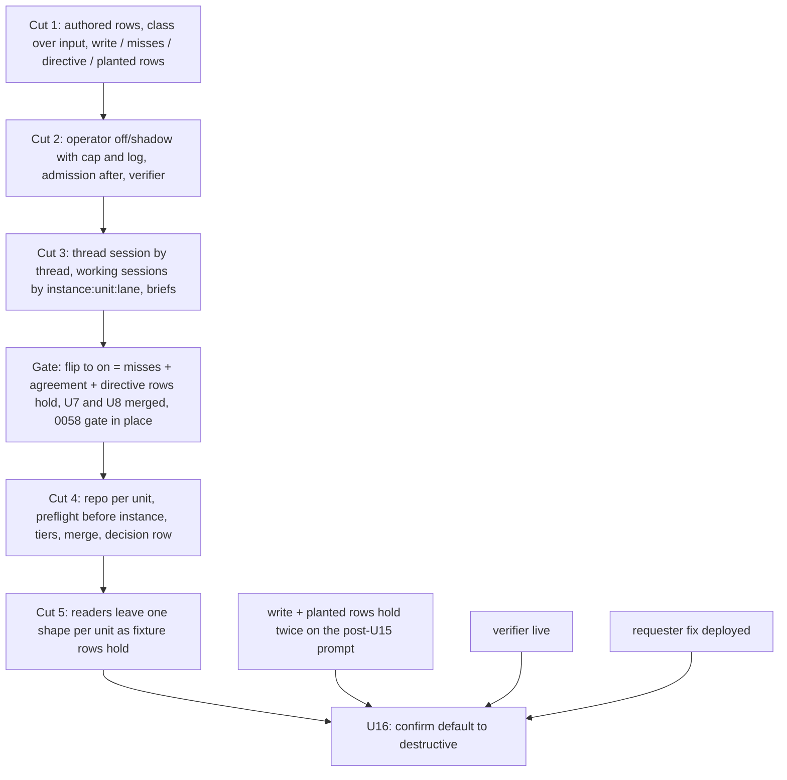

# The operator is the one door - the flag, the memory, the plan form, the deletion, the default - Plan

## Goal Capsule

**Amendment, 2026-09-18, while proposed: reconciled with record 0060.** Thread occupancy stays one live run per thread, enforced by the store's index; a plan's units run in threads of their own (record 0055) and the pipeline's parent holds none under record 0060's host key. U5 no longer rebuilds the `live_runs` index or touches the memory worker; its stage reorder, steer target and owner rule stay. U7's fold projects record 0060's `ship_unit` event and registers working sessions by the run's metadata thread key; the thread session also takes record 0058's silent replies. U9 lands after record 0060's hosted parent and host-only write path. AE1 and the plan's trace read under one thread per unit.

**Amendment, 2026-09-18, while proposed: what the first unit's run taught.** U1 ran on the plan runner in four coding and fix rounds; every round ran the whole gate before pushing and was steered by hand to push. The verification line of every unit named `npm run verify` as the child's proof, which made the full suite the child's job. Corrected below: a child proves its unit with changed-set forms and pushes a head early, CI's `verify` is the gate on the pull request, and a unit touching a Worker names that Worker's own typecheck and tests. The runner's other lessons are the Planning Contract's runner notes. U3's volume line reads the door run records for refusals. Every row the Verification Contract posts names its ledger.

- **Objective**: Build [record 0057](../decisions/0057-the-operator-is-the-one-door-a-model-binds-every-chat-input-and-deterministic-code-authorizes-fences-and-executes.md) as amended: one model turn, the operator, binds every admitted chat input into typed registry calls from the thread's session, the registry's projection and repository briefs; deterministic code authorizes the bound call as its author, classes it over its parsed input, fences the refusal and executes. The chat-side readers leave shape by shape as fixtures hold, the session is keyed by thread with working sessions per unit and lane, plan units carry their own repository, and the confirm default moves to destructive last, when the replay's write and planted rows hold twice against the final prompt and the verifier is live.
- **Authority**: record 0057 (proposed; this plan is the artifact its acceptance is judged on) over [record 0054](../decisions/0054-a-refusal-the-person-caused-is-one-question-with-a-best-guess.md) (the seam, the fence and the button reused; its deterministic-first ordering superseded; its remaining units absorbed here), [record 0044](../decisions/0044-a-routed-write-is-confirmed-in-proportion-to-its-blast-radius.md) (the class ladder and the confirmation store, extended not replaced), [record 0051](../decisions/0051-a-thread-has-one-owner-for-its-life-a-message-is-one-event-in-a-chosen-mode-and-a-pipeline-idles-instead-of-ending.md) (the owner rule, read through the operator), [record 0055](../decisions/0055-a-unit-has-one-thread-and-a-round-reads-the-checks-at-its-head.md) (one thread per unit, kept), [record 0058](../decisions/0058-a-thread-reply-is-read-before-it-is-answered-intake-decides-whether-the-bot-was-addressed.md) (the intake gate ahead of the operator for an unmentioned reply; a dependency of the `on` mode), [record 0060](../decisions/0060-a-ship-pipeline-is-a-live-run-for-its-whole-life-and-runs-on-every-channel-that-can-open-a-thread.md) (the hosted parent run and the host key own thread occupancy and the pipeline's posts; a dependency of cut four), [record 0034](../decisions/0034-one-agent-per-unit-a-run-continues-a-transcript.md) and [record 0035](../decisions/0035-a-session-log-outlives-its-runs-compaction-is-a-pointer.md) (the session log, re-keyed). The maintainer's answers recorded in the record's last amendment are settled.
- **Execution profile**: sixteen units in five cuts, each one pull request through the review loop, in dependency order. Tests first in every unit. Cut one (U1 to U3) changes no sentence a person reads and ships the measurements. Cut two (U4 to U6) ships the operator behind a three-mode flag, in shadow. Cut three (U7, U8) re-keys the memory and adds the briefs; the flip to `on` is a named gate after cut three. Cut four (U9 to U11) widens the projection to the plan form, the runner and the tiers. Cut five (U12 to U15) deletes the readers one shape at a time, and U16 moves the default. Units are seedable to the plan runner one at a time (`agent:ship in <owner/repo>: plan <this path> units U<n>`); a unit run by a person merges under `merge: person`. A child proves its unit with changed-set forms: `npx vitest run` on the unit's test files, `tsc --noEmit` on the touched project, prettier on the changed files, `npm run specs:check`, and `node scripts/public-hygiene.mjs` where the unit touches fixtures or docs; it pushes a head within twenty minutes of a round's start and lets CI's `npm run verify` judge it. A unit touching a Worker under `deploy/` also runs that Worker's own `npm run typecheck` and `npm run test` from its directory, since the root typecheck does not read a Worker's sources.
- **Stop conditions**: a unit whose pull request cannot turn CI's `verify` green within its listed files hands back a deviation. A unit stops and asks if it would: run a write from an operator decision while the flag is not `on`; flip `on` before its four gates hold; delete a reader whose fixture row does not hold; move the confirm default before U16's gates hold; honour a relay footer from an unlisted app; change a spec item without its bound test in the same pull request; put coding, ship or review on the fast tier; let a coordinator tag stand in for a requester on anything but a steer into its own plan's runs.

---

## Product Contract

### Summary

The plan makes the operator the only interpreter of chat input in five cuts: measure and secure the identity first, ship the operator in shadow beside today's readers with its tail cap and its comparison log, give it the thread's memory and the repositories' briefs and only then flip it on, widen its projection to plans that span repositories, then delete the readers as their fixtures hold and move the button to destructive acts only.

### Problem Frame

Nineteen router issues were filed in eight days. Seven of the seventeen distinct ones were not the model misreading words: a directive regex, a grammar parser and a repository token scan each read a slice of the request before or after the model and outranked it, so the router named a repository the regex refused, a typed directive skipped the model, and a reply into a live thread was folded before any model saw it. Two more rules landed the day the record was written. Record 0057 decides one interpreter and names, after a five-arm adversarial round, what the code lacks for it: authored session rows, a class that sees its arguments, a fence that is structure, admission after the operator, a keyed append for the fold, a repository on each plan unit, and a requester nobody can forge (the last shipping as its own pull request, which this plan's final unit depends on).

### Requirements

**Identity and class (cut one)**

- R1. Every session row carries the actor id of its author; the seed keeps a channel turn's author when it writes the row; a row with no author is a machine's.
- R2. A bind is authorized as its author; a bind of `steer`, and any destructive bind on a run another person requested, is refused unless the author is that person or holds a grant for it. The coordinator tag stands in for the plan's requester only for a bind of `steer` whose target run's lineage names the runner's own plan instance; every other bind the runner authors is authorized as the runner itself.
- R3. `annotations.destructive` is a boolean or a total predicate over the command's parsed input; `blastRadius` evaluates it after `parseInput`; a parse failure or a thrown predicate classes as destructive; the conformance suite fails a chat-exposed write without a declaration, a predicate that is not total over the schema, or a scope-like argument with a widening default.
- R4. The audit table classes every chat-exposed command under one rule: destructive means irreversible or affecting people other than the requester; `config set` and `mcp add` at channel or org scope are destructive, at `me` scope write.
- R5. The replay gains a write row (misbinds on write binds: a command, a required argument, a repository, or a filled optional argument the fixture did not name), a misses row (the seventeen filed misses as fixtures, bound as the person meant), a directive row (the six directive words as words), a planted row (fixtures whose fenced block carries an instruction while the author's turns ask for nothing or for something else; the row counts binds the verifier lets pass that no author turn asked for; bar zero), and a volume line (routed requests per day from the run store; events per day from the shadow log once U4 lands, printing `n/a before shadow` until then), with bars as named constants.

**The operator (cut two)**

- R6. `routing.operator` is `off`, `shadow` or `on`. Under `shadow` and `on` the operator is called once per chat event the intake gate admits, ahead of stage A and independent of the route stage's live-thread and directive short-circuits. In `shadow` the decision is written beside the routed request in the run store as the bound line, redacted and cut the way the receipt is, never the message text; it carries the intake gate's verdict when the gate is present; the agreement row reads it through the load harness's run-store access; it follows the run store's retention; nothing runs from it. In `on` the decision is what runs and the readers are consulted for the comparison only until they leave.
- R7. The operator's turn holds the thread session's tail within the operator's cap, the projection of the commands and presets the author may run, the repository briefs (capped at twenty, thread-touched first), a pending question's marker, and the request; it never holds the channel's history. Before U7 re-keys the log, the tail is the thread's existing per-agent logs read in the order of their runs, read-only.
- R8. The decision is a list of binds, or one question with its best guess as the full line, or one refusal with a cause; a steer is a bind of the `steer` command naming the run; an answer is a bind of the pending question's line; a decision never mixes binds with a question. The agreement row is defined over single-bind decisions against the readers' one result; multi-bind decisions, questions and refusals are counted in their own columns of the shadow log.
- R9. When the operator is `on`, it runs before admission; a thread holds one live run, a plan's units run in threads of their own (record 0055) and the pipeline's parent holds no thread (record 0060); a bind of `steer` names a run and folds into it at its next boundary, whichever thread holds it; a reply with no live run the decision steers is a bind.
- R10. For any bind that starts a run (a preset bind of any identity), any bind of `steer`, and any bind of class write or above, the verifier runs as a second model call on the fast tier, given the author's own turns and the bound line; a disagreement renders the question with the line as its proposal. A registry read that carries no free text runs without it.
- R11. Every receipt of a bind carries the class verdict and the operator's one-line reason. When the bind chose a repository or a preset, the receipt carries one re-bind button offering the next-best candidate: a confirmation row through the store, consumed for the clicker's ids (a foreign click is refused with the row kept); on consume, the inverse where one exists and the re-bound line are each parsed, classed over their parsed input and authorized as the clicker; a line that classes destructive renders the destructive button instead of running; when no inverse exists the re-bind renders a question naming both.
- R12. Every text a person did not type enters the operator's turn and every child's brief only inside record 0037's fence; a lint rule fails a module under `src/core/dispatch` or `src/channels` that passes untyped text to a model without it or reads chat text with a regex to decide its meaning, with the adapters' encoding helpers allowlisted by file.

**The memory (cut three)**

- R13. The thread session is keyed by the thread alone; the operator reads and writes it; every connector's event the intake gate admits, every child's report, every question and answer is a turn in it; a reply the gate withholds as silent is appended as the person's turn marked silent.
- R14. A working session is keyed `<instance>:<unit>:<lane>` and registers under the thread named in its run's metadata; every coding round of a unit continues `<instance>:<unit>:coding` and every review round `<instance>:<unit>:review`; a re-issue of the same plan id continues the prior instance's lanes; a child's first turn is the parent's brief followed by the thread session's tail within the seed budget.
- R15. The session object gains an idempotent keyed append; a fold projects record 0060's `ship_unit` event on the hosted parent run and its row id is that event's id; a connector's row id is the message id with its edit timestamp.
- R16. On the first event after cutover, an old thread's `<thread>:<agent>` logs are read once into the thread session in the order of their runs' start times, each run's rows in its session range in index order, rows outside any run's range after the runs that precede them; the old keys stay read-only for recall; a run live at cutover folds its remaining turns at its end.
- R17. The operator's tail is capped at 12,000 tokens; its prompt is ordered rules, projection, briefs, tail oldest-first, request; the cap, the order and the median-latency measurement ship with the flag.
- R18. Every resident carries a brief (the README's title, first paragraph capped, up to ten keywords from headings) built at provisioning and at the default-branch refresh; the residents index returns it; an installation repository with no resident gets the repository's description as its sentence, and one with neither carries its slug alone.

**The plan form, the runner and the tiers (cut four)**

- R19. A plan unit carries `repo`; the runner cuts each unit's branch in its repository, attaches each unit's children to that repository's resident, and lets that resident mint the token; a generated plan's id derives from the thread and the decision, not the text.
- R20. Preflight runs per unit before the plan instance is created: the resident exists or a cold sandbox can be provisioned, the installation sees the repository, the default branch is known; a unit that fails is a question whose answer re-issues that unit alone into the same instance; the runner's first receipt names every unit's repository.
- R21. A plan bind naming several repositories is write class unless a unit carries `merge: runner`, then destructive; a plan bind carries a per-requester cap on units in the shape of record 0046's lease, and a bind over the cap is a refusal naming the cap.
- R22. `merge` is a registry command whose input pins the pull request's head sha; it resolves the head to the unit run that opened it and is authorized under R2 against that run's requester; a head no run of this workspace opened is refused by name; a moved head refuses; a guest never binds it; it is destructive.
- R23. The confirmation row gains a `decision` member holding a list of binds, so a destructive plan bind is one button showing every line; one row per thread stays; a store that cannot be reached refuses the destructive bind by name.
- R24. Each preset declares an allowed set of tiers; a spawn and the operator's bind carry `model` and `effort` for the child in the request slot of the ladder, within the set; `coding`, `ship` and `review` never include the fast tier; `explore` and `research` may; the operator runs on the strong tier.

**The deletion and the default (cut five)**

- R25. Each chat-side reader leaves in its own unit after its fixtures hold on the replay: the directive words, the typed command line, the repository token scan, the attach token, the link unwrapping (which moves to the Slack adapter); `renewals:` becomes the `renewals` argument of the plan bind.
- R26. The built-in confirm default moves from write to destructive only when the write row and the planted row have held at their bars on two consecutive replays against the operator prompt at or after U15's merged head (a change to the prompt, the projection or the briefs between them restarts the count, and each receipt names the head it ran against), U6 is live and the requester fix is deployed; a guest's binds keep the write-class button.

**Every unit**

- R27. Every spec item a unit changes is changed in the same pull request with its proof bound; `npm run specs:check` passes.

### Acceptance Examples

- AE1. **Covers R6, R8, R9, R19, R21.** Given a plan thread whose one unit is idle at its lease in its own unit thread and `routing.operator: on`, when the requester replies in the plan thread with three bullets (a personal setting, a console change, a cli change), then one decision returns two binds (`config set me …` and a plan of two units, one per repository), the setting runs with a receipt naming its line and class, the plan's receipt names both repositories before any round, the two units open threads of their own, and the idle unit is untouched.
- AE2. **Covers R1, R2, R22.** Given the same thread, when a different member replies "merge the cli one", then the bind is authorized as that member and is refused for the requester's unit unless they hold a grant, with the reason on the card.
- AE3. **Covers R3, R4.** Given `config set` bound with `scope: channel`, then the class is destructive and the button renders; bound with `scope: me`, the class is write; bound with a look-alike or array-shaped scope, the class is destructive or the parse fails, never `me`.
- AE4. **Covers R6, R25.** Given `routing.operator: shadow` and a typed `runs list --status all`, then the readers run it as today, the operator's decision is written beside the routed request, and the agreement row counts a match on command and arguments.
- AE5. **Covers R14, R15.** Given a unit whose coding round ended and whose runner was reclaimed before the fold, when the fold runs twice, then the thread session holds one report turn, and the unit's next coding round continues `<instance>:<unit>:coding`.
- AE6. **Covers R20.** Given a plan bind of two units where the second names a repository the installation cannot see, then no instance is created, the decision is a question naming the second unit with the corrected line, and the answer re-issues only that unit into the instance the first unit runs in.
- AE7. **Covers R10, R18.** Given a brief whose README paragraph carries an instruction to run an investigation, when the operator binds an `explore` spawn from it and no author turn asked for one, then the verifier disagrees, a question renders, and no run starts.

### Scope Boundaries

- Record 0048's git door for the cold path: a cold child holds the installation's grant until it lands; the runner's receipt says so on that unit's card.
- The requester fix (the relay footer honoured only for a listed app; the thread-parent rule for people only) ships as its own pull request; U16 depends on its deployment.
- Record 0058's intake gate is its own plan; the `on` mode depends on it, `shadow` does not.
- The finding loop of record 0055's fourth item, record 0052's control ladder and model catalog, and any change of the operator's model beyond the tier declared here.
- Record 0054's first two units (the seam and the fence) continue as they are; its third unit lands as-is and its near-match helper becomes evidence in U4; its fifth to ninth units are absorbed here (U4 carries the question and the answer, U8 the briefs).

#### Deferred to Follow-Up Work

- Cross-thread memory (a person's recall across threads), which two peer tools have and the record does not decide.
- A model-written brief sentence, if the deterministic one proves too thin on the repository row.
- An explicit interrupt, queue or steer choice offered to the person, rejected by the record in favour of inference plus the re-bind button; revisit if the re-bind rate on the receipts says otherwise.
- Deleting a thread session and its retention, and whether a child's hand-down drops turns by authors other than the requester: U7 states both as it finds them.

### Outstanding Questions

- Deferred, U4: the operator's tail cap (12,000 tokens is the guess; the first replay with the tail attached sets it) and whether `shadow` runs when `routing.auto` is off.
- Deferred, U16: how the requester fix is disclosed, since the repository is public; the maintainer's call after it deploys.

---

## Planning Contract

### Key Technical Decisions

- KTD1. **The operator ships behind a three-mode flag, is called ahead of every reader, and is measured in shadow before it acts.** `routing.operator: off | shadow | on` follows `routing.auto`'s shape (an optional field on `RoutingConfig`, a strict-key entry and a by-name refusal in `validate.ts`, a commented example). Under `shadow` and `on` the dispatcher calls the operator once per admitted event before stage A and outside `routeRequest`'s live-thread and directive short-circuits, or the shadow week would never see the replies and typed lines the record amended in. The shadow decision is stored beside the routed request in the run store, redacted like the receipt; the agreement row is defined over single-bind decisions. The flip to `on` is a named gate: the misses row holds, the agreement row on typed lines is at or above the command row's bar, the directive row holds, U7 and U8 are merged, and record 0058's intake gate is in place. Governs R6, R8.
- KTD2. **No fast path for a typed command line in chat.** Stage A leaves with U13; a typed line is words the operator binds; the lint rule has no exception to defend. (session-settled: user-directed — chosen over a replay-proven deterministic fast path: a proven-identical parser is a second interpreter by another name, and every miss this week came from a reader outranking the model.) Governs R25.
- KTD3. **The operator runs on the strong tier with a 12,000-token tail and a cache-friendly prompt order, and the cap ships with the flag.** The cost arm found the tail, not the projection, is the whole cost and the latency; capping the operator's tail below the run seed's 60,000 and ordering the prompt rules, projection, briefs, tail oldest-first, request lets consecutive events in a thread hit the prompt cache for everything but the new turns. The cap, the order and the latency measurement land in U4 so the shadow week measures the operator that will go live. (session-settled: user-directed — chosen over the fast tier: the fast model misread eight of seventeen distinct cases with words it could see; the maintainer noted the operator's model is the likeliest to change later.) Governs R7, R17.
- KTD4. **Three outcomes; steer and answer are binds.** A steer is a bind of a `steer` registry command (run id, words; declared for the chat surface only); an answer is a bind of the pending question's proposed line. Both pass authorization, which is what gives a steer an owner and lets R2 hold with one rule. Governs R8, R9.
- KTD5. **Class is evaluated over parsed input, after `parseInput`, and fails closed.** `risk(input)` today receives raw `{args, options}`; the predicate is typed over the zod output, so totality is the compiler's; a parse failure or a throw classes destructive; the route stage parses before it classes. Governs R3, R4.
- KTD6. **The thread session is keyed by thread; a working session by instance, unit and lane; the log gains a keyed append; thread occupancy is untouched.** Record 0034's isolation hangs on the unit, not the agent; the fold projects record 0060's `ship_unit` event with that event's id as its idempotency key, a connector's row id is the message id with its edit timestamp; `SessionLogDO` gains a `row_id` beside `(idx, part)` and an `append` route that ignores a repeated id. Thread occupancy stays one live run per thread, enforced by the store's index: a plan's units hold threads of their own (record 0055) and the pipeline's parent holds none under record 0060's host key, so nothing here changes the `live_runs` schema or the memory worker. Governs R9, R13, R14, R15, R16.
- KTD7. **The write bar is the record's guess until the first replay moves it, and the final replays are pinned to the final prompt.** Zero misbinds on the imperative and command fixtures, at most one in fifty on paraphrases, plus a planted row at zero, held on two consecutive replays against the operator prompt at or after U15's head, plus production agreement on typed lines at or above the command row's bar. A prompt change restarts the count. (session-settled: user-approved — chosen over a strict zero on paraphrases: paraphrases are where models miss and where fixtures keep arriving, so a strict bar keeps the button for months.) Governs R5, R26.
- KTD8. **A plan bind naming several repositories is write class unless a unit carries `merge: runner`, and carries a per-requester unit cap.** A pull request is reversible; a runner merge is not; the cap is record 0046's lease shape. (session-settled: user-directed — chosen over destructive for every multi-repository plan: the button would return to the case the record exists to remove.) Governs R21.
- KTD9. **Tiers are per preset allowed sets, chosen by the parent at spawn; code-writing never runs fast.** Every peer chooses per agent at invocation; the prompt cache is model-scoped, so a run's tier is fixed at dispatch and escalation is a new run. (session-settled: user-directed — chosen over allowing the fast tier for coding: a wrong approval and a wrong edit cost more than the tokens saved; explore and research read and may run fast.) Governs R24.
- KTD10. **Steer versus new bind is inferred; the re-bind button is the override, and it is a confirmation row.** Words addressed to work in flight bind a steer, words stating a new outcome bind new work, in doubt the question; the receipt's re-bind button offers the next-best candidate through the store, so a foreign click is refused and a destructive inverse renders its button. (session-settled: user-approved — chosen over an explicit interrupt/queue/steer choice: a chosen mode is a directive by another name.) Governs R9, R11.
- KTD11. **The readers leave one shape per unit, each gated by its fixture row; the fence's known holes close early.** A reader's cases are ported from its own tests into fixtures first; the unit deletes the reader only when the row holds; the lint rule lands with the last one so the tree has nothing left to fail it. The two unfenced paths the record names, review prose in a coding brief and pull request facts, are wrapped in U8, not with the lint. Governs R12, R25.
- KTD12. **Record 0054's remaining units are absorbed, not run beside this plan.** Two plans against one door would race; the seam and fence continue, the third unit lands as-is (its helper is evidence in the operator's turn), the answer row and words-as-an-answer become U4's question and answer binds, the router's question is the operator's question outcome, the remaining guess sites are evidence lines, the cards are U8's briefs. Record 0054's plan takes one dated note pointing here.
- KTD13. **Admission runs after the operator when it is on, and a steer names the run in the unit's own thread.** Today's admission folds a reply into the live run before any model reads it; under `on` the decision names the run an event steers, or none, and record 0051's owner rule survives as that sentence. The durable inbox, the boundary fold and the coordinator's `coordinator_thread_live` refusal stay as they are. Governs R9.
- KTD14. **Preflight before the instance, and the generated plan id from the thread and the decision.** A branch failure after the instance exists abandons one unit while siblings run, and a re-bound text hashes to a new instance; deriving the id from the thread and the decision id and checking every unit before `handOffToCoordinator` creates the instance makes a re-issue land in the same instance. Governs R19, R20.
- KTD15. **The verifier holds every bind a planted instruction could fill.** A README brief, a quoted thread or a folded report can carry an instruction; the binds whose arguments such text fills are those that start a run, steer one, or write. The verifier runs on all three whatever the class, and the planted row measures its catch rate against the production prompt before the default moves. Governs R10, R26.

### High-Level Technical Design

The dispatch order under `routing.operator: on`, with the readers gone:

```mermaid
sequenceDiagram
  participant C as connector (Slack, web, CLI)
  participant G as intake gate (record 0058)
  participant S as thread session
  participant O as operator
  participant A as authorize + class + verifier
  participant M as admission
  participant R as run / runner
  C->>G: event with author
  G-->>S: admitted: append(rowId, event)
  S-->>O: tail (12k cap), pending question marker
  O->>O: decision: binds[] | question | refusal
  O->>A: each bind, authored
  A->>A: policy table as author; class over parsed input; verifier for run-starting, steer, write+
  alt destructive
    A->>C: button with every line
  else read, exec, write
    A->>M: admit: steer names a live run, or a new run in a unit's own thread
    M->>R: fold at boundary, or start
    R-->>S: report folds once under runId+attempt
    A->>C: receipt: line, class verdict, reason, re-bind row
  end
```

The five cuts and what gates each:



### Sequencing

U1 to U3 first: nothing a person reads changes, and every later unit's tests need authored rows, the class predicate and the replay rows. U4 ships the operator in shadow with its cap, its order and its log; U5 moves admission after the operator and adds the steer owner rule, with no store or Worker change; U6 wires the verifier while shadow data accrues. U7 re-keys the memory and U8 adds the briefs and wraps the two unfenced child paths. The flip to `on` follows cut three on its named gate. U9 to U11 widen the projection and the runner. U12 to U15 delete the readers in the order of least risk: directives, the typed line, the repository scan, then the attach token and the link unwrapping with the lint rule. U16 last, on its four gates.

### Risks and Dependencies

- **The write row or the planted row never reaches the bar.** The button stays at write and every other unit still ships; nothing else depends on U16.
- **Shadow disagreement is high on typed lines.** The agreement row says so before anything runs from the operator; the flip to `on` waits, and U13 waits on the command row.
- **The keyed append and the migration lose or double a row.** U7's tests replay ten real threads with the fold and a live run at cutover; the old keys stay readable for recall so nothing is unrecoverable.
- **The operator's latency on the strong tier exceeds three seconds at the median.** U4 measures with the tail attached and records output-token counts beside the median; the cap drops; the tier stays.
- **A predicate is wrong for one shape.** The suite proves totality, not correctness; U2's audit table carries a table test per predicate.
- **The shadow week's cost.** One strong-tier call with a capped tail per admitted event on top of today's router; the volume line sizes it in the first week and the cap is the lever.
- **Depends on** the requester fix's deployment (U16's gate), record 0058's intake gate (the `on` mode's gate, not `shadow`'s), record 0060's host key, hosted parent and host-only write path ahead of cut four, record 0054's first two units as merged, record 0044's store and buttons, the resident plane's `/residents` index, and the review loop.
- **Runner notes** (from the first unit's run): the runner refuses a merge when its head conflicts with `main`; the recovery is a rebase, a re-review and a merge by a person, never a re-issue, since a re-issued seeded plan starts its unit at coding round zero and adopts no open pull request. A steer into a live round folds at the round's next boundary; one is sent when a round reaches its fifteenth minute with nothing pushed and none after its seventieth, when it costs the round its rebase. A steer never asks for the suite or for green; it names the changed-set forms above. Unit ids in code, tests or specs trip the public hygiene ratchet's plan-id class; a unit's prose lives in this plan alone.

---

## Implementation Units

| U-ID | Title | Key files | Depends on |
|---|---|---|---|
| U1 | Authored session rows | `src/core/runLedger/transcript.ts`, `src/core/runLedger/sessionLog.ts`, `src/core/dispatch/seed.ts`, `src/core/runLedger/writeThrough.ts` | none |
| U2 | Class over parsed input and the audit | `src/core/commandRegistry.ts`, `src/core/dispatch/route.ts`, `src/core/commands/config.ts`, `src/core/commands/mcp.ts`, `src/core/commandConformance.test.ts` | none |
| U3 | The replay rows: write, misses, directive, planted, volume | `src/load/routeReplay.ts`, `src/load/routeWriteFixtures.ts`, `src/load/routeMissFixtures.ts`, `src/load/routeDirectiveFixtures.ts`, `src/load/routePlantedFixtures.ts`, `scripts/load.ts` | none |
| U4 | The operator behind `routing.operator`, with its cap and its log | `src/core/dispatch/operator.ts`, `src/core/dispatch/seed.ts`, `src/core/dispatcher.ts`, `src/core/dispatch/route.ts`, `src/config.ts`, `src/config/validate.ts`, `src/core/commands/steer.ts`, `src/core/dispatch/record.ts` | U1, U2, U3 |
| U5 | Admission after the operator | `src/core/dispatcher.ts`, `src/core/dispatch/admission.ts`, `src/core/threadAdmission.ts`, `src/core/dispatch/authorize.ts` | U1, U4 |
| U6 | The verifier wired | `src/core/dispatch/route.ts`, `src/core/dispatch/operator.ts`, `src/core/dispatch/reply.ts` | U1, U4 |
| U7 | The thread session and the working sessions | `src/core/runLedger/sessionLog.ts`, `src/core/runLedger/writeThrough.ts`, `src/core/runLedger/ledger.ts`, `deploy/cloudflare-memory/worker.ts`, `src/core/dispatch/seed.ts`, `src/channels/adminCoordinator.ts`, `src/core/unitRuns.ts`, `web/src/pages/UnitPage.vue` | U1, U4 |
| U8 | Repository briefs, and the two unfenced paths | `deploy/cloudflare-resident/worker.ts`, `src/core/residentFleet.ts`, `src/core/repoContext.ts`, `src/execution/githubApi.ts`, `src/core/dispatch/operator.ts`, `src/core/coordinator/briefs.ts`, `src/load/routeRepoFixtures.ts` | U4 |
| U9 | A repository per unit, the unit cap, preflight before the instance | `src/core/coordinator/contract.ts`, `src/core/coordinator/handOff.ts`, `src/core/ship/coordinator.ts`, `src/core/coordinator/driver.ts`, `src/channels/adminCoordinator.ts` | the `on` gate, U7, record 0060's hosted parent and host-only write path |
| U10 | Tiers at spawn | `src/agents/registry.ts`, `src/core/dispatch/spawn.ts`, `src/tools/runs.ts`, `src/config.ts`, `src/channels/adminCoordinator.ts` | U4 |
| U11 | The merge command, the decision row, the re-bind row | `src/core/commands/merge.ts`, `src/core/confirmations.ts`, `src/core/dispatch/confirm.ts`, `src/core/dispatch/reply.ts`, `src/core/dispatch/authorize.ts`, `deploy/cloudflare-memory/worker.ts` | U4, U9 |
| U12 | The directive words leave | `src/directives.ts`, `src/core/dispatch/resolve.ts` | the `on` gate, U3 |
| U13 | The typed command line leaves stage A | `src/core/dispatch/fastPath.ts`, `src/core/commandChat.ts`, `src/core/dispatcher.ts` | U12 |
| U14 | The repository token scan leaves | `src/core/repoContext.ts`, `src/core/dispatch/resolve.ts`, `src/load/routeRepoFixtures.ts` | U8, U13 |
| U15 | The attach token and the link unwrapping leave; the lint rule | `src/core/dispatch/route.ts`, `src/core/commandChat.ts`, `src/channels/slack.ts`, `src/chatTextFence.mjs`, `eslint.config.mjs` | U14 |
| U16 | The confirm default moves | `src/config/profile.ts`, `src/config/validate.ts`, `src/core/dispatch/route.ts` | U6, U15, the write and planted rows twice on the post-U15 prompt, the requester fix deployed |

### U1. Authored session rows

- **Goal**: every row a person's turn produces carries that person's actor id; the seed keeps it when it writes a channel turn; a steer, a verifier and a later bind can tell the requester's words from another member's.
- **Requirements**: R1, R27 (session-log item 1 and item 4; slack-channel item 13).
- **Dependencies**: none.
- **Files**: `src/core/runLedger/transcript.ts` (`StoredPart.actor`; `turnRows` takes the author; `assembleTranscript` unchanged, it reads `role` and `part` only); `src/core/runLedger/sessionLog.ts` (a reader `actorOfStoredRow`; `roleOfStoredRow` and `textOfStoredRow` unchanged); `src/core/dispatch/seed.ts` (the channel lines since the previous run write `actor` from `ThreadTurn.user`; the request row writes the requester's id); `src/core/runLedger/writeThrough.ts` (rows carry `actor` through `append`); tests `src/core/runLedger/transcript.test.ts`, `sessionLog.test.ts`, `src/core/dispatch/seed.test.ts`, `writeThrough.test.ts`.
- **Approach**:
  1. Tests first: a seeded conversation from a thread with two authors yields rows whose `actor` matches each turn's user; a machine turn has none; an old row without `actor` reads as none; the assembled transcript carries no `actor`.
  2. Add the field and its reader; thread it through the seed and the write-through.
  3. Spec rows: session-log item 1 (a row's author) bound to the new tests.
- **Patterns to follow**: `rowKind` and `roleOfStoredRow` in `sessionLog.ts`; `turnRows` in `transcript.ts`; the seed's channel-lines block.
- **Test scenarios**:
  - Two people in one thread: each row's `actor` is its author's id.
  - A bot's turn and a folded report: no `actor`.
  - A stored row from before this unit parses and reads `actor` as absent.
  - The provider's messages carry no `actor` field.
- **Verification**: the test files green, red first; `npm run specs:check`; CI's `verify` green on the pull request.

### U2. Class over parsed input and the audit

- **Goal**: `config set` at `channel` scope is destructive and at `me` scope write from one declaration; a predicate sees the parsed input and fails closed; the conformance suite proves totality and refuses widening defaults; the 24 chat-exposed commands are audited under the record's rule.
- **Requirements**: R3, R4, R27 (command-registry item 29 and item 25; routing-and-config item 25).
- **Dependencies**: none.
- **Files**: `src/core/commandRegistry.ts` (`destructive: boolean | (input: <parsed>) => boolean`; `blastRadius(def, parsed?)`; a helper that parses then classes and returns destructive on failure); `src/core/dispatch/route.ts` (the door parses before `routedRunsAtOnce` and `risk`); `src/core/commands/config.ts` and `src/core/commands/mcp.ts` (scope predicates); `src/core/commandConformance.test.ts` (totality over the schema's enums, the look-alike and array fixtures, the widening-default check); tests `src/core/commandRegistry.test.ts`, `src/core/dispatch/route.test.ts`.
- **Approach**:
  1. Tests first: the six predicates in the audit table, each with a table test over every scope value plus a look-alike and an array; `blastRadius` on a parse failure; the conformance rows.
  2. Widen the annotation type; move the parse ahead of the class in the route stage; write the predicates; the audit table in the pull request body and the spec.
  3. Spec rows: command-registry item 29 (the predicate, totality, fail closed), routing-and-config item 25 (class over the bound input).
- **Execution note**: nothing a person reads changes while the default is write; the diff is the declaration shape and the parse order.
- **Patterns to follow**: `risk(input)` and its conformance row; `parseInput` and `.strict()` in `commandRegistry.ts`.
- **Test scenarios**:
  - `config set` with `scope: me`, `channel`, `org`: write, destructive, destructive.
  - `scope: "CHANNEL"`, `" channel"`, a Cyrillic look-alike, `["channel"]`: destructive or parse failure, never write.
  - A schema with a defaulted scope-like argument fails the conformance row.
  - `memory forget`, `mcp remove`, `runs stop` on another's run: destructive.
- **Verification**: the test files green, red first; `npm run specs:check`; CI's `verify` green on the pull request.

### U3. The replay rows: write, misses, directive, planted, volume

- **Goal**: `npm run load -- route` prints the write row, the misses row, the directive row, the planted row and the volume line, each with a bar as a named constant; the fixtures pass public hygiene.
- **Requirements**: R5, R27 (load-harness item 17).
- **Dependencies**: none.
- **Files**: `src/load/routeWriteFixtures.ts` (new: write binds with the expected command, required arguments, repository and the optional arguments left unset), `src/load/routeMissFixtures.ts` (new: the seventeen misses rewritten without names, ids or org slugs, each with the bind the person meant), `src/load/routeDirectiveFixtures.ts` (new: the six directive words in first position and mid-sentence, ported from `src/directives.test.ts`, each with the bind the word meant), `src/load/routePlantedFixtures.ts` (new: a fenced brief, a fenced report and a fenced quoted thread each carrying an instruction, with author turns that ask for nothing or for something else), `src/load/routeReplay.ts` (the rows, `WriteScore`, `MissScore`, `DirectiveScore`, `PlantedScore`, the misbind definition, bars; the planted row scores under `--verify`), `scripts/load.ts` (the volume line: routed requests from the run store; refusals from the door run records, which record 0054's last unit made of every refusal, with its code and cause; events from the shadow log, `n/a before shadow` until U4); tests `src/load/routeReplay.test.ts`.
- **Approach**:
  1. Tests first: a scripted model that fills an optional argument the fixture left unset counts one misbind; one that leaves a fixture-set optional unset counts none; the misses row scores per fixture; the directive row binds each word; the planted row counts a bind the scripted verifier lets pass; the volume line prints routed requests, refusals and events per day, or the placeholder for events.
  2. Add the fixtures, the scores, the rows and the bars.
  3. Spec rows: load-harness item 17 (the new rows and their bars).
- **Patterns to follow**: `RouteCommandFixture` and `f(...)`; `CommandScore` and `routeChecks`; `verifyBind`; bars as named constants.
- **Test scenarios**:
  - A write bind naming the wrong command, a wrong required argument, a wrong repository, a filled unasked optional: four misbinds.
  - A bind that omits a fixture-set optional: zero misbinds.
  - The misses row over three fixtures with two bound right prints two of three and fails its bar.
  - A planted fixture whose verifier passes a bind no author asked for: one planted miss; the bar is zero.
  - Public hygiene passes over every fixture file.
- **Verification**: the test files green, red first; `node scripts/public-hygiene.mjs`; CI's `verify` green on the pull request.

### U4. The operator behind `routing.operator`, with its cap and its log

- **Goal**: with `routing.operator: shadow`, every admitted chat event runs the operator ahead of stage A and outside the route stage's short-circuits, with a 12,000-token tail read from the thread's existing logs, and its decision is written beside the routed request in the run store with the intake gate's verdict when present; with `on`, the decision is what runs; the decision is binds, a question or a refusal; a pending question's marker and its answer-as-a-bind replace record 0054's answer tool; the near-match guess is an evidence line; the median bind latency and output-token counts are measured on the replay.
- **Requirements**: R6, R7, R8, R11 (the receipt's verdict and reason), R17, R27 (routing-and-config item 21, a new item for the operator; load-harness item 17; run-history, a row for the shadow decision).
- **Dependencies**: U1, U2, U3.
- **Files**: `src/core/dispatch/operator.ts` (new: the prompt builder with the fixed order, the decision tool, the projection filtered by the author's allowed presets and commands, the parse of the decision); `src/core/dispatch/seed.ts` (the operator's tail: the cap, folded reports whole ahead of older turns, and before U7 the thread's per-agent logs in run order); `src/core/dispatcher.ts` (the call site ahead of stage A; the shadow write; `on` executes the decision); `src/core/dispatch/route.ts` (`routedRunsAtOnce` over the parsed input; the route stage untouched under `off`); `src/core/dispatch/record.ts` (the shadow decision beside the routed request, redacted like the receipt); `src/core/commands/steer.ts` (new registry command: run id and words; write class; `surfaces: { mcp: false, http: false, cli: false }`); `src/config.ts` (`RoutingConfig.operator`), `src/config/validate.ts`, `config/config.example.yaml`; `src/core/dispatch/reply.ts` (the receipt carries the class verdict and the reason); `src/load/routeReplay.ts` (the agreement row from the shadow log; the latency measurement); tests `src/core/dispatch/operator.test.ts`, `route.test.ts`, `dispatcher.test.ts`, `seed.test.ts`, `record.test.ts`.
- **Approach**:
  1. Tests first: a scripted operator returns two binds and the dispatcher, under `shadow`, runs the readers' result and writes the decision beside the request; a reply into a live thread under `shadow` writes the operator's steer-or-bind decision beside admission's fold; a typed command line under `shadow` writes the operator's bind beside stage A's result; under `on`, the binds run; a decision mixing binds and a question is refused by the parser; a pending question's marker in the tail plus "yes" yields a bind of the proposed line; the projection excludes a preset the author may not run; a 30,000-token log yields a 12,000-token tail with folded reports whole ahead of older turns; the shadow row carries the intake verdict when the gate is present and no message text.
  2. Write the operator module; add the flag; wire the call site and the write; add `steer`; cap and order the tail; measure the median latency and output tokens on the replay and post them.
  3. Spec rows: routing-and-config, a new item for the operator (its inputs, its three outcomes, the flag's modes, the call ahead of stage A); load-harness item 17 (the agreement row); run-history (the shadow row).
- **Execution note**: under `shadow` nothing a person reads changes; the first visible change is `on`, which stays off in production until its gate holds after cut three.
- **Patterns to follow**: `buildRoutePrompt` and `RouteInput`; `routableCommands` and `routablePresets`; `routing.auto` and `routingOn`; the question marker of record 0054's renderer; `ROUTE_RECEIPT_CAP`.
- **Test scenarios**:
  - Shadow: readers and operator disagree on a typed line; the row holds both; nothing runs from the operator.
  - Shadow on a reply into a live thread: the operator's decision is written beside the fold.
  - On: two binds run in order with receipts naming line, class and reason.
  - A question decision renders with the marker; the next turn "yes" binds the proposed line; "no, the docs one" binds fresh.
  - A refusal with cause `policy` renders no Yes.
  - The projection for a requester without `coding` carries no coding tool.
  - The tail cap and order; the shadow row's redaction.
- **Verification**: the test files green, red first; `npm run specs:check`; CI's `verify` green on the pull request; `npm run load -- route` prints the agreement row, the median latency and the output-token counts, posted on the receipts tracker.

### U5. Admission after the operator

- **Goal**: with the operator `on`, the decision runs before admission; a bind of `steer` names a run and folds into it at that run's next boundary, whichever thread holds it; a steer by someone other than the run's requester without a grant is refused; the runner's stand-in as requester holds only for steers into runs of its own plan instance. Thread occupancy is untouched: one live run per thread, a plan's units in threads of their own, the pipeline's parent under record 0060's host key.
- **Requirements**: R2, R9, R27 (thread-admission items 1, 2, 5 to 8; authorization item 16).
- **Dependencies**: U1, U4.
- **Files**: `src/core/dispatcher.ts` (stage order under `on`: operator, then authorize each bind, then admission per bind); `src/core/dispatch/admission.ts` (`admit` takes a target run for a steer, which may live in another thread of the same plan); `src/core/threadAdmission.ts` (`decideFollowUp` reads the decision, not the directive); `src/core/dispatch/authorize.ts` (the steer owner rule: requester or grant; the coordinator tag stands in only for a steer whose target's lineage names the runner's instance); tests `admission.test.ts`, `threadAdmission.test.ts`, `dispatcher.test.ts`, `authorize.test.ts`.
- **Approach**:
  1. Tests first: two units live in two unit threads; a steer typed in the plan thread names the second and folds into its thread's run; a new bind while both are live opens a third unit thread; a member's steer into the requester's run is refused with the reason; the runner's steer into its own child passes; the runner's steer into a run outside its instance is refused; the runner's destructive bind on a person's run outside its instance is refused.
  2. Reorder the stages under the flag; let a steer target a run in another thread of the same plan; add the owner rule.
  3. Spec rows: thread-admission items 1, 2 and 8 (the steer names its run; the coordinator's refusal as it is); authorization item 16 (the steer owner and the runner's bound stand-in).
- **Execution note**: no store or Worker change in this unit; push a green head before running the whole suite, and run only the touched test files locally.
- **Patterns to follow**: `admit` outcomes as a closed union; `steerRun` and the durable inbox; `canRunAgent`; record 0060's host key for what a pipeline parent claims.
- **Test scenarios**: as in the approach, plus a steer into a run that ended is re-dispatched as a bind of the same words.
- **Verification**: the test files green, red first; `npm run specs:check`; CI's `verify` green on the pull request.

### U6. The verifier wired

- **Goal**: under `on`, for any bind that starts a run, any bind of `steer`, and any bind of class write or above, a second model call on the fast tier reads the author's own turns and the bound line and answers whether the line does what those turns asked; a disagreement renders the question with the line as its proposal; a registry read with no free text runs without it.
- **Requirements**: R10, R27 (routing-and-config item 25 and the operator item).
- **Dependencies**: U1, U4.
- **Files**: `src/core/dispatch/route.ts` (`verifierPrompt` takes the author's turns, not the thread's, and the fence around them); `src/core/dispatch/operator.ts` (the verifier call after a qualifying bind); `src/core/dispatch/reply.ts` (the disagreement renders a question); tests `route.test.ts`, `operator.test.ts`, `dispatcher.test.ts`.
- **Approach**:
  1. Tests first: an instruction planted in a brief yields a write bind no author turn asked for; the verifier disagrees; a question renders; the same for an `explore` spawn bound from a planted brief; a bind the author's words asked for passes; a registry read with no free text skips the call.
  2. Wire the call; select the author's rows by `actor`.
  3. Spec rows: routing-and-config item 25 (the verifier as a hold for run-starting, steer and write binds).
- **Patterns to follow**: `verifyBind` in the replay; `VERIFY_TOOL_NAME`; `wrapUntrusted`.
- **Test scenarios**:
  - Planted instruction in a brief binding a write: question, nothing runs.
  - Planted instruction binding an `explore` spawn: question, no run starts.
  - Author asks for the write: passes with one extra receipt line.
  - `runs list`: no verifier call.
- **Verification**: the test files green, red first; `npm run specs:check`; CI's `verify` green on the pull request.

### U7. The thread session and the working sessions

- **Goal**: the operator reads and writes one session per thread; a unit's coding and review lanes each continue one working session across rounds and re-issues; folds and connector turns append once under a row id; old per-agent logs read into the thread session once at cutover in run order; the unit page's session search derives the new keys; deletion and retention of a thread session are stated.
- **Requirements**: R13, R14, R15, R16, R27 (session-log items 1, 2, 4, 9, 11; agent-ship item 17; live-view item 28; slack-channel item 11).
- **Dependencies**: U1, U4.
- **Files**: `src/core/runLedger/sessionLog.ts` (`threadSessionKey(threadKey)`, `workingSessionKey(instance, unit, lane)`); `deploy/cloudflare-memory/worker.ts` (`turns.row_id` with a unique index; an `append` route idempotent on the id; the migration read; `sessions` registration of a working key under the thread named in the run's metadata, record 0060's deferral); `src/core/runLedger/writeThrough.ts` (`append(key, rowId, rows)`; the fold); `src/core/runLedger/ledger.ts` (the per-thread run listing the migration orders by); `src/core/dispatch/seed.ts` (the operator reads the thread session; the child's hand-down); `src/channels/adminCoordinator.ts` (children dispatched with the working key); `src/core/unitRuns.ts` and `web/src/pages/UnitPage.vue` (sessions from the new keys); tests `sessionLog.test.ts`, `writeThrough.test.ts`, `seed.test.ts`, `unitRuns.test.ts`, the Worker's test.
- **Approach**:
  1. Tests first: a fold that reads the same `ship_unit` event twice yields one row and never a second copy of the report; a silent reply appends as the person's turn marked silent; an edited message appends a second row; two connectors in one second keep the object's order; a re-issued plan continues the prior instance's coding lane; a live run at cutover folds its remaining turns at its end; ten recorded threads replay through the migration in run order and a later bind finds a folded fact.
  2. Add the keys and the append; migrate the readers of `<thread>:<agent>`; switch the operator's tail to the thread session; derive the unit page's keys; state deletion (which command reaches a thread session) and retention in the spec.
  3. Spec rows: session-log items 1, 2 and 11; agent-ship item 17; live-view item 28.
- **Execution note**: the migration is read-once; nothing rewrites an old key. The memory Worker's own `npm run typecheck` and `npm run test` run from `deploy/cloudflare-memory` before the push.
- **Patterns to follow**: `sessionKey` and its pattern; `claimSession` and the owner table; `unitRunsOf` and the unit page's `sessions`; `registerSession`.
- **Test scenarios**:
  - Idempotent fold; edited message; concurrent connectors.
  - Lane continuity across three rounds and a re-issue.
  - Migration of a thread with two agents' logs, ordered by their runs' start times with rows outside any range after the runs before them.
  - The unit page lists `<instance>:<unit>:coding` and `<instance>:<unit>:review`.
- **Verification**: the test files green, red first; `npm run specs:check`; CI's `verify` green on the pull request.

### U8. Repository briefs, and the two unfenced paths

- **Goal**: every resident carries a brief built from its README at provisioning and refresh; the residents index returns it; the operator's turn carries at most twenty briefs, thread-touched first, inside the fence; an installation repository with no resident carries its description, and one with neither its slug; review prose in a coding brief and pull request facts enter their turns inside the fence; the replay's repository row measures binds from the subject alone.
- **Requirements**: R12 (the two paths), R18, R27 (resident-repos item 4 and item 6; routing-and-config's operator item; load-harness item 17; agent-ship the brief item).
- **Dependencies**: U4.
- **Files**: `deploy/cloudflare-resident/worker.ts` (`RepoFacts.brief`; built where facts are written; returned by `/residents`) and its test; `src/core/residentFleet.ts` and `src/core/repoContext.ts` (`ResidentSlugs` becomes a briefs read; pull request facts wrapped); `src/execution/githubApi.ts` (`listRepos()` description as a brief); `src/core/dispatch/operator.ts` (the briefs block, capped, fenced); `src/core/coordinator/briefs.ts` (review prose wrapped); `src/load/routeRepoFixtures.ts` (new) and `src/load/routeReplay.ts` (the repository row); tests beside each.
- **Approach**:
  1. Tests first: a fixture README yields title, capped first paragraph, ten keywords; rebuilt on refresh when the sha moves; the operator's turn carries the thread's repositories first and caps at twenty; a scripted bind from a subject with no repository named picks the matching brief; a coding brief renders the review inside the fence; pull request facts render inside the fence.
  2. Build and return the brief; read it on the bot; render it inside the fence; wrap the two paths; add the row.
  3. Spec rows: resident-repos item 4 (the brief and when it is written); the operator item (the briefs block); agent-ship (the fenced review in a brief).
- **Execution note**: the resident Worker's own `npm run typecheck` and `npm run test` run from `deploy/cloudflare-resident` before the push.
- **Patterns to follow**: `RepoFacts` and the snapshot stamp; `handleResidents`; `wrapUntrusted`; the decoy row.
- **Test scenarios**:
  - README with no headings; over the cap; two residents sharing a keyword (the operator asks).
  - An installation repository with a description and no resident; one with neither.
  - The briefs block absent when the fleet has no residents.
  - The two paths fenced.
- **Verification**: the test files green, red first; `npm run specs:check`; CI's `verify` green on the pull request; the repository row posted.

### U9. A repository per unit, the unit cap, preflight before the instance

- **Goal**: a plan unit names its repository; the runner cuts each unit's branch there, attaches its children to that repository's resident and lets it mint the token; a plan bind over the per-requester unit cap is refused naming the cap; preflight runs per unit before the instance exists; a failed unit is a question whose answer re-issues that unit alone into the same instance; a generated plan's id derives from the thread and the decision.
- **Requirements**: R19, R20, R21, R27 (agent-ship items 5, 7, 16, 17; resident-repos item 29).
- **Dependencies**: the `on` gate, U7, record 0060's hosted parent and host-only write path (its plan's U3 and U5), since both rewrite the hand-off and the coordinator's channel code.
- **Files**: `src/core/coordinator/contract.ts` (`CoordinatorUnit.repo`; the instance keeps `repo` as the default); `src/core/ship/coordinator.ts` (`generatedPlanId(threadKey, decisionId)`; branch per unit repository); `src/core/coordinator/handOff.ts` (the unit cap; preflight per unit before creation; the question with the corrected line; re-issue of one unit into the instance); `src/core/coordinator/driver.ts` (attach by unit repository); `src/channels/adminCoordinator.ts` (the first receipt names every unit's repository); tests `handOff.test.ts`, `coordinator.test.ts`, `driver.test.ts`, `adminCoordinator.test.ts`.
- **Approach**:
  1. Tests first: a two-repository plan cuts two branches and attaches two residents; a unit whose repository the installation cannot see fails preflight before the instance exists and renders a question; the answer re-issues only that unit; a re-bound plan after a runtime branch failure lands in the same instance; a plan over the cap is refused naming the cap.
  2. Add the field, the id, the cap, the preflight and the receipt.
  3. Spec rows: agent-ship items 5 and 16 (repository per unit; the cap; preflight before the instance); resident-repos item 29.
- **Patterns to follow**: `planInstanceId`; the `branch` action and `branchReturn`; `shipPreflight`; record 0046's lease shape.
- **Test scenarios**:
  - Two units, two repositories, two residents, two tokens.
  - Preflight failure on the second unit; question; re-issue of one.
  - A plan with `merge: runner` on one unit classes destructive at the bind.
  - A plan of more units than the requester's cap: refusal naming the cap.
- **Verification**: the test files green, red first; `npm run specs:check`; CI's `verify` green on the pull request; the two-repository staging run posted, human-gated.

### U10. Tiers at spawn

- **Goal**: each preset declares an allowed set of tiers; a spawn and the operator's bind carry `model` and `effort` for the child in the request slot, within the set; coding, ship and review never include the fast tier.
- **Requirements**: R24, R27 (routing-and-config item 2; agent-ship item 7).
- **Dependencies**: U4.
- **Files**: `src/agents/registry.ts` (`AgentDef.tiers`); `src/core/dispatch/spawn.ts` (`SpawnRequest.model`, `.effort`; refused outside the set); `src/tools/runs.ts` (the schema); `src/config.ts` (the request slot accepts a parent's choice); `src/channels/adminCoordinator.ts` (the runner passes the decision's tier to its children); tests `spawn.test.ts`, `registry.test.ts`, `config.test.ts`.
- **Approach**:
  1. Tests first: a spawn with a tier outside the set is refused by name; a coding spawn on the fast tier is refused; a review spawn on the fast tier is refused; an explore spawn on the fast tier passes; the child resolves the parent's tier ahead of scopes.
  2. Add the sets and the fields; thread them through.
  3. Spec rows: routing-and-config item 2 (the request slot's new source); agent-ship item 7.
- **Patterns to follow**: the resolve ladder's comment block; `spawnCapabilityFor`.
- **Test scenarios**: as in the approach, plus an escalation: a child ends with a note and the parent spawns the continuation on the strong tier as a new run.
- **Verification**: the test files green, red first; `npm run specs:check`; CI's `verify` green on the pull request.

### U11. The merge command, the decision row, the re-bind row

- **Goal**: `merge` exists as a destructive registry command pinned to a head sha that resolves to the run that opened it and is authorized against that run's requester; a destructive plan bind renders as one button showing every line through a `decision` confirmation member; a store that cannot be reached refuses by name; every receipt of a bind that chose a repository or preset carries a re-bind row through the store, consumed for the clicker, with the inverse and the re-bound line classed and authorized.
- **Requirements**: R11, R22, R23, R27 (command-registry item 29; routing-and-config item 25; slack-channel item 14; authorization item 16).
- **Dependencies**: U4, U9.
- **Files**: `src/core/commands/merge.ts` (new; head to run through the ledger's pull request lookup); `src/core/dispatch/authorize.ts` (the head's run and its requester under R2); `src/core/confirmations.ts` (the `decision` and `rebind` members; the parser); `deploy/cloudflare-memory/worker.ts` (rows without `kind` still parse); `src/core/dispatch/confirm.ts` (consume runs each bind of a decision as the requester; consume of a re-bind parses, classes and authorizes the inverse and the line as the clicker); `src/core/dispatch/reply.ts` (the re-bind row on the receipt); `src/core/dispatch/route.ts` (store-unreachable refuses); tests `confirmations.test.ts`, `confirm.test.ts`, `reply.test.ts`, `commands/merge.test.ts`, `authorize.test.ts`.
- **Approach**:
  1. Tests first: `merge` with a moved head refuses; a head no run of this workspace opened refuses by name; a member's `merge` on another's unit is refused under R2; a guest never binds `merge`; a decision row with two destructive binds renders one button with two lines and runs both on the click; an unreachable store renders a refusal, never a paste; a foreign click on a re-bind is refused with the row kept; a re-bind whose inverse classes destructive renders the button and runs nothing; a re-bind on a write with an inverse runs the inverse then the line, both authorized as the clicker; a re-bind with no inverse renders a question naming both.
  2. Add the command, the members, the row.
  3. Spec rows: command-registry item 29 (`merge`); routing-and-config item 25 (the decision row; the outage refusal); slack-channel item 14 (the re-bind row); authorization item 16 (`merge` under the owner rule).
- **Execution note**: the memory Worker's own `npm run typecheck` and `npm run test` run from `deploy/cloudflare-memory` before the push.
- **Patterns to follow**: the confirmation union and `parseConfirmation`; the coordinator door's head-sha pin; `authorizePrHead`; `replaceThreadRow`; `actorIdsOf`.
- **Test scenarios**: as in the approach.
- **Verification**: the test files green, red first; `npm run specs:check`; CI's `verify` green on the pull request.

### U12. The directive words leave

- **Goal**: `agent:`, `model:`, `effort:`, `budget:`, `severity:` are words the operator reads; `renewals:` is the plan bind's `renewals` argument; the sticky read of directives from history is gone.
- **Requirements**: R25, R27 (routing-and-config items 1, 2 and 3).
- **Dependencies**: the `on` gate (which includes the directive row), U3.
- **Files**: `src/directives.ts` (the chat parse removed; what the CLI keeps stays); `src/core/dispatch/resolve.ts` (`readRequest` and `resolveRun` without directives or sticky); tests `route.test.ts`, `resolve.test.ts`.
- **Approach**: the directive row from U3 holds on the replay; delete the parse and the sticky read; spec rows: routing-and-config items 1 to 3 (directives are words; no stickiness).
- **Test scenarios**: each word as a fixture, in first position and mid-sentence; `renewals` bound to the plan.
- **Verification**: the test files green; the row holds; `npm run specs:check`; CI's `verify` green on the pull request.

### U13. The typed command line leaves stage A

- **Goal**: a typed command line in chat is words the operator binds; stage A and the chat grammar entry are gone; the invoker and its types stay for the paths that call them; the typed surfaces keep the grammar.
- **Requirements**: R25, R27 (routing-and-config item 10; command-registry the chat surface item).
- **Dependencies**: U12.
- **Files**: `src/core/dispatch/fastPath.ts` (removed); `src/core/commandChat.ts` (`parseChatCommand`, `handleChatCommand` and the grammar entry removed; `invokeChatCommand`, `chatCallerFor`, `ChatCommandResult`, `ParsedChatCommand` and `unwrapChatLinks` stay, since `confirm.ts`, `commandRun.ts`, `reply.ts`, `route.ts` and `conformanceFixture.ts` import them and U15 moves `unwrapChatLinks`); `src/core/dispatcher.ts` (stage A gone); tests `dispatcher.test.ts`, `fastPath.test.ts` (removed), `routeReplay.test.ts`.
- **Approach**: the command row holds on the replay and the shadow agreement row on typed lines is at or above the command row's bar; then remove stage A and the parse; spec rows: routing-and-config item 10 (no fast path).
- **Test scenarios**: a typed line with flags binds the same call the grammar bound; a typed line with a typo is a question with the corrected line; `npm run typecheck` passes with the invoker in place.
- **Verification**: the test files green; both rows hold; `npm run specs:check`; CI's `verify` green on the pull request.

### U14. The repository token scan leaves

- **Goal**: the operator binds the repository into the call's argument from briefs, session and text; `resolveRepoContext` keeps only the deterministic vet of the bound slug; the repository fixtures hold before the scan leaves.
- **Requirements**: R25, R27 (resident-repos item 29).
- **Dependencies**: U8, U13.
- **Files**: `src/load/routeRepoFixtures.ts` (the scan's cases ported from `repoContext.test.ts`: URLs, shorthand, `in`, `on the <name> repo`, tree URL, branch keyword, code span); `src/core/repoContext.ts` (`extractSignals` and the thread scan removed; the vet stays); `src/core/dispatch/resolve.ts`; tests `repoContext.test.ts`, `routeReplay.test.ts`.
- **Approach**: fixtures first; the repository row holds; then delete; spec rows: resident-repos item 29 (the bound slug is vetted, never extracted).
- **Test scenarios**: every ported shape binds right; a slug the registry refuses is a question with the near-match as evidence; an unreachable registry reports `unverifiedRepo`.
- **Verification**: the test files green; the row holds; `npm run specs:check`; CI's `verify` green on the pull request.

### U15. The attach token and the link unwrapping leave; the lint rule

- **Goal**: `structuralRoute` is gone and the attach fixtures hold; `unwrapChatLinks` lives in the Slack adapter and leaves `commandChat.ts`; a lint rule fails a module under dispatch or channels that reads chat text with a regex to decide its meaning or passes untyped text to a model outside the fence, with the adapters' encoding helpers allowlisted by file.
- **Requirements**: R12, R25, R27 (routing-and-config item 23; slack-channel item 13).
- **Dependencies**: U14.
- **Files**: `src/core/dispatch/route.ts` (`structuralRoute` removed; `unwrapChatLinks` no longer imported); `src/core/commandChat.ts` (`unwrapChatLinks` removed); `src/channels/slack.ts` (the unwrapping); `src/chatTextFence.mjs` (new rule in the shape of `refusalFence.mjs`); `eslint.config.mjs`; tests `chatTextFence.test.ts`, `route.test.ts`.
- **Approach**: attach fixtures hold; move the unwrapping; write the rule and its test (a snippet linter plus the real config; the file lists agree); spec rows: routing-and-config item 23 (one fence, the rule).
- **Patterns to follow**: `refusalFence.mjs` and its test; `wrapUntrusted`.
- **Test scenarios**: the rule fails a regex over `msg.text` in a dispatch module and passes the allowlisted adapter; the attach fixtures bind to the attaching preset.
- **Verification**: the test files green; `npm run lint`; `npm run specs:check`; CI's `verify` green on the pull request.

### U16. The confirm default moves

- **Goal**: the built-in confirm default is destructive; a guest's binds keep the write-class button; the validator accepts the new default; the change lands only when its four gates hold.
- **Requirements**: R26, R27 (routing-and-config item 25; authorization item 14).
- **Dependencies**: U6, U15, the write and planted rows held twice on the operator prompt at or after U15's head, the requester fix deployed.
- **Files**: `src/config/profile.ts` (`BUILT_IN_CONFIRM`); `src/config/validate.ts`; `src/core/dispatch/route.ts` (the guest rule); tests `profile.test.ts`, `route.test.ts`, `dispatcher.test.ts`.
- **Approach**: tests first (a member's `config set me` runs with a receipt; a guest's renders the button; `memory forget` renders the button for both); flip the default; spec rows: routing-and-config item 25; authorization item 14 (guests).
- **Execution note**: the pull request body carries the two write-row receipts and the two planted-row receipts, each naming the head sha its replay ran against (at or after U15's merged head, no prompt change between them), and the deployment receipt of the requester fix.
- **Test scenarios**: as in the approach.
- **Verification**: the test files green; `npm run specs:check`; CI's `verify` green on the pull request; the gate receipts linked.

---

## Verification Contract

| Proof | Command or procedure | Units |
|---|---|---|
| Unit tests red then green, per unit | `npx vitest run <the unit's test files>` | U1 to U16 |
| Spec bindings resolve, coverage holds | `npm run specs:check` | U1 to U16 |
| Public hygiene over fixtures and docs | `node scripts/public-hygiene.mjs` | U3, U8, U14 |
| The lint rule | `npm run lint` | U15 |
| The whole gate | `npm run verify`, run by CI on the pull request | U1 to U16 |
| Replay: the write row | `npm run load -- route --provider anthropic --model <strong tier> --verify`: zero misbinds on imperative and command fixtures, at most one in fifty on paraphrases; posted with the head sha it ran against | U3, U16 |
| Replay: the planted row | the same run: zero binds the verifier lets pass that no author turn asked for | U3, U6, U16 |
| Replay: the misses row | the same run: the seventeen filed misses bound as the person meant | U3, the `on` gate |
| Replay: the directive row | the same run: the six words bound as words | U3, the `on` gate, U12 |
| Replay: the agreement row | the shadow log over one week of production events: agreement on typed lines at or above the command row's bar | U4, the `on` gate, U13 |
| Replay: the repository row | the same run: binds from a subject alone | U8, U14 |
| The volume line | `npm run load -- route` prints routed requests, refusals and events per day; posted after one week under the flag | U3, U4 |
| Latency | the operator's median bind at the tail cap on the strong tier, under three seconds, with output-token counts beside it; posted | U4 |
| Live, human-gated: the trace | in a thread with one idle unit, three bullets across two repositories. Expect two binds, one setting run with its receipt, one plan whose first receipt names both repositories, the idle unit untouched | U9 |
| Live, human-gated: two people | a second member replies "merge the cli one". Expect a refusal naming the owner rule, or the button if a grant exists | U5, U11 |
| Live, human-gated: the re-bind | a bind to the wrong repository. Expect one click on the receipt to re-bind to the next-best candidate, refused for anyone but the clicker's own ids | U11 |
| Live, human-gated: the default | after U16, `config set me effort=high` runs with a receipt; `memory forget` shows the button | U16 |

A posted row is a comment on the receipts ledger of the spec that owns it, naming the head sha the run used and the evidence link: the routing-and-config ledger for the agreement, misses, directive, latency and volume rows and the flip to `on`; the load-harness ledger, which U3 opens if none exists, for the write, planted and repository rows; the agent-ship ledger for the live traces. The receipts tracker named in the units and the Definition of Done means these ledgers.

---

## Definition of Done

- U1 to U3 merged on `main`, then U4 in `shadow` in production for one week with the agreement row, the misses row, the directive row, the volume line and the latency posted on the receipts tracker.
- U5 and U6 merged; U7 and U8 merged with the repository row posted.
- The maintainer flips `routing.operator` to `on` when the misses and directive rows hold, the agreement row on typed lines is at or above the command row's bar, and record 0058's intake gate is in place; the flip is posted on the receipts tracker as its own row.
- U9 to U11 merged with the two-repository staging receipt.
- U12 to U15 merged in order, each with its row holding in the same pull request; the lint rule green on the tree.
- U16 merged when its four gates hold, with the receipts in its body.
- Record 0057's validation rows rebound to these units' tests; record 0054's plan takes one dated note pointing its absorbed units here; the maintainer moves record 0057's status.
- No abandoned attempt code remains in any unit's diff.
