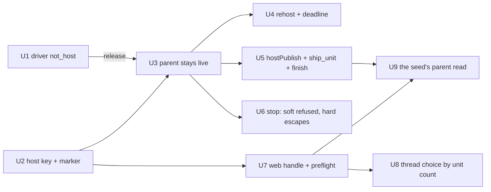

# A ship pipeline is a live run for its whole life - the host key, the hosted parent, the web handle - Plan

## Goal Capsule

- **Objective**: Build [record 0060](../decisions/0060-a-ship-pipeline-is-a-live-run-for-its-whole-life-and-runs-on-every-channel-that-can-open-a-thread.md): a ship pipeline's parent run stays live from the hand-off to `finish`, hosted by whichever bot generation is up, claimed on the ledger under a host key so it occupies no thread; the runner's posts become events on it; the preflight admits by capability; the web chat runs and renders a pipeline exactly as Slack does.
- **Authority**: record 0060 (proposed; this plan is the artifact its acceptance is judged on) over [record 0043](../decisions/0043-the-home-page-is-a-chat-the-browser-is-a-channel-and-a-turn-is-a-run.md) (a conversation is the runs of its thread; unchanged), [record 0055](../decisions/0055-a-unit-has-one-thread-and-a-round-reads-the-checks-at-its-head.md) (a task's unit thread is the requesting thread), [record 0019](../decisions/0019-durable-run-ledger-resume-after-kill.md) (the ledger, the fence, the reclaim), [record 0046](../decisions/0046-a-budget-is-a-lease-carved-from-its-parent-and-one-module-proves-the-leases-fit.md) (a hosted row's deadline is a lease the runner renews) and [record 0031](../decisions/0031-the-coordinator-runs-a-plan-not-a-pull-request.md) (the runner). The living specs named per unit change in that unit's pull request.
- **Execution profile**: nine units, each one pull request through the review loop, tests first in every unit. The record's four rollout stages become nine units because each pull request stays one reviewable idea: the hosted parent alone is five (the key, the lifetime, the reclaim, the writes, the stop). U1 ships alone and is **released before U3 merges**: the runner's driver must know `not_host` before any bot answers it, and both live in the bot's Worker script. U2 is behaviour-preserving and may ride the same release as U1. U3 to U9 follow the dependency graph in the Planning Contract once that release is live.
- **Stop conditions**: a unit that finds a reader of thread occupancy or of the ledger's thread column that the record does not name hands back a deviation before changing it. Nothing here adds a Worker, a table, a credential or a store; the ledger's `UNIQUE` index is untouched. A unit stops and asks if it would change the web's conversation model (record 0043), the thread topology (record 0055), or record 0057's session design.
- **Tail ownership**: each pull request merges through the review loop; the release between U1 and U3 is cut and merged by the maintainer; the live receipts in the Verification Contract are the maintainer's.

---

## Product Contract

### Summary

Every `agent:ship` request hands to the plan runner and today its run ends the moment the runner takes it. The runner then speaks into threads at four moments with no run live to record it: a unit thread's lead, the card redraw, a unit's ending report, the plan summary. Slack shows those as messages; the web chat, whose conversation is the runs of its thread, shows nothing, and it refuses `agent:ship` outright with a channel-name check that calls the browser single-shot. This plan keeps the parent run live for the pipeline's whole life, hosted by the bot, so those four posts are events on a run, and gives the web the two handles the runner needs.

### Problem Frame

A person typed `agent:ship in <owner>/<repo>: plan <path> units <one unit>` in a web conversation and was told the adapter is single-shot. It is not: a web run outlives its request, takes steers and reads history. The check is `shipPreflight`'s `slack:`/`cli:` prefix test, written before the browser became a channel. Behind it sits a real gap: the runner's posts have no run to live on, and the bot cannot even rebuild a web handle from a bare thread key. Making the parent live exposes four readers of thread occupancy (the admission slot, the ledger's unique thread key, the coordinator's spawn check, the dispatcher's elsewhere map), of which only the first releases when the dispatch returns. A parent that occupied the requesting thread would silently strip a one-unit task's child of its ledger row.

### Requirements

**The host key and the marker (record 0060, the hosted parent)**

- R1. A ship request's run is created with `hosted: true` and its label on the registry's run meta, and claimed on the ledger under the **host key** (the thread key with a `#host` suffix) with the ledger meta's `threadKey` the thread itself, `hosted: true` and the label. One module mints and recognises the suffix; it refuses a key that would exceed the ledger's 256-character cap and a key that already carries the suffix.
- R2. Every surface lists a hosted run under its conversation: `RunsService` builds a ledger row's view from the row's metadata (thread, label, `hosted`) and a registry row's view from the run meta, so both the hosting generation's `liveView` and a foreign row's `ledgerView` carry `hosted` and `label`.
- R3. Every record, notice and rebuilt handle derives a run's thread from the row's metadata, never from the ledger's thread column: the reclaim's record assembly, the reclaim's `closed` outcome (read by the interrupted-run notice), the resume launcher's message and its handle.
- R4. The ledger's `open` answers a discriminated shape (tracked, fenced, untracked with its reason) as `reserve` does. The ship branch refuses a `thread-live` answer on the host key by name, "a pipeline is already running in this thread". An untracked answer (no ledger, a missing route, an outage) hands off as today: the parent finishes at the hand-off as it does now and the runner's routes write no events (R9).

**The parent's lifetime**

- R5. After a tracked hand-off the ship branch does not finish the run: `registry.finish`, `finishing` and the seal are skipped; the admission slot is released when the dispatch returns as today; the branch sets the row's state `hosting: { instanceId, until }` with `until` the hand-off time plus the instance's `caps.maxMinutes` plus one hour, and publishes a second `run_meta { agent: "ship", instanceId }`. Every reader of a run's instance id resolves it from the last `run_meta` that carries one.
- R6. A hosted run occupies no thread on any read: the coordinator's spawn check (`liveOnThread`) skips `hosted` views; the ledger's claim and the dispatcher's elsewhere map never see the parent because they key on the ledger's thread column; the web composer treats a hosted turn as not live.
- R7. A hosted tracked run reports `resumable`, so SIGTERM marks it `handoff`, the drain does not wait on it and the abandonment pass writes no tombstone for it.
- R8. At reclaim, a row whose state carries `hosting` is classified before the transcript rule: past its `until`, it is closed `interrupted` through the reclaim's record assembly (filed under the metadata's thread), releasing the host key; when the store already holds a record for it whose status is `completed` or `failed`, a `finish` landed in the plain store and the row is abandoned; otherwise it is `rehost`: the launcher recreates the registry row (id, metadata, label, the ledger's events as a replay), adopts the ledger row and subscribes the write-through. The provisional `interrupted` record the ship branch writes at start is the normal state of a hosted run and never abandons it. `rehost` is its own outcome kind and never enters the elsewhere map.
- R9. The runner's `unit-start`, `round`, `unit-end` and `finish` routes write to the parent through one `hostPublish(runId, events)`, the run id read server-side from the instance's `runId`, never from a body field. When this generation hosts the run: `registry.publish` and the row's `hosting.until` moves forward by `caps.maxMinutes` plus one hour. When a ledger row for the run is live under another generation: `409 { ok: false, error: "not_host", at }`. When no ledger row exists anywhere (an untracked hand-off, R4): nothing is published and the route answers as today. `unit-start` publishes `ship_unit` (state `started`, thread key, lead); `round` publishes `ship_round` and a `ship_unit` state; `unit-end` publishes `ship_unit` (ending, report); `finish` publishes the `answer`, finishes the registry row and seals the record through the ledger with the metadata's thread. `parentRunRecord` is deleted. `drawCard` keeps redrawing the Slack card from the unit rows.
- R10. `ship_unit` is a run event variant (unit, state, thread key, lead or report, pull request when known); the run page's model draws it as a step with the report as detail; the friction analyzer's type filter knows it.
- R11. A hosted run takes no soft stop: the registry's stop refuses `soft` for it, so the token route, the tokenless route and `runs stop` answer `409 hosted` pointing at the units. A **hard** stop through the tokenless route or `runs stop --mode hard` is the maintainer's escape for an orphaned pipeline: it seals the parent `failed` with the units' last known state as its answer and releases the host key; the token route refuses both modes. `stopRun`'s ledger branch refuses a foreign hosted row's soft stop. The run page seed's `stopUrl` is optional and the page draws no control without it.
- R12. The driver's passing-condition set includes `not_host`; that change ships in a release before any bot answers `not_host`.

**The channel rule and the web handle**

- R13. `shipPreflight` takes `canOpenThread`, derived by the ship branch from the request handle; HTTP and MCP request handles are refused with the spawn's reason, "the channel cannot open a thread of its own"; the web and CLI handles pass; no refusal calls a channel single-shot.
- R14. `threadIoFor` rebuilds a `web:` handle from the key alone: history as the session's own actor; `openThread(lead)` mints a conversation id under the same sub and returns the key and a bound handle; an out-of-run `reply` resolves and logs with `undeliverable` set, as the null channel's does.
- R15. A unit runs in the requesting thread when its plan has exactly one unit, whatever the plan's source, and such a plan posts no summary into that thread at `finish` (its unit's report is already there); a plan with two or more units opens a thread per unit and posts its summary. (Record 0060 open question 1, decided: key on unit count.)
- R16. A web conversation whose runs carry an instance tag also lists that instance's parent run's `ship_unit` events that name the conversation's thread key, drawn as turns of the parent linked to its run, only when the viewer's visibility predicate admits the parent run; the runs service answers an instance's parent run id in one read under that predicate.

### Scope Boundaries

- Not here: gate refusals as inline records (record 0043's own fallback, its own unit later); ship over HTTP or MCP (still refused); thread-per-unit versus thread-per-plan; record 0057's session design; a runner-side cancel forwarded to the Workflow (record 0060 open question 2; the hard stop in R11 is the maintainer's escape, not a cancel the runner learns of).
- No new store, table, Worker or credential. The ledger's schema is untouched.
- Slack's visible behaviour is unchanged: the card, the unit threads and the reports read as today.

### Deferred to Follow-Up Work

- A runner-side cancel the hosting generation forwards, if a month of hard stops on hosted parents says people want the Workflow told.
- The session registration under the claim key (the ledger's `registerSession`): dormant because a hosted claim carries no seed; the first seeded hosted run (record 0057) must file the session by metadata first.
- Re-issuing the hosted turn's live token to an open page after a re-host; today the page recovers the new token on reload.

### Open Questions

None blocking. Two deferred: whether a re-host should push a fresh token to an open page (deferred above), and whether `threadIoFor`'s `web:` branch should refuse a sub whose Access session is revoked (record 0060 keeps the Slack precedent: a requester who logs out keeps their runs).

---

## Planning Contract

### Key Technical Decisions

- KTD1. **A host key on the ledger, not a filter, not a schema change.** `live_runs.thread_key` is `UNIQUE` and a refused reserve leaves a child untracked. A suffixed key lets parent and child coexist with no schema migration; the metadata keeps the parent listed under its conversation. Chosen over dropping the index (a state Worker migration) and over a filter (impossible against a unique constraint).
- KTD2. **`hosted` and `label` ride the metadata on both stores.** The registry's run meta is set at `create` and never mutated; the ledger's meta is stored verbatim by the Worker. Both are set at birth by the ship branch, which is the only producer of a hosted run; U3 pins that with a test.
- KTD3. **The re-host guard reads the record's status, not its existence.** The ship branch writes a provisional `interrupted` record at run start, so a live hosted row with a store record is the normal state. Only a record whose status is a pipeline outcome (`completed` or `failed`) means `finish` landed in the plain store because the ledger refused its write. One `getRun` decides; the instance store stays out of the reclaim.
- KTD4. **Host-only writes with a passing condition, not a cross-generation append.** `append` is fenced to the owning generation by design. A non-host answers `not_host` with `at`, which the driver retries twelve times two minutes apart, a 24-minute window against a re-host gap of at most 60 seconds.
- KTD5. **The driver change is a release ahead, alone.** The driver is bundled into the bot's Worker script beside the container class; the two deploy together. Ordering comes from releases, not from PR order.
- KTD6. **No `parentRunId` on coordinator children.** Lineage is mechanical on a thread's newest run; a `parentRunId` would make every person's reply in a unit thread a lineage child of the hosted parent and steer it into an inbox nothing reads. The seed reaches the parent through the instance tag the child already carries.
- KTD7. **Stop is refused in the registry, and the escape is a hard stop.** The run page's token route calls the registry directly and never reads a view; the refusal must sit where every stop path goes. A hosted parent whose runner died would otherwise be re-hosted forever and lock its thread out of ship, so the maintainer's hard stop seals it and releases the key.
- KTD8. **Thread choice keys on unit count** (session-settled: user-directed — chosen over keeping "generated plan" as the key: a person who types a one-unit plan expects it in the thread they typed in, and checked-in plans will be rare).
- KTD9. **Spec rows change in the unit that changes the behaviour**, per the documentation rules' same-PR rule; record 0060's separate specs PR is folded into U2 to U9. agent-ship item 16 grows across U2, U3 and U8, one clause each.
- KTD10. **A hosted row carries a deadline the runner renews** (record 0046's shape): `hosting.until` is set at the hand-off and moved forward by every runner write, so a pipeline whose Workflow dies without `finish` is closed by the reclaim within `caps.maxMinutes` plus an hour of its last word, and a live pipeline is never closed under it. Chosen over an instance-store read at reclaim (KTD3) and over an unbounded row.

### High-Level Technical Design

```mermaid
sequenceDiagram
    participant P as person (web)
    participant A as bot gen A
    participant L as ledger
    participant R as runner (Workflow)
    participant B as bot gen B
    P->>A: agent:ship plan … units Ua Ub
    A->>L: claim r1 under web:s:c9#host (meta thread web:s:c9, hosted, label)
    A->>R: hand-off i7 (runId r1)
    A->>L: state.hosting={i7, until}; run_meta{agent ship, instanceId i7}
    A-->>P: 202 (turn live, composer reads send)
    R->>A: unit-start Ua
    A->>A: web handle(web:s:c9).openThread → web:s:c9-u1
    A->>L: publish ship_unit Ua started; until moves forward
    Note over A: SIGTERM → handoff (resumable)
    B->>L: reclaim → rehost r1 (create+adopt+subscribe)
    R->>B: unit-end Ua
    B->>L: hostPublish ship_unit Ua merge_ready; until moves forward
    R->>B: finish
    B->>L: answer; finish r1 (metadata thread)
```

Unit dependency order:



### Assumptions

- The four occupancy readers and the four column readers named in record 0060 are all of them. U2's first step re-runs the record's grep against the head it starts from and hands back a deviation on a new hit.
- `createRunPageModel` draws an unknown event type as a step without a new view model; U5 verifies with a fixture before touching the model.
- The driver's `readBotAnswer` accepts any status carrying a numeric `at`; U1's tests pin it.

---

## Implementation Units

### U1. The driver learns `not_host`

- **Goal**: The runner's driver treats `{ ok: false, error: "not_host", at }` as a passing condition and re-asks the step under its policy, on every route.
- **Requirements**: R12 (http-ingress item 9).
- **Dependencies**: none. Ships alone; a release carrying it is deployed before U3 merges.
- **Files**: `src/core/coordinator/driver.ts` (the `TRANSIENT` set); `src/core/coordinator/driver.test.ts`; `docs/reference/specs/http-ingress.md` (item 9: the passing conditions).
- **Approach**: add the one name to the set; no other change.
- **Patterns to follow**: the existing four names and their tests.
- **Test scenarios**:
  - A `409 { ok: false, error: "not_host", at }` on `unit-start`, `round`, `unit-end` and `finish` is a transient refusal the step re-asks.
  - The same body without `at` is unreadable, as today.
  - A `409 { ok: false, error: "busy", at }` stays the machine's answer, not transient.
- **Verification**: the driver suite green, red first on the four routes; `npm run specs:check`; `npm run verify`. The maintainer cuts and deploys the release; U3 waits on its `/healthz` build commit.

### U2. The host key, the marker and the metadata rule

- **Goal**: A ship request's run is claimed under the host key with `hosted` and `label` on both stores, lists under its conversation on every surface, and every record, notice and handle files by the metadata's thread. Behaviour-preserving: the parent still finishes at the hand-off in this unit.
- **Requirements**: R1, R2, R3, R4 (run-history items 29, 36, 38; agent-ship item 16).
- **Dependencies**: none.
- **Files**: `src/core/runLedger/hostKey.ts` (new) and `src/core/runLedger/hostKey.test.ts` (new); `src/core/runLedger/types.ts` (`hosted`, `label` on `LiveRunMeta`); `src/core/runRegistry/state.ts` (`hosted` on `RunMeta`); `src/core/runsService.ts` (`hosted`, `label` on the view from both builders) and `src/core/runsService.test.ts`; `src/core/runLedger/writeThrough.ts` (`open` answers a discriminated shape) and `src/core/runLedger/writeThrough.test.ts`; `src/core/dispatch/run.ts` (reads the new shape) with `src/core/dispatch/run.test.ts` and `src/core/dispatch/runLoop.test.ts` (their `open` stubs); `src/core/dispatch/ship.ts` (create with the marker and label; claim under the host key; refuse `thread-live`) and `src/core/dispatch/ship.test.ts`; `src/core/dispatch/record.ts` (`closeReclaimed` files by metadata) and `src/core/dispatch/record.test.ts`; `src/core/boot.ts` (the `closed` outcome's thread from metadata) and `src/core/boot.test.ts`; `src/core/resumeLaunch.ts` (the resume message's thread) and `src/core/resumeLaunch.test.ts`; `src/index.ts` (the resume launcher's handle from metadata); `docs/reference/specs/run-history.md`, `docs/reference/specs/agent-ship.md`.
- **Approach**:
  1. Re-run record 0060's grep for readers of `live_runs.thread_key`, `row.threadKey` off a ledger row, and `listRuns` with `status: "active"` or a thread-key compare; hand back a deviation on any reader the record does not name.
  2. Tests first: the helper; the ledger accepting a host-key claim beside a child's claim on the thread and refusing a second host-key claim; the service listing a host-keyed row under the conversation with `hosted` and `label`; `closeReclaimed`, the `closed` outcome, the resume message and the launcher's handle all naming the metadata's thread for a host-keyed row.
  3. Write the helper (`hostKeyOf`, `threadOf`, `isHostKey`; the 256-character cap; a key already suffixed refused); thread `hosted` and `label` through the two metas and both view builders; change `open`'s return shape and adapt its two callers and their test stubs; make the ship branch create and claim as R1 says and refuse `thread-live`.
  4. Spec rows: run-history item 29 (the host key and its helper), items 36 and 38 (records file by metadata); agent-ship item 16 (one pipeline per thread).
- **Patterns to follow**: `reserve`'s discriminated union in `writeThrough.ts`; `ledgerView` reading `row.meta`; the refusal seam (record 0054) for the new refusal.
- **Test scenarios**:
  - `hostKeyOf("web:s:c9")` is `web:s:c9#host`; `threadOf` inverts it; `isHostKey` is false for a plain key; a key at 252 characters is refused; `hostKeyOf("http:c:t1#host")` is refused.
  - The in-memory ledger accepts a claim under `web:s:c9#host` and then a claim under `web:s:c9`; a second claim under `web:s:c9#host` answers `thread-live`.
  - `RunsService.listRuns({ threadKey: "web:s:c9" })` lists a ledger row claimed under the host key, with `hosted: true` and its label; a registry row created with `meta.hosted` lists the same.
  - `open` answers `{ kind: "untracked", why: "thread-live" }` on a refused claim, `{ kind: "untracked", why: … }` on a missing route, `{ kind: "tracked" }` otherwise; `run.ts` treats every `untracked` as today.
  - The ship branch refuses by name on `thread-live` and hands off untracked on a missing route.
  - `closeReclaimed` over a host-keyed row writes a record whose `threadKey` is `web:s:c9`; the reclaim's `closed` outcome carries `web:s:c9`; the resume message and the launcher's handle are built from `web:s:c9`.
  - No session is registered for a hosted claim (the claim carries no seed).
- **Verification**: the test files green, red first; `npm run specs:check`; `npm run verify`.

### U3. The parent stays live and occupies no thread

- **Goal**: After a tracked hand-off the parent run is live in the registry and on the ledger, resumable, with `state.hosting` (instance and deadline) and a second `run_meta` naming the instance, and a one-unit task's child in the requesting thread is admitted and tracked.
- **Requirements**: R5, R6 (the coordinator's check), R7 (thread-admission item 1; run-history item 39; agent-ship item 16).
- **Dependencies**: U1 released; U2.
- **Files**: `src/core/dispatch/ship.ts` (skip finish, `finishing` and seal on a tracked hand-off; set `hosting`; publish the second `run_meta`) and `src/core/dispatch/ship.test.ts`; `src/core/runLedger/writeThrough.ts` (`open` carries `hosted` to the tracked run; `resumable` true for it) and `src/core/runLedger/writeThrough.test.ts`; `src/channels/adminCoordinator.ts` (`liveOnThread` skips `hosted`) and `src/channels/adminCoordinator.test.ts`; `src/core/dispatcher.test.ts` (the producer test); `src/index.ts` (the drain comment that says a ship pipeline holds the drain); `docs/reference/specs/thread-admission.md`, `docs/reference/specs/run-history.md`, `docs/reference/specs/agent-ship.md`.
- **Approach**:
  1. Tests first: the two tests record 0060 names first (below).
  2. In the ship branch, on a tracked, taken hand-off, return without the finish block; set state and publish the second `run_meta` after the instance exists. An untracked hand-off keeps today's finish. Every other exit of the branch after the claim (a refused hand-off, a preflight question, a throw) finishes the run as today, so the host-key row never outlives a request that handed nothing off (record 0060's amendment, point 2).
  3. `open({ hosted })` → the tracked run's `resumable` includes it; hand-off marking, `runsHeld` and the abandonment pass follow. Fix the drain comment.
  4. `liveOnThread` filters `!r.hosted`.
  5. Spec rows: thread-admission item 1 (a hosted run occupies no thread), run-history item 39 ("never a ship pipeline" goes), agent-ship item 16 (the hand-off keeps the run live).
- **Execution note**: the first test below must fail before the change with today's `busy` or an untracked child, and pass after.
- **Patterns to follow**: the ship branch's existing `finally`; `runsHeld` and `handoff()` reading `resumable`.
- **Test scenarios**:
  - A one-unit task's coding child, dispatched through the coordinator's spawn route with the hosted parent live in the registry and on the ledger, is admitted (no `busy`) and its ledger claim is accepted (tracked).
  - After a tracked, taken hand-off the registry row is unfinished, the ledger row is `live` with `state.hosting` set (instance id and a deadline of `caps.maxMinutes` plus one hour), and the stream carries a second `run_meta { instanceId }`; a refused hand-off still finishes `completed`; an untracked hand-off finishes as today.
  - A request refused after the host-key claim (a preflight question, a refused hand-off) leaves no live row on the ledger: the next `agent:ship` in the thread claims the host key.
  - SIGTERM marks the hosted row `handoff`; `runsHeld` excludes it; `writeAbandonedRunRecords` skips it.
  - `liveOnThread` returns no run for a thread whose only active run is hosted, and the child's run when one is live.
  - No dispatch of any agent but the ship branch creates a run with `meta.hosted` (the producer test over the dispatcher's agents).
- **Verification**: the test files green, red first; `npm run specs:check`; `npm run verify`.

### U4. Re-host at reclaim, with a deadline

- **Goal**: The next generation's reclaim re-hosts a row whose state carries `hosting`, abandons it when the store holds a pipeline outcome for it, closes it `interrupted` past its deadline, and puts nothing about it in the elsewhere map.
- **Requirements**: R8 (run-history items 36 and 38).
- **Dependencies**: U3.
- **Files**: `src/core/boot.ts` (the `rehost` classification before the transcript rule: deadline, status guard, re-host; the elsewhere map's exclusion) and `src/core/boot.test.ts`; `src/core/resumeLaunch.ts` (the launcher's `rehost` branch: `registry.create` with id, metadata, label and replay; `adopt`; subscribe) and `src/core/resumeLaunch.test.ts`; `src/index.ts` (wiring the store read and `abandon`); `docs/reference/specs/run-history.md`.
- **Approach**:
  1. Tests first (below).
  2. Add the `rehost` outcome kind; classify before `completenessVerdict` in this order: past `until` → close `interrupted` through `closeReclaimed`; store record with status `completed` or `failed` → `abandon`; else `rehost`.
  3. The launcher recreates the row and adopts; the write-through subscription mirrors later publishes.
  4. Spec rows: run-history items 36 and 38 (`rehost`, the deadline).
- **Patterns to follow**: the `attaching` restart branch in `boot.ts`; `adopt` as `admission.ts` uses it for a resume; `closeReclaimed`.
- **Test scenarios**:
  - A `handoff` row with `state.hosting`, a future `until` and a provisional `interrupted` store record is `rehost`, not abandoned; the registry gains a live row with the same id, the metadata's thread, the label and a fresh token; the ledger row is adopted and heartbeats.
  - The same row whose store record has status `completed` (or `failed`) is abandoned: no record written, the live row gone.
  - The same row with `until` in the past is closed `interrupted` under the metadata's thread and the live row is gone; a later `agent:ship` in that thread claims the host key.
  - A `rehost` row does not appear in `threadsElsewhere`; a foreign hosted row's key in the map is `…#host` and never matches a message's thread.
  - A host-keyed row with no `state.hosting` (a crash between claim and hand-off) falls to the transcript rule and closes "no transcript stored" under the metadata's thread.
  - Two generations reclaiming the same sweep: the loser sees the row under the winner's generation and lists it live elsewhere.
- **Verification**: the test files green, red first; `npm run specs:check`; `npm run verify`.

### U5. `hostPublish`, `ship_unit`, and `finish` seals the run

- **Goal**: The runner's four routes write the pipeline's facts to the parent through `hostPublish`, moving its deadline; a non-host answers `not_host`; an untracked pipeline writes nothing; `finish` seals the one record; `parentRunRecord` is gone; the run page draws `ship_unit` and lists the instance's units from the last `run_meta`.
- **Requirements**: R9, R10, R5 (the last-`run_meta` rule) (agent-ship item 17; run-history item 33 and the record shape; live-view item 28).
- **Dependencies**: U3.
- **Files**: `src/core/runEvents.ts` (`ship_unit`; `run_meta` may repeat on a hosted run) and `src/core/runEvents.test.ts`; `src/core/runFriction.ts` (the type filter) and `src/core/runFriction.test.ts`; `src/channels/adminCoordinator.ts` (`hostPublish`; the four routes; `finish`; delete `parentRunRecord`) and `src/channels/adminCoordinator.test.ts`; `src/channels/liveView.ts` (the instance from the last `run_meta` carrying one) and `src/channels/liveView.test.ts`; `web/src/lib/runPageModel.ts` and `web/src/lib/runPageModel.test.ts` (draw `ship_unit` as a step); `docs/reference/specs/agent-ship.md`, `docs/reference/specs/run-history.md`, `docs/reference/specs/live-view.md`.
- **Approach**:
  1. Fixture first: three `ship_unit` events through `createRunPageModel`; if they already render as steps, the model change is a label only.
  2. Tests first for `hostPublish` (below), then the routes.
  3. Add the event variant; write `hostPublish` with the run id from `instance.runId`; call it from the four routes; make `finish` publish the `answer`, finish the registry row and seal through the ledger with the metadata's thread; delete `parentRunRecord` and its tests; `drawCard` unchanged; the run page resolves the instance from the last `run_meta` with an id.
  4. Spec rows: agent-ship item 17, run-history item 33 and the record shape (a hosted run's two `run_meta`), live-view item 28.
- **Patterns to follow**: `registry.publish` and the ship branch's write-through subscription; today's `finish` route for the seal; `unitRunsOf` skipping the pipeline's own run by agent; `readRecord`'s instance-scoped id check.
- **Test scenarios**:
  - `hostPublish` on a run this registry holds publishes with increasing `seq`, the write-through mirrors it, and `hosting.until` moves forward; on a run live under another generation it answers `409 { ok: false, error: "not_host", at }`; on a run with no ledger row anywhere it publishes nothing and the route answers as today.
  - A route body naming a run id other than the instance's publishes nothing and answers `not_found`.
  - `unit-start` publishes `ship_unit { state: "started", threadKey, lead }`; `round` publishes `ship_round` and a `ship_unit` state; `unit-end` publishes `ship_unit` with the ending and report and still replies the report through the handle; `finish` publishes the `answer`, finishes the row and the sealed record's `threadKey` is the metadata's, its events in seq order.
  - `finish` on a run another generation hosts answers `not_host` and writes nothing.
  - The run page of a hosted parent lists the instance's units from the second `run_meta`; the unit page's listing still skips the parent by agent.
  - A run record with a `ship_unit` event and two `run_meta` events passes `isRunRecord`; the friction analyzer ignores `ship_unit` as activity.
  - The run page model draws a `ship_unit` step whose detail is the report.
- **Verification**: the test files green, red first; `npm run specs:check`; `npm run screenshots:check` if the run page's fixture render moved (`npm run screenshots:gen` then); `npm run verify`.

### U6. Stop: soft refused, hard escapes, the composer ignores a hosted turn

- **Goal**: Every soft stop answers `409 hosted` for a hosted run; a hard stop through the tokenless routes seals it `failed` and releases the host key; the pages draw no stop control for a hosted run; the web composer reads `send` while only a hosted turn is live.
- **Requirements**: R11, R6 (the composer) (live-view item 17; web-chat item 2).
- **Dependencies**: U3.
- **Files**: `src/core/runRegistry.ts` (`requestStop` and `requestStopById` refuse a soft stop on a hosted run; the token path refuses both modes) and `src/core/runRegistry.test.ts`; `src/core/runsService.ts` (`stopRun` reads the view; a hard stop on a hosted run seals it) and `src/core/runsService.test.ts`; `src/channels/liveView.ts` (both stop routes' answers; `stopUrl` optional in the seed) and `src/channels/liveView.test.ts`; `src/channels/webSeed.ts` (`stopUrl?`); `web/src/pages/RunPage.vue` (no control without `stopUrl`); `web/src/pages/HomePage.vue` (`liveItem` excludes hosted turns) and `web/src/pages/home.test.ts`; `src/core/commands/runs.ts` (`runs stop`'s wording; `--mode hard` as the escape) and `src/core/commands/runs.test.ts`; `docs/reference/specs/live-view.md`, `docs/reference/specs/web-chat.md`.
- **Approach**:
  1. Tests first (below).
  2. Refuse soft in the registry by meta; the token path refuses both modes; `stopRun` reads the view, refuses soft on a hosted row, and on hard seals the parent `failed` with the units' state as its answer (through the ledger when hosted here, through `requestStop` on the ledger when foreign) and the host key is released with the row.
  3. `stopUrl` optional; the run page guards; the home page's `liveItem` skips `hosted` turns (the turn still streams).
  4. Spec rows: live-view item 17, web-chat item 2.
- **Execution note**: this unit touches the web pages; keep the change to the two guards and re-run the screenshot gate.
- **Patterns to follow**: `stopDecision` in `liveView.ts`; `composerMode` in `homeModel.ts`; the ledger's `finish` for the seal.
- **Test scenarios**:
  - `registry.requestStopById(id, "soft")` on a hosted run answers a refusal and publishes no `stop_requested`; `requestStop(id, token, mode)` refuses both modes for a hosted run.
  - The token route answers `409` for both modes; the tokenless route and `runs stop` answer `409 hosted` for soft and, for hard, seal the parent `failed` with the units' state, release the host key, and a later `agent:ship` in the thread claims it.
  - `stopRun`'s soft stop on a foreign hosted ledger row refuses without calling the ledger's `requestStop`.
  - The run page seed for a hosted run carries no `stopUrl` and the page renders no stop control; a normal live run's seed is unchanged.
  - With one hosted live turn and no other, the composer reads `send`; with a child live, `steer` or `stop` as today; the hosted turn still shows live.
- **Verification**: the test files green, red first; `npm run screenshots:check` (regenerate with `npm run screenshots:gen` where the fixtures moved) with before/after screenshots on the pull request; `npm run specs:check`; `npm run verify`.

### U7. The web handle and the preflight's capability

- **Goal**: The bot rebuilds a web handle from a bare thread key with `openThread`; the preflight admits by the request handle's capability; the refusal text is true.
- **Requirements**: R13, R14 (agent-ship item 1 and its validation row; thread-admission item 6; web-chat item 11; record 0043's dated note).
- **Dependencies**: U2.
- **Files**: `src/index.ts` (`threadIoFor` learns `web:`); `src/channels/web.ts` (`turnsOf` extracted so a handle can be built without a request; `WebIO.openThread`; the rebuilt handle's `undeliverable`) and `src/channels/web.test.ts`; `src/core/ship/preflight.ts` (`canOpenThread`; the reason) and `src/core/ship/preflight.test.ts`; `src/core/dispatch/ship.ts` (passes the capability) and `src/core/dispatch/ship.test.ts`; `docs/reference/specs/agent-ship.md`, `docs/reference/specs/thread-admission.md`, `docs/reference/specs/web-chat.md`, `docs/decisions/0043-the-home-page-is-a-chat-the-browser-is-a-channel-and-a-turn-is-a-run.md` (the dated note).
- **Approach**:
  1. Tests first (below).
  2. Lift the conversation reader out of the request handler's closure into an exported builder over the runs service and registry, so `threadIoFor` can build a `WebIO` from the sub alone; set `undeliverable` on the rebuilt handle.
  3. `WebIO.openThread`: mint an id with the adapter's generator, return `{ thread: { threadKey }, io }`.
  4. Preflight: replace the prefix test with `canOpenThread`; the ship branch passes `io.openThread !== undefined`.
  5. Spec rows: agent-ship item 1 and its validation row, thread-admission item 6 (the fourth opener), web-chat item 11; record 0043's note.
- **Patterns to follow**: the CLI harness's `openThread`; `resumeSlackIO`; `nullChannelIO`'s `undeliverable`.
- **Test scenarios**:
  - `threadIoFor({ threadKey: "web:s:c9", userId: "access:s" })` returns a handle whose `history()` lists the thread's runs as `access:s`; its `reply` resolves and the handle has `undeliverable` set.
  - `openThread(lead)` returns a key `web:s:<new id>` in the same lane and a handle bound to it; two calls mint two ids.
  - The preflight admits `canOpenThread: true` on a `web:` channel and refuses `false` on `http:` and `mcp:` with the spawn's reason; the CLI handle passes; no refusal text contains "single-shot".
  - The ship branch passes the request handle's capability.
- **Verification**: the test files green, red first; `npm run specs:check`; `npm run hygiene:check`; `npm run verify`.

### U8. Thread choice by unit count

- **Goal**: A plan with exactly one unit runs in the requesting thread whatever its source and posts no summary there at `finish`; two or more open a thread per unit and post the summary.
- **Requirements**: R15 (agent-ship item 16; record 0055 item 3's wording).
- **Dependencies**: U7.
- **Files**: `src/channels/adminCoordinator.ts` (`unitRowOf` returns the instance's rows beside the matched row; `unitThread` takes the unit count; `unitStart` and `finish` decide from it) and `src/channels/adminCoordinator.test.ts`; `docs/reference/specs/agent-ship.md`.
- **Approach**: the spawn route and `unitStart` already list the instance's units; keep the rows, pass the count to `unitThread`, and gate `finish`'s summary post on the same count. Keep `isGenerated` where it means the task wording. Spec row: agent-ship item 16.
- **Patterns to follow**: `unitThread`, `unitStart`, `unitRowOf`, the `finish` route's summary post.
- **Test scenarios**:
  - A checked-in plan selecting one unit runs it in the requesting thread, opens no thread, and its `finish` posts no summary there.
  - A plan of two units opens one thread per unit and `finish` posts the summary into the requesting thread, as today.
  - A generated one-unit plan is unchanged.
- **Verification**: the test file green, red first; `npm run specs:check`; `npm run verify`.

### U9. The conversation seed reads the parent's word

- **Goal**: A unit's web conversation shows the parent's `ship_unit` events that name it, drawn as turns of the parent linked to its run, for a viewer whose predicate admits the parent.
- **Requirements**: R16 (web-chat item 2).
- **Dependencies**: U5, U7.
- **Files**: `src/core/runsService.ts` (`parentRunOfInstance(instanceId, visibleTo)`) and `src/core/runsService.test.ts`; `src/channels/web.ts` (`turnsOf` adds the parent's `ship_unit` events for this thread under the viewer's predicate) and `src/channels/web.test.ts`; `src/channels/webSeed.ts` (a parent-word turn seed); `web/src/pages/HomePage.vue` and `web/src/components/home/` (draw the parent's word) and `web/src/pages/home.test.ts`; `docs/reference/specs/web-chat.md`.
- **Approach**:
  1. Tests first (below).
  2. The service reads the instance by id through the store it already holds, gates on `instanceAdmits(instance, visibleTo)` as `listInstanceUnits` does, and answers its `runId`.
  3. `turnsOf`: when a run carries `parentInstanceId`, ask the service under `readableRuns(actor)`, read the parent's messages once, keep the `ship_unit` events whose `threadKey` is this thread, and seed them as parent turns in time order among the runs.
  4. The page draws a parent turn as a compact turn linked to the parent run; no composer or stop change.
  5. Spec row: web-chat item 2.
- **Execution note**: a web page change; the rendering is one new turn shape, kept minimal, screenshots before and after on the pull request.
- **Patterns to follow**: `turnOf`; `listInstanceUnits`'s `instanceAdmits` gate; `AssistantTurn.vue`'s link to a run.
- **Test scenarios**:
  - `parentRunOfInstance` answers the instance's `runId` under a predicate that admits it, `undefined` for an unknown instance, and `undefined` under a predicate that excludes it.
  - A conversation whose runs carry an instance tag lists the parent's `ship_unit` events naming this thread, in time order among its runs, and none naming another thread; a conversation with no tagged run reads no parent.
  - A viewer whose predicate excludes the parent run sees no parent turns in a conversation whose runs carry the instance tag.
  - A parent turn seed renders as a turn linked to the parent's run page; the composer's mode is unaffected by it.
- **Verification**: the test files green, red first; `npm run screenshots:check` with before/after on the pull request; `npm run specs:check`; `npm run verify`.

---

## Verification Contract

| Proof | Command or procedure | Units |
|---|---|---|
| Unit tests red then green, per unit | `npx vitest run <the unit's test files>` | U1 to U9 |
| The two tests record 0060 names first: a one-unit task's child through the spawn route with a hosted parent live is admitted and tracked; a hosted row closed by the reclaim files under its conversation | `npx vitest run src/channels/adminCoordinator.test.ts src/core/dispatch/record.test.ts` | U2, U3 |
| An orphaned pipeline ends: a hosted row past its deadline closes at the next reclaim, and a hard stop seals one at once; either releases the host key | `npx vitest run src/core/boot.test.ts src/core/runsService.test.ts` | U4, U6 |
| Spec bindings resolve, coverage holds | `npm run specs:check` | U1 to U9 |
| The docs site builds over the spec rows | `npm run build -w docs` | U1 to U9 |
| Web changes pass the screenshot gate, with before/after on the pull request | `npm run screenshots:check` (`npm run screenshots:gen` where fixtures moved) | U5, U6, U9 |
| The whole gate | `npm run verify` | U1 to U9 |
| Release order | U1's release is live on `/healthz` (build commit) before U3 merges | U1, U3 |
| Live, human-gated: parity | A two-unit plan from a web conversation with one bot deploy during round 0; the page refreshed after the deploy shows both unit links, both reports and the summary on the parent's turn; the unit conversation shows the unit's report | U4, U5, U9 |
| Live, human-gated: the child is tracked | A one-unit task from a web conversation; the child's ledger row exists while the parent is live; a steer into the child lands | U3 |
| Live, human-gated: one pipeline per thread | A second `agent:ship` in a thread whose pipeline is live is refused by name | U2, U3 |
| Live, human-gated: stop | `runs stop` on a hosted parent answers `409 hosted`; `runs stop --mode hard` seals it and a new `agent:ship` in the thread is admitted; stopping the live child ends the unit as today | U6 |
| Live, human-gated: Slack unchanged | A routed one-unit task on Slack reads as before this plan: card, thread, report | U3, U5, U8 |

---

## Definition of Done

- Every unit's tests are green and failed before its change; `npm run verify` passes on each pull request; each pull request carries its spec rows and, for U5, U6 and U9, before/after screenshots.
- U1 is released and live before U3 merges; the release's `/healthz` build commit is the receipt.
- A web conversation runs a two-unit plan through a bot deploy and a refresh with every line intact, and Slack's behaviour is unchanged; both receipts are posted per environment on the tracking issue.
- No message store, table, Worker or credential was added; the ledger's schema is untouched; no `parentRunId` on a coordinator child.
- Each unit's diff carries only the change it names: no code from a superseded approach within this plan remains; `parentRunRecord` and its tests are gone; the "single-shot" refusal text is gone; the drain comment naming a ship pipeline is gone.
- Record 0060's status moves to accepted by the maintainer once the live receipts are posted.
