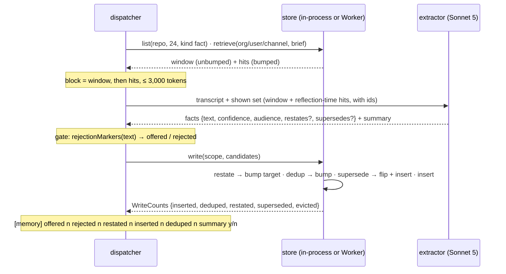
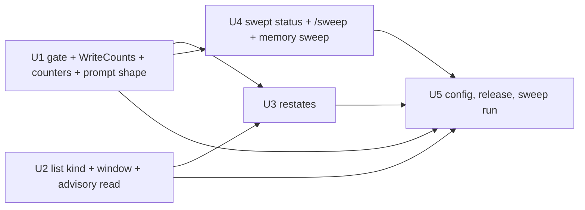

# Memory keeps lessons, not status - the gate, the repository window, restatement, the sweep - Plan

## Goal Capsule

- **Objective**: Build [record 0061](../decisions/0061-memory-keeps-lessons-not-status-a-gate-on-every-fact-a-repo-window-in-every-run-a-restated-lesson-merges.md): a deterministic gate rejects one-moment status before any fact is stored; every run in a repository receives that repository's newest lessons outright; a fact that restates a shown record bumps it instead of inserting; one sweep retires the status rows already stored; the extractor moves to Sonnet 5.
- **Authority**: record 0061 (proposed; this plan is the artifact its acceptance is judged on) over [memory.md](../reference/specs/memory.md) (the living spec, whose rows change in the unit that changes the behaviour) and [record 0017](../decisions/0017-memory-off-by-default.md) (off by default, byte-identical when off, advisory when on; unchanged and re-pinned by every unit).
- **Execution profile**: four code units in this repository, each one pull request through the review loop, tests first in every unit; then one configuration change in the infrastructure repository, the release, and the sweep. The units are independent of each other except where a field or type is shared (U3 and U4 build on U1's `WriteCounts`); they can land in any order that respects that.
- **Stop conditions**: a unit that finds a reader of memory records the record does not name (a fifth place that treats `forgotten` rows specially, a second writer of candidates) hands back a deviation before changing it. Nothing here adds a Worker, a Durable Object, a table, a credential or an index; the Worker gains one route and one column filter.
- **Tail ownership**: each pull request merges through the review loop; the release and the infrastructure configuration change are the maintainer's; the sweep is run by the maintainer after the cutover and its counts are posted as the receipt.

---

## Product Contract

### Summary

Memory has been on in production since its configuration landed, and the repository's scope is filled with pull-request status lines that no run ever retrieves, while the lessons among them (the license check's cause and remedy, learned three times) never reach the next run. Four small changes to the write path and one to the read path make memory a ledger of lessons a run in the repository always sees.

### Problem Frame

A dry run of the gate over the 39 newest repository facts rejects 22; the license-check facts number 20 and carry `useCount 0`; the extractor is Haiku 4.5 and ignores the prompt's ban on pull-request state; dedup fires only on exact text; the read path is a recency pick over a loose lexical prefilter whose eight slots go to the newest status lines. Record 0061 holds the measurements and the argument.

### Requirements

**The gate and the counters (record 0061, "The gate")**

- R1. A pure, exported function in the shared memory engine returns the markers a fact text carries: status markers (a pull-request or issue reference in subject position or in the same clause as a delivery predicate; a commit sha with at least one digit and one letter; a test or check count with an outcome word; a delivery predicate; a run or branch identifier) and change-description markers ("now" plus a present-tense verb from the record's list; "was/were/has been/have been" plus a change participle; a plan-unit reference; "spec row(s)"). A fact with any marker is rejected in `parseReflection` before authorization and write; a summary is never gated.
- R2. The gate's fixtures are paraphrases of the real rejected and surviving texts from the dry run, and reproduce its split in shape: status lines rejected, lessons naming a command, file, cause or remedy kept, a lesson citing an issue in passing kept.
- R3. `MemoryStore.write` returns `WriteCounts` (`inserted`, `deduped`, `restated`, `superseded`, `evicted`) on every store: the Null store zeros, the in-process store its own tally, the Worker client the Worker's existing answer body.
- R4. The `[memory]` info line per reflection carries `offered`, `rejected`, `restated`, `inserted`, `deduped` and whether a summary was written; nothing else about the line changes, and no fact text ever appears in it.
- R5. The extractor's instruction asks for each fact in the shape *what fails or surprises, why, and what to do*, and keeps every existing rule (one sentence, durable, no secrets, audience, confidence, supersedes).

**The repository window (record 0061, "The repository window")**

- R6. `list` takes an optional `kind` filter on every store; the Worker's `/list` accepts `kind` in the body and adds one equality predicate; an absent `kind` lists as today.
- R7. `memoryContextBlock` reads the run's repository scope with `list(scope, repoWindow, { kind: "fact" })`, newest first, and renders those records first, then the keyword hits from the other scopes, under the one budget; `memory.repoWindow` defaults to 24, `memory.limit` to 32 and `memory.maxTokens` to 3,000. A run with no bound repository has no window. The window read is advisory: a failure is caught, logged as one `[memory]` warning, and yields no window. With memory off the model input is byte-identical to today.
- R8. The window read bumps nothing; the reflection-time `retrieve` per scope and a restatement remain the only movers of `lastUsedAt` on a repository record.

**Restatement (record 0061, "Restatement")**

- R9. A fact candidate may carry `restates: <id>`; `parseReflection` keeps it only when the id is in the shown set, routes the candidate to its target's scope as `supersedes` is routed, and drops it when the authorization policy narrows the write. `planWrite` takes a `restate` action before dedup when the target is an active record of the scope: `useCount` and `lastUsedAt` bump, `confidence` becomes the higher of the two, text and scope are unchanged, nothing is inserted; a target that is missing or not active falls through to today's dedup-or-insert. Both stores and the Worker's candidate validator implement it.
- R10. The shown set the extractor sees is the repository window (the same `list` read, unbumped) plus the reflection-time keyword hits, each with its id.

**The sweep (record 0061, "The sweep")**

- R11. A fifth record status `swept` exists and every reader treats it exactly as `forgotten` (invisible to retrieve, list, dedup, the window and the cap; the row and provenance kept). The Worker gains `POST /sweep {scopeKey, dryRun?}` that, in one transaction, flips every active fact carrying a marker to `swept` and answers the count (and the ids under `dryRun`, flipping nothing); the in-process store implements the same; `MemoryStore.sweep` is on the seam; the Worker client maps a 404 to a reported failure, never a throw.
- R12. The registry command `memory sweep --scope <me|org|repo|channel|all> [--repo owner/name] [--dry-run]` runs under `memory:write` with `forget`'s scope gate (own scope always; shared scopes for admins and grantees), as one inline run with a receipt naming per-scope counts; memory disabled says so; a store failure is a `⚠️` line.

**Configuration and release (record 0061, "Rollout")**

- R13. The production configuration sets `memory.model` to `anthropic/claude-sonnet-5`, `memory.repoWindow` to 24, `memory.limit` to 32 and `memory.maxTokens` to 3000; the sweep is run once per scope after the release's cutover and its counts are posted as the receipt for record 0061's success criterion 2.

### Scope Boundaries

- Not here: a lookup at the moment a tool call fails; keyword expansion of the brief or an embeddings index; any change to summaries, to the organization, user and channel reads, to the authorization routing of writes, or to the settings surface (record 0061, "Boundaries").
- No new Worker, Durable Object, table, credential or index. The Worker gains one route (`/sweep`), one body field on `/list` (`kind`), one candidate field on `/write` (`restates`), and one status value.
- `memory list` and `memory forget` are unchanged except that `forget`'s scope gate is shared with `sweep`.

### Deferred to Follow-Up Work

- The expansion record (keyword expansion of the brief, or embeddings), if the `inserted` counter shows the window is too small after a week.
- Whether summaries earn their rows now that the session log holds the transcript (record 0035); a separate record.
- Span attributes on `dispatch.memory_read` naming the window and hit counts, if the log line proves insufficient for the receipts.

### Open Questions

None blocking. Three deferred to the week after the release, per record 0061's open questions: the window's size, whether `restates` over-merges, and the extractor's daily cost.

---

## Planning Contract

### Key Technical Decisions

- KTD1. **The gate is code, not a prompt rule, and lives in the shared engine** (session-settled: user-directed — chosen over relying on a stronger extractor model alone: the prompt has banned pull-request state since the write path shipped and the store holds hundreds of such facts; a rule the model follows on average fills a store by the tail). `engine.ts` is bundled into the Worker's Durable Object by relative import, so one exported function serves the bot's write path and the Worker's sweep.
- KTD2. **The repository scope is read by recency through `list`, not by a better search** (session-settled: user-directed — chosen over tuning the scorer or raising `limit` on keyword retrieval: recency is what matters now and a brief about one task shares no useful word with a lesson about another; `retrieve` also bumps everything it returns, which would make eviction a coin toss). The window is `fact` records only, which is why `list` gains a `kind` filter rather than the caller over-fetching under the Worker's 50-row cap.
- KTD3. **Meaning-level dedup is the extractor's `restates` over shown ids, bounded to a bump** (session-settled: user-directed — chosen over an embeddings index with a similarity threshold: exact-text dedup never fires on a paraphrase, the extractor already sees the existing records with ids and already emits `supersedes`, and a bump can lose at most one new lesson while an index needs a backfill and a threshold before the store holds lessons).
- KTD4. **The extractor moves to Sonnet 5 by configuration** (session-settled: user-directed — chosen over keeping Haiku 4.5 behind the gate: the gate makes the written count zero, the model lowers the rejected count, and `memory.model` is one line in the production config, so no code carries a model name, per invariant 7).
- KTD5. **The existing rows are swept by the same gate, not wiped.** A wipe loses the 17-in-39 survivors and the user scopes; the sweep flips exactly what the gate would refuse, keeps the ids, and is idempotent, so it can be re-run after an older bot generation drains.
- KTD6. **`swept` is a fifth status, treated everywhere as `forgotten`.** A distinct value makes the receipt auditable (the count of `swept` rows is the receipt) and keeps a human `forget` distinguishable; every existing reader already selects `status = 'active'`, so the new value costs one entry in the type and one in the Worker's schema check.
- KTD7. **The write seam speaks: `write` returns `WriteCounts`.** The Worker already answers counts and the client discards them; the counters on the `[memory]` line are the design's only receipt for restatement and rejection, so the seam changes rather than a side channel being added.
- KTD8. **The window read is advisory, the human `list` still throws.** `WorkerMemoryStore.list` throws by design because a person asked; the block builder catches around its own call and logs once, so a Worker hiccup costs a run its window and never the run (memory.md item 19). Changing `list`'s contract would change `memory list`'s honest failure.
- KTD9. **`restates` routes and narrows exactly as `supersedes` does.** The candidate follows its target's scope whatever its audience tag says, and a narrowed write drops the pointer; one rule for both pointers means one test table.
- KTD10. **Spec rows change in the unit that changes the behaviour**, per the documentation rules' same-PR rule: memory.md items 6, 8, 9, 13, 14, 19, 22, 23, 24, 26 and the validation table grow across U1 to U4, each in its own pull request; U4 adds the sweep as new items after 26.

### High-Level Technical Design

Unit dependency order:

### Assumptions

- The Worker's memory routes are the only readers of record status besides the two in-process stores; U4's first step greps for `forgotten` and `status` across `deploy/cloudflare-memory/worker.ts`, `src/core/memory/` and `src/core/commands/memory.ts` and hands back a deviation on a reader the record does not name.
- The `memory` configuration section has no strict key validation, so an older bot ignores `repoWindow`; U2 pins that with a config test.
- The production configuration is read from the infrastructure repository at deploy; U5's change lands there and nothing in this repository names a model.

---

## Implementation Units

### U1. The gate, the counters, and the lesson shape

- **Goal**: No fact carrying a status or change-description marker is written; every reflection logs what it offered, rejected, restated, inserted and deduped; the extractor is asked for lessons in the shape cause, remedy.
- **Requirements**: R1, R2, R3, R4, R5 (memory.md items 8, 9, 13, 14, 19; the validation table).
- **Dependencies**: none.
- **Files**: `src/core/memory/engine.ts` (`rejectionMarkers`, exported) and `src/core/memory/engine.test.ts`; `src/core/memory/types.ts` (`WriteCounts`; `MemoryStore.write` return type); `src/core/memory/stores.ts` (Null and in-process counts) and `src/core/memory/stores.test.ts`; `src/core/memory/workerStore.ts` (read the `/write` answer) and `src/core/memory/workerStore.test.ts`; `src/core/memory/reflection.ts` (the gate in `parseReflection`, `REFLECTION_SYSTEM`, the log line) and `src/core/memory/reflection.test.ts`; `src/core/memory/index.ts` (the counts reach the log line); `docs/reference/specs/memory.md`.
- **Approach**:
  1. Tests first: a fixture table of paraphrased real texts, each labelled with the markers it should carry (or none); `parseReflection` dropping a marked fact and keeping the summary; each store's `write` answering counts that match its actions; the log line's shape.
  2. Write `rejectionMarkers` as a table of named patterns; the sha pattern requires a digit and a letter; the reference pattern fires in subject position or beside a delivery predicate.
  3. Change the seam's return type; the Worker client parses the existing answer; the in-process store tallies as it acts.
  4. Extend the log line; rewrite the prompt's fact rule to the lesson shape without touching the JSON envelope.
  5. Spec rows: item 13 (the gate and its markers), item 8 (write answers counts), item 9 (the line's fields), the validation table's new rows.
- **Execution note**: the fixture table is the unit's spine; write it from the dry run's two sides before any pattern, so the split is the test and not the patterns' own echo.
- **Patterns to follow**: `planWrite`'s pure-function shape and its test table; `redactSecrets` as the model for a pure text rule with fixtures; the existing `[memory]` line format.
- **Test scenarios**:
  - "pull request N was pushed at sha S with all T tests passing" carries reference, sha and count markers; "the license check fails on a resident tree whose nested node_modules were dropped; a clean npm ci of the same commit passes" carries none.
  - "the staged rebuild (issue 170) must budget the swap" carries none (a citation, not a subject); "Issue 170 in the repository is fixed and pushed on branch x" carries reference and delivery markers.
  - A 10-digit number carries no sha marker; a 40-character hex string with letters and digits does; "defaced" does not.
  - "spec rows now document the idle ending" carries a change-description marker; "npm ci must run before the license check after a version bump" carries none.
  - `parseReflection` over an envelope with two facts, one marked, returns one fact and the summary, and reports `offered 2, rejected 1`.
  - `InMemoryMemoryStore.write` over a batch of insert, exact dedup and supersede answers `{inserted 2, deduped 1, superseded 1, restated 0, evicted 0}`; `NullMemoryStore.write` answers zeros; `WorkerMemoryStore.write` returns the parsed body and throws on non-2xx as today.
  - The log line carries every counter and no fact text (a fixture fact text never appears in the captured line).
- **Verification**: the test files green, red first; `npm run specs:check`; `npm run verify`.

### U2. The repository window

- **Goal**: A run in a repository sees that repository's newest facts first, read by `list` with a `kind` filter, under the raised budget, advisorily.
- **Requirements**: R6, R7, R8 (memory.md items 6, 19, 22, 24; record 0017's byte-identical guarantee re-pinned).
- **Dependencies**: none.
- **Files**: `src/core/memory/types.ts` (`kind` on `list`; `repoWindow` on `MemoryConfig`); `src/core/memory/stores.ts`, `src/core/memory/workerStore.ts` and their tests; `deploy/cloudflare-memory/worker.ts` (`/list` body `kind`, the predicate) and `deploy/cloudflare-memory/worker.test.ts`; `src/core/memory/index.ts` (`memoryContextBlock`: the window read, the catch, the ordering) and `src/core/memory/memory.test.ts`; `src/core/memory/scorer.ts` (defaults 32 and 3,000; `DEFAULT_REPO_WINDOW`) and `src/core/memory/scorer.test.ts`; `src/core/dispatcher.test.ts` (memory-off byte-identical, still); `src/config.ts` (the doc comment on `memory`); `docs/reference/specs/memory.md`.
- **Approach**:
  1. Tests first: `list` with `kind` on all three stores and the Worker; the block leading with the window then the hits; the budget; no window without a repository; a throwing `list` yielding a block of hits only and one warning; memory off byte-identical.
  2. Add the filter through the seam and the Worker; add `repoWindow`; in `memoryContextBlock` start the window read beside the repository `retrieve` today performs (the repository scope no longer calls `retrieve` for the block), catch around it, render window then hits, apply the budget as today.
  3. Spec rows: item 22 (the pool is window then hits), item 6 (the defaults), item 24 (`list` kind), item 19 (the advisory window read beside the throwing human list).
- **Patterns to follow**: `retrieve`'s degrade-to-empty in `workerStore.ts` for the shape of the catch; the repository-scope promise handling already in `memoryContextBlock`.
- **Test scenarios**:
  - `list(scope, 5, { kind: "fact" })` on the in-process store over three facts and two summaries returns the three facts newest first; without `kind`, five rows; the Worker route answers the same over its table.
  - A block over a repository scope with 30 facts and a brief matching two organization records renders 24 repository facts first, then the two hits, and no repository record twice.
  - A repository fact text of 320 characters times 24 fits under 3,000 tokens with the hits; a 4,000-token first record is still kept alone (the first-record rule as today).
  - A run whose repository promise rejects gets a block of hits only.
  - A store whose `list` throws yields the hits and exactly one `[memory]` warning; the dispatcher completes the run.
  - With `memory.enabled` false the provider request is byte-identical to a build without the window (the existing dispatcher test still passes unchanged).
  - `repoWindow: 0` yields today's block.
- **Verification**: the test files green, red first; `npm run specs:check`; `npm run verify`.

### U3. Restatement

- **Goal**: A fact that restates a shown record bumps it instead of inserting; the shown set is the window plus the reflection-time hits.
- **Requirements**: R9, R10 (memory.md items 8, 13, 23).
- **Dependencies**: U1 (`WriteCounts.restated`), U2 (`list` with `kind` for the shown set).
- **Files**: `src/core/memory/types.ts` (`restates` on `MemoryCandidate`); `src/core/memory/engine.ts` (`planWrite`'s `restate` action) and `src/core/memory/engine.test.ts`; `src/core/memory/stores.ts` and `src/core/memory/stores.test.ts`; `deploy/cloudflare-memory/worker.ts` (`parseCandidate`, the write loop's restate branch inside the transaction) and `deploy/cloudflare-memory/worker.test.ts`; `src/core/memory/workerStore.ts` (the field on the wire); `src/core/memory/reflection.ts` (`REFLECTION_SYSTEM`'s field, `parseFact`'s validation, routing and narrowing beside `supersedes`, the shown set) and `src/core/memory/reflection.test.ts`; `docs/reference/specs/memory.md`.
- **Approach**:
  1. Tests first: `planWrite` over an active target (bump, no insert, confidence max), a superseded target (insert), a foreign id (insert); the Worker applying the same inside one transaction; `parseFact` keeping `restates` only for shown ids; routing to the target's scope; dropping on a narrowed write; the shown set built from the window read plus the hits.
  2. Add the field and the action; the Worker validator copies it; the reflection pass reads the window with the same `list` call the block uses and concatenates the hits.
  3. Spec rows: item 8 (the third action), item 13 (the field's validation), item 23 (routing and narrowing shared with `supersedes`).
- **Patterns to follow**: `supersedes`' path end to end: `parseFact`, the routing rule in `reflect`, `planWrite`'s target lookup, the Worker's targeted `SELECT` by id.
- **Test scenarios**:
  - A candidate restating an active record of the scope bumps `useCount` by one, sets `lastUsedAt` to now, sets `confidence` to the higher value, keeps the text, inserts nothing; `WriteCounts.restated` is 1.
  - A candidate restating a `superseded`, `forgotten`, `swept` or `evicted` row, or an id from another scope, inserts as today.
  - `parseFact` drops a `restates` whose id was not shown and keeps the fact.
  - A `user`-audience candidate restating a shown repository record is written to the repository scope; a write narrowed by policy loses its `restates` and lands as a plain candidate in the narrowed scope.
  - The shown set for a repository run contains the window's 24 ids and the eight hits per scope, and the window part bumped nothing.
  - An older Worker (a test double that ignores unknown fields) turns a restatement into today's dedup-or-insert without error.
- **Verification**: the test files green, red first; `npm run specs:check`; `npm run verify`.

### U4. The sweep

- **Goal**: The status rows already stored are retired by the same gate, once, auditably, from a registry command.
- **Requirements**: R11, R12 (memory.md items 24, 25, 26 and new items for the sweep).
- **Dependencies**: U1 (the exported gate).
- **Files**: `src/core/memory/types.ts` (`swept`; `MemoryStore.sweep`); `src/core/memory/stores.ts`, `src/core/memory/workerStore.ts` and their tests; `deploy/cloudflare-memory/worker.ts` (the route in the known list, the handler, the transaction, the status value in the schema check) and `deploy/cloudflare-memory/worker.test.ts`; `src/core/commands/memory.ts` (`memorySweep`, sharing `forget`'s scope gate) and `src/core/commands/memory.test.ts`; the command registry's derived surfaces (`npm run docs:gen` for the command tables); `docs/reference/specs/memory.md`, `docs/reference/specs/command-registry.md` if the registry's item count is stated.
- **Approach**:
  1. Grep for every reader of record status (assumption one) and hand back a deviation on an unnamed one.
  2. Tests first: the Worker flipping exactly the marked active facts, answering the count, listing ids under `dryRun`, idempotent on a second call, leaving summaries alone; `swept` rows invisible to retrieve, list, dedup, the window and the cap; the in-process store the same; the command's scope gate, receipt, disabled-memory answer and `⚠️` on a store failure or a 404.
  3. Add the status, the seam method, the route, the command; run `docs:gen` for the derived command tables.
  4. Spec rows: the new sweep items after 26; item 24's status list; the validation table.
- **Patterns to follow**: `/forget` and `memory.forget` end to end (route, transaction, scope gate, inline run with receipt); `planEviction`'s "inside the same transaction" rule for the sweep's atomicity.
- **Test scenarios**:
  - Over a scope of six active facts (four marked) and two summaries, `/sweep` answers 4, the four rows read `swept`, the summaries and the two lessons are untouched; a second call answers 0.
  - `/sweep` with `dryRun` answers the four ids and flips nothing.
  - A `swept` row is absent from `/retrieve`, `/list`, the dedup pool and the cap count; `/forget` on it answers false.
  - `memory sweep --scope repo --repo owner/name` from an admin answers per-scope counts; from a non-admin on a shared scope is refused as `forget` is; `--scope me` is always allowed; `--dry-run` reports and changes nothing.
  - Memory disabled: the command says so and touches no store; a Worker answering 404 yields a `⚠️` line and `ok: false`, no throw.
- **Verification**: the test files green, red first; `npm run docs:gen` then `npm run docs:check`; `npm run specs:check`; `npm run verify`.

### U5. Configuration, release and the sweep run

- **Goal**: Production runs the design: Sonnet 5 extracts, the window is 24 records under 3,000 tokens, and the stored status rows are gone.
- **Requirements**: R13.
- **Dependencies**: U1, U2, U3, U4 merged and released.
- **Files**: in the infrastructure repository, `switchboard/config.production.yaml` (`memory.model`, `memory.repoWindow`, `memory.limit`, `memory.maxTokens`); this repository: none.
- **Approach**:
  1. After the release carrying U1 to U4 is live (`/healthz` build commit is the release's sha), change the four keys in one infrastructure pull request; the bot restarts on the config change as today.
  2. Once no older bot generation is live, run `memory sweep --scope all --dry-run`, then `memory sweep --scope all`; post both answers on the receipts issue.
  3. One week later, read the counters (`inserted`, `rejected`, `restated` per day for the repository scope) and the costs page, and settle record 0061's three open questions in its status note.
- **Test scenarios**: Test expectation: none -- configuration and a human-run command; the receipts are the proof.
- **Verification**: the release's `/healthz` shows the release sha; `memory list --scope repo` on this repository shows no status rows; the sweep's counts are posted; the `[memory]` lines of the next day's runs carry the counters.

---

## Verification Contract

| Proof | Command or procedure | Units |
|---|---|---|
| Unit tests red then green, per unit | `npx vitest run <the unit's test files>` | U1 to U4 |
| The Worker's tests inside workerd (list kind, restate in the transaction, sweep, `swept` invisibility) | `npx vitest run deploy/cloudflare-memory/worker.test.ts` | U2, U3, U4 |
| Memory off is byte-identical to a build without memory | `npx vitest run src/core/dispatcher.test.ts` | U2 |
| Spec bindings resolve, coverage holds | `npm run specs:check` | U1 to U4 |
| Derived command tables regenerated | `npm run docs:gen` then `npm run docs:check` | U4 |
| The docs site builds over the spec rows | `npm run build -w docs` | U1 to U4 |
| The whole gate | `npm run verify` | U1 to U4 |
| Live, human-gated: the release | `/healthz` build commit equals the release sha before the configuration change | U5 |
| Live, human-gated: the sweep | `memory sweep --scope all --dry-run` then `memory sweep --scope all`; counts posted on the receipts issue; `memory list --scope repo` shows no status rows afterwards | U5 |
| Live, human-gated: the counters | the next day's `[memory]` lines carry `offered/rejected/restated/inserted/deduped`; a run in this repository shows the window in its `dispatch.memory_read` block | U5 |

---

## Definition of Done

- Every unit's tests are green and failed before its change; `npm run verify` passes on each pull request; each pull request carries its spec rows.
- No Worker, Durable Object, table, credential or index was added; the Worker gained one route, one body field on `/list`, one candidate field and one status value.
- Production extracts on Sonnet 5, injects the repository window, and the sweep's counts are posted; the `swept` count is the receipt for record 0061's success criterion 2.
- Each unit's diff carries only the change it names; no fixture in the gate's table contains a real pull-request number, sha or person.
- Record 0061's status moves to accepted by the maintainer once the live receipts are posted, with the three open questions answered in the status note a week after the release.
