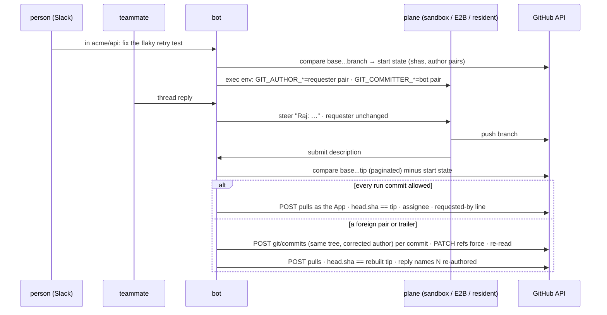
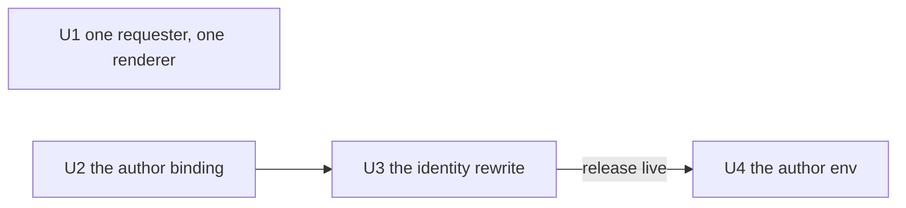

# The requester authors the commits - the requester rule, the author binding, the identity rewrite, the author env - Plan

## Goal Capsule

- **Objective**: Build [record 0062](../decisions/0062-the-requester-authors-the-commits-the-bot-commits-and-opens-them-and-a-run-keeps-the-requester-who-started-it.md): every commit a run makes is authored by the run's requester and committed by the App's own bot user; the bot opens the pull request as itself with the requester as assignee; a person's GitHub login is bound by a holder of `identity:write` or by GitHub's own link of their email, never by the person alone; before the bot opens or edits a pull request it rewrites the identities of the commits the run pushed, as exact pairs, to the requester's and its own; the requester of a run is the sender of the event that started it and every later sender is named in the transcript.
- **Authority**: record 0062 (proposed; this plan is the artifact its acceptance is judged on) over [record 0042](../decisions/0042-a-dashboard-session-is-the-person-its-email-names-identity-not-authority.md) (identity, never authority; unchanged), [record 0051](../decisions/0051-a-thread-has-one-owner-for-its-life-a-message-is-one-event-in-a-chosen-mode-and-a-pipeline-idles-instead-of-ending.md) (the fold rule; extended), [record 0048](../decisions/0048-the-git-door-a-cold-runs-only-github-credential-is-its-run-bearer.md) (the door's default-branch rule on the cold planes; relied on), [record 0053](../decisions/0053-viewing-as-a-person-borrows-their-ceiling-and-keeps-your-name-on-the-line.md) (no write as another person; upheld).
- **Execution profile**: four units, each one pull request through the review loop, tests first. U1 and U2 are independent and may run in parallel. U3 depends on U2. U4 depends on U3 and **must not merge before U3 is live**: the environment that puts a person's name on a commit lands only once the rewrite that makes it true is deployed. Two by-hand receipts gate U2's email match and two gate U4 (Verification Contract).
- **Stop conditions**: a unit that would hold, mint or exchange any credential of a person's stops and hands back a deviation. A unit that finds a fourth rendering of another sender's words, or a reader of `mergeFollowUps` the record does not name, hands back a deviation before changing it. A unit that would change the pull request's opener, rewrite a commit outside the run's own range or change a tree, or teach any image a person's `user.*`, stops. Nothing here adds a Worker, a table, a store or a secret.
- **Tail ownership**: each pull request merges through the review loop; the by-hand receipts and the live receipts are the maintainer's; U4 waits on U3's `/healthz` build commit.

---

## Product Contract

### Summary

A run record names the person on every child, steer and resume, and that identity stops at the sandbox wall: every commit is `switchboard-bot`'s, an address for a login nobody holds, and every pull request is opened by the App from a body that never names the requester. A teammate who replies first after a run ends becomes the requester of the fresh turn, and a live steer reaches the model as bare text with no sender. This plan carries the requester to GitHub through git's author field, set in the per-exec environment every plane already takes and made true by the bot over the Git Data API before it opens the pull request; binds people to logins only through a dedicated grant or GitHub's own link; and fixes the requester of a run at its first event.

### Problem Frame

The maintainer asked for identity through to the result without authority, and for a thread takeover to be unable to change whose name is on the work. The code already separates identity (`userId`) from authority (the actor's grants) on every surface; the gap is the last hop and the trust of a new binding. The design closes the hop with `GIT_AUTHOR_*` and `GIT_COMMITTER_*` in the run's environment, corrects deviations with a deterministic rewrite where the bot already opens the pull request, and refuses the one write that would make impersonation trivial: a person typing a login into their own scope.

### Requirements

**One requester for the run's life (record 0062, "One requester for the run's life")**

- R1. `mergeFollowUps` takes the fresh turn's identity (`userId`, `userName`, `authenticatedAs`, `postedBy`, `sourceUrl`, the channel handle) from the **first** unconsumed input; the merged text is the attributed join (`<sender>: <text>` per event in arrival order, attachments concatenated) rendered by one shared function, the fold's. `FollowUpInput` and `followUpOf` carry `authenticatedAs` and `postedBy`, which the in-memory follow-up drops today.
- R2. `followUpPrompt` renders each drained follow-up attributed to its sender through the same function; the two headers (mid-task, superseded) are unchanged.
- R3. The fold renderer moves out of `src/core/dispatch/admission.ts` to a module both `threadAdmission.ts` and `admission.ts` import; no second copy remains.
- R4. A fresh turn is admitted on its requester's actor: the agent gate, the repository gate and the router's preset list decide on the first sender, and a refusal is the one every unauthorized follow-up gets.

**The author binding (record 0062, "The binding's trust")**

- R5. `Scope` gains `github?: { login: string; id: number; via?: "email" } | string`; a bare string is a login a `config.yaml` author wrote, resolved to `{ login, id }` once at first use and cached for the process. `validateScopeBlocks` refuses a malformed login (GitHub's rule: 1 to 39 characters, alphanumerics and single hyphens, not leading or trailing), a login ending in `[bot]`, a non-integer id, and one login or one id under two `users` ids across `config.yaml` and the runtime overrides together, naming both. The key is valid only under `users`.
- R6. A new action `identity:write`, declared by the `config.set` and `config.clear` commands beside `config:write`, held by `all` and by a named grants entry and by no baseline. A new policy row `identity:write` on `config-scope { user }` with `has-grant(identity:write)`. `grantsFor` and every baseline are otherwise untouched.
- R7. A `user` scope target for `config set` and `config clear` (`config set user --user <slack id> --github <login>`), admitted by the R6 row. The write resolves the login (`GET /users/<login>`) and stores `{ login, id }`; a 404 is refused by name. Reads of a binding resolve by id (`GET /user/<id>`); a stored id whose current login differs from the stored login is refused with one `[identity]` line, never followed.
- R8. The `me` scope refuses `--github` on `set` before the handler runs, with one sentence: "your GitHub login is set by an identity admin or found from your email; it is not yours to type", reason `identity` on the audit line, and `config clear me` preserves the key. The refusal is the registry door's, so every surface says the same words.
- R9. The **email match** (`src/execution/authorBinding.ts`): for a requester with no binding whose run holds a `write` identity, the bot reads the person's Slack profile email (`resolveUserEmail`, given a 1.5 s bound and a per-person cache it lacks today), escapes it into `GET /search/commits?q=author-email:<email> org:<organization>` over the read token, and binds exactly one linked `author.login` across the answer, resolved to its id; zero or two bind nothing. Fail-open on error or timeout; one search per unbound person, remembered for `PERSON_LINK_TTL_MS` on a miss and forever on a hit (the override). A hit is written to the runtime overrides as `users.<id>.github: { login, id, via: "email" }` with one `[identity]` audit line. The module ships in U2 with its tests; its run-time trigger is the `bindingOf(person)` call U4 adds to `githubEnvs` (R18), the one place a run resolves its requester pair, so until U4 nothing calls the match on a run.
- R10. No policy rule reads the binding. `effectiveGrants`, `resolveChatActor` and `chatActorOf` are untouched.

**The identity rewrite (record 0062, "The identity rewrite")**

- R11. The dispatch records the **start state** of the run's branch on `CodingPrTarget` when it attaches or clones: the set of `(sha, author pair, author date, message)` of the commits on the branch and not on its base (`GET /repos/{o}/{r}/compare/<base>...<branch>`, paginated), empty for a new branch or a branch equal to its base, `unknown` when the read fails.
- R12. `src/execution/identityRewrite.ts` reads the paginated compare `<base>...<pushed tip>` and takes as the **run's commits** every listed commit whose sha is not in the start state. It answers `unreadable` when `total_commits` exceeds 300, when the start state is `unknown`, or when the read fails.
- R13. Per run commit, merge commits included: the author pair is the requester pair, the bot pair, or a start-state author pair on a commit whose `(author pair, author date, message)` equals a start commit's (the **start fingerprint**; a start pair on any other commit fails); the committer pair is the bot pair; every `Co-Authored-By` trailer parses to the requester pair or the bot pair; every other trailer is kept as written. The bot pair is `resolveGithubIdentity()`'s login and `<id>+<login>@users.noreply.github.com`; the requester pair is the binding's login and `<id>+<login>@users.noreply.github.com`. A requester with no binding has no requester pair. Pairs are exact `(name, email)`.
- R14. From the first commit that fails R13 through the tip, the bot rebuilds the chain over the Git Data API: `POST /repos/{o}/{r}/git/commits` with the same `tree`, the rebuilt parents (all of them, for a merge), the message with foreign `Co-Authored-By` lines removed, `author` kept when it already passes R13 and otherwise corrected to the requester pair (the bot pair when the requester has none), always with the original `author.date`, and `committer` sent explicitly as the bot pair (the API defaults the committer to the author it is given); then `PATCH /repos/{o}/{r}/git/refs/heads/<branch>` `{ sha, force: true }` to the rebuilt tip. A 422 or 409 from a ruleset (force pushes blocked, signed commits required) is `unreadable` with the rule named. Then it re-reads the compare and requires every run commit to pass R13; a tip that moved meanwhile is rebuilt once more; a third disagreement is `unreadable`. The result carries the count rewritten and the identities replaced.
- R15. Sites: `runCodingPrPostStep` before `openPullRequest` and before an edit of an existing pull request; ship's recover path (`recoverPushedBranch`) before it opens. On `unreadable` nothing is opened or edited and the reply says why. After an open or edit the post step reads the pull request's `head.sha` and requires the rebuilt tip; a mismatch runs R14 once more and re-reads. The reply note and the `pr_opened` event carry the count rewritten; an `[identity]` audit line carries the count and the identities replaced.
- R16. At open, the bot adds the requester's bound login as assignee after `GET /repos/{o}/{r}/assignees/<login>` answers 204; a 404 skips it with one log line. The rendered body gains one bot-written line in the agents block, "Requested by @<login> in <surface>; steered by <names>", the login only when a binding exists, the steerers' display names from the run's follow-ups; the agent's description object is unchanged.
- R17. Until U4 flips `authorEnvEnabled`, the requester pair is not read: the allowed authors are the bot pair and the start pairs, and a rewrite sets the bot pair.

**The author env (record 0062, "The author env on every plane")**

- R18. `githubEnvs` in `src/execution/factory.ts` adds, for a `write` identity, `GIT_COMMITTER_NAME` and `GIT_COMMITTER_EMAIL` as the bot pair always, and `GIT_AUTHOR_NAME` and `GIT_AUTHOR_EMAIL` as the requester pair for a bound requester or the bot pair otherwise; nothing for `read` or `none`. The requester pair comes from `bindingOf(person)` (R9), which reads the stored binding and, for an unbound person, runs the email match once; this is the match's one run-time trigger. The sandbox and E2B receive it through the resolver they share; the resident receives the same four variables in the `/exec` body `env` the bot already fills (`src/execution/resident.ts`), injected through `validateEnvNames`.
- R19. Every image's `user.email` fallback moves off the GitHub domain (`switchboard-bot@switchboard.invalid`, the resident's likewise); `user.name` is unchanged; no image names a person.
- R20. The sandbox, E2B, bot and resident images gain a `prepare-commit-msg` hook through `core.hooksPath` that appends `Co-Authored-By: <bot pair>` when the message has no `Co-Authored-By` naming the bot; the pair is read from `GIT_COMMITTER_NAME`/`GIT_COMMITTER_EMAIL` at commit time so the image stays installation-agnostic.

### Scope Boundaries

- Not here: the pull request's opener (stays the App); any person's token, OAuth link or user-to-server exchange; verifying identities at the git door; rewriting commits outside the run's own range or changing any tree; carrying a second human co-author; a dashboard control for the binding (a check-in with the maintainer first).
- No new store, table, Worker, secret or credential.
- Slack's visible behaviour is unchanged except one clause: a reply that opened a pull request says how many commits were re-authored when any were.

### Deferred to Follow-Up Work

- A GitHub OAuth link as the third binding path, if the guessed fact fails (an unconfirmed address links a commit) or the by-hand yield count comes in under half.
- Telling a person with no binding, once, how to get one (record 0062 open question): decided at U4's first live run under quiet verbosity.
- A settings-page control for the binding: needs the maintainer's check-in on the surface.
- A legitimate second human co-author on a run's commits.

### Open Questions

None blocking. The record's one open question resolves at U4's first live run.

---

## Planning Contract

### Key Technical Decisions

- KTD1. **Identities are set by the plane and made true by the bot, never requested of the model.** Env beats every `git config` level, so the correct pairs are what happens when the model does nothing; the bot corrects deviations over the API before it opens, where `core.hooksPath` and `--no-verify` cannot reach, and no model round is spent on one deterministic command.
- KTD2. **The run's commits are judged against the base, less the start state.** `base...tip` keeps a rebase or merge onto a newer base out of the range; subtracting the start state by sha keeps earlier rounds, earlier requesters and adopted pull requests out; keeping a start-state author pair on a commit with that start commit's author date and message (the fingerprint a rebase preserves) keeps a rebase of those commits from re-authoring them, while a start pair on new content is rewritten. Chosen over `start...tip` (drags the base's commits in), over a patch-id match (no API for it) and over start pairs allowed anywhere (lets the model author new work as a prior person).
- KTD3. **Exact pairs, trailers included.** GitHub links by email and displays the name; co-authors render avatars. A login-only or name-only rule lets three spoofs through.
- KTD4. **The bot pair is the App's id-anchored noreply, set by env.** The images' `switchboard-bot@users.noreply.github.com` names an unregistered, claimable login; the App's bot user has a durable id. The image fallback leaves the GitHub domain so it can never link to anyone.
- KTD5. **A dedicated `identity:write` action.** `config:write` is the channel-config right, grantable by name to plain users, surfaces and tokens; a holder could bind any unbound person to any login.
- KTD6. **The numeric id is the durable key.** A renamed login 404s and is claimable; `GET /user/<id>` follows the account.
- KTD7. **The email match is a guess with its test before the unit.** GitHub's docs say commits link to an address "connected to your account", not a confirmed one; the maintainer's scratch-account test decides whether the match ships or OAuth replaces it.
- KTD8. **A rewrite, not a refusal.** The Git Data API rebuilds a commit with the same tree and a corrected author in one call per commit and the App as committer for free; a refusal would spend a coding round, need a new round kind and ending, and leave a foreign identity on a branch after a terminal miss. The rewrite also removes the round-end read: a review child never pushes.
- KTD9. **First sender is the fresh turn's requester.** Matches record 0051's owner rule and the spawn rule; a later sender with wider grants lends nothing.
- KTD10. **Bot-only until U4** (`authorEnvEnabled`). U3's release proves the rewrite on every run before any person can be named.
- KTD11. **Spec rows change in the unit that changes the behaviour**: thread-admission in U1; authorization and routing-and-config in U2; agent-coding, agent-ship and pr-description in U3; execution, resident-repos and harness-pi item 4 in U4.

### High-Level Technical Design

Unit dependency order:

### Assumptions

- `foldThreadEvents`'s callers in `admission.ts`, `mergeFollowUps`'s two callers (`settle.ts`, `reattach.ts`) and `followUpPrompt`'s two callers (the pi and OpenCode harnesses) are all of them; U1 re-runs the grep first.
- The compare endpoint's three-dot form lists commits reachable from the head and not from the base, returns `commits[].author` and `commits[].committer` as user objects or null beside `commit.author` and `commit.committer` `{ name, email }`, carries `total_commits`, and pages with `per_page`/`page`; U3 verifies against one real branch first.
- `POST /git/commits` keeps the given tree and honours an explicit `committer` and `author.date`; `PATCH /git/refs` with `force` moves a branch to a non-ancestor; a rebuilt commit is unverified (GitHub signs an API commit only when neither author nor committer is given); U3 verifies with one scratch commit over the write token first.
- Commit search with `author-email:` answers over the App's installation read token; U2 tries one real query first, and a refusal drops the match (deviation, not workaround).
- The dispatch knows the branch's base at attach or clone on every plane (`CodingPrTarget`'s base resolution); U3 verifies the seam before the module is written.
- The next round's attach or clone takes the remote tip after a force-move, as it does after any force-push today; U3 verifies on the resident with one moved branch.

---

## Implementation Units

### U1. One requester, one renderer

- **Goal**: A fresh turn's requester is the first unconsumed follow-up's sender with its credential, every drained or merged follow-up names its sender, and one function renders the attribution for the fold, the live steer and the fresh turn.
- **Requirements**: R1, R2, R3, R4 (thread-admission items 1, 3, 4 and 9).
- **Dependencies**: none.
- **Files**: `src/core/threadEvents.ts` (new: `foldThreadEvents` moved here) and `src/core/threadEvents.test.ts` (new); `src/core/dispatch/admission.ts` (imports the move; `followUpOf` carries `authenticatedAs` and `postedBy`) and `src/core/dispatch/admission.test.ts`; `src/core/threadAdmission.ts` (`FollowUpInput` gains the two fields; `mergeFollowUps` first-sender identity and attributed text; `followUpPrompt` attributed) and `src/core/threadAdmission.test.ts`; `src/core/dispatch/settle.ts` (`prepareFreshTurn` builds from the first pending input) and `src/core/dispatch/settle.test.ts`; `src/core/dispatch/reattach.ts` and `src/core/dispatch/reattach.test.ts`; `src/core/harness/pi/harness.test.ts` and the OpenCode harness test (the prompt's shape); `docs/reference/specs/thread-admission.md` (items 1, 3, 4, 9).
- **Approach**:
  1. Grep for `foldThreadEvents`, `mergeFollowUps`, `followUpPrompt`, `followUpOf` and `pending[pending.length - 1]`; hand back a deviation on any caller the Assumptions do not name.
  2. Tests first: `mergeFollowUps` over two senders yields the first sender's identity, credential included, and `A: …\n\nB: …`; `followUpPrompt` names each sender; `prepareFreshTurn` runs on the first sender's channel handle and identity; the reattach path the same; a first sender who may not run the agent is refused with the existing refusal text.
  3. Move the renderer; widen `FollowUpInput`; rewrite the two functions; adapt `prepareFreshTurn` and the reattach; update the harness tests' expected prompt.
  4. Spec rows: item 1 (a follow-up carries the sender's credential), item 4 (the fresh turn's identity is the first sender's, its text attributed), item 3 (the superseded batch names senders), item 9 (the fold's renderer is shared).
- **Patterns to follow**: `foldThreadEvents`'s `senderName ?? sender` fallback; the refusal seam (record 0054).
- **Test scenarios**:
  - Two follow-ups from `slack:UA` (with `authenticatedAs: http:t1`) then `slack:UB`: merged identity is A's with the credential, text is `A: one\n\nB: two`, attachments concatenated in arrival order.
  - One follow-up: text is `A: one`, identity A.
  - `followUpPrompt` with two inputs renders the mid-task header then `- A: one` and `- B: two`; with `superseded: true` the superseded header.
  - `prepareFreshTurn` over pending `[A, B]` starts the root on A's channel and carries A's `authenticatedAs` and `postedBy`.
  - A fresh turn whose first sender may not run the addressed agent is refused and B's grants do not admit it.
- **Verification**: the test files green, red first; `npm run specs:check`; `npm run verify`.

### U2. The author binding

- **Goal**: A person's GitHub login and id are one validated key in their user scope, written by an `identity:write` holder through `config set user`, refused on `me` by one sentence at the door, or found once by the email match and written as an override; no grant reads it.
- **Requirements**: R5, R6, R7, R8, R9, R10 (authorization.md new item; routing-and-config.md new item).
- **Dependencies**: none. The email match module ships only after the maintainer's scratch-account receipt (Verification Contract) says an unconfirmed address does not link; a failure removes R9 from this unit and files the OAuth record.
- **Files**: `src/config.ts` (`Scope.github`; `clear` preserves the key); `src/config/validate.ts` (`validateScopeBlocks`: the login rule, `[bot]`, the id, duplicates across both layers, `users` only) and `src/config/validate.test.ts`; `src/core/authz/policy.ts` (the `identity:write` row) and `src/core/authz/policy.test.ts`; `src/core/authz/grants.ts` (no baseline change; a test pins that `identity:write` is never a baseline) and its test; `src/core/commands/config.ts` (the `user` scope target, `--user`, `--github`; the `me` refusal; `identity:write` declared on `config.set`/`config.clear`) and `src/core/commands/config.test.ts`; `src/execution/authorBinding.ts` (new: `bindingOf(person)`, `resolveLogin`, `resolveById`, the email match, the per-login cache) and `src/execution/authorBinding.test.ts` (new); `src/channels/slack/lookups.ts` (`resolveUserEmail` gains a bound and a per-person cache) and `src/channels/slack/lookups.test.ts`; `docs/reference/specs/authorization.md` (new item: the binding is identity, its two writes, the refused third, the action); `docs/reference/specs/routing-and-config.md` (new item: the `github` key, the `user` scope target, `clear` preserving it).
- **Approach**:
  1. Verify the two GitHub facts with one real read each over the read token (`GET /search/commits?q=author-email:… org:…`; `GET /user/<id>`); a refusal on search drops R9 as a deviation.
  2. Tests first: the validator's refusals; the row and the never-a-baseline pin; `config set me --github x` refused at the door on every surface with the one sentence and `config clear me` keeping the key; `config set user --user slack:U1 --github ivy-dev` admitted for an `identity:write` holder and refused for a `config:write` holder without it; the id resolution, the rename refusal; the email match's exactly-one rule, its fail-open, its once-per-person memory, its override write and audit line.
  3. Write the schema key, the validator, the action and row, the command arm, the module; wire nothing that reads the binding for a run yet (U3 reads the stored binding; U4 wires `bindingOf`, and with it the match, into `githubEnvs`).
  4. Spec rows as named.
- **Patterns to follow**: `addressSeverityProblem` for a refused key by name; `boundRequester` and `resolvePersonByEmail` for a cached, single-flighted, fail-open lookup; `resolveGithubIdentity` for the `GET /users` read.
- **Test scenarios**:
  - `users.slack:U1.github: "ivy dev"` fails naming the id and the rule; `"ivy-dev[bot]"` fails; `{ login: "ivy-dev", id: 4242 }` under two ids fails naming both; the same id under two logins fails; `channels.C1.github` fails by name; a `config.yaml` login and an override `{ login, id }` for the same login under two ids fails.
  - `config set me --github ivy-dev` from Slack, the CLI and the dashboard chat answers the one sentence with reason `identity`; `config clear me` removes `models` and keeps `github`.
  - `config set user --user slack:U1 --github ivy-dev` by an `identity:write` holder writes `{ login, id }` after `GET /users/ivy-dev`; a 404 refuses by name; a `config:write`-only actor is refused by the table.
  - `resolveById(4242)` answering login `ivy-renamed` for a binding stored as `ivy-dev` is refused with the `[identity]` line and yields no pair.
  - The email match: one linked login across three commits binds `{ login, id, via: "email" }`; two distinct logins bind nothing; an unlinked author binds nothing; a 1.6 s search binds nothing and the next run within the TTL does not search again; the escaped `q` carries the email verbatim as a quoted qualifier.
  - `effectiveGrants` and `chatActorOf` produce identical output with and without the key.
- **Verification**: the test files green, red first; `npm run specs:check`; `npm run verify`.

### U3. The identity rewrite

- **Goal**: Before the bot opens or edits a pull request, the commits the run pushed carry only the allowed identities, rewritten over the Git Data API where they did not, with the tip pinned, the count named in the reply and the event, and the requester as assignee with one requested-by line.
- **Requirements**: R11 to R17 (agent-coding item 2; agent-ship items 10 and 15; pr-description item 5).
- **Dependencies**: U2 (the binding read). Ships with `authorEnvEnabled` off (R17).
- **Files**: `src/execution/identityRewrite.ts` (new: the run's commits, the allowed set, the rebuild, the re-read) and `src/execution/identityRewrite.test.ts` (new); `src/execution/githubPulls.ts` (`compareRange` paginated, `createCommit`, `forceMoveRef`, `pullRequestHead`, `isAssignable`, `addAssignee`) and `src/execution/githubPulls.test.ts`; `src/core/codingPrPostStep.ts` (the start state on `CodingPrTarget`; the rewrite before open and edit; the head pin; the count in the note and the event; the assignee and the body line) and `src/core/codingPrPostStep.test.ts`; `src/core/dispatch/run.ts` and `src/core/dispatch/provision.ts` (record the start state at attach or clone) with their tests; `src/core/runEvents.ts` (`pr_opened` gains `rewritten?: number`); `src/core/prDescription.ts` (the rendered line) and its test; `src/channels/adminCoordinator.ts` (the recover path's rewrite) and its test; `docs/reference/specs/agent-coding.md` (item 2: the rewrite before the open, the pin, the count), `docs/reference/specs/agent-ship.md` (items 10 and 15: the recover path's rewrite), `docs/reference/specs/pr-description.md` (item 5: the requested-by line), `docs/reference/specs/run-history.md` (the event's field).
- **Approach**:
  1. Verify the compare, `POST /git/commits` and `PATCH /git/refs` shapes against one scratch branch over the tokens; verify the base and start-state seam on each plane; record the exact fields the module reads.
  2. Tests first: the module's `clean`, `rewritten` (author, committer, trailer, right login wrong name, another person's noreply; the count and identities), the start-state subtraction and the kept start pair through a rebase, `unreadable` (over 300; unknown start state; a failed read; a third head move); the post step rewriting before open and before edit, pinning `head.sha`, and carrying the count in the note and the event; the recover path's rewrite; the assignee pre-check and the line present only with a binding.
  3. Write the module over `RestGithubApi`; wire the two sites; the flag.
  4. Spec rows as named.
- **Patterns to follow**: `fetchPullRequestFacts`'s head-mismatch refusal; `openPullRequest`'s open-or-edit idempotency; the existing `POST /git/refs` in `githubPulls.ts` for the ref writes.
- **Test scenarios**:
  - Start state empty; two run commits authored `ivy-dev <4242+ivy-dev@…>`, committed by the bot pair, trailer the bot pair, binding `ivy-dev`, `authorEnvEnabled` on: `clean`.
  - Second commit authored `Raj <raj@example.com>`: `rewritten` 1, one `POST /git/commits` with `b2c3`'s tree, parent `a1b2`, author the requester pair, then a forced ref move, then a clean re-read.
  - A commit committed `ivy-dev <4242+ivy-dev@…>` (the model set `GIT_COMMITTER_*`): rewritten (the API sets the committer); committed `switchboard[bot] <victim@corp>`: rewritten.
  - Author `Ivy Real Name <bot address>`: rewritten; author `Raj <4242+ivy-dev@…>`: rewritten; a `Co-Authored-By: Raj <raj@…>` trailer: rewritten with the line dropped and the bot trailer kept.
  - The first offending commit is the third of five: commits four and five are rebuilt too, with the same trees and messages, and a clean chain results.
  - Start state `{ (c0c0, Ivy pair, date d0, message m0) }`; the run rebased `c0c0` to `c1c1` (same pair, date and message) and added one commit: `c1c1` keeps the Ivy pair by fingerprint, the new commit is judged.
  - Start state as above; the run adds a new commit authored the Ivy pair with a different message: rewritten to the requester pair.
  - The first offending commit is followed by a passing descendant carrying a fingerprinted start pair: the descendant is rebuilt (new parent) with its author kept.
  - No binding, `authorEnvEnabled` off, a commit authored the `ivy-dev` pair: rewritten to the bot pair.
  - `total_commits: 301`: `unreadable`, no writes; start state `unknown`: `unreadable`; the tip moved twice after two rebuilds: `unreadable`.
  - The post step on `unreadable` opens nothing and its note says why; on `rewritten` it opens, pins `head.sha` to the rebuilt tip, and the note and `pr_opened` carry `rewritten: 1`; a head mismatch after open runs the rewrite once more; the assignee is added after a 204 and skipped after a 404; the body carries the line only with a binding.
  - The recover path rewrites before it opens the same way.
- **Verification**: the test files green, red first; `npm run specs:check`; `npm run verify`. The maintainer cuts and deploys the release; U4 waits on its `/healthz` build commit.

### U4. The author env

- **Goal**: Every `write` run carries the bot pair as committer and the requester pair (or the bot pair) as author on every plane through the per-exec environment, the images' fallback address leaves the GitHub domain, the hook adds the agent trailer, and the rewrite reads the requester pair.
- **Requirements**: R18, R19, R20, R17 (execution.md; resident-repos.md; harness-pi item 4).
- **Dependencies**: U3 live (`/healthz` build commit); the maintainer's noreply-render receipt and yield count.
- **Files**: `src/execution/factory.ts` (`githubEnvs` → the four variables; `authorEnvEnabled` on) and `src/execution/factory.test.ts`; `src/execution/e2b.test.ts` and `src/execution/cloudflareSandbox.test.ts` (the env reaches the body); `src/execution/resident.ts` (the four variables in the `/exec` body `env`) and `src/execution/residentExecEnv.test.ts`; `deploy/cloudflare-sandbox/Dockerfile`, `Dockerfile`, `deploy/cloudflare-resident/Dockerfile`, `src/execution/e2b.ts` (the fallback address; `core.hooksPath`); `deploy/hooks/prepare-commit-msg` (new, shared by the images) and a shell test beside it; `docs/reference/specs/execution.md` (the identity env rule, the fallback address, the hook), `docs/reference/specs/resident-repos.md` (the exec env carries the pairs), `docs/reference/specs/harness-pi.md` (item 4: the four variables).
- **Approach**:
  1. The maintainer's receipts first (Verification Contract).
  2. Tests first: the resolver's cases; the resident body's `env` carrying the four variables and a header carrying none; the hook's idempotence and its reading of the committer env.
  3. Write the resolver change, the resident body change, the hook and its image lines, the fallback address; flip `authorEnvEnabled`.
  4. Spec rows as named.
- **Patterns to follow**: `githubEnvs`'s identity switch; the resident's `env` field in `src/execution/resident.ts` and `validateEnvNames`.
- **Test scenarios**:
  - `write` identity, bound requester: the four variables, author the requester pair, committer the bot pair; `write` unbound: author and committer both the bot pair; `read` and `none`: none of the four.
  - The resident `/exec` body carries the four; an `x-env-GIT_AUTHOR_NAME` header is not read.
  - The hook appends the trailer built from `GIT_COMMITTER_*` to a message without one and leaves a message that has it unchanged; `git commit` under the hook with the four variables set yields author = requester pair, committer = bot pair, trailer = bot pair; with none set, the image fallback name and a non-GitHub address.
- **Verification**: the test files green, red first; `npm run specs:check`; `npm run verify`; the live receipts below.

---

## Verification Contract

| Proof | Command or procedure | Units |
|---|---|---|
| Unit tests red then green, per unit | `npx vitest run <the unit's test files>` | U1 to U4 |
| The renderer has one home and the fresh turn takes the first sender with its credential | `npx vitest run src/core/threadEvents.test.ts src/core/threadAdmission.test.ts src/core/dispatch/settle.test.ts src/core/dispatch/admission.test.ts` | U1 |
| The `me` write is refused at the door on every surface; `identity:write` is never a baseline | `npx vitest run src/core/commands/config.test.ts src/core/authz/policy.test.ts src/core/authz/grants.test.ts` | U2 |
| The rewrite corrects every spoof in the U3 scenarios, keeps start pairs, touches nothing before the start and changes no tree | `npx vitest run src/execution/identityRewrite.test.ts src/core/codingPrPostStep.test.ts src/channels/adminCoordinator.test.ts` | U3 |
| Spec bindings resolve, coverage holds | `npm run specs:check` | U1 to U4 |
| The docs site builds over the spec rows | `npm run build -w docs` | U1 to U4 |
| The whole gate | `npm run verify` | U1 to U4 |
| Release order | U3's release is live on `/healthz` (build commit) before U4 merges | U3, U4 |
| Human-gated, before U2's email match: the guessed fact | The maintainer adds an unconfirmed address to a scratch account, pushes a commit authored with it to a scratch repository, and reads whether GitHub links the commit; a link drops R9 and files the OAuth record | U2 |
| Human-gated, before U2's email match: commit search over the App token | One `GET /search/commits?q=author-email:… org:…` over the installation read token answers 200 with `author` per item | U2 |
| Human-gated, before U3: the Git Data API writes | One scratch commit rebuilt with `POST /git/commits` over the write token, `author` and `committer` both given, shows the bot pair as committer with its avatar, the given author with the original date, and no Verified badge; `PATCH /git/refs` with `force` moves the scratch branch to it | U3 |
| Human-gated, before U4: the noreply render | One hand-made commit authored `<id>+<login>@users.noreply.github.com` on a scratch branch shows the user's avatar | U4 |
| Human-gated, before U4: the yield count | The maintainer runs the U2 match by hand for every active Slack person and posts hits over total on the tracking issue | U4 |
| Live, human-gated: a bound requester's ship | A routed one-unit task by a bound person opens a pull request whose commits show the person's avatar, committed by the App's bot user, with the person as assignee and the requested-by line | U4 |
| Live, human-gated: a foreign identity is rewritten | A coding run told in its task to set `--author` on one commit opens a pull request whose commits are all the requester's, with "1 commit re-authored" in the reply and the `[identity]` line in the log | U3 |
| Live, human-gated: a teammate cannot become the author | A second person replies in the unit thread during round 0; the pull request's commits are all the requester's; the body names the steerer | U4 |
| Live, human-gated: an unbound person is unchanged | A person with no binding runs a task; the commits are the bot pair's | U4 |
| Live, human-gated: the next round takes the moved tip | A ship whose round 0 was rewritten runs its review and a findings round on the rebuilt tip; the findings child's push descends from it | U3 |

---

## Definition of Done

- Every unit's tests are green and failed before its change; `npm run verify` passes on each pull request; each pull request carries its spec rows.
- U3 is released and live before U4 merges; the release's `/healthz` build commit is the receipt.
- The human-gated receipts above are posted on the tracking issue; the guessed fact's receipt decides R9 before U2 merges it.
- No person's token was held, minted or exchanged; the pull request's opener is the App on every receipt; no image's `user.*` names a person or a GitHub address; no rewrite changed a tree.
- Each unit's diff carries only the change it names: one renderer for other senders' words, no `pending[pending.length - 1]` identity read remains, no second copy of the fold, no commit outside a run's range is ever rewritten.
- Record 0062's status moves to accepted by the maintainer once the live receipts are posted.
