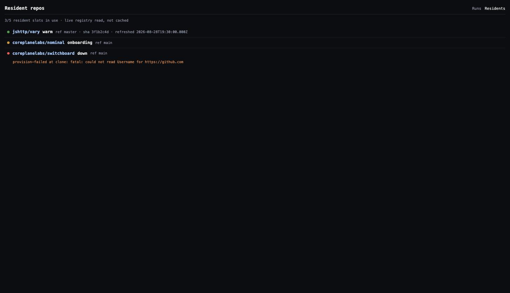
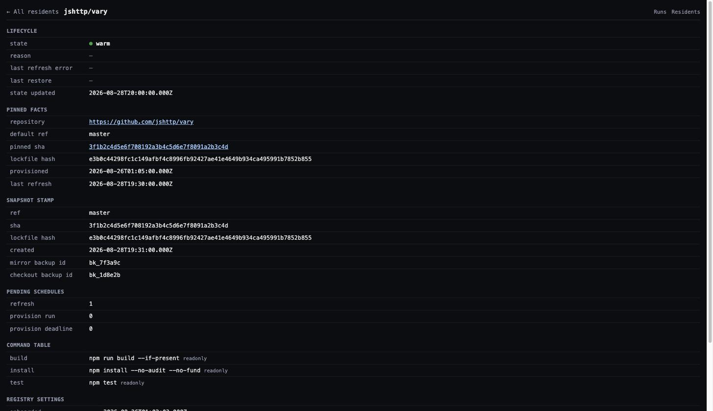

# Reference: dashboard routes

Every route below sits behind the dashboard's one identity gate unless noted. Which credential it checks is the `dashboard.auth` strategy in [config.yaml](configuration.md): `access` — a Cloudflare Access browser session or, for machine callers, a service token (the default when `ACCESS_TEAM_DOMAIN` and `ACCESS_AUD` are set); `token` — an `Authorization: Bearer` header holding the secret in `DASHBOARD_TOKEN` (or the env var `dashboard.token.env` names), which resolves to the one actor `dashboard.token.actor` names; or `none` — no credential, served only to loopback callers of a localhost deployment and refused everywhere else (the default without Access). None of them set caching headers that would let a proxy or browser cache a response beyond the request that made it (`no-store` throughout) — every load is live.

The header lists only the surfaces this installation has: **Residents** appears when resident environments are configured (`execution.resident`), **Costs** when `costs` is configured with its analytics token, the **Scheduled** tab when `schedules.worker` records firings. The docs link is always there: it opens the project's published site. The routes themselves still answer without their subsystem — with a `503` naming the config that turns them on.

| Route | Shows | Notes |
|---|---|---|
| `GET /runs` | Active runs, newest first | Default view excludes finished runs; each row's link carries that run's capability token — the index itself is gated specifically because of this |
| `GET /runs?all=1` | Active **and** finished runs | Only meaningful with `runHistory` configured — otherwise there's nothing finished to show |
| `GET /runs/<id>` | One run: request → steps (tool calls, results) → answer | Live via SSE while the run is active; served as a static page, no token needed, once it's in history |
| `GET /runs/<id>/events` | Raw SSE event stream for that run | What the run page itself consumes; resumable via `Last-Event-ID` |
| `GET /runs/<id>/friction` | Why a finished run was slow, if it was | Read-only diagnosis, no side effects |
| `POST /runs/<id>/stop?mode=soft\|hard` | — | Stops a live run; `soft` lets it wrap up and answer, `hard` aborts in-flight |
| `GET /residents` | Every onboarded repo, its lifecycle state, and its disk gauge (used/total) | The dashboard twin of `repo list` |
| `GET /residents/<owner>/<name>` | One repo's resident: mirror status, warm checkout, active thread worktrees, and its disk — used/total, free, the reserve it keeps back, headroom in "more trees", and every component (mirror, deps, checkout, each thread tree, leftover caches) | The same numbers the resident's attach admission decides on — see [onboard a repo → Disk](../how-to/onboard-a-repo.md#disk) |
| `GET /costs` | Daily spend across every configured group | Priced live from Cloudflare + (optionally) Anthropic billing data, nothing cached |
| `GET /costs/<group>` | Spend for one group | |
| `GET /costs/<group>.json` | Same data, machine-readable | For scripting/alerting, not for embedding a live dashboard elsewhere |
| `GET /mcp/connect/<nonce>` | The one-time MCP credential-paste form | Bound to whoever mints it or first opens it; single use, expires in 10 minutes |
| `GET /healthz` | `{ok, inFlight, draining, catchUp}` | **Not** gated — this is the process health probe, meant to be hit by the deploy tooling and the container platform |

## Command routes (`/api/<group>.<verb>`)

Every registered command has an HTTP twin behind the same dashboard gate, plus an MCP tool of the same name — one definition, every surface ([explanation](../explanation/one-command-many-surfaces.md)). A write is `POST`-only; a read takes either verb (`GET` with a kebab-case query string, `POST` with a camelCase JSON body). The `Scope` column is what an operator identity or service token must hold.

<!-- generated:api-routes · npm run docs:gen — generated from the code, do not edit by hand -->

| Route | Methods | Action | What it does |
|---|---|---|---|
| `/api/help.show` | `GET`, `POST` | `help:read` | What Switchboard can do: agents, per-request directives, and every chat command. |
| `/api/status.show` | `GET`, `POST` | `status:read` | Which build this process runs: version, commit, when it was built and started, runs in flight, draining. |
| `/api/config.show` | `GET`, `POST` | `config:read` | The effective agent/model/effort for you in this channel, the defaults, both scopes, and what is restricted. |
| `/api/config.set` | `POST` | `config:write` | Set the agent, model, or effort for a channel (gated) or for yourself; per-agent forms take --models.&lt;agent&gt; / --efforts.&lt;agent&gt;. |
| `/api/config.clear` | `POST` | `config:write` | Drop every runtime override of a channel (gated) or of yourself; static config.yaml values show through again. |
| `/api/config.instructions` | `POST` | `config:write` | Custom instructions for a channel (gated) or for yourself — advisory prompt content that never changes agent, model, or permissions. |
| `/api/runs.list` | `GET`, `POST` | `runs:read` | List runs (live and persisted, newest first) — metadata only, never message text. |
| `/api/runs.get` | `GET`, `POST` | `runs:read` | One run's record; `--include messages` adds its events with free text wrapped as untrusted content. |
| `/api/runs.events` | `GET`, `POST` | `runs:read` | A page of one run's events after `--after-seq` (server-capped); free text wrapped as untrusted content. |
| `/api/runs.friction` | `GET`, `POST` | `runs:read` | One run's friction diagnosis (live: computed now; persisted: as stored). |
| `/api/runs.stop` | `POST` | `runs:write` | Request a live run to stop (`--mode soft` = finish the current step; `hard` = abort now). Records the caller as the actor. |
| `/api/review.abridge` | `POST` | `review:write` | Abridge a finished PR review's reading diff with meat.dev on the bot host (one Opus-class call) and store it on the run; idempotent — a stored one is answered, not recomputed. |
| `/api/friction.report` | `GET`, `POST` | `friction:read` | Ranked recurring friction patterns across recent runs — read-only, GitHub never consulted. |
| `/api/friction.propose` | `POST` | `friction:write` | Run the self-improvement step: cluster recent friction, dedupe against open issues, file the top proposals as labeled issues. |
| `/api/repo.list` | `GET`, `POST` | `repo:read` | Every onboarded resident repo with its live state, ref, sha, last refresh, and disk gauge. |
| `/api/repo.onboard` | `POST` | `repo:write` | Onboard a repo as an always-warm resident environment (provisions billable compute; admin-gated). |
| `/api/repo.offboard` | `POST` | `repo:write` | Tear down a resident repo: registry record, schedules, container, R2 snapshots (admin-gated; --dry-run plans only). |
| `/api/repo.reconfigure` | `POST` | `repo:write` | Change a resident's default branch and/or command table (admin-gated; takes effect on the next refresh/attach). |
| `/api/repo.rebuild` | `POST` | `repo:write` | Discard a resident's snapshot and reprovision it from scratch (admin-gated; --dry-run plans only). |
| `/api/repo.test` | `POST` | `repo:exec` | Run the repo's onboarded test command with zero model turns (needs coding-agent access; the ref must be a plausible branch). |
| `/api/repo.build` | `POST` | `repo:exec` | Run the repo's onboarded build command with zero model turns (needs coding-agent access; the ref must be a plausible branch). |
| `/api/memory.list` | `GET`, `POST` | `memory:read` | Your own memory records and the shared org / repo / channel records, with ids — what influences your runs. |
| `/api/memory.forget` | `POST` | `memory:write` | Soft-delete one memory record so it no longer influences any run (yours freely; shared org/repo/channel records need repo-management rights). |
| `/api/mcp.list` | `GET`, `POST` | `mcp:read` | External MCP servers your runs in this channel can use — org-wide, this channel's, and your own — with state and agents; never a credential. |
| `/api/mcp.add` | `POST` | `mcp:write` | Register an external MCP server for yourself, this channel, or the org — auth is detected from the server; sign-in or a token happens on a one-time link, never in chat. |
| `/api/mcp.connect` | `POST` | `mcp:write` | A fresh one-time link to sign in to an OAuth server or enter (or replace) a bearer server's token — only you can complete it; it expires in 10 minutes. |
| `/api/mcp.show` | `GET`, `POST` | `mcp:read` | One MCP server's entry plus a live probe of the tools it offers (names, read-only flags); never a credential. |
| `/api/mcp.remove` | `POST` | `mcp:write` | Remove an MCP server you added and its stored credential (yours freely; channel ones need channel-config rights, org-wide ones admin rights). |
| `/api/schedule.list` | `GET`, `POST` | `schedule:read` | Every scheduled job (cron, UTC), which Worker fires it, its next firing, and what its last firing did. |
| `/api/deploy.plan` | `GET`, `POST` | `deploy:read` | The production deploy plan: checks, Worker order, preflight handling — computed, nothing executed. With --affected, also which Workers this tree actually needs deployed and why. |

<!-- /generated:api-routes -->

## Screenshots

**Residents index** — every onboarded repo, its state, last activity:

**Resident detail** — one repo's mirror, warm checkout, and per-thread worktrees:

## What's not on the dashboard yet

There is no `/mcp` listing page — `mcp list` in chat/CLI/HTTP is the current data contract for "what's connected." The frontend (`web/`) is a Vue 3 app served entirely from a JSON seed embedded in the page (no client-side data fetching to a separate API for the initial render), which is why every route above renders instantly with no loading spinner for its first paint.
