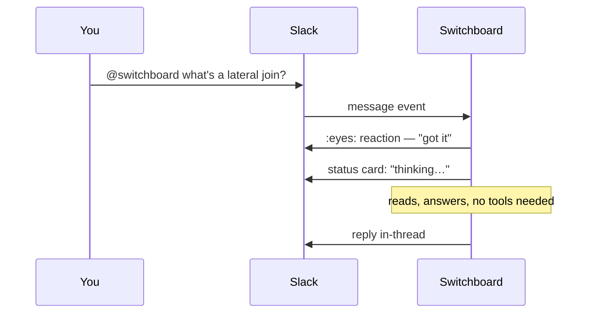

# Your first request in Slack

You'll send a message to Switchboard, watch it work, and follow up without repeating yourself. Ten minutes, no setup — if you can see the bot in a channel or DM it, you're ready.

## Say something

Mention the bot anywhere it's present, or DM it directly (DMs never need a mention):

```
@switchboard what's the syntax for a postgres lateral join?
```

Three things happen, in order:



The :eyes: reaction is your receipt that the request landed — if you never see it, the bot didn't get the message (check it's actually in the channel). The status card is a single message that gets edited in place as the agent works, so a long-running request doesn't spam the channel with progress notes.

## Follow up without re-mentioning

Reply in the same thread — no `@switchboard` needed:

```
what about a recursive CTE instead?
```

Once the bot has replied in a thread (or been mentioned anywhere in it), every reply in that thread reaches it. This also means the thread remembers what agent/model you were using — see [configure your defaults](../how-to/configure-your-defaults.md).

## Ask for something bigger

The default agent just answers. Point it at a real task and it hands off to a specialist:

```
@switchboard agent:coding in acme/api: add a retry to the webhook sender
```

`in acme/api` names the target. Any onboarded repo can be addressed by its full `owner/name` anywhere in the request, or by just its name right after the directives (`agent:coding in api: …`) when only one onboarded repo is called that; naming a repo this way also moves a thread that was on another repo. The status card shows which repo the run bound (`resident · acme/api · main@…`), so check it if the answer looks like it came from the wrong place. A name that isn't an onboarded repo is treated as ordinary prose, and if the registry can't be reached to check, Switchboard says so and starts nothing rather than guess.

This one opens a pull request. While it works, the status card links to a **live run page** — click it to watch the agent's steps (files read, commands run, tests) as they happen, not just the final answer. See [watch a run and check spend](../how-to/watch-a-run-and-check-spend.md).

## Try a few more

Directives combine, and the operator commands use the same grammar as a message:

```
@switchboard agent:review model:anthropic/claude-opus-5 review https://github.com/acme/api/pull/123
@switchboard config show
@switchboard config set me --models.coding openai/gpt-5
@switchboard config instructions me "Always reply in bullet points"
```

DMs to the bot work the same way, with no mention needed.

## When you're stuck

```
@switchboard help
```

lists every command. If a request gets refused, the reply names who to ask — permissions are per-agent and per-repo, and denials always say why.

## Next

- [Configure your defaults](../how-to/configure-your-defaults.md) — stop typing `agent:coding model:...` every time.
- [Reference: Slack commands](../reference/slack-commands.md) — the full command grammar.
